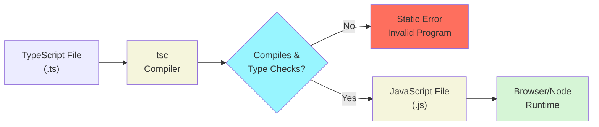

# Learning a New Programming Language

This chapter introduces TypeScript, the language we use for the rest of the course. Much of CPSC 110 carries over; what is new is mostly a matter of how things are written down and how much the language checks for you.

To make the transition concrete, we scaffold from the teaching languages you learned in 110. Each new concept is related back to the idea it corresponds to in the teaching languages, and the differences are called out as they arise. The next language you learn may offer no such scaffolding, and that is fine. Having built these comparisons once, you will know which questions to ask of any new language. If you came from another language this still applies, and if that language was Python, the notion of **types** will be new to you as well.

For brevity's sake, we'll use the term ISL ([Intermediate Student Language with Lambdas](https://docs.racket-lang.org/htdp-langs/intermediate-lam.html)) as shorthand for the teaching languages used in CPSC 110. Many ISL features are also present in BSL ([Beginner Student Language](https://docs.racket-lang.org/htdp-langs/beginner.html)).

## Software Systems and Programming Languages

Every software system is written in a programming language, and every language has to provide the same handful of basic capabilities: ways to name values, to make decisions, to repeat work, and to describe the data the program operates on.

The most obvious way languages differ is **syntax**. Syntax represents the required formatting and structure you must follow to express your thoughts in a way the computer can understand. 

<details class="tooltip link-110">
<summary>A Difference in Syntax: Prefix vs Infix</summary>

In ISL, to add 2 and 3, we write:

```racket
(+ 2 3)
```

In TypeScript we write:

```typescript
2 + 3
```

While the characters are different (syntax), both have exactly the same meaning. In programming languages, we call that meaning _semantics_.

More precisely, we would call any syntax where the operator appears before the operands `(+ 2 3)` or `+ 2 3` _prefix_ syntax. When the operator appears between the operands, such as `2 + 3`, we call this _infix_ syntax. 

In ISL, _all_ syntax was prefix. In TypeScript, most basic operations (e.g., addition, comparison) are written in infix syntax.
</details>

A more important way languages differ though is in the _mechanisms the language enforces for you_. A language can check things about your program before it ever runs, or it can leave those checks to you. 

Enforcement mechanisms are where TypeScript differs most from ISL. TypeScript makes **types** an explicit, checked part of the program, and it analyses and transforms your source code with a **compiler** before the program executes. The compiler catches many common programming mistakes and makes it easier to build large systems. 

Another big difference is that TypeScript primarily expresses control flow using **statements**, which differ from the expressions you used in ISL.

## Quick Primer on Functions

Functions provide a basic unit for containing functionality within a program. Function declarations are straightforward:

```typescript
function letterGrade() {
    // function body
}
```

The part of the declaration after the word `function` and before the first `{` is called its **signature**. When a function is called, its body is executed. The function above can be called by:

```typescript
letterGrade();
```

We will expand on function declarations later in this chapter.

## Types as a Language Mechanism

In ISL you documented type information as comments. A function's signature, like `(@signature Number -> String)`, told the reader what the function expected (a value representing a `Number`) and produced (a value representing a `String`). However, the language _did not check_ that those types were honoured. If you passed a string where a number was expected, the language did not object; the mistake surfaced later, when you ran the program and it did not do what you expected.

<details class="tooltip ts-tips">
  <summary>Basic Types: <code>number</code>, <code>string</code>, and <code>boolean</code></summary>

TypeScript provides several basic types to describe individual values. Three of the most common are `number`, `string`, and `boolean`. `number` is the standard numeric type that can be used for both integer (e.g., `3`) and floating point (e.g., `3.14`) values. `string` is used to describe textual data; these values are enclosed in either single quotes `'CPSC'` or double quotes `"CPSC"`, although it is best practice to be consistent about the kind of quote used in a program. `boolean` values provide means for capturing whether a value is `true` or `false`.

As the course progresses we will examine a few more basic types, and will spend considerable time describing how to design and construct complex types.
</details>

<details class="tooltip ts-tips">
  <summary>Arithmetic on <code>number</code> Values</summary>

TypeScript provides five arithmetic operators, each written in the infix style described above:

```typescript
2 + 3;    // 5,   addition
5 - 2;    // 3,   subtraction
4 * 3;    // 12,  multiplication
7 / 2;    // 3.5, division
7 % 2;    // 1,   remainder
```

Two of them behave differently from their ISL counterparts, and both differences follow from TypeScript having a single `number` type rather than separate integer and rational types.

`/` is _always_ floating-point division, so dividing two whole numbers can produce a fractional result: `7 / 2` is `3.5`, not `3`. Where ISL offered `quotient` for whole-number division, TypeScript has no operator that divides and discards the fraction.

`%` produces the _remainder_ left after division, the role that `remainder` played in ISL: `7 % 2` is `1`, and `6 % 2` is `0`. Its most common use is keeping a value inside a fixed range. To step through a list of `n` items and wrap back to the beginning, write `(i + 1) % n`, which returns to `0` as soon as `i + 1` reaches `n`.

`_`, `/`, and `%` are evaluated before `+` and `-`, as in ordinary arithmetic, so `2 + 3 _ 4` is `14`. Use parentheses wherever the grouping would otherwise be easy to misread.

Because a `number` is stored as a binary approximation, arithmetic on decimal values can produce results that are slightly off from the exact answer. We return to that, and to what it means when comparing computed values, later in this chapter.

</details>


In TypeScript you annotate each value with its type _directly in the code_, and the language checks those annotations for you when you invoke the compiler. This does two things:

- First, the type communicates _intent_: a well-chosen type tells the next reader exactly which kinds of values are valid. 
- Second, the type is _enforced_ by a **type checker** within the compiler. The compiler will report a wrong type of value as an error, rather than leaving it for you to discover the bug when you run the program. A whole category of mistakes is caught before the program runs.

<!--- NOTE arguments and parameters are covered in 110: https://cs110.students.cs.ubc.ca/reference/glossary.html --->

Extending our `letterGrade` example above, we will add the ability to pass in a numerical `score` out of 100 that we want to calculate the corresponding letter grade for. Recall that the named inputs a function declares (such as `score`) are its **parameters**, and the actual values passed in when it is called are its **arguments**. 

The following declares the function `letterGrade`, which takes a single parameter called `score` that must be a `number`. Further, the function returns a value that is always a `string`:
 
```typescript
letterGrade(score: number): string
```

<details class="tooltip ts-tips">
<summary>Function Signatures in TypeScript</summary>
The function signature:

```typescript
fn(x: X, y: Y, b: Z): A
```
defines a function with the name `fn`, with parameters: `x` of type `X`, `y` of type `Y`, and `b` of type `Z`. It also specifies that `fn` returns a value of type `A`. A function signature can have any number of parameters. 

Parameter types come after the parameter they type, separated by a `:`. The return type is placed after the parameter list, following a second `:`.
</details>

Note that the type checker _only_ helps where types are _written down_. In TypeScript we type the inputs and output of every function: each parameter gets a type, and so does the return value. These are the same places you would have written type comments in ISL.

<details class="tooltip link-110">
<summary>Signatures in ISL</summary>

In ISL, we would have captured the `letterGrade` type information as a comment in the signature:

```racket
; Number -> String
; produce the letter grade for a percentage score
(define (letter-grade score) ... )
```
or a signature annotation:

```racket
(@signature Number -> String)
; produce the letter grade for a percentage score
(define (letter-grade score) ... )
```

But either way, ISL does not use the signature to check that `letter-grade` is invoked correctly.

```racket
; no error reported before running the program
(letter-grade "Hello")  
```

</details>

## Compilation and Type Checking

In CPSC 110, DrRacket executed your program the moment you pressed `Run`. TypeScript adds a step that must be performed before your code can be executed. Before your program runs, it is analysed and transformed by a **compiler**, a program called `tsc`.

<!--- : that (1) checks your source code and ensures that the types are used consistently, then (2) transforms your input code into executable output code. --->

In particular, at the start of compilation, `tsc` invokes a type checker, whose job is to check whether your program is consistent with the declared types (i.e., has no **type errors**). If `tsc` finds a type error, it reports an error that you _must_ fix before your code can be executed.

<details class="tooltip ts-tips">
  <summary>Anatomy of a Type Error</summary>

Here are a few lines of code that call the `letterGrade` function signature we described above, and whether the compiler would allow them or they would result in an error:

```typescript
letterGrade(85);        // ok: 85 is a number
letterGrade(92.35);     // ok: 92.35 is a number
letterGrade("eighty");  // compilation error (A)
letterGrade(false);     // compilation error (B)
```

The compiler will tell you both where the error is and what is wrong with your code. For the two errors above, the compiler will point to the file and line number and give the following two messages:

```
(A) Argument of type 'string' is not assignable to parameter of type 'number'.
(B) Argument of type 'boolean' is not assignable to parameter of type 'number'.
```

The computer will not be able to execute the program until the invalid calls to `letterGrade` are fixed.
</details>

This changes when errors in your program are surfaced to you. In ISL and other dynamically-typed languages (e.g. Python), a type mistake surfaces _while the program runs_, and only if you happened to execute code that hits that type mistake. These are **runtime** errors, because they happen at the _time_ the program _runs_. Sometimes you'll see the term **dynamic**: this means the same thing as **runtime**. 

In TypeScript, the `tsc` compiler checks your types _first_, before execution. Any type errors in your _entire program_ are flagged to you to fix before your code can execute.  This is what is meant when we say that types help catch bugs "before runtime": the compiler is the thing doing the catching, before you execute (i.e., run) your program. We call these errors, and any other errors that are flagged _before running_ the program, **static** errors. 

The compiler sits between the source you write and the program that runs, and it is where static errors are caught before anything executes:


<!-- caption="Figure 01.01: How <code>tsc</code> type checks and transforms TypeScript before it can execute." -->

<details class="tooltip deep-dive">
  <summary>Tools for Writing Source Code</summary>

Because the compiler is now part of how you write code, you should write TypeScript in an Integrated Development Environment (**IDE**) rather than a plain text editor. Visual Studio Code is a free IDE you can download, and will be used for both the midterms and final exam, so getting used to that one would be a good idea. But you can also use other IDEs like WebStorm (which is free for students as well).

An IDE runs the language's type checker continuously in the background as you type and shows each error in place, on the line that caused it, the moment it appears. You no longer have to run `tsc` by hand and read through a list of errors; you see the same static checks reported right where you are working, which tightens the feedback loop as you write your code and make it work correctly. Live type checking is the feature that matters most to us today, but as the course continues we will engage with other features within the IDE as well.
</details>

## Control Flow Statements (<code>if</code> and <code>return</code>)


There are two main kinds of syntax in all programming languages: expressions and statements. ISL is built almost entirely from **expressions**. Every chunk of ISL code is evaluated to produce a value, and that value is passed into the expression that contains it. 

TypeScript has expressions too, but it adds a second kind of construct: the **statement**. A statement's purpose is not to evaluate to a single value; it performs an action, such as making a decision or returning from a function. Often this action can change program **state**: _state_ includes the names that are defined (e.g., variable or function names), and the values those names take on. A TypeScript program is written as a sequence of statements that run in order.

We saw one type of statement already: the function definition. Today we will introduce two more kinds of statements. 

#### <code>if</code> statements

The `if` statement chooses whether to run a block of code based on a condition. Unlike ISL's `cond`, it does not evaluate to a value, it only directs which code runs. The `if` statement is the most basic **control flow** statement in most languages. By directing how the program executes, the `if` controls the flow of execution.

A basic if block is shown below. If the condition `grade >= 50` is `true`, the code labelled `// (A)` will execute. If the condition `grade >= 50` is `false`, the code labelled `// (B)` will execute. 

<!--- not talking about executing stuff after the if statement, because it kind of conflicts with returns ---->

```typescript
if (grade >= 50) {
    // (A) handle passing grade
} else {
    // (B) handle failing grade
}
```

<!--- note: code in between { } forms a block, not always a basic block. There could be another if statement in the block, and it would be a block but not a basic block. I don't think we need to introduce basic blocks yet.  --->

<!--- A contiguous sequence of expressions and statements that will always execute in order in a programming language is known as a **block**. In TypeScript, these represent statements between a `{` until the next branch statement (e.g, `if`) is encountered, or a closing `}` is encountered. This means that several statements could be included at `(A)`, and all would be executed in order if `<condition>` were `true`. ---->

Right now `(A)` and `(B)` are comments rather than concrete code; the code can be any sequence of statements.  The curly braces `{}` designate a **block**, which can contain a sequence of statements. This means that several statements could be included at `// (A)`, or `// (B)`. We'll give a concrete example once we introduce another type of statement.

The two sides of the if statement are referred to as **branches**.
When, in a certain run, the if condition (`grade >= 50` above) evaluates to true and we execute `// (A)`, we call this taking the **then-branch**. On the other hand, when the if condition (`grade >= 50` above) evaluates to false and we execute `// (B)`, we call this taking the **else-branch**.

It is common enough that we only want to execute code if a condition is true that an alternative version of `if` has no `else` statement:

```typescript
if (grade >= 50) {
    // code to run if grade is passing
}
```

This is identical to having an empty `else` block:

```typescript
if (grade >= 50) {
    // code to run if grade is passing
} else {
}
```


<details class="tooltip ts-tips"> 
<summary><code>if</code> Statements and Block Statements</summary>

A block statement is started by `{` and `}`. It groups together a list of statements:

```typescript
{ 
   <statement-1>;
   <statement-2>;
   <statement-3>;
}
```
so that first `<statement-1>` will run, then `<statement-3>` will run, etc. It can group together any number of statements. We use `<>` to designate that any statement can be held there, `<>` is _not_ part of the actual TypeScript syntax for blocks.

In general typescript, if you separate your statements with `;`, you can write them on the same line, and the meaning is the same: `{ <statement-1>; <statement-2>; <statement-3> }`. However, in this course, we will always put statements on separate lines for clarity.

If statements have two forms. First, the `if` (no else) statement:
```typescript
if (<condition>)
   <then-statement>
```

where `<condition>` is an expression that evaluates to a boolean, and `<then-statement>` is another statement. If `<condition>` is true, `<then-statement>` will be run, otherwise, it will be skipped. The parentheses around `<condition>` are **necessary**.

While technically `<then-statement>` need not be a block, in this class we will always make it a block statement, as this improves clarity:

```typescript
if (<condition>) {
   <block-contents>
}
```

The second form of `if` runs `<then-statement>` if `<condition>` is true, and runs `<else-statement>` if `<condition>` is false:

```typescript
if (<condition>)
   <then-statement>
else
   <else-statement>
```

Again, in the course we will always make `<then-statement>` and `<else-statement>` block statements:

```typescript
if (<condition>) {
   <then-block-contents>
} else {
   <else-block-contents>
}
```

There is one exception to this: we will allows `<else-statement>` to not be a block when it is another if statement. This allows us to create multi-condition statements, by chaining together `if-else` statements:

```typescript 
// else if version
if (<condition-1>) {
   <cond-1-then-block-contents>
} else if (<condition-2>) { // second if statement starts here
   <cond-2-then-block-contents>
} else {
   <cond-2-else-block-contents>
}
```

This `else if` syntax is clear enough that we don't add `{` around the second if statement. But the program would behave the same way if we did: 

```typescript 
// nested ifs version
if (<condition-1>) {
   <cond-1-then-block-contents>
} else {
   if (<condition-2>) { // second if statement starts here
       <cond-2-then-block-contents>
   } else {
   <cond-2-else-block-contents>
   }
}
```

Again, this is only a difference in _syntax_.

</details>


`if` statements can also be chained to ensure subsequent conditions hold before directing the control flow of the program. Let's use this to build up our `letterGrade` function:

```typescript
function letterGrade(score: number): string {
    if (score >= 80) {
        // function should evaluate to "A"
    } else if (score >= 68) {
        // function should evaluate to "B"
    } else if (score >= 55) {
        // function should evaluate to "C"
    } else if (score >= 50) {
        // function should evaluate to "D"
    } else {
        // function should evaluate to "F"
    }
}
```

In the code above once a true branch of one of the `if` statements is taken, no other code is executed. We've written what we intend in each branch---but how do we capture  "function should evaluate to" in TypeScript?

#### <code>return</code> statements

The `return` keyword is necessary to make functions in TypeScript return values.  The `return` statement hands a value back to whoever called the function and stops the function there. 

<details class="tooltip ts-tips">
<summary><code>return</code> Statements</summary>

`return <expression>;` evaluates the expression ` <expression>` to a value `v` (i.e., `2 + 3` to `5`), stops executing the function there, and returns this `v` to the caller of the function.

For instance, if `return <expression>;` is in the function `foo`, wherever the call `foo()` appears, when we execute `return  <expression>;` within `foo`, `foo` evaluates `<expression>` to `v`, and the call to `foo()` is then replaced with `v`.

The `return` statement only makes sense if it appears in a function definition (or method definition, which we'll see in Part 2).
</details>


The simplest example of a return statement looks like the function `getString` below; in this case the `return` statement ensures we always return the string `"STRING"` when this function is executed:

```typescript
function getString(): string {
    return "STRING";
}
```

To finish `letterGrade` and specify what `letterGrade` should evaluate to, we'll need to add `return` statements to the body.


```typescript
function letterGrade(score: number): string {
    if (score >= 80) {
        return "A";
    } else if (score >= 68) {
        return "B";
    } else if (score >= 55) {
        return "C";
    } else if (score >= 50) {
        return "D";
    } else {
        return "F";
    }
}
```

Each `return` exits the function immediately, so the order of the checks matters: a score of 95 is caught by the first `if` and never reaches the others.


<details class="tooltip link-110">
<summary><code>if</code> vs <code>cond</code> vs the Ternary (<code>?</code>) Operator</summary>

`if` operates very similarly to `cond`. 

An equivalent ISL function to `letterGrade` looks like:

```racket
; Number -> String
; produce the letter grade for a percentage score
(define (letter-grade score)
  (cond
    [(>= score 80) "A"]
    [(>= score 68) "B"]
    [(>= score 55) "C"]
    [(>= score 50) "D"]
    [else "F"]))
```

the TypeScript version says the same thing with statements: each `cond` clause becomes an `if` whose body returns that clause's value, and `else` becomes the final `return`. The behaviour is identical; what changed is that you spell out the control flow step-by-step rather than as a single expression.

The core difference between `if` and `cond` is that `cond` is an expression: `cond` evaluates to one value. The bodies of the functions you defined in ISL contained a single expression `e` (above,`e` is the `cond` expression) and `(letter-grade 87)` evaluates `e` with `87` in the place of `score`. 

In TypeScript, a function body is not a single expression: it is a list of statements which will be run in order. TypeScript functions will not return a value unless they are told to by a `return` statement. Later, we'll see that we might want to write functions that have no `return` statements at all. 

There does exist an expression in TypeScript that behaves like a 1-condition `cond`. It is called the **ternary operator**, and takes 3 operands (thus the "ternary"):
```typescript
<condition> ? <then-expression> : <else-expression>
```

Unlike an `if` statement, the `<then-expression>` and `<else-expression>` in the ternary operator must be single expressions. The single-expression limitation, and confusions that sometimes arise from the ternary operator's compact notation, are two reasons why it can often be preferable to just use `if` statements explicitly instead of `?`.

</details>


<details class="tooltip exercise"> 
<summary>Exercise: <code>{}</code> for clarity</summary>

In this class, we will use block statements as the statement after any `if` conditions. In the wild, you may see `if` statements that aren't followed by `{`. It's worth learning how to reason about those as well.

Consider the following piece of code:
```typescript
function toPassFail(s: number): string {
    if (s > 0) 
        if (s > 50) 
          return "PASS";
        if (s <= 50) 
          return "FAIL";
    else 
          return "NEGATIVE";

}
```
1. Suggest three inputs you would pass to `toPassFail` to check its behaviour.
2. Without executing the code, predict, for each input, what `toPassFail` would return.
3. Execute `toPassFail(i)` for each input `i` you've decided on. Does its return value match your prediction? Why or why not?
</details>


## Static and Dynamic Views of a Program

There are two natural perspectives through which you can view any program. The **static** view is what you see when you look at your source code. It is fixed text sitting in a file, and it can be read and analysed _without being executed_. Types you write down in a function signature are static, as is the overall structure of your code. The compiler works entirely in this static world, and it can check your types before the program runs.

But we do not just write programs for them to sit as text on a filesystem. We write programs to do things, which gives rise to the **dynamic** view of the program. When the code _executes_, it is run on some actual _inputs_, which cause variables in the code to take on different values, and control flow statements to follow different branches. Which branch an `if` takes, what a variable holds at a given moment, and how many times a piece of code runs are dynamic facts, decided as the program runs and often different from one run to the next.

Keeping these two views apart is useful because different kinds of problems appear in each. The compiler can rule out a whole class of mistakes statically, just by reading the text, but it cannot know what will happen once the program runs on a given input. That is why static checking, however good, never removes the need to run and test a program, a theme we will return to throughout the course.

## Validating the Dynamic View With Testing


While the TypeScript compiler checks the static view of the program, we need to check the dynamic view ourselves. We do this through a process called _testing_. 

In Part 1 of this course, we will use a `checkExpect`, a function call that can validate whether the actual output of a function aligns with its expected output when it is executed. A check is always given a name and handed to `test`, which registers it with the testing framework. For example, to ensure that `letterGrade(88)` evaluates to `"A"`, we can write the following test:


```typescript
test("Score of 88 returns an A", checkExpect(() => letterGrade(88), "A"));
```

This cannot be checked statically; we must execute the test to verify the program behaviour. If the call and the expected value evaluate to the same value the check passes; if they differ, the check fails with an error that describes the expected behaviour that was violated.

TypeScript does not natively have a `checkExpect`, we have built the utility to better align with 110 and require less syntax than most test approaches.

<details class="tooltip ts-tips">
<summary>Anatomy of a <code>checkExpect</code></summary>

A `checkExpect` takes two arguments:

```typescript
checkExpect(() => <actual>, <expected>);
```

`<actual>` is an expression whose value you want to verify. This is usually a call to the function under test, such as `letterGrade(88)`. It is wrapped in `() =>`, an _anonymous_ **arrow function** (a syntax we explain below), so that the expression is not evaluated where you write it: `checkExpect` decides when to run it. A parameterless function that wraps up a computation this way is called a **thunk**, programming jargon from the 1960s glossed as the past tense of _think_: an expression already thought about, set aside to be evaluated when it is needed. `<expected>` is the value you are claiming that expression should produce, such as `"A"`.

Note that there are no braces around `<actual>`, and no `return` in front of it. This is deliberate. An arrow function written as `() => <expression>`, with no `{ }`, _implicitly returns_ the value of that single expression, so `() => letterGrade(88)` is a function that returns `"A"` when it is called. Adding braces would change the meaning: `() => { letterGrade(88) }` calls `letterGrade` and then returns nothing, so the check would compare `undefined` against `"A"` and fail. Write the thunk as a single expression with no braces, and the value flows to `checkExpect` on its own.

When the check runs, it calls the thunk and compares the value it returns against `<expected>`. If they are equal, the check passes. If they differ, the check fails and reports a message describing the expected behaviour that was violated, so you can see which expectation failed and what was produced instead.

A `checkExpect` only does anything when it is executed, which makes it a _dynamic_ check: it reports nothing about the program until the program runs, unlike the type checker, which works on the static text. A check never runs on its own, either: it must be placed inside a named test case, which the testing framework runs for us.

</details>

<details class="tooltip ts-tips">
<summary>Anatomy of a Test Case</summary>

A test case gives a check a name and registers it with the testing framework by passing it to `test`. Both `test` and `checkExpect` are provided by the course toolkit, imported once at the top of a test file:

```typescript
import { test, checkExpect } from "@ubccpsc/210-toolkit/testing";

test(<description>, checkExpect(() => <actual>, <expected>));
```

`test` takes two arguments. `<description>` is a string that names the case, such as `"Score of 88 returns an A"`; it is printed in the test output, so it should state what the case verifies. The second argument is the check that forms the body of the test. Each test case holds exactly one `checkExpect`, so a test that fails always names the single expectation that was violated.

When the test suite is executed, each test file is executed top-to-bottom running each test in turn. If the check passes, the case passes; if it fails, the case fails, and the framework reports the case's description along with the message from the check that failed.

</details>

<details class="tooltip link-110">
<summary>Exact Numbers in ISL, Inexact Numbers in TypeScript</summary>

In ISL, dividing two integers gives an _exact_ rational number. `(/ 35 50)` is exactly `7/10`, and `(* (/ 35 50) 100)` is exactly `70`. Racket keeps the fraction rather than converting it to a decimal, so arithmetic on whole numbers stays exact however you order the operations.

TypeScript has a single `number` type, and it stores values as a binary approximation of the decimal you wrote. Most decimals cannot be represented exactly in binary, in the same way that `1/3` cannot be written exactly as a decimal:

```typescript
(11 / 20) * 100;    // 55.00000000000001, not 55
(29 / 50) * 100;    // 57.99999999999999, not 58
```

Two consequences follow, and both apply to any language that stores numbers this way:

- Order your arithmetic so that division comes last. `(11 * 100) / 20` gives exactly `55`, because the multiplication happens while the values are still whole numbers.
- Be careful comparing computed decimal values for exact equality. A test whose check is `checkExpect(() => (11 / 20) * 100, 55)` fails, even though the computed value is not visibly different from `55`.

</details>

Suppose we had a more fine-grained expectation of how letter grades should be computed and wrote the following test:

```typescript
test("Score of 95 returns an A+", checkExpect(() => letterGrade(95), "A+"));
```

In this case the test would fail, because `letterGrade(95)` evaluates to `"A"` in our current implementation. The type system cannot detect this failure statically; we rely on tests written and executed dynamically to detect this fault. 

<details class="tooltip ts-tips">
<summary>Arrow Functions</summary>
Arrow functions have two forms. The first has a single expression in its body:

```typescript
(x: X, y: Y, b: Z) => <return-exp>
```
this defines an anonymous function with  3 parameters (`x`, `y`, `b` of types `X`, `Y`, `Z`), which, when called, evaluates the expression `<return-exp>` with the given argument values, and returns the resulting value. There is no `return` keyword here, and there are no braces: a single-expression arrow function _implicitly returns_ the value of its expression. This is the form the thunks we pass to `checkExpect` always take.

The second form has a block expression as its body:

```typescript
(x: X, y: Y, b: Z) => {
    <statement-1>;
    <statement-2>;
    <statement-3>;
}
```

which can contain any number of statements. The braces mark the difference: once a body is a block, nothing is returned implicitly, so to return a value the `return` statement must be used. Writing `() => { letterGrade(88) }` therefore returns nothing at all, which is why the checks in this course are written without braces.  


</details>


<details class="tooltip link-110">
<summary>Lambdas</summary>

You have seen anonymous functions before: in CPSC 110 they were called **lambda expressions**. When you wrote a `lambda` to pass to an abstract function like `filter`, you were creating a function without naming it, right at the place it was needed:

```racket
(filter (lambda (n) (> n 5)) (list 3 6 9))
```

TypeScript's arrow syntax does the same job: `(n) => n > 5` means the same thing as `(lambda (n) (> n 5))`. The `() =>` in the check above is a lambda that takes no parameters, like `(lambda () ...)`. The expression under test is wrapped in an anonymous function so that it can be handed to `checkExpect` and executed later, just as `filter` decided when to call your lambda.
</details>

## Learning New Languages

Learning TypeScript is not starting over. The way you design data, break a problem into functions, and reason about behaviour is the same as in CPSC 110. 

What is new is mostly _enforcement_ and _form_. In terms of _enforcement_, we write types into the program and `tsc` checks them, rather than leaving them in an unchecked comment. In terms of _form_, we write conditional control flow  with statements like `if` and `return`, rather than as a single `cond` expression. 

Mapping constructs in a new language back to the ideas you already know from prior languages is what makes new programming languages quick to pick up. While this transition can be tricky this first time, with each subsequent language you learn, it will be easier and easier.


<details class="tooltip exercise">
  <summary>Exercise: Battery Status</summary>

_Note: End-of-chapter exercises will contain hints hidden like so: <span class="hint">hello I'm a hint!</span>. In general, these hints hide _design decisions_ which, by the end of the course, we expect you to be able to make on your own. However, if you are going through the exercise for the first time and want coding practice, you can reveal the hints._ 

Put this chapter's pieces together on a new problem: a typed function, an `if`/`return` chain, and a test.

> As a phone user, I want the battery percentage shown as a status word, so that I can tell at a glance how urgently I need to charge.

Write a function called `batteryStatus` that turns a battery percentage number into a status string. The function should return `"critical"` for numbers below 10, `"low"` from 10 up to (but not including) 30, `"ok"` from 30 up to 80, and `"full"` for 80 or above.

1. Write the function signature, <span class="hint">naming the parameter `percent` with the type `number`; the function should specify `string` for the return type.</span>
2. Implement the body <span class="hint">with a chain of `if` / `else if` / `else` statements,</span> <span class="hint">each branch `return`ing the right status.</span> The order of the statements will matter here!
3. Write one `test` per status, each holding a single `checkExpect`, choosing one representative percentage per case. Predict each result before running the tests, then run them.
4. What does the compiler report if you call `batteryStatus("low")`? Decide before you try it, then confirm.

</details>
