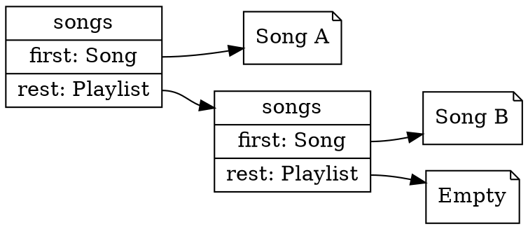

# Using Types to Model Problems

In the last chapter we used types to annotate individual values: a parameter was a `number`, a function returned a `string`, and the compiler checked that we used them consistently. These primitive types are enough when a program passes around single, unrelated values, but real information rarely arrives one value at a time.

Consider a song. A song is not one value; it has its musical contents, as well as much associated metadata.

<details class="tooltip exercise">
<summary> Exercise: What's in a song? </summary>

Take a minute to think about what a song _is_. What core data and metadata might you associate with a song? Does this change based on the application that consumes the song? (e.g., what if the song-playing application is individual vs. multiple users can interact with the same song?)

The data we choose to associate with a song below is _one example_ of how we might represent a song, but it's not the _only correct_ representation of a song.

</details>


For instance, a song has _at least_ a title, an artist, and a duration. This data only means something when associated to the _same_ song. With only primitive types we would carry these as three separate values and have to remember, everywhere, that they belong to the same song. Nothing would stop us from pairing one song's title with another's duration, or forgetting the duration entirely, or passing an _artist_ where a _title_ was expected (both are strings, so the compiler would stay silent). The information has a _shape_, and primitive annotations cannot capture it.

Other information cannot be expressed with primitives at all. A playlist is either _empty_ or _a song followed by another playlist_. This spells out two distinct cases, and the playlist can be any length. No single `number` or `string` means "either nothing, or a song and then more songs."

This chapter introduces the tools to describe information like this: **compound types** that group related values into one, model alternatives as distinct cases, and capture self-referential structure. Writing such a description down as a **data definition** does two things at once: it gives the program a shape to follow, and it lets the compiler hold us to that shape, catching whole classes of mistakes before the program runs.

This is the data-definition design you practised in CPSC 110, now written directly in the language and checked by the compiler.

## Assigning Values to Names

Before we build values of any type, we need a way to name them. In TypeScript we assign a value to a name with `const`: the name comes first, then its type, then `=`, then the value.

```typescript
const courseName: string = "CPSC 210";
const credits: number = 4;
```

A name introduced with `const` cannot be reassigned to a different value later: `courseName` will always refer to that one string. Every value in this chapter is named with `const`; names whose values are meant to change come later, when we look at mutation.

<details class="tooltip ts-tips">
<summary>Declaring Variables with <code>const</code></summary>

The syntax
```typescript
const x: T = e
```
declares a variable `x` of type `T` and initializes it to the value that expression `e` evaluates to. Variables declared with `const` cannot be reassigned to different values later. Also, you cannot use `const` to declare the same variable multiple times.

As with other one-line statements, we will put a semicolon `;` after it when writing it in programs.
</details>


Two values are worth knowing from the start because they stand for the _absence_ of a value: `null` and `undefined`. `null` represents a deliberate "no value here", such as the result of a lookup that finds nothing. `undefined` is the value a name has when nothing has been assigned to it yet. Each is its own type, and both become useful in combination with other types, as we will see when a function may or may not find a result.

```typescript
const noMatch: null = null;
const notSet: undefined = undefined;
```

<details class="tooltip link-110">
  <summary><code>const</code> vs <code>define</code></summary>

Where in ISL, you wrote
```racket
(define course-name "CPSC 210")
```
 to bind a name to a value, in Typescript we would write the same binding as
 ```typescript
 const courseName: string = "CPSC 210";
 ```
Note that in TypeScript, we add a type annotation that the compiler checks. Adding this extra information is marginally more work, but it allows the compiler to check basic bugs for us. For instance:

 ```typescript
 // static error: Type 'string' is not assignable to type 'number'
 const courseNum: number = "210";
 ```

</details>

## Modelling Information as Data

A **data definition** is a precise description of which values a type can express. As you design and interact with more software systems, you may grow to have your own process to derive these.

To get you started in this course, we propose a systematic process to turn a natural-language description of a problem into a type. The main steps are:

1. Identify the main entities.
2. Identify any distinct cases.
3. Determine what information each case needs.
4. Translate into a TypeScript type.
5. Write concrete examples to check your model.
6. Look for generalisation.

The rest of this chapter works through this process on the examples below, from the simplest to the most involved. As we go we will meet the building blocks TypeScript provides for specifying types: _primitive values_ for atomic facts, _literal union_ for fixed choices, types that _group_ related values together, and _self-reference_ for recursive structure.

<details class="tooltip link-110">
  <summary>Types and Data Definitions</summary>

This is the data-definition step of the design recipe from CPSC 110. There you described a class of values in a comment before writing any function. In CPSC 210, you'll write a similar description as a type the compiler can enforce, rather than a comment it ignores.

In CPSC 210, we won't grade you on following the systematic process described above: its purpose is to provide you with a process to tackle a design problem when you are initially stuck.

</details>

## Example: Traffic Lights

Consider the natural language description of traffic light data:

> As a driver, I want the intersection's signal to be exactly one of red, yellow, or green, so that I always know whether to stop, slow down, or go.

Let's apply our systematic process. One design is as follows:

1. _Entities:_ the signal at an intersection.
2. _Cases:_ it shows one of three colours: red, yellow, or green.
3. _Information per case:_ none; a colour is a bare label that carries nothing beyond itself.
4. _Translate:_ a value that is one of a fixed set of labels is exactly a _union_ of string literals.
5. _Concrete examples:_ one valid colour, plus an invalid one to confirm the type is enforced.
6. _Generalisation:_ none; a small enumeration stands on its own.

In this case, in step 4, we translate the data definition into the following typescript Type:

```typescript
type TrafficLight = "red" | "green" | "yellow";
```

For step 5, our concrete examples could be:

```typescript
const light: TrafficLight = "red";   // ok
const broken: TrafficLight = "blue"; // error: "blue" is not a TrafficLight
```


<details class="tooltip ts-tips">
  <summary>Union of Literals</summary>

A union of literal values restricts expresses that variables of that type can take on _exactly_ the specified literal values. The following, where `|` is read as "or":

```typescript
type TypeName = v_1 | v_2 | v_3;
```
expresses that values of type `TypeName` can take on exactly the values `v_1`, or `v_2`, or `v_3`.  There can be as many primitive values `v_i` as you want.

Above we used strings, but numbers work as literals too, so the same idea models any fixed set of values:

```typescript
type HttpStatus = 200 | 301 | 404 | 500;
```

</details>

## Example: Shuffle Modes

> As a listener, I want to set playback to one of off, on, or repeat-one, so that I can control how my music is ordered.

1. _Entities:_ the shuffle mode
2. _Cases:_ off, on, or repeat-one
3. _Information per case:_ information is totally encoded by the cases.
4. _Translate:_ again, we can use a union of literals:
```typescript
type ShuffleMode = "off" | "on" | "repeat-one";
```

5. _Concrete examples:_ again, we will have one correct and one incorrect mode:
```typescript
const mode: ShuffleMode = "on"; // ok
const mode2: ShuffleMode = "repeat-album"; //error
```
6. _Generalisation:_ nothing to generalize, all possible cases are expressed.


## Example: Songs

Let's move on to applying our systematic process to the song example we started with:

> As a listener, I want each song to carry its title, artist, and length, so that I can see what is playing and how long it will last.

1. _Entities:_ the only entity here is a _song_.
2. _Cases:_ A song has just one case: every song has the same shape, so there are no alternatives to distinguish.
3. _Information per Case:_ for the natural language description above, what is relevant is that a song carries three facts: a `title`, an `artist`, and a duration in seconds.
4. _Translate:_
A song's facts belong together, so we describe their shape with a **type**, which lists named properties and their types. It helps to keep two words apart: a _type_ describes a shape, but it is not itself a value. `Song` is the shape.

<!--- , listing the properties directly between braces; there is no `makeSong` function to call.--->
```typescript
type Song = {
  title: string;
  artist: string;
  durationSeconds: number; // must be positive
};
```

The type cannot express that a duration must be positive, so we record that constraint in a comment and rely on tests to enforce it.

<details class="tooltip ts-tips">
  <summary>Grouping Values Together with Object Types</summary>

To express a type that groups multiple pieces of data together, we use _object type_ syntax. In particular, the following:
```typescript
type TypeName = {
  prop_1: Type1;
  prop_2: Type2;
  prop_3: Type3; 
};
```
declares a type `TypeName` which has 3 pieces of data. Each piece of data has a name (`prop_x` above) and a type (`TypeX`) above.

</details>


5. _Concrete Examples:_ An actual song is an _object_: a value that has that shape, an _instance_ of the type. We create an object by writing an _object literal_. Below, `song1` and `song2` are two separate songs that share the `Song` type.

```typescript
const song1: Song = {
  title: "Song A",
  artist: "Artist 1",
  durationSeconds: 200
};

const song2: Song = {
  title: "Song B",
  artist: "Artist 2",
  durationSeconds: 180
};
```


An object is an instance of its type, and each object is its own independent value. Below, `song1` and `song2` are two separate songs that share the `Song` type.

<details class="tooltip ts-tips">
  <summary>Creating Object Values with Object Literals</summary>

The syntax
```typescript
const v: TypeName = {
  prop_1: <expression-1>,
  prop_2: <expression-2>,
  prop_3: <expression-3>
};
```
defines a value `v` of type `TypeName`, assigning each `prop_x` to the value gotten from evaluating `<expression-x>`. There can be any number of property-expression pairs, but they should be in sync with the type.

The TypeScript type checker will check that: (1) each `prop_x` is defined in `TypeName`'s definition, and (2) each `<expression-x>` is of the type that `prop_x` is declared to have in `TypeName`'s definition.

Note a syntax difference between object values and object types; property definitions in object types are separated with semicolons, while they are separated with commas for object values.

</details>

6. _Generalisation:_ A song is a single fixed shape, so there is nothing to generalise.

### Reading an Object's Properties

Creating an object stores its data; reading that data back out uses **dot notation**. To do this, write the object's name, followed by `.`, followed by a property name. This evaluates to the value held under that property:

```typescript
song1.title;           // evaluates to "Song A"
song1.durationSeconds; // evaluates to 200
```

The property name is part of the program text, not a string or a variable, and it is checked against the object's type: `song1.length` does not compile, because `Song` declares no `length`. This is the guarantee the type gave us when building the object, now applied to taking it apart.

When a property holds another object, a second `.` reads a property of that result, so accesses chain from left to right. We rely on this in the next example, where a playlist's `first` property holds a `Song` and the song's title is read with `playlist.first.title`.

<details class="tooltip ts-tips">
  <summary>Reading Properties with Dot Notation</summary>

A property is read by naming it after a dot:

```typescript
<object>.<propertyName>
```

The expression evaluates to the value stored under `<propertyName>`. If that value is itself an object, a further property is read from it in the same way, evaluated left to right:

```typescript
<object>.<propertyName>.<propertyName>
```

The name after each dot is fixed in the source and checked against the type of the value on its left, so naming a property the type does not declare is a compile-time error rather than a value that is absent at run time.

</details>

<details class="tooltip link-110">
  <summary>Object Types and <code>define-struct</code></summary>

The object type we used to define `Song` plays the role of a structure definition. In CPSC 110 you would have defined such a struct with `(define-struct song (title artist duration))`, made an instance with `(make-song title artist duration)`, and read a field with a generated accessor, `(song-title s)`.

TypeScript uses the three notations for these tasks: the object type is the definition, the object literal makes an instance directly, and dot notation reads a field, so `(song-title s)` becomes `s.title`.

</details>

## Example: Playlists

This example builds on the `Song` type from above:

> As a listener, I want to build an ordered list of songs of any length, so that I can queue up exactly the music I want to hear.

1. _Entities:_ The nouns give us a _playlist_, built from the _song_ we just modelled.

2. _Cases:_ A playlist has two distinct cases: it is empty or non-empty.

3. _Information per Case:_ The empty case needs no information; knowing that it is empty is the whole story. The non-empty case needs two things: its first song, and the rest of the playlist after that song. That last piece, the rest, is itself a playlist, so this definition is _recursive_.

4. _Translate:_
A playlist has cases, so we model it as a **tagged union**: a union of one type per case, where each case carries a shared **discriminator** property (here `kind`) set to a different constant. Checking the discriminator tells both us and the compiler which case we are in, and therefore which properties are available.

```typescript
type Playlist = EmptyPlaylist | NonEmptyPlaylist;

type EmptyPlaylist = {
  kind: "empty";
};

type NonEmptyPlaylist = {
  kind: "songs";
  first: Song;
  rest: Playlist;
};
```

`EmptyPlaylist` carries no song data; `NonEmptyPlaylist` carries the first `Song` and the rest of the playlist. The `rest` property has type `Playlist` again, and that self-reference is what lets one type describe a playlist of any length.

The self-reference makes a playlist a chain: each `songs` node holds one `Song` and points at the rest, until the chain ends in `empty`.


<!-- caption="Visual representation of Playlist data structure, containing Song A and Song B." -->

<details class="tooltip ts-tips">
  <summary>Tagged Unions</summary>

Previously we saw _unions of literals_. **Tagged unions** have similar syntax, but bind together various type names, rather than literal values:

```typescript
type UnionType = Type1 | Type2 | Type3;
```

Each `TypeX` must have a definition that includes the property `kind`:

```typescript
type Type1 = {
  kind: v_1;
  prop_1: T1;
  // ... as many properties as you like
};
```

`kind` should map to a specific primitive value `v_1`, while the other properties should map to types. The `kind` is the "tag" in _tagged union_.

To relate to a prior concept, you can understand the type of the `kind` property of any value of `UnionType` to be a union of literals. However, we know more than that: we know that `kind` is a specific one of those literals for each option in the tagged union.
</details>

<details class="tooltip deep-dive">
<summary>[Part 2](../part2/index) Preview: The Inelegance of <code>kind</code></summary>

Reading a `kind` back to recover which case you are looking at can feel indirect, since the case is something the value already is. `EmptyPlaylist` and `NonEmptyPlaylist` are different: why do we need to specify they have different kinds?

_Object-oriented programming_ offers a solution to this inelegance: we will get a more elegant design once we cover _classes_, in [Part 2](../part2/index). In particular, we will return to this when we cover _polymorphism_.

</details>


5. _Concrete Examples:_ With the type written, we build concrete examples from the songs we already have. If they are easy to construct, the design fits; if they are awkward, the model is probably too complicated. These examples also become the data our tests run against later.


```typescript
const empty: Playlist = { kind: "empty" };

const oneTrack: Playlist = {
  kind: "songs",
  first: song1,
  rest: empty
};

const twoTracks: Playlist = {
  kind: "songs",
  first: song1,
  rest: { kind: "songs", first: song2, rest: empty }
};
```

Because an object is a value like any other, `oneTrack` reuses the `empty` object we already named rather than building a fresh one; only the new node in `twoTracks` has to be written out.

6. _Generalisation:_ A playlist is one instance of a more general shape: a list of any element type. If a program needed lists of several different things, we would write that shape once and let it take the element type as a _type parameter_, written in angle brackets. A type parameter lets one definition serve many content types:

```typescript
type LinkedList<T> =
  | { kind: "empty" }
  | { kind: "node"; head: T; tail: LinkedList<T> };
```

A playlist would then be a `LinkedList<Song>` and a leaderboard a `LinkedList<number>`. We keep the concrete `Playlist` from above so its `kind` labels stay readable, but it describes exactly the same values.

<details class="tooltip ts-tips">
  <summary>Generic Types</summary>

In a type definition, `type TypeName<T,S,R> = ...`, the names in angle brackets (i.e., `T`, `S`, `R`) are **type variables**. While regular program variables take on concrete _values_, type variables take on _types_.  These can then be used in the definition of `TypeName` as stand-in for a particular type. A type definition can have any number of type variables (`LinkedList` above has only 1)

We call `TypeName<T,S,R>` a **generic type** when it has any type variable in its definition.

Note that while we have been using `<` to indicate when code can be filled in with various syntactical constructs, `<expression>` capturing all types of expressions (e.g., `3`, `3 + 2`, `foo(3)`), in generics, `<` is concrete, necessary syntax.

For the `LinkedList` example above, the compiler will ensure we are correctly populating the list based on its type:

```typescript
// valid song list
const playlist: LinkedList<Song> = {
  kind: "node",
  head: song1,
  tail: { kind: "node", head: song2, tail: { kind: "empty" } }
};

// invalid song list; the second 'song' is only a song title
const badList: LinkedList<Song> = {
  kind: "node",
  head: song1,
  tail: { kind: "node", head: "song title", tail: { kind: "empty" } }
};
```

The compiler's error for `badList` points at the exact property that violates the type parameter:

```
Type 'string' is not assignable to type 'Song'.
```

</details>

Use generics only when you see real duplication in your code; until then they add abstraction without benefit.

## Functions Follow Data Shapes

With the data defined, writing functions over it is far less open-ended than it first appears, because the structure of the code will  mirror the structure of the data.

The data definition provides a template: if the data has distinct cases, the function branches on the case; if the data is recursive, the function is recursive. This is why the modelling work pays off, as a precise data definition has already done much of the design of the functions that consume it.

<details class="tooltip link-110">
  <summary>Function Templates</summary>

This section is analogous to the template step of the design recipe. In CPSC 110 the shape of a data definition dictated the shape of the function that consumed it: an itemisation became a `cond` with one clause per case, and a self-referential definition became a natural recursion. The same correspondence holds in TypeScript.

We won't strictly enforce a template step in CPSC 210. But, if you find yourself lost and unsure where to start, you can look at the structure of the type to guide your programming.
</details>

### Branching on the Case

When data has multiple cases, a function analyses which case it has and responds to each. We do this with a compound `if`/`else` chain: one branch per case, testing the value itself for a _union of literals_, and the value of the _discriminator_ for a _tagged union_.

An `if`/`else` chain over a union of literals, has one branch per value:

```typescript
function action(light: TrafficLight): string {
  if (light === "red") {
    return "stop";
  } else if (light === "yellow") {
    return "slow down";
  } else {
    return "go";
  }
}
```

The comparisons above use `===` to test a value against each literal. Because this is the first time we compare values, it is worth being precise about what `===` means.

<details class="tooltip ts-tips">
<summary>Evaluating Equality with <code>===</code></summary>

There are several ways to evaluate equality with differing amounts of rigour in TypeScript. We will _always_ use `===` (often called _triple equals_) in CPSC 210. Using this operator ensures that two values are ***strictly equal***. Here are some examples.

```typescript
test("a number equals itself", checkExpect(() => 1 === 1, true));

test("a boolean equals itself", checkExpect(() => true === true, true));

test("equal strings are equal",
    checkExpect(() => "cpsc210" === "cpsc210", true)
);

test("a number is not a string", checkExpect(() => 1 === "1", false));

test("a boolean is not a string",
    checkExpect(() => true === "true", false)
);
```

We do this because it is almost always the case that when we want a 2, we want the number 2, not the string "2", or we would have used "2".

Some examples of why this can be confusing with non-strict equality (`==`) can be seen below. These unexpected values are never visible statically; they only surface when you run the program, which often leads to surprises. Because of this we will encourage you to always use `===` in this course.

```typescript
test("a number loosely equals itself", checkExpect(() => 1 == 1, true));

test("a number loosely equals a string", checkExpect(() => 1 == "1", true));

test("a boolean loosely equals itself",
    checkExpect(() => true == true, true)
);

test("a boolean loosely equals a number",
    checkExpect(() => true == 1, true)
);
```
</details>

The same idea holds for a tagged union, but we branch on `kind`. After the check, the matching case's properties are available and read with dot notation, so `p.first.title` selects the first song, then its title:

```typescript
function firstTitle(p: Playlist): string | null {
  if (p.kind === "empty") {
    return null;
  } else {
    return p.first.title; // p.first is known to exist here
  }
}
```

Checking the discriminator also unlocks the case's data. This is called **type narrowing**: once you have tested that `p.kind === "songs"`, the compiler knows that `p.first` and `p.rest` exist and lets you use them, while preventing you from accessing properties the other case does not have. For instance, the following code would not pass the type checker:


```typescript
function firstTitle(p: Playlist): string  {
  if (p.kind === "empty") {
    // Error: Property 'first' does not exist on type 'EmptyPlaylist'
    return p.first.title; 
  } else {
    return p.first.title; 
  }
}
```

### Recurring over the Structure

A recursive data definition leads to a recursive function. The function handles the base case directly (an empty playlist) and the recursive case by combining the first element with the result of calling itself on the rest. Because every value ends in the empty case, the recursion is guaranteed to terminate.

The same template solves a whole family of problems: counting elements, accumulating a total, and building a new structure all share the shape "handle empty, otherwise combine `first` with the recursion on `rest`."


Here are some functions counting accumulating over a playlist:

```typescript
function countSongs(p: Playlist): number {
  if (p.kind === "empty") {
    return 0;                       // base case
  } else {
    return 1 + countSongs(p.rest);  // recursive case
  }
}

function totalDuration(p: Playlist): number {
  if (p.kind === "empty") {
    return 0;
  } else {
    return p.first.durationSeconds + totalDuration(p.rest);
  }
}
```

Building a new playlist from an old one, here keeping only the longer songs:

```typescript
function keepLongSongs(p: Playlist, minSeconds: number): Playlist {
  if (p.kind === "empty") {
    return { kind: "empty" };
  } else if (p.first.durationSeconds >= minSeconds) {
    return { kind: "songs", first: p.first, rest: keepLongSongs(p.rest, minSeconds) };
  } else {
    return keepLongSongs(p.rest, minSeconds);
  }
}
```

The shape is not unique to lists. A tree branches into two recursive calls instead of one:

```typescript
type BinaryTree = Leaf | Branch;
type Leaf = { kind: "leaf"; value: number };
type Branch = { kind: "branch"; left: BinaryTree; right: BinaryTree };

function sum(tree: BinaryTree): number {
  if (tree.kind === "leaf") {
    return tree.value;
  } else {
    return sum(tree.left) + sum(tree.right);
  }
}
```

<!--- CL: not turning into a typescript tip because this is not typescript syntax --->

## What the Types Can Catch

Modelling the data this way is not just tidy; it changes what can go wrong. Because the types describe the exact shape of the information, the compiler rejects code that does not respect that shape, and it does so before the program ever runs.


<!---- CL: dunno if you want to leave these as deep dives or just put them inline --->

<!---- <details class="tooltip ts-tips">
  <summary>Mistakes the compiler now catches</summary> --->

Given the `Song` and `Playlist` types, each of these is rejected at compile time:

```typescript
// a required field is missing
const bad1: Song = { title: "A", artist: "B" };
// error: property 'durationSeconds' is missing

// a field has the wrong type
const bad2: Song = { title: "A", artist: "B", durationSeconds: "200" };
// error: 'string' is not assignable to 'number'

// accessing data the case may not have
function firstSong(p: Playlist): Song {
  return p.first;
  // error: 'first' does not exist on an empty playlist
}
```

Without the types, none of these would be caught until the program ran, if they were caught at all.

<!---- </details> --->

The types rule out whole categories of mistakes statically, but they cannot check that a function computes the _right_ answer. For that we still write tests. As in CPSC 110, we use `checkExpect` to state what a call should produce and have it checked when the program runs.

<!---- <details class="tooltip ts-tips">
  <summary>Testing behaviour with `checkExpect`</summary> --->

Using the example playlists from above:

```typescript
test("an empty playlist has no songs",
    checkExpect(() => countSongs(empty), 0)
);

test("a two-track playlist has two songs",
    checkExpect(() => countSongs(twoTracks), 2)
);

test("a two-track playlist totals both durations",
    checkExpect(() => totalDuration(twoTracks), 380)
);
```

These run the functions and confirm they produce the expected values. The compiler guarantees the shapes line up; `checkExpect` guarantees the answers are right.

<!---- </details>--->

## The Centrality of Abstraction

A precise data definition is the foundation everything else rests on. It catches mistakes early, it mirrors the structure of the problem, and it drives the structure of the code that consumes it: once the data is modelled, the functions largely follow its shape. In this chapter we followed one process across a sequence of examples, from a simple enumeration through a song to a recursive playlist, and then wrote functions whose shape follows the data's shape.

From here, Part 1 builds directly on this work: using generic types such as arrays and promises, deriving tests from the structure of data, and leaning further on the type checker. In [Part 2](../part2/index), when we move to _object-oriented programming_, the _tagged unions_ you wrote here become class hierarchies. The underlying ideas will carry over even as the syntax changes.

<details class="tooltip exercise">
  <summary>Exercise: Modelling a Journey</summary>

Let's apply the process from this chapter to a new problem, then write functions whose shape follows the data.

> As a commuter, I want to describe a journey as a sequence of legs, each with a mode of travel and a duration, so that I can total the travel time and see how I am getting around.

A journey is either _arrived_ (there are no more legs) or a _leg_: a single mode of travel, a duration in minutes, and the rest of the journey after it. The mode of travel is one of `"walk"`, `"bus"`, `"train"`, or `"bike"`.

1. Model the data. Following the process, write a `Mode` type <span class="hint">as a restricted value (a union of the four literals),</span> and a `Journey` type <span class="hint">as a tagged union with a `kind` discriminator, one case for _arrived_ and one for a _leg_.</span> <span class="hint">Notice that `Journey` has the same shape as `Playlist`: an empty case, and a "first thing plus the rest" case.</span>
2. Write two example journeys: one that is only _arrived_, and one with at least two legs.
3. Following the shape of the data, write `totalMinutes(journey: Journey): number`, <span class="hint">using case analysis on `kind` and recursion on the rest.</span>
4. Write `usesTransit(journey: Journey): boolean`, <span class="hint">which is `true` when any leg travels by `"bus"` or `"train"`.</span>
5. Write a `test` holding a single `checkExpect` for each function against your example journeys. Predict each result before you run them.

Bonus task: which step of the modelling process suggests turning `Journey` into a generic type, and what would it become?

</details>
