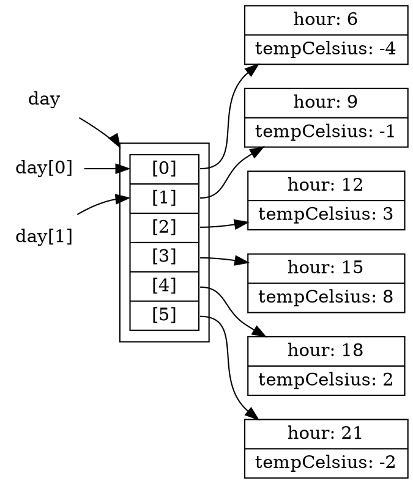

# Arrays and Iteration

It is common for programs to work with data represented as a _sequence_. The messages in an inbox, the transactions on an account, the students in a course, and the readings from a sensor are all naturally sequences of items. Because sequences are so common, most programming languages provide a built-in data structure for them, usually called an **array**: an ordered collection of elements that can be accessed by position. C, Java, Rust, Python, and TypeScript all provide arrays (Python calls them lists), and every language has similar features for working with them.

We have already hand-built a mechanism for tracking a sequence. In [Using Types to Model Problems](./02_model-types) we defined a recursive `Playlist` and wrote a recursive function every time we wanted to count, total, or search it. That worked, but we had to rewrite the same traversal pattern in every function. Languages provide built-in support for the most common traversal patterns.

In TypeScript, arrays come with the traversal operations already written for transforming, selecting, and searching sequences. This chapter introduces arrays, those built-in operations, and then iteration, the general mechanism underneath them all.

#### A Day of Temperature Readings

This chapter uses a single running example:

> As a weather-station operator, I want to summarise a day of hourly temperature readings, so that I can publish accurate daily reports without computing them by hand.

Each weather reading records the hour it was taken and the temperature at that time. The day's weather data is a sequence of these readings.

```typescript
type Reading = {
  // invariant: a whole number, 0 <= hour <= 23
  hour: number;
  tempCelsius: number;
};
```

## Creating and Using Arrays

An array is denoted by appending `[]` to the element type: `Reading[]` is an array of `Reading` objects. An array is created with an **array literal**: the elements, separated by commas, between square brackets.

```typescript
// create an array containing 6 Reading elements
const day: Reading[] = [
    { hour: 6,  tempCelsius: -4 },
    { hour: 9,  tempCelsius: -1 },
    { hour: 12, tempCelsius: 3 },
    { hour: 15, tempCelsius: 8 },
    { hour: 18, tempCelsius: 2 },
    { hour: 21, tempCelsius: -2 }
];

// create an empty array
const empty: number[] = [];
```

<details class="tooltip ts-tips">
<summary>Array Types and Literals</summary>

The type `X[]` designates an array of elements of type `X`. `X[]` can also be written `Array<X>`. The two notations mean the same type, the second using the generics syntax from [Chapter 2](./02_model-types). In this course we use the shorter and more common `X[]` form.

An array literal is an expression:
```typescript
[<expression-1>, <expression-2>, <expression-3>]
```

which creates an array with `<expression-i>` as the `i`-th element. It can contain any number of elements, including zero.

</details>

<details class="tooltip link-110">
<summary>Lists in ISL</summary>

The array literal plays the role of `list` from CPSC 110: `[ -4, -1, 3 ]` is the counterpart of `(list -4 -1 3)`. ISL lists were built from `cons` cells, which is exactly the recursive structure we rebuilt as `LinkedList` previously. Arrays package the same idea as a single built-in type, with direct access to any position by index.

</details>

The compiler enforces that every element of an array has the same type. Trying to put a `string` into a `Reading[]` is a type error, and anything you take _out_ of a `Reading[]` is guaranteed to be a `Reading`. Array elements are accessed by their **index**, their position counting from zero. The number of elements in the array is available through its `length` property:

```typescript
const first = day[0];        // { hour: 6, tempCelsius: -4 }
const second = day[1];       // { hour: 9, tempCelsius: -1 }
const count = day.length;    // 6
```

The `day` array is represented in memory as a row of six cells, one per index. The cells do not contain the `Reading` objects themselves. Each cell holds a _reference_ to a separate `Reading` that lives elsewhere. `day[0]` names the cell at index 0, and that cell holds a reference to where the `Reading` object is stored. We will introduce _references_ in detail in [Chapter 6](./06_state-mutation).

<!-- graph playground:
https://dreampuf.github.io/GraphvizOnline/?engine=dot
-->

<!-- caption="Each cell holds a reference to a separate Reading object, which can be accessed by its index." -->

## Array Operations

TypeScript provides _operations_ that cover the most common things a program does with a sequence. Each operation takes a function as its input. The input function describes what should happen to _one element_, and the operation applies the function across the whole array. The input functions will usually be declared with arrow functions (lambdas), which we saw in [Chapter 1](./01_new-language).

The four most commonly used operations are `map`, `filter`, `reduce`, and `find`. `map` transforms every element, `filter` keeps a subset, `find` locates one element, and `reduce` summarises the array. A fifth, `toSorted`, puts the elements in order.

<details class="tooltip ts-tips">
<summary>Calling Array Operations</summary>

Given an array `a`, we call an operation with `a.operation(fun)`. `fun` is the function that says what to do with each element, usually an arrow function: `(elem: ElemType) => <expression>`.

</details>

<details class="tooltip link-110">
<summary> <code>map</code>, <code>filter</code>, <code>foldr</code> </summary>

CPSC 110 also had built-in sequence abstractions: `map`, `filter`, and `foldr`, with `lambda` for writing the per-element function. The TypeScript versions are the same ideas with different syntax: the operation is called with dot notation on the array, and `lambda` becomes the arrow.

```racket
(map (lambda (r) (* r 2)) (list 1 2 3))     ; (list 2 4 6)
(filter positive? (list -1 2 -3))           ; (list 2)
(foldr + 0 (list 1 2 3))                    ; 6, like reduce
```

</details>

### `map`: Transforming

`map` applies a function to every element and returns a _new array_ containing the results, in the same order. The original array is not changed. For example, our forecasters publish in Fahrenheit, so we convert every Celsius reading to Fahrenheit:

```typescript
const fahrenheit: number[] = day.map((reading: Reading) => reading.tempCelsius * 9 / 5 + 32);
// fahrenheit contains [24.8, 30.2, 37.4, 46.4, 35.6, 28.4]
```

The result of a `map` always has the same length as the input. Mapping a `Reading[]` through a function that returns a `number` produces a `number[]`.

<details class="tooltip deep-dive">
<summary>Replacing Recursion With <code>map</code></summary>

For the recursive `LinkedList<T>` from [Chapter 2](./02_model-types), the same operation had to be written by hand. The parameter `f` has type `(t: T) => U`, which denotes a function converting from `T` to `U`.

```typescript
function mapList<T, U>(list: LinkedList<T>, f: (t: T) => U): LinkedList<U> {
    if (list.kind === "empty") {
        return { kind: "empty" };
    } else {
        return { kind: "node", head: f(list.head), tail: mapList(list.tail, f) };
    }
}
```

This performs the same steps as `day.map(f)`, which hides the traversal. You supply the per-element transformation, and the traversal is taken care of by the language.

</details>

### `filter`: Selecting

`filter` returns a new array containing only the elements for which the given function returns `true`. For example, the report needs to know which hours were below freezing:

```typescript
const freezing: Reading[] = day.filter((reading: Reading) => reading.tempCelsius < 0);
// [{ hour: 6, tempCelsius: -4 }, { hour: 9, tempCelsius: -1 }, { hour: 21, tempCelsius: -2 }]
```

`filter` never changes the elements. It only selects which appear in the result, so filtering a `Reading[]` produces a `Reading[]` that is often shorter.

### `reduce`: Combining

`map` and `filter` produce arrays, while `reduce` collapses an array into a single value. It carries an **accumulator** through the array: for each element, a combining function takes the accumulator's current value and the current element, and produces an updated accumulator. `reduce` takes two arguments: the combining function, and the accumulator's starting value. For example, if we wanted to know the sum of the Celsius values across all of the readings:

```typescript
const totalCelsius: number = day.reduce((sum: number, reading: Reading) => sum + reading.tempCelsius, 0);
// 6
```

With `reduce` and `length` we can write a summary function in the style of the previous chapters:

```typescript
/**
 * Computes the mean temperature across a day of readings.
 *
 * Precondition: day contains at least one reading.
 *
 * @param {Reading[]} day the readings to summarise
 * @returns {number} the mean of the temperatures in day
 */
function meanTemp(day: Reading[]): number {
    const total: number = day.reduce((sum: number, reading: Reading) => sum + reading.tempCelsius, 0);
    return total / day.length;
}
```

```typescript
test("mean temperature over the day", checkExpect(() => meanTemp(day), 1));
```

### `find`: Searching

`find` returns the _first_ element for which the given function returns `true`. If no element matches, `find` returns `undefined` as specified by its return type. For example, if we wanted to find the first hour the temperature rose above freezing:

```typescript
const thaw: Reading | undefined = day.find((reading: Reading) => reading.tempCelsius > 0);
// { hour: 12, tempCelsius: 3 }
```

[Chapter 2](./02_model-types) introduced two absence values: `null`, which we choose when designing our own types, and `undefined`, the language's own value for "nothing was provided". TypeScript's built-in operations use `undefined` for "not found", and `find` follows that convention. The union type forces every caller to consider the case where nothing matched.

```typescript
test("find returns undefined when nothing matches",
    checkExpect(
        () => day.find((reading: Reading) => reading.tempCelsius > 30),
        undefined
    )
);
```

### The Function Argument

In the examples above, the function argument is always an anonymous function whose body is a single expression. It does not have to be. The function argument can be an anonymous function with statements in its body:

```typescript
const totalTemps: number = day.reduce((sum: number, reading: Reading) => {
    const total = sum + reading.tempCelsius;
    return total;
}, 0);
```

or the name of a function with the right signature:

```typescript
function addTemp(sum: number, reading: Reading): number {
    return sum + reading.tempCelsius;
}

const totalTemps: number = day.reduce(addTemp, 0);
```

A named `function` is clearer when the computation gets more complex, for example when it needs several `if` statements. The name `addTemp` also tells the reader what the operation is for.

### Chaining Operations

The array operations are chainable. Because `map` and `filter` return new arrays, the result of one can feed directly into the next. For example, to list the hours when the temperature was above freezing:

```typescript
const thawHours: number[] = day
    .filter((reading: Reading) => reading.tempCelsius > 0)
    .map((reading: Reading) => reading.hour);
// [12, 15, 18]
```

Each named operation tells the reader the shape of the step: a `filter` produces a subset, a `map` produces transformed elements, a `reduce` produces one value. A chain of them reads as a short description of the computation.

### `toSorted`: Ordering

`toSorted` returns a _new array_ containing the same elements in a chosen order. Like `map` and `filter`, it leaves the original array unchanged. Its function argument is different from the others: a **comparator** takes _two_ elements and returns a number saying which should come first. A negative number means the first argument comes before the second, a positive number means it comes after, and zero means either order is fine. For numbers, `a - b` orders ascending and `b - a` orders descending. For example, to list the day's readings coldest first:

```typescript
const coldestFirst: Reading[] = day.toSorted(
    (a: Reading, b: Reading) => a.tempCelsius - b.tempCelsius
);
// hours 6, 21, 9, 18, 12, 15
```

```typescript
test("readings ordered coldest first",
    checkExpect(() => coldestFirst.map((reading: Reading) => reading.hour), [6, 21, 9, 18, 12, 15])
);
```

When two elements compare as equal, `toSorted` keeps them in the order they had in the input. If that is not the order you want, the comparator needs a second rule for breaking ties, and a comparator with several rules is clearer as a named function. This one orders warmest first and, among equal temperatures, the earlier hour first:

```typescript
function warmerThenEarlier(a: Reading, b: Reading): number {
    if (a.tempCelsius !== b.tempCelsius) {
        return b.tempCelsius - a.tempCelsius;
    }
    return a.hour - b.hour;
}

const warmestFirst: Reading[] = day.toSorted(warmerThenEarlier);
// hours 15, 12, 18, 9, 21, 6
```

Always pass a comparator. Called without one, `toSorted` converts each element to a string and orders those, so `[10, 9, 2].toSorted()` is `[10, 2, 9]`, because `"10"` comes before `"2"`.

### `slice`: Taking a Range

`slice` returns a new array holding the elements from index `i` (inclusive) up to index `j` (exclusive):

```typescript
const temperatures: number[] = [6, 9, 8, 10, 10, 12, 13, 15, 10, 7, 5];
```

```typescript
test("slicing takes all elements from i (inclusive) to j (exclusive)",
    checkExpect(() => temperatures.slice(2, 6), [8, 10, 10, 12])
);
```

Arrays have many other useful operations that this chapter does not cover.

## Writing Your Own Loops

`map`, `filter`, `reduce`, and `find` are commonly used, but they are prescriptive. `map` always produces one output per input, `filter` always visits every element and keeps the matches, and `find` always stops at the first match. These are broadly useful, but you will often need something that does not fit them.

When a computation does not match a named pattern, for example because it relates elements to one another rather than examining each one on its own, we need a general mechanism that the built-in operations are themselves made of: a **loop**. The loop we use is the `for of` statement. It runs its body once for each element of an array, in order, binding the element to a name:

```typescript
for (const reading of day) {
    // body runs once per reading, in order
}
```

<details class="tooltip ts-tips">
<summary><code>for of</code> loops</summary>

A `for of` loop of the form:

```typescript
for (<var-declaration> of <iterable>) {
    <statement-1>;
    <statement-2>;
}
```
is a statement that executes as follows, for each element of `<iterable>`:

1. Assigns the element to the name declared by `<var-declaration>`. That is, if `<var-declaration>` is `const x`, each element of `<iterable>` will be assigned to the name `x`.
2. Runs the statements in the body of the for loop (here, `<statement-1>; <statement-2>;`) in order.

This means the body of the `for of` loop will execute `n` times, where `n` is the number of elements in `<iterable>`. Since the `for of` loop is a statement, `for of` loops can be nested (for example, `<statement-i>` can be another loop).

</details>

Like the `if` statement from the first chapter, `for of` is a statement. It produces no value and only directs the flow of execution. This is a _new construct_ relative to CPSC 110.

<details class="tooltip link-110">
<summary>Loops Replace Recursive Traversal</summary>

In CPSC 110 you traversed a list by calling the function again on `(rest lst)` until you reached `empty`. A `for of` loop performs the same traversal as a statement. The loop visits each element in order, then stops. The traversal you used to spell out with a recursive call is performed by the statement itself.

</details>

The loop below does what `find` does:

```typescript
function firstAbove(day: Reading[], threshold: number): Reading | undefined {
    for (const reading of day) {
        if (reading.tempCelsius > threshold) {
            return reading; // stop the search at the first match
        }
    }
    return undefined; // every reading was checked; none matched
}
```

The `return` inside the loop body exits the whole function the moment a match is found, so later elements are never visited. Knowing how to write the loop means you can build the patterns the language does not provide.

Every operation above examines elements one at a time: the function you hand to `map`, `filter`, or `find` receives a single element and nothing else. Some questions are about how elements relate to _each other_. Suppose quality control asks: did the station ever report the same temperature at two different hours?

```typescript
/**
 * Determines whether any two readings taken at different hours
 * report the same temperature.
 *
 * @param {Reading[]} day the readings to examine
 * @returns {boolean} true if any temperature repeats, false otherwise
 */
function hasRepeatedTemperature(day: Reading[]): boolean {
    for (const first of day) {
        for (const second of day) {
            if (first.hour !== second.hour) {
                if (first.tempCelsius === second.tempCelsius) {
                    return true; // a repeat; stop the whole search
                }
            }
        }
    }
    return false; // every pair was checked; no repeats found
}
```

Here the loops nest: for each `first` reading, the inner loop walks the whole array looking for a _different_ hour (the outer `if`) reporting the _same_ temperature. The comparison involves two elements at once, which the named operations cannot express because their functions see one element at a time.

```typescript
const repeats: Reading[] = [
    { hour: 3, tempCelsius: 5 },
    { hour: 6, tempCelsius: 9 },
    { hour: 9, tempCelsius: 5 }
];

test("no temperature repeats in our day",
    checkExpect(() => hasRepeatedTemperature(day), false)
);

test("a repeated temperature is detected",
    checkExpect(() => hasRepeatedTemperature(repeats), true)
);
```

Which should you use? Prefer the named operation whenever the task is a transform (`map`), a selection (`filter`), a summary (`reduce`), or a first-match search (`find`). The operation tells every reader what the computation does, and it is less error-prone than a hand-written loop.

In contrast, write a loop when the computation does not fit a named pattern: when it relates elements to one another, or when one pass must answer a question no single named operation can. The named operations say _what_ they are doing. Loops are for when you must control _how_ it is done.

#### On Iteration

Arrays give sequences built-in support in the language, and their operations package the traversals we used to write by hand: `map` to transform, `filter` to select, `reduce` to summarise, `find` to search, `toSorted` to order, with `for of` underneath them all for the computations that fit no named pattern.

One property everything in this chapter shared: none of these operations changed `day`, our array of daily temperatures. Every `map`, `filter`, and `toSorted` produced a new array, every `reduce` produced a new value, and even our hand-written loops only read the elements they visited. The original readings were never changed. What happens when programs _do_ change existing values, and why that calls for so much care, is the subject of the next chapter.

<details class="tooltip exercise">
  <summary>Exercise: Summarising an Order</summary>

Practise this chapter's tools using `map`, `filter`, `reduce`, `find`, `toSorted`, and a `for of` on a new collection.

> As an online shop, I want to summarise a customer's order, so that I can show line items, totals, and stock problems at a glance.

Each item in an order records a name, a unit price, and a quantity:

```typescript
type Item = {
    name: string;
    price: number;    // unit price in dollars
    quantity: number; // how many were ordered
};
```

Write a small example `order` of three or four items to test against, then write these functions. Use the named operation whenever one fits, and a loop only when none does:

1. `names(order: Item[]): string[]`. Return the name of every item, <span class="hint">using `map`</span>.
2. `affordable(order: Item[], max: number): Item[]`. Return the items whose `price` is at most `max`, <span class="hint">using `filter`.</span>
3. `orderTotal(order: Item[]): number`. Return the total cost, summing `price * quantity` across the order, <span class="hint">using `reduce`.</span>
4. `firstOutOfStock(order: Item[]): Item | undefined`. Return the first item with a `quantity` of 0, <span class="hint">using `find` (remember what `find` returns when nothing matches).</span>
5. `cheapestFirst(order: Item[]): Item[]`. Return the items ordered by `price`, lowest first, and for equal prices by `name` alphabetically, <span class="hint">using `toSorted` with a comparator that has two rules. For strings, `a < b` tells you whether `a` comes first.</span>
6. `hasDuplicateName(order: Item[]): boolean`. Return `true` if any two items share the same `name`. <span class="hint">This one compares items to one another, which the named operations cannot express, so you will want to use a `for of` loop for this task.</span>

Write a `test` holding a single `checkExpect` for each function against your example order, <span class="hint">including a case for `firstOutOfStock` where nothing is out of stock</span>.

</details>
