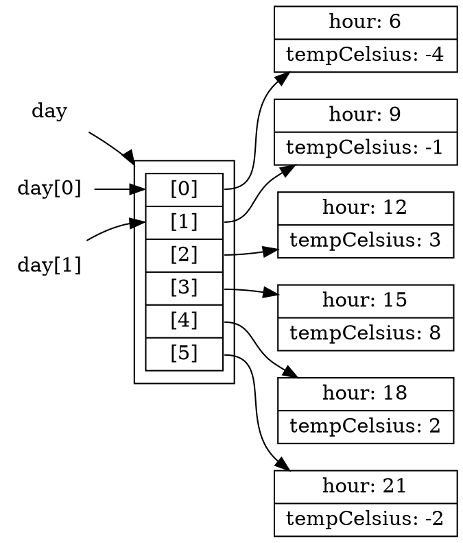

# Arrays and Iteration

Much of the data programs work with arrives as a _sequence_: the messages in an inbox, the transactions on an account, the students in a course, the readings from a sensor. Because sequences are so common, most programming languages provide a built-in data structure for them: the **array**, an ordered collection of elements that can be accessed by position and that knows its own size. C, Java, Rust, Python, and TypeScript all provide arrays (Python calls them lists), and an engineer moving between languages can rely on them being there.

We have already built a sequence by hand. In [Using Types to Model Problems](./02_model-types) we defined a recursive `Playlist` and wrote a recursive function every time we wanted to count, total, or search it. That worked, but we had to re-write the same traversal pattern in every function. Patterns this common are exactly what languages provide explicit support for to make work easier.

Arrays come with the traversal operations already written for transforming, selecting, and searching sequences. This chapter introduces arrays, those built-in operations, and then the general mechanism underneath them all: iteration.

## A Day of Temperature Readings

We will work with a single running example throughout this chapter:

> As a weather-station operator, I want to summarise a day of hourly temperature readings, so that I can publish accurate daily reports without computing them by hand.

Each reading records the hour it was taken and the temperature at that moment:

```typescript
type Reading = {
  // invariant: a whole number, 0 <= hour <= 23
  hour: number;
  tempCelsius: number;
};
```

A day's data is a sequence of these readings, which we will store in an array.

## Creating and Accessing Arrays

An array type is written by adding `[]` to the element type: `Reading[]` is an array of `Reading` objects, and `number[]` is an array of numbers. An array is created with an **array literal**: the elements, separated by commas, between square brackets.

```typescript
const day: Reading[] = [
    { hour: 6,  tempCelsius: -4 },
    { hour: 9,  tempCelsius: -1 },
    { hour: 12, tempCelsius: 3 },
    { hour: 15, tempCelsius: 8 },
    { hour: 18, tempCelsius: 2 },
    { hour: 21, tempCelsius: -2 }
];

// creates an array with no elements
const empty: number[] = [];
```


<details class="tooltip ts-tips">
<summary>Array Types and Literals</summary>

The type `X[]` designates an array of elements of type `X`. `X[]` can also be written `Array<X>`; the two notations mean exactly the same type, and the second uses the generics syntax from [Chapter 2](./02_model-types). In this course we use the `X[]` form, which is shorter and is the form you will see most often in practice.


An array literal is an expression:
```typescript
[<expression-1>, <expression-2>, <expression-3>]
```

which creates an array with `<expression-i>` as the ith-element. It can contain any number

</details>

<details class="tooltip link-110">
<summary>Lists in ISL</summary>

The array literal plays the role of `list` from CPSC 110: `[ -4, -1, 3 ]` is the counterpart of `(list -4 -1 3)`. Underneath, ISL lists were built from `cons` cells, which is exactly the recursive structure we rebuilt as `LinkedList` in an earlier chapter. Arrays package the same idea as a single built-in type, with direct access to any position by index.

</details>


Every element of an array has the same type, and the compiler enforces it: trying to put a `string` into a `Reading[]` is a type error, and anything you take _out_ of a `Reading[]` is known to be a `Reading`.

Elements are accessed by their **index**, their position counting from zero, and the number of elements is available in the `length` property:

```typescript
const first = day[0];        // { hour: 6, tempCelsius: -4 }
const second = day[1];       // { hour: 9, tempCelsius: -1 }
const count = day.length;    // 6
```

<details class="tooltip ts-tips">
<summary>Accessing array elements with <code>[]</code></summary>

Given an array `a`, the expression `a[i]` returns the `i`-th element in `a`, starting counting at 0.
</details>

In memory, `day` is a row of six cells, one per index. The cells do not contain the `Reading` objects themselves; each cell holds a _reference_ to a separate `Reading` that lives elsewhere. An index like `day[0]` names a cell and follows its reference to the object. (We will introduce _references_ in detail in [Chapter 6](./06_state-mutation).)

<!-- graph playground:
hhttps://dreampuf.github.io/GraphvizOnline/?engine=dot
-->

<!-- caption="Each cell holds a reference to a separate Reading object, which can be accessed by its index." -->


<details class="tooltip deep-dive">
<summary>The JSON Data Interchange Format</summary>

Programs rarely keep their data to themselves. They save it to files, send it across the network to other machines, and exchange it with programs written in entirely different languages. To do any of that, the data has to be written down in a format that is agreed on ahead of time. One of the most commonly used formats is **JSON**, short for JavaScript Object Notation. You have already seen some JSON files in this course: `package.json` and `tsconfig.json` are both written in it.

JSON is quick to learn because its syntax is almost exactly the object and array literals you have been writing in this chapter and the last. Once you can read a TypeScript literal, you can very nearly read JSON. Every piece of JSON is a single value, and every value is one of a small, fixed set of kinds. Four of them are the primitive values you already know, written just as they are in TypeScript:

- `string`: always in double quotes: `"CPSC 210"`
- `number`, with no distinction drawn between integers and decimals: `4`, `-273.15`
- `boolean`: `true` or `false`
- `null`, for the deliberate absence of a value: `null`

The other two kinds are containers that hold other values, which is what lets JSON describe structured data.

**A JSON object** groups related values together inside `{ }`:

```json
{
  "hour": 6,
  "tempCelsius": -4,
  "freezing": true
}
```

Each entry has two parts separated by a colon. The name on the left, such as `"hour"`, is the **key**, and the value on the right is what is filed under that key. A key is always a string in double quotes. Within a single object each key is _unique_: a key is a label, and each label names exactly one value, so asking an object for the value under `"hour"` always has one unambiguous answer. (This pattern, a collection of unique keys that each map to a value, returns later under its own name; here it is just how an object is put together.)

**A JSON array** is an ordered list of values inside `[ ]`, just as in this chapter:

```json
[ -4, -1, 3, 8, 2, -2 ]
```

The values in an array need not be numbers. They can be any JSON value, including objects:

```json
[
  { "hour": 6, "tempCelsius": -4 },
  { "hour": 9, "tempCelsius": -1 },
  { "hour": 12, "tempCelsius": 3 }
]
```

JSON is flexible because of its ability to nest data. The value filed under a key, or sitting in an array, may itself be an object or an array, and those may hold further objects and arrays, nested as deeply as the data requires. A full weather-station report might bring every kind together at once:

```json
{
  "stationId": "YVR-2",
  "active": true,
  "location": {
    "name": "Vancouver International",
    "latitude": 49.19,
    "longitude": -123.18
  },
  "elevationMetres": 4,
  "readings": [
    { "hour": 6, "tempCelsius": -4, "note": null },
    { "hour": 9, "tempCelsius": -1, "note": "frost reported" }
  ],
  "tags": [ "coastal", "automated" ]
}
```

The whole document is one object. The value under `"location"` is a second object, nested inside the first. The value under `"readings"` is an array of objects, and inside one of those, `"note"` is `null` for the reading with no note and a string for the one that has it. The value under `"tags"` is an array of strings. Every value, at every depth, is one of the kinds above. That is the entirety of JSON: four primitive values, the object, and the array, combined without limit.

JSON itself is text, and only text. A JSON document is a sequence of characters, whether it sits in a file or arrives over a network. It carries data and nothing else: no functions, no computation, no variables, and no way for one part to refer to another. The restriction is deliberate, and it is the reason JSON is so widely used. Because a JSON value is inert data in a notation that no single language owns, a program written in Python can produce it, a file can store it, and your TypeScript program can consume it, with the two sides needing to agree only on the shape of the data and not on a shared programming language. That independence, together with the fact that a person can open the text and read it, is why JSON has become the common format for configuration files and for web services.

A few differences from a TypeScript literal can be tricky: In JSON, keys must be wrapped in double quotes (`"hour"`, never a bare `hour`), and strings must use double quotes, never single. JSON permits no trailing comma after the final entry, and no comments anywhere. And the only values allowed are the kinds above: there is no `undefined`, and no special form for dates or anything else, only the primitives, objects, and arrays.

Because JSON is text, a program cannot work with it as values directly. The text has to be turned into real objects, arrays, and numbers first, and your own values turned back into text to send them out. One challenge with JSON is it usually originates in external systems (files, the network, provided as parameters from other code), and needs to be validated so we know what its actual type is. This challenge, and how we read and write JSON files will be covered explicitly in lab.

</details>

## The Built-In Array Operations

Arrays come with _operations_ that cover the most common things a program does with a sequence. Each operation is a higher-order function that takes a function as its input. The input function describes what should happen to _one element_, and the operation applies that across the whole array for you.  We will often use arrow functions (lambdas), which we saw in [Chapter 1](./01_new-language), to specify those input functions.

The four operations we use most are `map`, `filter`, `reduce`, and `find`. These four operations capture some of the most common tasks we perform on arrays. `map` is used to uniformly transform every element of an array into a new array. `filter` returns a subset of an array. `find` locates one element in an array. `reduce` summarizes an array.


<details class="tooltip ts-tips">
<summary>Calling Array Operations</summary>

Given an array of name `a`, we will call operations with `a.operation_name(fun)`. This is because each operation (`map`, `filter`, `reduce`, and `find`) _belongs_ to arrays, similar to the functions as properties we saw in [Chapter 4](./04_maintaining-invariants). `fun` represents the input function that characterize the mapping/filter/reduction/find we should do. Usually we will specify it with an arrow function; `(elem: elemType) => <expression-that-we-want-to-derive-from-elem>`.

</details>
<!---- Already introduced in chapter 1
<details class="tooltip ts-tips">
<summary>Arrow Functions</summary>

An **arrow function** is a compact way to write a function as a value. The parameters come first, then `=>`, then an expression whose value is returned automatically:

```typescript
(reading) => reading.tempCelsius > 0
```

This is a function that takes one parameter and returns a `boolean`. You have already seen the zero-parameter form: the `() =>` wrapper used by `checkExpect` and `checkError`. The parameter has no type annotation because TypeScript infers it: when an arrow function is passed to an array operation, the compiler already knows the element type of the array, so it knows `reading` is a `Reading`.

</details>
---->

<details class="tooltip link-110">
<summary> <code>map</code>, <code>filter</code>, <code>foldr</code> </summary>

Built-in sequence abstractions are not new to you: CPSC 110 introduced `map`, `filter`, and `foldr`, with `lambda` for writing the per-element function. The TypeScript versions are the same ideas with different syntax: the operation is called with dot notation on the array, and `lambda` becomes the arrow.

```racket
(map (lambda (r) (* r 2)) (list 1 2 3))     ; (list 2 4 6)
(filter positive? (list -1 2 -3))           ; (list 2)
(foldr + 0 (list 1 2 3))                    ; 6, like reduce
```

</details>

### Transforming Every Element with `map`

`map` applies a function to every element and returns a _new array_ of the results, in the same order. The original array is not changed. Our forecasters publish in Fahrenheit, so we convert every reading:

```typescript
const fahrenheit: number[] = day.map((reading: Reading) => reading.tempCelsius * 9 / 5 + 32);
// fahrenheit contains [24.8, 30.2, 37.4, 46.4, 35.6, 28.4]
```

The result of a `map` always has the same length as the input; only the elements are transformed. Notice the types: mapping a `Reading[]` through a function that returns a `number` produces a `number[]`.

<details class="tooltip deep-dive">
<summary>The Recursion <code>map</code> Replaces</summary>

For the recursive `LinkedList<T>` from the modelling chapter, the same transformation has to be written by hand. (The parameter `f` is typed with the same arrow used to write one: `(t: T) => U` is the type of a function from `T` to `U`.)

```typescript
function mapList<T, U>(list: LinkedList<T>, f: (t: T) => U): LinkedList<U> {
    if (list.kind === "empty") {
        return { kind: "empty" };
    } else {
        return { kind: "node", head: f(list.head), tail: mapList(list.tail, f) };
    }
}
```

If you compare this carefully with `day.map(f)`, you will see that `map` performs exactly the same steps; it just hides the traversal. You supply only the per-element transformation, and the structure-following work that this function spells out is done for you.

</details>

### Keeping Some Elements with `filter`

`filter` returns a new array containing only the elements for which the given function returns `true`. The report needs to know which hours were below freezing:

```typescript
const freezing: Reading[] = day.filter((reading: Reading) => reading.tempCelsius < 0);
// [{ hour: 6, tempCelsius: -4 }, { hour: 9, tempCelsius: -1 }, { hour: 21, tempCelsius: -2 }]
```

A `filter` never changes the elements themselves; it only selects which ones appear in the result, so a `Reading[]` is filtered to a (possibly shorter) `Reading[]`.

### Combining Elements with `reduce`

`map` and `filter` produce arrays; `reduce` collapses an array into a single value. It carries an **accumulator** through the array: for each element, a combining function takes the accumulator so far and the current element, and produces the next accumulator. `reduce` takes two arguments: the combining function, and the accumulator's starting value.

```typescript
const totalCelsius: number = day.reduce((sum: number, reading: Reading) => sum + reading.tempCelsius, 0);
// 6
```

With `reduce` and `length` we can write, document, and test a summary function in the style of the previous chapters:

```typescript
/**
 * Computes the mean temperature across a day of readings.
 *
 * Precondition: day contains at least one reading.
 *
 * @param {Reading[]} day the readings to summarise
 * @returns {number} the mean of the temperatures in day
 */
function meanTemp(day: Reading[]): number {
    const total: number = day.reduce((sum: number, reading: Reading) => sum + reading.tempCelsius, 0);
    return total / day.length;
}
```

```typescript
test("mean temperature over the day", checkExpect(() => meanTemp(day), 1));
```

The precondition matters here in exactly the way the previous chapter described: `meanTemp` of an empty array would divide by zero, so the contract excludes that input.

### Searching with `find`

`find` returns the _first_ element for which the given function returns `true`. The report wants the first hour the temperature rose above freezing:

```typescript
const thaw: Reading = day.find((reading: Reading) => reading.tempCelsius > 0);
// { hour: 12, tempCelsius: 3 }
```

If no element matches, `find` returns `undefined`, and its return type says so: searching a `Reading[]` produces a `Reading | undefined`.

This is a deliberate language design choice. Recall the two absence values from the modelling chapter: `null` is a deliberate "no value here" that we choose when designing our own types, while `undefined` is the language's own value for "nothing was provided". TypeScript's built-in operations consistently use `undefined` for their "not found" results, and `find` follows that convention. Either way the protection is the same: the union type forces every caller to consider the case where nothing matched.

```typescript
test("find returns undefined when nothing matches",
    checkExpect(
        () => day.find((reading: Reading) => reading.tempCelsius > 30),
        undefined
    )
);
```

### Chaining Operations

We can chain these operations , and we will frequently combine them to perform more complex tasks. Because `map` and `filter` return new arrays, the result of one operation can immediately feed the next.

For instance, to take the mean of only the above-freezing temperatures:

```typescript
const aboveFreezing: Reading[] = day.filter((reading: Reading) => reading.tempCelsius > 0);
const meanAbove: number = aboveFreezing.reduce((sum: number, reading: Reading) => sum + reading.tempCelsius, 0) / aboveFreezing.length;
// 13 / 3
```

Each named operation tells the reader the shape of the step: a `filter` produces a subset, a `map` produces transformed elements, a `reduce` produces one value. A chain of them reads as a short description of the computation.

## Writing Your Own Loops

`map`, `filter`, `reduce`, and `find` are commonly used, but are also extremely prescriptive. `map` always produces one output per input; `filter` always visits every element and keeps the matches; `find` always stops at the first match. _Many_ computations fit one of those shapes, but not _all_ of them do.

When a computation does not match a named pattern, for example because it relates elements to one another rather than examining each one on its own, we need the general mechanism that the built-in operations are themselves made of: a **loop**.

The loop we use is the `for of` statement. It runs its body once for each element of an array, in order, binding the element to a name:

```typescript
for (const reading of day) {
    // body runs once per reading, in order
}
```

<details class="tooltip ts-tips">
<summary><code>for of</code> loops</summary>

The for of loop of form:

```typescript
for(<var-decl> of <iterable>){
   <statement-1>;
   <statement-2>;
} 
```
is a statement that executes as follows, for each element of `<iterable>`:

1. assigns the element to the name declared by `<var-decl>`. I.e., if `<var-decl>` is `const x`, each element of iterable will be assigned to the name `x`.
2. runs the statements in the body of the for loop (here, `<statement-1>; <statement-2>;`) in order

This means the body of the `for of` loop will execute `n` times, where `n` is the number of elements in `<iterable>`. Since the `for of` loop is a statement, `for of` loops can be nested (i.e., `<statement-i>` can be another loop).

</details>

Like the `if` statement from the first chapter, `for of` is a statement: it produces no value, it directs the flow of execution. This is a _new construct_ relative to CPSC 110, where every repetition was expressed with recursion.

<details class="tooltip link-110">
<summary>Loops Replace Recursive Traversal</summary>

In CPSC 110 you traversed a list by calling the function again on `(rest lst)` until you reached `empty`. A `for of` loop performs the same traversal as a statement: visit each element in order, then stop. The traversal you used to spell out with a recursive call is performed by the statement itself.

</details>

To see a loop doing what `find` does, here is a search written by hand:

```typescript
function firstAbove(day: Reading[], threshold: number): Reading | undefined {
    for (const reading of day) {
        if (reading.tempCelsius > threshold) {
            return reading; // stop the search at the first match
        }
    }
    return undefined; // every reading was checked; none matched
}
```

The `return` inside the loop body exits the whole function the moment a match is found, so later elements are never visited. This is exactly what `find` does for you: `find` is a loop someone else already wrote. The same is true of `map`, `filter`, and `reduce`. The built-in operations are not magic; they are packaged loops, and knowing how to write the loop means you can build the patterns the language did not provide.

Some questions cannot be answered by any of the named operations. Every operation above examines elements one at a time: the function you hand to `map`, `filter`, or `find` receives a single element and nothing else. Some questions are instead about how elements relate to _each other_. Suppose quality control asks: did the station ever report the same temperature at two different hours?

```typescript
/**
 * Determines whether any two readings taken at different hours
 * report the same temperature.
 *
 * @param {Reading[]} day the readings to examine
 * @returns {boolean} true if any temperature repeats, false otherwise
 */
function hasRepeatedTemperature(day: Reading[]): boolean {
    for (const first of day) {
        for (const second of day) {
            if (first.hour !== second.hour) {
                if (first.tempCelsius === second.tempCelsius) {
                    return true; // a repeat; stop the whole search
                }
            }
        }
    }
    return false; // every pair was checked; no repeats found
}
```

In this example, loops nest: for each `first` reading, the inner loop walks the whole array looking for a _different_ hour (as expressed by the if) reporting the _same_ temperature. The comparison involves two elements at once: the named operations cannot express this, because the functions they take see one element at a time. _(It is technically possible to contort `find` into answering this, with one search nested inside another, but the result is much harder to read than the loop that says what it means.)_

```typescript
const repeats: Reading[] = [
    { hour: 3, tempCelsius: 5 },
    { hour: 6, tempCelsius: 9 },
    { hour: 9, tempCelsius: 5 }
];

test("no temperature repeats in our day",
    checkExpect(() => hasRepeatedTemperature(day), false)
);

test("a repeated temperature is detected",
    checkExpect(() => hasRepeatedTemperature(repeats), true)
);
```

Loops have a second strength we are not ready to use yet: values that change as the loop runs, allowing a running tally to be carried from one element to the next. Doing that requires changing existing values, which is the subject of the next chapter.

Should you use loops or built-in array operations?
Prefer the named operation whenever the task is exactly a transform (`map`), a selection (`filter`), a summary (`reduce`), or a first-match search (`find`). The operation name tells every future reader what the computation does at a glance, and the traversal it performs has no room for the small mistakes a hand-written loop can contain.

Write a loop when the computation does not fit a named pattern: when it relates elements to one another, like the repeated-temperature check, or when one pass must answer a question no single named operation can. The named operations say _what_; the loop is for when you must control _how_.

## Reading and Writing JSON

The tooltip earlier in this chapter described JSON as a notation: four kinds of primitive value, the object, and the array, written as text. Text is all it is, so a program cannot work with a JSON document directly. Two built-in functions convert between the notation and real TypeScript values.

`JSON.stringify` goes from a value to text. Give it any array, object, or primitive and it returns a string in JSON notation:

```typescript
const day: Reading[] = [
    { hour: 6, tempCelsius: -4 },
    { hour: 12, tempCelsius: 3 }
];

const text: string = JSON.stringify(day);
// '[{"hour":6,"tempCelsius":-4},{"hour":12,"tempCelsius":3}]'
```

The output is compact and awkward to read. When a person has to look at the result, as with a configuration file, a third argument asks for indentation:

```typescript
JSON.stringify(day, null, 4);   // the same data, indented by four spaces
```

`JSON.parse` goes the other way, from text back to a value:

```typescript
const restored = JSON.parse(text);
```

After that call, `restored` holds a real array of real objects. The elements are ordinary values, and every operation in this chapter works on them as usual.

Two cautions follow from JSON being nothing but text.

The first is that _the conversion is lossy in one direction_. JSON has no notation for a date, for `undefined`, or for a function, so `JSON.stringify` has no way to record them. It does not complain; it drops them. A value that goes out and comes back is equal to the original only when everything in it was one of the kinds JSON can express.

The second is that _`JSON.parse` cannot know what the text contains_. The text is not available until the program runs, so there is nothing for the compiler to inspect, and it cannot give the result a meaningful type. Writing an annotation does not fix this:

```typescript
const readings: Reading[] = JSON.parse(text);   // hoped for, not checked
```

The compiler accepts that line and will then check every later use of `readings` against a promise nobody verified. If the text came from a file somebody edited by hand, or from a program written by another team, or from a version of the format that has since changed, the values may be nothing like `Reading`. Nothing here will notice.

For the moment, work with JSON you produced yourself, where the shapes are known because your own code wrote them. Data arriving from somewhere you do not control needs to be checked before it is trusted, and that is a large enough topic to have a chapter of its own in [Part 3](../part3/index).

## On Iteration

Arrays give sequences built-in support in the language, and their operations package the traversals we used to write by hand: `map` to transform, `filter` to select, `reduce` to summarise, `find` to search, with `for of` underneath them all for the computations that fit no named pattern.

Notice one property everything in this chapter shared: none of these operations changed `day`, our array of daily temperatures. Every `map` and `filter` produced a new array, every `reduce` produced a new value, and even our hand-written loops only read the elements they visited; the original readings were never touched. This reflects a general principle of program design that runs through this course: once a pattern is understood and reliable, it is packaged up so it never needs to be re-derived, and we get to focus on _what_ to compute instead of _how_ to traverse.

What happens when programs _do_ change existing values, and why that calls for so much care, is the subject of the next chapter.

<details class="tooltip exercise">
  <summary>Exercise: Summarising an Order</summary>

Practise this chapter's tools using `map`, `filter`, `reduce`, `find`, and a `for of` on a new collection.

> As an online shop, I want to summarise a customer's order, so that I can show line items, totals, and stock problems at a glance.

Each item in an order records a name, a unit price, and a quantity:

```typescript
type Item = {
    name: string;
    price: number;    // unit price in dollars
    quantity: number; // how many were ordered
};
```

Write a small example `order` of three or four items to test against, then write these functions. Use the named operation whenever one fits, and a loop only when none does:

1. `names(order: Item[]): string[]`; return the name of every item, <span class="hint">using `map`</span>.
2. `affordable(order: Item[], max: number): Item[]`; return the items whose `price` is at most `max`, <span class="hint">using `filter`.</span>
3. `orderTotal(order: Item[]): number`; return the total cost, summing `price * quantity` across the order, <span class="hint">using `reduce`.</span>
4. `firstOutOfStock(order: Item[]): Item | undefined`; return the first item with a `quantity` of 0, <span class="hint">using `find` (remember what `find` returns when nothing matches).</span>
5. `hasDuplicateName(order: Item[]): boolean`; return `true` if any two items share the same `name`. <span class="hint">This one compares items to one another, which the named operations cannot express, so you will want to use a `for of` loop for this task.</span>

Write a `test` holding a single `checkExpect` for each function against your example order, <span class="hint">including a case for `firstOutOfStock` where nothing is out of stock</span>.

</details>
