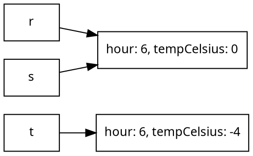

# Mutation and Side Effects

You might have noticed in the previous chapter that the arrays never actually changed. Every `map` and `filter` produced a new array, every `reduce` produced a new value, and `day` itself came through every example unchanged. That is also true of every program in this course so far, and of every program you wrote in CPSC 110: values were created, used, and combined into new values, but an existing value was never modified.

This chapter introduces the ability to change existing values, called **mutation**. The syntax that enables mutation is short (most of it is a single `=` sign) but this single character can have important consequences for how you think about software construction. Mutation introduces the dimension of *time* into our programs: the answer to "what does this variable hold?" stops being something we can read directly from the source code and becomes a feature of a particular instant in time during the program's execution. This requires a shift in how we view our programs as we need to read the static text and simulate in our heads how the code will behave at runtime. We'll step through this thought process over the course of this chapter.


## Reassignment

So far, every variable we have declared has been using the `const` keyword. `const` guarantees that the value associated with the name will remain unchanged for the duration of a program. TypeScript provides a second way to declare a variable: `let`, which allows variables to be **reassigned** zero or more times as the program runs.

```typescript
const absZero = -273;
absZero = -273.15;              // error: absZero is defined const and cannot be reassigned
let temperature = -4;           // temperature holds -4 after this line executes
temperature = 1;                // temperature now holds 1 after this line executes
temperature = temperature + 2;  // temperature now holds 3 after this line executes
```

Every declaration you have written in this course uses `=` to store a first value into a brand-new name, an operation called **assignment**. The last two lines, where `=` stores a value into a name that *already exists*, is different as the old value `temperature` used to hold is replaced. This is **reassignment**, and it is only permitted for variables declared with `let`.

A reassignment is performed in two steps: first the right-hand side is evaluated, using the values the variables hold *right now*; then the result is stored into the name on the left, replacing whatever it held. This makes the `=` operator different than the equals sign of mathematics. The last line above makes no sense as a math equation (no number equals itself plus two), but as an instruction it is perfectly clear: take the value `temperature` currently holds (`1`), add `2`, and store the result (`3`) back into `temperature` 

Reassignment is a statement, like `if` and `return` from the first chapter: it produces no value, it performs an action. And because each reassignment replaces a value, the *order* of statements now matters in a way it never did before:

```typescript
let x = 1;
x = x * 2;
x = x + 3;
// x holds 5; if the two reassignments were swapped, x would hold 8
```

The **state** of a program is the value every variable holds at a particular instant during execution. Before mutation, a program had no state worth describing: a name meant one value, forever. With mutation, understanding a program means tracing its state over time: running the program in your head, statement by statement, the way we traced `temperature` above. When a program with mutation surprises you, the cause is almost always a difference between the state you *thought* the program was in and the state it was *actually* in.

<details class="tooltip link-110">
<summary>There Was No Mutation in ISL</summary>

This is the first construct in the course with no counterpart in CPSC 110. In the teaching languages, `define` bound a name to a value once; nothing could change it afterwards. That absence was what made the stepper possible: because a name meant one value forever, any name could be replaced by its value, anywhere, without changing what the program meant. Mutation gives that property up. A name can no longer be replaced by "its value", because *which* value depends on where the program is in its execution. This is the most significant difference between the two languages so far, deeper than any syntax, and it is why this chapter moves slowly.

</details>

<details class="tooltip ts-tips">
<summary>The <code>let</code> keyword</summary>

`let` declares a variable exactly as `const` does, with one difference: the value may be reassigned. Note that the declaration keyword is written once; reassignment is just the name and `=`, with no `let` in front. Writing `let` again would be an error, because it would attempt to declare a second variable with the same name.

The habit to build: declare *everything* with `const`. When a value turns out to need changing, the compiler will tell you so (it refuses to compile a reassignment to a `const`), and at that moment you make a deliberate decision to change that one declaration to `let`. A `const` tells every reader "this value is settled"; the fewer `let`s a program contains, the less state there is to trace.

</details>

## State Gives Loops a Memory

The arrays chapter promised that loops have a second strength we were not ready for: values that change as the loop runs. Here is a problem that needs it.

> As a weather forecaster, I want to find the longest unbroken stretch of below-freezing hours in a day, so that I can report the severity of overnight cold snaps.

No single `map`, `filter`, or `find` computes this, because the answer depends on *runs* of consecutive elements: the computation has to remember how long the current cold streak is, and reset that memory every time the temperature rises above freezing.

```typescript
/**
 * Computes the length of the longest run of consecutive
 * below-freezing readings in a day.
 *
 * @param {Reading[]} day the readings to examine, in hour order
 * @returns {number} the length of the longest freezing streak
 */
function longestFreezingStreak(day: Reading[]): number {
    let current = 0; // consecutive freezing readings ending here
    let longest = 0; // best streak seen so far

    for (const reading of day) {
        if (reading.tempCelsius < 0) {
            current = current + 1;
            if (current > longest) {
                longest = current;
            }
        } else {
            current = 0; // the streak is broken
        }
    }
    return longest;
}
```

```typescript
test("longest freezing streak spans the early morning", () => {
    checkExpect(longestFreezingStreak(day), 2);
});
```

The two counters are the loop's state: values that survive from one element to the next and change as the loop runs. To see the state evolve, trace the loop over our `day` of readings, whose temperatures are `-4, -1, 3, 8, 2, -2`:

| reading | freezing? | `current` after | `longest` after |
|---|---|---|---|
| hour 6, -4° | yes | 1 | 1 |
| hour 9, -1° | yes | 2 | 2 |
| hour 12, 3° | no | 0 | 2 |
| hour 15, 8° | no | 0 | 2 |
| hour 18, 2° | no | 0 | 2 |
| hour 21, -2° | yes | 1 | 2 |

The morning streak of two readings is recorded in `longest`, survives the warm afternoon, and is not beaten by the single freezing reading in the evening. A trace table like this one is a standard tool for understanding stateful code, when programs are small enough. Writing one out by hand is a reliable way to debug: it makes the program's state visible.

<details class="tooltip deep-dive">
<summary>Use the Debugger for Larger Programs</summary>

A trace table is something you fill in by hand, which is practical only for short programs. Your IDE includes a **debugger** that does the same work automatically and at any scale. You set a **breakpoint** on a line, run the program, and execution pauses when it reaches that line. While it is paused, a panel shows the current value of every variable in scope, so you can read the program's state directly instead of reconstructing it on paper.

From a breakpoint you can **step** through the code one statement at a time and watch the values change. This is the trace table built for you as the program runs. You can also modify a variable while execution is paused and then continue, which lets you test what would happen for a different value without editing the code and running it again.

The debugger should be the main tool you think of whenever a program runs to more than a screen of code and you need to understand how it is operating at runtime.

</details>

## Changing Objects and Arrays

Reassigning a variable is one kind of mutation. The second kind is changing the *contents* of an object or array, and it needs no `let` at all:

```typescript
const reading = { hour: 6, tempCelsius: -4 };

reading.tempCelsius = -3;                  // allowed: the object's contents changed
reading = { hour: 6, tempCelsius: -3 };    // compile error: reading is a const
```

That this is allowed can feel surprising. `const` froze the *variable* (the name `reading` will refer to this object forever) but it says nothing about the object itself, whose properties remain assignable. The distinction between a name and the thing it refers to is the subject of the next section; for now, notice that the two lines above really do different things, and the compiler treats them differently.

Arrays are objects, and they mutate the same ways. Elements can be replaced through their index, and the classic array mutations are the pair that grow and shrink the array itself: **`push`** adds an element to the end, and **`pop`** removes the last element and returns it.

```typescript
day.push({ hour: 22, tempCelsius: -3 });   // adds a seventh reading to the end
const removed = day.pop();                 // removes that reading; day has six again
day[0] = { hour: 5, tempCelsius: -6 };     // replaces the first element entirely
day[1].tempCelsius = -2;                   // reaches into the second element and changes it
```

The complexity mutation brings is justified by what it models: in the real world things change, and to model them effectively, programs need to be able to change too. Our weather station does not receive its day of readings all at once: a new reading arrives every hour, and `push` is exactly how the day grows. Rebuilding the entire array to add one element would say something false about the problem, and at scale it is also wasteful: updating one reading in a year of data by copying the other thousands of readings does real, measurable work that updating in place does not.

<details class="tooltip ts-tips">
<summary>Mutating and Non-Mutating Array Operations</summary>

Arrays carry both kinds of operation, and it pays to know which is which. `map` and `filter` return a **new array** and leave the original untouched; that is why the previous chapter could use them freely before mutation existed. `push`, `pop`, and `sort` **mutate the array in place**. The names do not announce the difference, so when using an array operation for the first time, check its documentation to see whether it modifies the array or returns a new one. A surprising number of real-world bugs are a `sort` that quietly reordered an array somebody else was still using.

</details>

## Copies and References

To understand what a variable holds, we unfortunately need to deal with the fact that programming languages sometimes make design decisions for the sake of performance. While we do not like to think about performance too much while we are making our first initial systems, performance is the reason this section, and the confusion it imparts, exists.

To predict which changes are visible where, we need a precise picture of what a variable actually holds. The picture has two cases. A variable holding a **primitive** value (a `number`, `string`, or `boolean`) holds the value itself. Assigning it to another variable **copies the value**, and from then on the two variables are entirely independent:

```typescript
let a = 5;
let b = a;          // b receives its own copy of 5
b = 6;
checkExpect(a, 5);  // a is unaffected
```

A variable holding an object or array does *not* hold the object itself. It holds a **reference**: a value that says where the object is.

This is the performance decision this section opened with. In a simpler world, assigning an object would copy it exactly the way assigning a number does, and every variable would be independent of every other. The language declines to do this because of what copying costs. A primitive has a small, fixed size, so copying one is essentially free. An object has no size limit: a single `Reading` is small, but an array holding a year of readings, or an object whose properties are themselves objects, can occupy enormous amounts of memory, and the language cannot know at a given `=` sign whether the copy would be cheap or extremely expensive. So objects are never copied on assignment. What is copied instead is the reference, which stays the same small size no matter how large the object it leads to. This efficiency has a consequence: assigning an object to another variable copies *the reference*, not the object, so both variables now refer to the **same object**:

```typescript
const r = { hour: 6, tempCelsius: -4 };
const t = { hour: 6, tempCelsius: -4 };
const s = r;                     // s receives r's reference
s.tempCelsius = 0;
checkExpect(r.tempCelsius, 0);   // change visible to r and s
```


<!-- caption="r and s reference the same object." -->

One way to think about this is in terms of boxes. A variable is a labelled box. For a primitive, the box contains the value. For an object, the box contains an arrow pointing to the object, which lives elsewhere. `const s = r` copies the *arrow*. There is still exactly one `Reading`; it simply has two arrows pointing at it, and a change made through either arrow is visible through both. Two variables referring to the same object are called **aliases**, and *aliasing* is the single most common source of mutation surprises: code changes an object through one name, and the change appears under another name somewhere else entirely.

<details class="tooltip deep-dive">
<summary>References Are Pointers (a Preview of CPSC 213)</summary>

Concretely, the box holds a **memory address**. Every object lives somewhere in the computer's memory, and a reference is the number of the location where that object begins; the "arrow" in our box picture is the runtime following the address to the object. C, the language at the centre of CPSC 213, makes all of this explicit. Its references are called **pointers**, a pointer's numeric value can be printed, compared, and even used in arithmetic, and the language has dedicated operators for taking an address (`&x`) and for following one (`*p`). TypeScript runs on the same machinery but hides it completely: you cannot observe an address, manufacture one, or do arithmetic on one. Everything this chapter says about sharing and aliasing is the visible behaviour of that hidden machinery.

The other thing C makes explicit is memory management. In this course we never think about where objects live or when their memory comes back; in C, the programmer asks for memory when creating an object (`malloc`) and must announce when the program is finished with it (`free`), because nothing else will. Both directions of mistake are serious: freeing too early leaves *dangling pointers*, aliases to memory that may already be reused for something unrelated, and forgetting to free *leaks* memory that can never be recovered while the program runs. Many of the most damaging security vulnerabilities in widely used software are exactly these mistakes. TypeScript spares you all of it by reclaiming unreachable objects automatically (the garbage collection deep-dive later in this chapter), trading away some performance and control to do so. When you reach CPSC 213 you will manage memory yourself, and you will see precisely what the runtime has been quietly doing for you here.

</details>

This also explains the `const` surprise from the previous section: `const` locks the box, not the object the arrow points to. The arrow cannot be redirected, but the object at the end of it remains as mutable as ever.

<details class="tooltip ts-tips">
<summary>Reference equality vs value equality</summary>

`===` (strict equality, from the arrays chapter) means different things for primitives and objects, and the difference is exactly the visibility distinction from this section.

For *primitives*, `===` compares values. Two numbers that happen to be equal are `===`, whether or not they were declared together:

```typescript
let x = 5;
let y = 5;
checkExpect(x === y, true);   // equal values
```

For *objects*, `===` compares identity: it asks whether two variables refer to the same object in memory, not whether their contents match.

```typescript
const r = { hour: 6, tempCelsius: -4 };
const s = r;                              // s refers to r's object
const t = { hour: 6, tempCelsius: -4 };   // a separate object with equal contents

checkExpect(r === s, true);    // the same object
checkExpect(r === t, false);   // different objects, even though their contents are identical
```

This is the visibility rule restated as a comparison. Because `r` and `s` are the same object, a mutation through one is seen through the other; because `t` is a different object, it is untouched:

```typescript
s.tempCelsius = 0; // mutate s
checkExpect(r.tempCelsius === 0, true);    // r sees the change made through s
checkExpect(t.tempCelsius === -4, true);   // t, a separate object, does not
```

So `r === t` being `false` is not a technicality. It is the runtime telling you that `r` and `t` are independent, and that changing one will never change the other.

</details>

## What a Function Can and Cannot Change

The copy-versus-reference distinction matters because calling a function performs exactly the assignment we just studied: each argument is assigned to its parameter, copying boxes. Everything about what a function can change in its caller follows from that one fact. There are three cases, and they are worth walking through slowly, because this is where mutation most often defies expectations.

**Passing a primitive: the function gets a copy.** The parameter is a new box holding a copy of the value, so nothing the function does to it can affect the caller:

```typescript
function bump(n: number): void {
    n = n + 1;          // changes only the function's own copy
}

let hour = 6;
bump(hour);
checkExpect(hour, 6);   // unchanged: bump accomplished nothing observable
```

This behaviour is called **pass-by-value**: the function receives the value, not the variable. `bump` compiles and runs without complaint, and does nothing at all.

**Passing an object: the function gets a copy of the reference.** The parameter is a new box, but it holds a copy of the *arrow*, and the arrow points at the caller's object. Mutation through the parameter changes the one object both arrows share, and the caller sees it:

```typescript
/**
 * Corrects a reading from a sensor that is known to measure
 * offset degrees away from the true temperature.
 * Modifies the given reading in place.
 */
function calibrate(reading: Reading, offset: number): void {
    reading.tempCelsius = reading.tempCelsius + offset;
}

const morning = { hour: 6, tempCelsius: -4 };
calibrate(morning, 1);                  // the sensor reads one degree low
checkExpect(morning.tempCelsius, -3);   // the caller's object changed
```

This behaviour is commonly called **pass-by-reference**: the function is operating on the caller's object, not a private copy. The change `calibrate` makes is externally visible, and it outlives the call.

**Reassigning an object parameter: still invisible.**  One tricky aspect of pass-by-reference comes up when we reassign a method's parameters. The only parameter holds a *copy* of the arrow, so re-assigning that copy points the function's own box somewhere new. This leaves the original reference unchanged. This sounds straightforward, but it is worth ensuring you fully understand this example, as many languages have these kinds of tricky semantics:

```typescript
function reset(reading: Reading): void {
    reading = { hour: reading.hour, tempCelsius: 0 };  // redirects the local arrow only
}

const evening = { hour: 21, tempCelsius: -2 };
reset(evening);
checkExpect(evening.tempCelsius, -2);   // unchanged
```

Compare `calibrate` and `reset` carefully: one writes `reading.tempCelsius = ...`, the other writes `reading = ...`. Mutating *through* a reference (`reading.tempCelsius`) changes the shared object and is visible to the caller. Reassigning *the reference itself* (`reading`) merely rebinds the function's local name and is invisible. The dot is the difference.

<details class="tooltip deep-dive">
<summary>What "Pass-by-Reference" Precisely Means</summary>

The terms used above are the ones you will hear in practice, but the precise story is sharper: TypeScript passes *every* argument by value; it is just that for objects, the value being copied *is a reference*. Some languages have true pass-by-reference (C++'s `int&`), where the parameter is the caller's variable under another name, and a reassignment like the one in `reset` *would* change the caller's variable. TypeScript has no such mechanism, which is why `reset` cannot work. The behaviour TypeScript has (copy the reference, share the object) is sometimes given its own name, *call-by-sharing*. You do not need the vocabulary often, but when you learn your next language, "are object arguments shared or copied, and can a callee rebind my variable?" is exactly the right question to ask.

</details>

The three cases, summarised:

| Argument passed | The parameter receives | Reassigning the parameter | Mutating the object it refers to |
|---|---|---|---|
| `number`, `string`, `boolean` | a copy of the value | invisible to the caller | n/a (primitives have no parts to change) |
| object or array | a copy of the reference | invisible to the caller | **visible to the caller** |

The same distinction, drawn out:

```ditaa
 Primitive argument: the parameter is a separate copy.

    caller            function
    +------+          +------+
    |  6   |          |  6   |
    +------+          +------+
    (independent; changing one cannot affect the other)


 Object argument: the parameter copies the arrow, not the object.

    caller  ---+
               |
               v
          +----------+
          |  object  |
          +----------+
               ^
               |
    function---+
    (mutating through either arrow is seen by both)
```
<!-- caption: "A primitive argument is copied; an object argument shares one object through a copied reference." -->

<details class="tooltip ts-tips">
<summary>The <code>void</code> Return Type</summary>

The functions above are our first whose signatures declare a return type of **`void`**: they return nothing, so there is no value to name. A `void` function is called purely for what it *does* rather than what it *produces*. Before this chapter, that would have made such a function useless. `bump` genuinely is useless; `calibrate` is not, and the difference between them is the subject of this chapter.

</details>

## Scope: Where Names Live

Mutation makes it newly important to know exactly where each variable exists, because every variable that can change is something a reader must keep track of. The rule in TypeScript is **block scope**: a variable exists from its declaration to the end of the block (the `{ ... }`) that encloses it, and outside that block the name simply is not there. The compiler enforces this statically:

```typescript
function describe(reading: Reading): string {
    if (reading.tempCelsius < 0) {
        const label = "freezing";
        return label;        // fine: label is in scope here
    }
    return label;            // compile error: Cannot find name 'label'
}
```

Blocks nest, and the rule works one way: an inner block can use names declared in the blocks that enclose it, but never the reverse. `longestFreezingStreak` relies on this. Its loop body reads and reassigns `current` and `longest`, which are declared *outside* the loop in the function's own block; that is what lets their values survive from one iteration to the next. To see why their position matters, consider what happens if `current` is declared inside the loop body instead:

```typescript
for (const reading of day) {
    let current = 0;             // a brand-new current for every element
    if (reading.tempCelsius < 0) {
        current = current + 1;   // always computes 0 + 1
    }
}                                // ...and current is gone again
```

Each pass through a loop body is a fresh copy of the block: this `current` is created holding `0`, exists for one iteration, and is discarded at the closing brace, along with its value. A variable declared inside a block cannot remember anything across runs of that block. Choosing where to declare a variable is therefore not a formality: it is choosing how long the state lives, and the rule of thumb is to declare each variable in the *smallest* block that still spans every use of it.

So values do not escape their blocks. There are three exceptions, and we have already met all three:

1. **The value is returned.** `longest` the *name* dies when `longestFreezingStreak` ends, but its final *value* escapes through `return` into the caller's hands.
2. **The value is assigned to a variable declared outside.** The loop body's assignments to `current` and `longest` outlive each iteration precisely because those variables live in the enclosing block.
3. **The block mutates an object that is visible outside.** This one is the easiest to miss. Consider calibrating an entire day:

```typescript
function calibrateDay(day: Reading[], offset: number): void {
    for (const reading of day) {
        reading.tempCelsius = reading.tempCelsius + offset;
    }
}
```

Every name in sight here is short-lived: `reading` is re-created each iteration, and `day` the parameter vanishes when the function returns. Yet every change survives, because the *objects* those names pointed at belong to the caller's array, which is still in scope outside the function. Scope governs **names**; it does not govern **objects**. An object lives as long as anything, anywhere, still refers to it, and mutations made to it through a short-lived name are permanent all the same. Block structure determines whether a variable still exists; the arrows determine whether a change persists.

<details class="tooltip deep-dive">
<summary>Object Lifetimes and Garbage Collection</summary>

Scope does not determine an object's lifetime; *reachability* does. An object lives as long as some chain of references, starting from a live variable, leads to it. When the last reference is gone, the object can never be observed again, and the runtime reclaims its memory automatically, a mechanism called **garbage collection**. This is why TypeScript programs never explicitly destroy objects. Languages without garbage collection (C, C++) make the programmer manage object lifetimes by hand, and entire categories of serious bugs live in that gap.

</details>

<details class="tooltip deep-dive">
<summary>Mutability, Immutability, and Program Complexity</summary>

A value that can never change after creation is called **immutable**, and much of this chapter's difficulty disappears when data is immutable. Aliasing only matters because somebody can write: two arrows pointing at an object that nobody can change behave exactly like two private copies, so the copy-versus-reference distinction stops affecting what a program computes. A reader can treat every immutable value as a fact rather than a state: learn it once and rely on it anywhere, in any order. ISL had this property everywhere. With no mutation in the language, every value was a fact, which is part of why the substitution model worked and why no chapter before this one needed a trace table.

Mutability provides efficient updates and direct modelling of change, at the cost of exactly this reasoning. Every alias to a mutable object is a potential writer, so the effort of understanding a value grows with the number of places that can reach it, and the order of operations starts to matter. The complexity is real enough that much of professional practice is organised around limiting it: declaring everything `const`, preferring operations like `map` and `filter` that return new values, and designing types whose instances are never modified after construction. Some languages go further; in Rust, values are immutable unless explicitly marked otherwise, and the compiler restricts shared mutable data.

The working compromise in most systems, and in this course, is immutability by default with mutation where the problem demands it. A program in which the few mutable values are clearly marked, narrowly scoped, and changed in only a few places keeps most of the simplicity of immutable data while paying mutation's costs only where they are needed.

</details>

## Side Effects

We now have a name for what `calibrate` and `calibrateDay` do. A **side effect** is any observable change a function makes besides returning a value: mutating an object its caller can see, reassigning a variable outside its own scope, or interacting with the world outside the program entirely (writing a file, printing output, sending a network request). A function with no side effects, one that only computes a value from its inputs, is called **pure**. Every function in this course before today was pure.

Side effects change what we must do as readers, as documenters, and as testers of code:

- **Reading.** A pure function can be understood from its signature: `Reading[]` in, `number` out. A signature like `calibrateDay`'s (`void` out!) says nothing about what the function is *for*; its entire purpose is the effect. You must read the body, or trust the documentation.
- **Documenting.** Because the signature is silent, the documentation has to say what the function changes: notice the line `Modifies the given reading in place` in `calibrate`'s comment. A mutating function whose documentation does not mention the mutation is a trap for every caller who reasonably assumes their arguments come back untouched.
- **Testing.** A pure function is tested by checking its return value. A mutating function is tested by checking *state*: call it, then assert on the object afterwards.

```typescript
test("calibrateDay shifts every reading by the offset", () => {
    const readings: Reading[] = [
        { hour: 6, tempCelsius: -4 },
        { hour: 9, tempCelsius: -1 }
    ];
    calibrateDay(readings, 1);
    checkExpect(readings[0].tempCelsius, -3);
    checkExpect(readings[1].tempCelsius, 0);
});
```

There is one more consequence, and it is the one this part of the course has been building toward. The invariants chapters established a comfortable discipline: validate a value when it is constructed, and rely on the invariant afterwards. Mutation breaks the "afterwards". `reading.hour = 99` is a perfectly legal statement that violates the `Reading` invariant long after construction, and aliasing means *any* part of the program holding a reference can do it, at any time, from anywhere. Under mutation, an invariant is no longer established once; it must be *preserved by every operation that touches the data, forever*. Keeping that promise when references can travel anywhere in the program requires controlling who is allowed to mutate at all, and that problem (restricting mutation to a trusted set of operations) is precisely the focus of part 2 of the course.

Until then, the working guidance falls back on a discipline-based approach:

- Declare every variable with `const`. When a value turns out to genuinely need changing, change that one declaration to `let`, deliberately. Every `let` is a value your reader must trace through time.
- Prefer the non-mutating operations (`map`, `filter`) when they fit; reach for mutation when the problem is genuinely about change, as the arriving readings and the streak counters were.
- Keep mutable state in the smallest scope that works: a counter local to one function is easy to reason about; a mutable value visible to the whole program can be changed by the whole program.
- Clearly document mutation when it happens: in a function's name, its documentation, and its tests.

## Mutating the World

Mutation is worth the extra mental burden it induces: real programs model a changing world. Programs must now be understood by tracing values through time, and every reader needs to be able to answer a new set of questions precisely: is this a copy or a reference? Does this change escape this block, this function, this module? Who else holds an arrow to this object? The box-and-arrow model and the scope rules in this chapter are the tools for answering them. Side effects also add new complexity we have not encountered yet: effects that reach *outside* of specific functions, to other parts of the program, to files, databases, networks, and users. But since the point of programs is to do useful work for people, side effects are important and are a fundamental part of real software systems that require careful thought and design to use effectively without making a program too hard to understand or brittle to evolve.

<!-- RTH: let's leave off this bridge for now; not sure if we want to keep these so clearly anyways. 

The outside world has a property that nothing in our programs has had so far: it does not answer immediately. What programs do while they wait is the subject of the next chapter. -->

<details class="tooltip exercise">
  <summary>Exercise: Moving a Robot</summary>

Here we practise in-place mutation, references and aliasing on a small moving object.

> As a game engine, I want a robot's position updated as it moves, so that the rest of the game can read its current location.

A robot is just a position:

```typescript
type Robot = { x: number; y: number };
```

1. Write `step(robot: Robot, dx: number, dy: number): void` that moves the robot by adding `dx` to its `x` and `dy` to its `y`, changing the robot in place. Create a robot at `{ x: 0, y: 0 }`, call `step(robot, 1, 2)`, and use `checkExpect` to confirm the caller's robot now has an `x` of 1 and a `y` of 2.
2. Write `teleport(robot: Robot, x: number, y: number): void` that instead _reassigns the parameter_, with `robot = { x: x, y: y }`. Predict what the caller's robot looks like after `teleport(robot, 9, 9)`, then confirm it with `checkExpect`. Why does `step` change the caller's robot while `teleport` does not?
3. Give a robot a second name with `const other = robot`. Call `step(other, 3, 0)`, and use `checkExpect` to show that `robot` sees the move, because `other` is an alias for the same object. Then build a separate robot `twin` with the same coordinates, and use `===` to confirm that `robot === other` is `true` but `robot === twin` is `false`.
4. Write `walk(robot: Robot, steps: number[]): void` that uses a `for of` loop to apply each number in `steps` as an eastward move (one `step(robot, s, 0)` per element), so the position carries forward from one iteration to the next. Check the robot's final `x` against the sum of `steps`.

</details>
