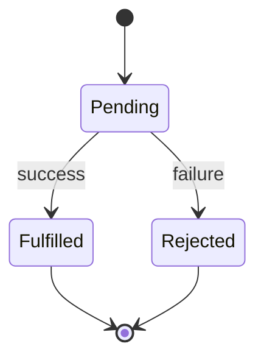
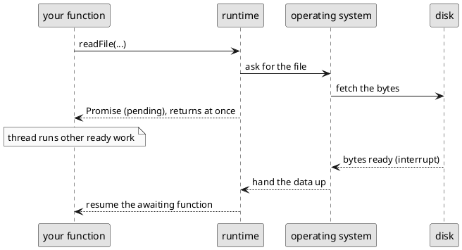
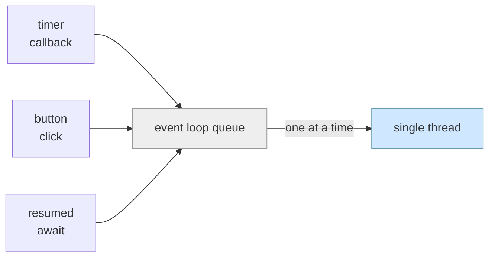

# Asynchronous Effects and Time

The previous chapter ended with **side effects**: changes that reach beyond a function, and sometimes beyond the program entirely, to files, networks, and users. We saw how side effects significantly complicate the mental model we have of computation. This chapter intorduces asynchronicity, which will further complicate the mental model.

Programs become much more useful when they interact with the outside world. A weather station that can only summarise readings typed into its source code is a _calculator_. A weather station that can load a year of readings from a file, fetch the current conditions from a web service, and write its report somewhere permanent is a _system_. Most software needs require interacting with the outside world:

> As a weather-station operator, I want to load past readings from a file and fetch current conditions from the regional service, so that my station can publish complete reports without my entering the data by hand.

But the outside world has a property that nothing inside our programs has had so far: it is *slow*. It does not answer immediately. This chapter is about what programs do while they wait. The mechanics take some getting used to, but by the end you will be able to (1) read and write files and (2) call web-based services.  Those two capabilities are the foundation for almost everything programs do in practice.

## How Long Computers Wait

Inside the processor, work is astonishingly fast: a simple operation takes around a nanosecond, a billionth of a second. Everything outside the processor is slower, and the further away the data lives, the worse it gets. The numbers are hard to feel at nanosecond scale, so the table below also shows each one rescaled, as if a single instruction took one second:

| operation | typical time | scaled: if one instruction took 1 second |
|---|---|---|
| one instruction | 1 ns | 1 second |
| reading from an SSD | 150 µs | ~2 days |
| network round trip, same city | 1 ms | ~11 days |
| reading from a spinning disk | 10 ms | ~4 months |
| cross-country network round trip | 150 ms | ~5 years |

The pattern to take away: touching a disk or a network is not a little slower than computing, it is *millions of times* slower. From the processor's point of view, asking a distant web service for the temperature and then waiting for the answer is like mailing a letter and standing motionless at the mailbox for five years.

A call that waits like this is called **blocking**: the function does not return until the slow work finishes, and the program makes no progress of any kind in the meantime. For a program that has nothing else to do, blocking is merely wasteful. For most real programs, it is unacceptable: a program frozen for the duration of a network request cannot respond to its user, accept another request, or do any of the computation that is already ready to go.

## One Thread at a Time

What a program can do while it waits depends on the language's **threading model**. A **thread** is an independent sequence of executing statements. 

Many languages (e.g., Java and Rust) let a program run several threads at once: one thread can block on the network while the others keep working. Using multiple threads is powerful... and famously difficult to use correctly. The previous chapter showed how hard it is to reason about *one* sequence of mutations. With _multiple_ threads mutating shared objects at the same instant, through all the aliases references allow, it is even harder. Whole categories of bugs exist only in multi-threaded programs.

TypeScript makes a different trade. A TypeScript program runs on a **single thread**: exactly one statement is executing at any moment, ever. You never have to wonder whether some other thread changed an object between two of your statements, because there is no other thread. The model is simple to reason about and easy to use. The cost is a loss of flexibility.

But a single thread sharpens the waiting problem. If the only thread blocks on a disk read, the entire program stands still; there is no second thread to carry on. So,  TypeScript provides a mechanism for a program to *start* a slow operation, carry on with other work immediately, and come back to the result when it is ready. Computation that is set aside to run later like this is called **deferred computation**, and it is the central idea of this chapter.

<details class="tooltip deep-dive">
<summary>Threads Elsewhere, and Why TypeScript Has One</summary>

In Java, creating a thread is a few lines of code, and large Java systems routinely run hundreds of them. The price is that any object reachable from two threads can be mutated by both at the same time, and the programmer must coordinate every such access; getting this wrong produces bugs that appear and vanish depending on timing, which are among the hardest in software to find. 

Rust goes further and uses its type system to prevent many of these errors statically. This is part of why Rust is considered safer than other languages... and harder to learn. 

Python technically allows multiple threads, but only one thread may make progress at once. If you're writing single-file Python code without `multiprocessing` or other Python multi-threaded libraries, when you make a network call or read a file, your code simply waits for the file to be read or the network call to finish. You will see a lag between a print statement put before and after an `open(*)` call, if the file you're opening is big enough.

JavaScript, the language TypeScript is built on, was designed for web browsers, where a page must stay responsive while images and data load. Its designers chose one thread plus deferred computation as a model that ordinary programmers could use without the hazards of multi-threading. That choice has proven good enough to run servers, editors, and most of the modern web.

</details>

## Deferred Computation: Callbacks

You have been handing functions to other code to run later since the first chapter. Every test does it:

```typescript
test("longest freezing streak spans the early morning", () => {
    checkExpect(longestFreezingStreak(day), 2);
});
```

The anonymous function is not executed where it is written. It is handed to `test`, which stores it and runs it later, when the test framework decides. A function passed somewhere else to be called later is a **callback**. Callbacks are how TypeScript expresses deferred computation.

The clearest way to *feel* deferral is to slow it down to human speed. The built-in function `setTimeout` takes a callback and a duration in milliseconds, and arranges for the callback to run after that much time has passed:

```typescript
console.log("starting the kettle");

setTimeout(() => {
    console.log("kettle has boiled");
}, 10000);

console.log("getting a mug ready");
```

Run this and the output is:

```
starting the kettle
getting a mug ready
kettle has boiled        <- printed ten seconds later
```

Read that order carefully, because it breaks our model that statements _execute in the order they appear in the file_. We've had this model of how code runs in every previous chapter.  `setTimeout` does not wait ten seconds; it *registers* the callback and returns immediately, and the program continues to the next statement. Ten seconds later, when the timer expires, the callback runs. The program got a mug ready while the kettle boiled instead of standing in front of it.

Asynchronous programming requires a mental shift: source code still lists statements top to bottom, but *when* each one runs is no longer the same as *where it is written*. The static and dynamic views of the program, which the first chapter introduced, have come apart in a new way: to know what this program does, you must now track _real time_ as well as state.

Timers are predicatable: you register their duration when you start them. But callbacks are typically used to allow programs to respond to _unpredictable_ events.


Nowhere is this clearer than in a _user interface_ (UI). Suppose the weather station's display has a refresh button. The program cannot know when the button will be clicked, whether it will be clicked at all, or how many times. We could try continually checking whether the button is clicked, but this would either yield wasted computation (as we're continually checking), and we might not respond soon enough (if we only check every few seconds). 

<!---And the single thread must not sit in a loop asking "clicked yet?... clicked yet?... clicked yet?", because a thread that is spinning is just as occupied as a thread that is blocked: the display would freeze, unable to respond to anything else, while it watched one button. ---->

Instead, to allow UIs to be responsive, the program registers a callback:

```typescript
// refreshButton is an object representing the on-screen button;
refreshButton.addEventListener("click", () => {
    redrawForecast();   // runs once per click, whenever the user clicks
});
```

When the user clicks the refresh button, the runtime raises an **event** and places it on a queue; as soon as the thread is free, the queued callback runs. Every interaction in every user interface you have used works this way: clicks, keystrokes, touches, and window resizes are all events with callbacks registered to handle them, and between events the thread is free to do other work. This style is called **event-driven programming**, and callbacks are what make it possible: they let a program describe *what to do when something happens* without ever asking *whether it has happened yet*.

<details class="tooltip deep-dive">
<summary>Debugging with <code>console.log</code> or a Debugger?</summary>

`console.log` prints its argument to the terminal. Printing is itself a side effect: an observable change made to the world outside the program, and printing is a standard tool for watching a program's behaviour unfold in time. We use it in this chapter precisely because *when* something happens has started to matter. 

That said, relying on `console.log` to diagnose complex problems breaks down as programs grow and become distributed. Your IDE's debugger is almost always a better choice than printing to the screen, as it lets you pause computation at any time and observe the current state of the whole program.

</details>

<details class="tooltip deep-dive">
<summary>Behind the Scenes: The Event Loop</summary>

The runtime keeps a **queue** of callbacks that are ready to run: a timer expired, a button was clicked, data arrived from a disk or a network. The single thread runs a permanent cycle called the **event loop**: it takes the callback at the front of the queue, runs it *to completion*, then returns for the next one; if the queue is empty, the thread sleeps until something is added to the queue.

There are two consequences of this architecture. First, run-to-completion means a callback is never interrupted partway through: no other code runs until it returns. This is what makes single-threaded programs simple to reason about. But it is also an added responsibility, because a callback that computes for a long time freezes the rest of the program; the loop cannot move on until the callback returns. Second, a duration like the timer's `10000` means "queue this callback no earlier than ten seconds from now", not "run it at exactly that moment": if the thread is busy when the timer expires, the callback waits in the queue for its turn. The event loop guarantees order and progress, not precise timing.

</details>


## Promises: A Value That Does Not Exist Yet

Callbacks defer computation, but they say nothing about *results*. Reading a file produces the file's contents; fetching from a web service produces a response. The program wants that value, the value will not exist until the slow operation finishes, and the program should not stand still in the meantime. TypeScript models a result-we-will-eventually-have in an object called a **promise**.

A promise is a receipt. When you order at a busy coffee shop, you need not stand at the espresso machine until your drink is poured; you are handed a numbered receipt, after which you can go about your business. When your drink is ready, your number is called and you trade your receipt for your drink. 

A promise fills the same role: it is an ordinary object, returned to you *immediately* by a slow operation, representing a value that will arrive later. Being an ordinary object, it can be stored in a variable, passed to a function, or placed in an array, like any other value.

A promise's type says what it will eventually deliver: a `Promise<string>` will deliver a `string`, and a `Promise<Reading[]>` will deliver an array of readings. (This is the same generics notation that `LinkedList<T>` used in the modelling chapter: a promise *of* something.)

Promises have three possible states. Every promise begins as **pending**: the work is still underway. Each promise completes, or *settles*, in one of two ways: **fulfilled**, holding the delivered value, or **rejected**, holding an error that explains why the value could not be produced. The language maintains two invariants on every promise, and you can rely on them the way you rely on your own data invariants: a promise settles *at most once*, and once settled, its state and value *never change again*. A fulfilled promise is permanently fulfilled, and a rejected promise is permanently rejected.


<!-- caption="Figure 07.01: Promise states. Promises settle once and only once." -->

You will rarely create a promise yourself. Promises are what slow operations *give you*: the file-reading and web-fetching functions later in this chapter all return them. 

Where you *will* meet promises constantly is in return types. When a function's signature says it returns a `Promise<string>`, the signature is telling you two things: the call itself will return immediately, and what it returns will not yet contain the value you actually want. The promise comes back right away; the result is available when the promise settles later. Here is what happens when the promise itself is treated as the value:

```typescript
import { readFile } from "fs/promises";

const contents = readFile("report.txt", "utf8");  // returns immediately
console.log(contents);  // prints "Promise { <pending> }", not the file's text
```

`readFile` returns a `Promise<string>`, so `contents` holds a pending promise: at the moment the `console.log` runs, the disk has not had time to respond. The type checker knows this too. `contents` has the type `Promise<string>`, not `string`, so a slip like `contents.length` is a compile error: the type system will not let you use the receipt as if it were the value it stands for. What the type system cannot do is hand you the value early. Collecting the value is the next section's subject.

<details class="tooltip deep-dive">
<summary>Syntactic Sugar</summary>

_Syntactic sugar_ is syntax that doesn't introduce new semantics, but simplifies writing code. For instance, in ISL, 
```racket
(define (addone x) (+ x 1))
```
is _syntactic sugar_ for 
```racket
(define addone (lambda (x) (+ x 1)))
```

Or, in TypeScript, the array type notation `number[]` is _syntactic sugar_ for `Array<number>`.

You can understand the use of "sugar" to mean that this is syntax that figuratively "sweetens", i.e. eases or [makes less painful](https://www.merriam-webster.com/dictionary/sweeten), the use of the language.

Syntax that is _syntactic sugar_ can _always_ be rewritten in some other way in the language. 

</details>

<details class="tooltip ts-tips">
<summary>Collecting Promise Values with <code>.then</code></summary>

Every promise carries a method named `then`, which accepts a callback; the promise runs that callback with the value once it is fulfilled:

```typescript
readFile("report.txt", "utf8").then((contents) => {
    console.log(contents);  // the file's text, printed once it has arrived
});
```

This connects callbacks and promises: a promise is, underneath, an object that runs callbacks for you when its value arrives, and the `await` syntax in the next section is built on exactly this mechanism. 

We show `then` here so you will recognise it in documentation and in other people's code, but we will not use it in this course. `await` is a form of _syntatic sugar_ that expresses the same thing and is much more readable.

</details>

## `async` and `await`

Here is a function that reads a file using `readFile`, the promise-returning function from the previous section:

```typescript
import { readFile } from "fs/promises";

async function loadReport(): Promise<string> {
    const report: string = await readFile("report.txt", "utf8");
    return report;
}
```

`await` takes a promise and produces the value it delivers. Above, `readFile(...)` is a `Promise<string>`, so `await readFile(...)` is a `string`. When execution reaches the `await`, the function pauses until the promise settles, and then continues with the value, on the very next line, as if the file's contents had simply been returned. 

The most important property of `await` is that *it pauses the function, not the program*. While `loadReport` is suspended at the `await`, the thread is free, and everything else the program has to do (timers, other deferred work, other paused functions whose promises have settled) keeps happening. An `await` is the program saying "wake me here when the value arrives", not "stand still until it does".

<details class="tooltip ts-tips">
<summary><code>await</code></summary>

The expression
```typescript
await <expression>
```

where `<expression>` evaluates to a value of `Promise<T>` type, suspends execution until the promise resolves. If the promise settles successfully, `await <expression>` evaluates to the value the promise resolves to, and execution resumes from there. If the promise is rejected, execution resumes for the program to _throw an error_: more on that in Chapter 10.
</details>

`async` communicates that a function may contain `await`, and it changes the function's return type: an `async` function always returns a *promise* of its result. `loadReport` is declared to return `Promise<string>`, not `string`, even though its body simply returns a string. This is because `loadReport` cannot hand its caller a `string` immediately: it itself is waiting on `readFile`. And what should the caller of `loadReport` do while `loadReport` is waiting on `readFile`? The caller itself must await on `loadReport`. 

So the caller gets a receipt, and collects it the same way, with `await`. Asynchrony is contagious: a function that awaits must be `async`, so its callers await it and must themselves be `async`, all the way up the program.

<details class="tooltip ts-tips">
<summary><code>async</code></summary>

The keyword `async` declares that a function will include some waiting on a promise. 

```typescript
async function f(x: X, y: Y, z: B): Promise<T> {
      // function body must return a T 
      // or a Promise<T>
}
```

If an `await` expression appears in a function body, that function must be declared `async`.

</details>


It is worth being clear about what `async` and `await` are *not*. They do not make anything run faster, and they do not create threads; there is still exactly one statement executing at any moment. They are readable syntax for deferred computation: the same deferral the `setTimeout` example performed with a callback, but now written so that the code reads top to bottom again. The semantics did not change; the syntax did.

While promises and `async`/`await` do not create threads, they take advantage of a deeper fact: the slow part of the work never needed our thread in the first place. When `readFile` starts, the request is handed down to the language runtime and the operating system, which carry the operation forward in the background whether our thread attends to it or not. Blocking was never _necessary_; it was our thread standing guard over work it could not help with. `await` is the program declining to stand guard: the thread spends the interval running whatever else is ready (or, in a user interface, simply staying responsive), and the paused function continues the moment its value arrives.

<details class="tooltip deep-dive">
<summary>Systems Details: Your Program, the Runtime, and the Operating System</summary>

A TypeScript program is the top layer of a stack, and each layer below it does part of the waiting. Beneath your program sits the **runtime**. One of the most common runtimes is [Node](https://nodejs.org/), which executes your compiled code, operates the event loop described earlier in this chapter, and provides the functions the language itself does not have, including `setTimeout`, `readFile`, and `fetch`. 

Beneath the runtime sits the **operating system**, which manages the machine's hardware on behalf of all running programs at once. Nothing your program does touches a disk or a network card directly; requests are passed down this stack.

Follow one `readFile` all the way down: Your function calls `readFile`, the runtime asks the operating system for the file, and the operating system instructs the disk hardware to fetch the bytes, then turns to its other work. No one at any layer sits and watches: the request exists only as bookkeeping, an entry in a table recording who should be told when the bytes show up. When the disk finishes, it signals the operating system (using a mechanism called an interrupt), the operating system passes the data up to the runtime, and the runtime fulfills the promise and places your paused function on the event loop's queue. The next time the loop reaches it, your function resumes at the `await` with the value.

Following one `readFile` down the stack and back, with no layer standing still while the disk works:


<!-- caption="Figure 07.02: A file read passing down the runtime and operating system and back." -->

Notice what this means about `await`: your paused function returns to execution through the very same queue that clicks and timer callbacks travel through. There is one loop, one thread, and one line to wait in, which is also why a long-running computation delays everything: file results, button clicks, and resumed functions all stand in the same queue behind it.

Everything that wants the thread waits in one queue, and the single thread takes them one at a time:


<!-- caption="Figure 07.03: Every event waits in one queue, served by the single thread one at a time." -->

This layered design is why a single thread is enough. The expensive waiting is done by hardware and the operating system, which are built for it and can juggle thousands of requests at once; the one thread in your program is reserved for the only thing that really needs it: running your code. A Node-based web server handling thousands of simultaneous connections on a single thread is this stack working as intended.

</details>

Because the receipt is so easy to mistake for the value, one mistake dominates all others in asynchronous code: _calling a promise-returning function_ and _forgetting_ the `await`. Sometimes the type checker catches it, as the pending `console.log` example in the previous section showed. But when the result is not used at all, the types raise no objection: a bare `loadReport();` on its own line compiles cleanly, *starts* the work, and continues past it without waiting, which is almost never what the surrounding code intends. The lint rules used in this course flag every call to a promise-returning function that is not awaited; when you see that warning, treat it as a bug report rather than a formality.

<details class="tooltip ts-tips">
<summary>Testing <code>async</code> Functions</summary>

A test body can be marked `async` too, and then it can await the functions it is testing:

```typescript
test("the report loads", async () => {
    const report: string = await loadReport();
    checkExpect(report.length > 0, true);
});
```

The test framework awaits the test body itself, so the test does not finish until every `await` inside it has delivered. Forgetting the `await` before an async call is the classic mistake: the test then checks a `Promise` object rather than the value it delivers, and fails confusingly.

</details>

<details class="tooltip exercise">
<summary>Check your Understanding of <code>async</code></summary>

Consider the following piece of code:
```typescript

async function slowlyReturnsThree(): Promise<number> {
    const three: number = await setTimeout(() => 3, 10000);
    return three;
}
```
The function is annotated to return `Promise<number>`. However, the `return three` statement returns `three`, a variable whose type is `number`, not `Promise<number>`. 

Should the return type of `slowlyReturnsThree` be `number` or `Promise<number>`? Explain why in your own words.
</details>

## Reading and Writing Files

With `async` and `await` in hand, files are within reach. Node, the runtime that executes our TypeScript programs, provides a standard library, and its file-system module exports the two functions that matter most: `readFile`, which delivers a file's contents, and `writeFile`, which replaces them. Both operations involve the disk latencies from the table at the start of this chapter, and both therefore return promises.

```typescript
import { readFile, writeFile } from "fs/promises";

/**
 * Copies today's report into the station archive.
 * Modifies the file system: creates or replaces archive.txt.
 */
async function archiveReport(): Promise<void> {
    const report: string = await readFile("report.txt", "utf8");
    await writeFile("archive.txt", report);
}
```

Two things are worth noting. First, the documentation says what the function *modifies*, exactly as the mutation chapter required: writing a file is a side effect, one that outlives not just the function but the entire program. Second, the order of the `await`s is important: `writeFile` cannot start until the contents have arrived, and the sequence of awaits expresses that dependency naturally. The function pauses at the first `await`, resumes when the contents arrive, pauses at the second, and resumes when the write completes; the program as a whole never stops.

<details class="tooltip ts-tips">
<summary>Text encoding (the <code>"utf8"</code> argument)</summary>

Files on disk are stored as raw bytes. The second argument to `readFile` names the **text encoding** to use when turning those bytes into a string, and `"utf8"` is the standard encoding for text and the one to use in this course. Without the argument, `readFile` delivers raw bytes rather than a `string`.

</details>

## Calling Web Services

The network is the second of the two capabilities this chapter promised. A **web service** is a program, running on another machine, that answers requests over the internet: ask it a question shaped like a URL, and it answers with data. The built-in function `fetch` makes the request and, being a slow network operation, returns a promise.

Suppose the regional weather network runs a service that reports current conditions for any station. Asking it for our station's temperature looks like this:

```typescript
type StationReport = {
    stationId: string;
    tempCelsius: number;
};

async function currentTemperature(stationId: string): Promise<number> {
    const response: Response = await fetch("https://weather.example.org/stations/" + stationId);
    const report: StationReport = await response.json();
    return report.tempCelsius;
}
```

There are two `await`s because the answer arrives in stages: the first delivers the response once the service has begun answering, and `response.json()` delivers the response's *body*, parsed from text into an object, which can itself take time for a large reply. After the second `await`, `report` is an ordinary object, and the function reads a property from it like any other.

The type annotation on `report` is a statement of *our expectation*, not something the compiler can verify: the data was manufactured by another machine at runtime, and no type checker can see across a network. If the service changes its reply format, the program will compile cleanly and then misbehave when it runs. 

The compiler's guarantees stop at the program's edge. At the edges, the discipline from the invariants chapters takes over: data arriving from outside should be *checked* before the rest of the program relies on it. We will not build that checking today, but you should notice the boundary it belongs on.

## When Slow Things Fail

Everything in this chapter can fail in ways pure computation cannot: a file may not exist, a network may be down, a service may answer nonsense. This is what the rejected state of a promise is for, and when an `await`ed promise rejects, the error surfaces in your program at the `await`.

Handling these failures well is complex: we will defer this subject to Chapter 10 in Part 2, rather than compressing that complexity into a paragraph in this already-complex chapter. 

For this chapter and its exercises, the policy is simple: we will work with files that exist and services that answer. If your program crashes, read the message it crashed with and fix the bug it points at (the most common error is that a path or URL is not quite right). Crashing immediately with a clear message is acceptable behaviour for a program at this stage; handling failures more gracefully comes later.

## From Mechanics to Abstraction

Mutation introduced state and time *inside* the program. Asynchrony extends time to the world *outside* the probram: data lives on disks and on other machines, and arrives only after a wait. The program need not spend all that time standing still. The model TypeScript gives us is single-threaded and deferred: slow operations hand back promises, `await` collects their values while the lone thread stays busy, and `async` marks every function that participates. With files and web services available, our programs can act on data that comes from outside their own source code.

This also closes Part 1. You are now adept at the mechanics of modelling a problem with types, writing contracts and tests that validate behaviour, maintaining invariants, managing state, and changing data in the the outside world. We have come a long way: TypeScript is a fully-featured, industrial-strength language. 

But so far, every program we have seen has been small enough for one person to hold in their head, and that has let personal discipline carry a lot of weight in ensuring the program works as intended. Part 2 investigates what happens when it cannot: when programs, teams, and lifetimes outgrow any single person, and the discipline has to move into the language itself. This requires a new level of abstraction, and new support from the programming language.

<details class="tooltip exercise">
  <summary>Exercise: A Journal on Disk</summary>

Practise using `async` and `await` for reading and writing files on a new kind of data.

> As a journaling app, I want to count a writer's entries, keep a backup of their journal, and restore it on request, so that they can track their progress and recover their work if the file is lost.

The journal is a plain text file, one entry per line.

1. Write `async function lineCount(path: string): Promise<number>` that reads the file at `path` as text (pass `"utf8"` to `readFile`) and returns how many lines it has. (Hint: <span class="hint">`text.split("\n")` gives an array of the lines.</span>) Test it with an async test, of the form <span class="hint">`test("...", async () => { checkExpect(await lineCount("entries.txt"), ...); })`</span>. 
2. Write `async function backUp(path: string): Promise<void>` that reads the journal and writes its contents to a new file at `path + ".bak"`. Write the doc comment: <span class="hint">record that the function modifies the file system, as the mutation chapter required.</span> Note that <span class="hint">the two `await`s must run in order: the backup cannot be written before the contents have been read</span>.
3. Write `async function restore(path: string): Promise<void>` that reads the backup <span class="hint">at `path + ".bak"`</span> and writes its contents back to `path`, replacing the journal with the backed-up copy. Write the doc comment: <span class="hint"> document the file-system change,</span> and,  <span class="hint">as in `backUp`, make sure the read finishes before the write begins</span>.

</details>
