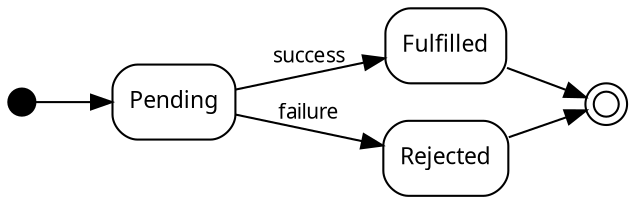
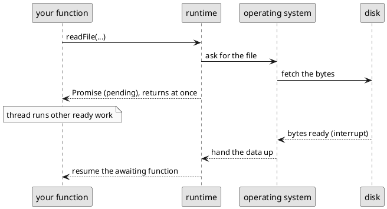
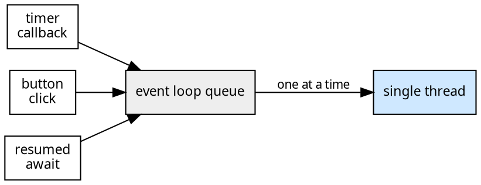

# Asynchronous Effects and Time

The previous chapter ended with **side effects**. These are changes that reach beyond a function, and often beyond the program entirely, to change something in the real world. In this chapter we will introduce asynchronicity, which will further complicate how we design our code, but specifically with the goal of enabling us to change state in the world.

Programs become much more useful when they interact with other programs and other users. A weather station that can only summarise readings typed into its source code is a calculator, but a weather station that can load a year of readings from a file, fetch the current conditions from a web service, and make a report accessible over the web is a system. Most software systems need to interact with the world to accomplish their tasks:

> As a weather-station operator, I want to load past readings from a file and fetch current conditions from the regional service, so that my station can publish complete reports without my entering the data by hand.

But the outside world operates at a different pace than a program on a single computer. External interaction does happen immediately. This chapter is about how to design programs that can deal with the slowness outside interaction entails. The mechanics are a little tricky, but enable you to both read and write files and call web-based services. Those two capabilities are the foundation for a broad collection of common computing tasks.

## How Long Computers Wait

Computer processors are fast: a simple operation takes around a nanosecond. Everything outside the processor is slower, and the further away the data lives from the processor, the slower it gets. The table below gives a sense of how long an action would take if a single instruction on a local processor took one second.

| Operation | Typical time | Scaled: if one instruction took 1 second |
|---|---|---|
| One instruction | 1 ns | 1 second |
| Reading from an SSD | 150 µs | ~2 days |
| Network round trip, same city | 1 ms | ~11 days |
| Reading from a spinning disk | 10 ms | ~4 months |
| Cross-country network round trip | 150 ms | ~5 years |

Touching a disk or a network is not a little slower than computing, it is _millions of times_ slower. From the processor's point of view, asking a distant web service for the temperature and then waiting for the answer robs it of time that could be better spent getting local work done.

A call that waits like this is called **blocking**. A blocked function does not return until the slow work finishes, and the program makes no progress of any kind while waiting. For a program that has nothing else to do, blocking is just a waste of resources. For most real programs though it is more than wasteful because a program frozen for the duration of a network request cannot respond to its user, accept another request, or get any other work done.

## One Thread at a Time

What a program can do while it waits depends on the language's **threading model**. A **thread** is an independent sequence of executing statements.

Many languages (e.g., Java and Rust) let a program run several threads at once. This means that one thread can block on the network while the others keep working. Using multiple threads is powerful, but also error-prone. The previous chapter showed how hard it is to reason about _one_ sequence of mutations. With _multiple_ threads mutating shared objects is even harder to do correctly.

TypeScript makes a different design decision. A TypeScript program runs on a single thread. Exactly one statement is executing at any moment. This means you never have to wonder whether some other thread changed an object between two of your statements. The model is simple to reason about and easy to use.

But a single thread exposes us to the dilemma of waiting. If the only thread blocks while waiting for a file to be read from disk, the entire program appears to have hung. To get around this, TypeScript provides a mechanism for a program to _start_ a slow operation, carry on with other work immediately, and come back to the result when it is ready. Computation that is set aside to run later like this is called **deferred computation**.

<details class="tooltip deep-dive">
<summary>Threads Elsewhere, and Why TypeScript Has One</summary>

In Java, creating a thread is a few lines of code. Large Java systems can run hundreds of them. Shared state means that programmers must coordinate every access to shared state; getting this wrong produces bugs that appear and vanish depending on timing (such problems include deadlocks and race conditions) which are among the hardest bugs to find and fix in code.

Rust goes further and uses its type system to prevent many of these errors statically. This is part of why Rust is considered safer than other languages. But the cost of this is that Rust is also harder to learn.

Python technically allows multiple threads, but only one thread may make progress at once. If you're writing single-file Python code without `multiprocessing` or other Python multi-threaded libraries, when you make a network call or read a file, your code waits for the file to be read or the network call to finish. 

JavaScript, the language TypeScript is built on, was designed for web browsers, where a page must stay responsive while images and data load. Its designers chose one thread plus deferred computation as a model that balanced understandability without the complexity of multi-threading. This has proven to be a durable choice and is the architecture of many of the systems that run the modern web.

</details>

## Callbacks

You have been using deferred computation since the first chapter of the book. Every test does it:

```typescript
test("longest freezing streak spans the early morning",
    checkExpect(() => longestFreezingStreak(day), 2)
);
```

The anonymous function `() => longestFreezingStreak(day)` is not executed where it is written. It is handed to `checkExpect`, which stores it and runs it later, when the test framework decides. A function passed as a parameter to be called later is a **callback**. Callbacks are how TypeScript expresses deferred computation.

The clearest way to see a callback in action is to slow it down. The built-in function `setTimeout` takes a callback and a duration in milliseconds, and executes the callback sometime after the duration has passed:

```typescript
console.log("starting the kettle");

setTimeout(() => {
    console.log("kettle has boiled");
}, 10000);

console.log("getting a mug ready");
```

Run this and the output is:

```
starting the kettle
getting a mug ready
kettle has boiled        <- printed ten seconds later
```

The order is important here, and violates what our prior model of statements _executing in the order they appear in the file_. We've had this model of how code runs in every previous chapter.  `setTimeout` does not block the program and wait ten seconds; it _registers_ the callback and returns immediately, and the program continues to the next statement. Ten seconds later, when the timer expires, the callback executed.

Asynchronous programming requires a mental shift. While source code lists statements top to bottom, _when_ each one runs is no longer the same as _where_ it was written. This further illustrates divergence between the static and dynamic views of the program. 

Timers are predicatable: you register their duration when you start them. But callbacks are commonly used to allow programs to respond to unpredictable events. Nowhere is this clearer than in a user interface (UI). Suppose the weather station's display has a refresh button. The program cannot know when the button will be clicked, or even whether it will be clicked at all. We could try continually checking whether the button is clicked, but this would either yield wasted computation (as we're continually checking), and we might not respond soon enough (if we only check every few seconds). Instead, to allow UIs to be responsive, the program registers a callback:

```typescript
// refreshButton is an object representing the on-screen button;
refreshButton.addEventListener("click", () => {
    redrawForecast();   // runs once per click, whenever the user clicks
});
```

When the user clicks the refresh button, the runtime raises an **event** and places it on a queue. As soon as the thread is free, the queued callback runs. User interfaces work this way: clicks, keystrokes, touches, and window resizes are all events with callbacks registered to handle them, and between events the thread is free to do other work. This style is called **event-driven programming**, and callbacks are what make it possible. Callbacks let a program describe _what_ to do when something happens without ever asking _whether_ it has happened yet.

<details class="tooltip deep-dive">
<summary>Debugging with <code>console.log</code> or a Debugger?</summary>

`console.log` prints its argument to the terminal. Printing is itself a side effect, because it changes something outside the program. It is also a common way to watch the order in which a program works, which is why we use it in this chapter, now that _when_ something happens matters.

Printing becomes less useful as programs grow and become distributed. Your IDE's debugger is usually a better choice, because it lets you pause the program at any point and inspect its whole state.

</details>

<details class="tooltip deep-dive">
<summary>Behind the Scenes: The Event Loop</summary>

The runtime keeps a queue of callbacks that are ready to run, for example because a timer expired, a button was clicked, or data arrived from a disk or a network. The single thread runs a continuous cycle called the **event loop**. It takes the callback at the front of the queue, runs it _to completion_, and then takes the next one. If the queue is empty, the thread sleeps until something is added.

This design has two consequences. First, a callback is never interrupted partway through, so no other code runs until it returns. This is what makes single-threaded programs simple to reason about. It also means a callback that computes for a long time freezes the rest of the program, because the loop cannot move on until the callback returns. Second, a timer duration such as `10000` means the callback is queued no earlier than ten seconds from now. If the thread is busy when the timer expires, the callback waits in the queue for its turn, so the event loop guarantees the order callbacks run in, but not their exact timing.

</details>


## Promises: A Future Value

Callbacks defer computation, but they do not provide a way to return _results_. Reading a file produces the file's contents, and fetching from a web service produces a response. The program needs that value, but it will not exist until the slow operation finishes, and the program should not stop while it waits. TypeScript represents a result that will arrive later as an object called a **promise**.

A promise works like a ticket at a busy coffee shop. Instead of standing at the espresso machine until your drink is poured, you are handed a numbered ticket and can scroll your socials at a table. When your drink is ready, your number is called and you trade the ticket for the drink.

A promise is just an object that a slow operation returns _immediately_ with a the understanding that it will turn into a value later. Like any other value, it can be stored in a variable, passed to a function, or placed in an array.

A promise's type says what it will eventually deliver. A `Promise<string>` will deliver a `string`, and a `Promise<Reading[]>` will deliver an array of readings. This is the same generic notation that `LinkedList<T>` used earlier.

Promise objects have three possible states. Every promise begins as **pending**, while the work is still underway. When the work it was waiting for is done,the promise completes, or _settles_, in one of two ways. It can be **fulfilled**, holding the delivered value, or **rejected**, holding an error that explains why the value could not be produced. The language maintains two invariants on every promise. A promise settles _at most once_, and once settled, its state and value _never change_.


<!-- caption="Promise states. Promises settle once and only once." -->

You will rarely create a promise yourself. Slow operations create them for you, and the file-reading and web-fetching functions later in this chapter all return them.

You will see promises often in return types. When a function's signature says it returns a `Promise<string>` you will know that the call will return immediately, but what it returns does not yet contain the value you want. That value will be available only when the promise settles. Here is what happens when the promise itself is treated as the value:

```typescript
import { readFile } from "fs/promises";

const contents = readFile("report.txt", "utf8");  // returns immediately
console.log(contents);  // prints "Promise { <pending> }", not the file's text
```

`readFile` returns a `Promise<string>`, so `contents` holds a pending promise. When the `console.log` runs, the disk has not yet finished reading the file. The type checker knows this too. `contents` has the type `Promise<string>`, not `string`, so `contents.length` is a compile error. The type system will not let you use the promise as if it were the value it stands for. The next section shows how to get the value.

<details class="tooltip deep-dive">
<summary>Syntactic Sugar</summary>

_Syntactic sugar_ is syntax that doesn't introduce new semantics, but simplifies writing code. For instance, in ISL,
```racket
(define (addone x) (+ x 1))
```
is _syntactic sugar_ for
```racket
(define addone (lambda (x) (+ x 1)))
```

Or, in TypeScript, the array type notation `number[]` is _syntactic sugar_ for `Array<number>`.

The term "sugar" refers to syntax that "sweetens", or [makes less painful](https://www.merriam-webster.com/dictionary/sweeten), the use of the language.

Syntactic sugar can always be rewritten using other constructs in the language.

</details>

<details class="tooltip ts-tips">
<summary>Collecting Promise Values with <code>.then</code></summary>

Every promise has a method named `then`, which accepts a callback. The promise calls that callback with the value once it is fulfilled:

```typescript
readFile("report.txt", "utf8").then((contents) => {
    console.log(contents);  // the file's text, printed once it has arrived
});
```

This is how callbacks and promises connect. A promise is an object that runs callbacks for you when its value arrives, and the `await` syntax in the next section is built on this mechanism.

We show `then` here so you will recognise it in documentation and in other people's code, but we will not use it in this course. `await` is a form of _syntactic sugar_ that expresses the same thing and is much more readable.

</details>

## `async` and `await`

Here is a function that reads a file using `readFile`, the promise-returning function from the previous section:

```typescript
import { readFile } from "fs/promises";

async function loadReport(): Promise<string> {
    const report: string = await readFile("report.txt", "utf8");
    return report;
}
```

`await` takes a promise and produces the value it delivers. Above, `readFile(...)` is a `Promise<string>`, so `await readFile(...)` is a `string`. When execution reaches the `await`, the function pauses until the promise settles, and then continues with the value as if the file's contents had been returned directly.

The most important property of `await` is that _it pauses the function, not the program_. While `loadReport` is suspended at the `await`, the thread is free, and everything else the program has to do (timers, other deferred work, and other paused functions whose promises have settled) continues.

<details class="tooltip ts-tips">
<summary><code>await</code></summary>

The expression
```typescript
await <expression>
```

where `<expression>` evaluates to a value of `Promise<T>` type, suspends execution until the promise settles. If the promise is fulfilled, `await <expression>` evaluates to the value it delivers, and execution resumes from there. If the promise is rejected, the `await` throws an error instead. The next chapter covers errors.
</details>

`async` marks a function that may contain `await`, and it changes the function's return type. An `async` function always returns a _promise_ of its result. `loadReport` is declared to return `Promise<string>`, not `string`, even though its body returns a string, because `loadReport` cannot give its caller a `string` immediately. It is itself waiting on `readFile`, so the caller of `loadReport` must in turn await `loadReport`.

The caller gets a receipt and collects it the same way, with `await`. This means asynchrony spreads upward. A function that awaits must be `async`, so its callers await it and must themselves be `async`, all the way up the program.

<details class="tooltip ts-tips">
<summary><code>async</code></summary>

The keyword `async` declares that a function may wait on a promise.

```typescript
async function f(x: X, y: Y, z: B): Promise<T> {
      // function body must return a T 
      // or a Promise<T>
}
```

If an `await` expression appears in a function body, that function must be declared `async`.

</details>

`async` and `await` do not make anything run faster, and they do not create threads. There is still exactly one statement executing at any moment. They are a more readable syntax for deferred computation: the same deferral the `setTimeout` example performed with a callback, written so that the code reads top to bottom again.

Promises and `async`/`await` work because the slow part of the work never needed our thread. When `readFile` starts, the request is handed to the language runtime and the operating system, which carry out the operation in the background. Blocking was never necessary, because the thread could not help with that work anyway. With `await`, the thread spends the waiting time running whatever else is ready (or, in a user interface, staying responsive), and the paused function continues when its value arrives.

<details class="tooltip deep-dive">
<summary>Systems Details: Your Program, the Runtime, and the Operating System</summary>

A TypeScript program is the top layer of a stack, and each layer below it does part of the waiting. Beneath your program sits the **runtime**. One of the most common runtimes is [Node](https://nodejs.org/), which executes your compiled code, runs the event loop described earlier in this chapter, and provides functions the language itself does not have, including `setTimeout`, `readFile`, and `fetch`.

Beneath the runtime sits the **operating system**, which manages the machine's hardware on behalf of all running programs at once. Your program never touches a disk or a network card directly. Its requests are passed down this stack.

Consider a single `readFile`. Your function calls `readFile`, the runtime asks the operating system for the file, and the operating system instructs the disk hardware to fetch the bytes, then turns to other work. No layer waits on the disk. The request exists only as an entry in a table recording who should be told when the bytes arrive. When the disk finishes, it signals the operating system (using a mechanism called an interrupt), the operating system passes the data up to the runtime, and the runtime fulfills the promise and places your paused function on the event loop's queue. The next time the loop reaches it, your function resumes at the `await` with the value.

The same sequence as a diagram:


<!-- caption="A file read passing down the runtime and operating system and back." -->

A paused function resumes through the same queue that clicks and timer callbacks use. Everything shares that one queue, served by the one thread, which is why a long-running computation delays everything: file results, button clicks, and resumed functions all wait behind it.

Every kind of event waits in that queue:


<!-- caption="Every event waits in one queue, served by the single thread one at a time." -->

This layered design is why a single thread is enough. The waiting is done by the hardware and the operating system, which can handle thousands of requests at once, and your program's thread is used only for running your code. This is how a Node-based web server can handle thousands of simultaneous connections on a single thread.

</details>

The most common mistake in asynchronous code is calling a promise-returning function and forgetting the `await`. Sometimes the type checker catches it, as the `console.log` example in the previous section showed. But when the result is not used at all, the types raise no objection. A bare `loadReport();` on its own line compiles, starts the work, and continues without waiting, which is almost never what the surrounding code intends. The lint rules used in this course flag every call to a promise-returning function that is not awaited. When you see that warning, treat it as a bug.

<details class="tooltip ts-tips">
<summary>Testing <code>async</code> Functions</summary>

The function you hand to `checkExpect` can be marked `async` too, and then it can await the functions it is testing:

```typescript
test("the report loads",
    checkExpect(async () => {
        const report: string = await loadReport();
        return report.length > 0;
    }, true)
);
```

This is the first check we have written whose thunk has a body in braces. Until now every thunk has been a single expression, `() => <actual>`, which _implicitly returns_ its value. Here the check needs two steps, awaiting the report and then measuring it, so the thunk uses a block body instead.

As the arrow function tooltip in [Chapter 1](./01_new-language) described, a block body returns nothing implicitly, so the value the check compares must be returned explicitly. Written without the `return`:

```typescript
checkExpect(async () => {
    const report: string = await loadReport();
    report.length > 0; // computed, then discarded
}, true);
```

the thunk computes the answer but does not return it, so `checkExpect` receives `undefined` and the test fails. Whenever you use braces, check whether a `return` is needed. When a check fits in a single expression, prefer the form without braces.

`checkExpect` awaits whatever its function produces, so the test does not finish until every `await` inside it has completed. If you forget the `await` before an async call, the check compares a `Promise` object rather than the value it delivers, and fails with a confusing message.

The toolkit also provides `checkError`, which runs the function it is given and passes only if that call fails with an error instead of producing a value. [Chapter 8](./08_errors) covers errors in depth. `checkError` awaits in the same way `checkExpect` does, which matters for the slow operations in this chapter, since a file may not exist and a service may not answer. An `async` function does not fail at the point you call it. It returns a promise that _later_ rejects, and the thunk hands that promise back to the check by awaiting it:

```typescript
test("reading a missing file rejects the promise",
    checkError(async () => {
        return await readFile("no-such-file.txt", "utf8");
    })
);
```

Here `checkError` checks that the promise rejected rather than fulfilled. Because `checkError` detects when a function returns a promise, the compact form also works:

```typescript
test("reading a missing file rejects the promise",
    checkError(async () => await readFile("no-such-file.txt", "utf8"))
);
```

</details>

<details class="tooltip exercise">
<summary>Check your Understanding of <code>async</code></summary>

Consider the following piece of code:
```typescript

async function slowlyReturnsThree(): Promise<number> {
    const three: number = await setTimeout(() => 3, 10000);
    return three;
}
```
The function is annotated to return `Promise<number>`. However, the `return three` statement returns `three`, a variable whose type is `number`, not `Promise<number>`.

Should the return type of `slowlyReturnsThree` be `number` or `Promise<number>`? Explain why in your own words.
</details>

## Reading and Writing Files

With `async` and `await`, we can now read and write files. Node, the runtime that executes our TypeScript programs, provides a standard library whose file-system module exports the two functions we will use: `readFile`, which delivers a file's contents, and `writeFile`, which replaces them. Both involve the disk latencies from the table at the start of this chapter, so both return promises.

```typescript
import { readFile, writeFile } from "fs/promises";

/**
 * Copies today's report into the station archive.
 * Modifies the file system: creates or replaces archive.txt.
 */
async function archiveReport(): Promise<void> {
    const report: string = await readFile("report.txt", "utf8");
    await writeFile("archive.txt", report);
}
```

The documentation says what the function _modifies_, as the mutation chapter required. Writing a file is a side effect that outlives not just the function but the entire program. The order of the `await`s also matters. `writeFile` cannot start until the contents have arrived, and the sequence of awaits expresses that dependency. The function pauses at the first `await`, resumes when the contents arrive, pauses at the second, and resumes when the write completes. The rest of the program keeps running throughout.

<details class="tooltip ts-tips">
<summary>Text encoding (the <code>"utf8"</code> argument)</summary>

Files on disk are stored as raw bytes. The second argument to `readFile` names the **text encoding** to use when turning those bytes into a string, and `"utf8"` is the standard encoding for text and the one to use in this course. Without the argument, `readFile` delivers raw bytes rather than a `string`.

</details>

## Calling Web Services

The second capability this chapter introduces is calling web services. A **web service** is a program running on another machine that answers requests over the internet. You send it a request in the form of a URL, and it responds with data. The built-in function `fetch` makes the request and, because the network is slow, returns a promise.

Suppose the regional weather network runs a service that reports current conditions for any station. Asking it for our station's temperature looks like this:

```typescript
type StationReport = {
    stationId: string;
    tempCelsius: number;
};

async function currentTemperature(stationId: string): Promise<number> {
    const response: Response = await fetch("https://weather.example.org/stations/" + stationId);
    const report: StationReport = await response.json();
    return report.tempCelsius;
}
```

There are two `await`s because the answer arrives in stages. The first delivers the response once the service has begun answering. The second, `response.json()`, delivers the response's _body_, parsed from text into an object, which can itself take time for a large reply. After the second `await`, `report` is an ordinary object.

The type annotation on `report` states _our expectation_, but the compiler cannot verify it. The data was produced by another machine at runtime, and the type checker cannot see across a network. If the service changes its reply format, the program will still compile, but will misbehave when it runs.

The compiler's guarantees stop at the program's edge. Data arriving from outside should be _checked_ before the rest of the program relies on it, as the invariants chapters described. We will not write that checking here, but this boundary is where it belongs.

## Waiting in Parallel

Everything so far has waited for one slow operation at a time. Real programs often need several. A weather station keeps a log per instrument, and a report needs all of them. A web page may need several answers from a service before it can display anything. The obvious way to read several files is a loop:

```typescript
/**
 * Reads every file named in paths.
 */
async function readAllInTurn(paths: string[]): Promise<string[]> {
    const contents: string[] = [];
    for (const path of paths) {
        const text: string = await readFile(path, "utf8");
        contents.push(text);
    }
    return contents;
}
```

This produces the right answer, but inefficiently. The `await` is _inside_ the loop, so the second read cannot begin until the first has finished, and the third waits on the second. At the SSD figure from the table at the start of this chapter, three reads take 450 µs instead of 150 µs, and nineteen files take nineteen times as long. The files are independent of one another, so there is no need to read them one at a time.

Recall that the disk does the waiting, not our thread, and the operating system can handle several requests at once. The loop above does not take advantage of this, because it waits for each answer before sending the next request.

The problem is easier to see once you separate two things that `await` combines:

* _Calling_ a promise-returning function _starts_ the work.
* _Awaiting_ the promise _collects_ the result.

`await readFile(...)` does both on one line. This is right when the next step depends on the previous one, which is why `archiveReport` was written that way: the write could not start before the read finished. When the operations are independent, it is wasteful, because each operation starts only after the previous result has been collected.

Instead, we can start all the reads first, and then collect the results:

```typescript
/**
 * Reads every file named in paths, all at once.
 */
async function readAll(paths: string[]): Promise<string[]> {
    const pending: Promise<string>[] = paths.map((path: string) => readFile(path, "utf8"));
    return await Promise.all(pending);
}
```

There is no `await` inside the `map`. Each call to `readFile` starts a read and returns its promise immediately, so by the time `map` finishes, every read has started and the disk is working on them together. `Promise.all` then takes that array of promises and returns a single promise that is fulfilled once all of them have been fulfilled.

```text
readAllInTurn   |--A--|--B--|--C--|     450 µs
readAll         |--A--|                 150 µs
                |--B--|
                |--C--|
```

The total wait is now the time of the _slowest_ operation rather than the _sum_ of all of them, and the difference grows with every file added.

`Promise.all` has two useful properties. First, it turns an array of promises into a promise of an array, `Promise<T>[]` into `Promise<T[]>`, and the results come back in the order you supplied them, not the order they finished. If the second file is small and arrives first, it is still second in the returned array.

Second, when there is a fixed set of operations, the result can be destructured, and the type checker tracks each position separately:

```typescript
const [current, history, calibration]: [string, string, string] = await Promise.all([
    readFile("current.json", "utf8"),
    readFile("history.csv", "utf8"),
    readFile("calibration.json", "utf8"),
]);
```

This approach works well whenever a function needs several specific files or service calls before it can continue.

_When one of them fails._ `Promise.all` rejects as soon as _any_ of its promises rejects, reporting that rejection's reason without waiting for the rest. The other operations are not cancelled. They continue, and their results are discarded. This is usually the behaviour you want: if one required file is missing, the whole operation cannot proceed, and failing immediately with the reason is more useful than continuing. The next chapter covers how to handle such failures. If you need every outcome rather than the first failure, `Promise.allSettled` waits for all of them and reports each one separately, but `Promise.all` is the usual default.

_When a loop is correct._ Running operations concurrently is only correct when they are independent. When each step depends on the one before, a sequential loop is correct and `Promise.all` would be wrong, because you cannot start a request that needs the previous request's answer. Writing to the same file several times in order, or reading a service's pages where each reply names the next page, are both sequential.

<details class="tooltip ts-tips">
<summary>The <code>noAwaitInLoops</code> lint rule</summary>

The lint configuration used in this course reports `await` in a loop body as an error. The rule exists because this pattern is usually accidental. It is what you get by writing the synchronous version and then adding `await` where the compiler asks for it, and the resulting code is correct but slow in a way tests rarely detect. When you see the error, ask whether iteration _n_ needs anything from iteration _n − 1_. If it does not, use `map` and `Promise.all` instead.

</details>

<details class="tooltip exercise">
<summary>Check your Understanding of <code>Promise.all</code></summary>

Consider these two functions, both reading the same three files:

```typescript
async function versionOne(): Promise<number> {
    const a: string = await readFile("a.txt", "utf8");
    const b: string = await readFile("b.txt", "utf8");
    const c: string = await readFile("c.txt", "utf8");
    return a.length + b.length + c.length;
}

async function versionTwo(): Promise<number> {
    const reads: Promise<string>[] = [
        readFile("a.txt", "utf8"),
        readFile("b.txt", "utf8"),
        readFile("c.txt", "utf8"),
    ];
    const [a, b, c]: string[] = await Promise.all(reads);
    return a.length + b.length + c.length;
}
```

1. Both return the same number. Which finishes sooner, and roughly by how much, if each read takes 150 µs?
2. Neither function has a loop, so the lint rule is silent about both. Is `versionOne` nevertheless the same mistake as `readAllInTurn`? Explain what makes the two equivalent.
3. In `versionTwo`, the three reads all start before the `await` on the line below them. What line does the first read actually start on?
4. Suppose `b.txt` does not exist. In each version, does `a.txt` get read? Does `c.txt`?

</details>

## When Slow Things Fail

The operations in this chapter can fail in ways pure computation cannot. A file may not exist, a network may be down, or a service may return malformed data. This is what the rejected state of a promise is for. When an awaited promise rejects, the error appears in your program at the `await`.

Handling these failures well is the subject of the next chapter.

For this chapter and its exercises, we will assume files exist and services answer. If your program crashes, read the error message and fix the bug it points to. The most common cause is a path or URL that is not quite right. At this stage, crashing immediately with a clear message is acceptable.

## From Mechanics to Abstraction

Mutation introduced state and time _inside_ the program. Asynchrony extends this to the world _outside_ the program, where data lives on disks and other machines and arrives only after a wait. TypeScript's model is single-threaded and deferred. Slow operations return promises, `await` collects their values while the thread does other work, and `async` marks every function that waits. With files and web services available, our programs can work with data from outside their own source code.

<details class="tooltip exercise">
  <summary>Exercise: A Journal on Disk</summary>

Practise using `async` and `await` for reading and writing files on a new kind of data.

> As a journaling app, I want to count a writer's entries, keep a backup of their journal, and restore it on request, so that they can track their progress and recover their work if the file is lost.

The journal is a plain text file, one entry per line.

1. Write `async function lineCount(path: string): Promise<number>` that reads the file at `path` as text (pass `"utf8"` to `readFile`) and returns how many lines it has. (Hint: <span class="hint">`text.split("\n")` gives an array of the lines.</span>) Test it with an async check, of the form <span class="hint">`test("...", checkExpect(async () => await lineCount("entries.txt"), ...))`</span>.
2. Write `async function backUp(path: string): Promise<void>` that reads the journal and writes its contents to a new file at `path + ".bak"`. Write the doc comment: <span class="hint">record that the function modifies the file system, as the mutation chapter required.</span> Note that <span class="hint">the two `await`s must run in order: the backup cannot be written before the contents have been read</span>.
3. Write `async function restore(path: string): Promise<void>` that reads the backup <span class="hint">at `path + ".bak"`</span> and writes its contents back to `path`, replacing the journal with the backed-up copy. Write the doc comment: <span class="hint"> document the file-system change,</span> and,  <span class="hint">as in `backUp`, make sure the read finishes before the write begins</span>.

</details>
