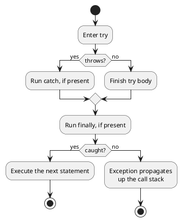
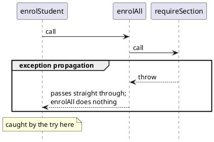

# Designing for Failure

Every function's contract describes what happens when the function works, and when it doesn't. A function that looks up a course section must also handle what happens when no such section exists; a function that enrols a student must handle what happens when a prerequisite is missing. Failures should be designed as deliberately as successes, so that a design offers a consistent, understandable failure model: one that stays out of the way when the system is working, but makes it hard to do the wrong thing when it is not.

In [Chapter 3](./03_checking-invariants.html) we differentiated two kinds of failure. An **unexpected error** is one that should be impossible: an invariant has been violated, which means the program has a bug. We proactively detect these with `assert`, which stops the program the moment an impossible state appears, because no sensible computation can continue from corrupt data. These are often triggered only during development, because an implementation is typically strengthened to prevent precondition violations in deployed systems. 

An **expected error** is a foreseeable, unsuccessful outcome that is not a bug at all: a section is full, a prerequisite is missing, a file is absent. Expected errors belong in the contract, and the caller is expected to deal with them. 

This chapter dives deeper into expected errors: how a function communicates errors to its caller, and how the caller responds. There are two mechanisms in wide use. A function can _return_ its failure as an ordinary value, or it can _throw_ an exception that travels up the call stack until something handles it. Each mechanism has strengths and weaknesses. 

## A Student Enrolling in Sections

We will work through a running example in this chapter:

> As a registration system, I want to enrol a student in a chosen set of sections and report the first problem I encounter, so that the student knows exactly what needs fixing.

We model a small slice of this problem: a catalogue of sections, each listing the courses required before it, and a student with a record of the courses they have already passed. A section with no prerequisites lists an empty array.

```typescript
type Section = {
    id: string;
    prerequisite: string[]; // ids of courses required first; empty if none
};

type Student = {
    id: string;
    completed: string[]; // ids of courses already passed
};

const catalogue: Section[] = [
    { id: "CPSC110", prerequisite: [] },
    { id: "CPSC210", prerequisite: ["CPSC110"] },
    { id: "CPSC213", prerequisite: ["CPSC210"] }
];

const student: Student = { id: "s1", completed: ["CPSC110"] };
```

Enrolling in a section can fail in two predictable ways: the section ID might not exist in the catalogue, or the student might not have completed a prerequisite. Our `student` can take `CPSC210` (its prerequisite `CPSC110` is done) but not `CPSC213` (its prerequisite `CPSC210` is not), and a request for `"NOPE"` names no section at all.

## Returning Failure as a Value

The first error-reporting mechanism was introduced in the [checking invariants chapter](./03_checking-invariants#expected-and-unexpected-errors): the failure is modelled as part of the return type, so that a function returns either a success or a failure, and the caller must check the returned value to determine the outcome. The `Result` type captured this as a tagged union.

```typescript
type Result<T, E> =
  | { ok: true, value: T }
  | { ok: false, error: E };
```

Each function returns a `Result`. The success case includes the section; the failure case includes a message explaining what went wrong.

```typescript
/**
 * Finds the section in the catalogue with the given id.
 *
 * @param {Section[]} catalogue the sections to search
 * @param {string} id the section id to look for
 * @returns {Result<Section, string>} ok: true with the matching section,
 * or ok: false with the error "no section with id <id>" when none matches
 */
function findSection(catalogue: Section[], id: string): Result<Section, string> {
    const section = catalogue.find(s => s.id === id);
    if (section === undefined) {
        return { ok: false, error: "no section with id " + id };
    }
    return { ok: true, value: section };
}

/**
 * Checks that a student has completed every prerequisite of a section.
 *
 * @param {Student} student the student to check
 * @param {Section} section the section whose prerequisites are required
 * @returns {Result<Section, string>} ok: true with the section when every
 * prerequisite is complete, or ok: false with "<section.id> requires <id>"
 * for the first prerequisite the student is missing
 */
function checkPrerequisite(student: Student, section: Section): Result<Section, string> {
    for (const required of section.prerequisite) {
        if (student.completed.includes(required) === false) {
            return { ok: false, error: section.id + " requires " + required };
        }
    }
    return { ok: true, value: section };
}
```

The strength of this approach is that the failure is captured by the type. A caller of `findSection` receives a `Result<Section, string>`, not a `Section`, so the compiler will not let them access `.value` without first checking `.ok`. The possibility of failure is impossible to overlook, because the type checker forces the caller to deal with the error case. 

Since the returned failure is an ordinary value, it is tested like any other value: 

```typescript
const cpsc213: Section = { id: "CPSC213", prerequisite: ["CPSC210"] };

test("a known section is found",
    checkExpect(() => findSection(catalogue, "CPSC210"), {
        ok: true,
        value: { id: "CPSC210", prerequisite: ["CPSC110"] }
    })
);

test("an unknown section returns a failure value",
    checkExpect(() => findSection(catalogue, "NOPE"), {
        ok: false,
        error: "no section with id NOPE"
    })
);

test("a missing prerequisite returns a failure value",
    checkExpect(() => checkPrerequisite(student, cpsc213), {
        ok: false,
        error: "CPSC213 requires CPSC210"
    })
);
```

### The Cost of Interleaving Results

This error mechanism has a cost for every caller. A caller cannot use the returned value directly; it must first check `.ok`, and only once it has confirmed success may it access `.value`. Even a single call is wrapped in a check, so the handling of the failure case is interleaved with the code that does the successful work. Here we provide a function to enrol a student in _several_ sections, checking each one. Built from the functions above, `enrolAll` spends most of its implementation managing failures:

```typescript
/**
 * Enrols a student in the given sections, stopping at the first problem.
 *
 * @param {Section[]} catalogue the sections on offer
 * @param {Student} student the student enrolling
 * @param {string[]} ids the ids of the sections to enrol in
 * @returns {Result<Section[], string>} ok: true with the sections in order,
 * or ok: false carrying the first error from findSection or checkPrerequisite
 */
function enrolAll(catalogue: Section[], student: Student, ids: string[]): Result<Section[], string> {
    const sections: Section[] = [];
    for (const id of ids) {
        const found = findSection(catalogue, id);
        if (found.ok === false) {
            return found; // pass the failure up, unchanged
        }
        const eligible = checkPrerequisite(student, found.value);
        if (eligible.ok === false) {
            return eligible; // pass the failure up, unchanged
        }
        sections.push(found.value);
    }
    return { ok: true, value: sections };
}
```

Of the eight lines in this function, four exist only to detect a failure and return it. `enrolAll` cannot do anything useful about an unknown section or a missing prerequisite; the only code that can respond is whatever called `enrolAll`, perhaps to show the student a message. But `enrolAll` is forced to participate, unpacking each `Result` and re-returning it, purely to forward the failure back to the caller to act on it.

The readability impact of this is meaningful: the success path (often called the _happy path_), the case that runs almost every time, is the simple sequence "find the section, check the prerequisite, add it to the list". In the code above, that sequence is disjoint, with a failure check inserted between each step. Infrequent cases are interleaved with the case that almost always happens. This is the cost of returning failure as a value: every layer between the function that _detects_ a problem and the function that _handles_ it must manage the failure, and the handling interferes with reading the function's main logic. When detection and handling are right next to each other this might be ok, but when handling is disconnected from where it arises, exceptions are more appropriate.

<details class="tooltip deep-dive">
<summary>Other Ways to Return Failures as Values</summary>

`Result` is not the only way to return an error as a value. A function can return `undefined` if it fails to complete a task, the way `Array.find` does. This is the _optional_ pattern, in effect a `Result` with no error detail. Older code, and lower-level languages, often use **sentinel values**: a special in-band return such as `-1`, or `null` for "not found". Sentinels are error-prone precisely because they are ordinary values that can be used by mistake or collide with real data, which is why a stub that returned `-1` was a reliable way to force a test to fail in earlier chapters.
</details>

## Throwing an Exception

When an error is encountered, we **throw** an **exception**: we signal that an exceptional state has been reached by executing a `throw` statement. Throwing an exception immediately abandons the rest of the current function and hands the exception to that function's caller; if the caller does not handle it, the exception is handed to _its_ caller, and so on up the call stack until something catches it or the program runs out of stack and halts.

<details class="tooltip ts-tips">
<summary><code>throw</code> Syntax</summary>

Concretely, `throw` takes an error value to raise, almost always a `new Error` carrying a message that describes the problem. The skeleton below shows its key effect:

```typescript
function attempt(): void {
    // (A)
    throw new Error("a description of what went wrong");
    // (B)
}
```

If `(A)` runs and the `throw` is then reached, the statements in `(B)` never run. A `throw` leaves the function immediately, much as `return` does, but with two differences: it carries an error rather than an ordinary value, and the caller does not receive that error as a result. Instead the error begins travelling up the chain of callers, as described above.
</details>

For example, in `requireSection` we can see that when it encounters a situation where the section does not exist it can just `throw new Error(...)`. In this way `requireSection` can signal to its callers that a section that does not exist was requested. The function also no longer returns a `Result` but instead returns `Section`, which is the more common successful path. Finally, the `@throws` annotation is added to the function's documentation so callers know what kinds of errors to expect.

```typescript
/**
 * Finds the section in the catalogue with the given id.
 *
 * @param {Section[]} catalogue the sections to search
 * @param {string} id the section id to look for
 * @returns {Section} the matching section
 * @throws {Error} "no section with id <id>" when no section matches
 */
function requireSection(catalogue: Section[], id: string): Section {
    const section = catalogue.find(s => s.id === id);
    if (section === undefined) {
        throw new Error("no section with id " + id);
    }
    return section;
}
```


This throw-and-catch model is not unique to TypeScript. The same mechanism, with slightly different spelling, appears in Java, C++, C#, and Python (where the keywords are `try` and `except`), among many others. The idea you learn here transfers directly when you move between languages.

<details class="tooltip deep-dive">
<summary>Checked and Unchecked Exceptions</summary>

The languages above differ in how much they ask of a caller. TypeScript uses **unchecked exceptions**: a function's type says nothing about what it might throw, and the compiler never forces a caller to handle a possible exception. The `attempt` skeleton above can throw, yet its signature, `attempt(): void`, is identical to that of a function that never throws.

Some languages, like Java, also offer **checked exceptions**, which must be declared in the signature and which the compiler forces every caller either to handle or to re-declare. Checked exceptions make a failure impossible to forget: a function must declare what it throws, and any function that calls it must either catch the exception or declare that it, too, can throw it.

The `Result` type from earlier in this chapter recovers the _checked_ property inside an unchecked language. By putting the failure in the return type, it makes the compiler insist that callers deal with errors. 
</details>

Looking at the rest of our example:

```typescript
/**
 * Verifies that a student has completed every prerequisite of a section.
 *
 * @param {Student} student the student to check
 * @param {Section} section the section whose prerequisites are required
 * @returns {void} nothing when every prerequisite is complete
 * @throws {Error} "<section.id> requires <id>" for the first prerequisite
 * the student is missing
 */
function requirePrerequisite(student: Student, section: Section): void {
    for (const required of section.prerequisite) {
        if (student.completed.includes(required) === false) {
            throw new Error(section.id + " requires " + required);
        }
    }
}

/**
 * Enrols a student in the given sections, stopping at the first problem.
 *
 * @param {Section[]} catalogue the sections on offer
 * @param {Student} student the student enrolling
 * @param {string[]} ids the ids of the sections to enrol in
 * @returns {Section[]} the sections, in order, when every enrolment succeeds
 * @throws {Error} the first failure encountered, from requireSection or
 * requirePrerequisite
 */
function enrolAll(catalogue: Section[], student: Student, ids: string[]): Section[] {
    const sections: Section[] = [];
    for (const id of ids) {
        const section = requireSection(catalogue, id);
        requirePrerequisite(student, section);
        sections.push(section);
    }
    return sections;
}
```

Compare this with the `Result` version. The four lines of failure-forwarding are gone, and so is the interleaving: what remains reads as the plain success path, "find the section, check the prerequisite, add it to the list", with no error handling wedged between the steps. If `requireSection` throws on the third id, the `throw` abandons `requireSection`, abandons the loop in `enrolAll`, and abandons `enrolAll` itself, without any of them containing code to make that happen. The exception travels directly to the nearest enclosing handler.

<details class="tooltip deep-dive">
<summary><code>assert</code> Is an Exception</summary>

The `assert` from Part 1 was not a separate mechanism; it is a `throw` we had not yet named. Conceptually it is just:

```typescript
function assert(condition: boolean, message: string): void {
    if (condition === false) {
        throw new Error(message);
    }
}
```

The reason a failed assertion halts the program is that nothing ever catches it. An assertion guards an _unexpected_ error, an impossible state, and the right response to an impossible state is to stop, so we deliberately leave it uncaught and let it rise all the way out of the program. Everything in this chapter is the same mechanism, caught on purpose instead of left to halt the program.

</details>

<details class="tooltip link-110">
<summary>Raising Errors in ISL</summary>

You raised errors in CPSC 110 with `error`, which stopped the program with a message:

```racket
;; require-section : Catalogue String -> Section
(define (require-section catalogue id)
  (cond [(false? (find-section catalogue id)) (error "no section with id" id)]
        [else (find-section catalogue id)]))
```

`throw` is the same idea. CPSC 110 also gave you `check-error`, the counterpart of the `checkError` we use here: it passed only when its expression signalled an error.

</details>

## Catching an Exception

A thrown exception is handled with a `try`/`catch` statement. Code that might encounter an error goes in the `try` block, while the code to run if an error occurs goes in the `catch` block. 

For example, the `enrolStudent` function needs to handle the situation where `enrolAll` fails:

```typescript
function enrolStudent(catalogue: Section[], student: Student, ids: string[]): void {
    try {
        const sections = enrolAll(catalogue, student, ids);
        console.log("enrolled in " + sections.length + " sections");
    } catch (error) {
        console.log("enrolment could not be completed:");
        console.log(error);
    }
}
```

<details class="tooltip ts-tips">
<summary><code>try/catch</code> Syntax</summary>

The code that might throw goes in the `try` block; if it throws, control jumps to the `catch` block, which receives the thrown error. In the abstract:

```typescript
try {
    // (A)
} catch (x) {
    // (B)
}
// (C)
```

If `(A)` runs to completion without throwing, the `catch` block `(B)` is skipped entirely and control continues at `(C)`. If anything in `(A)` throws, the rest of `(A)` is abandoned at once, control jumps to `(B)` with the thrown error bound to the name `x`, and then continues at `(C)`. Either way `(C)` runs; the only difference is whether `(B)` ran on the way there. Crucially, the throw caught in `(B)` need not have happened directly in `(A)`: it may have come from deep inside a function that `(A)` called, because a `try` catches throws from anywhere in the work it encloses. 

TypeScript gives the caught value the type `unknown`, because in principle any value can be thrown, so in the catch statement above, we log the whole error rather than reach into it. That is enough to report what went wrong: an `Error` prints with the message it was given.
</details>

A thrown failure interrupts the call rather than coming back as a value, so we cannot inspect it with `checkExpect`. This is what `checkError` is for: it runs the code you give it and passes only if that code throws.

```typescript
test("an unknown section throws",
    checkError(() => enrolAll(catalogue, student, ["NOPE"]))
);

test("a missing prerequisite throws",
    checkError(() => enrolAll(catalogue, student, ["CPSC213"]))
);

test("a valid request enrols in every section",
    checkExpect(
        () => enrolAll(catalogue, student, ["CPSC110", "CPSC210"]).length,
        2
    )
);
```

Note the contrast with the earlier `Result` tests. A returned error is a value, so we asserted on it with `checkExpect`; a thrown error escapes the call, so we need `checkError`, which runs the call and observes that it threw.

<details class="tooltip deep-dive">
<summary>Details: Implementing <code>checkError</code></summary>

`checkError` is an ordinary function built from `try`/`catch`. Roughly:

```typescript
function checkError(thunk: () => void): () => void {
    return () => {
        try {
            thunk();
        } catch (error) {
            return;     // the call threw, as expected
        }
        throw new Error("expected an error, but none was thrown");
    };
}
```

Two things follow from this shape. First, `checkError` takes a function, the `() =>` thunk, rather than a value, exactly as `checkExpect` does. It must run your code _inside its own_ `try`/`catch` so it can observe whether an exception is thrown. Handing it `enrolAll(...)` directly would run that call first, and the exception would escape before `checkError` ever got control. Second, `checkError` does not perform the check itself; it _returns_ the function that will, which is the function we hand to `test` as the body of the case.

</details>

### The `finally` Block

A `try` may be followed by a `finally` block. Where a `catch` runs only when the `try` throws, a `finally` runs on every path out of the `try`, whether it finished normally or threw. To see why this matters, you need to know that a program does not work only with values in its own memory; it also borrows things from the operating system that must be given back. Opening a file, for instance, returns a _handle_, a token the operating system grants so the program can read and write that file. The operating system allows only a limited number of open handles at once, and a handle stays held until the program explicitly closes it. The same is true of a network connection, or of a lock that keeps two parts of a program from interfering: each is held until it is released. If a program keeps opening files and never closing them, it eventually runs out of handles and can open no more, a fault known as a _resource leak_.

Here is the danger an exception introduces. If a `throw` interrupts the work between opening a resource and closing it, the closing line is one of the statements that gets abandoned, and the resource is leaked. `finally` exists to prevent exactly this: because its block runs on the throwing path as well as the normal one, the cleanup cannot be skipped.

```typescript
const file = openFile("report.txt"); // borrows a handle
try {
    useFile(file);                   // might throw partway through
} finally {
    closeFile(file);                 // runs even if useFile throws, returning the handle
}
```

While `finally` blocks are often not needed, you will likely encounter them whenever your code requires a cleanup step no matter how a block exits.

`finally` runs on every path out of the `try`, whether the body finished or threw, and an uncaught exception keeps travelling afterward:


<!-- caption="Control flow through try, catch, and finally." -->

<details class="tooltip ts-tips">
<summary>Optional <code>finally</code> Block</summary>

In the abstract:

```typescript
try {
    // (A)
} finally {
    // (B)
}
// (C)
```

If `(A)` runs to completion, `(B)` runs and then control continues at `(C)`. If `(A)` throws, `(B)` still runs, and then the exception continues up the call stack: `(C)` is not reached, but the cleanup in `(B)` was not skipped. A `finally` may also follow a `catch`, written `try { ... } catch (error) { ... } finally { ... }`, in which case the `finally` runs after the `try` and after any `catch`, again on every path.
</details>

### Recovering, or Just Reporting

The promise of `try`/`catch` is **recovery**: catching a failure and continuing sensibly despite it. Sometimes that is exactly what happens. Suppose a student gives a preferred section and a backup to use if the preferred one is unavailable. The handler does not care _why_ the preferred section could not be used, only that it could not, so it catches the failure and tries the backup instead:

```typescript
function sectionOrBackup(catalogue: Section[], preferredId: string, backupId: string): Section {
    try {
        return requireSection(catalogue, preferredId);
    } catch {
        return requireSection(catalogue, backupId);
    }
}
```

Here the `catch` block performs a real recovery, and the program continues with a valid section. If the backup is missing too, that second `requireSection` throws, and since nothing catches it here, the failure propagates onward, which is the right outcome.

<details class="tooltip ts-tips">
<summary>Optional <code>catch</code> Binding</summary>

When a handler does not need the caught value, the `catch` parameter can be left out entirely. Writing `catch {` instead of `catch (error) {` says plainly that the handler does not care which error occurred, only that one did.

For example, a membership test can be built on top of the throwing `requireSection`: call it, and report whether it returned or threw.

```typescript
function hasSection(catalogue: Section[], id: string): boolean {
    try {
        requireSection(catalogue, id);
        return true;
    } catch {
        return false; // an unknown id is the only way to reach here, so the error itself is not needed
    }
}
```

The binding is omitted because the recovery does not depend on which error was thrown, only that one was; writing `catch (error)` would introduce a name that is never read. The `catch` in `sectionOrBackup` above leaves it out for the same reason. Use the shorter form whenever the handler ignores the error's details.

</details>

In practice, a great deal of error handling does not recover at all. Often the most a handler can do is _detect_ the failure, record it, report it, and stop the operation that cannot proceed. `enrolStudent` is typical: it cannot supply a missing prerequisite, so it catches the error, reports it, and abandons the enrolment. That is still valuable, because the alternative, letting the exception halt the whole program, would be far worse for everyone else using the system, as would failing without giving any indication of what went wrong. Catching an error to report it cleanly and stop one operation is a legitimate and common use of `try`/`catch`, even when no recovery is possible.

What a handler must not do is catch an error and silently discard it. An empty `catch` block that does nothing turns a visible, traceable failure into a silent wrong answer that surfaces much later, far from its cause. If you cannot recover and cannot usefully report, it is almost always better to let the exception keep rising than to swallow it. Empty `catch` blocks will almost always cause pain to some future developer who will not understand why their code isn't failing as it should.

### Exceptions Travel Up the Call Stack

The power of exceptions, and what makes them worth a separate mechanism from regular `return`, is that the function which _detects_ a problem and the function which _handles_ it need not know about each other at all. Everything between them is left untouched.

Let's trace the unknown-section failure through our program. `enrolStudent` calls `enrolAll`, which calls `requireSection`, which discovers the bad id and throws. The exception now rises back through that exact chain: it leaves `requireSection`, passes through `enrolAll` without `enrolAll` doing anything, and arrives at the `try` in `enrolStudent`, where it is finally caught:


<!-- caption="An exception rising from requireSection to the handler in enrolStudent." -->

`enrolAll` is on the path but is not a participant; it neither checks for the error nor forwards it, because propagation is automatic. This is the plumbing the `Result` version had to write by hand, now handled by the language.

This is the deeper reason the success path stayed focused. The intermediate layers have no error-handling code not because we were careful to leave it out, but because they _don't need any_! An exception they do not catch passes straight through them. The further apart detection and handling are, the more tedious error-passing code this saves.


<details class="tooltip deep-dive">
<summary>What Is a Call Stack?</summary>

When one function calls another, the caller does not finish; it pauses, partway through, and waits for the called function to return before carrying on. The called function may call a third, which pauses it in turn. At any instant, then, there is a chain of paused functions, each waiting on the one it called. That chain is the **call stack**.

It is called a stack because it grows and shrinks at one end only, like a stack of plates. Consider:

```typescript
function a(): void {
    b();                      // a pauses here while b runs
    console.log("a is done");
}

function b(): void {
    c();                      // b pauses here while c runs
    console.log("b is done");
}

function c(): void {
    console.log("c is running");
}

a();
```

Calling `a` adds a frame for `a` to the stack; `a` calls `b`, adding a frame for `b` on top; `b` calls `c`, adding `c`. The stack is now `a`, then `b`, then `c`, with `c` on top. When `c` returns, its frame is removed and `b` resumes; when `b` returns, it is removed and `a` resumes. Each function hands control back to the exact spot in its caller where it paused, so the output is:

```
c is running
b is done
a is done
```

A normal `return` moves one step down this stack: it hands a value to the immediate caller and removes one frame. An exception is different. A `throw` does not return to the immediate caller at all; it removes frames from the stack one after another _until it finds a `try`/`catch`_, discarding each paused function along the way without resuming it. This is why an exception can surface so far from where it was raised: it travels down the stack of paused callers, past every one that has no handler.

Seen this way, an exception is a kind of **non-local return**: where `return` exits to the one place directly below it, a `throw` can exit many levels at once. This sketch makes the jump visible:

```typescript
function deep(): void {
    throw new Error("from deep");
    // nothing after the throw in deep, middle, or shallow runs
}

function middle(): void {
    deep();
    console.log("middle after deep");     // skipped
}

function shallow(): void {
    try {
        middle();
        console.log("shallow after middle"); // skipped
    } catch {
        console.log("caught in shallow");    // this runs
    }
}
```

Calling `shallow` prints only `caught in shallow`. The `throw` in `deep` jumps straight past the rest of `deep`, all of `middle`, and the rest of the `try` in `shallow`, landing in the `catch`. Two whole functions were abandoned mid-execution. Although a `throw` _can_ be used to leap out of deep code like this, it must only ever be used for real error states, never as a shortcut for breaking out of nested calls, for the reasons given below.

</details>

### When Exceptions Obscure Behaviour

Exceptions' ability to directly traverse the call stack, while useful for reducing error-handling code, is a hazard. Because a `throw` can leap past every function between the error and its handler, exceptions are easy to _misuse_ as a jump out of deep code, a substitute for ordinary control flow. They must not be used that way, and the reason is not merely stylistic: overusing exceptions makes a program hard to understand.

Recall: the **static view** is the program as written, the text you can read without running it. The **dynamic view** is what happens on one particular run, with particular inputs and a particular sequence of calls. A `throw` and a `try`/`catch` are both plainly visible in the static view: you can read in the source that a function _might_ throw and that some caller _might_ catch. What you cannot read there is the connection between the two. Neither the `throw` nor the `catch` names the other, and which `catch` handles a given `throw` is settled only _dynamically_, at run time, by whatever call stack happens to exist at the moment the exception is raised.

This is what separates exceptions from ordinary control flow. An `if`, a `return`, or a function call also chooses its path from runtime values, but the _destination_ of control is local and written down: control passes to the next statement, to the other branch, or to the named callee. With a `throw`, the destination is written down nowhere. The throw site does not say where its exception will be handled, and the handler does not say which of the calls beneath it the exception came from.

The consequence is that you can no longer reason about a function from the function alone. Normally, to understand a piece of code, you read it together with the contracts of the functions it calls, and everything you need is local. Exceptions break that locality in both directions: the error a function raises may be handled far above it, by code it does not know about, and an error it must be ready to receive may originate far below it, passed up through callees that only forwarded it. Look again at the `deep`, `middle`, and `shallow` chain above. `middle` neither throws nor catches, yet it sits squarely on the path of an exception, and reading `middle` on its own gives no sign that it takes part in a failure raised in `deep` and handled in `shallow`. This _non-locality_, which kept the success path clean, makes failure behaviour hard to trace.

Two development habits keep this in check. First, keep exceptions _rare_. Reserve them for errors, so that the points where control can jump non-locally are few and meaningful. Second, _document_ what the function throws in its contract: the documentation should capture what it can throw and under what conditions. 

<!---- CL: removed this because I think it's repetitive and don't quite get it?
 Catching exceptions is also deliberate: it is common for direct callers to ignore exceptions and let their own callers do the handling if they have the context to respond and act more appropriately. --->

## Choosing Between Results and Exceptions

We now have two ways to manage the same expected failure and need to make real design decisions about which to use.

A **returned** failure is _visible to the type checker_. It appears in the function's return type, and the compiler forces every caller to manage it. The cost is that every layer between detection and handling must examine the failure, and the interleaved checks can obscure the success path. Returning failure is the better choice when the failure is an ordinary, expected part of the operation that the _immediate_ caller should always deal with.

A **thrown** failure _propagates itself_, which clarifies the common success path. The price is that the failure is invisible in the type: a function that throws looks, from its signature, just like one that always succeeds, so it is easy for a caller to forget that handling is needed. Throwing is the better choice when a failure should abort the current line of work and be dealt with somewhere well above, or when interleaving a `Result` through many layers would bury the logic.

Where to let an exception propagate is as much a design decision as when to throw one. A function that encounters an error it cannot meaningfully address should not catch it; letting the exception rise through the call stack to a layer with the context to recover or report is often exactly right. A parser that reads a file can detect a malformed record, but it is rarely in a position to decide what the program does about it. The practical rule is to catch at the boundary where the program knows what to do: a command-line tool might catch at the top level and print the message; a web server might catch per request and return an error response; a low-level library should almost never catch at all, since doing so hides failures from the only code that can act on them.

Within a single codebase, _consistency_ matters as much as the individual choice. Consistent error handling is always easier to use correctly than a mix where every function makes its own call. 

Whatever the error mechanism, a few practices hold across all of them: 
- never silently discard an error; 
- do not use exceptions for ordinary control flow, only for real errors; and 
- check data the moment it crosses into your program from a file, a network, or a user, converting outside uncertainty into either a trusted value or a clear error right at the boundary. (more on this in a future chapter)

## Designing for Failure

A well-designed abstraction handles failures as deliberately as it handles successes. Expected failures belong in the contract, and a function communicates them in one of two ways: by returning a value that the type checker forces callers to confront, or by throwing an exception that propagates on its own to a handler far above. Unexpected failures, the impossible states that signal bugs, are thrown by `assert` and left uncaught so the program halts at the first sign of corruption. The choice between returning and throwing is a design decision, weighing visibility in the types against the readability of the success path, and it is one you now have the vocabulary to make. So far we have been testing errors with `checkExpect` and `checkError`; [Chapter 9](./09_validation.html) introduces more expressive tools for asserting exactly how and why a piece of code fails. 

<details class="tooltip exercise">
  <summary>Exercise: Booking a Trip</summary>

You are given the start of a trip-booking system. Each step can fail in a foreseeable way, and a half-booked trip is worse than no booking at all.

> As a traveller, I want to book a flight, a hotel, and a car as a single trip, and be told the first thing that could not be booked, so that I am never left with a partly booked trip.

```typescript
type Trip = { flight: string; hotel: string; car: string };

// Each step succeeds and returns a confirmation code, or fails because the
// item is unavailable. The bodies are left for you to complete.
function bookFlight(route: string): string { /* ... */ }
function bookHotel(city: string): string { /* ... */ }
function bookCar(city: string): string { /* ... */ }

// Books all three, stopping at the first failure and reporting it to the caller.
function bookTrip(route: string, city: string): Trip { /* ... */ }
```

1. Decide whether each step should _return_ its failure as a value or _throw_ it, and justify the choice using this chapter's trade-offs. <span class="hint">Notice that `bookTrip` only orchestrates the steps; it has nothing useful to do about a failure itself.</span>
2. Implement the failure signalling in the three step functions, and document it in each contract <span class="hint">(with `@throws` or in the return type)</span>.
3. Write `bookTrip` <span class="hint">so that its success path reads as the three bookings in sequence,</span> <span class="hint">then add a single handler in a caller that reports the first failure.</span>
4. Write tests that validate your design: <span class="hint">one where every booking succeeds</span>, <span class="hint">and one for each way a step can fail</span>. <span class="hint">Use `checkExpect` for successful results and `checkError` for failures</span>.

As you work, notice how far the detection of a failure (inside `bookCar`, say) is from where it is handled (in the caller of `bookTrip`). That distance is the signal this chapter gives for preferring exceptions.

</details>
