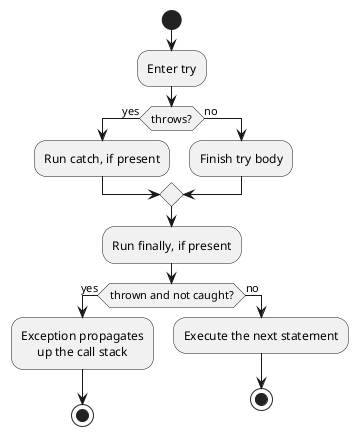
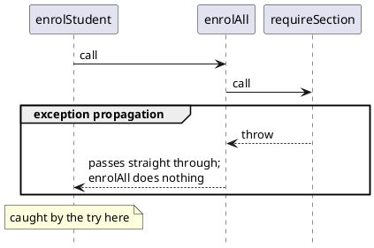

# Designing for Failure

Every function's contract describes both what happens when the function works and what happens when it doesn't work. A function that looks up a course section must also handle what happens when the section doesn't exist, and a function that enrols a student in a course must handle what happens when they lack a required prerequisite. Failures must be designed as deliberately as successes, so that a design has a consistent failure model. Error handling should then stay out of the way when the system is working, and make it hard to do the wrong thing when it is not.

Every function call has one of two outcomes. A **successful outcome** is the one the function exists to produce, such as enrolling the student in a section. An **erroneous outcome** is any other result, such as a section that does not exist. Erroneous outcomes are not a bugs. They are foreseeable results that belongs in the function's contract, so the caller knows these outcomes can happen and can learn how they know when they have occurred. _Error_ and _failure_ are often used interchangeably to mean an erroneous outcome.

This chapter is about how a function communicates an erroneous outcome to its caller. There are two commonly-used mechanisms for communicating failures. A function can _return_ its failure as an ordinary value, or it can _throw_ an exception that travels up the call stack until something handles it. Each error-signalling approach has strengths and weaknesses.

#### A Student Enrolling in Sections

This chapter will use a running example:

> As a registration system, I want to enrol a student in a chosen set of sections and report the first problem I encounter, so that the student knows exactly what needs fixing.

We model a subset of this problem: a catalogue of sections, each listing the prerequisite courses they require, and a student with a record of the courses they have already completed. A section with no prerequisites lists an empty `prerequisite` array.

```typescript
type Section = {
    id: string;
    prerequisite: string[]; // ids of courses required first; empty if none
};

type Student = {
    id: string;
    completed: string[]; // ids of courses already passed
};

const catalogue: Section[] = [
    { id: "CPSC110", prerequisite: [] },
    { id: "CPSC210", prerequisite: ["CPSC110"] },
    { id: "CPSC213", prerequisite: ["CPSC210"] }
];

const student: Student = { id: "s1", completed: ["CPSC110"] };
```

Enrolling in a section can fail in two predictable ways. The section might not exist in the catalogue, or the student might not have completed a required prerequisite. Our `student` can take `CPSC210` (its prerequisite `CPSC110` is complete) but not `CPSC213` (its prerequisite `CPSC210` is not).

## Returning a Failure Value

The first mechanism for reporting errors was introduced in the [checking invariants chapter](./03_checking-invariants#erroneous-outcomes). The failure is included in the return type, so a function returns either a success or a failure, and the caller must check the returned value to find out which. The `Result` type represents this as a tagged union.

```typescript
type Result<T, E> =
  | { ok: true, value: T }
  | { ok: false, error: E };
```

Each function returns a `Result`. The success case holds the section, and the failure case holds a message explaining what went wrong.

```typescript
/**
 * Finds the section in the catalogue with the given id.
 *
 * @param {Section[]} catalogue the sections to search.
 * @param {string} id the section id to look for.
 * @returns {Result<Section, string>} ok: true with the matching section,
 * or ok: false with the error "no section with id <id>" when none matches.
 */
function findSection(catalogue: Section[], id: string): Result<Section, string> {
    const section = catalogue.find(s => s.id === id);
    if (section === undefined) {
        return { ok: false, error: "no section with id " + id };
    }
    return { ok: true, value: section };
}

/**
 * Checks that a student has completed every prerequisite of a section.
 *
 * @param {Student} student the student to check
 * @param {Section} section the section whose prerequisites are required
 * @returns {Result<Section, string>} ok: true with the section when every
 * prerequisite is complete, or ok: false with "<section.id> requires <id>"
 * for the first prerequisite the student is missing
 */
function checkPrerequisite(student: Student, section: Section): Result<Section, string> {
    for (const required of section.prerequisite) {
        if (student.completed.includes(required) === false) {
            return { ok: false, error: section.id + " requires " + required };
        }
    }
    return { ok: true, value: section };
}
```

The primary benefit of this approach is that the failure is captured by the type. A caller of `findSection` receives a `Result<Section, string>`, not a `Section`, so the compiler will not let them access `.value` without first checking `.ok`. The type checker forces the caller to deal with the error case.

Since the returned failure is an ordinary value, it can be tested like any other value:

```typescript
const cpsc213: Section = { id: "CPSC213", prerequisite: ["CPSC210"] };

test("a known section is found",
    checkExpect(() => findSection(catalogue, "CPSC210"), {
        ok: true,
        value: { id: "CPSC210", prerequisite: ["CPSC110"] }
    })
);

test("an unknown section returns a failure value",
    checkExpect(() => findSection(catalogue, "NOPE"), {
        ok: false,
        error: "no section with id NOPE"
    })
);

test("a missing prerequisite returns a failure value",
    checkExpect(() => checkPrerequisite(student, cpsc213), {
        ok: false,
        error: "CPSC213 requires CPSC210"
    })
);
```

### The Cost of Interleaving

This mechanism imposes a cost on every caller. The function's return value cannot be used directly. Every caller must first check `.ok`, and only once it has confirmed success may it access `.value`. Even a single call is wrapped in a check, so the handling of the failure case is interleaved with the code that handles the success paths. The function below enrols a student in _several_ sections. The error handling design in the functions above mean `enrolAll` spends most of its implementation managing failures:

```typescript
/**
 * Enrols a student in the given sections, stopping at the first problem.
 *
 * @param {Section[]} catalogue the sections on offer
 * @param {Student} student the student enrolling
 * @param {string[]} ids the ids of the sections to enrol in
 * @returns {Result<Section[], string>} ok: true with the sections in order,
 * or ok: false carrying the first error from findSection or checkPrerequisite
 */
function enrolAll(catalogue: Section[], student: Student, ids: string[]): Result<Section[], string> {
    const sections: Section[] = [];
    for (const id of ids) {
        const found = findSection(catalogue, id);
        if (found.ok === false) {
            return found; // pass the failure up, unchanged
        }
        const eligible = checkPrerequisite(student, found.value);
        if (eligible.ok === false) {
            return eligible; // pass the failure up, unchanged
        }
        sections.push(found.value);
    }
    return { ok: true, value: sections };
}
```

Of the eight lines in this function, four exist only to detect a failure and return it. `enrolAll` cannot do anything useful about an unknown section or a missing prerequisite. Only whatever called `enrolAll` can respond, perhaps by showing the student an error message. But `enrolAll` still has to unpack each `Result` and return it again, only to pass the failure back to its caller.

This makes the function harder to read. The success path (often called the _happy path_), which runs almost every time, is just a simple sequence consisting of "find the section, check the prerequisite, add it to the list". In the design above, that sequence is broken up by a failure check between each step. This is the cost of returning failure as a value. Every layer between the function that _detects_ a problem and the function that _handles_ it must manage the failure, and that handling gets in the way of reading the function's main logic. When detection and handling are next to each other this might be OK, but when handling is far from where the failure arises, exceptions can be more appropriate.

<details class="tooltip deep-dive">
<summary>Other Ways to Return Failures as Values</summary>

`Result` is not the only way to return an error as a value. A function can return `undefined` when it fails, the way `Array.find` does. This is the _optional_ pattern, in effect a `Result` with no error detail. Older code and lower-level languages often use **sentinel values**, a special return value such as `-1`, or `null` for "not found". Sentinels are error-prone because they are ordinary values that can be used by mistake or collide with real data.
</details>

## Throwing an Exception

Another error-handling mechanism that does not encode the error in the return type is exceptions. When an error is encountered, we **throw** an **exception** by executing a `throw` statement. Throwing an exception immediately abandons the rest of the current function and hands the exception to that function's caller. If the caller does not handle it, the exception is handed to _its_ caller, and so on up the call stack.

<details class="tooltip ts-tips">
<summary><code>throw</code> Syntax</summary>

`throw` takes an error value, usually a `new Error` carrying a message that describes the problem. The skeleton below shows its effect:

```typescript
function attempt(): void {
    // (A)
    throw new Error("a description of what went wrong");
    // (B)
}
```

If `(A)` runs and the `throw` is reached, `(B)` never runs. A `throw` leaves the function immediately, much as `return` does, with two differences. First, the exception carries an error rather than an ordinary value, and the caller does not receive that error as a result. Second, the exception error travels up the chain of callers, as described above.
</details>

When `requireSection` finds that the section does not exist, it can `throw new Error(...)` to signal this to its callers. The function also no longer returns a `Result`. It returns a `Section`, the value from the successful path. Finally, the `@throws` annotation in the function's documentation tells callers what errors to expect.

```typescript
/**
 * Finds the section in the catalogue with the given id.
 *
 * @param {Section[]} catalogue the sections to search.
 * @param {string} id the section id to look for.
 * @returns {Section} the matching section.
 * @throws {Error} "no section with id <id>" when no section matches.
 */
function requireSection(catalogue: Section[], id: string): Section {
    const section = catalogue.find(s => s.id === id);
    if (section === undefined) {
        throw new Error("no section with id " + id);
    }
    return section;
}
```

Communicating errors with exceptions is not unique to TypeScript. The same mechanism, with slightly different syntax, appears in Java, C++, C#, and Python (where the keywords are `try` and `except`), among many others, so what you learn here applies in those languages too.

Here is the rest of our example:

```typescript
/**
 * Verifies that a student has completed every prerequisite of a section.
 *
 * @param {Student} student the student to check
 * @param {Section} section the section whose prerequisites are required
 * @returns {void} nothing when every prerequisite is complete
 * @throws {Error} "<section.id> requires <id>" for the first prerequisite
 * the student is missing
 */
function requirePrerequisite(student: Student, section: Section): void {
    for (const required of section.prerequisite) {
        if (student.completed.includes(required) === false) {
            throw new Error(section.id + " requires " + required);
        }
    }
}

/**
 * Enrols a student in the given sections, stopping at the first problem.
 *
 * @param {Section[]} catalogue the sections on offer
 * @param {Student} student the student enrolling
 * @param {string[]} ids the ids of the sections to enrol in
 * @returns {Section[]} the sections, in order, when every enrolment succeeds
 * @throws {Error} the first failure encountered, from requireSection or
 * requirePrerequisite
 */
function enrolAll(catalogue: Section[], student: Student, ids: string[]): Section[] {
    const sections: Section[] = [];
    for (const id of ids) {
        const section = requireSection(catalogue, id);
        requirePrerequisite(student, section);
        sections.push(section);
    }
    return sections;
}
```

Compare this with the `Result` version. The four lines of failure-forwarding are gone. What remains is the success path, "find the section, check the prerequisite, add it to the list", with no error handling between the steps. If `requireSection` throws on the third id, the `throw` abandons `requireSection`, the loop in `enrolAll`, and `enrolAll` itself, without any of them containing code to make that happen. The exception goes directly to the nearest enclosing handler.

<details class="tooltip deep-dive">
<summary>Halting on a Bug with <code>assert</code></summary>

Not every failure is an erroneous outcome that a contract anticipates. Sometimes a function discovers that an invariant it depends on has been violated. The program has reached a state that should have been impossible, which means there is a bug somewhere. A common response is to halt.

```typescript
import assert from "node:assert/strict";

assert(count <= MAX_CAPACITY, "count exceeds capacity");
```

If the condition holds, `assert` does nothing. If it does not, the program stops with the message. `assert` is not a separate mechanism from the one in this chapter. It is a `throw` guarded by a condition. Conceptually it is just:

```typescript
function assert(condition: boolean, message: string): void {
    if (condition === false) {
        throw new Error(message);
    }
}
```

A failed assertion halts the program only on a bug, and the right response to a bug is to stop. The errors in this chapter are different. They are erroneous outcomes the contract anticipates.

</details>

<details class="tooltip link-110">
<summary>Raising Errors in ISL</summary>

You raised errors in CPSC 110 with `error`, which stopped the program with a message:

```racket
;; require-section : Catalogue String -> Section
(define (require-section catalogue id)
  (cond [(false? (find-section catalogue id)) (error "no section with id" id)]
        [else (find-section catalogue id)]))
```

`throw` is the same idea. CPSC 110 also had `check-error`, the counterpart of the `checkError` we use here, which passed only when its expression signalled an error.

</details>

## Catching an Exception

A thrown exception is handled with a `try`/`catch` statement. Code that might throw goes in the `try` block, and the code that is run if an exception is thrown by code within the `try` block goes in the `catch` block.

For example, the `enrolStudent` function needs to handle the situation where `enrolAll` fails:

```typescript
function enrolStudent(catalogue: Section[], student: Student, ids: string[]): void {
    try {
        const sections = enrolAll(catalogue, student, ids);
        console.log("enrolled in " + sections.length + " sections");
    } catch (error) {
        console.log("enrolment could not be completed:");
        console.log(error);
    }
}
```

<details class="tooltip ts-tips">
<summary><code>try/catch</code> Syntax</summary>

Code that might throw, and for which a thrown error can be handled, goes in the `try` block. If it throws, control jumps to the `catch` block, which receives the thrown error. In the abstract:

```typescript
try {
    // (A)
} catch (x) {
    // (B)
}
// (C)
```

If `(A)` runs to completion without throwing, the `catch` block `(B)` is skipped and control continues at `(C)`. If anything in `(A)` throws, the rest of `(A)` is abandoned, control jumps to `(B)` with the thrown error bound to the name `x`, and then continues at `(C)`. Either way `(C)` runs. The throw caught in `(B)` need not have happened directly in `(A)`. It may have come from deep inside a function that `(A)` called, because a `try` catches throws from anywhere in the code it encloses.

</details>

A thrown failure interrupts execution rather than coming back as a returned value, so we cannot inspect it with `checkExpect`. Instead, we use `checkError`, which runs the code you give it and passes only if that code throws.

```typescript
test("an unknown section throws",
    checkError(() => enrolAll(catalogue, student, ["NOPE"]))
);

test("a missing prerequisite throws",
    checkError(() => enrolAll(catalogue, student, ["CPSC213"]))
);

test("a valid request enrols in every section",
    checkExpect(
        () => enrolAll(catalogue, student, ["CPSC110", "CPSC210"]).length,
        2
    )
);
```

<!-- RTH: technically you can use our checkError with Result types too. Not sure if this is worth clarifying (or changing in our error handling libraries). -->

Compare this with the earlier `Result` tests. A returned error is a value, so we checked it with `checkExpect`. A thrown error escapes the call, so we need `checkError`, which runs the call and observes that it threw.

<details class="tooltip deep-dive">
<summary>Details: Implementing <code>checkError</code></summary>

`checkError` is an ordinary function built from `try`/`catch`. Roughly:

```typescript
function checkError(thunk: () => void): () => void {
    return () => {
        try {
            thunk();
        } catch (error) {
            return;     // the call threw, as expected
        }
        throw new Error("expected an error, but none was thrown");
    };
}
```

This has two consequences. First, `checkError` takes a function, the `() =>` thunk, rather than a value, as `checkExpect` does. It must run your code inside its own `try`/`catch` so it can observe whether an exception is thrown. Passing it `enrolAll(...)` directly would run that call first, and the exception would escape before `checkError` ever got control. Second, `checkError` does not perform the check itself. It _returns_ the function that will, which is the function we pass to `test` as the body of the test case.

</details>

<details class="tooltip deep-dive">
<summary>Checked and Unchecked Exceptions</summary>

Languages differ in how much they ask of a caller. TypeScript uses **unchecked exceptions**. A function's type says nothing about what it might throw, and the compiler never forces a caller to handle a possible exception. The signature  `attempt(): void` provides no clues that it can throw an exception.

Some languages, like Java, offer **checked exceptions**, which must be declared in the signature. The compiler forces every caller either to catch the exception or to declare that it will pass it up the call stack so a failure cannot be forgotten.

The `Result` type from earlier in this chapter provides the same _checked_ property in an unchecked language. Because the failure is in the return type, the compiler forces callers deal with errors.
</details>

### The `finally` Block

A `try` may be followed by a `finally` block. A `catch` runs only when the `try` throws, but a `finally` runs on every path out of the `try`, whether it finished normally or threw. This is important because some actions need to be performed in both success and error paths. Opening a file, for instance, returns a _handle_, a token the operating system grants so the program can read and write that file. Handles are finite, so whether a task finishes in success or failure, the handle must close the file. If a program keeps opening files and never closing them, it eventually runs out of handles causing a fault known as a _resource leak_.

Exceptions make leaks more likely. If a `throw` interrupts the work between opening a resource and closing it, the closing line is one of the statements that gets abandoned, and the resource is leaked. A `finally` block prevents this, because it runs on the throwing path as well as the normal one.

```typescript
const file = openFile("report.txt"); // borrows a handle
try {
    useFile(file);                   // might throw partway through
} finally {
    closeFile(file);                 // runs even if useFile throws, returning the handle
}
```

`finally` blocks are relatively rare, but you will see them whenever code needs to clean up after itself.

The diagram shows every path through `try`, `catch`, and `finally`. An uncaught exception keeps travelling after the `finally` runs:


<!-- caption="Control flow through try, catch, and finally." -->

<details class="tooltip ts-tips">
<summary>Optional <code>finally</code> Block</summary>

In the abstract:

```typescript
try {
    // (A)
} finally {
    // (B)
}
// (C)
```

If `(A)` runs to completion, `(B)` runs and then control continues at `(C)`. If `(A)` throws, `(B)` still runs, and then the exception continues up the call stack, so `(C)` is not reached but the cleanup in `(B)` still happens. A `finally` may also follow a `catch`, written `try { ... } catch (error) { ... } finally { ... }`, in which case the `finally` runs after the `try` and any `catch`, again on every path.
</details>

### Recovering or Reporting

`try`/`catch` makes **recovery** possible: catching a failure and adapting computation so the task can continue sensibly despite the encountered problem. Suppose a student gives a preferred section and a backup to use if the preferred one is unavailable. The handler does not care _why_ the preferred section could not be used, only that it could not. So a rational recovery would be to catch the failure and try the backup instead:

```typescript
function sectionOrBackup(catalogue: Section[], preferredId: string, backupId: string): Section {
    try {
        return requireSection(catalogue, preferredId);
    } catch {
        return requireSection(catalogue, backupId);
    }
}
```

Here the `catch` block recovers, and the program continues with a valid section. If the backup is missing too, the second `requireSection` throws, and since nothing catches it here, the failure propagates to the caller, which is the right outcome.

<details class="tooltip ts-tips">
<summary>Optional <code>catch</code> Binding</summary>

When a handler does not need the caught value, the `catch` parameter can be left out. Writing `catch {` instead of `catch (error) {` shows that the handler does not care which error occurred, only that one did.

For example, a membership test can be built on top of the throwing `requireSection`. It calls `requireSection` and reports whether it returned or threw.

```typescript
function hasSection(catalogue: Section[], id: string): boolean {
    try {
        requireSection(catalogue, id);
        return true;
    } catch {
        return false; // an unknown id is the only way to reach here, so the error itself is not needed
    }
}
```

This shorter form can be helpful whenever the handler ignores the error's details, although like the `finally` block this form is relatively rare.

</details>

In practice, many errors are not recoverable. Often the most a handler can do is _detect_ the failure, report it, and stop the operation that cannot proceed. `enrolStudent` is typical. It cannot supply a missing prerequisite, so it catches the error, reports it, and abandons the enrolment. That is still valuable, because the alternatives, letting the exception halt the whole program or failing without saying what went wrong, are both worse. Catching an error to report it and stop one operation is a common and legitimate use of `try`/`catch`, even when no recovery is possible.

An important antipattern for exceptions is to catch an error and silently discard it. An empty `catch` block turns a visible failure into a wrong answer that is impossible to see. If you cannot recover and cannot usefully report, it is almost always better to let the exception propagate up the callstack.

### Exception Propagation

One feature that differentiates exceptions from `return` is that the function that _detects_ a problem and the function that _handles_ it can be oblivious about each other and the functions between them do not need to contain error-handling code.

Consider the unknown-section failure. `enrolStudent` calls `enrolAll`, which calls `requireSection`. This notices the bad id and throws. The exception then travels back through that chain. It leaves `requireSection`, passes through `enrolAll`, and arrives at the `try` in `enrolStudent`, where it is caught:


<!-- caption="An exception rising from requireSection to the handler in enrolStudent." -->

`enrolAll` is on the path but does not take part in handling the exception. It neither checks for the error nor forwards it, because propagation is automatic. The `Result` version had to do this forwarding manually.

This is why the success path stayed focused. The intermediate layers do not need error-handling code, because an exception they do not catch passes straight through them. The further apart detection and handling are, the more forwarding code this saves.

<details class="tooltip deep-dive">
<summary>What Is a Call Stack?</summary>

When one function calls another, the caller pauses partway through and waits for the called function to return before continuing. The called function may call a third, which pauses it in turn. At any moment there is a chain of paused functions, each waiting on the one it called. That chain is the **call stack**.

It is called a stack because it grows and shrinks at one end only, like a stack of plates. Consider:

```typescript
function a(): void {
    b();                      // a pauses here while b runs
    console.log("a is done");
}

function b(): void {
    c();                      // b pauses here while c runs
    console.log("b is done");
}

function c(): void {
    console.log("c is running");
}

a();
```

<!-- RTH: consider replacing this with a diagram, although it is a classic sidebar for this course  -->

Calling `a` adds a frame for `a` to the stack. `a` calls `b`, adding a frame for `b` on top, and `b` calls `c`, adding `c`. The stack is now `a`, then `b`, then `c`, with `c` on top. When `c` returns, its frame is removed and `b` resumes. When `b` returns, its frame is removed and `a` resumes. Each function returns control to the point in its caller where it paused, so the output is:

```
c is running
b is done
a is done
```

A normal `return` pops the top off this stack. It hands a value to the immediate caller and removes one frame. A `throw` is different. It removes frames from the stack successively _until_ it finds a `try`/`catch`, discarding each paused function without resuming it. This is why an exception can surface far from where it was thrown.

An exception is therefore a kind of **non-local return**. Where `return` exits to the function that invoked it, a `throw` can exit many levels at once:

```typescript
function deep(): void {
    throw new Error("from deep");
    // nothing after the throw runs in deep, in middle, or in shallow's try block
}

function middle(): void {
    deep();
    console.log("middle after deep");     // skipped
}

function shallow(): void {
    try {
        middle();
        console.log("shallow after middle"); // skipped
    } catch {
        console.log("caught in shallow");    // this runs
    }
}
```

Calling `shallow` prints only `caught in shallow`. The `throw` in `deep` skips the rest of `deep`, all of `middle`, and the rest of the `try` in `shallow`, and lands in its `catch`. Two functions were abandoned partway through. Although a `throw` _can_ be used to jump out of deeply nested code like this, it should only be used for real errors, never as a shortcut for leaving nested calls.

</details>

### Exceptions Hide Causes

The ability to jump across the call stack reduces error-handling code, but it is also a hazard. Because a `throw` can skip every function between the error and its handler, exceptions are easy to _misuse_ as a way to jump out of deep code, in place of ordinary control flow. They should not be used that way, because overusing exceptions makes a program hard to understand.

Recall that the **static view** is the program as written, and the **dynamic view** is how that program runs on one particular execution. A `throw` and a `try`/`catch` are both visible in the static view. You can read in the source that a function _might_ throw and that some caller _might_ catch. What you cannot read is the connection between the two. Neither the `throw` nor the `catch` names the other, and which `catch` handles a given `throw` is decided only at run time, by the call stack that exists when the exception is raised.

As a result, you can no longer understand a function by reading it alone. Normally you read a function together with the contracts of the functions it calls, and everything you need is local. Exceptions break this in both directions. The error a function raises may be handled far above it, by code it does not know about. And an error might propagate to it, raised in code deep below something it called. Look again at the `deep`, `middle`, and `shallow` example above. `middle` neither throws nor catches, yet it is on the path of an exception, and reading `middle` on its own gives no sign that it takes part in a failure raised in `deep` and handled in `shallow`. This _non-locality_ keeps the success path clean, but makes failure behaviour hard to trace.

Two habits keep this in check. First, keep exceptions _rare_ by reserving them for errors, so that the places where control can jump are few. Second, _document_ what each function throws, and under what conditions, in its contract.

## Results or Exceptions?

We now have two ways to communicate erroneous outcomes, and need to decide which to use.

A **returned** failure is _visible to the type checker_. It appears in the function's return type, and the compiler forces every caller to handle it. The cost is that every layer between detection and handling must examine the failure, and the checks can obscure the success path. Returning failure is the better choice when the failure is a routine part of the operation that the _immediate_ caller should always deal with.

A **thrown** failure _propagates on its own_, which keeps the success path clear. The cost is that the failure is invisible in the type. A function that throws has the same signature as one that always succeeds, so it is easy for a caller to forget that handling is needed. Throwing is the better choice when a failure should abort the current operation and be handled much further up, or when passing a `Result` through many layers would obscure the logic.

Where to let an exception propagate is as much a design decision as when to throw one. A function that encounters an error it cannot meaningfully address should not catch it. It is often right to let the exception propagate to a function that has the context to recover or report. A practical rule is to catch where the program knows what to do. A command-line tool might catch at the top level and print the message, and a web server might catch per request and return an error response.

Within a codebase, _consistency_ matters as much as any individual choice. Consistent error handling is easier to use correctly than a mix where every function does something different.

Whatever the mechanism, a few practices always apply:
- Never silently discard an error.
- Do not use exceptions for ordinary control flow, only for real errors.
- Check data as soon as it enters your program from a file, a network, or a user, turning it into either a trusted value or a clear error at the boundary.

#### Designing for Failure

A well-designed abstraction handles erroneous outcomes as deliberately as successful ones. Erroneous outcomes belong in the contract, and a function communicates them in one of two ways: by returning a value that the type checker makes callers handle, or by throwing an exception that propagates to a handler further up. Choosing between them means weighing visibility in the types against the readability of the success path. So far we have tested errors with `checkExpect` and `checkError`. [Chapter 9](./09_validation) introduces more precise tools for checking how and why a piece of code fails.

<details class="tooltip exercise">
  <summary>Exercise: Booking a Trip</summary>

You are given the start of a trip-booking system. Each step can fail in a foreseeable way, and a half-booked trip is worse than no booking at all.

> As a traveller, I want to book a flight, a hotel, and a car as a single trip, and be told the first thing that could not be booked, so that I am never left with a partly booked trip.

```typescript
type Trip = { flight: string; hotel: string; car: string };

// Each step succeeds and returns a confirmation code, or fails because the
// item is unavailable. The bodies are left for you to complete.
function bookFlight(route: string): string { /* ... */ }
function bookHotel(city: string): string { /* ... */ }
function bookCar(city: string): string { /* ... */ }

// Books all three, stopping at the first failure and reporting it to the caller.
function bookTrip(route: string, city: string): Trip { /* ... */ }
```

1. Decide whether each step should _return_ its failure as a value or _throw_ it, and justify the choice using this chapter's trade-offs. <span class="hint">`bookTrip` only orchestrates the steps, and has nothing useful to do about a failure itself.</span>
2. Implement the failure signalling in the three step functions, and document it in each contract <span class="hint">(with `@throws` or in the return type)</span>.
3. Write `bookTrip` <span class="hint">so that its success path reads as the three bookings in sequence,</span> <span class="hint">then add a single handler in a caller that reports the first failure.</span>
4. Write tests that validate your design: <span class="hint">one where every booking succeeds</span>, <span class="hint">and one for each way a step can fail</span>. <span class="hint">Use `checkExpect` for successful results and `checkError` for failures</span>.

As you work, notice how far the detection of a failure (inside `bookCar`, for example) is from where it is handled (in the caller of `bookTrip`). The larger that distance, the stronger the case for exceptions.

</details>
