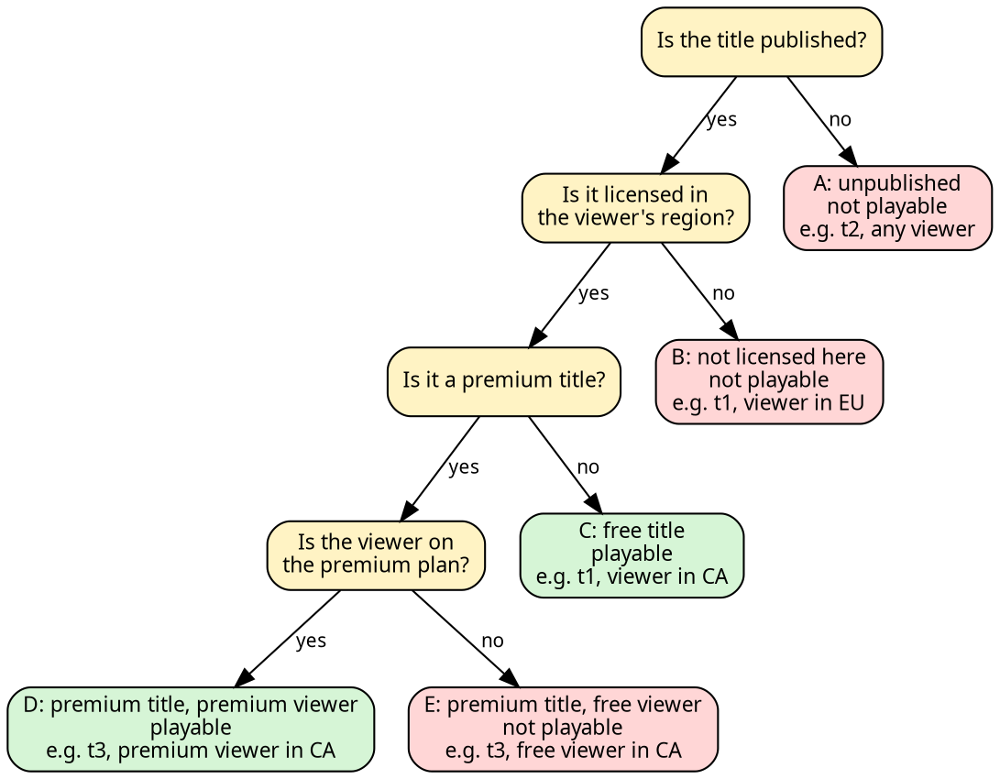
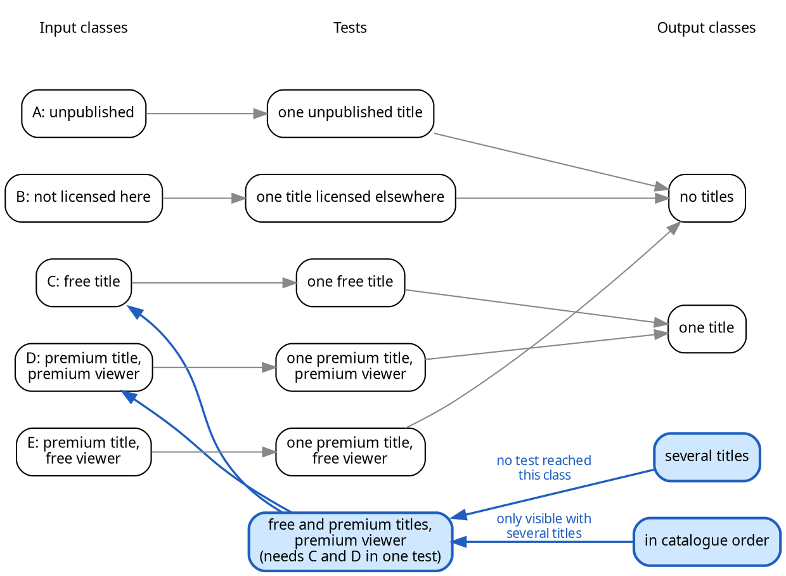

# Validating Behaviour

A function's contract states what it should do, and a test checks what it does for one chosen input.

The earlier chapters tested with `checkExpect` and `checkError`. These functions were a deliberately simple stand-in for the assertions used by real test frameworks. For the rest of the course we use `expect`, the assertion vocabulary of the [Chai](https://www.chaijs.com/) library. The [Vitest](https://vitest.dev/) test runner includes Chai's `expect`, as do many other test frameworks.

`checkExpect` could only compare for equality, and only reported failure in terms of that comparison. `expect` offers a family of assertion operators, each stating a different kind of expectation and, when it fails, reporting a message that describes the nature of the failure. A test case is also now a function body that you write, so it can build the values it needs, contain multiple assertions, and drive code that takes more than one step to set up.

## From `checkExpect` to `expect`

A `checkExpect` call paired the expression under test, wrapped in `() =>`, with an expected value. A Chai assertion reads more like a sentence. It names the value under test, then states what must be true of it. The most common assertion is equality, and every `checkExpect` we have written can be translated directly:

```typescript
// previously, with the course toolkit's checkExpect
test("no fee at the grace boundary", checkExpect(() => lateFee(2), 0));

// from here on, with Chai's expect
test("no fee at the grace boundary", () => {
    expect(lateFee(2)).to.equal(0);
});
```

<details class="tooltip ts-tips">
<summary><code>equal</code> Versus <code>deep.equal</code></summary>

`to.equal` compares with `===`. That is correct for numbers, strings, and booleans, but not for objects and arrays. For those, `===` asks whether two values are _the same object in memory_, not whether they hold the same contents, so two separately built objects with identical fields are not equal.

```typescript
expect({ id: "CPSC210" }).to.equal({ id: "CPSC210" });      // fails: different objects
expect({ id: "CPSC210" }).to.deep.equal({ id: "CPSC210" }); // passes: same contents
```

`to.deep.equal` compares structure. It checks that the two values have the same shape and the same values throughout. `checkExpect` always compared using deep equality, so when you translate a `checkExpect` whose expected value is an object or an array, use `deep.equal`, not `equal`.

</details>

Errors translate just as directly. Recall `requireSection` from the previous chapter, which throws when no section matches the requested id. `checkError` ran a function and passed if it threw, and `expect(...).to.throw` does the same:

```typescript
// previously
test("an unknown section throws",
    checkError(() => requireSection(catalogue, "NOPE"))
);

// now
test("an unknown section throws", () => {
    expect(() => requireSection(catalogue, "NOPE")).to.throw("no section with id NOPE");
});
```

As with `checkExpect` and `checkError`, the call under test is wrapped in `() =>` so that `expect` can run it and observe the throw, rather than receiving an error that has already escaped.

<details class="tooltip ts-tips">
<summary>When do we need to add <code>() =></code>?</summary>

In most assertions the argument to `expect` is a value, but for `to.throw` it is a function call wrapped in `() =>`. This is because `to.throw` must observe the _execution_ of the function to see whether it throws. It cannot examine a return value, because a function that throws has no return value (recall [Chapter 8](./08_errors)).

If you can write:
```typescript
const v = f();
expect(v).[...]
```
then you can write

```typescript
expect(f()).[...]
```

Any assertion (like `throw`) that must _observe the execution of f_ needs to be wrapped. Without the wrapper, the assertion cannot work:

```typescript
const v = f();                  // if f throws, the test stops here, before expect runs
expect(v).to.throw("error");    // otherwise v is f's result, not a function expect can run
```

With the wrapper, `expect` receives the function itself, runs it, and observes the throw:

```typescript
expect(() => f()).to.throw("error");
```
</details>

`to.throw` is also more precise than `checkError`. It takes the message we expect the failure to carry, and passes only if the thrown error's message contains it. A `checkError` test written with one failure in mind would still pass if a different failure happened, while a `to.throw` test with a message would fail.

<details class="tooltip deep-dive">
  <summary>Behaviour-Driven Development (BDD)</summary>

In the abstract, our assertions look like:

```typescript
expect(<the value under test>).to.<assertion>;
expect(<the value under test>).to.<assertion>(<expected value>);
```

Most assertions take an expected value in parentheses. A few, such as existence checks, are written as a property with no parentheses. The words in between, such as `to`, `be`, and `have`, only make the assertion read more naturally.

Chai's `expect` is a **behaviour-driven development** (BDD) assertion library. BDD is a style of testing that describes what code should do in language _close to ordinary prose_, so a test reads as a statement of _behaviour_ rather than a low-level comparison.

For example, the assertion

```typescript
expect(() => requireSection(catalogue, "NOPE")).to.throw("no section with id NOPE");
```

is longer than the `checkError` version, but it reads _almost_ the same as the English sentence it stands for. If the test description is also clear, the whole test case is a readable description of the behaviour it checks. A test suite written this way also documents what the code is meant to do. Chai favours a longer, readable form over a terse one for this reason.
</details>

<!--
<details class="tooltip ts-tips">
<summary>Importing <code>expect</code></summary>

From here on, test files import `expect` in place of `checkExpect` and `checkError`:

```typescript
import { test, expect } from "@ubccpsc/210-toolkit/testing";
```

`test` groups and names cases exactly as before. `expect` is the assertion function from the Chai library, which the vitest runner uses to evaluate your tests; the course toolkit re-exports it so the import stays in one place.

</details>
-->

### A Vocabulary of Assertions

Beyond equality, Chai groups its assertions by the kind of property they check. 
There are a lot of Chai assertions ([many, many](https://www.chaijs.com/api/bdd/)). 
While you can use any of them, the ones we find most commonly used in this course are listed below.

| Kind | Example | Passes when |
|---|---|---|
| Equality | `expect(fee).to.equal(0)` | The value matches exactly (use `deep.equal` for objects and arrays) |
| Boolean | `expect(done).to.be.true` | The value is `true` (or `to.be.false`) |
| Existence | `expect(found).to.exist` | The value is not `null` or `undefined` |
| Type | `expect(result).to.be.an("array")` | The value has the named type |
| Length | `expect(result).to.have.length(2)` | An array or string has that length |
| Inclusion | `expect(ids).to.include("CPSC210")` | An array contains the element (or a string the substring) |
| Membership | `expect(ids).to.have.members(["CPSC110", "CPSC121"])` | An array has exactly these elements, in any order |
| Property | `expect(section).to.have.property("id", "CPSC210")` | An object has the property, with the given value |
| Numeric | `expect(fee).to.be.at.most(10)` | A numeric comparison holds |
| Throws | `expect(() => f()).to.throw("...")` | The call raises an error |

<details class="tooltip link-110">
<summary>A Family of Checks</summary>

CPSC 110 already had more than one kind of check. Alongside `check-expect` you used `check-within` for numbers that need only be close, `check-member-of` for a value that must be one of several, `check-range` for a number in an interval, and `check-error` for an expression that must signal an error. Chai offers a larger set built on the same idea. `check-within` becomes `to.be.closeTo`, `check-member-of` becomes `to.be.oneOf`, `check-range` becomes `to.be.within`, and `check-error` becomes `to.throw`.

</details>

None of these is strictly necessary. Each could be written as an equality or boolean check: `expect(ids.includes("CPSC210")).to.equal(true)` does the same work as `expect(ids).to.include("CPSC210")`.

Using a more specific operator is better for two reasons. First, it shows at a glance _what_ is being checked, rather than a handwritten expression that happens to reduce to a boolean. Second, when it fails, it reports the actual problem. The generic form (`expect(ids.includes("CPSC210")).to.equal(true)`) reports:

```text
AssertionError: expected false to equal true
```

while the specific form (`expect(ids).to.include("CPSC210")`) names the value and the missing element:

```text
AssertionError: expected [ 'CPSC213' ] to include 'CPSC210'
```

<!--
<details class="tooltip deep-dive">
<summary>What Developers Write in Practice</summary>

These categories are not arbitrary. A study of 33,873 assertions drawn from 105 open-source JavaScript and TypeScript projects ([Zamprogno et al., 2022](https://www.cs.ubc.ca/~rtholmes/papers/tse_2022_zamprogno.pdf)) found that developer-written assertions, although numerous, are simple: the median test case contains a single assertion, and most assertions use a single operator. Almost all fell into twelve categories, with equality the most common at roughly 39%, followed by boolean, inclusion, length, and existence checks like the ones above. The same study found that nearly a quarter of the equality checks could have been written with a more specific operator that would read more clearly and fail more informatively. Two lessons carry over to your own tests: keep individual assertions simple, and prefer the operator that names what you mean.
</details>
-->

### Richer Test Cases

The second argument to `test` has always been a function. `checkExpect` hid this, because `checkExpect(...)` built the function that `test` would call to carry out the check.

For the rest of the course we will write that function ourselves:

```typescript
test(<description>, () => {
    <statements>
});
```

The description is unchanged, but the body is now an ordinary arrow function with a block body, so it can hold any number of statements. (As [Chapter 1](./01_new-language) described, a block body returns nothing implicitly. A test body has nothing to return anyway, because the runner judges the case by whether an assertion inside it failed.) This removes three restrictions of the earlier form:

1. _A test case can hold as many assertions as the behaviour needs._ We had one check per test case because the check _was_ the test body, not because a good test has only one check. With a block body, a test can state several expectations about a single result, which helps pinpoint what is wrong (see [Richer Failures](#richer-failures)). You can still write one assertion per test case when that is all a behaviour needs.

2. _Setup belongs inside the case._ In earlier chapters, a check was a single call `checkExpect(() => <actual>, <expected>)`, so the values a check needed were either declared above the tests, at the top level of the file, or built inside the thunk, as [Chapter 6](./06_state-mutation) did when testing functions that change their arguments. Everything declared at the top level is shared by every test in the file. If one of those values is _mutable_, a change made by one test is seen by the tests that run after it, and the suite can pass or fail depending on the order its cases run in. With a block body, each test case can hold its own `const` and `let` declarations, building only the values it needs without affecting other tests.

3. _Code under test can be driven through several steps._ We have seen that a `checkExpect` thunk could hold more than one statement, but it still had to reduce all the computation to one final value to check. A test body has no such limit. It can construct a value, configure it, exercise it, and assert at any point along the way, choosing a different operator for each assertion. Real tests need this because the behaviour under test is not reachable until the value has been built up through several steps.

### Shared Setup

Constructing values inside each test case keeps the tests independent, but can mean writing the same setup many times. [Chapter 6](./06_state-mutation) tested `calibrateDay` by building the same `readings` array inside every test case. A block body lets several assertions share one setup inside a single test case, but separate test cases still need their own copies. Building the array once at the top level instead lets one test's changes leak into the next.

Test runners solve this with **lifecycle hooks**, functions the runner calls before or after your tests. The most useful is `beforeEach`, which runs before every test. A hook is usually placed inside a `describe` block, which groups related tests under a shared name:

```typescript
describe("calibrateDay", () => {
    let readings: Reading[];

    beforeEach(() => {
        readings = [
            { hour: 6, tempCelsius: -4 },
            { hour: 9, tempCelsius: -1 }
        ];
    });

    test("the first reading is shifted by the offset", () => {
        calibrateDay(readings, 1);
        expect(readings[0].tempCelsius).to.equal(-3);
    });

    test("a zero offset leaves the readings unchanged", () => {
        calibrateDay(readings, 0);
        expect(readings).to.deep.equal([
            { hour: 6, tempCelsius: -4 },
            { hour: 9, tempCelsius: -1 }
        ]);
    });
});
```

Each test now starts from a fresh `readings` array, unaffected by what any other test did to it, so the tests are independent and can run in any order.

Because `readings` is declared inside the `describe` block, the scope rules from [Chapter 6](./06_state-mutation#scope-where-names-live) mean only the code in the block can use it. A hook declared inside a `describe` also applies only to that block's tests, so a test file can hold several `describe` blocks, each with its own setup. The runner reports each test under its group's name, such as `calibrateDay > the first reading is shifted by the offset`.

Most testing frameworks provide four hooks:

- `beforeEach` runs before each test and `afterEach` runs after each test. These are helpful for per-test setup and teardown.
- `beforeAll` runs once before the first test in the block and `afterAll` runs once after its last test is complete. These are best for setup too expensive to repeat, such as opening a read-only connection (e.g., to a database) or some other expensive resource like opening and parsing a large dataset file.

For values held in memory, a `beforeEach` that builds a fresh is almost always enough. The `afterEach` hook matters most when a test touches something outside the program, such as a file or a network connection, that must be released whether the test passed or failed.

The runner wraps each test in the per-test hooks, with the run-once hooks on the outside. The `beforeEach`, test, `afterEach` cycle repeats for every test:

<!-- pikchr playground: https://pikchr.org/home/pikchrshow -->
```pikchr
$yOnce = 1.4
$yEach = 0.7
$yCase = 0.0

box wid 8.9 ht 0.52 at (4.6,$yOnce) fill 0xf3f3f3 color 0xe6e6e6
box wid 8.9 ht 0.52 at (4.6,$yEach) fill 0xeaf2fb color 0xe6e6e6
box wid 8.9 ht 0.52 at (4.6,$yCase) fill 0xeaf7ea color 0xe6e6e6

text "Once per Group" small rjust at (0.05,$yOnce)
text "Around Each Test Case" small rjust at (0.05,$yEach)
text "Test Case(s)" small rjust at (0.05,$yCase)

boxwid = 0.84
boxht = 0.34
boxrad = 0.06

BA: box "beforeAll"  at (1.3,$yOnce) fill 0xcccccc
B1: box "beforeEach" at (2.3,$yEach) fill 0x9ec5e8
T1: box "test 1"     at (3.3,$yCase) fill 0x9ed29e
E1: box "afterEach"  at (4.3,$yEach) fill 0x9ec5e8
B2: box "beforeEach" at (5.3,$yEach) fill 0x9ec5e8
T2: box "test 2"     at (6.3,$yCase) fill 0x9ed29e
E2: box "afterEach"  at (7.3,$yEach) fill 0x9ec5e8
AA: box "afterAll"   at (8.3,$yOnce) fill 0xcccccc

arrow from BA.s to B1.n
arrow from B1.s to T1.n
arrow from T1.n to E1.s
arrow from E1.e to B2.w
arrow from B2.s to T2.n
arrow from T2.n to E2.s
arrow from E2.n to AA.s
```
<!-- caption="beforeEach and afterEach wrap every test in a group; beforeAll and afterAll run once for the group." -->

### Richer Failures

Consider a function that lists the sections a student can currently enrol in: those courses they have not already passed and whose prerequisites they have completed. We reuse the `Section` and `Student` types from [Chapter 8](./08_errors), with a catalogue that now offers two first-year courses:

<CollapsibleCode>

```typescript
type Section = {
    id: string;
    prerequisite: string[]; // ids of courses required first; empty if none
};

type Student = {
    id: string;
    completed: string[]; // ids of courses already passed
};

const catalogue: Section[] = [
    { id: "CPSC110", prerequisite: [] },
    { id: "CPSC121", prerequisite: [] },
    { id: "CPSC210", prerequisite: ["CPSC110"] },
    { id: "CPSC213", prerequisite: ["CPSC210"] }
];

/**
 * Determines whether a student has completed every prerequisite of a section.
 *
 * A section with no prerequisites is satisfied by every student.
 *
 * @param {Student} student the student whose completed courses are checked
 * @param {Section} section the section whose prerequisites must be met
 * @returns {boolean} true when the student has completed every id in
 * section.prerequisite, and false otherwise
 */
function hasAllPrerequisites(student: Student, section: Section): boolean {
    for (const required of section.prerequisite) {
        if (student.completed.includes(required) === false) {
            return false;
        }
    }
    return true;
}

/**
 * Lists the sections a student can currently enrol in.
 *
 * A section is eligible when the student has not already completed it and
 * has completed all of its prerequisites. Eligible sections are returned
 * in catalogue order.
 *
 * @param {Section[]} catalogue the sections on offer
 * @param {Student} student the student enrolling
 * @returns {Section[]} the eligible sections, or an empty array when none
 * are available
 */
function eligibleSections(catalogue: Section[], student: Student): Section[] {
    const result: Section[] = [];
    for (const section of catalogue) {
        // a section the student has completed is not on offer again
        if (student.completed.includes(section.id) === false) {
            if (hasAllPrerequisites(student, section)) {
                result.push(section);
            }
        }
    }
    return result;
}
```

</CollapsibleCode>

A student who has finished both first-year courses can take `CPSC210`, but not yet `CPSC213`. A single assertion can check the whole result:

```typescript
test("a student who finished first year can take CPSC210", () => {
    const student: Student = { id: "s1", completed: ["CPSC110", "CPSC121"] };
    expect(eligibleSections(catalogue, student)).to.deep.equal([{ id: "CPSC210", prerequisite: ["CPSC110"] }]);
});
```

This assertion is correct, and it fails if the result is wrong in any way. When it fails, though, the report says only that one array did not deeply equal another. You have to compare the two arrays yourself to find out whether the function returned `undefined`, an array of the wrong length, the wrong section, or the right section with the wrong prerequisites, because each of those faults produces almost the same message.

With a block body, we do not need to rely on a single assertion. We can get more precise failure messages by thinking about the different ways `eligibleSections` can fail, and writing a _sequence_ of assertions that catches each one, ordered from the most general to the most specific:

```typescript
test("a student who finished first year can take CPSC210", () => {
    const student: Student = { id: "s1", completed: ["CPSC110", "CPSC121"] };
    const result = eligibleSections(catalogue, student);

    expect(result).to.exist;                              // not null or undefined
    expect(result).to.be.an("array");                     // the right kind of value
    expect(result).to.have.length(1);                     // the right number of sections
    expect(result.map(s => s.id)).to.include("CPSC210");  // the section we expect
    expect(result).to.deep.equal([{ id: "CPSC210", prerequisite: ["CPSC110"] }]); // exactly right
});
```

Only the last assertion is strictly necessary. If it passes, every assertion above it must pass too.

The benefit appears when a test fails. Each kind of fault now trips a different, earlier assertion, and the _first_ failure names the problem:

```text
expected undefined to exist                       // returned nothing
expected [ … ] to have a length of 1 but got 2    // returned too many sections
expected [ 'CPSC213' ] to include 'CPSC210'       // returned the wrong section
```

Only a result that exists, is an array of the right length, and contains the expected id, but still differs somewhere in its contents, reaches the final `deep.equal`. With the general checks first, the earliest failure is always the most fundamental one, so you learn the _kind_ of mistake before its details.

You need not attach five assertions to every test, because redundant checks clutter a test without adding meaning. Layering is worthwhile when a value is structured enough that a _bare equality failure_ is hard to read, or when a function makes several independent guarantees worth checking separately. For the example above, we might skip the `to.exist` assertion and the one using `map`.

`expect` lets you write several assertions per test, and you decide when that is worth doing.

## Specification-Based Testing

A test case has three parts: constructing inputs, exercising the code with those inputs, and asserting that it behaves as expected. The sections above covered assertions. This section covers choosing inputs from a function's specification, without looking at its implementation. This is called **specification-based testing**, and is also known as _black-box testing_.

In [Chapter 3](./03_checking-invariants), we divided a function's input space into equivalence classes, grouping the inputs the specification treats alike, and tested one representative of each. We also looked closely at the boundaries between these equivalence classes. Both techniques are specification-based.

These techniques are the basis of input selection. But once a function's inputs and outputs are more complex than a single number, the input classes are defined over combinations of fields rather than ranges. We can also partition the output into classes.

For the rest of the chapter we test a video streaming service, whose main function has both an input and an output worth partitioning.

> As a streaming service, I want to show each viewer only the titles they can play right now, so that no one is offered something they cannot watch.

A viewer can play a title when the title is published, it is licensed in the viewer's region, and, if it is a premium title, the viewer is on a premium plan.

<CollapsibleCode>

```typescript
type Tier = "free" | "premium";

type Title = {
    id: string;
    published: boolean; // finished processing and live
    tier: Tier;
    regions: string[];  // regions where the title is licensed
};

type Viewer = {
    id: string;
    plan: Tier;
    region: string; // where the viewer is watching from
};

/**
 * Determines whether a viewer can play a title.
 *
 * A title is playable when it is published, it is licensed in the viewer's
 * region, and, if it is a premium title, the viewer is on the premium plan.
 *
 * @param {Viewer} viewer the viewer attempting to watch
 * @param {Title} title the title being checked
 * @returns {boolean} true when the viewer may play the title, and false
 * otherwise
 */
function canPlay(viewer: Viewer, title: Title): boolean {
    if (title.published === false) {
        return false; // not live yet
    }
    if (title.regions.includes(viewer.region) === false) {
        return false; // not licensed in the viewer's region
    }
    if (title.tier === "premium") {
        if (viewer.plan === "premium") {
            return true;
        }
        return false; // premium title, viewer on the free plan
    }
    return true;
}

/**
 * Lists the titles a viewer can currently play.
 *
 * A title is included exactly when canPlay accepts it. Titles are returned
 * in catalogue order.
 *
 * @param {Title[]} catalogue the titles on offer
 * @param {Viewer} viewer the viewer watching
 * @returns {Title[]} the playable titles, or an empty array when none are
 * available
 */
function playableTitles(catalogue: Title[], viewer: Viewer): Title[] {
    const result: Title[] = [];
    for (const title of catalogue) {
        if (canPlay(viewer, title)) {
            result.push(title);
        }
    }
    return result;
}
```

</CollapsibleCode>

Our tests use three titles, each with its own name so that a test can use it alone, and a catalogue holding all three:

```typescript
const t1: Title = { id: "t1", published: true,  tier: "free",    regions: ["CA", "US"] };
const t2: Title = { id: "t2", published: false, tier: "free",    regions: ["CA"] };
const t3: Title = { id: "t3", published: true,  tier: "premium", regions: ["CA"] };

const catalogue: Title[] = [t1, t2, t3];
```

The catalogue has a published free title licensed in two regions, an unpublished free title, and a published premium title.

### Input Partitioning

`playableTitles` takes a `Viewer` and a catalogue instead of a single number. Whether a title appears in the result depends on how their fields relate, for example whether the viewer's region is one of the regions the title is licensed in. The specification names four conditions (yellow boxes). Checking them in order puts every pairing of a title and a viewer into one of five classes (red and green boxes). Each class is a different behaviour and needs its own test.


<!-- caption="The five input classes for a title and a viewer, taken from the specification. Yellow boxes are the questions the specification asks. Green classes are playable and red classes are not. Each class shows a representative from the catalogue." -->

The questions in the tree come from the specification. The tree matches the `if` statements in `canPlay` because the code was written from the same specification. Taking the classes from the code instead would copy any mistakes the code makes, as [Chapter 3](./03_checking-invariants#equivalence-classes) showed.

Classes A, B, and E have the same outcome, a title that is not shown, but the specification reaches it for three different reasons. Each reason is a separate condition the code can get wrong, so each class needs its own check.

The simplest suite includes one test case for each class, with the smallest input that reaches it: a catalogue holding one title.

| Class | Catalogue | Viewer | Expected result |
|---|---|---|---|
| A: unpublished | `[t2]` | free, in CA | `[]` |
| B: not licensed here | `[t1]` | free, in EU | `[]` |
| C: free title | `[t1]` | free, in CA | `[t1]` |
| D: premium title, premium viewer | `[t3]` | premium, in CA | `[t3]` |
| E: premium title, free viewer | `[t3]` | free, in CA | `[]` |

Boundary value analysis also applies to structured inputs. For a collection, the boundaries are its sizes: empty, one element, and more than one. The tests above all use one title, so we add a test for the empty catalogue. Catalogues with more than one title are covered in the next section.

<CollapsibleCode>

```typescript
test("an unpublished title is hidden", () => {
    const viewer: Viewer = { id: "v1", plan: "free", region: "CA" };
    expect(playableTitles([t2], viewer)).to.deep.equal([]); // class A
});

test("a title is hidden outside its licensed regions", () => {
    const viewer: Viewer = { id: "v3", plan: "free", region: "EU" };
    expect(playableTitles([t1], viewer)).to.deep.equal([]); // class B
});

test("a free title is shown to a free viewer", () => {
    const viewer: Viewer = { id: "v1", plan: "free", region: "CA" };
    expect(playableTitles([t1], viewer)).to.deep.equal([t1]); // class C
});

test("a premium title is shown to a premium viewer", () => {
    const viewer: Viewer = { id: "v2", plan: "premium", region: "CA" };
    expect(playableTitles([t3], viewer)).to.deep.equal([t3]); // class D
});

test("a premium title is hidden from a free viewer", () => {
    const viewer: Viewer = { id: "v1", plan: "free", region: "CA" };
    expect(playableTitles([t3], viewer)).to.deep.equal([]); // class E
});

test("an empty catalogue has nothing to play", () => {
    const viewer: Viewer = { id: "v1", plan: "free", region: "CA" };
    expect(playableTitles([], viewer)).to.deep.equal([]); // boundary: no titles at all
});
```

</CollapsibleCode>

### Output Partitioning

Every result in those six tests is either empty or holds a single title. No test asks `playableTitles` to collect more than one title, so the suite cannot tell whether it does. Consider a near-miss implementation that stops at the first playable title:

```typescript
// Near-miss implementation example
function playableTitles(catalogue: Title[], viewer: Viewer): Title[] {
    for (const title of catalogue) {
        if (canPlay(viewer, title)) {
            return [title]; // bug: should keep going
        }
    }
    return [];
}
```

This version passes every test above, because with one title in the catalogue, returning the first playable title and returning every playable title give the same answer.

Partitioning the _output_ shows what is missing. `playableTitles` can return no titles, one title, or several titles. The tests for the input classes produce the first two kinds of result but never the third. When no test produces an output class, the suite needs a test that does. To produce several titles, a test needs at least two titles that the same viewer can play, and no single input class provides that. The test needs a free title and a premium title in the same catalogue, and a premium viewer who can see both, which combines classes C and D.

Adding titles to the catalogue does not guarantee this. A free viewer in CA given the whole catalogue sees only `t1`, so that test would still produce a single title. The test's input has to be chosen so that several titles are playable.


<!-- caption="Grey: one test for each input class. None of them produces several titles. Blue: the test added by working back from the output classes the grey tests miss." -->

The specification's last sentence says that titles are returned in catalogue order. Order only shows when there are at least two titles, so this is another behaviour the tests above cannot check. An implementation that builds its result with `unshift` instead of `push` returns the right titles in reverse order and passes all of them. It would also pass `to.have.members(["t1", "t3"])`, because `members` accepts the elements in any order. The new test therefore compares the whole list:

```typescript
test("a premium viewer sees every playable title, in catalogue order", () => {
    const viewer: Viewer = { id: "v2", plan: "premium", region: "CA" };
    const result = playableTitles(catalogue, viewer);

    expect(result).to.have.length(2); // the several-titles class
    expect(result.map(t => t.id)).to.deep.equal(["t1", "t3"]); // in catalogue order
});
```

This test fails for both near-miss implementations. For the first, the length assertion reports one title where two were expected.

Partitioning the input chooses the situations to test. Partitioning the output then checks the suite that results: list the kinds of result the function can produce, find the ones no test produces, and add a test for each. For `lateFee`, each input class produces its own kind of fee, so the output classes add no new tests. For `playableTitles`, the tests for the input classes never produced several titles, and the test added for that output class caught both near-miss implementations.

Together with [Chapter 3](./03_checking-invariants), this gives four places to look for test inputs:

| | Classes | Boundaries |
|---|---|---|
| **Inputs** | `lateFee`: grace, accruing, capped. `playableTitles`: classes A to E | `lateFee`: days 2 and 3, days 21 and 22. `playableTitles`: an empty catalogue |
| **Outputs** | `lateFee`: no fee, a partial fee, the $10 cap. `playableTitles`: no titles, one title, several titles | `lateFee`: the first day at $10. `playableTitles`: two titles, the smallest result that shows order |

## Structure-Based Testing

All the techniques so far are specification-based: the tests come from the specification, and the implementation is never examined.

Once an implementation exists, we can look inside. **Structure-based testing**, also known as _white-box testing_, derives tests from the _code as written_. We read the code and ask whether our tests _exercise_ everything it does.

Reading code reveals its _branches_, and each branch is a place a fault can hide untested. The decisions in `playableTitles` are all in its helper, `canPlay`, so that is where we look:

```typescript
function canPlay(viewer: Viewer, title: Title): boolean {
    if (title.published === false) {
        return false;            // branch 1: not live yet
    }
    if (title.regions.includes(viewer.region) === false) {
        return false;            // branch 2: not licensed in region
    }
    if (title.tier === "premium") {
        if (viewer.plan === "premium") {
            return true;         // branch 3: premium title, premium viewer
        }
        return false;            // branch 4: premium title, free viewer
    }
    return true;                 // branch 5: free title, allowed
}
```

Each branch needs a `(viewer, title)` pair that reaches it:

```typescript
test("every branch of canPlay is exercised", () => {
    const free: Viewer = { id: "v1", plan: "free", region: "CA" };
    const prem: Viewer = { id: "v2", plan: "premium", region: "CA" };

    const unpublished: Title =
        { id: "x", published: false, tier: "free", regions: ["CA"] };
    const elsewhere: Title =
        { id: "x", published: true, tier: "free", regions: ["US"] };
    const premiumHere: Title =
        { id: "x", published: true, tier: "premium", regions: ["CA"] };
    const freeHere: Title =
        { id: "x", published: true, tier: "free", regions: ["CA"] };

    expect(canPlay(free, unpublished)).to.be.false;  // branch 1
    expect(canPlay(free, elsewhere)).to.be.false;    // branch 2
    expect(canPlay(prem, premiumHere)).to.be.true;   // branch 3
    expect(canPlay(free, premiumHere)).to.be.false;  // branch 4
    expect(canPlay(free, freeHere)).to.be.true;      // branch 5
});
```

These five calls run every branch of `canPlay` at least once.

### Code Coverage

Structure-based testing also gives a natural measure of how thorough a test suite is. **Code coverage** measures how much of the code the suite executes.

A common form is **branch coverage**: the fraction of branches run by at least one test. The five cases above execute all five branches of `canPlay`, for 100% branch coverage. Without the two premium-title cases, coverage falls to three of five branches, and branches 3 and 4 are never run. Measuring coverage points out the parts of your code your tests do not reach.

But full coverage does not mean the code is correct. Suppose an earlier version of `canPlay` had never checked regional licensing:

```typescript
function canPlay(viewer: Viewer, title: Title): boolean {
    if (title.published === false) {
        return false;
    }
    if (title.tier === "premium") {
        if (viewer.plan === "premium") {
            return true;
        }
        return false;
    }
    return true; // regional licensing is never checked
}
```

This version has four branches. A suite that checks an unpublished title, a premium title for a premium viewer, a premium title for a free viewer, and a published free title gets 100% coverage. But the code is wrong: a title that is not licensed in the viewer's region can be judged playable.

Coverage cannot reveal this fault, because the problem is a _missing_ branch. Coverage measures the code you wrote, and cannot tell you that the specification needs more. Structure-based testing adds to specification-based testing and cannot replace it, because only the specification says what the code ought to do.

<details class="tooltip deep-dive">
<summary>Other Forms of Code Coverage</summary>

The most basic form of code coverage is **line coverage**, the percentage of lines executed at least once by a test suite. But line coverage can miss behaviour. For instance, given `foo`:

```typescript
function foo(x: number): boolean | undefined {
    if (x > 5) {
        return true;
    }
}
```

The test suite:

```typescript
test("greater than 5 returns true", () => {
    expect(foo(6)).to.be.true;
});
```

covers every line, but never exercises the case where `foo` returns `undefined`, when `x` is 5 or less.

The sequence of branches taken in one run of a program is called a **path**. If we could list all the possible paths through a function, we could measure a suite's **path coverage**, the share of paths it runs. This is possible for functions made only of `if` statements, but with loops and recursion the number of paths can be unbounded. Different paths are also not always meaningfully different: a loop running 5 times rather than 6 rarely needs its own test.
</details>

## Regression Testing

A program is not finished when it first passes its tests. Code changes over time as bugs are fixed, features are added, and working code is reorganised. Every change can introduce a **regression**, a change that _breaks behaviour that previously worked_.

Tests guard against regressions. Suppose that months later a teammate tidies `canPlay`. They reason that every title in the catalogue is published by the time it ships, so the published check at the top is redundant, and they remove it:

```typescript
function canPlay(viewer: Viewer, title: Title): boolean {
    if (title.regions.includes(viewer.region) === false) {
        return false;
    }
    if (title.tier === "premium") {
        if (viewer.plan === "premium") {
            return true;
        }
        return false;
    }
    return true;
}
```

The assumption is wrong: `t2` is not published, yet it is now judged playable. The change looks harmless, and a quick manual check on a published title would pass. The test suite catches it immediately. The test `"an unpublished title is hidden"` gives a catalogue holding only `t2` and expects nothing back, and the changed version returns `[t2]`. The several-titles test fails too, because a premium viewer now sees three titles instead of two.

So far, the tests you have written helped you get an implementation right. Catching regressions is their second job, and over the life of a program it is the more important one. Re-running the whole suite after every change, even one that looks harmless, makes it safe to keep changing a program, and the effort of writing tests is repaid each time someone touches the code.

#### Validating with Confidence

The type checker rules out malformed programs before they run, and tests show that the program does what its contract promises when it runs. Each testing technique in this chapter checks something different: layered assertions explain why a test failed, partitioning inputs and outputs chooses the cases a suite needs, coverage shows code the suite does not run, and re-running the suite after every change catches regressions. Together they give good reason to believe a program honours its contract.

This closes [Part 1](../part1/index), which covered modelling a problem with types, writing contracts and tests, maintaining invariants, managing state, interacting with the outside world, and designing for failure. [Part 2](../part2/index) builds on these foundational skills and extends them to systems where programs and teams grow beyond what one person can manage, and we can no longer rely on one programmer's discipline to maintain invariants. 

<details class="tooltip exercise">
  <summary>Exercise: Validating a Shipping Calculator</summary>

The function below is complete. Your task is to validate it with a thorough suite of `expect` assertions.

> As a shipping desk, I want each parcel priced by its weight, with express doubling the rate and unshippable parcels rejected, so that customers are charged correctly and never quoted a price we cannot honour.

```typescript
/**
 * Computes the shipping cost for a parcel, in dollars.
 *
 * Standard rates by weight: up to 1kg costs $5; over 1kg and up to 5kg
 * costs $10; over 5kg and up to 20kg costs $20. Express shipping doubles
 * the standard rate.
 *
 * @param {number} weightKg the parcel weight in kilograms
 * @param {boolean} express whether express shipping was selected
 * @returns {number} the shipping cost in dollars
 * @throws {Error} "weight must be positive" when weightKg <= 0
 * @throws {Error} "too heavy to ship" when weightKg > 20
 */
function shippingCost(weightKg: number, express: boolean): number {
    if (weightKg <= 0) {
        throw new Error("weight must be positive");
    }
    if (weightKg > 20) {
        throw new Error("too heavy to ship");
    }
    let base: number;
    if (weightKg <= 1) {
        base = 5;
    } else if (weightKg <= 5) {
        base = 10;
    } else {
        base = 20;
    }
    return express ? base * 2 : base;
}
```

Design the tests before writing them. Work through:

1. _Equivalence classes._ Group the weights the specification treats alike, and choose one representative from each, for both standard and express shipping.
2. _Boundary values._ <span class="hint">The tier edges (1kg, 5kg, 20kg) and the lower limit (0kg) are where off-by-one mistakes hide.</span> Decide which values just inside, on, and just outside each boundary a thorough suite should include.
3. _Outputs._ Confirm each distinct cost the function can produce<span class="hint">, and that express is exactly double the standard rate for the same weight</span>.
4. _Exceptions._ The contract names two ways the function throws. Assert each one<span class="hint"> with `expect(() => ...).to.throw(...)`</span>.

Fill in the cases below, adding or removing rows so that every class, boundary, and exception above is represented:

```typescript
test("standard rate by weight tier", () => {
    expect(shippingCost(0.5, false)).to.equal(/* ? */);
    // ... a representative from each standard tier
});

test("express doubles the standard rate", () => {
    // ... the same representative weights, with express = true
});

test("boundary weights fall in the expected tier", () => {
    // ... 1, 5, and the values just above them
});

test("invalid and unshippable weights are rejected", () => {
    expect(() => shippingCost(0, false)).to.throw("weight must be positive");
    // ... a weight over 20
});
```

When you are done, consider whether your suite gives the informative errors you would want as an engineer. Would a single failing assertion tell you which class, boundary, or exception broke?

</details>
