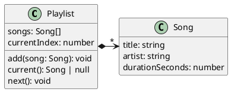
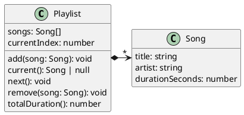
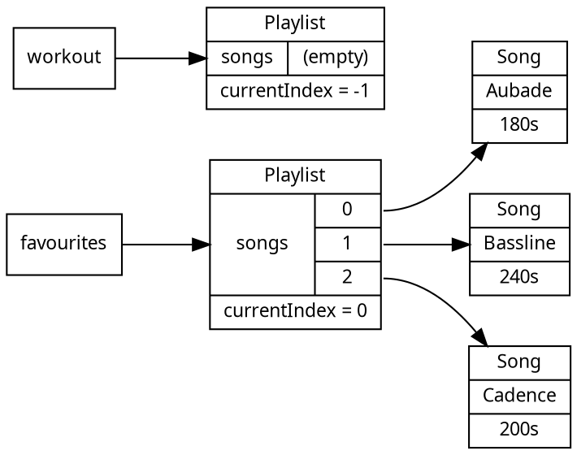

# Building Abstractions with Classes

Part 1 ended with invariants maintained by hand: we wrote a constructor function that established an invariant when a value was created, and we hid the value's state inside a closure so that only a fixed set of operations could change it. This chapter introduces object-oriented programming, which provides this same pattern as direct language syntax. The mechanism is the **class**: a named unit that bundles _state_ with the _operations that maintain it_.

> As a listener, I want a playlist that always knows which song is current, so that pressing "next" moves through my music predictably as I add and remove songs.

Consider the running example for this chapter. A playlist holds a list of songs and remembers which one is _current_, so that an interface can show what is playing and advance to the next song. The current position is a number, an index into the list of songs. The type of that field is `number`, but not every number is meaningful: only an index that actually points at a song makes sense, and when the playlist is empty there is no current song at all. This rule, that the current index is always a valid position in the list (or a sentinel when the list is empty), is an _invariant_. As in Part 1, the type system cannot express it: `number` permits `-4` and `9999` just as readily as a valid playlist index.

## The Problem: Keeping State Consistent

An invariant like this is only useful if it is always true. In a small program this can be maintained through discipline: every place that changes the song list also fixes the current index. That discipline does not scale. If the song list and the index are ordinary variables that any part of the program can read and write, then the entire program can leave the index pointing at a song that no longer exists. Spreading the state across more files does not help; a **global variable** is a reachable, and therefore writable, memory location that can be accessed from anywhere in a system. To maintain the invariant we would have to audit the whole program, which is exactly the kind of whole-program reasoning we are trying to avoid.

What we want is a way to bundle the state (the songs and the index) together with the operations that are allowed to change it (add, remove, advance), so that the invariant is the responsibility of one small, named unit rather than of every caller. That unit of organization is the class.

## Three Programming Paradigms

Before we build the class, it helps to place it among the programming paradigms we have already used, each of which has its place in software development.

**Functional programming** builds values and transforms them with functions, without mutation. We saw this in Part 1 when we modelled data as types and processed it with pure functions. Summing the durations of a list of songs functionally looks like this (note the lack of mutation):

```typescript
const total = songs.reduce((sum, song) => sum + song.durationSeconds, 0);
```

**Imperative programming** sequences code statements that read and change state step by step. The mutation chapter in Part 1 was imperative: a loop with a running total, reassigned on each pass. Imperatively, the same summing behaviour looks like this:

```typescript
let total = 0;
for (const song of songs) {
    total = total + song.durationSeconds;
}
```

**Object-oriented programming**, the subject of this part, bundles state together with the operations that maintain it. Written this way, the sum is a question we ask an object:

```typescript
const total = playlist.totalDuration();
```

These three are programming paradigms, not competitors. A method body is usually imperative; a class can hold immutable values; a functional pipeline can run inside a method. What changes between them is how a program is organised, and the object-oriented answer is to organise programs around objects that own their state.

<!--
RTH: not clear this digression is worth adding

<details class="tooltip link-110">
<summary>You Have Already Modelled a Playlist</summary>

In the Part 1 modelling chapter you described a playlist as a _tagged union_, `EmptyPlaylist | NonEmptyPlaylist`, and wrote separate functions such as `countSongs` and `totalDuration` that each took a `Playlist` and returned a result. The data lived in the type; the operations lived in free-standing functions; the two were separate things that a caller connected by hand. The object-oriented version keeps the same information but joins the data and the operations into one unit. The shift from "a type plus the functions that operate on it" to "an object that carries its own operations" is the move this chapter is about.

</details>
-->

## From Closures to Classes

The closure pattern from Part 1 provides the bridge into classes, because it already bundles state with operations; it simply does so without language support. Here is a playlist built with closures, as a constructor function whose returned operations close over the hidden state:


<CollapsibleCode>

```typescript
type Playlist = {
    add(song: Song): void;
    current(): Song | null;
    next(): void;
};

function makePlaylist(): Playlist {
    const songs: Song[] = [];   // hidden state
    let currentIndex = -1;      // hidden state; -1 means empty

    return {
        add(song: Song): void {
            songs.push(song);
            if (currentIndex === -1) {
                currentIndex = 0;
            }
        },
        current(): Song | null {
            return currentIndex === -1 ? null : songs[currentIndex];
        },
        next(): void {
            if (currentIndex !== -1) {
                currentIndex = (currentIndex + 1) % songs.length;
            }
        }
    };
}
```

</CollapsibleCode>

The state (`songs` and `currentIndex`) is reachable only through the three returned operations, so the invariant is safe. This works, but the language is not helping: the connection between the state, the constructor function, and the operations exists only because we arranged it by hand, and there is no named type that other code can depend on beyond the structural `Playlist` record.

A **class** expresses the same arrangement directly. The same playlist, written as a class would look like:

<CollapsibleCode>

```typescript
class Playlist {
    songs: Song[] = [];
    currentIndex: number = -1;

    add(song: Song): void {
        this.songs.push(song);
        if (this.currentIndex === -1) {
            this.currentIndex = 0;
        }
    }

    current(): Song | null {
        return this.currentIndex === -1 ? null : this.songs[this.currentIndex];
    }

    next(): void {
        if (this.currentIndex !== -1) {
            this.currentIndex = (this.currentIndex + 1) % this.songs.length;
        }
    }
}
```

</CollapsibleCode>

Each piece of the closure maps onto a piece of the class:

| Closure version | Class version |
|---|---|
| Variables closed over (`songs`, `currentIndex`) | Fields |
| The `makePlaylist` function | The constructor |
| The returned operations | Methods |
| Reaching state by closure | Reaching state through `this` |

The behaviour is identical. What the class adds is everything the hand-built version lacked: a name, `Playlist`, that is a type the rest of the program can use; a standard construction path through `new`; and operations that the language groups with the data instead of leaving us to wire together. The rest of this chapter develops each of these pieces.


<!-- caption: "Playlist and its operations." -->

## The Solution: Classes

A class is the primary unit of abstraction in object-oriented programs. It can be read as a _template_ for a kind of value: it describes the state every value of that kind holds, and the operations every such value provides. All major object-oriented languages, including C++, Java, Rust, and TypeScript, provide classes for this purpose.

<details class="tooltip deep-dive">
  <summary>Where classes are stored</summary>

In all languages, classes are stored in files. In some languages (like Java), a file must contain only a single class. This restriction is not present in TypeScript, where a file can contain multiple classes. In practice, it is most predictable for a file to contain a single class and for the filename to match the class name.

As systems grow, these files are organized into folders, which are themselves given meaningful names and collect related classes together.

</details>

Each class declares a type, named for the class. As with `type` in Part 1, the name is chosen carefully, because it is the most compact signal of what the class is for.

<details class="tooltip ts-tips">
<summary>Class Declarations</summary>

The class declaration
```typescript
class X {
   // ...
}
```
is a *statement* that declares the name `X` as a type.

</details>

A class on its own describes its values but does no work. To use a class, we need to create one. We do this with the `new` operator:

```typescript
const favourites = new Playlist();
```

<details class="tooltip ts-tips">
  <summary>The <code>new</code> operator</summary>

The statement
```typescript
new T();
```
instantiates an object of class `T`. When `new T()` is called, the `new` keyword automatically calls the declared constructor of class `T`, which returns the instance of `T`.

</details>

The new operator calls a special method on the class called a constructor; this method must be called before we can use the class. In TypeScript, constructors are (helpfully) called `constructor`:

```typescript
class Playlist {
    constructor() {
        // configure class here
    }
}
```

The constructor is the single point where every object of the class comes into existence, which makes it the place to _establish_ invariants, exactly as the constructor function did in Part 1. Enforcing the invariant to be established correctly lets every method afterward _assume_ it holds. The division of labour is similar to what we saw in Part 1: the constructor establishes the invariant, and each method preserves it.

<details class="tooltip ts-tips">
<summary>Constructors</summary>

Within a class, the `constructor()` statement:
```typescript
class T {
   constructor() {
     // empty default constructor
   }
}
```
defines how objects of type `T` are created. We do not call `constructor()` explicitly; it is called with `T()` in the statement `new T()`. Unlike other callables, a constructor is never annotated with a return type: it always returns the type defined by the class itself. If a class declares no constructor, TypeScript provides a default one that takes no arguments.

</details>

When we create an object from a class, we say we are **instantiating** the class. That is, we are creating an **instance** of a class that can store its own state and provides its own operations. Every instance of a class is called an **object** and is independent of the others: its state is unique to that individual instance.

```typescript
const favourites = new Playlist();
const workout = new Playlist();
```

Adding a song to `favourites` does nothing to `workout`. This independence is one of the ways classes help us manage state: a program can hold many objects, each responsible for its own slice of the world.

<!-- ## Class Bodies: Storing State and Functionality -->

A class binds together *state* and *functionality*. We look at each in turn.

## Class State

State is held in **fields**: named, typed, non-callable properties that each object stores independently. The `Playlist` class has two, the list of songs and the current index:

```typescript
class Playlist {
    songs: Song[] = [];
    currentIndex: number = -1;
    // ...
}
```

The `= []` and `= -1` give the fields default values, used when the constructor does not set them otherwise.

<details class="tooltip ts-tips">
  <summary>Fields and <code>this</code></summary>

The following defines a field named `field_1` of type `X` within class `T`.

```typescript
class T {

    myField: X;

    constructor(theField: X) {
        this.myField = theField;
    }
}
```

The `this` keyword refers to the *current instance* of the class; it only makes sense within a class body. Within the constructor, `this.myField` refers to `myField` in the object being constructed. 

</details>

<details class="tooltip ts-tips">
  <summary>Default Initializing Fields</summary>

When a field has a default initial value that the constructor does not need to customise, rather than writing:
```typescript
class T {
   myField: X;
   constructor() {
      this.myField = <default value>;
   }
}
```
we can write:
```typescript
class T {
    myField: X = <default value>;
}
```
This sets the default value of `myField` to whatever value `<default value>` holds. `<default value>` can be any expression, not just a variable. Setting a field's default value is equivalent to setting it in the constructor.

</details>

### When should I make a field?

Declaring a field is relatively straightforward: identify what state you need to track and give it a name that describes it clearly, identify its type, and decide whether it has a default value or must be supplied through the constructor. The harder question is _what should be state at all_, as opposed to a local variable inside a method. As a rule of thumb, data belongs in a field if its value must survive after a method returns, or must be visible to other methods.

The contents of a field are unique to each object. After:

```typescript
const chill = new Playlist();
chill.add(slowSong);
const party = new Playlist();
party.add(fastSong);
```

`chill.current()` and `party.current()` return different songs, because each object holds its own `songs` and `currentIndex`.

## Class Functionality

Functionality is provided by **methods**: callable properties that act on the object's state. Most methods exist to establish, preserve, or observe class invariants. Here is the `Playlist` class with its methods, including the `remove` operation that makes the invariant interesting:

<CollapsibleCode>

```typescript
class Playlist {
    songs: Song[] = [];
    currentIndex: number = -1;

    /** Adds a song to the end; the first song added becomes current. */
    add(song: Song): void {
        this.songs.push(song);
        if (this.currentIndex === -1) {
            this.currentIndex = 0;
        }
    }

    /** Returns the current song, or null when the playlist is empty. */
    current(): Song | null {
        return this.currentIndex === -1 ? null : this.songs[this.currentIndex];
    }

    /** Advances to the next song, wrapping back to the start. */
    next(): void {
        if (this.currentIndex !== -1) {
            this.currentIndex = (this.currentIndex + 1) % this.songs.length;
        }
    }

    /** Removes the given song, keeping the current position valid. */
    remove(song: Song): void {
        const i = this.songs.indexOf(song);
        if (i === -1) {
            return;
        }
        this.songs.splice(i, 1);
        if (this.songs.length === 0) {
            this.currentIndex = -1;
        } else if (i < this.currentIndex) {
            this.currentIndex = this.currentIndex - 1;
        } else if (this.currentIndex >= this.songs.length) {
            this.currentIndex = this.songs.length - 1;
        }
    }

    /** Total playing time of the playlist, in seconds. */
    totalDuration(): number {
        return this.songs.reduce((sum, song) => sum + song.durationSeconds, 0);
    }
}
```

</CollapsibleCode>

Removing a song can invalidate the current index: if the removed song was before the current one in the song list, every later index shifts down by one; if the removed song was the last one and it was current, the index now points past the end. Each branch repairs the index so that the invariant still holds when `remove` returns. The caller does not have to think about any of this. That is the point: the work of keeping the index valid lives _with_ the data it constrains, inside the method, not scattered through the calling code.

One decision inside `remove` is worth noticing now and settling later. `indexOf` locates the song by _identity_, so this method removes the exact object it was handed and ignores a separately built song with identical fields. Which of those a caller should expect is a design question we take up in the implementation freedom chapter.


<!-- caption="The same Playlist after adding the remove and totalDuration operations." -->

<details class="tooltip ts-tips">
<summary>Methods (and <code>this</code> again)</summary>

The following defines a method `firstMethod` for class `T`:
```typescript
class T {
    firstMethod(x: X, y: Y): Z {
       // do something with x and y to return a value of type Z
    }
}
```
Given an instance `const t = new T()`, we call the method with `t.firstMethod(...)`. The call can see only the data stored in `t`. To call one method from another, we use `this`:

```typescript
class T {
    firstMethod(x: X, y: Y): Z {
       if (this.secondMethod()) {
         // ...
       }
    }

    secondMethod(): boolean {
       // ...
    }
}
```

</details>

In all languages, methods have a name, take zero or more parameters, and return either a value or `void`. When a method returns nothing, declaring its return type as `void` signals to a reader that the absence of a return value is intentional.

### When should I make a method?

Declaring a method involves a few decisions: what the method is for and a name that captures that intent; what parameters it takes, with their names and types; and what it returns, with its type. It can help to think from a testing perspective. If you know what you want to check about a method, the parameters encode the data you would pass it and the return value the result you would inspect. Unlike a free function, a method can also read and change the object's _fields_, so part of its input and part of its result may live in the object rather than in the parameters and return value.


## Classes are Types

Declaring a class declares a type, and that type behaves like any other type from Part 1. `Playlist` can annotate a variable, type a parameter, be a return type, or be the element type of an array:

```typescript
function longest(playlists: Playlist[]): Playlist | null {
    let longestSoFar: Playlist | null = null;
    for (const playlist of playlists) {
        if (longestSoFar === null || playlist.totalDuration() > longestSoFar.totalDuration()) {
            longestSoFar = playlist;
        }
    }
    return longestSoFar;
}
```

The compiler checks these annotations exactly as it did for the types in Part 1. A function that expects a `Playlist` cannot be handed a `Song`, and the result of `longest` is known to be a `Playlist` or `null`, so a caller must consider the empty case. 

### Object Identity and References

A field of one object can hold another object, and a variable that "holds" an object actually holds a _reference_ to it, exactly as in the Part 1 mutation chapter. Two consequences follow.

First, two objects are distinct even when their contents match. Each `new` produces a separate object with its own identity:

```typescript
const a = new Playlist();
const b = new Playlist();
// a and b have identical (empty) contents, but a === b is false: they are different objects
```

Second, when an object is passed to a function or stored in a field, it is the reference that is copied, not the object. The caller and the callee then share that single object, and a method call that changes one is visible to both. This is the aliasing from Part 1, now the normal way objects are used; primitives behave differently, as the deep dive below explains.

### Working with Objects

A class declaration only describes what its objects look like. To do work, we instantiate objects and call their methods, using **dot notation**: in `playlist.next()`, the `.` separates the object from the method called on it. Because every object holds its own fields, a method call on one object never affects another.

The following walks a small program through two independent playlists:

<CollapsibleCode>

```typescript
const favourites = new Playlist();
const workout = new Playlist();

const a: Song = { title: "Aubade", artist: "Dawn Quartet", durationSeconds: 180 };
const b: Song = { title: "Bassline", artist: "Low End", durationSeconds: 240 };
const c: Song = { title: "Cadence", artist: "The Meter", durationSeconds: 200 };

favourites.add(a);
favourites.add(b);
favourites.add(c);
expect(favourites.current()).to.deep.equal(a);   // first song added is current

favourites.next();
expect(favourites.current()).to.deep.equal(b);

favourites.remove(b);                            // removing the current song keeps the index valid
expect(favourites.current()).to.deep.equal(c);   // c shifted into b's old position

expect(workout.current()).to.equal(null);        // workout is untouched and still empty
```

</CollapsibleCode>

After the three `add` calls, the objects and the references between them look like this. Each variable holds a reference to its own `Playlist`, and `favourites`' `songs` cells hold references to three separate `Song` objects, while `currentIndex` is an ordinary number rather than a reference:


<!-- caption: "favourites and workout are distinct objects; the songs cells reference separate Song objects, while currentIndex contains a primitive value." -->

<!--
<details class="tooltip exercise">
<summary>Exercise: Testing</summary>

The code above puts several checks in one block. The verification chapter argues that a test should focus on one behaviour at a time. How would you split these checks into separate tests, and what makes that harder for stateful objects than for the pure functions of Part 1?

</details>
-->

<details class="tooltip deep-dive">
<summary>References vs values</summary>

We saw what variables hold in [Copies and References](../part1/06_state-mutation#copies-and-references). But now that we are declaring and instantiating our own objects, we will start to encounter the differences between what variables hold for objects compared to primitive values. This can be especially confusing in terms of where changes are visible. 

Specifically, calling a function with an argument that is an object means any changes to that object within the function will be visible in any other context that has access to that object. But making the exact same changes to a primitive argument will _not_ be visible to external code that has access to the same value.

<CollapsibleCode>

```typescript
const someSong: Song = { title: "Drift", artist: "Marker", durationSeconds: 210 };

// An object argument is shared: the function changes the caller's playlist.
function addSong(list: Playlist, song: Song): void {
    list.add(song);
}

const mix = new Playlist();
addSong(mix, someSong);
expect(mix.current()).to.equal(someSong);   // the very same object, not a copy

expect(someSong.durationSeconds).to.equal(210);
expect(mix.current().durationSeconds).to.equal(210);

someSong.durationSeconds = 199; // mutate the value
expect(someSong.durationSeconds).to.equal(199);
expect(mix.current().durationSeconds).to.equal(199);


// A primitive argument is copied: the function cannot change the caller's value.
function bumpToZero(value: number): void {
    value = 0;
}

const count = 5;
bumpToZero(count);
expect(count).to.equal(5); // `count` is a value, not a `reference` and does not change
```

</CollapsibleCode>

The two assertions capture the whole difference: `mix` was shared with `addSong`, so the song it added is still there afterward, while `count` was copied into `bumpToZero`, so the caller's value never changed.

</details>

## Testing Classes

The verification chapter tested pure functions: pass arguments, inspect the return value. A class is different. An object carries _state_ between calls, so a test usually constructs the object, performs a sequence of operations, and then asserts on the state that results. The value under test is the object's observable behaviour, not a single return value.

The `Playlist` class from this chapter tracks a current song as songs are added and removed. A test for it reads as a short story: set up an object, drive it through some calls, and check where it ended up.

```typescript
const songA: Song = { title: "Aubade", artist: "Dawn Quartet", durationSeconds: 180 };
const songB: Song = { title: "Bassline", artist: "Low End", durationSeconds: 240 };

test("removing the current song keeps the position valid", () => {
    const playlist = new Playlist();
    playlist.add(songA);
    playlist.add(songB);
    playlist.next();                                  // current is now songB
    playlist.remove(songB);                           // remove the current song
    expect(playlist.current()).to.deep.equal(songA);  // the position stayed valid
});
```

The test-design ideas carry over unchanged. Equivalence classes and boundaries now describe _sequences of method calls_ rather than single arguments (an empty playlist, a one-song playlist, removing the current song versus another song), and layered assertions still apply to whatever the object exposes.

### Setup and Teardown

Almost every test of a class starts the same way: build a fresh object to work on. Writing `new Playlist()` at the top of every test is repetitive, and reusing one shared object across tests is worse than repetitive: one test's mutations would leak into the next, and the suite would quietly depend on the order its tests happen to run in. Test runners solve this with **lifecycle hooks**, functions the runner calls around your tests. The most useful is `beforeEach`, which runs before every test, the natural place to create a fresh object:

```typescript
let playlist: Playlist;

beforeEach(() => {
    playlist = new Playlist();   // a fresh, empty playlist before each test
});

test("a new playlist has no current song", () => {
    expect(playlist.current()).to.equal(null);
});

test("the first song added becomes current", () => {
    playlist.add(songA);
    expect(playlist.current()).to.deep.equal(songA);
});
```

Each test now receives its own `playlist`, untouched by any other, so the tests are independent and may run in any order. The hook removed the duplicated construction and, more importantly, the shared state that would have tied the tests together.

There are four hooks provided by most testing frameworks:

- `beforeEach` runs before each test and `afterEach` runs after each test. These are helpful for per-test setup and teardown.
- `beforeAll` runs once before the first test and `afterAll` runs once after the last test is complete. These are best for setup too expensive to repeat, such as opening a connection shared, read-only, by every test.

For the in-memory objects in this course, a `beforeEach` that constructs a fresh object is almost always all you need; the teardown hooks matter most when a test touches something outside the program, such as a file or a network connection, that must be released whether the test passed or threw.

The runner wraps each test in the per-test hooks, with the run-once hooks on the outside. The inner `beforeEach`, test, `afterEach` cycle repeats for every test case:

<!-- pikchr playground: https://pikchr.org/home/pikchrshow -->
```pikchr
$yOnce = 1.4
$yEach = 0.7
$yCase = 0.0

box wid 8.9 ht 0.52 at (4.6,$yOnce) fill 0xf3f3f3 color 0xe6e6e6
box wid 8.9 ht 0.52 at (4.6,$yEach) fill 0xeaf2fb color 0xe6e6e6
box wid 8.9 ht 0.52 at (4.6,$yCase) fill 0xeaf7ea color 0xe6e6e6

text "Once per Test File" small rjust at (0.05,$yOnce)
text "Around Each Test Case" small rjust at (0.05,$yEach)
text "Test Case(s)" small rjust at (0.05,$yCase)

boxwid = 0.84
boxht = 0.34
boxrad = 0.06

BA: box "beforeAll"  at (1.3,$yOnce) fill 0xcccccc
B1: box "beforeEach" at (2.3,$yEach) fill 0x9ec5e8
T1: box "test 1"     at (3.3,$yCase) fill 0x9ed29e
E1: box "afterEach"  at (4.3,$yEach) fill 0x9ec5e8
B2: box "beforeEach" at (5.3,$yEach) fill 0x9ec5e8
T2: box "test 2"     at (6.3,$yCase) fill 0x9ed29e
E2: box "afterEach"  at (7.3,$yEach) fill 0x9ec5e8
AA: box "afterAll"   at (8.3,$yOnce) fill 0xcccccc

arrow from BA.s to B1.n
arrow from B1.s to T1.n
arrow from T1.n to E1.s
arrow from E1.e to B2.w
arrow from B2.s to T2.n
arrow from T2.n to E2.s
arrow from E2.n to AA.s
```
<!-- caption: "beforeEach and afterEach wrap every test; beforeAll and afterAll run once for the file." -->

## The Value of Class Abstractions

Bundling state with the operations that maintain it is what makes the class a unit of _abstraction_. A client reasons about _what_ a `Playlist` does, through the behaviour its methods expose, without needing to know _how_ it keeps the current index valid. To use the class, a client finds the one that models the thing they care about and calls the methods that provide the behaviour they want. This is part of why naming matters so much in design: a good name is what lets an engineer find the abstraction they need. The work of storing the state and keeping it consistent stays inside the class.

<details class="tooltip deep-dive">
  <summary>The abstraction at work in <code>Playlist</code></summary>

Look back at how we used `favourites`. We called `add(..)`, `next()`, `current()`, and `remove(..)`, but we never touched the `songs` array directly, never adjusted `currentIndex`, and never worried about what removing the current song would do to the position. That work still happened; it was performed by `Playlist`. When we removed the current song, the index stayed valid because `remove` repairs it, and the caller could not get this wrong. As a client we only needed to know that a `Playlist` tracks a current song and moves through its list. How it stores the songs, and where it keeps the index valid, were details we never had to see.

</details>

This confines each concern to a single place. The class is the one location responsible for its own state, which frees the rest of the program from that responsibility. Because the operations that maintain the invariant live alongside the state they protect, rather than in the calling code, a client cannot accidentally leave an object in an inconsistent configuration by following the intended path.

<!--
So far this is the class *offering* an interface that a client has no need to look past. It is not yet a guarantee. Nothing in this chapter stops a determined caller from reaching in and writing `favourites.currentIndex = 99` directly, breaking the invariant from outside. Guaranteeing that a client *cannot* reach past the interface, so that an object's state is truly the class's own, is the role of [encapsulation](./03_encapsulation).
-->

<details class="tooltip exercise">
<summary>Exercise: Designing a Class</summary>
        
Design a class for the scenario below, following the same path this chapter used for `Playlist`.

> As a homeowner, I want a thermostat whose target temperature I can nudge up or down but never set outside a safe range, so that the house is never driven dangerously hot or cold.

For this task, design a class, give it a name, and determine its invariants. Figure out what fields it should maintain, and design the methods that should update the stored state. Since there are many possible abstractions for a problem like this, try to come up with more than one and compare and contrast them so you can think about the strengths and weaknesses of each.

</details>

