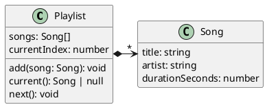
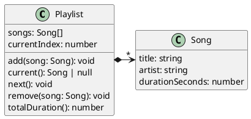
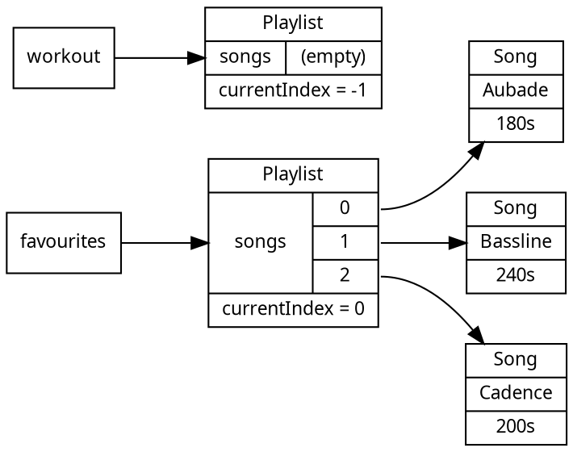

# Building Abstractions with Classes

[Part 1](../part1/index) ended with invariants maintained by hand. In [Chapter 4](../part1/04_maintaining-invariants), we wrote a constructor function that established an invariant when a value was created, and hid the value's state inside a closure so that only a fixed set of operations could change it.

This chapter introduces object-oriented programming, which provides the same pattern as language syntax. The mechanism is the **class**, a named unit that bundles _state_ with the _operations that maintain it_.

#### A Playlist with a Current Song

Consider the running example for this chapter:

> As a listener, I want a playlist that always knows which song is current, so that pressing "next" moves through my music predictably as I add and remove songs.

A playlist holds a list of songs and remembers which one is _current_, so that an interface can show what is playing and advance to the next song. The current position is an index into the list of songs. Its type is `number`, but not every number is meaningful. Only an index that points at a real song makes sense, and when the playlist is empty there is no current song at all. This rule, that the current index is always a valid position in the list (or a sentinel when the list is empty), is an _invariant_. As in [Part 1](../part1/index), the type system cannot express it, because `number` permits `-4` and `9999` as readily as a valid index.

## Keeping State Consistent

An invariant like _"the current position points to a real song in the playlist"_ is only useful if it is always true. In a small program it can be maintained through _discipline_, where every place that changes the song list also fixes the current index.

That discipline does not scale. Suppose the song list and the index are **global variables**, which any part of the system can read and write. Then any part of the program can leave the index pointing at a song that no longer exists, and splitting the program into more files does not help, because every file can still reach the variables. To maintain the invariant, we would have to audit the whole program, which is costly and error-prone.

What we want is a way to bundle the _state_ (the songs and the index) with the _operations that are allowed to change it_ (add, remove, advance). The invariant then becomes the responsibility of one small, named unit, rather than of every caller.

The unit that bundles state and operations is the _class_.

## From Closures to Classes

The closure pattern from [Chapter 4](../part1/04_maintaining-invariants) bundled state with operations using only what you knew from CPSC 110, but without support from the language. Here is a playlist built with closures, as a constructor function whose returned operations close over the hidden state:

<CollapsibleCode>

```typescript
type Playlist = {
    add(song: Song): void;
    current(): Song | null;
    next(): void;
};

function makePlaylist(): Playlist {
    const songs: Song[] = [];   // hidden state
    let currentIndex = -1;      // hidden state; -1 means empty

    return {
        add(song: Song): void {
            songs.push(song);
            if (currentIndex === -1) {
                currentIndex = 0;
            }
        },
        current(): Song | null {
            return currentIndex === -1 ? null : songs[currentIndex];
        },
        next(): void {
            if (currentIndex !== -1) {
                currentIndex = (currentIndex + 1) % songs.length;
            }
        }
    };
}
```

</CollapsibleCode>

The state (`songs` and `currentIndex`) is reachable only through the three returned operations, so the invariant is safe. But the language gives no help. The connection between the state, the constructor function, and the operations exists only because we arranged it by hand.

A **class** expresses the same arrangement with support from the language. The same playlist, written as a class, looks like this:

<CollapsibleCode>

```typescript
class Playlist {
    songs: Song[] = [];
    currentIndex: number = -1;

    add(song: Song): void {
        this.songs.push(song);
        if (this.currentIndex === -1) {
            this.currentIndex = 0;
        }
    }

    current(): Song | null {
        return this.currentIndex === -1 ? null : this.songs[this.currentIndex];
    }

    next(): void {
        if (this.currentIndex !== -1) {
            this.currentIndex = (this.currentIndex + 1) % this.songs.length;
        }
    }
}
```

</CollapsibleCode>

Each piece of the closure maps onto a piece of the class:

| Closure version | Class version |
|---|---|
| Variables closed over (`songs`, `currentIndex`) | Fields |
| The `makePlaylist` function | The constructor |
| The returned operations | Methods |
| Reaching state by closure | Reaching state through `this` |

The behaviour is identical. The class adds what the hand-built version lacked: one declaration that holds the state, the constructor, and the operations together, and a standard way to construct instances with `new`. One difference runs the other way. The closure's variables were unreachable from outside, but these fields can be read and written by any code that holds a `Playlist`. [Chapter 12](./03_encapsulation) closes that gap. The rest of this chapter develops the class itself.


<!-- caption="Playlist and its operations." -->

## Classes and Constructors

A class is the primary unit of abstraction in object-oriented programs. It can be read as a _template_ for a kind of value, describing the state every value of that kind holds and the operations every such value provides. Most object-oriented languages, including C++, Java, Python, and TypeScript, provide classes.

<details class="tooltip deep-dive">
  <summary>Where classes are stored</summary>

Classes are stored in files. In some languages, like Java, a file contains one public class. TypeScript has no such restriction, and a file can contain several classes. In practice, it is most predictable for a file to contain one class and for the filename to match the class name.

As systems grow, these files are organised into folders with meaningful names that group related classes together.

</details>

Each class declares a type named for the class. As with `type` in [Part 1](../part1/index), the name should be chosen carefully, because it is the shortest description of what the class is for.

<details class="tooltip ts-tips">
<summary>Class Declarations</summary>

The class declaration
```typescript
class X {
   // ...
}
```
is a _statement_ that declares the name `X` as a type.

</details>

A class on its own describes its values but does no work. To use a class, we create an instance with the `new` operator:

```typescript
const favourites: Playlist = new Playlist();
```

<details class="tooltip ts-tips">
  <summary>The <code>new</code> operator</summary>

The statement
```typescript
new T();
```
creates an object of class `T`. `new T()` calls the constructor declared by class `T`, and evaluates to the new instance of `T`.

</details>

`new` calls a special method on the class, its constructor, which runs before the object can be used. In TypeScript, the constructor is named `constructor`:

```typescript
class Playlist {
    constructor() {
        // configure class here
    }
}
```

The constructor is the single point where every object of the class comes into existence, which makes it the place to _establish_ invariants, as the constructor function did in [Chapter 4](../part1/04_maintaining-invariants). Once the constructor has established an invariant, every method can _assume_ it holds, and each method must preserve it, as in [Part 1](../part1/index).

<details class="tooltip ts-tips">
<summary>Constructors</summary>

Within a class, the `constructor()` statement:
```typescript
class T {
   constructor() {
     // empty default constructor
   }
}
```
defines how objects of type `T` are created. We do not call `constructor()` directly. `new T()` calls it. Unlike other functions, a constructor has no return type annotation, because it always produces an instance of its class. If a class declares no constructor, TypeScript provides a default one that takes no arguments.

</details>

Creating an object from a class is called **instantiating** the class, and the object is an **instance** of it. Every instance is an **object** with its own state, independent of every other instance.

```typescript
const favourites: Playlist = new Playlist();
const workout: Playlist = new Playlist();
```

Adding a song to `favourites` does nothing to `workout`. This independence is one way classes help manage state: a program can hold many objects, each responsible for its own part of the world.

<!-- ## Class Bodies: Storing State and Functionality -->

A class combines _state_ and _functionality_. We look at each in turn.

## Class State

State is held in **fields**, named and typed properties that each object stores independently. The `Playlist` class has two, the list of songs and the current index:

```typescript
class Playlist {
    songs: Song[] = [];
    currentIndex: number = -1;
    // ...
}
```

The `= []` and `= -1` give the fields default values, used when the constructor does not set them otherwise.

<details class="tooltip ts-tips">
  <summary>Fields and <code>this</code></summary>

The following defines a field named `myField` of type `X` within class `T`.

```typescript
class T {

    myField: X;

    constructor(theField: X) {
        this.myField = theField;
    }
}
```

The `this` keyword refers to the _current instance_ of the class, and only makes sense inside a class body. In the constructor, `this.myField` refers to `myField` in the object being constructed.

</details>

<details class="tooltip ts-tips">
  <summary>Default Initialising Fields</summary>

When a field has a default initial value that the constructor does not need to customise, rather than writing:
```typescript
class T {
   myField: X;
   constructor() {
      this.myField = <default value>;
   }
}
```
we can write:
```typescript
class T {
    myField: X = <default value>;
}
```
This sets the default value of `myField` to `<default value>`, which can be any expression. Setting a default is equivalent to setting the field in the constructor.

</details>

Declaring a field is straightforward. Decide what state you need to track, give it a clear name and a type, and decide whether it has a default value or must be supplied through the constructor. The harder question is _what should be state at all_, as opposed to a local variable inside a method. As a rule of thumb, data belongs in a field if its value must survive after a method returns, or must be visible to other methods.

## Class Functionality

Functionality is provided by methods. A **method** is a function property that acts on the object's state. Most methods preserve or observe the class's invariants.

<details class="tooltip ts-tips">
<summary>Methods (and <code>this</code> again)</summary>

The following defines a method `firstMethod` for class `T`:
```typescript
class T {
    firstMethod(x: X, y: Y): Z {
       // do something with x and y to return a value of type Z
    }
}
```
Given an instance `const t: T = new T()`, we call the method with `t.firstMethod(...)`, and the call can see only the data stored in `t`. To call one method from another, use `this`:

```typescript
class T {
    firstMethod(x: X, y: Y): Z {
       if (this.secondMethod()) {
         // ...
       }
    }

    secondMethod(): boolean {
       // ...
    }
}
```

</details>

A method has a name, takes zero or more parameters, and either returns a value or is declared `void`. Declaring a return type of `void` tells a reader that the lack of a return value is intentional.

Declaring a method involves a few decisions:
- What the method is for, and a name that captures that intent.
- What parameters it takes, with their names and types.
- What it returns, and its type.

It can help to think about testing. If you know what you want to check about a method, its parameters are the data you would pass it and its return value is the result you would inspect. Unlike a free function, though, a method can also read and change the object's _fields_, so part of its input and part of its result may live in the _object_ rather than in its parameters and return value.

Here is the `Playlist` class with its methods, including the `remove` operation that makes the invariant interesting:

<CollapsibleCode>

```typescript
class Playlist {
    songs: Song[] = [];
    currentIndex: number = -1;

    /** Adds a song to the end; the first song added becomes current. */
    add(song: Song): void {
        this.songs.push(song);
        if (this.currentIndex === -1) {
            this.currentIndex = 0;
        }
    }

    /** Returns the current song, or null when the playlist is empty. */
    current(): Song | null {
        return this.currentIndex === -1 ? null : this.songs[this.currentIndex];
    }

    /** Advances to the next song, wrapping back to the start. */
    next(): void {
        if (this.currentIndex !== -1) {
            this.currentIndex = (this.currentIndex + 1) % this.songs.length;
        }
    }

    /** Removes the given song, keeping the current position valid. */
    remove(song: Song): void {
        const i: number = this.songs.indexOf(song);
        if (i === -1) {
            return;
        }
        this.songs.splice(i, 1);
        if (this.songs.length === 0) {
            this.currentIndex = -1;
        } else if (i < this.currentIndex) {
            this.currentIndex = this.currentIndex - 1;
        } else if (this.currentIndex >= this.songs.length) {
            this.currentIndex = this.songs.length - 1;
        }
    }

    /** Total playing time of the playlist, in seconds. */
    totalDuration(): number {
        return this.songs.reduce((sum, song) => sum + song.durationSeconds, 0);
    }
}
```

</CollapsibleCode>

Removing a song can invalidate the current index. If the removed song was before the current one, every later index shifts down by one, and if the removed song was the last one and it was current, the index now points past the end. Each branch repairs the index so that the invariant still holds when `remove` returns. The caller does not have to think about any of this, because the work of keeping the index valid lives _with_ the data it constrains, inside the method, rather than in the calling code.

In `remove`, `indexOf` finds the song by _identity_, so `remove` removes the exact object it was given and ignores a separately built song with identical fields. Is this reasonable to expect of the caller? [Chapter 13](./04_flexibility) discusses this design tradeoff.


<!-- caption="The same Playlist after adding the remove and totalDuration operations." -->

## Programming Paradigms

The class is a third way of organising a program, alongside two paradigms from Part 1.

**Functional programming** builds values and transforms them with functions, without mutation. We saw this in [Part 1](../part1/index) when we modelled data as types and processed it with pure functions. Summing the durations of a list of songs functionally looks like this, with no mutation:

```typescript
const total: number = songs.reduce((sum: number, song: Song) => sum + song.durationSeconds, 0);
```

**Imperative programming** is a sequence of statements ([Chapter 1](../part1/01_new-language)) that read and change state ([Chapter 6](../part1/06_state-mutation)) step by step. Recursion is the idiomatic functional way of handling variable-sized data, and loops ([Chapter 5](../part1/05_arrays)) are the idiomatic imperative way. Imperatively, the same sum looks like this:

```typescript
let total: number = 0;
for (const song of songs) {
    total = total + song.durationSeconds;
}
```

**Object-oriented programming** bundles state with the operations that maintain it. Written this way, the sum is a question we ask an object:

```typescript
const total: number = playlist.totalDuration();
```

These three are not competitors. A method body is usually imperative, a class can hold immutable values, and a functional pipeline can run inside a method. What differs is how a program is organised. Object-oriented programs are organised around objects that own their state.

<!--
RTH: not clear this digression is worth adding

<details class="tooltip link-110">
<summary>You Have Already Modelled a Playlist</summary>

In the Part 1 modelling chapter you described a playlist as a _tagged union_, `EmptyPlaylist | NonEmptyPlaylist`, and wrote separate functions such as `countSongs` and `totalDuration` that each took a `Playlist` and returned a result. The data lived in the type; the operations lived in free-standing functions; the two were separate things that a caller connected by hand. The object-oriented version keeps the same information but joins the data and the operations into one unit. The shift from "a type plus the functions that operate on it" to "an object that carries its own operations" is the move this chapter is about.

</details>
-->

## Classes Are Types

Declaring a class declares a type, and that type behaves like any other type from [Part 1](../part1/index). `Playlist` can annotate a variable, type a parameter, be a return type, or be the element type of an array:

```typescript
function longest(playlists: Playlist[]): Playlist | null {
    let longestSoFar: Playlist | null = null;
    for (const playlist of playlists) {
        if (longestSoFar === null || playlist.totalDuration() > longestSoFar.totalDuration()) {
            longestSoFar = playlist;
        }
    }
    return longestSoFar;
}
```

The compiler checks these annotations as it did for the types in [Part 1](../part1/index). A function that expects a `Playlist` cannot be given a `Song`, and the result of `longest` is known to be a `Playlist` or `null`, so a caller must handle the empty case.

### Objects and References

A field of one object can hold another object, and a variable that "holds" an object actually holds a _reference_ to it, as in [Chapter 6](../part1/06_state-mutation). This has two consequences:

1. Two objects are distinct even when their contents match. Each `new` produces a separate object with its own identity:

```typescript
const a: Playlist = new Playlist();
const b: Playlist = new Playlist();
// a === b is false: they are different objects
```

2. When an object is passed to a function or stored in a field, the _reference_ is copied, not the object. The caller and the callee then share one object, so a change made through either is visible to both. This is the aliasing from [Chapter 6](../part1/06_state-mutation#copies-and-references), and as that chapter showed, primitives behave differently.

## Working with Objects

A class declaration only describes what its objects look like. To do work, we instantiate objects and call their methods with dot notation: in `playlist.next()`, the `.` separates the object from the method called on it. Because every object holds its own fields, a method call on one object does not affect another.

The following program uses two independent playlists:

<CollapsibleCode>

```typescript
const favourites: Playlist = new Playlist();
const workout: Playlist = new Playlist();

const a: Song = { title: "Aubade", artist: "Dawn Quartet", durationSeconds: 180 };
const b: Song = { title: "Bassline", artist: "Low End", durationSeconds: 240 };
const c: Song = { title: "Cadence", artist: "The Meter", durationSeconds: 200 };

favourites.add(a);
favourites.add(b);
favourites.add(c);
expect(favourites.current()).to.deep.equal(a);   // first song added is current

favourites.next();
expect(favourites.current()).to.deep.equal(b);

favourites.remove(b);                            // removing the current song keeps the index valid
expect(favourites.current()).to.deep.equal(c);   // c shifted into b's old position

expect(workout.current()).to.equal(null);        // workout is untouched and still empty
```

</CollapsibleCode>

After the three `add` calls, the objects and the references between them look like this. Each variable holds a reference to its own `Playlist`, and the cells of `favourites`' `songs` hold references to three separate `Song` objects. `currentIndex`, by contrast, is an ordinary number, not a reference:


<!-- caption="favourites and workout are distinct objects; the songs cells reference separate Song objects, while currentIndex contains a primitive value." -->

<!--
<details class="tooltip exercise">
<summary>Exercise: Testing</summary>

The code above puts several checks in one block. The verification chapter argues that a test should focus on one behaviour at a time. How would you split these checks into separate tests, and what makes that harder for stateful objects than for the pure functions of Part 1?

</details>
-->

## Testing Classes

In [Chapter 9](../part1/09_validation), we tested pure functions by passing them arguments and inspecting the return value.

Testing a class is different. An object carries _state_ between calls, so a test usually constructs an object, performs a sequence of operations, and then checks the resulting state. What is being tested is the object's observable behaviour, not a single return value.

The `Playlist` class tracks a current song as songs are added and removed. A test for it sets up an object, drives it through some calls, and checks where it ended up.

```typescript
const songA: Song = { title: "Aubade", artist: "Dawn Quartet", durationSeconds: 180 };
const songB: Song = { title: "Bassline", artist: "Low End", durationSeconds: 240 };

test("removing the current song keeps the position valid", () => {
    const playlist: Playlist = new Playlist();
    playlist.add(songA);
    playlist.add(songB);
    playlist.next();                                  // current is now songB
    playlist.remove(songB);                           // remove the current song
    expect(playlist.current()).to.deep.equal(songA);  // the position stayed valid
});
```

The test-design ideas from Part 1 still apply. Equivalence classes and boundaries now describe _sequences of method calls_ rather than single arguments: an empty playlist, a one-song playlist, and removing the current song versus another song. Layered assertions apply to whatever state the object exposes.

Almost every test of a class starts by building a fresh object. Writing `new Playlist()` at the top of every test is repetitive, but sharing one object across tests is worse, because one test's changes would leak into the next and the suite would depend on the order its tests run in. Test runners solve this with **lifecycle hooks**, functions the runner calls around your tests. The most useful is `beforeEach`, which runs before every test and is the natural place to create a fresh object:

```typescript
let playlist: Playlist;

beforeEach(() => {
    playlist = new Playlist();   // a fresh, empty playlist before each test
});

test("a new playlist has no current song", () => {
    expect(playlist.current()).to.equal(null);
});

test("the first song added becomes current", () => {
    playlist.add(songA);
    expect(playlist.current()).to.deep.equal(songA);
});
```

Each test now gets its own `playlist`, unaffected by any other, so the tests are independent and can run in any order. The hook removed both the repeated construction and the shared state that would have tied the tests together.

Most testing frameworks provide four hooks:

- `beforeEach` runs before each test and `afterEach` runs after each test. These are helpful for per-test setup and teardown.
- `beforeAll` runs once before the first test and `afterAll` runs once after the last test is complete. These are best for setup too expensive to repeat, such as opening a read-only connection shared by every test.

For the in-memory objects in this course, a `beforeEach` that constructs a fresh object is almost always enough. The `afterEach` hook matters most when a test touches something outside the program, such as a file or a network connection, that must be released whether the test passed or failed.

The runner wraps each test in the per-test hooks, with the run-once hooks on the outside. The `beforeEach`, test, `afterEach` cycle repeats for every test:

<!-- pikchr playground: https://pikchr.org/home/pikchrshow -->
```pikchr
$yOnce = 1.4
$yEach = 0.7
$yCase = 0.0

box wid 8.9 ht 0.52 at (4.6,$yOnce) fill 0xf3f3f3 color 0xe6e6e6
box wid 8.9 ht 0.52 at (4.6,$yEach) fill 0xeaf2fb color 0xe6e6e6
box wid 8.9 ht 0.52 at (4.6,$yCase) fill 0xeaf7ea color 0xe6e6e6

text "Once per Test File" small rjust at (0.05,$yOnce)
text "Around Each Test Case" small rjust at (0.05,$yEach)
text "Test Case(s)" small rjust at (0.05,$yCase)

boxwid = 0.84
boxht = 0.34
boxrad = 0.06

BA: box "beforeAll"  at (1.3,$yOnce) fill 0xcccccc
B1: box "beforeEach" at (2.3,$yEach) fill 0x9ec5e8
T1: box "test 1"     at (3.3,$yCase) fill 0x9ed29e
E1: box "afterEach"  at (4.3,$yEach) fill 0x9ec5e8
B2: box "beforeEach" at (5.3,$yEach) fill 0x9ec5e8
T2: box "test 2"     at (6.3,$yCase) fill 0x9ed29e
E2: box "afterEach"  at (7.3,$yEach) fill 0x9ec5e8
AA: box "afterAll"   at (8.3,$yOnce) fill 0xcccccc

arrow from BA.s to B1.n
arrow from B1.s to T1.n
arrow from T1.n to E1.s
arrow from E1.e to B2.w
arrow from B2.s to T2.n
arrow from T2.n to E2.s
arrow from E2.n to AA.s
```
<!-- caption="beforeEach and afterEach wrap every test; beforeAll and afterAll run once for the file." -->

#### The Value of Class Abstractions

A class is a unit of _abstraction_ because it bundles state with the operations that maintain it. A client reasons about _what_ a `Playlist` does, through its methods, without needing to know _how_ it keeps the current index valid. A client only needs to find a class that models what they care about and call the methods that provide the behaviour they want. The work of storing the state and keeping it consistent stays inside the class.

Naming matters in class design, because a good name lets an engineer find the abstraction they need _without_ reading the code that implements it.

The class is the one place responsible for its own state, which frees the rest of the program from that responsibility. Because the operations that maintain the invariant live alongside the state they protect, a client following the intended path cannot leave an object in an inconsistent state.

<!--
So far this is the class _offering_ an interface that a client has no need to look past. It is not yet a guarantee. Nothing in this chapter stops a determined caller from reaching in and writing `favourites.currentIndex = 99` directly, breaking the invariant from outside. Guaranteeing that a client _cannot_ reach past the interface, so that an object's state is truly the class's own, is the role of [encapsulation](./03_encapsulation).
-->

<details class="tooltip exercise">
<summary>Exercise: Designing a Class</summary>

Design a class for the scenario below, following the same path this chapter used for `Playlist`.

> As a homeowner, I want a thermostat whose target temperature I can nudge up or down but never set outside a safe range, so that the house is never driven dangerously hot or cold.

For this task, design a class, name it, and determine its invariants. Decide what fields it should hold, and design the methods that update that state. There are many possible designs for a problem like this, so try to come up with more than one and compare their strengths and weaknesses.

</details>

