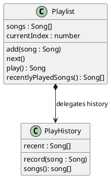

# Decomposing Systems into Cohesive Classes

[Chapter 10](./01_abstraction) established the _class_ as the unit of abstraction. A class bundles state that must respect an ivariant with the operations that maintain that invariant, giving the rest of the program a named type it can depend on. This bounds reasoning to one kind of thing at a time. 

A class is a way to build an abstraction, but how do we build a _good_ abstraction? We still have to decide what classes we need, what state they maintain, and what operations they afford.

This chapter is about those decisions. Classes only improve the design of a system when they make sense on their own. A class that maintains several unrelated invariants _stops_ being a single thing someone can reason about. When we think about what state and operations belong in a class, we are evaluating **cohesion**. 

## How Classes Lose Cohesion

Classes rarely start out doing too much: they gain responsibilities one reasonable change at a time. Our `Playlist` from the previous chapter contained a single invariant: the current index is always a valid position in the song list. Suppose we now add a new feature, remembering recently played songs:


> As a listener, I want my music app to remember what I have recently played, so that I can return to a song without searching for it again.

The path of least resistence is to add this feature to the `Playlist` class we already have:

<CollapsibleCode>

```typescript
class Playlist {

    songs: Song[] = [];
    currentIndex: number = -1;
    recentlyPlayed: Song[] = [];   // a second responsibility, bolted on

    // navigation: maintains the current-index invariant
    add(song: Song): void { /* ... */ }
    remove(song: Song): void { /* ... */ }
    next(): void { /* ... */ }
    current(): Song | null { /* ... */ }

    /** Plays the current song and records it as recently played. */
    play(): Song | null {
        const song = this.current();
        if (song !== null) {
            // history bookkeeping, tangled into the playlist
            const i = this.recentlyPlayed.indexOf(song);
            if (i !== -1) {
                this.recentlyPlayed.splice(i, 1);
            }
            this.recentlyPlayed.unshift(song);
        }
        return song;
    }

    recentlyPlayedSongs(): Song[] {
        return this.recentlyPlayed;
    }
}
```

</CollapsibleCode>

This change doesn't add much code. But, the class now maintains two unrelated invariants: (1) the original navigation invariant says the current index is valid, and (2) a new history invariant says the recently played list holds each song at most once, most-recently-played first. The two invariants nothing to do with each other, yet they now live in one class. Now, `play()` straddles both: it observes the navigation state through `current()` and maintains the history state directly. To understand or safely change either invariant, an engineer now has to consider the other one.

Left unchecked, a class that keeps absorbing responsibilities becomes a **god class**: one type that knows about and does everything. Each addition seemed reasonable on its own, but the result is a class with many fields and methods that collaborate on multiple invariants. This happens because adding one more method to an existing class is easier than creating a new class and keeping its contents cohesive.

A god class is hard to maintain: there is no one invariant to reason about, so any change risks disturbing something unrelated. It is also hard to _use_. This usage cost is easy to overlook. Clients use a class by finding the one that models what they care about, and calling the methods that provide that behaviour. This reuse depends on a class having a clear, single purpose. When disparate functionality is included in one class with no organising invariant, an engineer cannot predict where a feature lives. In a god class the answer is: it could be anywhere! The engineer is left scrolling a long list of unrelated methods hoping to recognise the right one.

Cohesion makes features findable. When every class is organised around a single invariant, we can easily reason about where a capability should live and look there first. The name of the class confirms whether we have found that right place. A system of many small, cohesive classes is easier to navigate than one of a few large ones, even though it has more parts, because each part announces what it is responsible for.

<details class="tooltip ts-tips">
  <summary>A <code>Playlist</code> that has grown into a god class</summary>

After a few releases, `Playlist` has gained features for history, ratings, shuffling, and sharing, all in addition to its original navigation responsibility:

<CollapsibleCode>

```typescript
class Playlist {

    // navigation
    add(song: Song): void { /* ... */ }
    remove(song: Song): void { /* ... */ }
    next(): void { /* ... */ }
    current(): Song | null { /* ... */ }

    // play history
    play(): Song | null { /* ... */ }
    recentlyPlayedSongs(): Song[] { /* ... */ }

    // ratings
    rate(song: Song, stars: number): void { /* ... */ }
    averageRating(): number { /* ... */ }

    // shuffle
    shuffle(): void { /* ... */ }
    restoreOrder(): void { /* ... */ }

    // sharing
    exportAsText(): string { /* ... */ }
    shareWith(userId: string): void { /* ... */ }
}
```

</CollapsibleCode>

Consider where you would look in a class like this to change how recently played songs are tracked, to adjust how ratings are averaged, or to export the playlist. Nothing about the class points you anywhere, because it is responsible for all of it. Each comment marks a cluster that answers to a different invariant, and each cluster belongs in its own class.

</details>

## Cohesion and the Single Responsibility Principle

**Single Responsibility Principle** at the class level means: one class, one invariant. A _cohesive_ class enforces exactly one invariant, and every field and method exists to establish, preserve, or observe it. We can understand such a class from its invariant alone. And we can change it without reaching into the rest of the system. Both of these (understanding classes easily, changes being isolated) are properties of a good decomposition.

**Decomposition** is the act of breaking a problem into smaller pieces that have well-defined roles. In object-oriented programming, we decompose problems by deciding where one class ends and another begins. We will use the concept of _cohesion_ to reason about the quality of a decomposition, and differentiate a good split from a bad one.

Some classes are not built around an explicit invariant. A pure value object or a stateless helper (e.g., `mean`) holds no invariant, but is cohesive around a single concept or operation instead. The underlying principle, one purpose per class, is unchanged. A class that serves several purposes fails regardless of how its purpose is expressed.

Cohesion shapes how a system behaves when it needs to change. When each invariant lives in exactly one class, a bug fix or a new feature for that invariant stays inside the class that owns it, instead of spreading across the system. The change stays local, which makes it easier to make and less likely to cause the cascading edits that follow when one change forces matching changes in many other places.

There is rarely a single "good" decomposition. The same system can usually be split in several reasonable ways. Competent engineers will sometimes disagree about which is best. What cohesion gives us is not the one _right_ split but a reliable way to recognise _poor_ splits. A poorly decomposed class leaves clues in the code itself: it enforces more than one invariant, it has fields the invariant never mentions, it has methods that maintain some other invariant, or its name is disconnected from the fields and methods it contains. These are easy to spot once you know to look. The goal is not about finding the perfect decomposition than about steering clear of bad ones.

<details class="tooltip deep-dive">
  <summary>When one class legitimately manages several invariants</summary>

The Single Responsibility Principle reads as one invariant per class, but a more practical statement is one _cluster of coherent invariants_ per class. 

Counting invariants alone is unreliable because invariants may compose. When several invariants constrain the _same_ state and must hold together (e.g, an `Order` whose total must equal the sum of its line items and which may not ship before payment), they form a single consistency boundary and belong in one class.

That is still cohesion: the unit is the smallest set of state that must stay mutually consistent. `PlayHistory` separates cleanly from `Playlist` precisely because navigation and play history share no state.

</details>

## Diagnosing a Class

We can start analyzing the cohesion of a class with the following test:  First, name the invariant the class claims to protect. Then, take its parts one at a time, the fields first and then the methods, and ask of each whether it serves that invariant.

Every field should participate in the invariant the class protects. Once we know the class invariant, we can check each field against it. A field the invariant refers to belongs in the class. A field the invariant never mentions is usually a signal that a second responsibility has crept in. The common exception is a field that holds the object's identity, such as a name or id; it names the thing the invariant is about rather than taking part in the invariant. 

For a value object or a stateless helper, we can do the same test using _the single concept_ the class represents, rather than the invariant it maintains. A field that has nothing to do with that concept may signal poor decomposision.

The Single Responsibility Principle applies at the method level too: one method, one operation on the invariant. Every method should act in maintenance of the class invariant, and nothing else. A method that maintains a different invariant is the method-level version of a cohesion issue. It points to the same fix: the invariant it serves, and the method with it, belongs in another class.

<details class="tooltip exercise">
  <summary>Diagnosing the bloated <code>Playlist</code></summary>

For the play-history version of `Playlist` from the top of this chapter, evaluate the navigation invariant (_"the current index is a valid position"_) and check each field and method against it.

<details class="tooltip deep-dive"><summary>Solution</summary>

- `songs` and `currentIndex`: named in the invariant, so they belong to navigation.
- `recentlyPlayed`: never mentioned by the navigation invariant.
- `add`, `remove`, `next`, and `current`: maintain or observe navigation.
- `play`: observes navigation through `current()`, but also maintains the history.
- `recentlyPlayedSongs`: observes the history, not navigation.

Everything that does not mention the current index is exactly the play-history material. It is a second complete responsibility with its own invariant, and it should become its own class.
</details>

</details>

## Designing a Decomposition

The previous section diagnosed an existing class. It is just as useful to work top-down, from a high-level problem to a lower-level set of classes, the way the [Part 1](../part1/index) modelling chapter moved from a problem to a data definition. A common way to do this, which will feel second nature once you have done it a few times, is to:

1. Identify the invariants the system must maintain.
2. For each invariant, identify the state it constrains.
3. Give each invariant its own class, owning the state and the operations on it.
4. Where one responsibility needs another, have one class hold the other and delegate to it.
5. Name each class for its single responsibility. When it is hard to come up with a name, it is often a signal the split was poor.

Applied to the music app, step 1 finds two invariants: the current position is valid, and the recently played list is deduplicated and ordered. Step 2 assigns the songs and the index to the first, and the recent list to the second. Step 3 gives us two classes, `Playlist` and `PlayHistory`. Step 4 is taken up in the rest of this chapter; step 5 deserves a word of its own.

Naming is a core design concern, not a cosmetic one. A cohesive class is easy to name because it does one thing. The name is the most compact signal of a class's intent, and it is what lets an engineer find the class they need. This is the direct answer to the god class: cohesive classes can be named for their single responsibility, and those names are exactly what an engineer reads when deciding where a feature should live. A class that is hard to name is usually a class that does too much, and a vague name helps no one find their way around it.

## Decomposing the Playlist

Applying that process to the bloated `Playlist`, we move the play-history material into a `PlayHistory` class that owns the history invariant, and leave `Playlist` responsible for navigation alone.

<CollapsibleCode>

```typescript
// Owns one invariant: a song appears at most once, most-recently-played first.
class PlayHistory {

    recent: Song[] = [];

    /** Records that a song was played, moving it to the front. */
    record(song: Song): void {
        const i = this.recent.indexOf(song);
        if (i !== -1) {
            this.recent.splice(i, 1);
        }
        this.recent.unshift(song);
    }

    songs(): Song[] {
        return this.recent;
    }
}
```

</CollapsibleCode>

`Playlist` no longer implements history. Instead it _holds_ a `PlayHistory` and asks it to do the recording:

<CollapsibleCode>

```typescript
class Playlist {

    songs: Song[] = [];
    currentIndex: number = -1;
    playHistory: PlayHistory = new PlayHistory();   // a collaborator

    // navigation methods (add, remove, next, current) unchanged

    play(): Song | null {
        const song = this.current();
        if (song !== null) {
            this.playHistory.record(song);   // delegate to the collaborator
        }
        return song;
    }

    recentlyPlayedSongs(): Song[] {
        return this.playHistory.songs();
    }
}
```

</CollapsibleCode>

Each class is now understandable from a single invariant. `PlayHistory` can change how it orders or deduplicates songs without `Playlist` knowing, and `Playlist` owns the navigation invariant by itself. `play` shrank to two ideas a reader can hold at once: get the current song, and tell the history it was played.

Being cohesive pays dividends when we validate the system. Because `PlayHistory` owns its invariant and holds its own state, it can be tested entirely on its own, without constructing a `Playlist`: record a few songs and check that the result is deduplicated and ordered. `Playlist` can likewise be tested against the navigation invariant alone. When the two were tangled in one class, no test could exercise one invariant without dragging in the other. [Chapter 9](../part1/09_validation) discusses how to write these tests; the point here is that a cohesive decomposition is what makes each invariant testable in isolation in the first place.

## Composition and Delegation

The relationship between `Playlist` and `PlayHistory` has a name. When one object holds a reference to another, we call it **composition**: a `Playlist` _has a_ `PlayHistory`. When the holding object forwards work to the held one rather than doing it itself, we call it **delegation**: `play` does not implement the deduplication-and-ordering rule, it _delegates_ that to `playHistory.record`.

Drawn out, the two classes and the direction of the delegation look like this:


<!-- caption="Playlist composes a PlayHistory and delegates the recording work to it." -->

Composition and delegation are how a system of cohesive classes does anything larger than a single class can. Decomposition splits a responsibility out; composition puts the pieces back into a working whole, without merging their invariants. Each class keeps its own state, and richer behaviour is assembled by objects holding and calling one another. We will rely on this constantly: most useful objects are composed of smaller ones they delegate to.

The direction of composition follows need. `Playlist` holds `PlayHistory` because `Playlist` needs to delegate the recording work; `PlayHistory` does not need anything from `Playlist`. The class that needs a capability holds the class that provides it, and that relationship makes the field declaration tell you where the dependency lies. Reversing it, letting `PlayHistory` hold a back-reference to `Playlist`, would bind the two classes together in both directions and make each harder to understand and test in isolation.

<details class="tooltip ts-tips">
  <summary>Does the <code>playHistory</code> field break field cohesion?</summary>

The navigation invariant does not range over `playHistory`, so at first glance the field looks like the smell we just removed. The difference is _ownership_. `playHistory` is not state that the navigation invariant constrains; it is a collaborator that `Playlist` holds so it can delegate a responsibility it no longer maintains itself. A field that holds a collaborator is part of how the class does its job, not a second invariant hiding inside it. The test still works: ask whether the field is governed by the class's own invariant. The songs and index are; the history collaborator is not, and `Playlist` never touches its internals.

</details>

## When a Split Is a Judgment Call

The `Playlist` and `PlayHistory` split is clear-cut, because the two invariants share no state. Most real decisions are less obvious, and here we examine a more judgment-based decomposition.

> As an author, I want to publish an article with tags and reader comments, so that readers can find it and respond to it.

An `Article` holds its title and body, a set of tags, and a list of reader comments. Reading the requirements for invariants, we find three candidates: the article's own content, a tag rule (no duplicate tags), and a comment rule (comments are kept in the order they were posted, each with an author).

The comments are an easy decision. Keeping comments ordered, attributing each to an author, and later supporting editing or moderation is a complete responsibility with its own invariant and room to grow. It belongs in its own `CommentThread` class that the `Article` holds and delegates to, exactly as `Playlist` holds `PlayHistory`.

Where the tags should live is more of a judgment call. "No duplicate tags" is a one-line rule over a single `string[]`. One engineer extracts a `TagSet` class for it; another keeps `tags: string[]` as a field on `Article` and enforces the rule inside an `addTag` method. Both are reasonable, and the deciding question is how much the tag rules are likely to grow. If tags will only ever be a deduplicated set of strings, a separate class adds an abstraction without adding clarity, and inlining is the better call. If tags will gain rules of their own like a maximum number of tags or a controlled vocabulary, then those rules would make more sense decomposed into their own `TagSet` class.

This is the balance decomposition involves. Splitting is the cure for a class that owns more than one invariant, but it is not free: every new class is another name to learn and another small unit of code to navigate and manage. Extracting a class for a rule that will never grow beyond one line causes design fragmentation without improving the clarity that cohesion is supposed to provide. Our goal is clarity and understandability, not the largest possible number of classes.

## A Cohesive Decomposition

A cohesive decomposition gives every invariant exactly one home. Each class can be understood from its own invariant, tested against that invariant, and changed in isolation, so a fix or a feature stays local. Because each class is named for its single responsibility, an engineer can easily find the class they need. Composition and delegation then reassemble these small, single-purpose classes into a working system, each still owning its own state and rule. This is what lets a design scale as it grows from one class into many: not only is state bundled with the behaviour that maintains it, but each bundle stays small enough to reason about and clear enough to locate. Cohesion is what keeps our abstractions effective and durable as the system grows.

Giving each invariant a single home settles which class is _responsible_ for it. It does not yet give that class the means to _defend_ it. Every class we have written keeps its state in fields that any code holding the object can read and write, so the class that owns an invariant is not yet the only code able to break it. The next chapter closes that gap, hiding a class's representation so that the invariant it owns cannot be violated by other parts of the system.

<details class="tooltip exercise">
  <summary>Exercise: Finding the Classes</summary>

Work through a decomposition for a problem you have not seen before:

> As a member of a group chat, I want to send messages to a conversation, see who has read each message, and mute conversations that are too noisy, so that I can keep up with the group on my own terms.

1. Apply the process from [Designing a Decomposition](#designing-a-decomposition): list the invariants this system must maintain, then identify the state each one constrains.
2. Propose at least two different decompositions into classes. For each, name the classes and state the single invariant each one owns.
3. Identify which splits are clear-cut, where the invariants share no state, and which are judgment calls, where a rule is small enough that keeping it inline is also reasonable.
4. Make one judgment call and argue it both ways: when would you extract a separate class, and when would you keep the rule inline?

As a starting point, a message has an author, text, and a time; a conversation keeps its messages in order; read receipts record how far each member has read; and a mute setting belongs to a member rather than to the conversation. Whether each of those becomes its own class is the decision this exercise is about.

</details>
