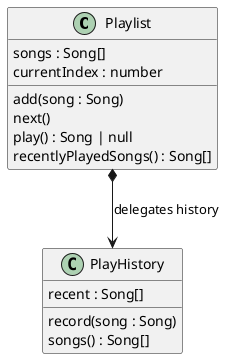

# Decomposing Systems into Cohesive Classes

[Chapter 10](./01_abstraction) established the _class_ as the unit of abstraction. A class bundles state that must respect an invariant with the operations that maintain that invariant, and gives the rest of the program a named type it can depend on. This lets us reason about one kind of thing at a time.

Classes let us build abstractions, but not every class is a good abstraction. We still have to decide what classes we need, what state each maintains, and what operations each provides. Making these decisions is called **decomposition**: breaking a problem into smaller pieces with well-defined roles. In object-oriented programming, we decompose a problem by deciding where one class ends and another begins.

Classes only improve a design when each one makes sense on its own. A class that maintains several unrelated invariants is no longer a single thing someone can reason about. Deciding what state and operations belong together in a class is a question of **cohesion**, and cohesion is how we judge the quality of a decomposition and tell a good split from a bad one.

## How Classes Lose Cohesion

Classes rarely start out doing too much. They gain responsibilities one reasonable change at a time. Our `Playlist` from the previous chapter maintained a single invariant: the current index is always a valid position in the song list. Suppose we now add a feature that remembers recently played songs:

> As a listener, I want my music app to remember what I have recently played, so that I can return to a song without searching for it again.

The easiest path is to add this feature to the `Playlist` class we already have:

<CollapsibleCode>

```typescript
class Playlist {

    songs: Song[] = [];
    currentIndex: number = -1;
    recentlyPlayed: Song[] = [];   // a second responsibility, bolted on

    // navigation: maintains the current-index invariant
    add(song: Song): void { /* ... */ }
    remove(song: Song): void { /* ... */ }
    next(): void { /* ... */ }
    current(): Song | null { /* ... */ }

    /** Plays the current song and records it as recently played. */
    play(): Song | null {
        const song = this.current();
        if (song !== null) {
            // history bookkeeping, tangled into the playlist
            const i = this.recentlyPlayed.indexOf(song);
            if (i !== -1) {
                this.recentlyPlayed.splice(i, 1);
            }
            this.recentlyPlayed.unshift(song);
        }
        return song;
    }

    recentlyPlayedSongs(): Song[] {
        return this.recentlyPlayed;
    }
}
```

</CollapsibleCode>

This change doesn't add much code, but the class now maintains two unrelated invariants. The original navigation invariant says the current index is valid, and a new history invariant says the recently played list holds each song at most once, most recent first. The two invariants have nothing to do with each other, yet they now live in one class. `play()` involves both: it observes the navigation state through `current()` and maintains the history state directly. To understand or safely change either invariant, an engineer now has to consider the other.

Left unchecked, a class that keeps absorbing responsibilities becomes a **god class**, one type that knows about and does everything. Each addition seemed reasonable on its own, but the result is a class with many fields and methods serving several invariants. This happens because adding one more method to an existing class is easier than creating a new class and keeping each class cohesive.

A god class is hard to maintain, because there is no single invariant to reason about, so any change risks disturbing something unrelated. It is also hard to _use_, a cost that is easy to overlook. Clients use a class by finding the one that models what they care about and calling the methods that provide that behaviour, which depends on each class having a clear, single purpose. When unrelated functionality is combined in one class, an engineer cannot predict where a feature lives. In a god class it could be anywhere, and the engineer is left scrolling through a long list of unrelated methods hoping to recognise the right one.

Cohesion makes features findable. When every class is organised around a single invariant, we can reason about where a capability should live and look there first, and the class name confirms whether we have found the right place. A system of many small, cohesive classes is easier to navigate than one of a few large ones, even though it has more parts, because each part makes clear what it is responsible for.

<details class="tooltip deep-dive">
  <summary>A <code>Playlist</code> that has grown into a god class</summary>

After a few releases, `Playlist` has gained features for history, ratings, shuffling, and sharing, in addition to its original navigation responsibility:

<CollapsibleCode>

```typescript
class Playlist {

    // navigation
    add(song: Song): void { /* ... */ }
    remove(song: Song): void { /* ... */ }
    next(): void { /* ... */ }
    current(): Song | null { /* ... */ }

    // play history
    play(): Song | null { /* ... */ }
    recentlyPlayedSongs(): Song[] { /* ... */ }

    // ratings
    rate(song: Song, stars: number): void { /* ... */ }
    averageRating(): number { /* ... */ }

    // shuffle
    shuffle(): void { /* ... */ }
    restoreOrder(): void { /* ... */ }

    // sharing
    exportAsText(): string { /* ... */ }
    shareWith(userId: string): void { /* ... */ }
}
```

</CollapsibleCode>

Consider where you would look in this class to change how recently played songs are tracked, to adjust how ratings are averaged, or to export the playlist. Nothing about the class points you anywhere, because it is responsible for all of it. Each comment marks a group of members that serves a different invariant, and each group belongs in its own class.

</details>

## Single Responsibility

At the class level, the **Single Responsibility Principle** means one class, one invariant. A _cohesive_ class enforces exactly one invariant, and every field and method exists to establish, preserve, or observe it. Such a class can be understood from its invariant alone and changed without reaching into the rest of the system, which are both properties of a good decomposition.

Some classes are not built around an explicit invariant. A class that only represents a value, such as a date, or a stateless helper that only groups calculations like the `meanTemp` function from [Chapter 5](../part1/05_arrays), holds no invariant, but is cohesive around a single concept or operation instead. The principle is the same: one purpose per class.

Cohesion shapes how a system responds to change. When each invariant lives in exactly one class, a bug fix or a new feature for that invariant stays inside the class that owns it. The change stays local, which makes it easier to make and less likely to force matching changes in many other places.

There is rarely a single good decomposition. The same system can usually be split in several reasonable ways, and competent engineers will sometimes disagree about which is best. Cohesion does not give us the one _right_ split, but it does give us a reliable way to recognise _poor_ ones.

<details class="tooltip deep-dive">
  <summary>When one class legitimately manages several invariants</summary>

The Single Responsibility Principle reads as one invariant per class, but a more practical statement is one _cluster of related invariants_ per class.

Counting invariants alone is unreliable, because invariants can combine. When several invariants constrain the _same_ state and must hold together, they form a single consistency boundary and belong in one class. An `Order` whose total must equal the sum of its line items, and which may not ship before payment, is an example.

That is still cohesion, where the unit is the smallest set of state that must stay consistent together. Navigation and play history, by contrast, share no state, which is why they separate cleanly later in this chapter.

</details>

## Diagnosing a Class

A poorly decomposed class shows it in the code: it enforces more than one invariant, it has fields the invariant never mentions, it has methods that maintain some other invariant, or its name does not match the fields and methods it contains. A simple test finds most of these. First, name the invariant the class claims to protect. Then take its parts one at a time, the fields first and then the methods, and ask of each whether it serves that invariant.

Every field should take part in the invariant the class protects. A field the invariant refers to belongs in the class. A field the invariant never mentions usually means a second responsibility has crept in. The common exception is a field that holds the object's identity, such as a name or id, which names the thing the invariant is about rather than taking part in it.

For a class that only represents a value, or a stateless helper, we can apply the same test using _the single concept_ the class represents, rather than an invariant. A field that has nothing to do with that concept may signal a poor decomposition.

The Single Responsibility Principle applies at the method level too: one method, one operation on the invariant. Every method should help maintain the class invariant, and nothing else. A method that maintains a different invariant is the method-level version of the same cohesion problem, and it has the same fix: that invariant, and the method with it, belongs in another class.

<details class="tooltip exercise">
  <summary>Diagnosing the bloated <code>Playlist</code></summary>

For the play-history version of `Playlist` from the start of this chapter, take the navigation invariant (_"the current index is a valid position"_) and check each field and method against it.

<details class="tooltip deep-dive"><summary>Solution</summary>

- `songs` and `currentIndex`: named in the invariant, so they belong to navigation.
- `recentlyPlayed`: never mentioned by the navigation invariant.
- `add`, `remove`, `next`, and `current`: maintain or observe navigation.
- `play`: observes navigation through `current()`, but also maintains the history.
- `recentlyPlayedSongs`: observes the history, not navigation.

Everything that does not mention the current index is the play-history material. It is a second complete responsibility with its own invariant, and it should become its own class.
</details>

</details>

## Designing a Decomposition

The previous section diagnosed an existing class. It is just as useful to work top-down, from a problem to a set of classes, the way the [Part 1](../part1/index) modelling chapter moved from a problem to a data definition. One common way to do this is to:

1. Identify the invariants the system must maintain.
2. For each invariant, identify the state it constrains.
3. Give each invariant its own class, owning the state and the operations on it.
4. Where one responsibility needs another, have one class hold the other and delegate to it.
5. Name each class for its single responsibility. If it is hard to find a name, the split may be poor.

Applied to the music app, step 1 finds two invariants: the current position is valid, and the recently played list is deduplicated and ordered. Step 2 assigns the songs and the index to the first, and the recent list to the second. Step 3 gives us two classes, `Playlist` and `PlayHistory`. Step 5, naming, is discussed next, and the rest of the chapter covers step 4.

Naming is part of design. A cohesive class is easy to name because it does one thing, and its name is what an engineer reads when deciding where a feature should live. A god class has no such name. A class that is hard to name usually does too much, and a vague name helps no one find their way around it.

## Decomposing the Playlist

Applying that process to the bloated `Playlist`, we move the play-history material into a `PlayHistory` class that owns the history invariant, and leave `Playlist` responsible only for navigation.

<CollapsibleCode>

```typescript
// Owns one invariant: a song appears at most once, most-recently-played first.
class PlayHistory {

    recent: Song[] = [];

    /** Records that a song was played, moving it to the front. */
    record(song: Song): void {
        const i = this.recent.indexOf(song);
        if (i !== -1) {
            this.recent.splice(i, 1);
        }
        this.recent.unshift(song);
    }

    songs(): Song[] {
        return this.recent;
    }
}
```

</CollapsibleCode>

`Playlist` no longer implements history. Instead it _holds_ a `PlayHistory` and asks it to do the recording:

<CollapsibleCode>

```typescript
class Playlist {

    songs: Song[] = [];
    currentIndex: number = -1;
    playHistory: PlayHistory = new PlayHistory();   // a collaborator

    // navigation methods (add, remove, next, current) unchanged

    play(): Song | null {
        const song = this.current();
        if (song !== null) {
            this.playHistory.record(song);   // delegate to the collaborator
        }
        return song;
    }

    recentlyPlayedSongs(): Song[] {
        return this.playHistory.songs();
    }
}
```

</CollapsibleCode>

Each class can now be understood from a single invariant. `PlayHistory` can change how it orders or deduplicates songs without `Playlist` knowing, and `Playlist` owns the navigation invariant alone. `play` now does two things: get the current song, and tell the history it was played.

Cohesion also helps with testing. Because `PlayHistory` owns its invariant and holds its own state, it can be tested on its own, without constructing a `Playlist`: record a few songs and check that the result is deduplicated and ordered. `Playlist` can likewise be tested against the navigation invariant alone. When the two were combined in one class, no test could exercise one invariant without involving the other. [Chapter 10](./01_abstraction#testing-classes) covers how to write these tests.

## Composition and Delegation

The relationship between `Playlist` and `PlayHistory` has a name. When one object holds a reference to another, it is called **composition**: a `Playlist` _has a_ `PlayHistory`. When the holding object passes work to the held one rather than doing it itself, it is called **delegation**. `play` does not implement the deduplication and ordering rule. It _delegates_ that to `playHistory.record`.

As a diagram, the two classes and the direction of delegation look like this:


<!-- caption="Playlist composes a PlayHistory and delegates the recording work to it." -->

Composition and delegation let a system of cohesive classes do more than any single class can. Decomposition splits a responsibility out, and composition combines the pieces into a working whole without merging their invariants. Each class keeps its own state, and larger behaviour comes from objects holding and calling one another. Most useful objects are composed of smaller ones they delegate to.

The direction of composition follows need. `Playlist` holds `PlayHistory` because `Playlist` needs to delegate the recording work, and `PlayHistory` needs nothing from `Playlist`. The class that needs a capability holds the class that provides it, so the field declaration shows where the dependency lies. Reversing it, by giving `PlayHistory` a reference back to `Playlist`, would tie the two classes together in both directions and make each harder to understand and test on its own.

<details class="tooltip deep-dive">
  <summary>Does the <code>playHistory</code> field break field cohesion?</summary>

The navigation invariant does not mention `playHistory`, so at first the field looks like the problem we just removed. The difference is _ownership_. `playHistory` is not state that the navigation invariant constrains. It is a collaborator that `Playlist` holds so it can delegate a responsibility it no longer maintains itself. A field that holds a collaborator is part of how the class does its job, not a second invariant hidden inside it. The test still works: ask whether the field is governed by the class's own invariant. The songs and index are, the history collaborator is not, and `Playlist` never touches its internals.

</details>

## Judgment Calls

The `Playlist` and `PlayHistory` split is clear-cut, because the two invariants share no state. Most real decisions are less obvious. Here is one that requires judgment.

> As an author, I want to publish an article with tags and reader comments, so that readers can find it and respond to it.

An `Article` holds its title and body, a set of tags, and a list of reader comments. Reading the requirements for invariants, we find three candidates: the article's own content, a tag rule (no duplicate tags), and a comment rule (comments are kept in the order they were posted, each with an author).

The comments are an easy decision. Keeping comments ordered, attributing each to an author, and later supporting editing or moderation is a complete responsibility with its own invariant and room to grow. It belongs in its own `CommentThread` class that the `Article` holds and delegates to, as `Playlist` holds `PlayHistory`.

Where the tags should live is less clear. "No duplicate tags" is a one-line rule over a single `string[]`. One engineer extracts a `TagSet` class for it, and another keeps `tags: string[]` as a field on `Article` and enforces the rule in an `addTag` method. Both are reasonable, and the deciding question is how much the tag rules are likely to grow. If tags will only ever be a deduplicated set of strings, a separate class adds an abstraction without adding clarity, and keeping the rule inline is better. If tags will gain rules of their own, such as a maximum count or a fixed vocabulary, those rules belong in their own `TagSet` class.

Decomposition involves this kind of balance. Splitting is the fix for a class that owns more than one invariant, but it has a cost: every new class is another name to learn and another unit of code to manage. Extracting a class for a rule that will never grow beyond one line fragments the design without making it clearer.

#### A Cohesive Decomposition

A cohesive decomposition gives every invariant exactly one home. Each class can be understood from its own invariant, tested against it, and changed in isolation, so a fix or a feature stays local. Because each class is named for its single responsibility, an engineer can find the class they need. Composition and delegation then combine these small classes into a working system, each still owning its own state and rule. As a result, a design can grow from one class to many while each class stays small enough to reason about and easy to find.

Giving each invariant a single home settles which class is _responsible_ for it, but it does not yet let that class _defend_ it. Every class we have written keeps its state in fields that any code holding the object can read and write, so the class that owns an invariant is not the only code able to break it. The next chapter closes that gap by hiding a class's representation, so that other parts of the system cannot violate the invariant it owns.

<details class="tooltip exercise">
  <summary>Exercise: Finding the Classes</summary>

Work through a decomposition for a problem you have not seen before:

> As a member of a group chat, I want to send messages to a conversation, see who has read each message, and mute conversations that are too noisy, so that I can keep up with the group on my own terms.

1. Apply the process from [Designing a Decomposition](#designing-a-decomposition): list the invariants this system must maintain, then identify the state each one constrains.
2. Propose at least two different decompositions into classes. For each, name the classes and state the single invariant each one owns.
3. Identify which splits are clear-cut, where the invariants share no state, and which are judgment calls, where a rule is small enough that keeping it inline is also reasonable.
4. Make one judgment call and argue it both ways: when would you extract a separate class, and when would you keep the rule inline?

As a starting point, a message has an author, text, and a time. A conversation keeps its messages in order. Read receipts record how far each member has read. A mute setting belongs to a member rather than to the conversation. Whether each of these becomes its own class is the decision this exercise is about.

</details>
