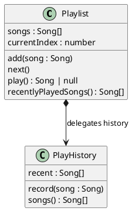

# Decomposing Systems into Cohesive Classes


[Chapter 10](./01_abstraction) established the _class_ as the unit of abstraction. A class bundles state that must respect an invariant with the operations that maintain that invariant, and gives the rest of the program a named type it can depend on. This lets us reason about one kind of thing at a time.

Classes let us build abstractions, but not every class is a good abstraction. We still have to decide what classes we need, what state each maintains, and what operations each provides. Making these decisions is called **decomposition**: breaking a problem into smaller pieces with well-defined roles. In object-oriented programming, we decompose a problem by deciding where one class ends and another begins.

Classes only improve a design when each one makes sense on its own. A class that maintains several unrelated invariants is no longer a single thing someone can reason about. Deciding what state and operations belong together in a class is a question of **cohesion**, and cohesion is how we judge the quality of a decomposition and tell a good split from a bad one.

## How Classes Lose Cohesion


Classes rarely _start out_ doing too much. Rather, they _gain_ responsibilities one reasonable change at a time. Our `Playlist` from the previous chapter contained a single invariant: the current index is always a valid position in the song list. Suppose we now add a new feature, remembering recently played songs:

> As a listener, I want my music app to remember what I have recently played, so that I can return to a song without searching for it again.

The easiest path is to add this feature to the `Playlist` class we already have:

<CollapsibleCode>

```typescript
class Playlist {

    songs: Song[] = [];
    currentIndex: number = -1;
    recentlyPlayed: Song[] = [];   // a second responsibility, bolted on

    // navigation: maintains the current-index invariant
    add(song: Song): void { /* ... */ }
    remove(song: Song): void { /* ... */ }
    next(): void { /* ... */ }
    current(): Song | null { /* ... */ }

    /** Plays the current song and records it as recently played. */
    play(): Song | null {
        const song = this.current();
        if (song !== null) {
            // history bookkeeping, tangled into the playlist
            const i = this.recentlyPlayed.indexOf(song);
            if (i !== -1) {
                this.recentlyPlayed.splice(i, 1);
            }
            this.recentlyPlayed.unshift(song);
        }
        return song;
    }

    recentlyPlayedSongs(): Song[] {
        return this.recentlyPlayed;
    }
}
```

</CollapsibleCode>


This change doesn't add much code. But, the class now maintains two unrelated invariants: 
1. the original navigation invariant over the validity of the current index; and 
2. a new history invariant (the recently played list holds each song at most once, most-recently-played first). 

The two invariants nothing to do with each other, yet they now live in one class. Because of this, `play()` now has to handle both invariants: it observes the navigation state through `current()` and maintains the history state directly. To understand or safely change either invariant, an engineer now has to consider the other one.

Left unchecked, a class that keeps absorbing responsibilities becomes a **god class**, one type that knows about and does everything. Each addition seemed reasonable on its own, but the result is a class with many fields and methods serving several invariants. This happens because adding one more method to an existing class is easier than creating a new class and keeping each class cohesive.


A god class is hard to maintain: there is no one invariant to reason about, so any change risks disturbing something unrelated. It is also hard to _use_. 

This usage cost is easy to overlook. Clients use a class by finding the one that models what they care about, and calling the methods that provide that behaviour. Effective reuse depends on a class having a clear, single purpose. When disparate functionality is included in one class with no organising invariant, an engineer cannot predict where a feature lives. In a god class, it could be anywhere! The engineer is left scrolling a long list of unrelated methods, hoping to recognise the right one.

It is easier to find features in a system with cohesive classes. When every class is organised around a single invariant, we can easily reason about where a capability should live and look there first. The name of the class confirms whether we have found that right place. A system of many small, cohesive classes is easier to navigate than one of a few large ones---even though it has more parts. 

<details class="tooltip deep-dive">
  <summary>A <code>Playlist</code> that has grown into a god class</summary>

After a few releases, `Playlist` has gained features for history, ratings, shuffling, and sharing, in addition to its original navigation responsibility:

<CollapsibleCode>

```typescript
class Playlist {

    // navigation
    add(song: Song): void { /* ... */ }
    remove(song: Song): void { /* ... */ }
    next(): void { /* ... */ }
    current(): Song | null { /* ... */ }

    // play history
    play(): Song | null { /* ... */ }
    recentlyPlayedSongs(): Song[] { /* ... */ }

    // ratings
    rate(song: Song, stars: number): void { /* ... */ }
    averageRating(): number { /* ... */ }

    // shuffle
    shuffle(): void { /* ... */ }
    restoreOrder(): void { /* ... */ }

    // sharing
    exportAsText(): string { /* ... */ }
    shareWith(userId: string): void { /* ... */ }
}
```

</CollapsibleCode>

Consider where you would look in this class to change how recently played songs are tracked, to adjust how ratings are averaged, or to export the playlist. You may have to look everywhere! 

Even the need to add comments to delineate groups of related members (rather than it being obvious from the code organization) suggests that the design has bloated into a god class. 

</details>

## Single Responsibility

At the class level, the **Single Responsibility Principle** means one class, one invariant. A _cohesive_ class enforces exactly one invariant, and every field and method exists to establish, preserve, or observe it. We can understand such a class from its invariant alone, and we can change such a class without reaching into the rest of the system. These are both properties of a good decomposition.

Some classes are not built around an explicit invariant. Both a class that only represent data (but no operations on it), and a stateless class that groups calculations like the `meanTemp` function from [Chapter 5](../part1/05_arrays), hold no invariant. But they can be cohesive around a single concept or operation instead. The principle is the same: one purpose per class.

Cohesion shapes how a system responds to change. When each invariant lives in exactly one class, a bug fix or a new feature for that invariant stays inside the class that owns it. The change stays local, which makes it easier to make and less likely to force matching changes in many other places.

There is rarely a single good decomposition. The same system can usually be split in several reasonable ways, and competent engineers will sometimes disagree about which is best. Cohesion does not give us the one _right_ split, but it does give us a reliable way to recognise _poor_ ones.

<details class="tooltip deep-dive">
  <summary>When one class legitimately manages several invariants</summary>

The Single Responsibility Principle reads as one invariant per class, but a more practical statement is one _cluster of related invariants_ per class.

Counting invariants alone is unreliable, because invariants can combine. When several invariants constrain the _same_ state and must hold together, they form a single consistency boundary and belong in one class. An `Order` whose total must equal the sum of its line items, and which may not ship before payment, is an example.

That is still cohesion, where the unit is the smallest set of state that must stay consistent together. Navigation and play history, by contrast, share no state, which is why they separate cleanly later in this chapter.

</details>

## Diagnosing a Class

A poorly decomposed class is spottable from its code: it enforces more than one invariant, it has fields the invariant never mentions, it has methods that maintain some other invariant, or its name does not match the fields and methods it contains. 


How do we spot these symptoms of poor decomposition? First, try to name the invariant the class claims to protect. Then, look at each part of the class (fields and methods), and analyze whether each of those parts serves the invariant. If a field is not used in the class invariant at all, this is an early symptom that a second responsibility has snuck into the class. (One common exception: a field that holds the object's identity, such as a name or id.)


For a class that only represents a value, or a stateless helper, we can apply the same analysis, but using _the single concept_ the class represents, rather than the invariant. A field that has nothing to do with that concept may signal a poor decomposition.

The Single Responsibility Principle applies at the method level too. Each method should correspond to *one* operation on the invariant. A method that maintains a different invariant is the method-level version of the cohesion problem. It likely means that that method does not belong in this class.

<details class="tooltip exercise">
  <summary>Diagnosing the bloated <code>Playlist</code></summary>

For the play-history version of `Playlist` from the start of this chapter, take the navigation invariant (_"the current index is a valid position"_) and check each field and method against it.

<details class="tooltip deep-dive"><summary>Solution</summary>

- `songs` and `currentIndex`: named in the invariant, so they belong to navigation.
- `recentlyPlayed`: never mentioned by the navigation invariant.
- `add`, `remove`, `next`, and `current`: maintain or observe navigation.
- `play`: observes navigation through `current()`, but also maintains the history.
- `recentlyPlayedSongs`: observes the history, not navigation.

Everything that does not mention the current index is the play-history material. It is a second complete responsibility with its own invariant, and it should become its own class.
</details>

</details>


## Decomposing the Playlist

To decompose the bloated `Playlist`, we move the play-history material into a `PlayHistory` class that owns the history invariant, and leave `Playlist` responsible only for navigation.

<CollapsibleCode>

```typescript
// Owns one invariant: a song appears at most once, most-recently-played first.
class PlayHistory {

    recent: Song[] = [];

    /** Records that a song was played, moving it to the front. */
    record(song: Song): void {
        const i = this.recent.indexOf(song);
        if (i !== -1) {
            this.recent.splice(i, 1);
        }
        this.recent.unshift(song);
    }

    songs(): Song[] {
        return this.recent;
    }
}
```

</CollapsibleCode>

`Playlist` no longer implements history. Instead it _holds_ a `PlayHistory` and asks it to do the recording:

<CollapsibleCode>

```typescript
class Playlist {

    songs: Song[] = [];
    currentIndex: number = -1;
    playHistory: PlayHistory = new PlayHistory();   // a collaborator

    // navigation methods (add, remove, next, current) unchanged

    play(): Song | null {
        const song = this.current();
        if (song !== null) {
            this.playHistory.record(song);   // delegate to the collaborator
        }
        return song;
    }

    recentlyPlayedSongs(): Song[] {
        return this.playHistory.songs();
    }
}
```

</CollapsibleCode>

 `play` still does two things: get the current song, and tell the history it was played. But, by, pushing the history logic into its own class, we can easily change how `PlayHistory` orders or deduplicates songs without changing `Playlist`'. You can compare this code to the first version of `Playlist` in the chapter; do you find this new version more readable?
 
This split also makes our testing easier to do. Recall [Chapter 10](./01_abstraction#testing-classes) covers how to write tests for classes. Because `PlayHistory` owns its invariant and holds its own state, we can test it on its own. Likewise, we can  now test `Playlist` for only the navigation invariant. When the two were combined in one class, no test could exercise one invariant without involving the other. 

## Composition and Delegation

**Composition** is when one class (or rather, an object instance of the class) holds a reference to another. For instance, a `Playlist` _has a_ `PlayHistory`. **Delegation** is when the holding object passes work to the held one rather than doing it itself. For instance, in the most recent version of `Playlist`, `play` _delegates_ deduplication and ordering to `playHistory.record`.


Visually, we can represent the two classes and the direction of delegation as follows:


```plantuml
@startuml

hide empty members
skinparam groupInheritance 2

class Playlist {
  songs : Song[]
  currentIndex : number
  add(song : Song)
  next()
  play() : Song | null
  recentlyPlayedSongs() : Song[]
}

class PlayHistory {
  recent : Song[]
  record(song : Song)
  songs() : Song[]
}

Playlist *--> PlayHistory : delegates history

@enduml
```
<!-- caption="Playlist composes a PlayHistory and delegates the recording work to it." -->


The direction of composition comes from need. `Playlist` holds `PlayHistory` because `Playlist` needs to delegate the recording work. `PlayHistory`, on the other hand, needs nothing from `Playlist`. The class that needs a capability holds the class (as a field) that provides it. 

Decomposition splits a responsibility out, and composition combines the pieces into a working whole---without merging their invariants. 

<details class="tooltip deep-dive">
  <summary>Does the <code>playHistory</code> field break field cohesion?</summary>

The navigation invariant does not mention `playHistory`... so doesn't this violate our test for cohesion? The difference is _ownership_. 

While `playHistory` is a field, it is not _state_ that the navigation invariant constrains. It is a _collaborator_ . `Playlist` has it as a field so itcan delegate a responsibility. A field that holds a collaborator is part of how the class does its job, not a second invariant hidden inside it. The test still works: ask whether the field is governed by the class's own invariant. The songs and index are, the history collaborator is not, and `Playlist` never touches its internals.

</details>

## Designing a Decomposition

We've been talking about analyzing existing code, because most of the time, when you interact with code, you'll be interacting with an existin code base.
But what about if we are designing a system for the first time? We can use the same principles we've been discussion to try to design a "good" decomposition as follows:

1. Identify the invariants the system must maintain.
2. For each invariant, identify the state it constrains.
3. Give each invariant its own class, owning the state and the operations on it.
4. Name each class for its single responsibility. (If it is hard to find a name, the split may be poor. A cohesive class is easy to name because it does one thing. A class that is hard to name usually does too much. We may be tempted in that case to use a vague name (e.g. "MusicOrganizer"), but this is not helpful for maintenance. )
5. Where one responsibility needs another, have one class hold the other and delegate to it.


If we were defining our music example from ground up, we would get to the split we've been discussing as follows:

1. We have two invariants: the current position being valid, and the recently played list is deduplicated and ordered.
2. The first invariant constrains the list of songs and the index in that list. The second invariant constraints the list of recent songs.
3. As we have two invariants, we should have two classes...
4. ... `Playlist` and `PlayHistory`.
5. `Playlist` needs to send information to `PlayHistory`, but not the other way around. So, `Playlist` should have `PlayHistory` as a collaborator and delegate to it.  


## Judgment Calls

The `Playlist` and `PlayHistory` split is clear-cut, because the two invariants share no state. Most real decisions are less obvious. For instance:

> As an author, I want to publish an article with tags and reader comments, so that readers can find it and respond to it.

An `Article` has a title, body, a set of tags, and a list of reader comments. Reading the requirements for invariants, we find three candidate invariants: (1) the article's own content, (2) a tag rule (no duplicate tags), and (3) a comment rule (comments are kept in the order they were posted, each with an author).

The comments are an easy decision. Keeping comments ordered, attributing each to an author, and later supporting editing or moderation is a complete responsibility with its own invariant and room to grow. It belongs in its own `CommentThread` class. The `Article` can hold and delegate to this class, as `Playlist` holds `PlayHistory`.

Where the tags should live is less clear. "No duplicate tags" is a one-line rule over a single `string[]`. One engineer might extract a `TagSet` class for it. Another engineer might keep `tags: string[]` as a field on `Article` and enforce the rule in an `addTag` method. Both choices are reasonable. Which is best depends on how much the tag rules are likely to grow:
-  If tags will only ever be a deduplicated set of strings, a separate class adds an abstraction without adding clarity, and keeping the rule inline is better. 
-  If tags will gain rules of their own, such as a maximum count or a fixed vocabulary, those rules belong in their own `TagSet` class.


Splitting a class into multiple classes that each own an invariant improves cohesion, but it has a cost: every new class is another name to learn and another unit of code to manage. Extracting a class for a rule that will never grow beyond one line may fragment the design without making it clearer. 

Software design involves balancing these relative costs, so, out-of-context, it is hard to say which design is "the best".


#### A Cohesive Decomposition

A cohesive decomposition gives every invariant exactly one home. We can understand each class based on its one invariant; test the class against it; and change the class in isolation from other concerns.  Because each class is named for its single responsibility, an engineer can find the class they need. 

Then, we can use composition and delegation to combine these small classes into a working system, while still keeping each class responsible for its own state and rulese. As a result, a design can grow from one class to many while each class stays small enough to reason about and easy to find.

Giving each invariant a single home settles which class is _responsible_ for it, but it does not yet let that class _defend_ it. Every class we have written keeps its state in fields: but so far, any code holding the object can read and write those fields. So, while the class owns the invariant, other code can break it. In [Chapter 12](./03_encapsulation.html), we'll resolve this problem by learning new language features that allow us to hide those fields from other parts of the code base.

<details class="tooltip exercise">
  <summary>Exercise: Finding the Classes</summary>

Work through a decomposition for a problem you have not seen before:

> As a member of a group chat, I want to send messages to a conversation, see who has read each message, and mute conversations that are too noisy, so that I can keep up with the group on my own terms.

1. Apply the process from [Designing a Decomposition](#designing-a-decomposition): list the invariants this system must maintain, then identify the state each one constrains.
2. Propose at least two different decompositions into classes. For each, name the classes and state the single invariant each one owns.
3. Identify which splits are clear-cut, where the invariants share no state, and which are judgment calls, where a rule is small enough that keeping it inline is also reasonable.
4. Make one judgment call and argue it both ways: when would you extract a separate class, and when would you keep the rule inline?

As a starting point, <span class="hint">a message has an author, text, and a time</span>. <span class="hint">A conversation keeps its messages in order</span>. <span class="hint">Read receipts record how far each member has read</span>. <span class="hint">A mute setting belongs to a member rather than to the conversation</span>. The exercise is about deciding whether each of these becomes its own class.

</details>
