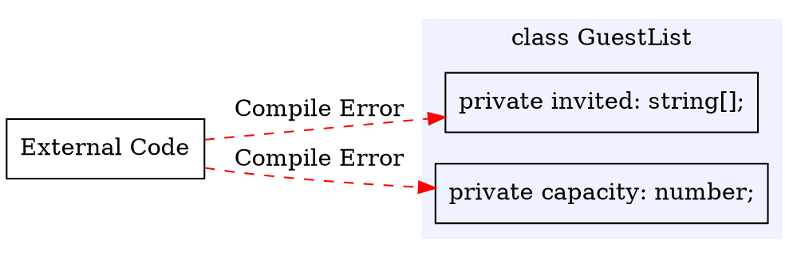
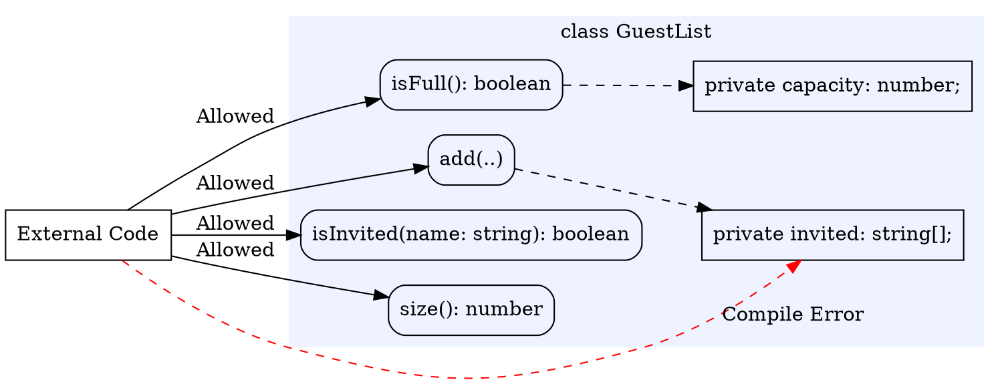

# Encapsulating What Varies

Much of Part 1 was concerned with invariants: the properties a value must satisfy to be meaningful and the preconditions and postconditions that make up a function's contract (an approach sometimes called **design by contract**). Those approaches describe and detect invariant violations, but cannot prevent them. A documented invariant is a promise, and the rest of the program is free to break it: the object `{ renewalsRemaining: -1 }` satisfies the `Loan` type and simultaneously violates the `Loan` invariant, and the compiler will not object. Classes provide a mechanism for starting to close this gap through the constructor, which provides a single, controlled path for building an object. But a constructor only controls how an object begins. If a class's fields are accessible to anywhere else in a program, any code holding the object can read and write to them directly, and the invariant the constructor established can be undone. A careful constructor is not enough on its own.

**Encapsulation** closes the gap by hiding a class's representation so that the invariant cannot be broken by external code. The data becomes accessible only to the class's own methods, which are designed to maintain the invariant. This is **information hiding**, and TypeScript's access modifiers make it more than a polite request: where Part 1 could only write a comment asking other code to leave a field alone, now the compiler can enforce it. This chapter covers the mechanism (`private`, `public`, and `readonly`), the process of deciding what to hide, and how this improves the design of the overall system.

#### A Guest List That Must Stay Valid

We will work with one running example throughout this chapter.

> As an event organiser, I want a guest list that never holds the same guest twice and never exceeds the venue's capacity, so that check-in stays accurate and the room stays within its limit.

The list has two invariants: no guest appears more than once, and the number of guests never exceeds the capacity. Using the mechanisms we have already learned, this would look like:

```typescript
class GuestList {
    capacity: number;
    invited: string[]; // ids of invited guests

    constructor(capacity: number) {
        this.capacity = capacity;
        this.invited = [];
    }
}
```

The constructor starts an empty list, which satisfies both invariants. But the code does not continually enforce them. Any reference to a `GuestList` can write to the fields directly:

```typescript
const list = new GuestList(2);
list.invited.push("alice");
list.invited.push("alice"); // a duplicate; the first invariant is broken
list.invited.push("bob");
list.invited.push("carol"); // three guests in a list of capacity two
list.capacity = -1;         // and now the capacity is meaningless
```

Every line type-checks. A comment such as `// invariant: no duplicates, at most capacity` records the rule, exactly as in Part 1, but a comment cannot prevent the offending lines above from being written. And an invariant that can be so easily violated is not an invariant at all, since no caller could depend on it being true.

## Hiding the Representation

The fix is to make the fields unreachable from outside the class. A field marked `private` can be read and written only from within the class body:

```typescript
class GuestList {
    private capacity: number;
    private invited: string[];

    constructor(capacity: number) {
        this.capacity = capacity;
        this.invited = [];
    }
}
```

With that one change, the lines that broke the invariant no longer compile:

```typescript
const list = new GuestList(2);
list.invited.push("alice"); // compile error: 'invited' is private
list.capacity = -1;         // compile error: 'capacity' is private
```

The representation is now encapsulated within `GuestList`. The only code that can touch `invited` and `capacity` is the code we write inside `GuestList`, which means we are responsible for keeping the invariants true, and know they cannot be broken by external code. Information hiding has become a boundary the compiler checks rather than a convention we hope callers respect.

External code is prohibited by the compiler from accessing the private fields:


<!-- caption: "External code may call the public methods but not reach the private fields." -->

<details class="tooltip ts-tips">
<summary><code>public</code>, <code>private</code>, and <code>readonly</code></summary>

Both fields _and_ methods can be marked with a visibility modifier:

- `public` is the default: the member is accessible everywhere. Methods that callers are meant to use are public.
- `private` restricts the member to the class body. Hide the representation by marking fields `private`.
- `readonly` allows a field to be assigned only where it is declared or in the constructor, never afterwards. A `GuestList`'s capacity is fixed once the list exists, so it should be `private readonly`:

```typescript
private readonly capacity: number;
```

`readonly` and `private` provide different constraints: `private` controls *who* can touch a field, `readonly` controls *when* it can change. A field can be both.

</details>

<details class="tooltip deep-dive">
<summary><code>private</code> Is Checked at Compile Time</summary>

TypeScript's `private` is enforced by the compiler and then erased: it is a rule about your source code, not a lock that exists while the program runs. JavaScript has a separate feature, fields whose names begin with `#`, that stay private at runtime as well. This course uses TypeScript's `private` throughout; you do not need `#` names. The practical point is the same either way: code outside the class is not permitted to reach the representation.

</details>

## Establishing and Preserving the Invariant

Because the representation is private, the constructor is the only way to bring a `GuestList` into existence, which makes it the natural place to establish the invariant, and, as the error handling chapter showed, to throw when the input cannot be turned into a valid object. The version above still accepts invalid input: `new GuestList(-1)` produces a list whose capacity can never be met. The constructor should reject input it cannot turn into a valid object:

<CollapsibleCode>

```typescript
/**
 * A guest list for an event with a fixed capacity.
 *
 * Class invariant: holds no duplicate guests, and never more than
 * `capacity` of them.
 */
class GuestList {
    private readonly capacity: number;
    private invited: string[];

    /**
     * Creates an empty guest list with the given capacity.
     *
     * @param {number} capacity the most guests the list may hold
     * @throws {Error} "capacity must be at least 1" when capacity is too small
     */
    constructor(capacity: number) {
        if (capacity < 1) {
            throw new Error("capacity must be at least 1");
        }
        this.capacity = capacity;
        this.invited = [];
    }
}
```

</CollapsibleCode>

A validating constructor guarantees the object *starts* valid. Keeping it valid as it changes is the job of the methods, and it is a rule with no exceptions: every method that touches the representation must leave the invariant true. Adding a guest is the case that puts both invariants at risk:

```typescript
/**
 * Invites a guest. Inviting a guest who is already on the list does nothing.
 *
 * Precondition: the list is not full (see isFull).
 *
 * @param {string} guestId the guest to invite
 */
add(guestId: string): void {
    if (this.isInvited(guestId)) {
        return; // already invited; the list is unchanged
    }
    assert(this.isFull() === false, "cannot add a guest to a full list");
    this.invited.push(guestId);
}
```

The duplicate invariant is protected by the early return: inviting someone already present changes nothing. The capacity invariant is protected by the `assert`: the method's contract places the responsibility for checking space on the caller, who is expected to call `isFull` first, so reaching `add` on a full list is a programmer error, and we halt on it. The supporting methods are small, and each reports on the state without exposing it:

```typescript
isInvited(guestId: string): boolean {
    return this.invited.includes(guestId);
}

isFull(): boolean {
    return this.invited.length >= this.capacity;
}

size(): number {
    return this.invited.length;
}
```

This captures the essence of encapsulation. In Part 1 an invariant was documented and checked after the fact. Here, the constructor establishes it and every method preserves it, while the private representation guarantees that no other path exists. The invariant has gone from a property we *hoped held* to one that *always holds*.



<!-- caption="External code may call the public methods." -->

<details class="tooltip link-110">
<summary>Invariants in CPSC 110</summary>

The structures you built with `define-struct` in CPSC 110 were immutable: once made, their fields never changed, so no later code could mutate one into an invalid state. But nothing checked an invariant when a structure was built, and nothing hid its fields, so a caller could still construct a structure that violated the interpretation written in its data definition. Keeping structures valid was a matter of discipline, of always building them through your own helper functions. Encapsulation makes that discipline something the language enforces: a validating constructor for how objects begin, and a hidden representation for how they change.

</details>

### When References Escape

A caller often needs to *see* the guests, to print them at the door or count them by hand. An accessor that hands the list back looks harmless:

```typescript
guests(): string[] {
    return this.invited; // returns the internal array itself
}
```

This compiles, and `private` is still on the field, yet the invariant is no safer than before. The method returns the very array the object stores, so a caller now holds a reference straight into the private representation:

```typescript
const list = new GuestList(2);
list.add("alice");
const everyone = list.guests();
everyone.push("alice"); // a duplicate, written directly into the list's state
everyone.push("bob");
everyone.push("carol"); // and now over capacity
```

No method of `GuestList` was called to break the invariant, and no `private` rule was violated; the array _escaped_. `private` prevented external code from directly accessing the `invited` field, the `guests()` method exposed the field to callers. The fix is to hand back a copy:

```typescript
guests(): string[] {
    return this.invited.slice(); // a copy; mutating it cannot affect the list
}
```

The array returned by `guests()` is now a separate array from the field within `GuestList`. Returning a copy of internal data rather than the data itself is called **defensive copying**. Forgetting to make defensive copies is one of the most common ways to violate encapsulation, because the unsafe version looks correct and passes every test that does not specifically try to mutate the result.

<details class="tooltip deep-dive">
<summary>Copies and Shared References</summary>

A variable holding an array or object does not hold the data; it holds a reference to data that lives elsewhere. Assigning or returning that variable copies the reference, not the data, so two names end up pointing at the same array, and a change through one is visible through the other. `slice()` (for arrays) builds a new array, which is why returning `this.invited.slice()` is safe.

There is a depth limit worth knowing. `slice()` makes a **shallow copy**: a new array whose elements are the same references as the original's. For an array of strings that is completely safe, because strings cannot be mutated. For an array of objects it is not: the copy is a new array, but its elements are the same objects, so a caller could still reach through and mutate one of them. When the elements are themselves mutable, you need either a deeper copy or elements that cannot be changed, which is the subject of the next section.


</details>

## Changing the Representation

Maintaining the duplicate invariant by hand, an `includes` check in `add` and a rebuild in any removal, is work the standard library can do for us. A `Set` holds each value at most once by construction. Because the representation is private, we can switch to it without any caller being able to observe the difference:

<CollapsibleCode>

```typescript
/**
 * A guest list for an event with a fixed capacity.
 *
 * Class invariant: holds no duplicate guests, and never more than
 * `capacity` of them.
 */
class GuestList {
    private readonly capacity: number;
    private invited: Set<string>;

    constructor(capacity: number) {
        if (capacity < 1) {
            throw new Error("capacity must be at least 1");
        }
        this.capacity = capacity;
        this.invited = new Set<string>();
    }

    isInvited(guestId: string): boolean {
        return this.invited.has(guestId);
    }

    isFull(): boolean {
        return this.invited.size >= this.capacity;
    }

    size(): number {
        return this.invited.size;
    }

    add(guestId: string): void {
        if (this.isInvited(guestId)) {
            return;
        }
        assert(this.isFull() === false, "cannot add a guest to a full list");
        this.invited.add(guestId);
    }

    remove(guestId: string): void {
        this.invited.delete(guestId);
    }

    guests(): string[] {
        return Array.from(this.invited); // still a fresh array, still a copy
    }
}
```

</CollapsibleCode>

Every public method has the same name, the same parameters, and the same return type as before. Code written against the array version keeps working without a single change, because from the outside there *is* no change: the public shape is identical. We replaced the internal data structure and rewrote the method bodies, and all of it stayed inside the boundary that `private` creates. This freedom is the deeper reason to hide a representation. Callers depend on what a `GuestList` does, never on how it stores its guests, so how it stores its guests is ours to change. In addition, the `Set` makes the duplicate invariant *structural*: the representation is now incapable of holding a duplicate at all, rather than relying on `add` to check.

<details class="tooltip deep-dive">
<summary>Built-in Encapsulated Types</summary>

The `Set` we used is itself an encapsulated type: you use it through methods like `add`, `has`, `delete`, and `size`, never touching how it stores its elements. The standard collections are worth knowing precisely because they are the representations you will most often hide inside your own classes, and they are examples of an internal choice you can change without leaking.

- **Array.** An `Array` holds a linear sequence of elements. You have written arrays with the syntactic sugar `string[]`. They can also be constructed explicitly with `new Array<string>()`, which produces the same kind of value as `[]` typed as `string[]`. An array keeps its elements in insertion order and allows access by position, but testing whether it contains a value scans the whole sequence, and it can hold duplicates.
- **Set.** A `Set` holds each value at most once. Build one with `new Set<string>()`; adding a value it already contains does nothing. There is no literal shorthand, so a `Set` must be created with `new`. A set tests membership and enforces uniqueness quickly, which is why we used it above, but it offers no access by position: you can ask whether a value is present, never for the element at a given index.
- **Map.** A `Map` associates keys with values, for example `new Map<string, number>()` to count tickets per guest. Its core methods are `set`, `get`, `has`, and `delete`, and it reports its entry count through `.size`. Like `Set`, it has no literal form and requires `new`. A map looks a value up by its key quickly and accepts keys of any type, but it carries more overhead than a plain array or object and is the wrong choice when you need only an ordered list or a set of bare values.

A plain object can also serve as a key-to-value table, what is often called a dictionary. Using an _index signature_, the type `{ [guestId: string]: number }` reads as "any string key maps to a number":

```typescript
const tickets: { [guestId: string]: number } = {};
tickets["alice"] = 2;
```

A plain-object dictionary and a `Map` overlap, but differ in ways that decide between them. A plain object's keys are always strings; a `Map`'s keys may be of any type. A `Map` iterates its entries in the order they were inserted, and can report its. Use a `Map` when you need keys that are not strings, a reliable iteration order, or a running size; use a dictionary for a small, fixed-shape, string-keyed record.

</details>

## Mutability and Immutability

`GuestList` is a **mutable object**: `add` and `remove` change it in place. It is worth separating two guarantees that are easily confused, because they guard against different risks:

- `const list = new GuestList(2)` stops the *binding* `list` from being pointed at a different object. It does nothing to stop `list.add("alice")` from changing the object `list` already refers to.
- `private readonly capacity` stops the *field* from being reassigned after construction.

An **immutable object** carries the second idea to its conclusion: none of its fields ever change, and methods that would modify it instead return a new object. An immutable guest list would establish its invariant once, at construction, and never have any later state to corrupt, so it would be valid for its whole life with no per-method effort. The cost is that every change allocates a new object. A mutable object is more economical and is often the natural choice for a guest list that is edited over time, but it accepts the obligation that *every* method preserve the invariant. Immutability buys safety by removing change; encapsulation buys safety by controlling it.

A minimal immutable guest list shows the pattern:

```typescript
class ImmutableGuestList {
    private readonly guests: string[];

    constructor(guests: string[] = []) {
        this.guests = guests.slice();
    }

    add(guest: string): ImmutableGuestList {
        return new ImmutableGuestList(this.guests.concat([guest]));
    }

    includes(guest: string): boolean {
        return this.guests.includes(guest);
    }
}
```

`add(..)` returns a new list rather than altering the receiver. The invariant is established once, in the constructor, and cannot be violated thereafter: there is no in-place `add(..)` to misuse and no fields to reassign.

<details class="tooltip ts-tips">
<summary>Default Parameter Values</summary>

`constructor(guests: string[] = [])` uses a **default parameter value**: when the caller omits `guests`, TypeScript substitutes the default `[]` automatically. Any parameter can have a default, written as `parameter: Type = expression`, and the default is used only when the caller passes nothing (or `undefined`) for that argument. Default parameters must come after all required parameters in a method's signature.

</details>

## Choosing What to Expose

Information hiding is not only about marking fields `private`; it is about keeping the public side of a class small and behavioural. Every public member is a promise to callers, so the fewer and the more stable they are, the more freedom the class keeps for itself. Three habits help:

- _Expose behaviour, not data._ `add`, `remove`, `isInvited`, and `size` say what a guest list *does*. We never exposed `invited`, so the data is reachable only in the controlled ways those methods allow.
- _Hide likely change._ The choice between an array and a `Set` was precisely such a decision, and hiding it is what made the change painless. Anything you expose, you may later have to keep working.
- _Minimal public exposure._ Add a public method when a caller needs the behaviour, not in anticipation of one that might.

<details class="tooltip ts-tips">
<summary>Accessors with <code>get</code></summary>

TypeScript can make a method callable as though it were a field, using a `get` accessor:

```typescript
get count(): number {
    return this.invited.size;
}
```

A caller writes `list.count`, with no parentheses, but the body still runs, so it can return a computed or read-only view without exposing a field. There is a matching `set` accessor for assignment. Accessors are a convenience for presenting derived values; they are not a way around encapsulation, since a `get` with no `set` is read-only by design.

</details>

## Testing Encapsulated Code

Because callers reach a `GuestList` only through its public methods, so do its tests. A test constructs an object, drives it with method calls, and asserts on what it can observe:

<CollapsibleCode>

```typescript
test("inviting the same guest twice invites them once", () => {
    const list = new GuestList(3);
    list.add("alice");
    list.add("alice");
    expect(list.size()).to.equal(1);
    expect(list.isInvited("alice")).to.be.true;
});

test("a capacity below one is rejected", () => {
    expect(() => new GuestList(0)).to.throw("capacity must be at least 1");
});

test("the array from guests() cannot change the list", () => {
    const list = new GuestList(3);
    list.add("alice");
    list.guests().push("bob"); // mutate the returned array
    expect(list.size()).to.equal(1); // the list itself is untouched
});
```

</CollapsibleCode>

This is black-box testing by construction: with the representation hidden, there is nothing left to test but behaviour. It also reveals a design pressure worth naming. An object is testable exactly to the extent that its important behaviour is observable through its public surface. If a `GuestList` could fall into an invalid state but offered no way to observe its contents, no test could catch the fault. Designing for testability means giving callers, and therefore tests, enough public behaviour to confirm the invariant holds, without exposing the representation that would let them break it. The third test above is only possible because `guests()` and `size()` together let us observe that the escape attempt failed.

Encapsulation and testing are often in tension. Encapsulation hides the representation; a test wants to confirm that the representation is being maintained correctly. A test cannot read a `private` field to check the invariant, and most of the time that is exactly right: you confirm behaviour through the public methods, as we did when testing `GuestList`. Occasionally, though, the public surface is too minimal to test against effectively, which will require some design changes to overcome.

A test needs two things of the object under test. **Controllability** is the ability to configure an object into the state a test wants to examine: can the test construct the object and call the methods needed to reach that state? **Observability** is the ability to see enough of the outcome to judge whether it was successful: can the test read back what it needs to tell success from failure? Encapsulation can weaken both. If the only way to reach an interesting state is a long and awkward sequence of calls, the object is hard to control; if a method changes internal state but exposes nothing about it, the object is hard to observe.

When a test cannot control or observe what it needs, the fix is almost always a change to the design, not to blindly break the encapsulation. Small, behavioural additions to the public surface are usually effective: an observation method that reports a meaningful, derived fact about the state, or a constructor that builds the object directly in a useful starting configuration. `size()` and `isInvited()` already play this role for `GuestList`; they are what made the duplicate-invariant test possible without exposing `invited`. The constraint is that these additions expose behaviour through _derived facts_, never the raw representation. A getter that simply returned the private array would restore observability and destroy encapsulation at the same time, handing back the very reference the class works to protect.

So testability is not at odds with encapsulation when the two are designed together. A class that is hard to test is often telling you something useful: either it maintains an invariant with no observable consequence, which is worth questioning, or its public surface has a genuine gap that real callers will feel too. Designing for controllability and observability, through a minimal behavioural interface rather than exposed fields, is part of encapsulation done well.

<details class="tooltip deep-dive">
  <summary>Evolving a Design for Testability</summary>

Consider a throttle that locks an account for thirty seconds after three failed sign-in attempts:

```typescript
class LoginThrottle {
    private failures = 0;
    private lockedUntil = 0; // a timestamp; 0 means not locked

    /** Records a failed attempt, locking the account after the third. */
    recordFailure(): void {
        this.failures = this.failures + 1;
        if (this.failures >= 3) {
            this.lockedUntil = Date.now() + 30000;
        }
    }

    /** Throws when the account is currently locked. */
    checkAccess(): void {
        if (Date.now() < this.lockedUntil) {
            throw new Error("account locked");
        }
    }
}
```

The invariant is sound and the representation is properly hidden, yet the class is hard to test on both fronts.

It is hard to **control**, because the lock duration is measured against `Date.now()`, read from inside the class. A test can drive it to the locked state easily enough, with three calls to `recordFailure`, but a test for _the lock expiring_ would have to wait thirty real seconds. The time source is baked in, so a test cannot move the clock.

It is hard to **observe**, because nothing reports the throttle's state. A test can learn whether the account is locked only by calling `checkAccess` and catching its throw, and it cannot see the failure count at all, so it cannot confirm that a count below three leaves the account open.

Three small changes fix this without weakening encapsulation. First, for controllability, take the current time as a parameter rather than reading it from a global clock:

```typescript
recordFailure(now: number): void {
    this.failures = this.failures + 1;
    if (this.failures >= 3) {
        this.lockedUntil = now + 30000;
    }
}

checkAccess(now: number): void {
    if (now < this.lockedUntil) {
        throw new Error("account locked");
    }
}
```

A test can now supply any time it likes, locking the account at time `1000` and confirming the lock has lifted at time `31000`, with no real waiting. Then, for observability, add two methods that report derived facts:

```typescript
isLocked(now: number): boolean {
    return now < this.lockedUntil;
}

failureCount(): number {
    return this.failures;
}
```

A test can now assert the lock state directly instead of probing it with a `try`/`catch`, and can check the failure count after a sequence of attempts. Crucially, neither method exposes the representation: `isLocked` returns a boolean computed from the time, not the raw `lockedUntil` timestamp, and `failureCount` returns a number, not a window into how the class stores its state. The throttle became controllable and observable, and a later change to how it tracks the lock would still be invisible to every caller.

</details>

## Designing for Encapsulation

This chapter's example followed a process you can reuse when designing any class:

1. _Name the invariant_, and choose a `private` representation that can express it.
2. _Establish the invariant in the constructor_, rejecting input it cannot satisfy.
3. _Expose a small set of methods_ that each preserve the invariant, returning copies so the representation cannot escape.

This results in an object that can only be constructed in a valid state, stays valid through use, and cannot leak the internals that would let someone else violate the invariant.

This design discipline has many benefits. Because nothing outside the class can break its invariant, you can confirm that invariant by reading a single class. Because callers depend only on the public methods, the representation is free to change, as the move from an `Array` to a `Set` showed, and internal changes stay internal. That stable surface also lets a team build against a class while its internals are still being worked out, as long as the public methods maintain their signatures. And because far less code can put the object into a bad state, there are far fewer places for bugs to hide. Encapsulation is the point where the invariants of Part 1 stop being promises and become guarantees.

The next chapter asks how to take the next step by extracting a class's public surface into a named type of its own, so that the entire class behind the contract can change without impacting any callers.

<details class="tooltip exercise">
  <summary>Exercise: Encapsulating a Leaderboard</summary>

Here is a first draft of a leaderboard for a game. It tracks the best score each player has achieved.

```typescript
type Entry = { player: string; score: number };

class Leaderboard {
    entries: Entry[];

    constructor() {
        this.entries = [];
    }

    record(entry: Entry): void { /* record a player's score */ }
    topScores(): Entry[] { /* the entries, highest score first */ }
    scoreFor(player: string): number { /* the player's best score, or 0 */ }
}
```

The class works, but its encapsulation is weak. Reason about it along three dimensions:

1. _Visibility._ Which members should be `private`, and what can external code currently do to `entries` that it should not be able to?
2. _Return types._ `topScores` returns `Entry[]`. What could a caller do with that value to corrupt the leaderboard, and how would you prevent it? Separately, what does exposing the `Entry` type commit you to that a more behavioural return type would not?
3. _Parameter types._ `record` accepts a whole `Entry`. How does taking that shape tie callers to the way the leaderboard stores its data, and what parameters would avoid the coupling?

Then think about the next version of the leaderboard. Suppose you later store the data as a `Map<string, number>` from player to best score, or keep only the top ten entries. Which of the interface choices above would force callers to change when you switch, and which would let the change stay entirely inside the class? Revise the class so that such a change could be made without any caller noticing.

</details>
