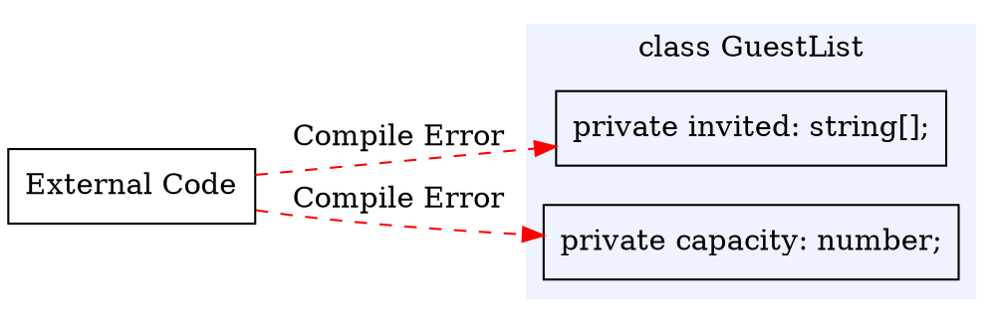
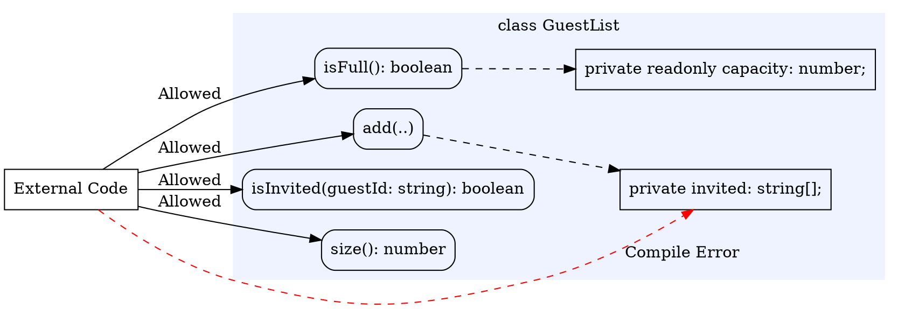

# Encapsulating What Varies

Much of [Part 1](../part1/index) was concerned with invariants: the properties a value must satisfy to be meaningful, and the preconditions and postconditions that make up a function's contract (an approach sometimes called **design by contract**). These describe and detect invariant violations, but cannot prevent them. A documented invariant is a promise that the rest of the program is free to break. The object `{ renewalsRemaining: -1 }` satisfies the `Loan` type but violates the `Loan` invariant, and the compiler will not object.

Classes begin to close this gap through the constructor, a single, controlled path for building an object. But a constructor only controls how an object begins. If a class's fields are accessible from elsewhere in a program, any code holding the object can read and write them directly, and undo the invariant the constructor established.

**Encapsulation** closes the gap by hiding a class's representation, so that external code cannot break the invariant. The data becomes accessible only to the class's own methods, which are designed to maintain it. This is **information hiding**, and TypeScript's access modifiers let the compiler enforce it, where in [Part 1](../part1/index) we could only write a comment asking other code to leave a field alone. This chapter covers the mechanism (`private`, `public`, and `readonly`), how to decide what to hide, and how hiding improves the design of the overall system.

#### A Guest List That Must Stay Valid

We will work with one running example throughout this chapter.

> As an event organiser, I want a guest list that never holds the same guest twice and never exceeds the venue's capacity, so that check-in stays accurate and the room stays within its limit.

The list has two invariants: no guest appears more than once, and the number of guests never exceeds the capacity. With the mechanisms we already have, it looks like this:

```typescript
class GuestList {
    capacity: number;
    invited: string[]; // ids of invited guests

    constructor(capacity: number) {
        this.capacity = capacity;
        this.invited = [];
    }
}
```

The constructor starts with an empty list, which satisfies both invariants, but nothing enforces them afterwards. Any code with a reference to a `GuestList` can write to the fields directly:

```typescript
const list = new GuestList(2);
list.invited.push("alice");
list.invited.push("alice"); // a duplicate; the first invariant is broken
list.invited.push("bob");
list.invited.push("carol"); // three guests in a list of capacity two
list.capacity = -1;         // and now the capacity is meaningless
```

Every line type-checks. A comment such as `// invariant: no duplicates, at most capacity` records the rule, as in [Part 1](../part1/index), but cannot prevent the lines above from being written. An invariant that can be violated this easily gives callers nothing to depend on.

## Hiding the Representation

The fix is to make the fields unreachable from outside the class. A field marked `private` can be read and written only from within the class body:

```typescript
class GuestList {
    private capacity: number;
    private invited: string[];

    constructor(capacity: number) {
        this.capacity = capacity;
        this.invited = [];
    }
}
```

With that one change, the lines that broke the invariant no longer compile:

```typescript
const list = new GuestList(2);
list.invited.push("alice"); // compile error: 'invited' is private
list.capacity = -1;         // compile error: 'capacity' is private
```

The representation is now encapsulated within `GuestList`. The only code that can touch `invited` and `capacity` is the code inside `GuestList`, so we are responsible for keeping the invariants true, and we know external code cannot break them. Information hiding is now a boundary the compiler checks rather than a convention we hope callers respect.

The compiler prevents external code from accessing the private fields:


<!-- caption="External code cannot reach the private fields." -->

<details class="tooltip ts-tips">
<summary><code>public</code>, <code>private</code>, and <code>readonly</code></summary>

Both fields _and_ methods can be marked with a visibility modifier:

- `public` is the default, and means the member is accessible everywhere. Methods that callers are meant to use are public.
- `private` restricts the member to the class body. Hide the representation by marking fields `private`.
- `readonly` allows a field to be assigned only where it is declared or in the constructor, never afterwards. A `GuestList`'s capacity is fixed once the list exists, so it should be `private readonly`:

```typescript
private readonly capacity: number;
```

`readonly` and `private` are different constraints. `private` controls _who_ can touch a field, and `readonly` controls _when_ it can change. A field can be both.

</details>

<details class="tooltip deep-dive">
<summary><code>private</code> Is Checked at Compile Time</summary>

TypeScript's `private` is enforced by the compiler and then erased, so it is a rule about your source code, not a lock that exists while the program runs. JavaScript has a separate feature, fields whose names begin with `#`, that stay private at runtime as well. This course uses TypeScript's `private` throughout, and you do not need `#` names. Either way, code outside the class cannot reach the representation.

</details>

## Maintaining the Invariant

Because the representation is private, the constructor is the only way to create a `GuestList`, which makes it the natural place to establish the invariant and, as the error handling chapter showed, to throw when the input cannot be turned into a valid object. The version above still accepts invalid input: `new GuestList(-1)` produces a list whose capacity can never be met. The constructor should reject it:

<CollapsibleCode>

```typescript
/**
 * A guest list for an event with a fixed capacity.
 *
 * Class invariant: holds no duplicate guests, and never more than
 * `capacity` of them.
 */
class GuestList {
    private readonly capacity: number;
    private invited: string[];

    /**
     * Creates an empty guest list with the given capacity.
     *
     * @param {number} capacity the most guests the list may hold
     * @throws {Error} "capacity must be at least 1" when capacity is too small
     */
    constructor(capacity: number) {
        if (capacity < 1) {
            throw new Error("capacity must be at least 1");
        }
        this.capacity = capacity;
        this.invited = [];
    }
}
```

</CollapsibleCode>

A validating constructor guarantees the object _starts_ valid. Keeping it valid as it changes is the job of the methods, and there are no exceptions: every method that touches the representation must leave the invariant true. Adding a guest puts both invariants at risk:

```typescript
/**
 * Invites a guest. Inviting a guest who is already on the list does nothing.
 *
 * Precondition: the list is not full (see isFull).
 *
 * @param {string} guestId the guest to invite
 */
add(guestId: string): void {
    if (this.isInvited(guestId)) {
        return; // already invited; the list is unchanged
    }
    assert(this.isFull() === false, "cannot add a guest to a full list");
    this.invited.push(guestId);
}
```

The early return protects the duplicate invariant, because inviting someone already present changes nothing. The `assert` protects the capacity invariant. The method's contract makes the caller responsible for checking space by calling `isFull` first, so reaching `add` on a full list is a programmer error, and the method halts. The supporting methods are small, and each reports on the state without exposing it:

```typescript
isInvited(guestId: string): boolean {
    return this.invited.includes(guestId);
}

isFull(): boolean {
    return this.invited.length >= this.capacity;
}

size(): number {
    return this.invited.length;
}
```

In [Chapter 3](../part1/03_checking-invariants), an invariant was documented and then checked by tests. Here, the constructor establishes it, every method preserves it, and the private representation means no other code can change the state, so the invariant always holds.


<!-- caption="External code may call the public methods." -->

<details class="tooltip link-110">
<summary>Invariants in CPSC 110</summary>

The structures you built with `define-struct` in CPSC 110 were immutable. Once made, their fields never changed, so no later code could mutate one into an invalid state. But nothing checked an invariant when a structure was built, and nothing hid its fields, so a caller could still construct a structure that violated the interpretation in its data definition. Keeping structures valid was a matter of discipline, of always building them through your own helper functions. Encapsulation lets the language enforce that discipline, with a validating constructor for how objects begin and a hidden representation for how they change.

</details>

### When References Escape

A caller often needs to _see_ the guests, to print them at the door or count them. An accessor that returns the list looks harmless:

```typescript
guests(): string[] {
    return this.invited; // returns the internal array itself
}
```

This compiles, and `private` is still on the field, yet the invariant is no safer than before. The method returns the same array the object stores, so a caller now holds a reference into the private representation:

```typescript
const list = new GuestList(2);
list.add("alice");
const everyone = list.guests();
everyone.push("alice"); // a duplicate, written directly into the list's state
everyone.push("bob");
everyone.push("carol"); // and now over capacity
```

No method of `GuestList` was called to break the invariant, and no `private` rule was violated. The array _escaped_. `private` prevented external code from accessing the `invited` field directly, but `guests()` handed callers a reference to the same array. The fix is to return a copy:

```typescript
guests(): string[] {
    return this.invited.slice(); // a copy; mutating it cannot affect the list
}
```

The array returned by `guests()` is now separate from the field inside `GuestList`. Returning a copy of internal data rather than the data itself is called **defensive copying**. Forgetting to make defensive copies is one of the most common ways to break encapsulation, because the unsafe version looks correct and passes every test that does not specifically try to mutate the result.

<details class="tooltip deep-dive">
<summary>Copies and Shared References</summary>

As [Chapter 6](../part1/06_state-mutation#copies-and-references) described, returning an array returns a reference to it, not a copy of its data. `slice()` builds a new array, which is why returning `this.invited.slice()` is safe.

Copies have a depth limit. `slice()` makes a **shallow copy**, a new array whose elements are the same references as the original's. For an array of strings that is safe, because strings cannot be mutated. For an array of objects it is not. The copy is a new array, but its elements are the same objects, so a caller could still reach through and mutate one of them.

A **deep copy** duplicates the structure all the way down: a new array whose elements are themselves new copies, and so on through any objects those elements contain, so that the copy shares nothing with the original. Nothing a caller does to a deep copy is visible through the original, which is the guarantee a shallow copy does not provide. The cost is that the time and memory a deep copy needs grow with the size of the whole structure, not just the length of the outer array. A deep copy is also not always well defined: copying a structure that refers back to itself would never finish without special handling.

Both kinds have a standard form. For an array, `slice()` makes the shallow copy, and the built-in `structuredClone` makes the deep one:

```typescript
const original = [{ id: "alice", seat: 1 }];

const shallow = original.slice();
const deep = structuredClone(original);

shallow[0].seat = 99; // original[0].seat is now 99 too
deep[0].seat = 42;    // original is unaffected
```

For a plain object rather than an array, `Object.assign({}, original)` makes the shallow copy, and `structuredClone` makes the deep copy.

`structuredClone` tracks what it has already visited, so it copies the self-referencing case above correctly. It copies data, not behaviour. It refuses to clone a function, and an object built from a class comes back as a plain object with the same fields but none of its methods.

When the elements are themselves mutable, you need either a deep copy or elements that cannot be changed. The next chapter covers the second option.

</details>

## Changing Representations

Maintaining the duplicate invariant by hand, with an `includes` check in `add` and a rebuild in any removal, is work the standard library can do for us. A `Set` holds each value at most once by construction. Because the representation is private, we can switch to it without any caller being able to tell:

<CollapsibleCode>

```typescript
/**
 * A guest list for an event with a fixed capacity.
 *
 * Class invariant: holds no duplicate guests, and never more than
 * `capacity` of them.
 */
class GuestList {
    private readonly capacity: number;
    private invited: Set<string>;

    constructor(capacity: number) {
        if (capacity < 1) {
            throw new Error("capacity must be at least 1");
        }
        this.capacity = capacity;
        this.invited = new Set<string>();
    }

    isInvited(guestId: string): boolean {
        return this.invited.has(guestId);
    }

    isFull(): boolean {
        return this.invited.size >= this.capacity;
    }

    size(): number {
        return this.invited.size;
    }

    add(guestId: string): void {
        if (this.isInvited(guestId)) {
            return;
        }
        assert(this.isFull() === false, "cannot add a guest to a full list");
        this.invited.add(guestId);
    }

    remove(guestId: string): void {
        this.invited.delete(guestId);
    }

    guests(): string[] {
        return Array.from(this.invited); // still a fresh array, still a copy
    }
}
```

</CollapsibleCode>

Every public method from the array version has the same name, parameters, and return type as before, and `remove` is now a single call to `delete`. Code written against the array version keeps working without a single change, because from the outside nothing has changed. We replaced the internal data structure and rewrote the method bodies, all inside the boundary that `private` creates. The `Set` also makes the duplicate invariant _structural_. The representation cannot hold a duplicate at all. `add` still returns early for a guest who is already invited, but now only so that inviting that guest again to a full list is not treated as an error.

<details class="tooltip deep-dive">
<summary>Built-in Encapsulated Types</summary>

The `Set` we used is itself an encapsulated type. You use it through methods like `add`, `has`, `delete`, and `size`, without seeing how it stores its elements. Two built-in collections are the representations you will most often hide inside your own classes:

- `Set`. A `Set` holds each value at most once. Build one with `new Set<string>()`, since there is no literal shorthand. Adding a value it already contains does nothing. A set checks membership quickly, but it has no access by position.
- `Map`. A `Map` associates keys with values, for example `new Map<string, number>()` to count tickets per guest. Its core methods are `set`, `get`, `has`, and `delete`, and `.size` reports its number of entries. Its keys can be of any type, and it iterates its entries in the order they were inserted.

A plain object can also serve as a small table from string keys to values. Its type is written with an _index signature_: `{ [guestId: string]: number }` reads as "any string key maps to a number":

```typescript
const tickets: { [guestId: string]: number } = {};
tickets["alice"] = 2;
```

Use a `Map` instead when you need keys that are not strings, a reliable iteration order, or a running size. A plain object is the better fit for a small, fixed-shape, string-keyed record.

</details>

## Choosing What to Expose

Information hiding is not only about marking fields `private`. It is also about keeping the public side of a class small and focused on behaviour. Every public member is a promise to callers, so the fewer and more stable they are, the more freedom the class keeps to change. Three habits help:

- _Expose behaviour, not data._ `add`, `remove`, `isInvited`, and `size` say what a guest list _does_. We never exposed `invited`, so the data is reachable only in the controlled ways those methods allow.
- _Hide decisions that are likely to change._ The choice between an array and a `Set` was one, and hiding it is what made the change easy. Anything you expose, you may have to keep working later.
- _Keep the public surface minimal._ Add a public method when a caller needs the behaviour, not in anticipation of one that might.

<details class="tooltip ts-tips">
<summary>Accessors with <code>get</code></summary>

TypeScript can make a method callable as though it were a field, using a `get` accessor:

```typescript
get count(): number {
    return this.invited.size;
}
```

A caller writes `list.count`, with no parentheses, but the body still runs, so it can return a computed or read-only value without exposing a field. There is a matching `set` accessor for assignment. Accessors are a convenience for presenting derived values, not a way around encapsulation: a `get` with no `set` is read-only.

</details>

## Testing Encapsulated Code

Because callers reach a `GuestList` only through its public methods, so do its tests. A test constructs an object, drives it with method calls, and asserts on what it can observe:

<CollapsibleCode>

```typescript
test("inviting the same guest twice invites them once", () => {
    const list = new GuestList(3);
    list.add("alice");
    list.add("alice");
    expect(list.size()).to.equal(1);
    expect(list.isInvited("alice")).to.be.true;
});

test("a capacity below one is rejected", () => {
    expect(() => new GuestList(0)).to.throw("capacity must be at least 1");
});

test("the array from guests() cannot change the list", () => {
    const list = new GuestList(3);
    list.add("alice");
    list.guests().push("bob"); // mutate the returned array
    expect(list.size()).to.equal(1); // the list itself is untouched
});
```

</CollapsibleCode>

This is black-box testing by construction. With the representation hidden, all a test can check is behaviour. It also shows a design pressure. An object is testable only to the extent that its important behaviour is observable through its public methods. If a `GuestList` could fall into an invalid state but offered no way to observe its contents, no test could catch the fault. Designing for testability means giving callers, and therefore tests, enough public behaviour to confirm the invariant holds, without exposing the representation that would let them break it. The third test above is only possible because `guests()` and `size()` together let us observe that the escape attempt failed.

### Designing for Testability

Encapsulation and testing are often in tension. Encapsulation hides the representation, but a test wants to confirm that the representation is maintained correctly. A test cannot read a `private` field to check the invariant, and most of the time that is right: you check behaviour through the public methods, as we did for `GuestList`. Occasionally, though, the public methods are too limited to test effectively, and the design needs to change.

A test needs two things from the object under test. **Controllability** is the ability to put an object into the state a test wants to examine: can the test construct the object and call the methods needed to reach that state? **Observability** is the ability to see enough of the outcome to judge it: can the test read back what it needs to tell success from failure? Encapsulation can weaken both. If the only way to reach an interesting state is a long, awkward sequence of calls, the object is hard to control. If a method changes internal state but exposes nothing about it, the object is hard to observe.

When a test cannot control or observe what it needs, the fix is almost always a change to the design, not a break in encapsulation. Small, behavioural additions to the public methods usually work: an observation method that reports a meaningful, derived fact about the state, or a constructor that builds the object directly in a useful starting configuration. `size()` and `isInvited()` already do this for `GuestList`, and they are what made the duplicate-invariant test possible without exposing `invited`. The constraint is that these additions expose _derived facts_, never the raw representation. A getter that returned the private array would restore observability but destroy encapsulation, handing back the same reference the class works to protect.

Testability and encapsulation do not conflict when they are designed together. A class that is hard to test often points to a design problem. Either it maintains an invariant with no observable consequence, which is worth questioning, or its public methods have a real gap that callers will also run into. Designing for controllability and observability, through a small behavioural interface rather than exposed fields, is part of encapsulating well.

<details class="tooltip deep-dive">
  <summary>Evolving a Design for Testability</summary>

Consider a throttle that locks an account for thirty seconds after three failed sign-in attempts:

```typescript
class LoginThrottle {
    private failures = 0;
    private lockedUntil = 0; // a timestamp; 0 means not locked

    /** Records a failed attempt, locking the account after the third. */
    recordFailure(): void {
        this.failures = this.failures + 1;
        if (this.failures >= 3) {
            this.lockedUntil = Date.now() + 30000;
        }
    }

    /** Throws when the account is currently locked. */
    checkAccess(): void {
        if (Date.now() < this.lockedUntil) {
            throw new Error("account locked");
        }
    }
}
```

The invariant is sound and the representation is hidden, yet the class is hard to test in both ways.

It is hard to **control**, because the lock duration is measured against `Date.now()`, which is read inside the class. A test can drive it to the locked state with three calls to `recordFailure`, but a test for the lock _expiring_ would have to wait thirty real seconds. The time source is fixed, so a test cannot move the clock.

It is hard to **observe**, because nothing reports the throttle's state. A test can learn whether the account is locked only by calling `checkAccess` and catching its error, and it cannot see the failure count at all, so it can check whether the account is locked yet but not how many failures have been recorded.

Three small changes fix this without weakening encapsulation. First, for controllability, take the current time as a parameter rather than reading it from a global clock:

```typescript
recordFailure(now: number): void {
    this.failures = this.failures + 1;
    if (this.failures >= 3) {
        this.lockedUntil = now + 30000;
    }
}

checkAccess(now: number): void {
    if (now < this.lockedUntil) {
        throw new Error("account locked");
    }
}
```

A test can now supply any time it likes, locking the account at time `1000` and confirming the lock has lifted at time `31000`, with no real waiting. Then, for observability, add two methods that report derived facts:

```typescript
isLocked(now: number): boolean {
    return now < this.lockedUntil;
}

failureCount(): number {
    return this.failures;
}
```

A test can now check the lock state directly instead of probing it with a `try`/`catch`, and can check the failure count after a sequence of attempts. Neither method exposes the representation. `isLocked` returns a boolean computed from the time, not the raw `lockedUntil` timestamp, and `failureCount` returns a number, not the structure the class stores it in. The throttle is now controllable and observable, and a later change to how it tracks the lock would still be invisible to every caller.

</details>

#### Designing for Encapsulation

This chapter's example followed a process you can reuse for any class:

1. _Name the invariant_, and choose a `private` representation that can express it.
2. _Establish the invariant in the constructor_, rejecting input it cannot satisfy.
3. _Expose a small set of methods_ that each preserve the invariant, returning copies so the representation cannot escape.

The result is an object that can only be constructed in a valid state, stays valid through use, and does not leak the internals that would let someone else violate the invariant.

This has several benefits. Because nothing outside the class can break its invariant, you can confirm the invariant by reading a single class. Because callers depend only on the public methods, the representation is free to change, as the move from an `Array` to a `Set` showed, and internal changes stay internal. Stable public methods also let a team build against a class while its internals are still being written, as long as the method signatures stay the same. And because far less code can put the object into a bad state, there are far fewer places for bugs to hide. With encapsulation, the invariants of [Part 1](../part1/index) are no longer only documented but enforced.

The next chapter looks at that freedom to change more closely: what a safe change depends on, how a class can give the freedom away without noticing, and how far it extends beyond the representation.

<details class="tooltip exercise">
  <summary>Exercise: Encapsulating a Leaderboard</summary>

Here is a first draft of a leaderboard for a game. It tracks the best score each player has achieved.

```typescript
type Entry = { player: string; score: number };

class Leaderboard {
    entries: Entry[];

    constructor() {
        this.entries = [];
    }

    record(entry: Entry): void { /* record a player's score */ }
    topScores(): Entry[] { /* the entries, highest score first */ }
    scoreFor(player: string): number { /* the player's best score, or 0 */ }
}
```

The class works, but its encapsulation is weak. Consider it along three dimensions:

1. _Visibility._ Which members should be `private`, and what can external code currently do to `entries` that it should not be able to?
2. _Return types._ `topScores` returns `Entry[]`. What could a caller do with that value to corrupt the leaderboard, and how would you prevent it? Separately, what does exposing the `Entry` type commit you to that a more behavioural return type would not?
3. _Parameter types._ `record` accepts a whole `Entry`. How does taking that shape tie callers to the way the leaderboard stores its data, and what parameters would avoid the coupling?

Then think about the next version of the leaderboard. Suppose you later store the data as a `Map<string, number>` from player to best score, or keep only the top ten entries. Which of the interface choices above would force callers to change when you switch, and which would let the change stay entirely inside the class? Revise the class so that such a change could be made without any caller noticing.

</details>
