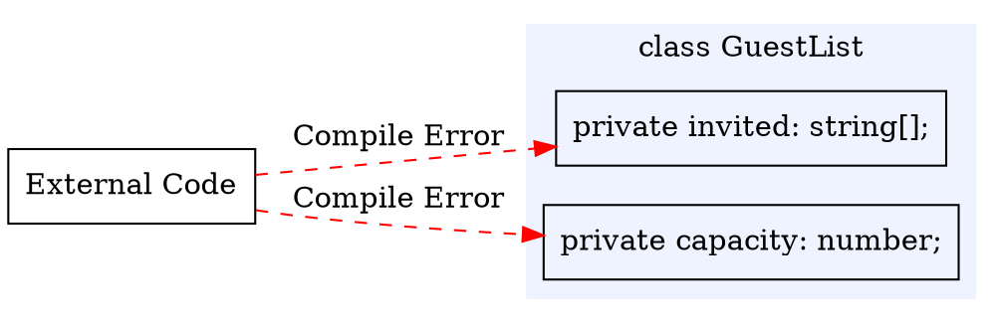
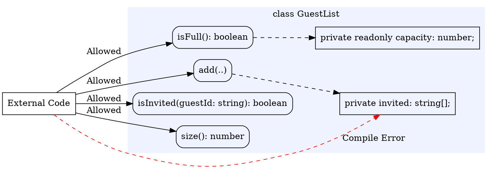

# Encapsulating What Varies

In [Part 1](../part1/index), we covered how to specify, check, and maintain invariants. Specifying them in documentation is easy enough, but gives us no guarantees that they will actually hold. We saw how to establish invariants with `makeX` functions. We saw how to maintain invariants, either with the use of `Result` types and `assert` to stop at invalid states, or using the closure design from [Chapter 4](../part1/04_maintaining-invariants.html) to hide state from outsiders altogether

Last chapter, we were introduced to the notion of the class. We've seen the _constructor_ of a class, which gives us language enforcement to ensure there is only _one_ way of creating data of that type. If we check invariants in the constructor, this gives us language support to _establish_ invariants. But what about maintaining them?

So far, a class's fields are accessible from elsewhere in a program.  This means any code holding the object can read and write them directly, and undo the invariant the constructor established. In [Part 1](../part1/index), we could only write a comment asking other code to leave a field alone.

In this chapter, we cover **encapsulation**: the process of hiding fields (and methods) of a class, so that external code cannot arbitrarily access the class's data and break invariants.  The hidden fields will be accessible only to the class's own methods. If we design those methods to maintain the invariant, we get true language support for invariant maintenance.  

We achieve encapsulation via TypeScript's access modifiers (`private`, `public`, and `readonly`)---these instruct the compiler to enforce **information hiding**. 
 This chapter covers the mechanisms of these modifiers, how to decide what to hide, and how hiding improves the design of the overall system.

#### A Guest List That Must Stay Valid

We will work with one running example throughout this chapter.

> As an event organiser, I want a guest list that never holds the same guest twice and never exceeds the venue's capacity, so that check-in stays accurate and the room stays within its limit.

The list has two invariants: no guest appears more than once, and the number of guests never exceeds the capacity. Let's look at the class with the mechanisms we have so far:

```typescript
class GuestList {
    capacity: number;
    invited: string[]; // ids of invited guests

    constructor(capacity: number) {
        this.capacity = capacity;
        this.invited = [];
    }
}
```

The constructor starts with an empty list, which satisfies both invariants, but nothing enforces them afterwards. A comment such as `// invariant: no duplicates, at most capacity` records the invariant, as in [Part 1](../part1/index), but cannot prevent the invariant from being violated. Any code with a reference to a `GuestList` can write to the fields directly:

```typescript
const list = new GuestList(2);
list.invited.push("alice");
list.invited.push("alice"); // a duplicate; the first invariant is broken
list.invited.push("bob");
list.invited.push("carol"); // three guests in a list of capacity two
list.capacity = -1;         // and now the capacity is meaningless
```

As-is, the class gives callers very little value in terms of invariant enforcement. it gives callers very little benefit. 


## Hiding the Representation

What we'd like to do here is make the fields unreachable from outside the class. A field marked `private` can be read and written only from within the class body:

```typescript
class GuestList {
    private capacity: number;
    private invited: string[];

    constructor(capacity: number) {
        this.capacity = capacity;
        this.invited = [];
    }
}
```

With that one change, the lines that broke the invariant no longer compile:

```typescript
const list = new GuestList(2);
list.invited.push("alice"); // compile error: 'invited' is private
list.capacity = -1;         // compile error: 'capacity' is private
```



```graphviz
digraph encapsulation {
  rankdir = LR;
  // node [fontname = "sans-serif", fontsize = 12];

  subgraph cluster_guestlist {
    label = "class GuestList";
    style = filled;
    color = "#eef3ff";
    invited  [shape = record, label = "private invited: string[];"];
    capacity [shape = record, label = "private capacity: number;"];
  }

  client [shape = box, label = "External Code"];
  client -> invited [label = "Compile Error", color = "red", style = dashed];
  client -> capacity [label = "Compile Error", color = "red", style = dashed];
}
```
<!-- caption="External code cannot reach the private fields." -->


The representation is now encapsulated within `GuestList`. The only code that can touch `invited` and `capacity` is the code inside `GuestList`. We now have _language enforcement_ to prevent external code from breaking our invariants. So, as long as `GuestList` keeps its invariants true, they will be maintained. 

<details class="tooltip ts-tips">
<summary><code>public</code>, <code>private</code>, and <code>readonly</code></summary>

Both fields _and_ methods can be marked with a visibility modifier:

- `public` is the default, and means the member is accessible everywhere. Methods that callers are meant to use are public. Because it is the default, `public` can be left out. But from here on, we will write it on every member that is not `private` for clarity. The course linter will enforce this as well.
- `private` restricts the member to the class body. Hide the representation by marking fields `private`.
- `readonly` allows a field to be assigned only where it is declared or in the constructor, never afterwards. A `GuestList`'s capacity is fixed once the list exists, so it should be `private readonly`:

```typescript
private readonly capacity: number;
```

`readonly` and `private` are different constraints. `private` controls _who_ can touch a field, and `readonly` controls _when_ it can change. A field can be both.

</details>

<details class="tooltip deep-dive">
<summary><code>private</code> Is Checked at Compile Time</summary>

TypeScript's `private` is enforced by the compiler and then erased during compilation. Most compilers output a low-level language, but TypesScript's compiler output JavaScript, which other programs can use directly.
The `private` modifier it only enforced in your source code, not for any JavaScript code that might use your outputted JavaScript. 


JavaScript has a separate feature for information hiding: fields whose names begin with `#`, stay private at runtime as well. This course uses TypeScript's `private` throughout, and you do not need `#` names. 

For the purposes of the course, you don't need to know either of these details. (This is one way in which this course is *not* a course teaching you the ins-and-outs of TypeScript) But, we want to point it out so that you can make an educated choice about what language you choose in the future. In particular, if you want to truly create a secure system in in the future, you may prefer a language that enforces private more strictly (Java, C++, Rust ...). 

</details>

## Maintaining the Invariant

Because the representation of the guest list (`invited`) is private, the constructor is the only way to create a `GuestList`. This makesit the natural place to establish the invariant and to _throw_ ([Chapter 8](../part1/08_errors.html)) when the input cannot be turned into a valid object. 

The `GuestList` with information hiding, above, still accepts invalid input: `new GuestList(-1)` produces a `GuestList` with invalid capacity. The constructor should reject it:

<CollapsibleCode>

```typescript
/**
 * A guest list for an event with a fixed capacity.
 *
 * Class invariant: holds no duplicate guests, and never more than
 * `capacity` of them.
 */
class GuestList {
    private readonly capacity: number;
    private invited: string[];

    /**
     * Creates an empty guest list with the given capacity.
     *
     * @param {number} capacity the most guests the list may hold
     * @throws {Error} "capacity must be at least 1" when capacity is too small
     */
    public constructor(capacity: number) {
        if (capacity < 1) {
            throw new Error("capacity must be at least 1");
        }
        this.capacity = capacity;
        this.invited = [];
    }
}
```

</CollapsibleCode>

A validating constructor guarantees the object _starts_ valid. Keeping it valid as it changes is the job of the methods. To guarantee the invariant holds, every method that touches the representation _must_ leave the invariant true. Adding a guest puts both invariants at risk, so we must be careful:

```typescript
// Note: this code should exist within the `GuestList` 
// class. `GuestList` class omitted for clarity.
/**
 * Invites a guest. Inviting a guest who is already on the list does nothing.
 *
 * Precondition: the list is not full (see isFull).
 *
 * @param {string} guestId the guest to invite
 */
public add(guestId: string): void {
    if (this.isInvited(guestId)) {
        return; // already invited; the list is unchanged
    }
    assert(this.isFull() === false, "cannot add a guest to a full list");
    this.invited.push(guestId);
}
```

The early return protects the duplicate invariant: now, inviting someone already present changes nothing. The `assert` protects the capacity invariant. The method's contract says  the caller  is responsible for checking space by calling `isFull` first. So we decide to treat reaching `add` on a full list as a programmer error, and halt the method with `assert`. `add` uses several helpers, which report on the state without exposing it:

```typescript
// Note: this code should exist within the `GuestList` 
// class. `GuestList` class omitted for clarity.

public isInvited(guestId: string): boolean {
    return this.invited.includes(guestId);
}

public isFull(): boolean {
    return this.invited.length >= this.capacity;
}

public size(): number {
    return this.invited.length;
}
```

The constructor establishes the invariant and every method preserves it---that's not new, we tried to do this with our functions in [Chapter 3](../part1/03_checking-invariants.html). But because the _representation_ of the data behind the invariant is now private, this establish-and-preserve pattern actually _ensures_ (beyond programmer discipline) that the invariant holds.


```graphviz
digraph encapsulation {
  rankdir = LR;
  // node [fontname = "sans-serif", fontsize = 12];

  subgraph cluster_guestlist {
    label = "class GuestList";
    style = filled;
    color = "#eef3ff";
    invited  [shape = record, label = "private invited: string[];"];
    capacity [shape = record, label = "private readonly capacity: number;"];
    add      [shape = box, style = rounded, label = "add(..)"];
    isFull   [shape = box, style = rounded, label = "isFull(): boolean"];
    isInvited   [shape = box, style = rounded, label = "isInvited(guestId: string): boolean"];
    size   [shape = box, style = rounded, label = "size(): number"];
    add -> invited [style = dashed];
    isFull -> capacity [style = dashed];
  }

  client [shape = box, label = "External Code"];

  client -> add    [label = "Allowed"];
  client -> isFull    [label = "Allowed"];
  client -> isInvited [label = "Allowed"];
  client -> size    [label = "Allowed"];
  // turn this one off; lays out poorly
  // client -> capacity [label = "Compile Error", color = "red", style = dashed];
  client -> invited [headlabel = "Compile Error", labelangle = 45, labeldistance = 4, color = "red", style = dashed];

}
```
<!-- caption="External code may call the public methods." -->

<details class="tooltip link-110">
<summary>Invariants in CPSC 110</summary>

The structures you built with `define-struct` in CPSC 110 were immutable. Once made, their fields never changed, so no later code could mutate one into an invalid state. But nothing checked an invariant when a structure was built, and nothing hid its fields, so a caller could still construct a structure that violated the interpretation in its data definition. Keeping structures valid was a matter of discipline, of always building them through your own helper functions. Encapsulation lets the language enforce that discipline, with a validating constructor for how objects begin and a hidden representation for how they change.

</details>

### When References Escape

We emphasized references in [Chapter 6](../part1/06_state-mutation.html) because their presence makes programming... well, much more complex. 

For instance. A caller often needs to _see_ the guests, to print them at the door or count them. So why not provide an accessor like this?

```typescript
public guests(): string[] {
    return this.invited; // returns the internal array itself
}
```

This compiles, and `private` is still on the field. Unfortunately, this has now broken the assurances on our invariant. The accessor returns the _same_ array the object stores... so a caller now holds a reference into the private representation:

```typescript
const list = new GuestList(2);
list.add("alice");
const everyone = list.guests();
everyone.push("alice"); // a duplicate, written directly into the list's state
everyone.push("bob");
everyone.push("carol"); // and now over capacity
```

No method of `GuestList` broke the invariant, and `private` was not violated. Yet, the array _escaped_. While `private` prevented external code from accessing the `invited` field directly, it did not prevent `guests()` from handing callers a reference to the same array. 

The fix is to return a copy:

```typescript
public guests(): string[] {
    return this.invited.slice(); // a copy; mutating it cannot affect the list
}
```

The array returned by `guests()` is now separate from the field inside `GuestList`. Returning a copy of internal data rather than the data itself is called **defensive copying**. Forgetting to make defensive copies is one of the most common ways to break encapsulation, because the unsafe version looks correct and passes every test that does not specifically try to mutate the result.

<details class="tooltip deep-dive">
<summary>Copies and Shared References</summary>

As [Chapter 6](../part1/06_state-mutation#copies-and-references) described, returning an array returns a reference to it, not a copy of its data. `slice()` builds a new array, which is why returning `this.invited.slice()` is safe.

Copies have a depth limit. `slice()` makes a **shallow copy**, a new array whose elements are the same references as the original's. For an array of strings that is safe, because strings cannot be mutated. For an array of objects it is not. The copy is a new array, but its elements are the same objects, so a caller could still reach through and mutate one of them.

A **deep copy** duplicates the structure all the way down: a new array whose elements are themselves new copies, and so on through any objects those elements contain, so that the copy shares nothing with the original.  

Nothing a caller does to a deep copy is visible through the original, which is the guarantee a shallow copy does not provide. The cost is that the time and memory a deep copy needs grow with the size of the whole structure, not just the length of the outer array (you manually did a deep copy in your Chapter 6 lecture activity  `snapshot` task: this should give you a sense of the work deep copy does).

A deep copy is not always well defined: copying a structure that refers back to itself would never finish without special handling.

In TypesScript, both shallow and deep copies have a standard form. For an array, `slice()` makes the shallow copy, and the built-in `structuredClone` makes the deep one:

```typescript
const original = [{ id: "alice", seat: 1 }];

const shallow = original.slice();
const deep = structuredClone(original);

shallow[0].seat = 99; // original[0].seat is now 99 too
deep[0].seat = 42;    // original is unaffected
```

For a plain object rather than an array, `Object.assign({}, original)` makes the shallow copy, and `structuredClone` makes the deep copy.

`structuredClone` tracks what it has already visited, so it copies the self-referencing case above correctly. Important caveat: it copies data, not behaviour. It refuses to clone a function, and an object built from a class comes back as a plain object with the same fields but none of its methods. If you want a deep copy for a particular class, you'll need to write that method yourself. 

When the elements are themselves mutable, you need either a deep copy _or_ elements that cannot be changed (we'll see that in [Chapter 13](./04_flexibility)).

</details>

## Changing Representations

Making representations private is useful not just for preserving invariants. 

As it turns out, some invariants are common. 
Maintaining the duplicate invariant with an `includes` check in `add` and a rebuild in any removal is work the standard library can do for us. A `Set` holds each value at most once by construction. Because the representation  (`invited`) is private, we can switch to using a `Set` rather than an array without affecting any user of `GuestList`:

<CollapsibleCode>

```typescript
/**
 * A guest list for an event with a fixed capacity.
 *
 * Class invariant: holds no duplicate guests, and never more than
 * `capacity` of them.
 */
class GuestList {
    private readonly capacity: number;
    private invited: Set<string>;

    public constructor(capacity: number) {
        if (capacity < 1) {
            throw new Error("capacity must be at least 1");
        }
        this.capacity = capacity;
        this.invited = new Set<string>();
    }

    public isInvited(guestId: string): boolean {
        return this.invited.has(guestId);
    }

    public isFull(): boolean {
        return this.invited.size >= this.capacity;
    }

    public size(): number {
        return this.invited.size;
    }

    public add(guestId: string): void {
        if (this.isInvited(guestId)) {
            return;
        }
        assert(this.isFull() === false, "cannot add a guest to a full list");
        this.invited.add(guestId);
    }

    public remove(guestId: string): void {
        this.invited.delete(guestId);
    }

    public guests(): string[] {
        return Array.from(this.invited); // still a fresh array, still a copy
    }
}
```

</CollapsibleCode>

 The internal implementation  of the class has changed: for instance, `remove` is now a single call to `delete`. 
 
But, every public method from the array version has the same name, parameters, and return type as before. This means any code using the array version of `GuestList` still works without change---because from the outside, nothing has changed! 

We replaced the internal data structure and rewrote the method bodies, all inside the boundary that `private` creates. The `Set` also makes the duplicate invariant _structural_. The representation cannot hold a duplicate at all. 

<details class="tooltip ts-tips">
<summary>Built-in Encapsulated Types: <code>Map</code> and <code>Set</code></summary>

The `Set` we used is _itself_ an encapsulated type. You use it through methods like `add`, `has`, `delete`, and `size`, without seeing how it stores its elements. There are two built-in collections types you'll probably use often within your own classes:

- `Set`. A `Set` holds each value at most once. Build one with `new Set<string>()` (there is no literal shorthand like for arrays). Adding a value it already contains does nothing. A set checks membership quickly, but it has no access by position.
- `Map`. A `Map` associates keys with values, for example `new Map<string, number>()` to count tickets per guest. Its core methods are `set`, `get`, `has`, and `delete`, and `.size` reports its number of entries. Its keys can be of any type, and it iterates its entries in the order they were inserted.

A plain object can also serve as a small table from string keys to values. Its type is written with an _index signature_: `{ [guestId: string]: number }` reads as "any string key maps to a number":

```typescript
const tickets: { [guestId: string]: number } = {};
tickets["alice"] = 2;
```

Use a `Map` instead when you need keys that are not strings, a reliable iteration order, or a running size. A plain object is the better fit for a small, fixed-shape, string-keyed record.

</details>

## Choosing What to Expose

Information hiding is not only about marking fields `private`. It is also about keeping the public side of a class _small_, and focused on _behaviour_. Every public method is a promise to callers, so the fewer there are, the more freedom the class keeps to change. 

Here are a few rules of thumb to consider when choosing what to expose:

- _Expose behaviour, not data._ `add`, `remove`, `isInvited`, and `size` are _behaviours_ on a guest list. We never exposed `invited`, so the data is reachable only in the controlled ways those methods allow.
- _Hide decisions that are likely to change._ For example: the move of `invited` from an array to a set. If we'd exposed `invited` as an array, we would have had more work to do when we did this change (e.g., converting the set to an array for return). Keep in mind that anything you expose, you may have to keep working later.
- _Keep the public surface minimal._ Add a public method when a caller _needs_ the behaviour, not in anticipation of one that might.

<details class="tooltip ts-tips">
<summary>Accessors with <code>get</code></summary>

TypeScript can make a method callable as though it were a field, using a `get` accessor:

```typescript
public get count(): number {
    return this.invited.size;
}
```

A caller writes `list.count`, with no parentheses, but with the `get` accessor, the body still runs. So an accessor can return a computed or read-only value without exposing a field. There is a matching `set` accessor for assignment. Accessors are a convenience for presenting derived values, not a way around encapsulation: a `get` with no `set` is read-only.

</details>

## Testing Encapsulated Code

Callers can now reach a `GuestList` only through its public methods---good for invariant maintenance. But what do we do about testing? A test must construct an object, drive it with method calls, and assert on what it can observe:

<CollapsibleCode>

```typescript
test("inviting the same guest twice invites them once", () => {
    const list = new GuestList(3);
    list.add("alice");
    list.add("alice");
    expect(list.size()).to.equal(1);
    expect(list.isInvited("alice")).to.be.true;
});

test("a capacity below one is rejected", () => {
    expect(() => new GuestList(0)).to.throw("capacity must be at least 1");
});

test("the array from guests() cannot change the list", () => {
    const list = new GuestList(3);
    list.add("alice");
    list.guests().push("bob"); // mutate the returned array
    expect(list.size()).to.equal(1); // the list itself is untouched
});
```

</CollapsibleCode>

<!----- CL: IDK what you meant by this, deleting
This is specification-based testing by construction. 
---->

With the representation hidden, all a test can check is the behaviour the class exposes. This gives us another cost-benefit tradeoff in software design. An object is testable only to the extent that its important behaviour is observable through its public methods.  If a `GuestList` could fall into an invalid state but offered no way to observe its contents, no test could catch the fault.

Designing for testability means giving callers, and therefore tests, enough public behaviour to confirm the invariant holds... without exposing the representation that would let them break it. We can only write the third test above (`"the array from guests() ..."`) because `guests()` and `size()` together let us observe that the escape attempt failed.

### Designing for Testability

Encapsulation and testing are often in tension. Encapsulation hides the representation, but a test wants to confirm that the representation is maintained correctly. A test cannot read a `private` field to check the invariant, and most of the time that is right: you check behaviour through the public methods, as we did for `GuestList`. Occasionally, though, the public methods are too limited to test effectively, and the design needs to change.

A test needs two capabilities from the object under test:
- **Controllability** is the ability to put an object into the state a test wants to examine: can the test construct the object and call the methods needed to reach that state? 
- **Observability** is the ability to see enough of the outcome to judge it: can the test read back what it needs to tell success from failure? 

Encapsulation can weaken both these capabilities. If the only way to reach an interesting state is a long, awkward sequence of calls, the object is hard to control. If a method changes internal state but exposes nothing about it, the object is hard to observe.

When a test cannot control or observe what it needs, the fix is almost always a change to the design, not a break in encapsulation. Small, behavioural additions to the public methods are usually enough: an observation method that reports a meaningful, derived fact about the state, or a constructor that builds the object directly in a useful starting configuration. `size()` and `isInvited()` already do this for `GuestList`. To ensure we preserve encapsulation, we should ensure these additions expose _derived facts_, never the raw representation. A getter that returned the private array would restore _observability_ but destroy _encapsulation_.

Testability and encapsulation do not conflict when they are designed together. A class that is hard to test often points to a design problem. Either it maintains an invariant with no observable consequence, which is worth questioning, or its public methods have a gap---and callers other than the testing code might run into this gap as well. Designing for controllability and observability, through a small behavioural interface rather than exposed fields, is part of encapsulating well.

<details class="tooltip deep-dive">
  <summary>Evolving a Design for Testability</summary>

Consider a throttle that locks an account for thirty seconds after three failed sign-in attempts:

```typescript
class LoginThrottle {
    private failures = 0;
    private lockedUntil = 0; // a timestamp; 0 means not locked

    /** Records a failed attempt, locking the account after the third. */
    public recordFailure(): void {
        this.failures = this.failures + 1;
        if (this.failures >= 3) {
            this.lockedUntil = Date.now() + 30000;
        }
    }

    /** Throws when the account is currently locked. */
    public checkAccess(): void {
        if (Date.now() < this.lockedUntil) {
            throw new Error("account locked");
        }
    }
}
```

The invariant is sound and the representation is hidden, yet the class is hard to test in both ways.

It is hard to **control**, because the lock duration is measured against `Date.now()`, which is read inside the class. A test can drive it to the locked state with three calls to `recordFailure`, but a test for the lock _expiring_ would have to wait thirty real seconds. The time source is fixed, so a test cannot move the clock.

It is hard to **observe**, because nothing reports the throttle's state. A test can learn whether the account is locked only by calling `checkAccess` and catching its error, and it cannot see the failure count at all, so it can check whether the account is locked yet but not how many failures have been recorded.

Here are three small changes we can make to improve controllability and observability without weakening encapsulation. First, for controllability, take the current time as a parameter rather than reading it from a global clock:

```typescript
public recordFailure(now: number): void {
    this.failures = this.failures + 1;
    if (this.failures >= 3) {
        this.lockedUntil = now + 30000;
    }
}

public checkAccess(now: number): void {
    if (now < this.lockedUntil) {
        throw new Error("account locked");
    }
}
```

A test can now supply any time it likes, locking the account at time `1000` and confirming the lock has lifted at time `31000`, with no real waiting. Then, for observability, add two methods that report derived facts:

```typescript
public isLocked(now: number): boolean {
    return now < this.lockedUntil;
}

public failureCount(): number {
    return this.failures;
}
```

A test can now check the lock state directly instead of probing it with a `try`/`catch`, and can check the failure count after a sequence of attempts. Neither method exposes the representation. `isLocked` returns a boolean computed from the time, not the raw `lockedUntil` timestamp, and `failureCount` returns a number, not the structure the class stores it in. The throttle is now controllable and observable, and a later change to how it tracks the lock would still be invisible to every caller.

</details>

#### Designing for Encapsulation

Let's close by summarizing the process we followed throughout this chapter's running example, which led our encapsulation design:

1. _Name the invariant_, and choose a `private` representation that can express it.
2. _Establish the invariant in the constructor_, rejecting input it cannot satisfy.
3. _Expose a small set of methods_ that each preserve the invariant. Return copies as needed so the representation cannot escape.

If we follow the process, our object can only be constructed in a valid state, stays valid through use, and does not leak the internals that would let someone else violate the invariant.

A well-encapsulated class has several benefits. Because nothing outside the class can break its invariant, you can confirm the invariant by reading a single class. Because callers depend only on the public methods, the representation is free to change (as the move from an `Array` to a `Set` showed), and internal changes stay internal. Stable public methods also let a team build against a class while its internals are still being written, as long as the method signatures stay the same. And because far less code can put the object into a bad state, there are far fewer places for bugs to hide. With encapsulation, the invariants of [Part 1](../part1/index) can now be properly enforced.

In the next chapter, we'll discuss the freedom to change aspect (e.g., moving from `Array` to `Set`) in more detail.


<details class="tooltip exercise">
  <summary>Exercise: Encapsulating a Leaderboard</summary>

Here is a first draft of a leaderboard for a game. It tracks the best score each player has achieved.

```typescript
type Entry = { player: string; score: number };

class Leaderboard {
    public entries: Entry[];

    public constructor() {
        this.entries = [];
    }

    public record(entry: Entry): void { /* record a player's score */ }
    public topScores(): Entry[] { /* the entries, highest score first */ }
    public scoreFor(player: string): number { /* the player's best score, or 0 */ }
}
```

The class works, but its encapsulation is weak. Consider it along three dimensions:

1. _Visibility._ Which members should be `private`, and what can external code currently do to `entries` that it should not be able to?
2. _Return types._ `topScores` returns `Entry[]`. What could a caller do with that value to corrupt the leaderboard, and how would you prevent it? Separately, what does exposing the `Entry` type commit you to that a more behavioural return type would not?
3. _Parameter types._ `record` accepts a whole `Entry`. How does taking that shape tie callers to the way the leaderboard stores its data, and what parameters would avoid the coupling?

Then think about the next version of the leaderboard. Suppose you later store the data as a `Map<string, number>` from player to best score, or keep only the top ten entries. Which of the interface choices above would force callers to change when you switch, and which would let the change stay entirely inside the class? Revise the class so that such a change could be made without any caller noticing.

</details>
