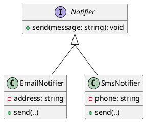
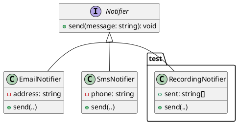
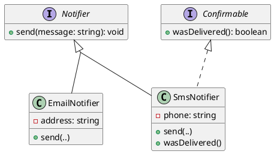
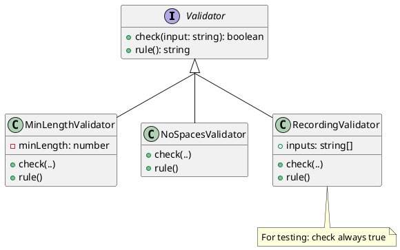

# Defining Boundaries with Interfaces

The last two chapters removed two commitments from a class: how it stores its data, and what type of members it holds. One commitment remains in every design we have written. A variable is declared `GuestList`, a parameter is typed `GuestList`, and the code around it depends on that one class even though it uses only the public methods. The representation is hidden, but the class itself is not.

An **interface** lets the class be hidden as well. It is a named type that lists a set of operations and says nothing about which class provides them. Code written against an interface depends only on the operations it names, so any class that provides those operations can be used, and the class can change without the calling code being modified.

This chapter covers the `interface` keyword and what belongs in an interface, how a class commits to an interface with `implements`, the difference between the type a variable is declared with and the type of the object it holds at run time, and why depending on an interface rather than a concrete class is one of the most useful decisions in a design. It is also the foundation for the next two chapters, on polymorphism and on extending a system without modifying it.

#### A Channel as a Contract

We use one running example across this chapter and the next two: a small system that delivers alert messages to people over different communication channels.

> As a monitoring system, I want to deliver an alert over each configured channel, so that the code that raises an alert never changes when a new channel is added.

Email and SMS differ in almost every respect, but for raising an alert they have one thing in common: each can deliver a message. That shared capability is all the alerting code should depend on, and an interface lets us write it down as a type.

## Declaring an Interface

An interface declares a name and a list of method signatures:

<!-- TS allows fields in interfaces, but we won't cover this in 210 -->

```typescript
interface <Name> {
    <methodName>(<parameters>): <ReturnType>;
}
```

Each line in the body is a **method signature**: a method's name, parameters, and return type, with no body. All interface methods are public. The interface records what operations exist, not how they work. For our channels:

```typescript
/**
 * Delivers short alert messages over a single channel to a fixed recipient.
 *
 * A channel is responsible only for delivery. The recipient is decided when
 * the channel is constructed; callers decide only what to send.
 */
interface Notifier {
    /**
     * Delivers `message` over this channel, returning once delivery has
     * been attempted.
     *
     * @param {string} message the alert text; callers pass a non-empty string
     */
    send(message: string): void;
}
```

`Notifier` contains a single method signature and no fields. This is intentional, because an interface describes the operations a caller may invoke, never the state or representation behind them. The encapsulation chapter chose which methods a class exposes. An interface takes that public surface and gives it a name of its own, separate from any class.

Because an interface is a contract that one body of code implements and another depends on, it should be documented carefully. Every member is part of a promise that callers rely on and implementers must keep, so documentation that was good practice for a function is close to essential for an interface.

<details class="tooltip ts-tips">
<summary><code>interface</code> Versus <code>type</code></summary>

You have used `type` since [Part 1](../part1/index) to name unions and the shapes of data, and TypeScript lets you describe an object's shape with either `type` or `interface`. This course uses an `interface` for a contract that classes implement and callers depend on, and `type` for unions (`"red" | "green" | "yellow"`) and for the shape of plain data. Use `interface` when several classes will commit to the same set of operations, and a `type` alias when you are naming a structure.

</details>

<details class="tooltip link-110">
<summary>Contracts Before Implementations</summary>

You relied on contracts without implementations in CPSC 110. When a function needed a helper you had not written yet, you recorded the helper's signature and purpose and called it right away, trusting that contract while its body was still on your wish list. An interface makes that arrangement permanent and checked. It records the signatures a caller may rely on, and the compiler guarantees that an implementation exists and matches.

</details>

## Implementing the Contract

A class states that it satisfies an interface with the `implements` keyword:

```typescript
class <ClassName> implements <InterfaceName> {
    // must provide every member the interface declares
}
```

The compiler then checks that the class provides every operation the interface declares, with compatible signatures, and the class does not compile if it does not. `implements` is a promise the language holds the class to. Two classes can keep the `Notifier` promise in completely different ways:

<CollapsibleCode>

```typescript
class EmailNotifier implements Notifier {
    private readonly address: string;

    constructor(address: string) {
        this.address = address;
    }

    public send(message: string): void {
        // deliver `message` to this.address over email
    }
}

class SmsNotifier implements Notifier {
    private readonly phone: string;

    constructor(phone: string) {
        this.phone = phone;
    }

    public send(message: string): void {
        // deliver `message` to this.phone over SMS
    }
}
```

</CollapsibleCode>

Each class has its own private representation (an email address, a phone number) and its own way of delivering a message, and each is encapsulated as in the encapsulation chapter. What is new is that both now share a public type, `Notifier`, that neither of them owns.


<!-- caption="Notifier with multiple concrete classes." -->

<details class="tooltip deep-dive">
<summary>Structural Typing</summary>

TypeScript checks types by _shape_, not by name. A value is acceptable wherever a type is expected if it has the required members, whatever it was declared as, so a class with a matching `send` method can be used as a `Notifier` even without writing `implements Notifier`. `implements` is still worth writing, because it declares intent and turns a silent mismatch into a clear error. With `implements Notifier`, forgetting or misspelling `send` fails at the class, where the mistake is, rather than later at some distant call site. Some languages, such as Java, are instead _nominal_: a class is a `Notifier` only if it explicitly says so.

</details>

## Apparent and Actual Types

Once a class implements an interface, an object of that class can be held in a variable declared with the interface type:

```typescript
const alerts: Notifier = new EmailNotifier("ops@example.com");
```

Two different types are involved. The **apparent type** is the one written in the code, `Notifier`, and is what the compiler knows about the variable. The **actual type** is the type of the object that exists at run time, `EmailNotifier`. This is the static and dynamic distinction from [Part 1](../part1/index): the apparent type belongs to the static view the compiler checks, and the actual type belongs to the dynamic view that exists only when the program runs.

The apparent type decides what you are allowed to do with the variable. Through an apparent type of `Notifier` you may call `send`, because the contract promises it, and nothing more:

```typescript
alerts.send("disk almost full"); // allowed: send is declared on Notifier
// alerts.address                // rejected: address is not part of Notifier
```

That restriction looks like a loss, but it is what we want. The code relies only on what `Notifier` promises, so the object behind `alerts` can be of any type that implements `Notifier`, and every line still type-checks. Declaring the variable with the interface rather than `EmailNotifier` is the difference between code that works with one class and code that works with all of them. This practice is usually summarised as _program to an interface, not an implementation_: prefer the apparent type that names the contract over the one that names a specific class, for parameters, fields, and return types alike.

## Many Implementations

The benefit appears as soon as code is written against the interface. A function that raises an alert takes a `Notifier`, or a list of them, and never mentions a specific channel:

```typescript
function alertAll(channels: Notifier[], message: string): void {
    for (const channel of channels) {
        channel.send(message);
    }
}
```

`alertAll` works for an `EmailNotifier`, an `SmsNotifier`, a list mixing the two, and any channel written in the future, with no change to its body. The interface is a boundary, with the alerting logic on one side and the delivery mechanisms on the other. Each side can be read, changed, and tested with only the contract in view, without the other side's code.

`alertAll` cannot tell which kind of channel each element is, or act on it. As far as the code can see, every element is only a `Notifier`. In this chapter, that uniformity is the goal.

## Test Doubles

A boundary that callers depend on is also one that tests can use. The real channels have effects we do not want in a test suite, since a test of `alertAll` should not send actual email or text messages. Because `alertAll` depends only on `Notifier`, a test can give it a stand-in that records what it was asked to send instead of sending anything:

```typescript
class RecordingNotifier implements Notifier {
    public readonly sent: string[] = [];

    public send(message: string): void {
        this.sent.push(message);
    }
}

test("alertAll delivers the message over every channel", () => {
    const a = new RecordingNotifier();
    const b = new RecordingNotifier();

    alertAll([a, b], "deploy finished");

    expect(a.sent).to.deep.equal(["deploy finished"]);
    expect(b.sent).to.deep.equal(["deploy finished"]);
});
```

`RecordingNotifier` is a third implementation of `Notifier`, written only for tests. A stand-in like this is called a **test double**, and is often loosely called a **mock object**. It satisfies the same contract as the real thing but is simpler and observable, so the code under test can be exercised in isolation. This is the black-box testing from [Chapter 9](../part1/09_validation), made easy by an interface: the test and the code under test both depend on the contract, and the real delivery mechanism is not involved at all. Designing against interfaces is one of the things that makes code testable.


<!-- caption="Notifier with multiple concrete classes including one that is just for testing." -->

## Keeping Interfaces Small

`Notifier` declares one method, and that is a design choice. Suppose some channels can also report whether the provider acknowledged a message. It is tempting to add that to `Notifier`, but doing so would force _every_ implementation, including ones that cannot confirm anything, to provide the operation. The capability belongs in its own small interface:

```typescript
interface Confirmable {
    /** Returns true once the provider has acknowledged the last send. */
    wasDelivered(): boolean;
}
```

A class can implement more than one interface by listing them, so a channel that can confirm delivery commits to both contracts:

```typescript
class SmsNotifier implements Notifier, Confirmable {
    // send is unchanged from above

    public wasDelivered(): boolean {
        // report the provider's acknowledgement
    }
}
```

Now each caller depends on only the contract it needs. Code that only sends takes a `Notifier`, and code that only checks receipts takes a `Confirmable`. The next chapter shows how to combine the two for code that needs both. A channel that cannot confirm anything stays a plain `Notifier` and is never forced to fake an operation it does not support.


<!-- caption="SmsNotifier implementing two interfaces." -->

Keeping interfaces small is the interface-level version of the cohesion advice that classes should have a single responsibility. A small, focused interface describes one capability. A large interface that bundles several forces implementers to support unrelated operations, and forces callers to depend on more than they use. The guidance that many small interfaces are better than one large one is called the **interface segregation principle**. Small interfaces also preserve implementation freedom. Every operation a contract promises becomes behaviour callers may rely on, so a large interface exposes more of each implementation, while a small one keeps more of it hidden and free to change.

## Constraining Generics

Interfaces have a second use, which solves a problem the previous chapter left open. `Roster<T>` could not compare two of its members, because a class that knows nothing about `T` has no operation to compare them with, so we passed it a comparison function when it was built. An interface offers the other option: instead of passing the operation in, require that every member already provides it.

```typescript
interface Identifiable {
    /**
     * Reports whether this object denotes the same thing as another.
     *
     * @param {Identifiable} other the object to compare against
     * @returns {boolean} true when both denote the same thing
     */
    sameAs(other: Identifiable): boolean;
}
```

A type parameter can then be restricted to types that satisfy that interface, written with `extends`:

```typescript
class <Name><T extends <Interface>> {
    // every T is guaranteed to provide the interface's operations
}
```

The constraint gives the class something to call:

```typescript
class Roster<T extends Identifiable> {
    private readonly capacity: number;
    private readonly members: T[];

    // constructor, isFull, size, and add as before, with no comparison function

    isMember(candidate: T): boolean {
        for (const member of this.members) {
            if (member.sameAs(candidate)) {
                return true;
            }
        }
        return false;
    }
}
```

`member.sameAs(candidate)` compiles because the constraint promises that every member has the method, whatever its type. This is the same reasoning as an apparent type, applied to a type parameter. The compiler knew a variable's operations from the type written on it, and it knows a type parameter's operations from the constraint written on it.

The two options trade against each other. Constraining gives the class knowledge but limits which types it accepts. `Roster<Seat>` works only if `Seat` implements `Identifiable`, and `Roster<string>` no longer compiles at all, because a string has no `sameAs` method. Passing a function in keeps the class usable with every type, including ones you did not write and primitives you cannot change, but requires every caller to supply the comparison. Constrain when the operation is part of what the members are and you control those types. Pass the operation in when the members are types you do not own, or when different callers need different notions of sameness.

Either way, the constraint should name the smallest interface that supplies what the class needs, for the reason given in the previous section. A constraint is a demand made of every type that wants to be a member, and demanding operations the class never calls restricts the class for no benefit.

#### Depending on the Contract

An interface is the public surface of a class extracted into a named type that any class can implement and any caller can depend on. Depending on an interface rather than a concrete class is the strongest form of information hiding. The previous two chapters let a class change its representation without affecting callers, and an interface lets the _entire class_ behind the contract change without affecting them. Name contracts as interfaces, keep them small and well documented, and write the rest of the program against them.

We now have a boundary with one contract and several classes implementing it. The next chapter looks at what happens when those classes are not just interchangeable but behave differently, so that one call does different work depending on the object behind the interface. That is polymorphism.

<details class="tooltip exercise">
  <summary>Exercise: Input Validation Rules</summary>

> As a developer building a registration form, I want to run each field through a set of independent rules, so that every violated constraint is reported to the user rather than only the first one found.

Here is the interface and a function that collects the descriptions of all failed rules:

```typescript
interface Validator {
    /** Returns true if the input satisfies this rule. */
    check(input: string): boolean;
    /** A short description of what this rule requires, suitable for an error message. */
    rule(): string;
}

/**
 * Returns the description of every rule that input fails.
 * Returns an empty array if all rules are satisfied.
 *
 * @param {Validator[]} validators the rules to apply, in order
 * @param {string} input the value to check
 * @returns {string[]} descriptions of every violated rule
 */
function failedRules(validators: Validator[], input: string): string[] {
    /* ... */
}
```


<!-- caption="Desired class layout for activity." -->

Work through the following:

1. _Implementing `failedRules`._ The `Validator` contract says `check` returns `true` for a passing input, and `rule` returns the violation message. Write the body of `failedRules` so that it collects the `rule()` of every validator whose `check` returns `false`.
2. _Writing validators._ Implement two classes that satisfy `Validator`: a `MinLengthValidator` that fails when the input is shorter than a configurable minimum, and a `NoSpacesValidator` that fails when the input contains a space. Neither should require any change to `failedRules`.
3. _Testability._ Write a `RecordingValidator` that records every input passed to `check` and always returns `true`. Use it to confirm that `failedRules` calls `check` on every validator, even after an earlier one has failed.
4. _Interface size._ Suppose you need validators to carry a severity so that callers can display warnings differently from hard errors. What are the costs of adding a `severity(): string` method to `Validator`, compared with defining a separate `SeverityRated` interface that only some validators implement?

</details>
