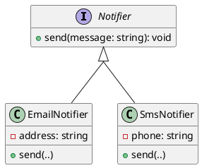
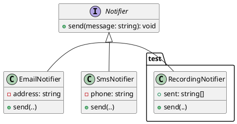
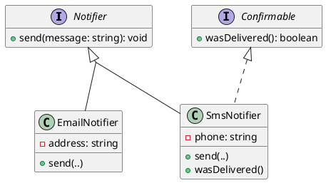
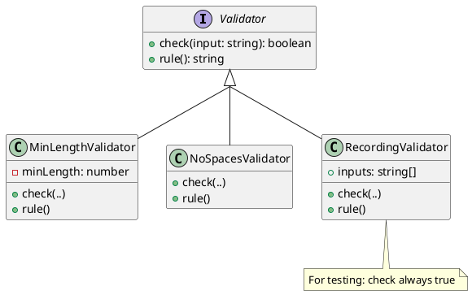

# Defining Boundaries with Interfaces

The last two chapters removed two commitments from a class: how it stores its data, and what type of members it holds. But one commitment remains in every design we have written---the class's name. 

A variable is declared `GuestList`, a parameter is typed `GuestList`, and the code around it depends on that one class even though it uses only the public methods. The representation is hidden, but the class itself is not.

An **interface** lets the class name be hidden as well. An interface is a named type that lists a set of operations, but not their implementation. Code written against an interface depends only on the operations it names, so any class that provides those operations can be used, and the class can change without the calling code being modified.

This chapter covers: 
- the `interface` keyword and what belongs in an interface;
- how a class commits to an interface with `implements`; 
- the difference between the type a variable is declared with and the type of the object it holds at run time; and 
- why depending on an interface rather than a concrete class is one of the most useful decisions in a design. 

This chapter is also the foundation for the next two chapters, on _polymorphism_ and on _extending_ a system without modifying it.

<details class="tooltip exercise">
<summary>Exercise: There's nothing new about separating types and implementations...</summary>

In Chapter 4, we saw how to hide data from all but a few given operations, using a closure-based `makeX` constructor function. To do this, we separated out the type declaration `X`, which specified those few operations, from the constructor function `makeX`, where those operations were actually declared.

For all the applications we saw up to Chapter 10, this separation of `type X` and `makeX` was mostly a nuisance. In Chapter 10, we welcomed the use of `class` to reduce the duplication. But this separation allows us to provide some of the same abstraction we'll see in this and the next chapter.

Try the following exercise:
1. Specify a `Pet` type that provides the operations `getName(): string` and `say(): string`, for the pet's name and what is says.
2. Write a `makeCat` and `makeDog` (or whatever your favourite pet species is), that closes over the pet's name while providing a `getName(): string` getter and a `say(): string` appropriate for that species.
3. Write a function `petDialogue(p: Pet): string` that returns what the pet says with its name prepended.
4. Note how the same `petDialogue` function can be used for various types of pets, reducing code duplication!
5. (Extension) Do the same using `interface` after reading this chapter.

(If you came into this course knowing a bit about object orientation, you may actually find the analogy of interfaces useful for understanding Chapter 4.)

<details class="tooltip deep-dive">
<summary>Solution</summary>

Run in [Playground](https://www.typescriptlang.org/play/?#code/C4TwDgpgBAChxQLxQN4Cgqagc3gOQEMBbCACgEoAuKAZ2ACcBLAO2wBoMsaCQLq6mrNAF80aAGYBXZgGNgjAPbMoRAgGsIAEQXZSzfgxbYqseKk6YZSulAAmO6nATJ0WN5lzBCJPrUOtzdyDMenhJemVmAG4LIOEOYMxuXhMBI0DEt1DgcOUAIgB3BQVxAEI8mMzRN2qsbNy7HRjRCWk5RWVVDQBhAmA9A0FjRzNXLCtmGxk+kecM4M9vMlT-bHnMqHqIqGjY93i9t2TfNICxjc2w7bySBQKAOgrDrFrMV8uc7engZrEpWXkSigkGAmkYBAANjpJGQwLMVkN1ltlAADAAkKDA90WxGWwmoGKxx3IwhRIjEExs4kY9lmSBU6i0OlIeQAYjSFHlyDFKQgwPQShAaDQFPQALIQO505BdCC9fp5GAC8RCkX0KASu5cmJoXnA+A0WYAbQAuvSjdT7GxgcrVaLNQUTVEoH9RVBSHqwFASvrgDRyOtKQoIRB7lDdCCwZDobDyNyREA):

```typescript
type Pet = {
    getName(): string,
    say(): string
}

function makeDog(n: string): Pet {
    const dog: Pet = {
         getName(): string {
             return n;
         },
         say(): string {
             return "woof!";
         }
    }
    return dog;
}

function makeCat(n: string): Pet {
    const cat: Pet = {
         getName(): string {
             return n;
         },
         say(): string {
             return "meow.";
         }
    }
    return cat;
}

function petDialogue(p: Pet): string {
    return `${p.getName()}: ${p.say()}`
}

const fido: Pet = makeDog("Fido");
const professorMeow: Pet = makeCat("Professor Meow");

const pets: Pet[] = [fido, professorMeow]; 

for (const p of pets) {
    console.log(petDialogue(p));
}

```
</details>
</details>


## A Channel as a Contract

We will use one running example for the rest of Part 2. We will consider a small system that delivers alert messages to people over different communication channels. Here's a user story:

> As a monitoring system, I want to deliver an alert over each configured channel, so that the code that raises an alert never changes when a new channel is added.

For example, email and SMS (two communication channels) differ in almost every respect. But they can both deliver a message, which is all that's important for raising an alert. The `interface` keyword will allow us to precisely specify write this shared capability to send a message.

## Declaring an Interface

An interface declares a name and a list of method signatures. Each line in the body is a **method signature**: a method's name, parameters, and return type, with no body. All interface methods are public. The interface records what operations exist, not how they work. 

<details class="tooltip ts-tips">
<summary> The <code>interface</code> keyword </summary>

<!-- TS allows fields in interfaces, but we won't cover this in 210 -->

The following declares an interface with a name `<Name>` and method(s):

```typescript
interface <Name> {
    <methodName>(<parameters>): <ReturnType>;
}
```

The syntax is nearly identical to `class` except interfaces will not have method bodies. Just like a class, the name `<Name>` can be used as a type.

</details>

Here's an interface expressing the send capability for our channels:

```typescript
/**
 * Delivers short alert messages over a single channel to a fixed recipient.
 *
 * A channel is responsible only for delivery. The recipient is decided when
 * the channel is constructed; callers decide only what to send.
 */
interface Notifier {
    /**
     * Delivers `message` over this channel, returning once delivery has
     * been attempted.
     *
     * @param {string} message the alert text; callers pass a non-empty string
     */
    send(message: string): void;
}
```


`Notifier` contains a single method signature and no fields. This is intentional, because an interface describes the operations a caller may invoke, not the state or representation behind them. In [Chapter 12](./03_encapsulation.html), we discussed which methods a class should expose. We can use interfaces to give that public surface a name of its own, separate from any class.

Because an interface is a contract that one body of code implements and another depends on, it should be documented carefully. Every member is part of a promise that callers rely on and implementers must keep. So while documentation is mostly "good practice" for a function, it is close to essential for an interface.

<details class="tooltip ts-tips">
<summary><code>interface</code> Versus <code>type</code></summary>

You have used `type` since [Part 1](../part1/index) to name unions and the shapes of data, and TypeScript lets you describe an object's shape with either `type` or `interface`. This course uses an `interface` for a contract that classes implement and callers depend on, and `type` for unions (`"red" | "green" | "yellow"`) and for the shape of plain data. Use `interface` when several classes will commit to the same set of operations. 

</details>

<details class="tooltip link-110">
<summary>Contracts Before Implementations</summary>

You relied on contracts without implementations in CPSC 110. When a function needed a helper you had not written yet, you recorded the helper's signature and purpose and called it right away, trusting that contract while its body was still on your wish list. 

When we use interfaces, we rely on a similar abstraction. An interface records the signatures a caller may rely on, and the compiler guarantees that an implementation exists and matches.

</details>

## Implementing the Contract

A class states that it satisfies an interface with the `implements` keyword. The header:

```typescript
class <ClassName> implements <InterfaceName> {
    // ...
}
```

says that `<ClassName>` must implement every method declared by `<InterfaceName>`.


Given an `implements` relationship, the compiler checks that the class provides every operation the interface declares, with compatible signatures. The class does not compile if it does not provide every operation, or has provides a method with an incompatible signature. 

`implements` allows two classes to keep the `Notifier` promise in completely different ways:

<CollapsibleCode>

```typescript
class EmailNotifier implements Notifier {
    private readonly address: string;

    public constructor(address: string) {
        this.address = address;
    }

    public send(message: string): void {
        // deliver `message` to this.address over email
    }
}

class SmsNotifier implements Notifier {
    private readonly countryCode: number;
    private readonly phone: string;

    public constructor(phone: string, countryCode: number) {
        this.countryCode = countryCode;
        this.phone = phone;
    }

    public send(message: string): void {
        // deliver `message` to this.phone over SMS
    }
}
```

</CollapsibleCode>

Each class has its own private representation (an email address, a country code and a phone number) and its own way of delivering a message. Each class is encapsulated as per [Chapter 12](./03_encapsulation.html). The only new bit is that both classes share a public type, `Notifier`, that neither of them owns.


```plantuml
@startuml

hide empty members
skinparam groupInheritance 2

interface Notifier

Notifier <|.. EmailNotifier
Notifier <|.. SmsNotifier

Notifier : +send(message: string): void
EmailNotifier : -address: string
EmailNotifier : +send(..)
SmsNotifier : -phone: string
SmsNotifier : +send(..)

@enduml
```
<!-- caption="Notifier with multiple concrete classes." -->

<details class="tooltip deep-dive">
<summary>Deep-Dive: Structural Typing</summary>

Many languages, such as Java, are _nominal_: a class is a `Notifier` only if it explicitly says so.

TypeScript is weird in that it checks types by _shape_ (the term we've been using throughout the book to describe the property names and types of an object), not by name. A value is acceptable wherever a type is expected if it has the required members, whatever it was declared as, so a class with a matching `send` method can be used as a `Notifier` even without writing `implements Notifier`. `implements` is still worth writing, because it declares intent and turns a silent mismatch into a clear error. With `implements Notifier`, forgetting or misspelling `send` fails at the class, where the mistake is, rather than later at some distant call site. 


You can read more in the [Uncovered Language Features](../reference/language-features.html) reference page.

</details>

## Apparent and Actual Types

Once a class implements an interface, an object of that class can be held in a variable declared with the interface type:

```typescript
const alerts: Notifier = new EmailNotifier("ops@example.com");
```

Two different types are involved. The **apparent type** (static type) is the one written in the code, `Notifier`, and is what the compiler knows about the variable. The **actual type** (dynamic type) is the type of the object that exists at run time, `EmailNotifier`. This is the static and dynamic distinction from [Part 1](../part1/index): the apparent type belongs to the static view the compiler checks, and the actual type belongs to the dynamic view that exists only when the program runs.

The compiler restricts what you can do with a variable based on its _apparent_ (or static) type.Through an apparent type of `Notifier` you may call `send`, because the contract promises it. But you can do nothing more than that:

```typescript
alerts.send("disk almost full"); // allowed: send is declared on Notifier
// alerts.address                // rejected: address is not part of Notifier
```

That restriction may look like a loss, but it is what we want in this scenario. The code relies only on what `Notifier` promises, so the object behind `alerts` can be of any type that implements `Notifier`. If we'd declared the variable with `EmailNotifier`, the code would have to be modified or duplicated to work with different types of `Notifier`s. The practice of using the least restrictive type we can is summarised as _program to an interface, not an implementation_: prefer the apparent type that names the contract over the one that names a specific class.

## Many Implementations

Let's look at a concrete example of why _program to an interface, not an implementation_ is useful. Let's say we want to send our notification to multiple channels at once. With the `Notifier` interface, a function can take in a whole list of different `Notifiers` and raise an alert for each of them:

```typescript
function alertAll(channels: Notifier[], message: string): void {
    for (const channel of channels) {
        channel.send(message);
    }
}
```

By contrast, here's a version that hard-codes two notifiers:

```typeScript
function alertEmailSMS(echannel: EmailNotifier, schannel: SmsNotifier, message: string): void {
    echannel.send(message);
    schannel.send(message);

}
```

The most important quality of `alertAll` is that it will continue to work _without modifying the code_ if we choose to add or delete channels in the future. 

The `Notifier` interface serves as a boundary, with the alerting logic (`alertAll`) on one side and the delivery mechanisms (`EmailNotifier` and `SmsNotifier`'s `send) on the other. Each side can be read, changed, and tested with only the contract in view, without the other side's code.


## Test Doubles

This clear boundary is also useful for testing. The real channels have effects we do not want in a test suite, since a test of `alertAll` should not send actual email or text messages. But because `alertAll` depends only on `Notifier`, we can easily test it with a stand-in that records what it was asked to send instead of sending anything:

```typescript
class RecordingNotifier implements Notifier {
    public readonly sent: string[] = [];

    public send(message: string): void {
        this.sent.push(message);
    }
}

test("alertAll delivers the message over every channel", () => {
    const a = new RecordingNotifier();
    const b = new RecordingNotifier();

    alertAll([a, b], "deploy finished");

    expect(a.sent).to.deep.equal(["deploy finished"]);
    expect(b.sent).to.deep.equal(["deploy finished"]);
});
```

`RecordingNotifier` is a third implementation of `Notifier`, written only for tests. A stand-in like this is called a **test double**, and is often loosely called a **mock object**. It satisfies the same contract as the real thing but is simpler and observable, so the code under test can be exercised in isolation. Interfaces make the specification-based testing from [Chapter 9](../part1/09_validation#specification-based-testing) easy: the test and the code under test both depend on the contract, and the real delivery mechanism is not involved at all. Designing against interfaces is one of the things that makes code testable.


```plantuml
@startuml

hide empty members
skinparam groupInheritance 2

interface Notifier

Notifier <|.. EmailNotifier
Notifier <|.. SmsNotifier

Notifier : +send(message: string): void
EmailNotifier : -address: string
EmailNotifier : +send(..)
SmsNotifier : -phone: string
SmsNotifier : +send(..)

package test {
    Notifier <|.. RecordingNotifier
    RecordingNotifier : +sent: string[]
    RecordingNotifier : +send(..)
}

@enduml
```
<!-- caption="Notifier with multiple concrete classes including one that is just for testing." -->

## Keeping Interfaces Small

In building `Notifier`, we chose to have it declare only one method. Suppose some channels can also report whether the provider acknowledged a message, say `wasDelivered(): boolean`. It is tempting to add that capability to `Notifier`. But if we do so, this would force _every_ implementation of `Notifier` to provide  a `wasDelivered`. If some notifiers cannot provide this operation, its presence, even as a no-op method, would be confusing. Instead we can put that capability in its own small interface:

```typescript
interface Confirmable {
    /** Returns true once the provider has acknowledged the last send. */
    wasDelivered(): boolean;
}
```

A class can implement more than one interface by listing them both:

```typescript
class SmsNotifier implements Notifier, Confirmable {
    // send is unchanged from above

    public wasDelivered(): boolean {
        // report the provider's acknowledgement
    }
}
```

... and a channel that cannot confirm anything stays a plain `Notifier` and is never forced to fake an operation it does not support.

By splitting these up, we also allow each caller to depend only on the contract that caller needs. Code that only sends takes a `Notifier`, and code that only checks receipts takes a `Confirmable`.  In [Chapter 15](./06_extension.html), we'll see how to specify when code needs both.


```plantuml
@startuml

hide empty members
skinparam groupInheritance 2

interface Notifier
interface Confirmable

Notifier <|.. EmailNotifier
Notifier <|.. SmsNotifier
Confirmable <|.. SmsNotifier

Notifier : +send(message: string): void
Confirmable : +wasDelivered(): boolean
EmailNotifier : -address: string
EmailNotifier : +send(..)
SmsNotifier : -phone: string
SmsNotifier : +send(..)
SmsNotifier : +wasDelivered()

@enduml
```
<!-- caption="SmsNotifier implementing two interfaces." -->

Keeping interfaces small is the interface-level version of the [cohesion principle](./02_decomposition.html) that favours classes with a single responsibility. A small, focused interface describes one capability. A large interface that bundles several forces implementers to support unrelated operations, and forces callers to depend on more than they use. The guidance that many small interfaces are better than one large one is called the **interface segregation principle**. 

Small interfaces also preserve [implementation freedom](./04_flexibility.html). Every operation a contract promises becomes behaviour callers may rely on, so a large interface exposes more of each implementation, while a small one keeps more of it hidden and free to change.

## Constraining Generics

Remember the problem we ended [Chapter 13](./04_flexibility.html) with, where `Roster<T>` was more generic than `GuestList`, but couldn't compare its members? The solution we offered was to directly pass in a compare function---higher-order functions to the rescue again. But while higher-order functions are powerful, many people find them hard to reason about, and hard-to-reason-about code is error-prone code. 

Interfaces provide us another solution. Instead of passing in a compare function, we can first write an interface that captures whether a type is comparable:
```typescript
interface Identifiable {
    /**
     * Reports whether this object denotes the same thing as another.
     *
     * @param {Identifiable} other the object to compare against
     * @returns {boolean} true when both denote the same thing
     */
    sameAs(other: Identifiable): boolean;
}
```

And then use that type to constrain a generic type:

```typescript
class Roster<T extends Identifiable> {
    private readonly capacity: number;
    private readonly members: T[];

    // constructor, isFull, size, and add as before, with no comparison function

    public isMember(candidate: T): boolean {
        for (const member of this.members) {
            if (member.sameAs(candidate)) {
                return true;
            }
        }
        return false;
    }
}
```

The constraint `T extends Identifiable` promises that every `T` support `sameAs(candidate)`, so `member.sameAs(candidate)` compiles. This is the same reasoning as an apparent type. The compiler knows a variable's operations from the type written on it, and it knows a type parameter's operations from the constraint written on it.

<details class="tooltip ts-tips">
<summary><code>extends</code> on Generic Types</summary>

A type parameter can be restricted to types that satisfy that interface, written with `extends`:

```typescript
class <Name><T extends <Interface>> {
    // every T is guaranteed to provide the interface's operations
}
```
</details>


Constraining with an interface or passing in a higher-order function is a design decision; each has trade-offs. Constraining with `extends` gives the class knowledge but limits which types it accepts. `Roster<Seat>` works only if `Seat` implements `Identifiable`. `Roster<string>` no longer compiles at all, because a string has no `sameAs` method. Passing a function in keeps the class usable with every type, including ones you did not write and primitives you cannot change, but requires every caller to supply the comparison. As a rule of thumb, constrain when the operation is part of what the members are and you control those types. Pass the operation in when the members are types you do not control, or when different callers need different notions of sameness.

Either way, the constraint should name the smallest interface that supplies what the class needss. A constraint is a demand made of every type that wants to be a member, and demanding operations the class never calls restricts the class for no benefit.

#### Depending on the Contract

An interface is the public surface of a class, extracted into a named type that any class can implement and any caller can depend on. Depending on an interface rather than a concrete class is the strongest form of information hiding. The previous two chapters let a class change its representation without affecting callers. An interface lets the _entire class_ behind the contract change without affecting callers. Interfaces allow us to make code that follows contracts very directly, by naming contracts as interfaces, keeping them small and well documented, and writing the rest of the program against them.

Interfaces define a boundary with a contract one one side, and several classes implementing it on the other side. In the next chapter, we'll introduce _polymorphism_, which allows different classes to share method implementations that are identical, while still allowing those classes to differ in the implementation of other methods. 

<details class="tooltip exercise">
  <summary>Exercise: Input Validation Rules</summary>

> As a developer building a registration form, I want to run each field through a set of independent rules, so that every violated constraint is reported to the user rather than only the first one found.

Here is the interface and a function that collects the descriptions of all failed rules:

```typescript
interface Validator {
    /** Returns true if the input satisfies this rule. */
    check(input: string): boolean;
    /** A short description of what this rule requires, suitable for an error message. */
    rule(): string;
}

/**
 * Returns the description of every rule that input fails.
 * Returns an empty array if all rules are satisfied.
 *
 * @param {Validator[]} validators the rules to apply, in order
 * @param {string} input the value to check
 * @returns {string[]} descriptions of every violated rule
 */
function failedRules(validators: Validator[], input: string): string[] {
    /* ... */
}
```


```plantuml
@startuml

hide empty members
skinparam groupInheritance 2

interface Validator

Validator <|.. MinLengthValidator
Validator <|.. NoSpacesValidator

Validator <|.. RecordingValidator
note "For testing: check always true" as N1
RecordingValidator .. N1

Validator : +check(input: string): boolean
Validator : +rule(): string
MinLengthValidator : -minLength: number
MinLengthValidator : +check(..)
MinLengthValidator : +rule()
NoSpacesValidator : +check(..)
NoSpacesValidator : +rule()
RecordingValidator : +inputs: string[]
RecordingValidator : +check(..)
RecordingValidator : +rule()

@enduml
```
<!-- caption="Desired class layout for activity." -->

Work through the following:

1. _Implementing `failedRules`._ The `Validator` contract says `check` returns `true` for a passing input, and `rule` returns the violation message. Write the body of `failedRules` <span class="hint">so that it collects the `rule()` of every validator whose `check` returns `false`</span>.
2. _Writing validators._ Implement two classes that satisfy `Validator`: a `MinLengthValidator` that fails when the input is shorter than a configurable minimum, and a `NoSpacesValidator` that fails when the input contains a space. <span class="hint">Neither should require any change to `failedRules`.</span>
3. _Testability._ Write a `RecordingValidator` that records every input passed to `check` and always returns `true`. Use it to confirm that <span class="hint">`failedRules` calls `check` on every validator, even after an earlier one has failed</span>.
4. _Interface size._ Suppose you need validators to carry a severity so that callers can display warnings differently from hard errors. What are the costs of adding a `severity(): string` method to `Validator`, compared with defining a separate `SeverityRated` interface that only some validators implement?

</details>
