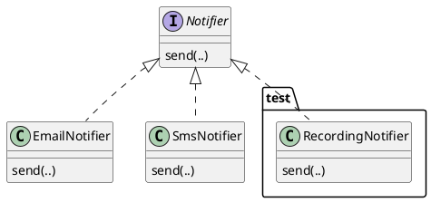

# Interfaces as Explicit Boundaries

With encapsulation we hid a class's representation behind its public methods, so callers depend on what a class does, rather than on how it stores its data. Yet the caller still has to name the class: a variable is declared `GuestList`, a parameter is typed `GuestList`, and the code is tied to that one class even though it uses only the class's public methods. The representation is hidden; the class is not.

An **interface** is an abstraction that enables classes to be hidden as well. It is a named type that lists a set of operations and says nothing about which specific class provides them. Code written against an interface depends only on the operations it names, so any class that provides those operations can be used, and the specific class that is used can change without the calling code being modified. This is the abstraction boundary in its purest form: a contract that records what is promised and deliberately omits everything about how the promise is kept.

<!-- RTH: I like this setup paragraph as it justifies the chapter organization a bit; I wonder if I should back-port this to past chapter? -->

This chapter introduces interfaces: the `interface` keyword and what belongs in one, how a class commits to an interface with `implements`, the difference between the type a variable is declared with and the type of the object actually behind it, and why depending on an interface rather than a concrete class is one of the most useful decisions in a design. It is also the foundation for the two chapters that follow, on polymorphism and on extending a system without modifying it.

#### A Channel as a Contract

We use one running example across this chapter and the next two: a small system that delivers alert messages to people over different communication channels.

> As a monitoring system, I want to deliver an alert over each configured channel, so that the code that raises an alert never changes when a new channel is added.

Email and SMS differ in almost every respect, but for the purpose of raising an alert they have exactly one thing in common: each can deliver a message. That single shared capability, and nothing else, is what the alerting code should depend on. An interface lets us write that capability down as a type.

An interface declares a name and a list of method signatures:

<!-- TS allows fields in interfaces, but we won't cover this in 210 -->

```typescript
interface <Name> {
    <methodName>(<parameters>): <ReturnType>;
}
```

Each line in the body is a **method signature**: a method's name, parameters, and return type, with no body. All interface methods are public. The interface records what operations exist, not how they work. For our channels:

```typescript
/**
 * Delivers short alert messages over a single channel to a fixed recipient.
 *
 * A channel is responsible only for delivery. The recipient is decided when
 * the channel is constructed; callers decide only what to send.
 */
interface Notifier {
    /**
     * Delivers `message` over this channel, returning once delivery has
     * been attempted.
     *
     * @param {string} message the alert text; callers pass a non-empty string
     */
    send(message: string): void;
}
```

`Notifier` contains a single method signature and no fields. This is intentional: an interface describes the operations a caller may invoke but never its state or representation. Where the encapsulation chapter chose which methods a class exposes, an interface takes that public surface and gives it a name of its own, detached from any class.

Because an interface is a contract that one body of code implements and another depends on, it is documented with care. Every member is part of a promise that callers rely on and implementers must keep, so the documentation that was good practice for a function is closer to essential for an interface.

<details class="tooltip ts-tips">
<summary><code>interface</code> Versus <code>type</code></summary>

You have used `type` since Part 1 to name unions and the shapes of data, and TypeScript will in fact let you describe an object's shape with either `type` or `interface`. The convention this course follows is to use an `interface` for a contract that classes implement and callers depend on, and `type` for unions (`"red" | "green" | "yellow"`) and for naming the shape of plain data. Use `interface` when several classes will commit to the same set of operations; use a `type` alias when you are giving a name to a structure.

</details>

<details class="tooltip link-110">
<summary>Contracts Before Implementations</summary>

You relied on contracts without implementations in CPSC 110. When a function needed a helper you had not written yet, you recorded the helper's signature and purpose and called it straight away, trusting that contract while its body was still an entry on a wish list. An interface makes that arrangement permanent and enforced: it records the signatures a caller may rely on, and the compiler guarantees that an implementation exists and matches. Depending on what a piece of code promises, rather than on how it works, is an idea you have used since your first weeks of programming.

</details>

## Implementing the Contract

A class states that it satisfies an interface with the `implements` keyword:

```typescript
class <ClassName> implements <InterfaceName> {
    // must provide every member the interface declares
}
```

The compiler then checks that the class provides every operation the interface declares, with compatible signatures; if it does not, the class does not compile. `implements` is therefore a promise the language holds the class to. Two classes can keep the `Notifier` promise in completely different ways:

<CollapsableCode>

```typescript
class EmailNotifier implements Notifier {
    private readonly address: string;

    constructor(address: string) {
        this.address = address;
    }

    public send(message: string): void {
        // deliver `message` to this.address over email
    }
}

class SmsNotifier implements Notifier {
    private readonly phone: string;

    constructor(phone: string) {
        this.phone = phone;
    }

    public send(message: string): void {
        // deliver `message` to this.phone over SMS
    }
}
```

</CollapsableCode>

Each class has its own private representation (an email address, a phone number) and its own way of delivering a message, and each is fully encapsulated in the sense of the previous chapter. What is new is that both now share a public type, `Notifier`, that neither of them owns.

<details class="tooltip deep-dive">
<summary>Structural Typing</summary>

TypeScript checks types by _shape_, not by name: a value is acceptable wherever a type is expected if it has the required members, whatever it was declared as. A class with a matching `send` method is therefore usable as a `Notifier` even without writing `implements Notifier`. Why write `implements`, then? Because it declares intent and turns a silent mismatch into a clear error: with `implements Notifier`, forgetting `send` or misspelling it fails at the class, where the mistake is, rather than later at some distant call site. Some languages, such as Java, are instead _nominal_: a class is a `Notifier` only if it explicitly says so. In TypeScript, `implements` is a checked declaration of intent layered on top of structural typing, not the thing that makes the class assignable.

</details>

## Apparent and Actual Types

Once a class implements an interface, an object of that class can be held in a variable declared with the interface type:

```typescript
const alerts: Notifier = new EmailNotifier("ops@example.com");
```

Two different types are in play here. The **apparent type** is the one written in the code, `Notifier`: it is what the compiler knows about the variable. The **actual type** is the type of the object that exists at run time, `EmailNotifier`. This is the static and dynamic distinction from Part 1 seen from a new angle: the apparent type belongs to the static view the compiler checks, and the actual type belongs to the dynamic view that exists only once the program runs.

The apparent type decides what you are allowed to do with the variable. Through an apparent type of `Notifier` you may call `send`, because the contract promises it, and nothing more:

```typescript
alerts.send("disk almost full"); // allowed: send is declared on Notifier
// alerts.address                // rejected: address is not part of Notifier
```

That restriction looks like a loss, but it is exactly what we want: the code relies only on what `Notifier` promises, so the object behind `alerts` can be of any type that implements `Notifier`, and every line still type-checks. Declaring the variable with the interface, rather than with `EmailNotifier`, is the difference between code that works with one class and code that works with all of them. This is the practice usually summarised as _program to an interface, not an implementation_: prefer the apparent type that names the contract over the one that names a specific class, for parameters, fields, and return types alike.

## One Boundary, Many Implementations

The benefit appears as soon as code is written against the interface. A function that raises an alert takes a `Notifier`, or a list of them, and never mentions a concrete channel:

```typescript
function alertAll(channels: Notifier[], message: string): void {
    for (const channel of channels) {
        channel.send(message);
    }
}
```

`alertAll` works for an `EmailNotifier`, for an `SmsNotifier`, for a list mixing the two, and for any channel written in the future, with no change to its body. The interface is a boundary, with the alerting logic on one side and the delivery mechanisms on the other; each side can be read, changed, and tested with only the contract in view, never the other side's code.

Notice what `alertAll` cannot do: it cannot tell, and cannot act on, which kind of channel each element is. Every element is, as far as the code can see, simply a `Notifier`. In this chapter that uniformity is the goal. <!-- In the next chapter it becomes something more powerful: when the same call, `channel.send(message)`, runs different code depending on the actual type behind the apparent one, we have polymorphism.-->

## Testing Across the Boundary

A boundary that callers depend on is also a boundary that tests can exploit. The real channels have effects we do not want in a test suite: a test of `alertAll` should not send actual email or actual text messages. Because `alertAll` depends only on `Notifier`, a test can hand it a stand-in that records what it was asked to send instead of sending anything:

```typescript
class RecordingNotifier implements Notifier {
    readonly sent: string[] = [];

    send(message: string): void {
        this.sent.push(message);
    }
}

test("alertAll delivers the message over every channel", () => {
    const a = new RecordingNotifier();
    const b = new RecordingNotifier();

    alertAll([a, b], "deploy finished");

    expect(a.sent).to.deep.equal(["deploy finished"]);
    expect(b.sent).to.deep.equal(["deploy finished"]);
});
```

`RecordingNotifier` is a third implementation of `Notifier`, written only for tests. A stand-in like this is called a **test double**, or a **mock object**: it satisfies the same contract as the real thing but is simpler and observable, so the code under test can be exercised in isolation. This is the black-box testing of the verification chapter, now made easy by an interface: the test depends on the contract, the code under test depends on the contract, and the real delivery mechanism is simply not present. Designing against interfaces is, among other things, what makes code testable.


<!-- caption: "Notifier with multiple concrete classes." -->

## Keeping Interfaces Small

`Notifier` declares one method, and that restraint is itself a design choice. Suppose some channels can also report whether a message was acknowledged by the provider. It is tempting to add that to `Notifier`, but doing so would force _every_ implementation, including ones that can confirm nothing, to provide the operation. The capability belongs in its own small interface:

```typescript
interface Confirmable {
    /** Returns true once the provider has acknowledged the last send. */
    wasDelivered(): boolean;
}
```

A class can implement more than one interface by listing them, so a channel that can confirm delivery commits to both contracts:

```typescript
class SmsNotifier implements Notifier, Confirmable {
    // send is unchanged from above

    public wasDelivered(): boolean {
        // report the provider's acknowledgement
    }
}
```

Now each caller depends on exactly the contract it needs: code that only sends takes a `Notifier`, and code that also checks receipts takes a `Confirmable`. A channel that cannot confirm anything remains a plain `Notifier` and is never forced to fake an operation it does not support.

Keeping interfaces small in this way is the interface-level equivalent of the advice for cohesion: classes should have a single responsibility. A small, focused interface describes one capability; a large interface that bundles several forces implementers to support operations that have nothing to do with one another, and forces callers to depend on more than they use. This guidance, that it is better to have many small interfaces than one large one, is known as the **interface segregation principle**.

## Depending on the Contract

An interface is the public surface of a class extracted into a named type that any class can implement and any caller can depend on. Depending on the interface rather than on a concrete class is the strongest form of information hiding. The encapsulation chapter let a class change its representation without disturbing callers; an interface lets the _entire class_ behind the contract change without disturbing them. The cost is small and the discipline is simple: name contracts as interfaces, keep them small and well documented, and write the rest of the program against them.

Now we have a boundary in place, with one contract and several classes implementing it. The next chapter asks what happens when those classes are not merely interchangeable but embody different behaviour, so that one call does different work depending on the object behind the interface. That is polymorphism, and it is what makes interfaces more than a tidy way to organise types.

<details class="tooltip exercise">
  <summary>Exercise: Input Validation Rules</summary>

> As a developer building a registration form, I want to run each field through a set of independent rules, so that every violated constraint is reported to the user rather than only the first one found.

Here is the interface and a function that collects the descriptions of all failed rules:

```typescript
interface Validator {
    /** Returns true if the input satisfies this rule. */
    check(input: string): boolean;
    /** A short description of what this rule requires, suitable for an error message. */
    rule(): string;
}

/**
 * Returns the description of every rule that input fails.
 * Returns an empty array if all rules are satisfied.
 *
 * @param {Validator[]} validators the rules to apply, in order
 * @param {string} input the value to check
 * @returns {string[]} descriptions of every violated rule
 */
function failedRules(validators: Validator[], input: string): string[] {
    /* ... */
}
```

Work through the following:

1. _Implementing `failedRules`._ The `Validator` contract says `check` returns `true` for a passing input, and `rule` returns the violation message. Write the body of `failedRules` so that it collects the `rule()` of every validator whose `check` returns `false`.
2. _Writing validators._ Implement two classes that satisfy `Validator`: a `MinLengthValidator` that fails when the input is shorter than a configurable minimum, and a `NoSpacesValidator` that fails when the input contains a space. Neither should require any change to `failedRules`.
3. _Testability._ Write a `RecordingValidator` that records every input passed to `check` and always returns `true`. Use it to confirm that `failedRules` calls `check` on every validator, even after an earlier one has failed.
4. _Interface size._ Suppose you need validators to carry a severity so that callers can display warnings differently from hard errors. What are the costs of adding a `severity(): string` method to `Validator`, compared with defining a separate `SeverityRated` interface that only some validators implement?

</details>