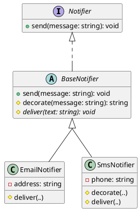
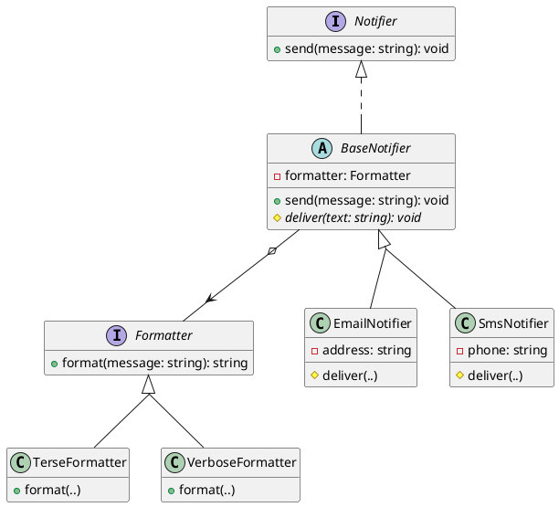

# Extending Behaviour Through Polymorphism

This chapter covers polymorphism, which lets one method call behave according to the object it is called on. It also introduces a second way for classes to relate to each other. An interface lets unrelated classes commit to the same contract, but it cannot say that one class is a _kind of_ another, or let a class reuse another's implementation. Class **extension** does both. A class can extend another, inheriting its behaviour and refining it, and an instance of the extending class can be used wherever the original is expected. Both mechanisms reduce duplication, by letting many types share one implementation and one body of calling code, and both make a system easier to change, since a new type can be added behind an existing contract without rewriting the code that uses it. The next chapter is devoted to that second benefit.

The sections below introduce extension (abstract base classes, `extends`, overriding, and `super`), explain the dynamic dispatch that makes polymorphism possible, describe the responsibilities subtypes take on, and discuss when inheritance causes more problems than it solves.

## Abstract Base Classes

In the previous chapter each notifier implemented `send(..)` itself. Side by side, the two methods would repeat the same opening steps before doing anything specific to the channel: refuse an empty message, then format the alert text. Copying that logic into every channel is what the principle of **don't repeat yourself** (DRY) warns against. Each copy is another place the rule has to be changed, and copies drift apart as some are updated and others are forgotten, so a rule is best kept in one place. An interface cannot hold that shared work, because an interface has signatures and no bodies. A class can.

The shared work goes in a **base class**, which holds the functionality common to a family of related classes so that each can build on it instead of repeating it. Our base class is also **abstract**, meaning it cannot be created on its own and exists only to be built on. An abstract class can have two kinds of member: concrete ones, with a body that the whole family shares, and **abstract** ones, declared without a body for each class in the family to fill in.

```typescript
abstract class <Name> implements <Interface> {
    // concrete members shared by every subclass, and
    // abstract members that each subclass must provide:
    protected abstract <methodName>(<parameters>): <ReturnType>;
}
```

For the notifiers, the shared `send(..)` and a default formatting step go in the base class, and the delivery step specific to each channel is left abstract:

```typescript
abstract class BaseNotifier implements Notifier {
    public send(message: string): void {
        if (message.length === 0) {
            return; // shared rule: an empty alert is never delivered
        }
        this.deliver(this.decorate(message));
    }

    protected decorate(message: string): string {
        return "[ALERT] " + message;
    }

    protected abstract deliver(text: string): void;
}
```

`BaseNotifier` provides `send(..)` and a default `decorate(..)`, and declares `deliver(..)` as _abstract_: it has no body here, and every concrete subclass must supply one. Only `send(..)` is `public`, because it is part of the `Notifier` contract. `decorate(..)` and `deliver(..)` are internal steps, so they are `protected`, reachable inside the class and its subclasses but not from outside.

### Extending the Base Class

A concrete channel extends `BaseNotifier` and supplies only its own delivery:

```typescript
class EmailNotifier extends BaseNotifier {
    private readonly address: string;

    constructor(address: string) {
        super();
        this.address = address;
    }

    protected deliver(text: string): void {
        // deliver `text` to this.address over email
    }
}
```

`EmailNotifier` has no `send(..)` method of its own. It inherits the one in `BaseNotifier`. The `super()` call in its constructor runs the base class constructor, which a subclass must do before using `this`.

### Overriding Methods

A subclass can also **override** an inherited method, replacing it with its own version. SMS messages have a length limit, so `SmsNotifier` refines `decorate(..)`, calling the base version through `super` and then shortening the result:

```typescript
class SmsNotifier extends BaseNotifier {
    private readonly phone: string;

    constructor(phone: string) {
        super();
        this.phone = phone;
    }

    protected decorate(message: string): string {
        return super.decorate(message).slice(0, 160); // SMS length limit
    }

    protected deliver(text: string): void {
        // deliver `text` to this.phone over SMS
    }
}
```

`super.decorate(message)` calls the base class's version, and the subclass shortens its result, so the shared formatting is reused rather than copied. Overriding a method, and calling `super` to build on the inherited version, are the two basic ways to refine a base class.


<!-- caption="BaseNotifier providing common features." -->

<details class="tooltip ts-tips">
<summary>Abstract Classes and <code>protected</code></summary>

An `abstract class` cannot be instantiated. `new BaseNotifier()` is a compile error, because the class exists only to be extended. An `abstract` method has a signature but no body, and a subclass that does not provide one does not compile, so the base class guarantees that every subclass fills in the missing step. The encapsulation chapter introduced `public` and `private`, and `protected` is a third visibility modifier. A protected member is visible inside the class and any subclass, but not to outside callers. That is what `decorate(..)` and `deliver(..)` need, since they are internal steps of delivery and not part of the public `Notifier` contract.

</details>

## Dynamic Dispatch

The notifiers now share a `send(..)` method, and something less obvious is also happening. **Polymorphism** is the ability of one piece of code to work with many types and to behave, for each, according to that type. We have already seen it: `alertAll(..)` calls `channel.send(message)`, and the right delivery happens whether the channel is email or SMS. What makes this work is **dynamic dispatch**. When a method is called through a variable, the method body that runs is chosen at run time from the variable's _actual_ type, not its _apparent_ type.

Consider a single channel held at the interface type:

```typescript
const channel: Notifier = new SmsNotifier("+1-555-0100");
channel.send("disk almost full");
```

The apparent type of `channel` is `Notifier`, so the compiler checks only that `Notifier` has a `send(..)`. At run time the object is an `SmsNotifier`, and the call resolves in steps:

1. `send(..)` is not defined on `SmsNotifier`. It is inherited from `BaseNotifier`, so `BaseNotifier`'s `send(..)` runs.
2. That `send(..)` calls `this.decorate(message)`. `this` is the `SmsNotifier`, which overrides `decorate(..)`, so the _subclass's_ `decorate(..)` runs and truncates the formatted text.
3. That `send(..)` then passes the decorated text to `this.deliver(..)`. `deliver(..)` is abstract in the base, and `this` is the `SmsNotifier`, so the _subclass's_ `deliver(..)` runs and sends over SMS.

Steps 2 and 3 show how this works. The calls to `decorate(..)` and `deliver(..)` are written inside `BaseNotifier`, but the versions that run are the ones belonging to the actual object. When a method calls `this.something()`, dispatch finds the right `something` for whatever object `this` is. This is what lets a base class lay out a sequence of steps and leave the steps themselves to its subclasses.

The same mechanism is what makes `alertAll(..)` work across a mixed list:

```typescript
const channels: Notifier[] = [
    new EmailNotifier("ops@example.com"),
    new SmsNotifier("+1-555-0100")
];
alertAll(channels, "deploy finished");
```

`alertAll(..)`'s loop body is the single line `channel.send(message)`. On the first pass it delivers an email and on the second an SMS, because each `send(..)` dispatches to the actual object behind it. This is polymorphism: one call site with different behaviour for each type, chosen at run time by dynamic dispatch.

This is the apparent and actual type distinction from the previous chapter, now affecting behaviour. The compiler reasons about apparent types, in the static view, and dispatch happens over actual types, in the dynamic view. Writing `channel: Notifier` decides which calls are legal, and the actual object decides what those calls do. This is also one of the most common ways a design preserves implementation freedom. A caller that can see only the apparent type cannot depend on the actual one, so the object behind the variable can change its representation, or be a different class entirely, without any caller noticing.

## Honouring the Contract

Because a subclass instance can stand in wherever the base type or interface is expected, `alertAll(..)` will give a message to whatever `Notifier` it receives and trust it to deliver. The subtype takes on a responsibility: it must honour the contract callers depend on, or code written against the supertype will be wrong even though it compiles.

`SmsNotifier` meets that responsibility. Its `decorate(..)` shortens the text, but `send(..)` still delivers the message, which is all the `Notifier` contract promises: the recipient gets the alert, within the limits of the channel. A subclass that silently _dropped_ messages longer than 160 characters would break the contract, because `alertAll(..)` promises its callers that every channel is told, and this one would fail to deliver without saying so. The signatures would still match, so the compiler would say nothing. The violation would be in behaviour, not types. A subtype may specialise _how_ it does a job, but it must still do the job the supertype describes.

<details class="tooltip deep-dive">
<summary>Demanding No More, Promising No Less</summary>

The contracts from [Part 1](../part1/index) make the rule precise. A method's precondition is what it demands of callers, and its postcondition is what it guarantees in return. A subtype honours the supertype's contract when it demands no more and guarantees no less. If a subclass's `send(..)` rejected messages the base accepted, for example by also forbidding whitespace, it would _strengthen_ the precondition, and a caller relying on the base's looser rule would break. If it delivered less than the base promised, it would _weaken_ the postcondition. A subclass must also preserve any invariant the base maintains. Under these conditions, substituting a subtype for its supertype is always safe, and they are why an override may change how a method works but not what it promises. This rule is known as the **Liskov substitution principle**, after the computer scientist Barbara Liskov, who stated it.

</details>

## `is-a` and `can-do`

There are now two ways for a class to take on a type, and the difference guides which to use. `EmailNotifier` _extends_ `BaseNotifier`: it _is a_ kind of notifier, and it inherits the base's implementation along with its type. `RecordingNotifier` from the previous chapter _implements_ `Notifier` directly: it _can do_ what a notifier does, committing to the contract while sharing none of the base's code. Both can be used as a `Notifier`, but they relate to the hierarchy differently.

`extends` is usually used when one class is a more specific kind of another and can reuse its implementation. `implements` is more appropriate when a class only needs to satisfy a contract, with an implementation of its own. Extension provides both an inherited _implementation_ and an inherited _type_, while an interface provides only the type and leaves the implementation entirely to the class. A test double like `RecordingNotifier` needs the type and none of the implementation, which is why it implements rather than extends.

A test double can also extend a base class, when the test needs the inherited behaviour. This one records what the inherited pipeline delivers, so the pipeline can be checked without sending anything:

```typescript
class CapturingNotifier extends BaseNotifier {
    public delivered: string = "";

    protected deliver(text: string): void {
        this.delivered = text;
    }
}

test("a subclass inherits the send pipeline and supplies only delivery", () => {
    const channel = new CapturingNotifier();
    channel.send("disk full");
    expect(channel.delivered).to.equal("[ALERT] disk full");
});
```

`CapturingNotifier` has no `send(..)` of its own, yet calling `send(..)` formats the message with the base's `decorate(..)` and then dispatches to the subclass's `deliver(..)`. The `[ALERT]` prefix in the recorded text comes from the inherited pipeline, and the captured delivery shows dynamic dispatch routing the final step to the actual type.

`RecordingNotifier` implemented `Notifier` directly, because its test only needed to confirm what was sent. `CapturingNotifier` extends `BaseNotifier` because this test needs the inherited pipeline. Extending the abstract class is the only way to confirm that the prefix added by `decorate(..)` arrives in what `deliver(..)` receives.

A class may extend at most one class, but it may implement any number of interfaces. Interfaces themselves can extend other interfaces, composing a larger contract from smaller ones:

```typescript
interface ConfirmingNotifier extends Notifier, Confirmable {
    // ...
}
```

A class implementing `ConfirmingNotifier` must satisfy both `Notifier` and `Confirmable`. Small contracts combine into larger ones without any class being forced to depend on more than it needs.

## Replacing Branches

The next chapter builds on the contrast between this design and the alternative. Without polymorphism, sending over a channel chosen at run time means branching on a tag:

```typescript
function notify(channel: string, target: string, message: string): void {
    if (channel === "email") {
        // format and deliver by email to target
    } else if (channel === "sms") {
        // format and deliver by SMS to target
    }
}
```

Every channel is a branch in one function, and `notify(..)` has to be modified each time a new channel is added. The polymorphic design replaces the branch with types. Each channel is a class, the shared shape lives in the interface, and dynamic dispatch rather than an `if` decides which code runs. The branch disappears, and so does the one function that had to know about every channel.

Instead, the caller holds a `Notifier`, already constructed as the right kind of channel, and asks it to act:

```typescript
function notify(channel: Notifier, message: string): void {
    channel.send(message);
}
```

`notify(..)` no longer names a channel or lists the kinds. It works through the `Notifier` contract, and dynamic dispatch routes `send(..)` to whatever channel it was given. Adding a channel adds a class, and this function does not change.

<details class="tooltip link-110">
<summary>Branching on a Variant</summary>

In CPSC 110 you handled a data type with several variants by branching on which variant you had, usually with a `cond` that asked what kind of value this was and what to do for it. That branch is the functional version of the `notify(..)` above: one place that lists every case. An interface with several implementations reverses this. Instead of one function that branches over the variants, each variant becomes a type that carries its own behaviour, and dispatch replaces the branch. The information is the same. What changes is whether adding a case means editing a shared branch or adding a new type.

</details>

Removing the branch is useful in itself, but its main benefit is that a new channel can be added as a new class without touching `notify(..)`, `alertAll(..)`, or any existing channel. The next chapter looks at that property directly.

## Composition Over Inheritance

Class extension has dedicated syntax, but it is used more often than it should be. Most relationships between classes are better expressed by composition, where one class _holds_ another as a field and delegates to it. Classes more often have a _has-a_ relationship with each other than an _is-a_ one.

To see when composition fits better, suppose the alert text needs more than one format, terse for SMS and verbose for email, and the choice of format should be independent of the channel. Building formatting into the class hierarchy through `decorate(..)` ties each format to a class. A verbose email and a terse email would be two classes, and a third format would multiply the hierarchy again. Holding a formatter keeps the two concerns separate. The revised base class below still owns the shared steps, including the empty-message rule, and delegates formatting to whichever `Formatter` the channel was built with:

```typescript
interface Formatter {
    format(message: string): string;
}

abstract class BaseNotifier implements Notifier {
    private readonly formatter: Formatter;

    constructor(formatter: Formatter) {
        this.formatter = formatter;
    }

    public send(message: string): void {
        if (message.length === 0) {
            return; // the shared rule stays in one place
        }
        this.deliver(this.formatter.format(message));
    }

    protected abstract deliver(text: string): void;
}

class EmailNotifier extends BaseNotifier {
    private readonly address: string;

    constructor(address: string, formatter: Formatter) {
        super(formatter);
        this.address = address;
    }

    protected deliver(text: string): void {
        // deliver `text` to this.address over email
    }
}
```

Any formatter can now be paired with any channel by passing a different `Formatter` when the notifier is built, and a new format is a new `Formatter` class that no channel needs to know about. Inheritance cannot offer this, because a class's base is fixed when the class is written, while a held collaborator can be chosen when the object is created. The design uses both mechanisms: inheritance shares the steps every channel performs, and composition supplies the part that varies independently of the channel. The rest of this part keeps the simpler `BaseNotifier` from the start of the chapter, since its notifiers need only one format.


<!-- caption="The base class holds a Formatter and delegates formatting to it, while each channel still inherits the shared steps." -->

This matters more as the system grows. Suppose it must support _c_ channels in _f_ formats. Building formatting into the hierarchy needs a class for each combination, _c_ times _f_ of them, and every new channel or format multiplies the count again. Holding the formatter as a collaborator needs only _c_ channel classes and _f_ formatter classes, _c_ plus _f_ in all, and a new format is a single class that works with every existing channel without changing any of them.

There are other reasons composition is the more flexible default, and they are the implementation freedom chapter's argument applied to collaborators. A class may extend only one base, but it can hold as many collaborators as it needs, so capabilities that could never share one inheritance line can sit side by side. A collaborator is also chosen when the object is built, and can even be swapped while the program runs, whereas a base class is fixed in the source when the subclass is written.

Composition is also a looser coupling. A subclass depends on its base class's _implementation_, not only its contract, so it is affected by changes in how the base works. A collaborator is used only through its public contract, the boundary the interfaces chapter argued for. For these reasons, use inheritance only when one class is a kind of another and shares a stable core of behaviour, and prefer composition everywhere else.

<details class="tooltip deep-dive">
<summary>Fragile Base Classes</summary>

Because a subclass builds on its base class's implementation, a change inside the base that looks harmless can break a subclass without any change to the subclass itself. Suppose a base method is rewritten to call another of the base's methods that a subclass has overridden. The override now runs at a moment it never did before, and behaviour the subclass relied on changes silently. The more subclasses a base has, and the deeper the hierarchy, the more places such a change can reach, and the harder the base becomes to modify safely. This is the **fragile base class problem**. A collaborator held by composition does not have it, because it is used only through its public methods, so its internals can change freely as long as the contract holds.

</details>

#### Sharing and Varying Behaviour

This chapter added a new way for classes to relate. Class extension lets one class be a more specific kind of another, inheriting a base's implementation and refining it through overriding and `super`, while an abstract base defines a shared sequence of steps and leaves the varying ones to its subclasses. Polymorphism and dynamic dispatch let a single call do different work for different actual types, so code written against a supertype works with every subtype, present and future, as long as each honours the contract. Because inheritance couples classes more tightly, it is reserved for true is-a relationships, and composition remains the default way for classes to work together.

<details class="tooltip exercise">
  <summary>Exercise: Quiz Scoring Schemes</summary>

> As a quiz platform developer, I want to score quiz submissions under different rules, so that the platform can offer standard and competitive formats without duplicating the logic for recording answers and tallying totals.

Here is the abstract base class:

```typescript
abstract class QuizScorer {
    private points: number = 0;
    private total: number = 0;

    /**
     * Records the result of one answer.
     * @param {boolean} correct whether the answer was correct
     */
    submit(correct: boolean): void {
        this.total = this.total + 1;
        if (correct) {
            this.points = this.points + this.correctPoints();
        } else {
            this.points = this.points + this.incorrectPoints();
        }
    }

    /** The accumulated score. */
    score(): number {
        return this.points;
    }

    /** The number of answers submitted so far. */
    count(): number {
        return this.total;
    }

    /** Points awarded for a correct answer. */
    protected abstract correctPoints(): number;

    /** Adjustment applied for an incorrect answer; typically zero or negative. */
    protected abstract incorrectPoints(): number;
}
```

Two scoring schemes extend `QuizScorer`:

- `StandardScorer`: a simple pass-or-fail scheme. A correct answer scores 1 point and an incorrect answer scores 0.
- `NegativeMarkingScorer`: a competitive scheme. A correct answer scores 1 point and an incorrect answer deducts 1, discouraging guessing.

Work through the following:

1. _Implementing the scorers._ Each scorer supplies only `correctPoints()` and `incorrectPoints()`. Implement both classes. How many methods does each require, and which parts of `QuizScorer` does each inherit unchanged?
2. _Abstract vs concrete._ `submit` is concrete while the two point methods are abstract. What would break if `submit` were abstract instead, and why is having it concrete beneficial?
3. _Adding a scorer._ Write a `WeightedScorer` that awards 3 points per correct answer and 0 for incorrect ones. How many methods must you write, and how many existing lines must you change?
4. _Testing._ Write tests for `NegativeMarkingScorer` covering three sequences: all correct, all incorrect, and one correct followed by one incorrect. Assert both `score()` and `count()` after each. What is the minimum number of sequences that exercises every branch in `submit`?

</details>
