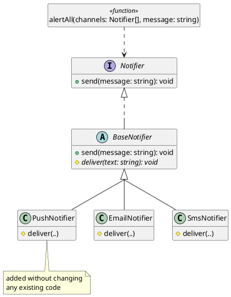

# Growing Systems with the Open/Closed Principle

Successful software systems keep changing. New kinds of users, delivery channels, and pricing rules are added throughout a system's life, and a codebase that cannot absorb them without breaking what already works becomes harder to change. Polymorphism makes a system extensible by supporting the **Open/Closed Principle**. Code that follows this principle is open for extension, so new behaviour can be added, and closed for modification, so adding that behaviour requires no changes to existing code that already works.

This chapter shows what the principle looks like in practice, looks at when to apply it, and ends by drawing together the design principles from this part of the course.

## Open and Closed

A unit of code is **open for extension** when new behaviour can be added to it, and **closed for modification** when adding that behaviour does not require existing code to change. Interfaces and polymorphism make both possible at once. When code depends on an abstraction rather than on concrete types, we can add new behaviour by writing a new implementation of that abstraction, and leave any code already written against the abstraction unchanged.

The notifier system already has this shape. `alertAll(..)` depends on the `Notifier` interface, and each channel is an implementation of it:

```typescript
function alertAll(channels: Notifier[], message: string): void {
    for (const channel of channels) {
        channel.send(message);
    }
}
```

`alertAll(..)` names no concrete channel. Whether it can accept a new kind of channel without being changed tests whether the design is open in the way the principle describes.

#### Adding a Channel

> As a DevOps engineer, I want to add push notification delivery to the alert system, so that on-call engineers are reached on their mobile devices even when they are not monitoring email.

Suppose alerts must now also go out as push notifications. There are two ways to meet the requirement.

One is the tag-switching approach from the previous chapter. The `notify(..)` function that branches on a channel string gains an `else if` branch for push, which means editing code that already works and is already tested. In a real system the channel tag is rarely checked in only one place. Formatting, validation, and logging tend to branch on it too, so a single conceptual change is spread across every function that switches on the tag.

The other is the design we have been building, where a new channel is a new implementation of `Notifier`. Because the channels share a delivery skeleton, it extends `BaseNotifier` and supplies only its own delivery:

```typescript
class PushNotifier extends BaseNotifier {
    private readonly deviceId: string;

    constructor(deviceId: string) {
        super();
        this.deviceId = deviceId;
    }

    protected deliver(text: string): void {
        // deliver `text` to this.deviceId as a push notification
    }
}
```

Adding `PushNotifier` changes nothing else. `Notifier`, `BaseNotifier`, `EmailNotifier`, `SmsNotifier`, and `alertAll(..)` are all unchanged, and a push channel can be added to any list of notifiers:

```typescript
alertAll([
    new EmailNotifier("ops@example.com"),
    new SmsNotifier("+1-555-0100"),
    new PushNotifier("device-42")
], "deploy finished");
```

The first design meets the new requirement by editing code that already works, and the second by adding new code. The second is open for extension and closed for modification. The first is not closed for modification.


<!-- caption="Adding PushNotifier requires no change to Notifier, alertAll, or the existing channels." -->

<details class="tooltip link-110">
<summary>When the Data Grows</summary>

In CPSC 110, a function over a data type with several variants had one `cond` branch per variant. Adding a variant to the data definition meant revisiting every function that branched on that data, so the cost of growing the data grew with the number of functions that processed it. The polymorphic design reverses this. A new variant is a new class that carries its own behaviour, and the functions written against the interface do not change at all.

</details>

## Why Add Instead of Edit

The reason to prefer adding code to editing it comes from [Chapter 9](../part1/09_validation). Code that already works has been tested, and every edit to it risks breaking something that worked before, a regression. Editing `notify(..)` to add push reopens the email and SMS branches, which then have to be read, possibly disturbed, and re-tested. Adding `PushNotifier` touches none of that. The existing channels and their tests are left alone, so they cannot regress. The only new tests are for `PushNotifier`, and the existing suite still passes.

This is what "closed for modification" provides, and it is easy to overstate. It is not a rule that code must never change, since bugs are still fixed and contracts are still refined. It means that adding a foreseen _kind_ of new behaviour should not require reopening code that already works. A system with this property can grow safely as it gets larger, because a new feature's impact is contained in the new code rather than spread through previously tested code.

<details class="tooltip deep-dive">
<summary>Many Clients, One Change</summary>

In the notifier system, `alertAll(..)` is the only caller of `send`. In a real codebase, a widely used abstraction can have dozens or hundreds of callers spread across many files and modules, written by different teams at different times. If meeting a new requirement means editing every concrete type those callers name, the change has to be made in as many places as there are callers, each of which must be found, read, understood, retested, and redeployed. The closed-for-modification property removes that cost.

The **plugin architecture** pattern takes this idea further. The core of the application depends only on an abstraction, and concrete implementations are supplied separately and connected at startup, without the core naming them at all:

```typescript
// core: depends only on the abstraction, names no concrete channel
function alertAll(channels: Notifier[], message: string): void {
    for (const channel of channels) {
        channel.send(message);
    }
}

// startup, outside the core: loadConfiguredChannels is the one place
// that names concrete channel types, reading them from configuration
const channels: Notifier[] = loadConfiguredChannels();
alertAll(channels, "system ready");
```

Adding a new channel means writing one new class and adding it to the configuration, and the core and every other caller are left untouched. This is how text editors accept plug-ins, IDEs accept extensions, and operating systems accept drivers. The core was closed for modification before the extensions existed, and each extension adds behaviour by conforming to the abstraction the core already depends on.

</details>

## The Axis of Change

Openness has a cost. Depending on an abstraction adds indirection: the interface, the dispatch, the extra class. That indirection buys flexibility along _one_ axis of change, and the skill is in choosing the right axis. For the notifier system the axis was clear from the start. New channels are the kind of thing that gets added over time, so the `Notifier` interface is drawn across that axis and the indirection is justified. The runtime cost of the indirection is small. The main cost is the extra concepts an engineer has to understand.

This repeats the encapsulation chapter's advice to hide what is most likely to change, applied to whole behaviours: put the abstraction boundary where new variants will appear. A boundary placed this way is an **extension point**, a place where behaviour can be varied by adding code rather than by editing code that already works, and it is what "open for extension" means in practice. It also means we should not add extension points where new variants are unlikely. Building an elaborate one for variation that never arrives adds indirection without any value.

<details class="tooltip deep-dive">
<summary>Speculative Generality</summary>

The opposite of a rigid design is an over-flexible one. Adding interfaces, base classes, and extension points for variation you only imagine you might need is a recognised design smell, sometimes called _speculative generality_: the indirection is real while the flexibility is hypothetical. Build for the variation you have evidence for, not the variation you can imagine. It is straightforward to open a concrete design along a new axis once that axis appears, and costly to carry a dozen speculative ones that never do.

</details>

No design is open to _every_ change. The notifier system is open along the axis of new channels, and says nothing about other axes. If the new requirement were to deliver a single alert to a whole group, or to schedule one for later, `Notifier` would not help, and meeting it might require modification. A design is open only along the axis it was built for, and an unanticipated axis is a new design problem. Choosing the axis well, and accepting that a design cannot be open along every axis at once, is the judgement the principle requires.

## The Principles Together

The Open/Closed Principle is the last of a set of principles this part of the course has built up, and each one supports the others:

- **Cohesion** [(Chapter 11)](./02_decomposition): each class, and each interface, is responsible for one thing.
- **Encapsulation** [(Chapter 12)](./03_encapsulation): a class hides its representation behind a contract, so its internals can change without its callers changing.
- **Implementation freedom** [(Chapter 13)](./04_flexibility): what a class means is kept separate from how it is built, so the implementation stays free to change, and each commitment a class avoids is one more thing that can vary.
- **Small contracts** [(Chapter 14)](./05_boundaries): callers depend on a narrow, named abstraction rather than on a concrete class.
- **Substitutability** [(Chapter 15)](./06_extension): many implementations stand behind one contract, each honouring it, so one can stand in for another. This is the Liskov substitution principle.
- **Dependency inversion** (this chapter): high-level code depends on abstractions rather than on concrete classes.
- **Open and closed** (this chapter): together, the principles above let a system grow by adding implementations rather than by editing existing code.

Dependency inversion is new in this chapter. `alertAll(..)` depends on `Notifier`, never on `EmailNotifier` or `SmsNotifier`, so the policy of "alert all channels" is separate from how any one channel delivers. This inversion, where high-level policy depends on an abstraction rather than on a concrete implementation, is called the **Dependency Inversion Principle**.

These are not independent rules to memorise. Each chapter introduced one of them separately, with its own example and argument, which makes them look like seven unrelated pieces of advice. They work more like a single mechanism, which is easiest to see by re-examining something we have already designed.

### One Addition, Taken Apart

Adding `PushNotifier` earlier in this chapter cost one class and one line where the channels are assembled. Each part of that small change depended on a decision made in an earlier chapter.

_That the change is one class at all_ is because the design is cohesive. Delivering an alert over a channel is a single responsibility, held by a single kind of unit, so "support one more channel" means "write one more class". Had delivery been spread across several classes, or bundled with formatting and retry policy, a new channel would have needed changes in several places, and polymorphism could not have reduced it to one.

_That it can store a `deviceId`_ is encapsulation providing implementation freedom. A push channel needs to remember something unlike an email address or a phone number, and it can, because no code outside a channel class has ever been able to see what the channel stores. Each channel's representation was private from the start, so the new channel was free to store whatever it needed.

_That it had to write only `deliver(..)`_ is because of the small contract, together with the shared base from the extension chapter. `Notifier` requires one operation, so conforming to it is cheap, and `BaseNotifier` already holds the steps every channel performs identically, so the new class supplies only the step that differs.

_That `alertAll(..)` accepts it_ is because of substitutability. `PushNotifier` demands nothing of its callers beyond what `Notifier` promises, so code written against the interface is correct for an implementation that did not exist when the code was written.

_That `alertAll(..)` did not have to change_ is because `alertAll(..)` was written against the abstraction rather than against any channel, so nothing in it could become out of date when a channel was added.

The Open/Closed Principle describes the result of following the other principles. A design that follows them is open for extension and closed for modification along the axis it was built for.

### Removing a Principle

The clearest way to see that these principles depend on one another is to remove them one at a time and watch the same change become harder. For each case below, assume the other principles still hold.

_Without cohesion._ Suppose `EmailNotifier` had also owned message formatting and the system's retry policy, because those were added to it when email was the only channel. Adding push now means adding push delivery, push formatting, and push retry, wherever those responsibilities ended up. The interface is still there and still polymorphic, but the change, and its potential to affect existing code, is now spread across three places.

_Without encapsulation._ Suppose `address` had been public, and an audit log had come to read `channel.address` to record who was notified. `PushNotifier` has no address, only a device id. The new channel compiles and satisfies `Notifier`, but breaks the audit log, because a caller depended on a field rather than on behaviour.

_Without implementation freedom._ Suppose `send(..)` had been declared to return the provider's raw response object, so that callers could inspect delivery details. The response object differs between providers, so either `PushNotifier` cannot conform to the contract, or it fabricates a response in a shape that does not fit its provider. The interface exposed a representation, and representations are not interchangeable even when the behaviour is.

_Without small contracts._ Suppose `Notifier` had grown to nine methods over time, such as `send`, `confirmDelivery`, `formatAsHtml`, `setPriority`, and `remainingQuota`. Push supports some of these and not others, so the new class must throw errors from the operations that make no sense for it. Now no caller can rely on any method being available, and the interface is no longer a real contract.

_Without substitutability._ Suppose `PushNotifier.deliver(..)` silently discarded messages longer than the push service accepts. It compiles, it implements the interface, and every existing test still passes. But `alertAll(..)` promises its callers that every channel is told, and that promise is now false, broken by a class the system did not have to be modified to accept.

_Without dependence on the abstraction._ Suppose `alertAll(..)` had been written to check what kind of channel it was holding before deciding how to send. Adding push means editing existing code, and the design is back to the tag-switching approach this chapter started by rejecting.

Each principle contributes to the design, and the value of each depends on the others. The addition was easy only because every one of them held in the existing design.

### When Principles Conflict

The principles do not always agree. Applied without judgement, several of them pull against each other.

Cohesion says to split a class that owns two invariants, but the decomposition chapter also warned that every split adds a name to learn and a file to navigate, and that extracting a class for a rule that will never grow fragments a design without clarifying it. Interface segregation says to prefer many small interfaces, but a system with twenty single-method interfaces can be harder to learn than one with five coherent ones. This chapter says to put an extension point where change is expected, and the speculative generality tooltip says that building an abstraction where change never comes is a design smell.

These tensions have a common source, and it is the most useful idea in this part of the course. Every design decision answers the same question: _what is likely to change?_ Split a class where its reasons to change differ. Draw an interface where new variants will appear. Hide what will vary and expose what will not. When you have a confident answer to that question, the principles agree, because they all follow from it. When they seem to conflict, the disagreement is usually about a prediction, not about design, and it is better argued in those terms than by citing principles at each other.

The judgement this part has asked for is a prediction about which parts of a system will need to change, made with incomplete information and revised as the system shows you where you were wrong.

Predicting the future is hard, and a design decision made today is a claim about requirements that have not yet arrived. There are two ways to get it wrong, and over a career you will make both mistakes. You will build an abstraction for a kind of change that never comes, leaving unnecessary indirection in the design. You will also leave code concrete in the one place a change eventually lands, and the new requirement will have to work around the missing abstraction. The two errors cost different things. An unnecessary abstraction adds indirection, a small cost that every reader pays for as long as it exists. A missing abstraction forces a modification to working code, a larger cost that is paid once.

Prediction draws on evidence you can look for. Parts of a system that have changed before tend to change again. Some variation is inherent in the domain rather than specific to this release: there will be another payment provider, another export format, another delivery channel, and people who work in the domain can usually point these out. Some is visible in the requirements, in a request that says "for now" or names one case out of an obvious family. Reading these signals improves with experience of real systems. Experienced engineers often seem to predict well because they have seen similar systems before, and remember where the last design turned out to be rigid.

For this reason, the principles cannot be applied as a checklist. A checklist can be followed without understanding the system, but a prediction depends on this system, this domain, and what this team has reason to expect. You get better at design by practising it, and by noticing why a design turned out to be wrong. The same reason explains why the judgement stays with the engineer however much of the code is written by tools: deciding which axis of change a system should be open along is not a question about syntax, and no tool can answer it without knowing what the system is for.

Together, the principles decide whether a codebase grows by adding code or by changing it. In a codebase without these properties, each new requirement raises the question of which working files must change, which passing tests might break, and how much existing code must be reread first. In one with them, a new requirement of the anticipated kind is a new file, written and tested while the rest of the system is left alone.

#### Toward Evolution and Scale

A system organised around contracts and polymorphic implementations grows by addition: a new requirement of an anticipated kind is a new class, and the working system around it is left alone. This is how software can keep changing over a long life, which is the subject of the next part of the course.

This chapter leaves one question open. The notifier system depends on `Notifier` everywhere except in one place: wherever the list of channels is assembled, some code must still name `EmailNotifier`, `SmsNotifier`, and now `PushNotifier` to create them. Controlling that one place, so that a new channel can be connected without editing the code that assembles the system, is where [Part 3](../part3/index) begins. It develops the Dependency Inversion Principle into the question of who constructs the concrete objects and how they are connected at the program's boundary, and then takes up the larger questions of evolution and scale: how a program is built from interchangeable parts, how it accepts extensions it was not shipped with, and how change is managed across many modules and the teams that own them.

<details class="tooltip exercise">
  <summary>Exercise: A Text Transformation Pipeline</summary>

> As a content pipeline developer, I want to apply a configurable sequence of text transformations, so that new processing steps can be added without changing the pipeline itself.

Design and implement a text transformation pipeline from scratch.

A _text transformer_ is any object that can take a string and return a transformed version of it. Design a `TextTransformer` interface with a single `transform(text: string): string` method.

A _pipeline_ applies a sequence of transformers in order: the output of one becomes the input of the next. Implement an `applyAll` function that takes a list of `TextTransformer` objects and a starting string, applies each in sequence, and returns the final result.

Implement two initial transformers: a `TrimTransformer` that strips leading and trailing whitespace, and an `UpperCaseTransformer` that converts its input to uppercase.

Work through the following:

1. _Extension._ Add a `PrefixTransformer` that takes a fixed string in its constructor and prepends it to its input. List every class or function outside `PrefixTransformer` itself that needed to change.
2. _Order matters._ Write a test showing that applying trim then uppercase to `"  hello  "` produces `"HELLO"`. Write a second test showing that reversing the two transformers produces a different result. What does this say about what `applyAll` guarantees?
3. _Validation._ Write a `CapturingTransformer` that records the input it receives and returns it unchanged. Use it to confirm that `applyAll` passes the correct accumulated text to each transformer in sequence.
4. _The axis._ Your pipeline is open for new transformers. Suppose the requirement is to skip a transformation when its input is shorter than a given length. What would need to change, and why does `TextTransformer` not help with this?

</details>
