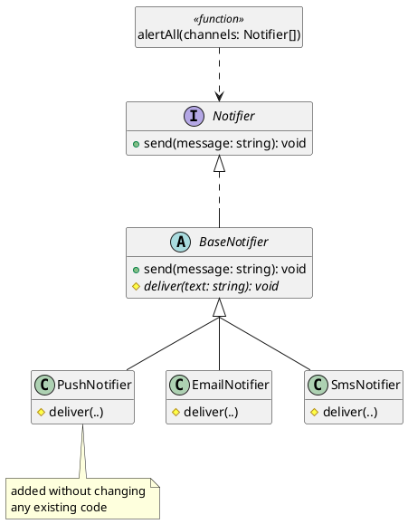

# Growing Systems with the Open/Closed Principle

Successful software systems are constantly evolving. A new kind of user, a new delivery channel, a new pricing rule: new requirements are added throughout the life of a system, and a codebase that cannot absorb them without breaking what already works becomes harder to change. Polymorphism offers one way to make a system extensible by enabling the **Open/Closed Principle**. Code that follows this principle is open for extension, so new behaviour can be added, and closed for modification, so adding that new behaviour requires no changes to existing code that already works.

This chapter shows what the principle looks like in practice, examines when to apply it, and closes by drawing together the design principles that this part of the course have established.

## Open for Extension, Closed for Modification

A unit of code is **open for extension** when new behaviour can be added to it, and **closed for modification** when adding that behaviour does not require existing code to change. The two stop being in tension once an abstraction is in place. The approach is enabled by interfaces and polymorphism. By making code depend on an abstractions rather than on concrete types, we can add new behaviour by writing a new implementation of that abstraction, and leave any code previously written against the abstraction unchanged.

The notifier system already has this shape. `alertAll(..)` depends on the `Notifier` interface, and each channel is an implementation of it:

```typescript
function alertAll(channels: Notifier[], message: string): void {
    for (const channel of channels) {
        channel.send(message);
    }
}
```

`alertAll(..)` names no concrete channel. Whether it can take on a new kind of channel without itself being changed is the test of whether the design is open in the way the principle asks for.

#### Adding a Channel

> As a DevOps engineer, I want to add push notification delivery to the alert system, so that on-call engineers are reached on their mobile devices even when they are not monitoring email.

Suppose alerts must now also go out as push notifications. There are two ways to meet the requirement, and the difference between them is the whole point.

One design is the tag-switching approach from the previous chapter: the `notify(..)` function that branches on a channel string must add an `else if` branch for push, reopening code that already works and is already tested. In a real system the channel tag is rarely tested in only one place: formatting, validation, and logging tend to branch on it too, so a single conceptual change is scattered across every function that switches on the same tag.

The second design is the one we have been building. A new channel is a new implementation of `Notifier`. Because the channels share a delivery skeleton, it extends `BaseNotifier` and supplies only its own delivery:

```typescript
class PushNotifier extends BaseNotifier {
    private readonly deviceId: string;

    constructor(deviceId: string) {
        super();
        this.deviceId = deviceId;
    }

    protected deliver(text: string): void {
        // deliver `text` to this.deviceId as a push notification
    }
}
```

Adding `PushNotifier` changes nothing else. `Notifier`, `BaseNotifier`, `EmailNotifier`, `SmsNotifier`, and `alertAll(..)` are all exactly as they were, and a push channel drops into any list of notifiers:

```typescript
alertAll([
    new EmailNotifier("ops@example.com"),
    new SmsNotifier("+1-555-0100"),
    new PushNotifier("device-42")
], "deploy finished");
```

One design meets the new requirement by editing code that already works; the other by adding code that did not exist before. That is the difference between a design closed to extension and one open to it.


<!-- caption="Adding PushNotifier requires no change to Notifier, alertAll, or the existing channels." -->

<details class="tooltip link-110">
<summary>When the Data Grows</summary>

In CPSC 110, a function over a data type with several variants had one `cond` branch per variant. Adding a variant to the data definition meant revisiting every function that branched on that data to add the new case, so the cost of growing the data scaled with the number of functions that processed it. The polymorphic design reverses this: a new variant is a new class that carries its own behaviour, and the functions written against the interface do not change at all. A change that was once spread across every function becomes a single addition.

</details>

## Why Closed to Modification Matters

Why prefer adding code to editing it? The answer comes from [Chapter 9](../part1/09_validation). Code that already works is code that has been tested, and every edit to it is a chance to break something that worked before, a regression. Editing `notify(..)` to add push reopens the email and SMS branches: they have to be read, possibly disturbed, and re-tested to be sure they still work. Adding `PushNotifier` touches none of that. The existing channels and their tests are left alone, so they cannot regress; the only new tests are the ones for `PushNotifier`, and the existing suite stays green.

This is what "closed to modification" provides, and it is worth being precise about what it does not mean. It is not a rule that code must never change; bugs are still fixed and contracts are still refined. It means that adding a foreseen _kind_ of new behaviour should not require reopening code that already works. A system with that property grows more safely the larger it gets, because the impact of a new feature is localized within the new file rather than throughout a breadth of previously-tested code.

<details class="tooltip deep-dive">
<summary>Many Clients, One Change</summary>

In the notifier system, `alertAll(..)` is the only caller of `send`. In a real codebase the picture is often quite different: a widely-used abstraction can have dozens or hundreds of callers spread across many files and modules, written by different teams at different times. If meeting a new requirement means editing every concrete type those callers already name, the change has to be made in as many places as there are callers, each of which must be found, read, understood, retested, and redeployed. That is the cost the closed-to-modification property removes.

The **plugin architecture** pattern takes this idea to its logical end. The core of the application depends only on an abstraction; concrete implementations are supplied separately and wired in at startup, without the core naming them at all:

```typescript
// core: depends only on the abstraction, names no concrete channel
function alertAll(channels: Notifier[], message: string): void {
    for (const channel of channels) {
        channel.send(message);
    }
}

// startup: the one place that names concrete types, outside the core
const channels: Notifier[] = loadConfiguredChannels();
alertAll(channels, "system ready");
```

Adding a new channel means writing one new class and adding it to the configuration; the core and every other caller are left untouched. This is why text editors accept plug-ins, IDEs accept extensions, and operating systems accept drivers: the core was closed to modification before the extensions existed, and each extension adds behaviour by conforming to the abstraction the core already depends on.

</details>

## Choosing the Axis of Change

Openness comes at a cost. Depending on an abstraction adds indirection: the interface, the dispatch, the extra class. You spend that indirection to buy flexibility along _one_ axis of change, and the skill is in choosing the right axis. For the notifier system the axis was clear from the start: new channels are exactly the kind of thing added over time, so the `Notifier` interface is drawn across that axis and the indirection is justified. While there is a small runtime overhead for this indirection, the primary risk is one of conceptual overhead for engineers.

This reiterates the encapsulation chapter's advice to hide what is most likely to change, now applied to whole behaviours: put the abstraction boundary where new variants will appear. A boundary placed this way is an **extension point**, a place where behaviour can be varied by adding code rather than by editing code that already works, and it is what "open for extension" means in practice. This also means we should not put extension points where new variants are unlikely. Building an elaborate one for variation that never arrives adds conceptual indirection without any value.

<details class="tooltip deep-dive">
<summary>Speculative Generality</summary>

The opposite mistake to a rigid design is an over-flexible one. Adding interfaces, base classes, and extension points for variation you only imagine you might need is a recognised design smell, sometimes called _speculative generality_: the indirection is real while the flexibility is hypothetical. The guidance from the testing chapters applies here too, build for the variation you have evidence for, not the variation you can imagine. It is straightforward to open a concrete design along a new axis once that axis does appear, and costly to carry a dozen speculative ones that never do.

</details>

It is also why no design is open to _every_ change. The notifier system is open along the axis of new channels; it says nothing about other axes. If the new requirement were to deliver a single alert to a whole group, or to schedule one for later, `Notifier` would not help, and meeting it might well require modification. A design is closed along the axis it was built for and open along that same axis; an unanticipated axis is a new design problem. Choosing the axis well, and accepting that a design cannot be open along all of them at once, is the judgement the principle asks for.

## The Principles Together

The Open/Closed Principle is the last piece of a set the design part has been assembling, and the pieces hold one another up:

- **Cohesion** [(Chapter 11)](./02_decomposition): each class, and each interface, is responsible for one thing.
- **Encapsulation** [(Chapter 12)](./03_encapsulation): a class hides its representation behind a contract, so its internals can change without its callers changing.
- **Implementation freedom** [(Chapter 13)](./04_flexibility): what a class means is kept separate from how it is built, so the how stays free to change and each commitment a class declines is one more thing that can vary.
- **Small contracts** [(Chapter 14)](./05_boundaries): callers depend on a narrow, named abstraction rather than on a concrete class.
- **Substitutability** [(Chapter 15)](./06_extension): many implementations stand behind one contract, each honouring it, so one can stand in for another.
- **Open and closed** (this chapter): the above let a system grow by adding implementations rather than by editing existing code.

These are not independent rules to memorise, and the list understates how tightly they are bound together. Each chapter introduced one of them on its own, with its own example and its own argument, which makes them look like six pieces of advice that happen to appear in the same course. They are closer to a single mechanism, and the way to see that is to reexamine something we have already designed.

### One Addition, Taken Apart

Adding `PushNotifier` earlier in this chapter cost one class and one line at the point of assembly. That is the outcome the principle promises, and it is worth asking what had to be true for it to happen, because every part of that small change was enabled by a decision made in an earlier chapter.

```typescript
class PushNotifier extends BaseNotifier {
    private readonly deviceId: string;

    constructor(deviceId: string) {
        super();
        this.deviceId = deviceId;
    }

    protected deliver(text: string): void {
        // deliver `text` to this.deviceId as a push notification
    }
}
```

_That the change is one class at all_ is because of a cohesive design. Delivering an alert over a channel is a single responsibility, held by a single kind of unit, so "support one more channel" corresponds to "write one more class". Had delivery been spread across several classes, or bundled together with formatting and retry policy, a new channel would have been a change in several places at once, and no amount of polymorphism could have collapsed it back into one single location.

_That it may store a `deviceId` at all_ is encapsulation enabling implementation freedom. A push channel needs to remember something entirely unlike an email address or a phone number, and it can, because no code outside the class has ever been able to see what a channel stores. Each channel's representation was private from the beginning, so the new channel was free to store whatever internal representation it needed.

_That it had to write only `deliver(..)`_ is the small contract, together with the shared base from the extension chapter. `Notifier` requires one operation, so conforming to it is cheap; `BaseNotifier` already holds the steps every channel performs identically, so the new class supplies only the step that differs.

_That `alertAll(..)` accepts it_ is because of substitutability. `PushNotifier` doesn't demand anything of its callers beyond what `Notifier` promises, so code written against the interface is correct for an implementation that did not exist when the code was written.

_That `alertAll(..)` did not have to change_ is the last piece: `alertAll(..)` was written against the abstraction rather than against any channel, so nothing in it could become out of date when a channel was added.

The Open/Closed Principle is not a seventh item alongside those five. It is what you observe from outside when a design encompasses all five simultaneously. This is why it reads as a property of a system rather than as a technique: designers do not apply open/closed directly, by intentionally reasoning about the other principles and judiciously integrating them with their systems they indirectly support the open/closed principle, and all of the benefits this enables.

### What We Lose When A Principle is Missing

The clearest way to see that these principles depend on one another is to remove them one at a time and watch the same change become more and more difficult. For each case below, assume the other five principles are still supported.

_Without cohesion._ Suppose `EmailNotifier` had also owned message formatting and the system's retry policy, because those were added to it when email was the only channel. Adding push now means adding push delivery, push formatting, and push retry, in each of the classes those responsibilities ended up in. The interface is still there and is still polymorphic, but now the change (and it's potential to impact existing code) is spread across three locations.

_Without encapsulation._ Suppose `address` had been public, and an audit log had come to read `channel.address` to record who was notified. `PushNotifier` has no address; it has a device id. The new channel compiles, satisfies `Notifier`, and breaks the audit log, because a caller depended on a field rather than on behaviour.

_Without implementation freedom._ Suppose `send(..)` had been declared to return the provider's raw response object, so that callers could inspect delivery details. But the response object will differ between providers. This means that either `PushNotifier` cannot conform to the contract, or it fabricates a response in a foreign shape that does not make sense for each provider. The interface leaked a representation, and representations are not interchangeable even though the behaviour is.

_Without small contracts._ Suppose `Notifier` had grown to nine methods over time: `send`, `confirmDelivery`, `formatAsHtml`, `setPriority`, `remainingQuota`, and so on. Push supports some of these and not others, so the new class must throw errors from the behaviours that does not make sense for its needs. Now no caller can rely on any method being available, and the interface has stopped being a contract.

_Without substitutability._ Suppose `PushNotifier.deliver(..)` quietly discarded messages longer than the push service accepts. It compiles, it implements the interface, and every existing test still passes. `alertAll(..)` promises its callers that every channel is told, and that promise is now false, broken by a class the system never had to be modified to accept.

_Without dependence on the abstraction._ Suppose `alertAll(..)` had been written to check what kind of channel it was holding before deciding how to send. Adding push means editing the existing code, and the entire arrangement collapses back into the tag-switching design this chapter opened by rejecting.

Each principle contributes meaningfully to the overall design, and the value of each principle depends on the others. That is what makes design a chain of careful decision making rather than a checklist: the addition was easy only because every link in the existing design held.

### Where the Principles Pull Apart

It would be dishonest to leave the impression that the principles always agree. Applied without judgement, several of them pull against each other.

Cohesion says to split a class that owns two invariants, but the decomposition chapter also warned that every split adds a name an engineer needs to learn and a file to navigate, and that extracting a class for a rule that will never grow fragments a design without clarifying it. Interface segregation says to prefer many small interfaces, but a system with twenty single-method interfaces can be harder to learn than one with five coherent ones. This chapter says to put an extension point where change is expected, and the speculative generality tooltip says that building an abstraction where change never occurs is a recognised smell.

These are not contradictions, and noticing what they have in common is the most useful thing to take from this part of the course. Every design decision is an answer to the same question: _what is likely to change?_ Split a class along the axis where its reasons to change differ. Draw an interface where new variants will appear. Hide what will vary and expose what will not. When you have a confident answer to that question, the principles agree with each other completely, because they are all consequences of it. When they seem to conflict, the disagreement is almost never about design at all: it is a disagreement about a prediction, and it is better argued in those terms than by citing principles at one another.

That reframes what the judgement in this part has been. It is not judgement about how much abstraction is tasteful. It is a prediction about which parts of a system will be asked to change, made with incomplete information, and revisited as the system teaches you where you were wrong.

Predicting the future is hard. Nobody can see which requirements will arrive in two years, and a design decision made today is a claim about a future that has not yet happened. There are two ways to get this wrong, and over a long enough career you will make both mistakes. You will build an abstraction to absorb a kind of change that never arrives, leaving an unnecessary abstraction in the design. You will also leave code concrete in the one place a change eventually lands, leaving a missing abstraction that the new requirement now has to work around. What makes this tolerable is that the two errors are not equally expensive. An unnecessary abstraction costs indirection, which is a permanent but small tax on every reader. A missing abstraction costs a modification to working code, which is a larger cost paid once. The speculative generality tooltip earlier made the same point from the other perspective: opening a concrete design along a new axis when that axis appears is ordinary work, while carrying a dozen speculative axes that never appear incurs costs the design never justifies.

But prediction is also not a coin toss: it draws on evidence that is available if you leverage your experience and judgement to look for it. Some parts of a system have already changed more than once, and things that have changed in the past tend to change again. Some variation is inherent in the domain rather than incidental to this release: there will be another payment provider, another export format, another delivery channel, and some of the users who work in the domain the system supports can usually point those out. Some of it is visible in the requirements themselves, in the shape of a request that says "for now" or names one case out of an obvious family. Reading those signals is what improves with exposure to real systems over time. Experienced engineers' designs often look prescient. Mostly they are not seeing further into the future than anyone else; they have seen this shape of system before and remember where the last design turned out to be rigid and made their lives more difficult than an alternative design would have allowed.

This is the reason design is a skill in software development rather than a procedure. A procedure can be applied without understanding the system it is applied to, which is exactly why the checklist reading of these principles is so appealing and also equivalently unhelpful. A prediction cannot be made blindly: it depends on this system, this domain, and what this team has reason to expect. That makes design something you get better at by _doing_ it, by _being_ wrong, and by _noticing_ why, rather than being a topic just read and move on from. It is also why the judgement stays with the engineer no matter how much of the typing is done for you: deciding which axis of change a system should be open along is not a question about syntax, and there is no tool that can do it without knowing what the system is for.

What the list captures as individual principles is, in practice, one experience: the difference between a codebase that grows by addition and one that grows by disturbance. In a codebase without these properties, a new requirement lands as a question of which working files must be changed, which passing tests might break, and how much existing code must be reread before the new code can be written. In one with them, a new requirement of the anticipated kind is a new file: it is written, tested, and the rest of the system accommodates it without being disturbed. The principles are not valuable as rules to memorise; they are valuable because they produce that second kind of codebase.

## Toward Evolution and Scale

The Open/Closed Principle is where we move fully into design. A system organised around contracts and polymorphic implementations grows by accretion: a new requirement of an anticipated kind is a new class, and the working system around it is left alone. That is the property that lets software keep changing without becoming impossible to change, which is what the next part of the course is about.

One question this chapter has left open points the way there. The notifier system depends on `Notifier` everywhere except in a single place: wherever the list of channels is assembled, some code must still name `EmailNotifier`, `SmsNotifier`, and now `PushNotifier` in order to create them. Concentrating and controlling that one place, so that a new channel can be wired in without editing the code that assembles the system, is the start of [Part 3](../part3/index). From there it takes up the larger questions of evolution and scale: how a program is composed from interchangeable parts, how it admits extensions it was not shipped with, and how change is managed across many modules and the teams that own them.

The principle underlying this arrangement already has a name. Code at every layer should depend on abstractions rather than on concrete classes: `alertAll(..)` depends on `Notifier`, never on `EmailNotifier` or `SmsNotifier`, so the policy of "alert all channels" is decoupled from the delivery of any one. That inversion, where high-level policy reaches down to an abstraction rather than directly to a concrete implementation, is called the **Dependency Inversion Principle**, and [Part 3](../part3/index) develops it into the question of who constructs the concrete objects and how they are wired together at the program's boundary.

The notifier system in its final form illustrates what the principle looks like once it is in place. `alertAll` has not changed since it was first written; only the list of channels has grown:

```typescript
const channels: Notifier[] = [
    new EmailNotifier("ops@example.com"),
    new SmsNotifier("+1-555-0100"),
    new PushNotifier("device-42"),
];
alertAll(channels, "deploy complete");
```

The open/closed property can be checked directly. A `CapturingNotifier`, written after `alertAll`, drops into any channel list and is exercised by the same function with no modification:

```typescript
class CapturingNotifier extends BaseNotifier {
    public delivered: string = "";

    protected deliver(text: string): void {
        this.delivered = text;
    }
}

const capture = new CapturingNotifier();
alertAll([capture], "deploy complete");
expect(capture.delivered).to.equal("[ALERT] deploy complete");
```

`alertAll(..)` has no knowledge of `CapturingNotifier`, yet it works with it. That is what closed to modification and open for extension means in practice.

<details class="tooltip exercise">
  <summary>Exercise: A Text Transformation Pipeline</summary>

> As a content pipeline developer, I want to apply a configurable sequence of text transformations, so that new processing steps can be added without changing the pipeline itself.

Design and implement a text transformation pipeline from scratch.

A _text transformer_ is any object that can take a string and return a transformed version of it. Design a `TextTransformer` interface with a single `transform(text: string): string` method.

A _pipeline_ applies a sequence of transformers in order: the output of one becomes the input of the next. Implement an `applyAll` function that takes a list of `TextTransformer` objects and a starting string, applies each in sequence, and returns the final result.

Implement two initial transformers: a `TrimTransformer` that strips leading and trailing whitespace, and an `UpperCaseTransformer` that converts its input to uppercase.

Work through the following:

1. _Extension._ Add a `PrefixTransformer` that takes a fixed string in its constructor and prepends it to its input. List every class or function outside `PrefixTransformer` itself that needed to change.
2. _Order matters._ Write a test showing that applying trim then uppercase to `"  hello  "` produces `"HELLO"`. Write a second test showing that reversing the two transformers produces a different result. What does this say about what `applyAll` guarantees?
3. _Validation._ Write a `CapturingTransformer` that records the input it receives and returns it unchanged. Use it to confirm that `applyAll` passes the correct accumulated text to each transformer in sequence.
4. _The axis._ Your pipeline is open for new transformers. Suppose the requirement is to skip a transformation when its input is shorter than a given length. What would need to change, and why does `TextTransformer` not help with this?

</details>
