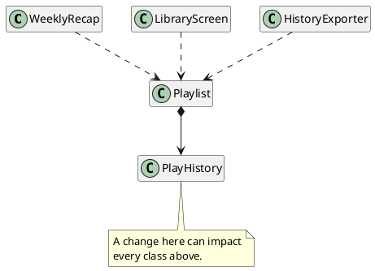
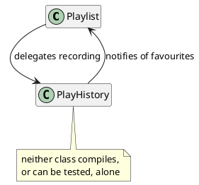
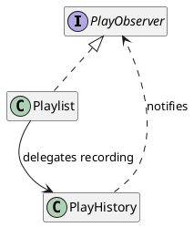
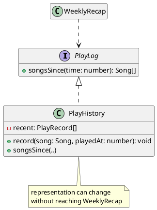

# Coupling and Dependencies

Part 2 considered a design one class at a time. Cohesion provided a means for evaluating whether everything inside a class belongs together, guiding designers towards individual invariants per class. That question is necessary, but it is not sufficient: a system can be built entirely from cohesive classes and still be difficult to change, because the difficulty lives in the connections between the classes rather than inside any one of them. Additionally, there are other costs of over-decomposition as each class has its own cognitive overhead inhibiting reasoning about a design.

It is worth being explicit about why this question dominates Part 3. A design principle is easy to misread as insurance: design carefully enough at the outset, and the code will not need to change later. Software does not work that way. Requirements arrive after release, libraries publish new major versions, the services a program calls alter their responses, platforms deprecate the interfaces a system was built against, and the rules governing the data are rewritten. None of these are failures of the original design, and no amount of care up front prevents them, because the pressure to change originates outside the program entirely. A well-designed system is not one that avoids being modified; it is one that can be modified cheaply. Code that is never changed is usually code that is no longer used.

This chapter examines the connection between coupling and cohesion. When we ask how tightly one class is bound to another, we are asking about **coupling**, and the principle that follows from it is that a class should _depend on as little as possible, as loosely as possible_. Cohesion and coupling are the two dimensions on which a decomposition is judged, and neither is meaningful on its own.

## The Ripple Effect

We return to the music app from the decomposition chapter. `Playlist` still owns the navigation invariant, `PlayHistory` still owns the history invariant, and each class is as cohesive as when they were designed. But the rest of the system changed around them.

> As a listener, I want to see a summary of what I played this week, so that I can rediscover songs I enjoyed recently.

A new `WeeklyRecap` class is written to serve this story. The history is already recorded, so the quickest way to do this would be to ask `Playlist` for the history and process that:

<CollapsibleCode>

```typescript
class WeeklyRecap {
    private readonly playlist: Playlist;

    constructor(playlist: Playlist) {
        this.playlist = playlist;
    }

    /**
     * Describes this week's listening.
     *
     * @returns {string} a one-line summary of the recent play history
     */
    summary(): string {
        const recent: Song[] = this.playlist.recentlyPlayedSongs();
        let text = "You played " + recent.length + " songs";
        if (recent.length > 0) {
            text = text + ", starting with " + recent[0].title;
        }
        return text;
    }
}
```

</CollapsibleCode>

Nothing here is obviously wrong. `WeeklyRecap` is cohesive: it has one job, and the class only provides that feature. It does not touch the navigation invariant or the history invariant. It compiles, it works, and it would probably pass a code review. The problem is what `WeeklyRecap` had to _assume_ about its dependencies; and while the implementation is short, there are a lot of small assumptions that all add up:

* It assumes that the history comes back as an array.
* It assumes that the array is ordered with the most recent play first.
* It assumes that its elements are `Song` objects.
* It assumes that each `Song` has a `title`. 

None of those facts is part of the `PlayHistory` contract. They are _implementation details_ of how `PlayHistory` happens to store its data, and `WeeklyRecap` now depends on all of them.

A dependency is invisible until something changes. The new user story asks for what was played _this week_, which the current design cannot answer: a list of songs carries no times. `PlayHistory` needs to record when each play happened.

```typescript
type PlayRecord = {
    song: Song;
    playedAt: number;   // milliseconds since the epoch
};
```

This is a small, correct, local change to the class that owns the history invariant. It is exactly the kind of change a cohesive decomposition is supposed to make safe. Instead, it breaks:

- `PlayHistory.songs()`, whose return type is no longer what it stores.
- `Playlist.recentlyPlayedSongs()`, which forwards that return value.
- `WeeklyRecap.summary()`, which indexes the result and reads `.title` from it.
- Every test that built a history and asserted on the array that came back.
- Any other screen, exporter, or report that had asked the same question in the same way.

One change, to one cohesive class, forced edits in code that had no interest in how history is stored. This is the **ripple effect**: a change that should have been local instead propagates outward along the dependencies, and the cost of the change is set not by its own size but by the number of places that have to be revisited. An engineer estimating "add timestamps to the history" as an afternoon's work discovers that the afternoon is spent somewhere else entirely.

The edits themselves are the most visible cost of propagation, and the smallest of three. The second is _regression risk_: each of those edits modifies code that already worked and was already tested, and every such modification is an opportunity to break behaviour that had nothing to do with the original request. This is the argument behind the Open/Closed Principle seen from the other side, because a change that cannot be contained is a change that puts working code back in play. The third cost is _coordination_. In a system of any size the classes that must be revisited are not all yours: they sit behind someone else's review, are covered by someone else's tests, and may be scheduled against someone else's deadline. A change whose reach crosses those boundaries stops being a technical task and becomes a scheduling one. Propagation turns a small change into a large one, and it does so in a way that is invisible at the moment the change is estimated.

<details class="tooltip link-110">
<summary>Data Definitions and the Ripple</summary>

You saw this effect in CPSC 110, though not by name. A function's template was derived mechanically from a data definition, so the shape of the data determined the shape of every function written over it. That made changing a data definition expensive: adding a field or a variant meant revisiting every function whose template came from it, however unrelated those functions were to the reason for the change. The dependency extended from each function to the data definition, and the number of functions decided the cost of the edit. The mechanism here is the same, arriving now between classes rather than between functions and data definitions.

</details>

## Coupling as the Design Criterion

**Coupling** is the degree to which one part of a system depends on another. Two classes are tightly coupled when a change to one is likely to force a change to the other, and loosely coupled when each can change without disturbing its neighbour.

The practical test is a question about knowledge: _how much must you know about B in order to write or change A?_ `WeeklyRecap` had to know the shape of `PlayHistory`'s private fields, so the two are tightly coupled even though `WeeklyRecap` never mentions `PlayHistory` by name. Contrast this with what `WeeklyRecap` needs to know in principle: it needs a list of songs played since some time. 

This sits exactly opposite cohesion, and the two are best read together:

- _Cohesion_ is judged **within** a boundary: Do the parts of this class belong together?
- _Coupling_ is judged **between** boundaries: How much does this class depend on that one?

Both are about the same underlying goal, which is keeping change local. Cohesion keeps a change local by co-locating everything one invariant needs, so there is a single site to edit. Coupling keeps a change local by limiting how far the consequences of that edit can travel. A design needs both: high cohesion so that a change has one home, and low coupling so any change does not impact the rest of the system.

Coupling is easier to reason about when the dependencies are drawn rather than inferred. A **dependency** exists from A to B when A needs B in order to compile or run: A constructs a B, holds one as a field, takes one as a parameter, calls one of its methods, or reads its data. Drawn as a graph, the classes are nodes and the dependencies are arrows, each pointing from the dependent class to the class it relies on.


<!-- caption: "Dependencies in the music app. Every arrow is a path a change can travel along." -->

Reading an arrow in the direction it points tells you what a class needs. Reading it backwards tells you something more useful: what a change to this class can break. `PlayHistory` has three classes behind it at one remove, so the blast radius of a change to `PlayHistory` is those three classes and anything that depends on them in turn.

<details class="tooltip deep-dive">
<summary>Fan-in and Fan-out</summary>

Two numbers can summarise a class's position in the dependency graph. **Fan-out** is the number of classes a class depends on, and it predicts how fragile the class is: a class with high fan-out can be broken by a change in any of the many places it relies on. **Fan-in** is the number of classes that depend on a given class, and it predicts how expensive the class is to change: high fan-in means many classes must be revisited when it changes.

The two values call for different evolutionary strategies. A class with high fan-in should be kept small and stable, which is why interfaces make good high-fan-in types: they have no implementation to change. A class with high fan-out is usually doing assembly work, and such classes are best kept few and pushed to the edges of the system.

</details>

<details class="tooltip ts-tips">
<summary><code>import</code> Is a Dependency</summary>

In TypeScript the dependency graph is written at the top of every file. Each `import` names something the file cannot compile without, so the import list is a summary of what that file is coupled to, and a file whose imports are twenty lines long is announcing a large fan-out before you read any of its code. Not all imports carry the same weight. Importing a type or an interface commits you only to a shape, while importing a class you construct with `new` commits you to that exact concrete implementation.

</details>

## Degrees of Coupling

Coupling is not a single condition but a continuum, and some kinds of coupling have specific names. While memorising and categorising the names is not important, understanding the different categories of coupling, their impact, and how they arise is an important design skill. The following forms run from tightest (worse) to loosest (best), and the discipline is to move each dependency as far down the list as the design allows.

| Form | What it looks like | In the music app |
|---|---|---|
| Content | One class reads or writes another's internal state directly. | `playlist.playHistory.recent.push(song)` |
| Common | Two classes share mutable state that belongs to neither. | Both read a module-level `currentListener`. |
| Control | A caller passes a flag that decides which branch the callee takes. | `summary(true)` meaning "weekly rather than daily". |
| Stamp | A caller passes a whole object when only part of it is needed. | `new WeeklyRecap(playlist)` when only the history is used. |
| Data | A caller passes exactly the values the callee needs. | `songsSince(startOfWeek)` |

The original `WeeklyRecap` is a form of content coupling: it is handed an entire `Playlist` when it wants a history, and it depends on `Playlist`'s internal structure. The target is data coupling, where the two classes exchange the values the operation needs and nothing more.

Control coupling deserves a note of its own, because it is a kind of dependency that looks harmless. Some kind of parameter that selects behaviour means the caller is reaching inside the callee to steer it, so the caller must understand the callee's branches, and adding a third mode means changing both. A method that takes a flag is usually two methods that have not been separated yet.

<details class="tooltip deep-dive">
<summary>Control Coupling and the Boolean Parameter</summary>

Suppose the recap should cover either the past day or the past week. The smallest change that works is a flag:

```typescript
class Recap {
    private readonly log: PlayLog;

    /**
     * Describes recent listening.
     *
     * @param {number} now milliseconds since the epoch
     * @param {boolean} weekly true for the past week, false for the past day
     * @returns {string} a one-line summary of the period
     */
    summary(now: number, weekly: boolean): string {
        const dayInMs = 24 * 60 * 60 * 1000;
        let since = now - dayInMs;
        if (weekly) {
            since = now - (7 * dayInMs);
        }
        const songs = this.log.songsSince(since);
        return "You played " + songs.length + " songs.";
    }
}
```

At the call site, that reads:

```typescript
recap.summary(now, true);
```

This has three shortcomings. The first is legibility: `true` says nothing about what was asked for, so a reader has to open `summary(..)` to find out, and a mistaken `false` looks exactly like a correct one. The second is that the caller is no longer requesting a summary; it is selecting which branch inside `summary(..)` runs, which means it has to know those branches exist. The knowledge of how the method is built has leaked into the code that calls it.

The third cost arrives when a monthly recap is requested. A boolean cannot carry three modes, so the signature changes and every existing call changes with it. The usual next step is a second flag, which is worse: `summary(now, false, true)` also admits `summary(now, true, true)`, a combination with no meaning that the type checker will accept.

When the modes are few and fixed, the fix is to stop passing the choice and to name it instead:

```typescript
class Recap {
    private readonly log: PlayLog;

    dailySummary(now: number): string {
        const dayInMs = 24 * 60 * 60 * 1000;
        return this.summarySince(now - dayInMs);
    }

    weeklySummary(now: number): string {
        const weekInMs = 7 * 24 * 60 * 60 * 1000;
        return this.summarySince(now - weekInMs);
    }

    private summarySince(since: number): string {
        const songs = this.log.songsSince(since);
        return "You played " + songs.length + " songs.";
    }
}
```

`recap.weeklySummary(now)` explains itself, the shared work still lives in one place, and a monthly recap becomes a new method rather than an edit to a method that already works.

When the modes are not fixed, the flag was never selecting a mode at all: it was standing in for a value. The method should take that value directly, and the caller supplies whatever period it wants:

```typescript
recap.summarySince(now - weekInMs);
```

Every period is now supported, including ones nobody has asked for yet, and no branch was needed to achieve it. This is how we transition from control coupling to data coupling, and the general signal to watch for is a parameter whose meaning a reader cannot recover from the call site.

</details>

## Diagnosing Coupling

The decomposition chapter suggested ways to check for a badly split class: looking for fields the invariant never mentions or methods that maintain some other invariant. Coupling has its own diagnostic signs that are visible in the code once you know to look for them. A third sign, a dependency that points both ways, is structural enough to need a section of its own, and follows this one.

### Reaching Past a Neighbour

The clearest sign is a chain of calls that traverses through one object to another to a third:

```typescript
const city = order.customer().address().city();
```

Each step traverses a relationship the caller should be oblivious to. This code depends on orders having customers, customers having addresses, and addresses having cities, so a change to any of those three classes can break this call, even though all the caller wanted was one string. The guideline against this kind of construction is the **Law of Demeter**: a method should call methods only on itself, on its own fields, on its parameters, and on objects it creates.

The remedy is to ask the immediate neighbour for what you want rather than for the thing that has it:

```typescript
const city = order.shippingCity();
```

`Order` now owns the knowledge of how to find its own shipping city, which is knowledge it already had, and the caller depends on one class instead of three.

<details class="tooltip deep-dive">
<summary>When a Chain of Calls Is Not Problematic</summary>

The rule is about traversing an ownership graph to reach a stranger, not about the number of dots on a line. An expression like `songs.filter(isRecent).map(toTitle).slice(0, 5)` chains four calls and couples you to nothing new: every call returns a value of the same kind you started with, and no relationship between separate objects is being walked. The same is true of a builder that returns itself so calls can be chained.

The question to ask is not "how many dots?" but "how many classes must be correct for this line to compile?" A chain over one type answers _one_, however long it runs. `order.customer().address().city()` answers _three_, in only as many steps.

</details>

A related sign is code that extracts an object's data in order to make a decision the object was in a better position to make:

```typescript
if (account.balance() >= amount) {
    account.setBalance(account.balance() - amount);
}
```

The caller has taken on a rule that belongs to `Account`: what makes a withdrawal permissible, and what the balance becomes afterwards. Every caller that does this holds a copy of that rule, so changing the rule means finding all of them, and `Account` cannot enforce an invariant that its callers are free to compute around. Telling the object what is needed leaves both the rule and the invariant where they belong:

```typescript
account.withdraw(amount);
```

The guideline is **Tell, Don't Ask**: tell an object what you need done and let it decide how, rather than asking for its state and deciding on its behalf. It is the same instinct behind the `PlayLog` design later in this chapter, where `PlayHistory` answers a question about the history instead of handing over its list for someone else to interpret. A method whose body is mostly other objects' getters is usually a method living in the wrong class.

### Depending on More Than You Need

A dependency on a concrete class commits the dependent to everything that class encodes, and any way it might be changed in the future. `WeeklyRecap` declared its field as `Playlist`, so it inherited the whole of `Playlist`'s public surface as its potential exposure, when the operation it wanted was a single query.

The interfaces chapter gave us the tool for this: name the contract, not the class. A dependency on an interface only exposes your code to the operations that interface declares, which is a smaller and far more stable thing to depend on. The size of that contract matters for the same reason, which is what makes the interface segregation principle a coupling rule: an interface bundling operations a client never calls couples that client to changes it has no interest in.

Class extension is the tightest coupling the language offers, and it does not appear in the table above because it works at a different level. A subclass depends not on another class's public contract but on its _implementation_: its protected members, and the order in which the base calls its own methods. The extension chapter named the consequence the fragile base class problem, where a change inside a base class alters the behaviour of subclasses that were never edited.

That is the reason composition is the default and extension is reserved for true _is-a_ relationships. A collaborator held as a field is reached only through its public methods, so its internals stay free to change; a base class is reached through inheritance, so its internals are part of what every subclass depends on.

## Breaking Dependency Cycles

When A depends on B and B depends on A, neither class can be read, tested, or changed without the other, and the pair has become one unit, but with two names. The decomposition chapter made this point about ownership: `Playlist` holds `PlayHistory` because it needs to delegate recording, and giving `PlayHistory` a back-reference to `Playlist` would have bound the two together in both directions.

Cycles are rarely designed deliberately. They arrive when a class discovers it needs to notify the class that owns it. Suppose the music app should mark a song as a favourite once it has been played three times in a week. The history is what knows the play counts, so the quickest route is to have it tell the playlist directly:

```typescript
class PlayHistory {
    private readonly playlist: Playlist;   // a back-reference

    record(song: Song, playedAt: number): void {
        // ... record the play as before ...
        if (this.playsSince(song, playedAt - weekInMs) >= 3) {
            this.playlist.markFavourite(song);
        }
    }
}
```


<!-- caption: "A dependency cycle: each class now needs the other." -->

`Playlist` already depended on `PlayHistory`, so this closes a loop. A reader tracing what happens when a song is played now moves between the two files repeatedly, and neither class can be lifted out for testing without bringing the other with it.

There are three ways out, worth trying in this order.

_Reverse the direction of the question._ The cheapest fix is usually to notice that one direction already exists, and to let the class on that side do the asking. `Playlist` depends on `PlayHistory` already, so `PlayHistory` can stay ignorant of playlists entirely and answer questions about plays:

```typescript
class PlayHistory {
    /**
     * Returns the songs played at least `times` times since `time`.
     *
     * @param {number} times the minimum number of plays
     * @param {number} time milliseconds since the epoch
     * @returns {Song[]} the qualifying songs, most recently played first
     */
    playedAtLeast(times: number, time: number): Song[] { /* ... */ }
}

class Playlist {
    favourites(now: number): Song[] {
        const weekInMs = 7 * 24 * 60 * 60 * 1000;
        return this.playHistory.playedAtLeast(3, now - weekInMs);
    }
}
```

The cycle is gone, no new types were introduced, and the rule about what counts as a favourite now sits in `Playlist` alongside the playlist's other rules. Prefer this whenever the work can be _pulled_ by the dependent class rather than _pushed_ by its collaborator.

_Invert one direction with an interface._ Sometimes the collaborator must initiate, because it is the only class that knows the moment the event occurred. The class doing the notifying should then define the contract it needs and depend on that, leaving the other class to implement it:

```typescript
interface PlayObserver {
    /** Called when a song crosses the frequent-play threshold. */
    songBecameFrequent(song: Song): void;
}

class PlayHistory {
    private readonly observer: PlayObserver;   // not a Playlist
    // ...
}

class Playlist implements PlayObserver {
    public songBecameFrequent(song: Song): void {
        // mark the song as a favourite
    }
}
```


<!-- caption: "The same notification, with the compile-time dependency pointing one way." -->

`PlayHistory` still calls back at run time, but at compile time it depends only on `PlayObserver`, which depends on nothing at all. The cycle is broken because the interface has no knowledge of who implements it, and `PlayHistory` can now be tested with a stub observer that records the calls.

_Extract a third class._ When both classes are doing work that belongs to neither, the logic can move into a new class that depends on both and is depended on by neither. This is the right answer when the rule, "three plays in a week makes a favourite", is a policy in its own right rather than a detail of either collaborator.

Whichever route applies, the goal is the same: leave the compile-time dependencies pointing one way, so the graph reads as a hierarchy rather than a knot. A dependency graph without cycles can be understood one layer at a time, and any class in it can be lifted out for testing along with only the things beneath it.

## Loosening Coupling for `WeeklyRecap`

To fix our coupling challenge, `WeeklyRecap` should say what it needs, and `PlayHistory` should answer that question itself rather than handing over its data for someone else to interpret.

First, name the contract: `WeeklyRecap` needs one operation, so the interface has one method:

```typescript
/**
 * A source of listening history, ordered most recent first.
 */
interface PlayLog {
    /**
     * Returns the songs played at or after the given time.
     *
     * @param {number} time milliseconds since the epoch
     * @returns {Song[]} the matching songs, most recently played first
     */
    songsSince(time: number): Song[];
}
```

`PlayHistory` implements it, and in doing so takes back the knowledge that had leaked out when it handed over its whole array. It now answers a question instead of exposing a list, which leaves it free to store whatever it likes internally:

<CollapsibleCode>

```typescript
class PlayHistory implements PlayLog {
    private readonly recent: PlayRecord[] = [];

    /**
     * Records that a song was played, moving it to the front.
     *
     * @param {Song} song the song that was played
     * @param {number} playedAt milliseconds since the epoch
     */
    record(song: Song, playedAt: number): void {
        this.forget(song);
        this.recent.unshift({ song: song, playedAt: playedAt });
    }

    public songsSince(time: number): Song[] {
        const found: Song[] = [];
        for (const record of this.recent) {
            if (record.playedAt >= time) {
                found.push(record.song);
            }
        }
        return found;
    }

    private forget(song: Song): void {
        const i = this.recent.findIndex(r => r.song === song);
        if (i !== -1) {
            this.recent.splice(i, 1);
        }
    }
}
```

</CollapsibleCode>

`WeeklyRecap` then depends on the contract and on nothing else:

```typescript
class WeeklyRecap {
    private readonly log: PlayLog;

    constructor(log: PlayLog) {
        this.log = log;
    }

    /**
     * Describes the listening in the week before the given time.
     *
     * @param {number} now milliseconds since the epoch
     * @returns {string} a one-line summary of the week's play history
     */
    summary(now: number): string {
        const weekInMs = 7 * 24 * 60 * 60 * 1000;
        const songs: Song[] = this.log.songsSince(now - weekInMs);
        if (songs.length === 0) {
            return "You played nothing this week.";
        }
        return "You played " + songs.length + " songs this week, starting with " + songs[0].title + ".";
    }
}
```


<!-- caption: "WeeklyRecap depends on the PlayLog contract rather than on the class that keeps the data." -->

Compare the two designs against the change that started this chapter. Adding timestamps to the history was what broke the original; in this design it is what `PlayHistory` was built to do, and the class can move from an array to a map, cap itself at fifty entries, or persist to disk without `WeeklyRecap` noticing. The dependency that remains is on one method signature, which is the smallest thing the two classes could agree on and still work together.

Notice also which class the dependency now points to. `WeeklyRecap` does not depend on `PlayHistory`, and `PlayHistory` does not depend on `WeeklyRecap`; both depend on `PlayLog`, which has no implementation to change. Arranging dependencies so they point at abstractions rather than at concrete classes is the **Dependency Inversion Principle**, named at the end of Part 2, and it is the structural habit that most reliably keeps coupling low.

Coupling shows up in the test suite before it shows up anywhere else, and a test that is hard to write is usually reporting a design problem rather than a testing problem. To test the original `WeeklyRecap`, you needed a real `Playlist`, which needed a real `PlayHistory`, which needed songs recorded through the playlist in the right order. The test dragged in three classes to check one string.

The rewritten class needs none of that, because anything satisfying `PlayLog` will do:

```typescript
class StubLog implements PlayLog {
    public songsSince(time: number): Song[] {
        return [{ title: "Bloom" }, { title: "Ridgeline" }];
    }
}

test("the recap names the count and the most recent song", () => {
    const recap = new WeeklyRecap(new StubLog());

    expect(recap.summary(0)).to.equal(
        "You played 2 songs this week, starting with Bloom."
    );
});
```

This is the test double from the interfaces chapter, doing the same work for the same reason. The general rule is worth stating plainly: if a unit test requires you to construct a large part of the system, the class under test is coupled to a large part of the system, and no amount of test-writing skill will fix that from the outside.

## When Coupling Is a Judgment Call

Coupling always exists, and it is not a defect to be eliminated. A system with no dependencies among its parts is a system whose parts never work together. Every collaboration in a design is a dependency, and the arrows in the graph are what the system is made of.

The distinction that matters is between coupling that is _necessary_ and coupling that is _incidental_. `WeeklyRecap` must depend on some source of play history; that is inherent in what it does, and no design removes it. What it does not need is a dependency on how that history is stored, on the class that stores it, or on the route by which it is reached. The necessary dependency was one method; everything else was incidental, acquired because it was the quickest thing to write on the day.

There is also a trap in treating low coupling as a target on its own. Coupling between classes can always be reduced to zero by merging the classes, and a single class containing the entire program has no coupling at all. That design is the god class of the decomposition chapter, and it is worse in every respect that matters. Merging does not remove the dependencies; it hides them inside a class where they can no longer be seen, counted, or reasoned about.

The same judgment applies as with decomposition. Adding an interface for every collaboration produces a system where every call passes through an abstraction and no reader can find the code that runs. An interface is worth defining when the dependency is likely to change, when a second implementation is plausible, or when a test needs a stand-in. When a class collaborates with one stable neighbour that no one expects to replace, depending on it directly is often the clearer choice.

## Cohesion and Coupling Together

Both criteria aim to support a single higher-level idea. A **concern** is a single thing the system must address: a rule, a responsibility, a reason the code might one day have to change. **Separation of concerns** is the principle that each concern should have exactly one home in the design. The two ways a design can violate separation of concerns are exactly the two failures these chapters have been describing.

**Tangling** occurs when many concerns share one place in the design. The god class of the decomposition chapter is tangled: navigation, history, ratings, and sharing interleaved in a single `Playlist`, so that no one concern can be read or changed by itself. Tangling is what poor cohesion looks like from the inside of a class.

**Scattering** happens when one concern is spread across a design. The original `WeeklyRecap` is scattered: the knowledge of how play history is represented was not confined to `PlayHistory` but distributed among every class that had asked for the list, which is why a single change to that representation reached all of them. Scattering is what tight coupling looks like from outside a class.

The symmetry is important, because the two are detected and resolved differently. You find tangling by looking inside one class and noticing several unrelated reasons to change it, and you fix it by splitting. You find scattering by making one change and counting the files it touched, and you resolve it by giving the concern a single owner and a contract. High cohesion is the absence of tangling, low coupling is the absence of scattering, and separation of concerns is the goal they are both supporting.

The two criteria are usually stated as a single goal, high cohesion and low coupling, because neither survives being pursued alone. They also interact, and the interaction is what makes a decomposition succeed or fail. Cohesion tends to produce low coupling. When a class owns one invariant and all the state that invariant constrains, it can answer questions about that state by itself, and neighbours have no reason to reach past it. `PlayHistory` could offer `songsSince` precisely because it owned the play history.

Of the two design failures, poor cohesion is the more common, and it tends to produce high coupling. A class holding two invariants has to be consulted by two sets of collaborators, so its fan-in is inflated by an accident of decomposition. Worse, splitting a class along the wrong dimension separates state from the logic that maintains it, and the two parts have to talk constantly to stay consistent. Two classes that call each other on every operation are a decomposition that has increased coupling without buying any cohesion.

This is why coupling and cohesion are considered concurrently. The decomposition chapter asked where the boundaries should fall; this chapter asks how much traffic crosses them. A good boundary is one where both answers are favourable: everything on the inside serves one invariant, and everything crossing it is a small, stable contract. When you find yourself choosing between the two, the traffic across the boundary is the better guide, because it is what will inhibit you on future changes.

## Designing for Low Coupling

Low coupling is the property that lets a system be changed by someone who does not understand all of it. Each class depends on a small number of stable contracts, so a change has a boundary you can see, and the reasoning needed to make it safely fits in one person's head. That is what Part 3 is about: not building a system that works, which Part 2 covered, but keeping one workable after the people who built it have moved on.

The habits that produce it are the ones this chapter has worked through. Ask a neighbour for what you want instead of walking through it to reach something else. Tell an object what you need done rather than extracting its data and deciding for it. Depend on a contract rather than on the class that satisfies it. Pass the values an operation needs rather than the object that contains them. Keep dependencies pointing in one direction, and point them at abstractions wherever a change is likely. Each of these narrows what one class must know about another, and what a class does not know cannot break it.

None of this makes a system immune to change, and that was never the goal. The requirements will still arrive, the dependencies will still publish new versions, and the environment will still shift underneath a design that was correct when it was written. What low coupling buys is that those changes stay the size they inherently are, rather than the size the dependency graph makes them.

One question is left open, and it is the same one Part 2 finished on. `WeeklyRecap` now takes a `PlayLog` in its constructor rather than constructing its own, which is what made it loosely coupled and testable. Somebody, somewhere, must still decide that the `PlayLog` it receives is a `PlayHistory` and hand one over. The next chapter takes up that responsibility directly: where construction and wiring belong in a system, and how concentrating them at the boundary makes the interchangeable parts of a design interchangeable in practice.

<details class="tooltip exercise">
  <summary>Exercise: A Bike-Share Maintenance Report</summary>

You have inherited a bike-share system and been asked to extend it.

> As a bike-share operator, I want a daily report of the docks that need attention, so that I can send a technician to the right stations.

The system has a `Network` of `Station`s, each `Station` has a list of `Dock`s, and a `Dock` may hold a `Bike` that records how many faults it has reported. A previous developer wrote the report like this:

```typescript
class MaintenanceReport {
    private readonly network: Network;

    constructor(network: Network) {
        this.network = network;
    }

    lines(): string[] {
        const out: string[] = [];
        for (const station of this.network.stations) {
            for (const dock of station.docks) {
                const bike = dock.bike;
                if (bike !== null) {
                    if (bike.faultCount > 2) {
                        out.push(station.name + " dock " + dock.id);
                    }
                }
            }
        }
        return out;
    }
}
```

Work through the following:

1. _Map the dependencies._ List every class `MaintenanceReport` depends on, and every fact it assumes about each one. Draw the dependency graph, then use it to say which classes a change to `Bike` could break.
2. _Classify the coupling._ Using the forms in [Degrees of Coupling](#degrees-of-coupling), name the tightest form present in this code and quote the line that demonstrates it.
3. _Loosen it._ The report wants faulty docks, not a tour of the object graph. Redesign so that each class answers for its own contents, and `MaintenanceReport` depends on a single contract. Define that interface and give its documentation.
4. _Test it._ Write a test double for your interface and a test for the report that constructs no `Network`, `Station`, `Dock`, or `Bike`.
5. _Judge what remains._ Some dependency between the report and the network is necessary. State which parts of the original coupling were inherent to the task and which were incidental, and defend one dependency you chose to leave as a direct call on a concrete class.

</details>
