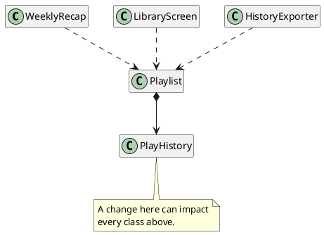
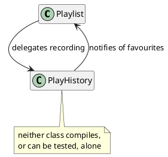
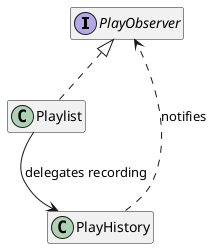
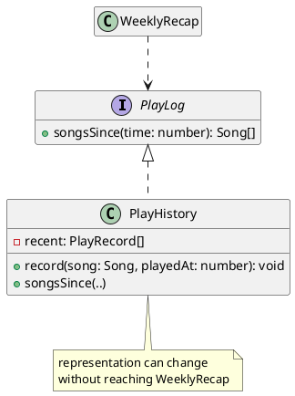

# Coupling and Dependencies

[Part 2](../part2/index) considered a design one class at a time. Cohesion provided a way to evaluate whether everything inside a class belongs together, and guided designers towards one invariant per class. Cohesion is necessary, but it is not sufficient. A system can be built entirely from cohesive classes and still be difficult to change, because the difficulty lies in the connections between the classes rather than inside any one of them. Over-decomposition also has a cost: each class adds its own cognitive overhead, which makes the design as a whole harder to reason about.

The connections between classes are the focus of Part 3 because software keeps changing. It is tempting to treat careful design as insurance: if the design is good enough at the outset, the code will not need to change later. In practice, code changes throughout its life. Requirements arrive after release, libraries publish new major versions, the services a program calls change their responses, platforms deprecate the interfaces a system was built against, and the rules governing the data are rewritten. None of these changes are failures of the original design, and careful up-front design cannot prevent them, because the pressure to change comes from outside the program. Good design cannot stop these changes from happening, but it can make them cheaper to carry out.

This chapter introduces **coupling**, which describes how tightly one class is bound to another, and examines how coupling relates to cohesion. The principle that follows from coupling is that a class should _depend on as little as possible, as loosely as possible_. Cohesion and coupling are the two criteria used to judge a decomposition, and each is incomplete without the other.

## The Ripple Effect

This chapter returns to the music app from the decomposition chapter. `Playlist` still owns the navigation invariant, and `PlayHistory` still owns the history invariant. Both classes are as cohesive as when they were designed, but the rest of the system has changed around them.

> As a listener, I want to see a summary of what I played this week, so that I can rediscover songs I enjoyed recently.

A new `WeeklyRecap` class is written to implement this story. The history is already recorded, so the quickest implementation asks `Playlist` for the history and summarises it:

<CollapsibleCode>

```typescript
class WeeklyRecap {
    private readonly playlist: Playlist;

    constructor(playlist: Playlist) {
        this.playlist = playlist;
    }

    /**
     * Describes this week's listening.
     *
     * @returns {string} a one-line summary of the recent play history
     */
    summary(): string {
        const recent: Song[] = this.playlist.recentlyPlayedSongs();
        let text = "You played " + recent.length + " songs";
        if (recent.length > 0) {
            text = text + ", starting with " + recent[0].title;
        }
        return text;
    }
}
```

</CollapsibleCode>

Nothing here is obviously wrong. `WeeklyRecap` is cohesive: it has one job and provides only that feature. It does not touch the navigation invariant or the history invariant. The code compiles and works, and it would probably pass a code review. The problem is what `WeeklyRecap` has to _assume_ about its dependencies. The implementation is short, but it makes several small assumptions:

* It assumes that the history comes back as an array.
* It assumes that the array is ordered with the most recent play first.
* It assumes that its elements are `Song` objects.
* It assumes that each `Song` has a `title`.

None of these facts are part of the `PlayHistory` contract. They are _implementation details_ of how `PlayHistory` currently stores its data, and `WeeklyRecap` now depends on all of them.

These dependencies cause no problems until something changes. The user story asks for what was played _this week_. The current design cannot answer that question, because a list of songs does not record when each song was played. `PlayHistory` needs to store the time of each play:

```typescript
type PlayRecord = {
    song: Song;
    playedAt: number;   // milliseconds since the epoch
};
```

This is a small, correct change, made in the class that owns the history invariant. A cohesive decomposition is supposed to make this kind of change safe. Instead, the change breaks:

- `PlayHistory.songs()`, whose return type no longer matches what the class stores.
- `Playlist.recentlyPlayedSongs()`, which forwards that return value.
- `WeeklyRecap.summary()`, which indexes the result and reads `.title` from it.
- Every test that built a history and asserted on the array that came back.
- Any other screen, exporter, or report that asks for the history in the same way.

One change to one cohesive class forced edits in code that has no interest in how the history is stored. This is the **ripple effect**: a change that should have been local propagates outward along the dependencies. The cost of the change then depends on the number of places that have to be revisited, rather than on the size of the change itself. An engineer might estimate "add timestamps to the history" as an afternoon's work, and then find that most of the afternoon goes to fixing other classes.

The ripple effect has three costs. The edits themselves are the most visible cost once the work begins, but also the smallest. The second cost is _regression risk_. Each of those edits modifies code that already worked and was already tested, and every modification is an opportunity to break behaviour that had nothing to do with the original request. The Open/Closed Principle makes a related argument: a change that cannot be contained puts working code at risk. The third cost is _coordination_. In a large system, the classes that must be revisited are not all yours. They may be owned by other developers, reviewed by other people, covered by other people's tests, and scheduled against other deadlines. A change that reaches across those boundaries requires coordinating with other people as well as editing code. None of these costs are visible when the change is first estimated, because the estimate considers only the class being changed.

<details class="tooltip link-110">
<summary>Data Definitions and the Ripple</summary>

You saw this effect in CPSC 110, although it was not named. A function's template was derived from a data definition, so the shape of the data determined the shape of every function that operated on it. This made changing a data definition expensive. Adding a field or a variant meant revisiting every function whose template came from that definition, even functions unrelated to the reason for the change. Each function depended on the data definition, so the number of functions determined the cost of the edit. The same mechanism applies here, between classes.

</details>

## What Coupling Is

**Coupling** is the degree to which one part of a system depends on another. Two classes are tightly coupled when a change to one is likely to force a change to the other. They are loosely coupled when each can change without requiring changes to the other.

A practical way to assess coupling is to ask: _how much must you know about B in order to write or change A?_ `WeeklyRecap` had to know the shape of `PlayHistory`'s private fields, so the two classes are tightly coupled even though `WeeklyRecap` never mentions `PlayHistory` by name. In principle, `WeeklyRecap` only needs one thing: the list of songs played since a given time.

Coupling complements cohesion, and the two are best considered together:

- _Cohesion_ is judged _within_ a boundary: do the parts of this class belong together?
- _Coupling_ is judged _between_ boundaries: how much does this class depend on that one?

Both serve the same goal: keeping changes local. High cohesion keeps a change local by placing everything one invariant needs in one class, so there is a single place to edit. Low coupling keeps a change local by limiting how far the effects of that edit can spread. A design needs both: high cohesion so that each change has one place to be made, and low coupling so that the change does not affect the rest of the system.

Coupling is easier to reason about when the dependencies are drawn as a diagram. A **dependency** exists from A to B when A needs B in order to compile or run. For example, A might construct a B, hold one as a field, take one as a parameter, call one of its methods, or read its data. In a dependency graph, the classes are nodes and the dependencies are arrows. Each arrow points from the dependent class to the class it relies on.


<!-- caption="Dependencies in the music app. Every arrow is a path a change can travel along." -->

Following an arrow in the direction it points tells you what a class needs. Following it backwards tells you what a change to a class can break, which is usually more useful. `Playlist` depends on `PlayHistory` directly, and three more classes depend on `Playlist`. A change to `PlayHistory` can therefore affect all four of those classes, as well as any classes that depend on them.

<details class="tooltip deep-dive">
<summary>Fan-in and Fan-out</summary>

Two numbers summarise a class's position in the dependency graph. **Fan-out** is the number of classes a class depends on. It indicates how fragile the class is, because a change to any of those classes can break it. **Fan-in** is the number of classes that depend on a given class. It indicates how expensive the class is to change, because each of those classes may need to be revisited when it changes.

The two numbers call for different design choices. A class with high fan-in should be kept small and stable. Interfaces work well as high fan-in types because they have no implementation to change. A class with high fan-out usually connects many other objects together. A system should have few of these classes, and they should sit at its edges.

</details>

<details class="tooltip ts-tips">
<summary><code>import</code> Is a Dependency</summary>

In TypeScript, a file's dependencies are listed at the top of the file. Each `import` names something the file cannot compile without, so the import list summarises what the file is coupled to. A file with twenty lines of imports has a large fan-out, and you can see this before reading any of its code. Not all imports carry the same weight. Importing a type or an interface commits you only to a shape. Importing a class that you construct with `new` commits you to that specific implementation.

</details>

## Degrees of Coupling

Coupling is a matter of degree, and some kinds of coupling have specific names. The names matter less than understanding the different kinds of coupling, their impact, and how they arise. The table below lists the forms from tightest (worst) to loosest (best). The goal is to move each dependency as far down the list as the design allows.

| Form | What it looks like | In the music app |
|---|---|---|
| Content | One class reads or writes another's internal state directly. | `playlist.playHistory.recent.push(song)` |
| Common | Two classes share mutable state that belongs to neither. | Both read a module-level `currentListener`. |
| Control | A caller passes a flag that decides which branch the callee takes. | `summary(true)` meaning "weekly rather than daily". |
| Stamp | A caller passes a whole object when only part of it is needed. | `new WeeklyRecap(playlist)` when only the history is used. |
| Data | A caller passes exactly the values the callee needs. | `songsSince(startOfWeek)` |

The original `WeeklyRecap` is stamp coupled: it is given an entire `Playlist` when it only needs the history. It is also close to content coupling, because the array it receives exposes how `PlayHistory` stores its data internally. The goal is data coupling, where the two classes exchange only the values the operation needs.

Control coupling is easy to miss because it looks harmless. When a parameter selects which behaviour a method performs, the caller is steering the callee's internal logic. The caller must understand the callee's branches, and adding a third mode requires changing both the caller and the callee. A method that takes a flag is usually two methods that have not yet been separated.

<details class="tooltip deep-dive">
<summary>Control Coupling and the Boolean Parameter</summary>

The examples in this tooltip use `PlayLog`, the one-method interface defined later in this chapter. Its method `songsSince(time)` returns the songs played at or after a given time.

Suppose the recap should cover either the past day or the past week. The smallest change that supports both is a boolean flag:

```typescript
class Recap {
    private readonly log: PlayLog;

    constructor(log: PlayLog) {
        this.log = log;
    }

    /**
     * Describes recent listening.
     *
     * @param {number} now milliseconds since the epoch
     * @param {boolean} weekly true for the past week, false for the past day
     * @returns {string} a one-line summary of the period
     */
    summary(now: number, weekly: boolean): string {
        const dayInMs = 24 * 60 * 60 * 1000;
        let since = now - dayInMs;
        if (weekly) {
            since = now - (7 * dayInMs);
        }
        const songs = this.log.songsSince(since);
        return "You played " + songs.length + " songs.";
    }
}
```

At the call site, that reads:

```typescript
recap.summary(now, true);
```

This design has three shortcomings. The first is readability. The argument `true` says nothing about what was requested, so a reader has to open `summary(..)` to find out, and a mistaken `false` looks just like a correct one. The second is that the caller is no longer just requesting a summary. It is selecting which branch inside `summary(..)` runs, so it has to know that those branches exist. Knowledge of how the method is implemented has leaked into the code that calls it.

The third shortcoming appears when a monthly recap is requested. A boolean cannot represent three modes, so the signature has to change, and every existing call has to change with it. The usual next step is to add a second flag, which makes things worse. A signature that allows `summary(now, false, true)` also allows `summary(now, true, true)`, a combination with no meaning that the type checker will still accept.

When there are only a few fixed modes, the fix is to give each mode its own named method instead of passing the choice as an argument:

```typescript
class Recap {
    private readonly log: PlayLog;

    constructor(log: PlayLog) {
        this.log = log;
    }

    dailySummary(now: number): string {
        const dayInMs = 24 * 60 * 60 * 1000;
        return this.summarySince(now - dayInMs);
    }

    weeklySummary(now: number): string {
        const weekInMs = 7 * 24 * 60 * 60 * 1000;
        return this.summarySince(now - weekInMs);
    }

    private summarySince(since: number): string {
        const songs = this.log.songsSince(since);
        return "You played " + songs.length + " songs.";
    }
}
```

A call to `recap.weeklySummary(now)` is clear on its own, and the shared work still lives in one place. Adding a monthly recap means adding a new method, and no working method has to be edited.

When the modes are not fixed, the flag stands in for a value. In this case, the method should take that value directly. `summarySince` can be made public, and the caller supplies whatever period it needs:

```typescript
recap.summarySince(now - weekInMs);
```

This design supports every period, including ones nobody has asked for yet, without any branches. Replacing the flag with a value changes control coupling into data coupling. In general, watch for parameters whose meaning a reader cannot tell from the call site.

</details>

## Diagnosing Coupling

The decomposition chapter described ways to detect a badly split class, such as fields the invariant never mentions or methods that maintain a different invariant. Coupling also has signs that are visible in the code, and this section describes two of them. A third sign, a dependency that points in both directions, is covered in the next section.

### Reaching Past a Neighbour

The clearest sign is a chain of calls that goes through one object to reach a second object, and then a third:

```typescript
const city = order.customer().address().city();
```

Each step follows a relationship that the caller should not need to know about. This code depends on orders having customers, customers having addresses, and addresses having cities. A change to any of those three classes can break this line, even though the caller only wanted one string. The **Law of Demeter** is a guideline against this kind of code: a method should only call methods on its own object, on its own fields, on its parameters, and on objects it creates.

The fix is to ask the immediate neighbour for the value you want, rather than for the object that has it:

```typescript
const city = order.shippingCity();
```

`Order` already knows how to find its shipping city, so it is the right class to provide it. The caller now depends on one class instead of three.

<details class="tooltip deep-dive">
<summary>When a Chain of Calls Is Not Problematic</summary>

The Law of Demeter is about following relationships between objects to reach an object the caller does not know about. It is not about the number of dots on a line. The expression `songs.filter(isRecent).map(toTitle).slice(0, 5)` chains three calls, but it does not couple you to anything new. Every call returns an array, the same kind of value you started with, and no relationship between separate objects is followed. The same is true of a builder whose methods return the builder itself so that calls can be chained.

A better question than "how many dots?" is "how many classes must this line know about?" A chain over one type needs to know about one class, however long the chain is. `order.customer().address().city()` needs to know about three.

</details>

A related sign is code that extracts an object's data to make a decision that the object itself is better placed to make:

```typescript
if (account.balance() >= amount) {
    account.setBalance(account.balance() - amount);
}
```

The caller has taken on a rule that belongs to `Account`: when a withdrawal is allowed, and what the balance becomes afterwards. Every caller that does this has its own copy of the rule, so changing the rule means finding and updating all of them. `Account` also cannot enforce its invariant, because callers can set the balance to anything they compute. If the caller tells the account what to do instead, the rule and the invariant stay in `Account`:

```typescript
account.withdraw(amount);
```

This guideline is called **Tell, Don't Ask**: tell an object what you need done and let it decide how to do it, rather than asking for its state and making the decision for it. The `PlayLog` design later in this chapter follows the same guideline. `PlayHistory` answers a question about the history, instead of handing over its list for another class to interpret. A method whose body mostly calls other objects' getters usually belongs in a different class.

### Depending on Too Much

A dependency on a concrete class exposes the dependent class to everything that class does, and to every way it might change in the future. `WeeklyRecap` declared its field as a `Playlist`, so it is exposed to all of `Playlist`'s public methods, even though it only needs a single query.

The interfaces chapter introduced the tool for this: depend on a contract rather than a class. A dependency on an interface only exposes your code to the operations that the interface declares, which is a smaller and more stable thing to depend on. The size of the interface matters for the same reason. An interface that bundles operations a client never calls couples that client to changes it does not care about. This is why the interface segregation principle is also a rule about coupling.

Class extension is the tightest form of coupling the language offers. It does not appear in the table above because it works at a different level. A subclass depends on its base class's _implementation_ as well as its public contract: its protected members, and the order in which the base class calls its own methods. The extension chapter described the result, the fragile base class problem: a change inside a base class can alter the behaviour of subclasses that were never edited.

Composition is therefore the default, and extension is reserved for true _is-a_ relationships. A collaborator held in a field is used only through its public methods, so its internals are free to change. A base class is used through inheritance, so its internals are part of what every subclass depends on.

## Dependency Cycles

When A depends on B and B depends on A, neither class can be read, tested, or changed without the other. The two classes effectively become a single unit. The decomposition chapter made this point about ownership. `Playlist` holds a `PlayHistory` because it delegates recording to it, and giving `PlayHistory` a reference back to `Playlist` would have bound the two together in both directions.

Cycles are rarely designed deliberately. They usually appear when a class needs to notify the class that owns it. Suppose the music app should mark a song as a favourite once it has been played three times in a week. Counting plays is a job for the history, but the history currently keeps only the most recent play of each song. Suppose it is extended to keep every play, so that it can count them. The quickest implementation then has the history tell the playlist directly:

```typescript
class PlayHistory {
    private readonly playlist: Playlist;   // a back-reference

    record(song: Song, playedAt: number): void {
        // ... record the play ...
        const weekInMs = 7 * 24 * 60 * 60 * 1000;
        if (this.playsSince(song, playedAt - weekInMs) >= 3) {
            this.playlist.markFavourite(song);
        }
    }
}
```


<!-- caption="A dependency cycle: each class now needs the other." -->

`Playlist` already depended on `PlayHistory`, so this creates a cycle. A reader tracing what happens when a song is played now has to move back and forth between the two files, and neither class can be tested without the other.

There are three ways to break a cycle. Try them in this order.

_Reverse the direction of the question._ The cheapest fix is usually to use the dependency that already exists, and let the class on that side ask the question. `Playlist` already depends on `PlayHistory`, so `PlayHistory` does not need to know about playlists at all. It only needs to answer questions about plays:

```typescript
class PlayHistory {
    /**
     * Returns the songs played at least `times` times since `time`.
     *
     * @param {number} times the minimum number of plays
     * @param {number} time milliseconds since the epoch
     * @returns {Song[]} the qualifying songs, most recently played first
     */
    playedAtLeast(times: number, time: number): Song[] { /* ... */ }
}

class Playlist {
    favourites(now: number): Song[] {
        const weekInMs = 7 * 24 * 60 * 60 * 1000;
        return this.playHistory.playedAtLeast(3, now - weekInMs);
    }
}
```

This removes the cycle without introducing any new types, and the rule about what counts as a favourite now sits in `Playlist` with the playlist's other rules. Prefer this approach whenever the dependent class can _pull_ the information it needs, rather than having its collaborator _push_ it.

_Invert one direction with an interface._ Sometimes the collaborator has to start the interaction, because it is the only class that knows when the event occurred. In that case, the class sending the notification should define an interface for what it needs and depend on that interface. The other class then implements it:

```typescript
interface PlayObserver {
    /** Called when a song crosses the frequent-play threshold. */
    songBecameFrequent(song: Song): void;
}

class PlayHistory {
    private readonly observer: PlayObserver;   // not a Playlist
    // ...
}

class Playlist implements PlayObserver {
    public songBecameFrequent(song: Song): void {
        // mark the song as a favourite
    }
}
```


<!-- caption="The same notification, with the compile-time dependency pointing one way." -->

`PlayHistory` still calls `Playlist` at run time, but at compile time it depends only on `PlayObserver`, and `PlayObserver` does not depend on `Playlist`. The interface does not know which class implements it, so the cycle is broken. `PlayHistory` can now be tested with a stub observer that records the calls it receives.

_Extract a third class._ When both classes are doing work that belongs to neither of them, that logic can move into a new class that depends on both, and that neither depends on. This is the right choice when the rule "three plays in a week makes a favourite" is a policy in its own right.

In each case, the goal is to make the compile-time dependencies point in one direction, so the graph forms a hierarchy with no cycles. A dependency graph without cycles can be understood one layer at a time, and any class in it can be tested together with only the classes it depends on.

## Loosening `WeeklyRecap`

To reduce the coupling in the original design, `WeeklyRecap` should state what it needs, and `PlayHistory` should answer that question itself.

The first step is to define the contract. `WeeklyRecap` needs one operation, so the interface has one method:

```typescript
/**
 * A source of listening history, ordered most recent first.
 */
interface PlayLog {
    /**
     * Returns the songs played at or after the given time.
     *
     * @param {number} time milliseconds since the epoch
     * @returns {Song[]} the matching songs, most recently played first
     */
    songsSince(time: number): Song[];
}
```

`PlayHistory` implements the interface. The knowledge of how the history is stored, which leaked out when `PlayHistory` handed over its whole array, now stays inside the class. Because `PlayHistory` answers a question instead of exposing a list, it is free to store its data however it likes:

<CollapsibleCode>

```typescript
class PlayHistory implements PlayLog {
    private readonly recent: PlayRecord[] = [];

    /**
     * Records that a song was played, moving it to the front.
     *
     * @param {Song} song the song that was played
     * @param {number} playedAt milliseconds since the epoch
     */
    public record(song: Song, playedAt: number): void {
        this.forget(song);
        this.recent.unshift({ song: song, playedAt: playedAt });
    }

    public songsSince(time: number): Song[] {
        const found: Song[] = [];
        for (const record of this.recent) {
            if (record.playedAt >= time) {
                found.push(record.song);
            }
        }
        return found;
    }

    private forget(song: Song): void {
        const i = this.recent.findIndex(r => r.song === song);
        if (i !== -1) {
            this.recent.splice(i, 1);
        }
    }
}
```

</CollapsibleCode>

`WeeklyRecap` now depends only on the contract:

```typescript
class WeeklyRecap {
    private readonly log: PlayLog;

    constructor(log: PlayLog) {
        this.log = log;
    }

    /**
     * Describes the listening in the week before the given time.
     *
     * @param {number} now milliseconds since the epoch
     * @returns {string} a one-line summary of the week's play history
     */
    summary(now: number): string {
        const weekInMs = 7 * 24 * 60 * 60 * 1000;
        const songs: Song[] = this.log.songsSince(now - weekInMs);
        if (songs.length === 0) {
            return "You played nothing this week.";
        }
        return "You played " + songs.length + " songs this week, starting with " + songs[0].title + ".";
    }
}
```


<!-- caption="WeeklyRecap depends on the PlayLog contract rather than on the class that keeps the data." -->

Consider the change that started this chapter. Adding timestamps to the history broke the original design. In the new design, `PlayHistory` already stores timestamps, and it can change how it stores its data without affecting `WeeklyRecap`. For example, it could switch from an array to a map, limit itself to fifty entries, or save its data to disk. The only remaining dependency is on one method signature, which is the smallest agreement the two classes need in order to work together.

The direction of the dependency has also changed. `WeeklyRecap` does not depend on `PlayHistory`, and `PlayHistory` does not depend on `WeeklyRecap`. Both depend on `PlayLog`, which has no implementation to change. Arranging dependencies so that they point at abstractions rather than concrete classes is the **Dependency Inversion Principle**, which was introduced at the end of [Part 2](../part2/index). Following it is a reliable way to keep coupling low.

### Coupling in Tests

Coupling often shows up in the test suite first. A test that is hard to write usually indicates a design problem rather than a testing problem. To test the original `WeeklyRecap`, you needed a real `Playlist`, which needed a real `PlayHistory`, which needed songs recorded through the playlist in the right order. The test needed three classes to check one string.

The new `WeeklyRecap` needs none of that setup, because any object that implements `PlayLog` will work:

```typescript
class StubLog implements PlayLog {
    public songsSince(time: number): Song[] {
        return [
            { title: "Bloom", artist: "Fernwood", durationSeconds: 214 },
            { title: "Ridgeline", artist: "The Cartographers", durationSeconds: 187 }
        ];
    }
}

test("the recap names the count and the most recent song", () => {
    const recap = new WeeklyRecap(new StubLog());

    expect(recap.summary(0)).to.equal(
        "You played 2 songs this week, starting with Bloom."
    );
});
```

`StubLog` is a test double, like the ones in the interfaces chapter. In general, if a unit test requires you to construct a large part of the system, then the class under test is coupled to a large part of the system. Changing the test cannot fix this problem, because the problem is in the design.

## Judgment Calls

Some coupling is always present, and it is not a defect to be eliminated. The parts of a system with no dependencies could never work together. Every collaboration in a design is a dependency, so a working system always has arrows in its dependency graph.

The important distinction is between coupling that is _necessary_ and coupling that is _incidental_. `WeeklyRecap` must depend on some source of play history. That dependency is inherent in what it does, and no design can remove it. However, it does not need to depend on how that history is stored, on the class that stores it, or on the chain of objects used to reach it. The necessary dependency was one method. Everything else was incidental, and was added only because it was the quickest code to write.

Treating low coupling as a goal on its own is also a mistake. Coupling between classes can always be reduced to zero by merging the classes, and a single class containing the entire program has no coupling between classes at all. That design is the god class from the decomposition chapter. Merging classes only hides the dependencies inside one class, where they are harder to see and reason about.

The same judgment applies as with decomposition. Adding an interface for every collaboration produces a system where every call goes through an abstraction, and readers struggle to find the code that runs. Define an interface when the dependency is likely to change, when a second implementation is plausible, or when a test needs a stand-in. When a class collaborates with one stable class that no one expects to replace, depending on that class directly is often clearer.

## Cohesion and Coupling

Cohesion and coupling both support a more general principle. A **concern** is a single thing the system must address, such as a rule, a responsibility, or a reason the code might need to change. **Separation of concerns** is the principle that each concern should be handled in exactly one place in the design. A design can violate separation of concerns in two ways, and these match the two problems described in the decomposition chapter and in this one.

**Tangling** occurs when several concerns share one place in the design. The god class from the decomposition chapter is tangled. Navigation, history, ratings, and sharing are all mixed together in a single `Playlist`, so no one concern can be read or changed on its own.

**Scattering** occurs when one concern is spread across several places in the design. The original `WeeklyRecap` design is scattered. Knowledge of how the play history is represented was not confined to `PlayHistory`. It was spread across every class that asked for the list, which is why a single change to that representation affected all of them.

The two problems are detected and fixed differently. You find tangling by looking inside one class and noticing several unrelated reasons to change it, and you fix it by splitting the class. You find scattering by making one change and counting the files it touched, and you fix it by giving the concern a single owner with a contract. High cohesion means there is no tangling, and low coupling means there is no scattering. Together they achieve separation of concerns.

The two criteria are usually stated together as a single goal, high cohesion and low coupling, because pursuing either one alone leads to a poor design. They also affect each other. High cohesion tends to produce low coupling. When a class owns one invariant and all the state that the invariant constrains, it can answer questions about that state by itself, and other classes have no reason to reach past it. `PlayHistory` could offer `songsSince` because it owned the play history.

Poor cohesion is the more common of the two problems, and it tends to produce high coupling. A class that holds two invariants is used by two sets of collaborators, so its fan-in is higher than it needs to be. Splitting a class in the wrong place causes a different problem. It separates state from the logic that maintains it, and the two resulting classes have to call each other constantly to stay consistent. Two classes that call each other on every operation have increased coupling without improving cohesion.

This is why coupling and cohesion are considered together. The decomposition chapter asked where the boundaries between classes should be. This chapter asks how much communication crosses those boundaries. At a good boundary, everything inside the class serves one invariant, and everything that crosses the boundary goes through a small, stable contract. When the two criteria conflict, prefer the design with less communication across the boundary, because that communication is what makes future changes expensive.

#### Designing for Low Coupling

Low coupling allows a system to be changed by someone who does not understand all of it. When each class depends on a small number of stable contracts, the effects of a change have clear limits, and one person can reason about whether the change is safe. [Part 1](../part1/index) focused on building programs that work, and [Part 2](../part2/index) on abstractions that protect their invariants. Part 3 focuses on keeping a system easy to change after the people who built it have moved on.

This chapter described several habits that keep coupling low:

- Ask a neighbour for what you want, instead of going through it to reach another object.
- Tell an object what you need done, and let it make the decision.
- Depend on a contract rather than on the class that implements it.
- Pass only the values an operation needs.
- Keep dependencies pointing in one direction, and point them at abstractions where change is likely.

Each habit reduces what one class must know about another. A class cannot be broken by a change to something it does not depend on.

Low coupling does not stop a system from needing changes. New requirements will still arrive, libraries will still publish new versions, and the environment will still change around a design that was correct when it was written. Low coupling keeps each of those changes close to its actual size.

One question remains open, and it is the same question that [Part 2](../part2/index) ended with. `WeeklyRecap` now receives a `PlayLog` through its constructor instead of creating one itself, which is what made it loosely coupled and testable. However, some other part of the program must still decide that the `PlayLog` is a `PlayHistory`, create it, and pass it in. The next chapter answers that question for dependencies on code we did not write and cannot change.

<details class="tooltip exercise">
  <summary>Exercise: A Bike-Share Maintenance Report</summary>

You have inherited a bike-share system and been asked to extend it.

> As a bike-share operator, I want a daily report of the docks that need attention, so that I can send a technician to the right stations.

A `Network` holds a list of `Station`s, each `Station` holds a list of `Dock`s, and each `Dock` may hold a `Bike`. A `Bike` records how many faults it has reported. A previous developer wrote the report like this:

```typescript
class MaintenanceReport {
    private readonly network: Network;

    constructor(network: Network) {
        this.network = network;
    }

    lines(): string[] {
        const out: string[] = [];
        for (const station of this.network.stations) {
            for (const dock of station.docks) {
                const bike = dock.bike;
                if (bike !== null) {
                    if (bike.faultCount > 2) {
                        out.push(station.name + " dock " + dock.id);
                    }
                }
            }
        }
        return out;
    }
}
```

Work through the following:

1. _Map the dependencies._ List every class `MaintenanceReport` depends on, and every fact it assumes about each one. Draw the dependency graph, then use it to identify which classes a change to `Bike` could break.
2. _Classify the coupling._ Using the forms in [Degrees of Coupling](#degrees-of-coupling), name the tightest form present in this code and quote the line that demonstrates it.
3. _Loosen it._ The report only needs the docks whose bikes are faulty. It does not need to walk the whole object graph to find them. Redesign the code so that each class answers questions about its own contents, and `MaintenanceReport` depends on a single interface. Define that interface and write its documentation.
4. _Test it._ Write a test double for your interface and a test for the report that constructs no `Network`, `Station`, `Dock`, or `Bike`.
5. _Judge what remains._ Some dependency between the report and the network is necessary. State which parts of the original coupling were necessary for the task and which were incidental. Then justify one dependency that you chose to leave as a direct call on a concrete class.

</details>
