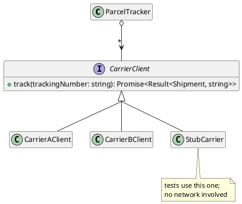

# Consuming Data and Services by Using APIs

The previous chapter was about dependencies between classes we wrote. We could edit all of those classes. If a contract was wrong, we changed it, and if a class was awkward to depend on, we redesigned it. This chapter is about dependencies we cannot edit. An **API** is a contract published by code we _call_ but do not _own_. APIs allow large systems to be built from code written by many different people. An API exposes functionality without exposing its implementation, so a program can use code written by others without having to understand how it works. Engineers spend much of their time reading, evaluating, and depending on APIs, and using them well is a distinct skill.

This chapter takes the position of the **client**: we call the API, and someone else decides what it does. The next chapter takes the other position and designs an API for other clients to use. Being a client raises two problems. First, the data an API returns was constructed by code we did not write, so we cannot assume it satisfies our invariants until we check them. Second, the API we depend on can change, fail, or disappear.

## Two Kinds of API

The term API covers two situations that look different but share the same underlying idea.

A **library API** is code we `import` and call in our own process. Most systems use many libraries, for everything from date arithmetic to encryption, so that their authors do not have to build that functionality themselves. Library calls are fast and behave like any other function call: the code runs in our process, and either returns or throws. You will often need to judge whether a library is appropriate, and to work out quickly how it should and should not be used.

You have been using this skill since [Chapter 9](../part1/09_validation). Every `expect(...).to.equal(...)` you have written is a call into the Vitest library, which was written by other engineers. You read its documentation when you chose between `to.equal` and `to.deep.equal`, and again when you looked up whether the assertion you wanted was `to.include` or `to.have.members`. You depended on its contract when you wrote `to.throw` and trusted it to run your function, catch the error, and compare the message. You have never seen its implementation, and have not needed to. The same is true of `readFile`, of `JSON.parse`, and of every array operation from [Part 1](../part1/index). This chapter looks more closely at a skill you have been practising all term.

A **web service API** is code we call over HTTP. It runs in someone else's process, usually on a different machine. Web services usually provide higher-level operations than libraries. A library might parse a date, while a web service might report where a parcel is. A web service call leaves our machine and crosses a network. It may take a second or more, fail partway through, or return something we did not expect.

The design advice is the same for both kinds of API: depend only on what is documented, keep what you depend on small, and do not let the dependency spread through your code. The ways they fail are very different:

| | Library API | Web service API |
|---|---|---|
| Cost of a call | Usually too small to notice. | Milliseconds to seconds, visible to the user. |
| Failure | Throws, or returns a bad value. | May also time out, partly complete, or never answer. |
| Data | Typed by the compiler. | Arrives as text, and is typed only if you check it. |
| Changing under you | When you choose to install a new version. | Whenever the provider deploys. |
| Testing | Call it directly. | Needs a stand-in, unless tests call the real service over the network. |

The difference in how each kind of API changes has the largest effect on design. A library changes only when _we_ upgrade it, so we choose when that happens, and we can read its release notes before we decide. A web service changes when _its provider_ deploys, which can happen at any time. The first sign of the change is often an error in production or a support ticket from a user.

#### A Tracker Across Several Carriers

This chapter and the rest of Part 3 use one running example. Later chapters follow the same system as it is published, cleaned up, debugged, and extended.

> As an online shopper, I want to see where all of my parcels are in one place, so that I do not have to visit a different website for every carrier.

A parcel tracker uses both kinds of API. Each carrier publishes its own web service, with its own URL scheme, its own JSON format, and its own vocabulary for what has happened to a parcel. The tracker also uses libraries. One library interprets the timestamp formats the carriers report, because date parsing written by hand is a common source of bugs. Later in this chapter, another library checks that a carrier's response has the shape its documentation describes. Everything the tracker shows a user therefore depends on code from outside the program.

```typescript
type ShipmentStatus = "in-transit" | "delivered" | "exception";

type Shipment = {
    trackingNumber: string;
    status: ShipmentStatus;
    lastSeenAt: number;     // milliseconds since the epoch
};
```

## Data Without Invariants

In Parts 1 and 2, every value was built by code we controlled. A `GuestList` could only come from the `GuestList` constructor, which let the constructor establish an invariant and the class preserve it. If a value existed, code we wrote had created it and checked it. A value that arrives from external code has no such guarantee. None of our constructors ran, and its type annotation is a claim rather than a fact. The carrier's response is a sequence of bytes that we hope describes a shipment. It might instead be an error page, an older version of the format, or a shipment whose status is a word we have never seen.

The error handling chapter recommended checking data as soon as it enters your program, and turning it into either a trusted value or a clear error at the boundary. As a design rule for this chapter:

_Convert once, at the edge, into a typed value whose invariant holds. After that point, the rest of the program works only with values it can trust._

The _edge_ is the place in the code where `unknown` data is converted into either a validated value or an error. Code after the edge works with `Shipment` objects and never needs to consider JSON. A program without such a boundary still needs the checks, but they end up spread throughout the program. Every function that touches a shipment then has to consider whether the status field is one of the three values the type promises.

<details class="tooltip link-110">
<summary>Data You Did Not Build</summary>

In CPSC 110, every value your functions consumed was constructed by your own code, usually a few lines earlier in the same file. A function that consumed a `ListOfSong` could rely on receiving one, because the only way to get a `ListOfSong` was to build it with the constructors from the data definition.

That reliability came from the setting rather than from the code. Once data arrives from a file, a service, or a user, the guarantee is gone. The value has whatever shape the outside world sent, and nothing ensures that it matches its data definition until some code checks it. Writing data definitions is still a useful habit. The new habit to add is checking that incoming values match them.

</details>

## JSON and the Type Hole

Carriers do not send us `Shipment` objects. They send text, usually in a format called **JSON**, which you have already used in [Chapter 7](../part1/07_async) to move data between a program and a file. `JSON.stringify` turns a value into text, and `JSON.parse` turns text back into a value.

Two properties of JSON matter for this chapter. The first is what JSON can represent: strings, numbers, booleans, `null`, arrays, and objects with string keys. JSON has no `Date`, no `undefined`, no `Map` or `Set`, and no functions, so any other kind of value has to be encoded using those forms. This is why timestamps arrive as strings or numbers, and have to be interpreted when they are received.

The second property is what happens to our _types_ when text is turned back into values.

`JSON.parse` returns `any`. It has no other choice, because the text is not known until run time, so the compiler has nothing to inspect. The same is true of `response.json()`, which reads the body of a web service response. [Chapter 7](../part1/07_async) used a line like this one:

```typescript
const report: StationReport = await response.json();
```

That line compiles, and it looks like every other typed assignment in the textbook, but it behaves differently. The annotation does not check anything. It _claims_ something. We have told the compiler that `report` is a `StationReport`, and the compiler accepts this. From that point on, it type-checks every use of `report` without ever verifying that the claim is true. If the service returns a field named `temp` where we expected `tempCelsius`, the program compiles without errors. It then fails somewhere else, when code reads `tempCelsius` and gets an `undefined` that the type system said was a number.

The same problem occurs whenever `as` is used on data from outside the program:

```typescript
const shipment = JSON.parse(text) as Shipment;   // a claim, not a check
```

`as Shipment` tells the compiler something that has not been checked. It does not inspect the value, convert it, or reject anything. It turns off the type checking that has been catching our mistakes since [Part 1](../part1/index), at the point where the data is least trustworthy. When a claim is applied to data from outside the program, any fault in that data will show up far from where it entered.

<details class="tooltip ts-tips">
<summary>The <code>as</code> Operator</summary>

This is the first time we have needed `as`. It tells the compiler that a value has a type the compiler could not work out on its own:

```typescript
<expression> as <Type>
```

`as` does much less than it appears to. It performs no conversion and runs no check. It produces no code at all. After compilation, the expression is unchanged, and the only difference is that the compiler no longer reports an error. At run time, the value is whatever it was before, whether or not it has the claimed shape.

TypeScript calls this operator a _type assertion_. This chapter calls it a _claim_ instead, to avoid confusion with the `assert` checks from [Chapter 8](../part1/08_errors). Those do the opposite. An `assert` tests a condition while the program runs, and halts when the condition is false. `as` tests nothing and cannot fail.

There is one narrow legitimate use, described in the next section, where the surrounding code has already established the fact being claimed. Everywhere else, using `as` to make a type error go away replaces a compile-time error with a fault at run time.

</details>

<details class="tooltip ts-tips">
<summary><code>unknown</code> Versus <code>any</code></summary>

TypeScript has two types for a value whose type is not known, and they behave very differently.

`any` turns off the type checker for that value. Every property access, call, and assignment involving an `any` value compiles, whether or not it makes sense. `JSON.parse` returns `any`, which is why type safety is lost when JSON is parsed.

You have seen little of `any` so far because this course configures TypeScript and its lint rules to reject it, so the type checker cannot be turned off by accident in code you write. `any` can still enter your code through the return type of a function someone else wrote, such as `JSON.parse`, which is why this chapter discusses it.

`unknown` is the safe alternative. A value of type `unknown` can be stored and passed around, but it cannot be used for anything else until its type has been checked:

```typescript
const raw: unknown = JSON.parse(text);
raw.trackingNumber;                    // compile error: 'raw' is of type 'unknown'
```

This compile error is useful. `unknown` forces the check that `any` lets you skip. Annotating incoming data as `unknown` turns a hidden problem into a compile error on the line where validation is missing. Give incoming data the type `unknown`, and use a conversion function as the only way to turn it into a more specific type.

</details>

## Converting, Not Claiming

Instead of making a claim, we can write a function that takes an `unknown` value and returns either a value we can trust or an explanation of what was wrong. The `Result` type from the error handling chapter is designed for this job:

<CollapsibleCode>

```typescript
/**
 * Converts an unvalidated response body into a Shipment.
 *
 * @param {unknown} raw the parsed body, of unknown shape
 * @returns {Result<Shipment, string>} ok: true with a valid shipment, or
 * ok: false with a description of the first problem found
 */
function toShipment(raw: unknown): Result<Shipment, string> {
    if (typeof raw !== "object") {
        return { ok: false, error: "response body is not an object" };
    }
    if (raw === null) {
        return { ok: false, error: "response body is null" };
    }
    const fields = raw as { [key: string]: unknown };

    const trackingNumber = fields.trackingNumber;
    if (typeof trackingNumber !== "string") {
        return { ok: false, error: "trackingNumber is missing or not a string" };
    }

    const status = fields.status;
    if (typeof status !== "string") {
        return { ok: false, error: "status is missing or not a string" };
    }
    const known: string[] = ["in-transit", "delivered", "exception"];
    if (known.includes(status) === false) {
        return { ok: false, error: "unrecognised status: " + status };
    }

    const lastSeenAt = fields.lastSeenAt;
    if (typeof lastSeenAt !== "number") {
        return { ok: false, error: "lastSeenAt is missing or not a number" };
    }

    return {
        ok: true,
        value: {
            trackingNumber: trackingNumber,
            status: status as ShipmentStatus,
            lastSeenAt: lastSeenAt
        }
    };
}
```

</CollapsibleCode>

The function is tedious to write, but its checks make the result trustworthy. It confirms that every field the type describes exists and has the right type. It also checks for an unrecognised status, because carriers do add new statuses over time. A value that passes these checks is a `Shipment` in the full sense that the rest of the program assumes, because its shape has been verified rather than claimed.

The error messages are also useful. The message "unrecognised status: held-at-depot" tells a maintainer what changed at the carrier and what to add. A claim would have produced a `Shipment` whose status was `held-at-depot`, even though the type does not allow that value. The failure would have appeared later, in code that reasonably assumed the status was one of the three allowed values.

<details class="tooltip deep-dive">
<summary>Claiming After Checking</summary>

The converter uses `as` twice, even though the previous section argued against it. Both uses come _after_ a check that establishes the fact being claimed. `raw as { [key: string]: unknown }` follows two tests confirming that `raw` is a non-null object, and `status as ShipmentStatus` follows a test confirming that `status` is one of the three permitted strings. In each case, the claim tells the compiler something the code has already checked. The claim is needed because TypeScript's type narrowing cannot work out these particular conclusions on its own.

The important distinction is between a claim used _instead of_ a check and a claim used _after_ one. A claim used instead of a check is unverified, and nothing will ever verify it. A claim used after a check works around a limitation of the type checker, and the check makes the claim true. To tell them apart, look at the code above the `as` and ask whether it has already established what is being claimed.

</details>

## Using a Schema Library

Very little of `toShipment` is specific to shipments. It confirms that a value is an object, that a field is present, that the field holds a string rather than a number, and that the string is one of a permitted set. None of these checks are about parcel tracking. A converter for a different type would have almost the same lines, with different names.

Work that is repetitive, mechanical, and costly when done wrong is a good candidate for a library. Zod is a library for this job. A Zod **schema** is a value that describes the shape data must have:

```typescript
import { z } from "zod";

const ShipmentSchema = z.object({
    trackingNumber: z.string(),
    status: z.enum(["in-transit", "delivered", "exception"]),
    lastSeenAt: z.number()
});
```

The schema looks much like the `Shipment` type declaration. Instead of maintaining both, the type can be _derived_ from the schema:

```typescript
type Shipment = z.infer<typeof ShipmentSchema>;
```

A hand-written type and a hand-written validator are two descriptions of the same data, and over time they tend to diverge. For example, someone might remove a status from `ShipmentStatus` and forget to remove it from the `known` array in `toShipment`. The converter would then accept a status that the type no longer allows, and the `as ShipmentStatus` claim would hide the problem from the compiler. Ordinary maintenance has reopened the type hole, and the code still looks correct. Deriving the type from the schema prevents this, because there is only one description, and the type is computed from it.

Validation then takes one call:

```typescript
function toShipment(raw: unknown): Result<Shipment, string> {
    const parsed = ShipmentSchema.safeParse(raw);
    if (parsed.success === false) {
        return { ok: false, error: parsed.error.message };
    }
    return { ok: true, value: parsed.data };
}
```

The return type of `safeParse` has the same structure as the `Result` type from the error handling chapter, with different field names. It is a tagged union with a boolean field that says which case applies. One case carries the validated value, and the other carries an error. Both designs have this shape because it is a good way for an operation that can fail to make its caller handle the failure.

Zod also offers `parse`, which returns the value directly and throws when validation fails. These are the two mechanisms from the error handling chapter, and Zod lets the caller choose between them. Use `safeParse` when invalid data is a routine outcome that the immediate caller should handle. Use `parse` when invalid data should abort the current operation and be handled much further up. A well-designed library leaves this decision to its caller, and the next chapter returns to this idea when we design a library of our own.

The cost of using the library is a new dependency, and everything this chapter says about dependencies applies to it. Zod has versions, can publish breaking changes, and could be abandoned. The code shown here uses one version of its API, so check the current documentation before relying on this page. Deciding whether to use it is the usual trade-off. Validation is repetitive, easy to get subtly wrong, and harmful when wrong, so a well-maintained library is usually the better choice. Adding a dependency just to check that one number is positive is not.

<details class="tooltip deep-dive">
<summary>Schemas Beyond Shape</summary>

A schema library can check more than which fields exist. It can also check constraints that a TypeScript type cannot express, which are the kind of invariants [Part 1](../part1/index) had to write in comments and enforce by hand:

```typescript
const ShipmentSchema = z.object({
    trackingNumber: z.string().min(1),
    status: z.enum(["in-transit", "delivered", "exception"]),
    lastSeenAt: z.number().int().nonnegative()
});
```

`z.number()` corresponds to the type `number`. `z.number().int().nonnegative()` corresponds to a documented invariant that no TypeScript type can express. The value came from outside the program, so the boundary has to check the constraint anyway. That makes the boundary a natural place to state the constraint once and enforce it automatically.

This connects to the abstraction chapters. A validated boundary establishes an invariant on incoming data in the same way that a constructor establishes one on a new object. After that point, the value is known to satisfy a condition that the type alone cannot express.

</details>

## What Serialisation Loses

Turning a value into text so it can be stored or transmitted is called **serialisation**, and turning that text back into a value is **deserialisation**. `JSON.stringify` and `JSON.parse` are the serialisation functions we have been using.

JSON holds data but not behaviour, which causes problems whenever a class is involved:

```typescript
const stored = JSON.stringify(tracker);               // serialises the fields
const restored = JSON.parse(stored) as ParcelTracker; // no methods on this
```

Serialisation records an object's fields, but not its class or its methods. Deserialisation returns a plain object with the right property names and none of the behaviour. Calling a method on it fails at run time, even though the claim made the code compile. A `Map` is worse, because it serialises to `{}` and silently loses every entry.

An object with behaviour therefore needs an explicit reconstruction step, which is another conversion function. The function reads the deserialised fields, validates them, and passes them to the real constructor. The object is then created the same way as every other instance, and its invariant is established the same way. Saving state to a file and reading it back is the same problem as reading a carrier's response, and it has the same solution.

A schema library does not change this. `safeParse` returns validated _data_ and nothing more. Turning that data into an object with methods and a class invariant is still our job. It is easy to assume that a validation library has done more than it has, so be clear about the division of work. The schema establishes that the deserialised fields are present and well formed. The class's constructor establishes everything else the class guarantees.

<details class="tooltip deep-dive">
<summary>Other Exchange Formats</summary>

JSON is common but not universal. _XML_ is older than JSON. It represents a similar tree of data with a more verbose syntax, and is still widespread in older enterprise systems and in document formats. _Protocol buffers_ take a different approach. The message shape is declared in a schema file, both sides generate code from that schema, and the data is sent in a compact binary form rather than as text. Because of the schema, both sides agree on the shape in advance. The binary encoding is smaller and faster to parse, but it cannot be read without special tools.

The format changes the mechanics but not the principle. Whatever the format, the data came from somewhere you do not control, and some code has to check that it means what you expect before the rest of the program relies on it.

</details>

## Calling a Web Service

With a conversion function in place, we can call the web service. Most web service APIs roughly follow a convention called **REST**. Knowing the convention makes an unfamiliar API partly predictable before you read its documentation.

The central idea in REST is the **resource**: a thing the service knows about, identified by a URL. For example, a shipment might be identified by `/shipments/9K4T`. Operations on a resource are expressed with different HTTP methods on the same URL:

| Method | Means | Safe to repeat? |
|---|---|---|
| `GET` | Read the resource | Yes; it changes nothing. |
| `POST` | Create something new | No; twice may create two. |
| `PUT` | Replace the resource | Yes; the result is the same either way. |
| `DELETE` | Remove the resource | Yes; once it is removed, it stays removed. |

The response includes a **status code** that says how the request went. The ranges matter more than the individual numbers. A `2xx` code means the request succeeded. A `4xx` code means the request was wrong, for example because of a bad tracking number or a missing key. A `5xx` code means the service failed while handling the request, which is a problem at the provider rather than a mistake by the client. The status code should shape how the client responds. A request that received a `4xx` will usually fail the same way if it is repeated, while a request that received a `5xx` might succeed on a later attempt.

A request sends data to the service in one of three places, and the convention is consistent enough to rely on. The **path** identifies the resource (`/shipments/9K4T`). The **query string** adjusts the request (`?includeHistory=true`). The **body** carries content for `POST` and `PUT`.

Reading a response uses `fetch` and `await` from the asynchronous chapter:

```typescript
const response = await fetch("https://api.carrier-a.example/shipments/9K4T");
const body: unknown = await response.json();
const shipment = toShipment(body);
```

The difference from the version in [Chapter 7](../part1/07_async) is the middle line. The body is given the type `unknown` rather than the type we hope it has, so the compiler requires us to pass it through `toShipment` before any other code can use it.

<details class="tooltip ts-tips">
<summary>Optional Parameters and Option Objects</summary>

API calls tend to gain settings over time, such as a timeout, a page size, or whether to include history. Two pieces of syntax help with this.

A parameter can be made **optional** by adding `?` after its name. Inside the function, an optional parameter may be `undefined`:

```typescript
function track(trackingNumber: string, includeHistory?: boolean): void {
    if (includeHistory === undefined) {
        // caller did not say; choose a default
    }
}
```

When there is a sensible default, a default parameter value is usually clearer: `includeHistory: boolean = false`. Default parameter values were introduced in the implementation freedom chapter, where the `ImmutableGuestList` constructor declared `guests: string[] = []`.

With more than two or three settings, both forms become hard to read at the call site, because a call like `track("9K4T", true, false, 30)` does not say what each argument means. The usual convention is to collect the settings into a single **options object**:

```typescript
type TrackOptions = {
    includeHistory?: boolean;
    timeoutMs?: number;
};

function track(trackingNumber: string, options: TrackOptions = {}): void { /* ... */ }
```

The call then names each setting it uses: `track("9K4T", { includeHistory: true })`. This addresses the problem the coupling chapter raised with boolean parameters, because each setting is labelled at the call site.

</details>

## Three Ways a Call Fails

A local function call either returns or throws. A call across a network can fail in three different ways, and code that handles only one of them will fail in production.

_The call does not complete._ The network might be down, the address might not resolve, or the connection might time out. There is no response to inspect. `fetch` rejects its promise, so the failure arrives as a thrown error at the `await`.

_A response arrives with an error status._ The service answered, but the status is `404` or `500`. This case is easy to get wrong, because _`fetch` does not throw on an error status_. It rejects only when it could not get a response at all. From `fetch`'s point of view, a `404` is a successful HTTP exchange, so the promise resolves, and the code continues with a body that contains an error message rather than a shipment. The status has to be checked explicitly:

```typescript
if (response.ok === false) {
    // 4xx or 5xx: a real answer, and not the one we wanted
}
```

_A successful response contains the wrong data._ The status is `200` and the body is well-formed JSON, but a field is missing or the status string is one we have never seen. Nothing went wrong in the network exchange. The problem is that the data does not match what the contract described. The converter exists to catch this kind of failure.

The class that talks to one carrier handles all three:

<CollapsibleCode>

```typescript
class CarrierAClient {
    private readonly baseUrl: string;

    constructor(baseUrl: string) {
        this.baseUrl = baseUrl;
    }

    /**
     * Looks up one shipment through this carrier's web service.
     *
     * @param {string} trackingNumber the carrier's tracking number
     * @returns {Promise<Result<Shipment, string>>} ok: true with the shipment,
     * or ok: false describing why it could not be retrieved
     */
    async track(trackingNumber: string): Promise<Result<Shipment, string>> {
        let response: Response;
        try {
            response = await fetch(this.baseUrl + "/shipments/" + trackingNumber);
        } catch {
            return { ok: false, error: "could not reach the carrier" };
        }

        if (response.ok === false) {
            return { ok: false, error: "carrier returned status " + response.status };
        }

        let body: unknown;
        try {
            body = await response.json();
        } catch {
            return { ok: false, error: "carrier response was not valid JSON" };
        }

        return toShipment(body);
    }
}
```

</CollapsibleCode>

Each failure produces a different message, which a maintainer reading a log will need. The messages "could not reach the carrier", "carrier returned status 500", and "unrecognised status: held-at-depot" each call for a different response. Collapsing them into a single "tracking failed" message would discard the information that tells them apart.

Network calls have two other properties that local calls do not have.

_Latency cannot be hidden._ The call takes real time, so `track` is `async`, and so is every function that calls it, all the way up to the code that handles the user's click. The asynchronous chapter described how `async` spreads to callers, and web services are where you will see this most often.

_A response is a snapshot._ The carrier told us where the parcel was at the moment we asked. By the time the answer is displayed, the parcel may have moved. Data fetched over a network may be out of date as soon as it arrives, and a design that treats it as current will eventually show a user incorrect information.

<details class="tooltip deep-dive">
<summary>Retrying Safely</summary>

A call that failed because of a timeout or a `5xx` might succeed if tried again, so retrying is a common and reasonable response. Whether retrying is _safe_ depends on what the call does.

An operation is **idempotent** when performing it twice has the same effect as performing it once. `GET` is idempotent because reading changes nothing. `PUT` is idempotent because setting a value twice leaves the same value. Retrying either operation is harmless.

`POST` is not idempotent. It means "create something new", so a retry may create a second copy. Suppose the first request arrived and did its work, but the _response_ was lost. The client cannot tell this apart from a request that never arrived. Retrying would then book a second parcel and charge the customer twice.

In practice:

- Retry idempotent operations freely.
- Retry non-idempotent operations only when the API documents a way to make them safe. This is usually a key supplied by the caller, which the server uses to recognise a duplicate request.
- Wait between retries. A service that is already overloaded gets worse if every failed request is immediately sent three more times.

</details>

## Isolating Dependencies

So far, this chapter has considered a single call. The next design question is where in the program these calls should be made.

The simplest approach is to call `fetch` wherever a shipment is needed. This works, but it spreads knowledge of the carrier's URL scheme, JSON shape, status vocabulary, and error conventions across every file that displays a parcel. When the carrier changes any of these, every one of those files has to change. This is the ripple effect from the previous chapter, caused by a dependency we have no control over.

The solution is the same one the previous chapter used: define the contract we want, and depend on that instead.

```typescript
/**
 * A source of shipment information for one carrier.
 */
interface CarrierClient {
    /**
     * Looks up the current state of one shipment.
     *
     * @param {string} trackingNumber the tracking number to look up
     * @returns {Promise<Result<Shipment, string>>} ok: true with the shipment,
     * or ok: false describing why it could not be retrieved
     */
    track(trackingNumber: string): Promise<Result<Shipment, string>>;
}
```

`CarrierAClient` already has this signature, so making it satisfy the contract only requires adding `implements CarrierClient`. Each carrier then gets an **adapter**: a class that implements `CarrierClient`, knows one carrier's URLs, JSON format, and vocabulary, and converts all of it into the `Shipment` type we defined. The differences between carriers are handled entirely inside the adapters.

```typescript
class CarrierAClient implements CarrierClient { /* as written above */ }
class CarrierBClient implements CarrierClient { /* the same job, a different carrier */ }
```

The tracker depends on the interface, never on a specific carrier:

```typescript
class ParcelTracker {
    private readonly carriers: CarrierClient[];

    constructor(carriers: CarrierClient[]) {
        this.carriers = carriers;
    }

    async locate(trackingNumber: string): Promise<Result<Shipment, string>> {
        for (const carrier of this.carriers) {
            const found = await carrier.track(trackingNumber);
            if (found.ok === true) {
                return found;
            }
        }
        return { ok: false, error: "no carrier recognised " + trackingNumber };
    }
}
```


<!-- caption="The tracker depends on a contract we own, and each carrier is adapted to it." -->

The tracker contains no URLs, no JSON, and no code that uses HTTP. Supporting a new carrier means adding a new adapter without changing the tracker. This is the Open/Closed Principle applied to a dependency on another company's service.

### Supplying the Dependency

Some code must still decide which carriers exist and pass them to the tracker. `ParcelTracker` does not create them. It receives them through its constructor and uses whatever it is given. Passing a dependency in from outside, rather than constructing it internally, is called **dependency injection**. It is the usual way to apply the Dependency Inversion Principle introduced at the end of [Part 2](../part2/index).

The decision has to be made somewhere, and it is best to make it in one place at the edge of the program, called the **composition root**:

```typescript
// the one place in the program that names a concrete carrier
const tracker = new ParcelTracker([
    new CarrierAClient("https://api.carrier-a.example"),
    new CarrierBClient("https://api.carrier-b.example")
]);
```

This answers the question that [Part 2](../part2/index) and the coupling chapter both left open. Some code must always name concrete classes, so construction cannot be avoided. Instead, construction is _gathered_ into a single place that the rest of the program does not depend on, and all other code names only contracts.

### Testing Without the Network

The most immediate benefit is that the tracker becomes testable. A test that calls a real carrier is slow, needs credentials, fails when the carrier's service is down, and cannot produce unusual cases on demand. Because `ParcelTracker` accepts any `CarrierClient`, a test can supply one that answers immediately:

```typescript
class StubCarrier implements CarrierClient {
    private readonly answer: Result<Shipment, string>;

    constructor(answer: Result<Shipment, string>) {
        this.answer = answer;
    }

    async track(trackingNumber: string): Promise<Result<Shipment, string>> {
        return this.answer;
    }
}

test("the tracker reports the first carrier that recognises the number", async () => {
    const delivered: Shipment = {
        trackingNumber: "9K4T",
        status: "delivered",
        lastSeenAt: 1000
    };
    const tracker = new ParcelTracker([
        new StubCarrier({ ok: false, error: "unknown to this carrier" }),
        new StubCarrier({ ok: true, value: delivered })
    ]);

    const found = await tracker.locate("9K4T");

    expect(found).to.deep.equal({ ok: true, value: delivered });
});
```

`StubCarrier` is a test double, like the ones in the interfaces chapter, and test doubles are especially useful for external services. A stub can also produce situations that a real service will not produce on request, such as a carrier that cannot be reached, a carrier that reports a status we do not recognise, or every carrier failing at once. These are the paths most likely to be wrong in production, and the least likely to be exercised by a test that calls a live service.

## Unfamiliar APIs

The last skill in this chapter is needed before any of the code above can be written: working out what an unfamiliar API does.

_Start from the official documentation._ It is the only description of the API that the provider has committed to. Look for the available operations, the exact shapes of requests and responses, the errors that can be returned, the limits on how often you can make calls, and which version the documentation describes.

_The implementation is not the documentation._ For an open-source library, you can usually read the source code, which is useful when the documentation is unclear. However, behaviour you find in the source was never promised. If the documentation says a function returns the matching items, and the source happens to return them sorted, sorting is not part of the contract. Code that depends on the sorting depends on something the author can change without warning. Depend on what is documented, not on what you have observed.

_Assume it will change._ Libraries publish new versions, and a new major version signals that something you rely on may have changed or been removed. A web service can change behind the same URL without any announcement. For both reasons, keep the part of the API you use small, and keep it behind an interface of your own. Adapting to a change is then one edit rather than many.

<details class="tooltip deep-dive">
<summary>Using AI to Learn an API</summary>

An AI assistant can help you get started quickly with an unfamiliar API, but it can also mislead you. These tools can produce plausible code that calls functions that do not exist, passes parameters in the wrong order, or relies on behaviour from an out-of-date version. They present this code with the same confidence as correct code.

To use them well, treat their output as a starting point rather than an answer. Ask for links to the official documentation, then follow them and confirm that the function exists, takes those arguments, and behaves as described. If the assistant cannot provide a citation, or the documentation does not say what the assistant claimed, do not trust the code either.

This is the same rule as the rest of this section: depend on what the provider documents, regardless of how you found out about it.

</details>

#### Consuming Deliberately

An API is a contract that we depend on but do not control. Both parts of that description create work for the client.

Because we do not control the API, the code that uses it should be small, clearly named, and kept in one place. An interface we own, with one adapter per provider, keeps a change by the provider from spreading through our code, and lets the whole system be tested without a network. We also do not control the data the API returns, so that data satisfies no invariant until we establish one. `JSON.parse` does not check anything, and an `as` on incoming data is a claim rather than a check. The guarantees of Parts 1 and 2 apply again only after the boundary where `unknown` data becomes a typed value.

Both practices have costs. A converter is tedious to write, an adapter is an extra class, and handling three kinds of failure takes more code than handling one. In return, the unpredictability of outside data and services is contained at one clear boundary.

<details class="tooltip exercise">
  <summary>Exercise: Consuming a Currency Service</summary>

> As a traveller, I want to see prices from foreign shops in my own currency, so that I can tell whether something is a good deal without doing arithmetic.

A shop-comparison tool needs exchange rates. A service provides them at `GET https://rates.example.org/v1/latest?base=CAD`, and its documentation says it returns:

```json
{
  "base": "CAD",
  "retrievedAt": 1735689600000,
  "rates": { "USD": 0.74, "EUR": 0.68, "JPY": 111.2 }
}
```

A first attempt looks like this:

```typescript
type RateTable = {
    base: string;
    retrievedAt: number;
    rates: { [currency: string]: number };
};

async function getRates(base: string): Promise<RateTable> {
    const response = await fetch("https://rates.example.org/v1/latest?base=" + base);
    return await response.json() as RateTable;
}
```

Work through the following:

1. _Name the failures._ List everything that can go wrong with this call. For each one, say whether this code detects it, and what the caller receives when it does not.
2. _Close the type hole by hand._ Rewrite `getRates` so that the body enters the program as `unknown`, and write the conversion function that turns it into either a `RateTable` or an error message. The `rates` field is the hardest part, because its keys are not known in advance, so every entry has to be checked to confirm that it maps a string to a number. Decide whether a rate of `0`, a negative rate, or an empty `rates` object should be accepted, and document the decision.
3. _Close it again with a schema._ Write a Zod schema for the same response, derive the `RateTable` type from it, and replace your converter with one call to `safeParse`. Compare the two versions: their length, how clearly each states the constraints from question 2, and what happens to each when the service adds a field.
4. _Choose an error mechanism._ Should `getRates` return a `Result` or throw? Justify your choice using the criteria from the error handling chapter. The immediate caller is a price display that must show the user something either way. Say which of Zod's two methods matches your choice.
5. _Isolate it._ Define the interface the rest of the program should depend on, so that no other file mentions `fetch`, the URL, or the service's JSON shape. Explain what would have to change if the tool switched to a different rates provider, and what would not.
6. _Test it._ Write a test double for your interface and two tests that use it: one where rates are available, and one where the service is unreachable. Neither test may make a network call.
7. _Consider staleness._ A rate fetched an hour ago may no longer be correct. Describe one design that makes the age of the data visible to a caller. Say whether the existing `retrievedAt` field is enough to support it, and if not, what you would add to `RateTable`.

</details>
