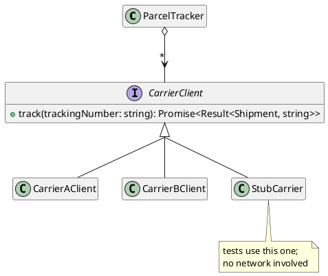

# Consuming Data and Services by Using APIs

The previous chapter was about dependencies among classes we wrote. Every one of them could be edited: if a contract was wrong, we changed it, and if a class was awkward to depend on, we redesigned it. This chapter is about dependencies that do not work that way. An **API** is a contract published by code we _call_ but do not _own_. APIs are what allow systems to scale to solve large problems. They expose functionality without exposing its implementation, so a program can use code written by others without having to understand it. That makes APIs the surfaces engineers spend much of their time reading, evaluating, and depending on, and it makes being able to use APIs well a distinct skill.

This chapter takes the position of the **client**: we call the API, and someone else decides what it does. The next chapter takes the other position, designing an API for other clients to use. Two things make the client's position uncomfortable: The data an API returns was constructed by code we did not write, so it does not satisfy our invariants unless we check them. And the API code we depend on can evolve, fail, or disappear.

## Two Kinds of API

The term API covers two situations that feel different but are the same core idea:

A **library API** is code we `import` and call in our own process. Most systems use many libraries, for everything from date arithmetic to encryption, because a library is functionality an author chose not to build themselves. Calls are fast and ordinary: the code runs in our process, and either returns or throws. Being able to judge whether a library is appropriate, and to quickly work out how it should and should not be used, is a skill you will apply constantly.

You have been applying this skill since the verification chapter. Every `expect(...).to.equal(...)` you have written is a call into the Vitest library written by another engineer. You read its documentation when you chose between `to.equal` and `to.deep.equal`, and again when you looked up whether the assertion you wanted was `to.include` or `to.have.members`. You depended on its contract when you wrote `to.throw` and trusted it to run your function, catch the error, and compare the message. You have never seen its implementation, and have not needed to. The same is true of `readFile`, of `JSON.parse`, and of every array operation from [Part 1](../part1/index). This chapter is about reflecting on this skill that you have been practising all term.

A **web service API** is code we call over HTTP, running in someone else's process, usually on a completely different machine. Web services tend to sit at higher functional boundaries than libraries: not "parse this date" but "tell me where this parcel is." A call leaves our machine, crosses a network, and may take a second, or fail halfway, or return something we did not expect.

The design advice is the same for both kinds of APIs. Depend on what is documented, keep what you depend on small, and do not let the dependency spread. The failure modes are not the same at all:

| | Library API | Web service API |
|---|---|---|
| Cost of a call | Nanoseconds; ignorable | Milliseconds to seconds; visible to the user. |
| Failure | Throws, or returns a bad value | May also time out, half-complete, or never answer. |
| Data | Typed by the compiler | Arrives as text; typed only if you check it. |
| Changing under you | On the version you choose to install | Whenever the provider deploys. |
| Testing | Call it directly | Needs a stand-in unless tests hit the network. |

The last two rows are worth extra reflection. A library changes when _we_ upgrade it, so we choose the moment and can read its release notes first before we decide to upgrade. A web service changes when _they_ deploy, which may be during our lunch break, and the first sign is often a test failure or a support ticket.

## A Tracker Across Several Carriers

We use one running example for this chapter and the rest of Part 3, following the same system as it is published, cleaned up, debugged, and extended.

> As an online shopper, I want to see where all of my parcels are in one place, so that I do not have to visit a different website for every carrier.

A parcel tracker consumes both kinds of API. Each carrier publishes its own web service, with its own URL scheme, its own JSON, and its own vocabulary for what has happened to a parcel. Alongside those, the tracker uses libraries: one to interpret the timestamp formats the carriers report, because writing date parsing by hand is a way to acquire bugs rather than functionality, and later in this chapter one to check that a carrier's response is shaped the way its documentation claims. Everything the tracker shows a user therefore depends on code that originates outside the program.

```typescript
type ShipmentStatus = "in-transit" | "delivered" | "exception";

type Shipment = {
    trackingNumber: string;
    status: ShipmentStatus;
    lastSeenAt: number;     // milliseconds since the epoch
};
```

## Data From Outside Has No Invariants

Everything in Parts 1 and 2 was built by code we controlled. A `GuestList` could only come from the `GuestList` constructor, which is what let the constructor establish an invariant and the class preserve it. When a value existed, something we wrote had vouched for it. A value that arrives from external code has no such history. We can't hold anybody responsible for it, no constructor of ours ran, and its type annotation is a claim rather than a fact. The carrier's response is a sequence of bytes that we hope describes a shipment. It might describe an error page, an older version of the format, or a shipment whose status is a word we have never seen.

The rule that follows is the one the error handling chapter promised, when it said to check data the moment it crosses into your program and convert outside uncertainty into either a trusted value or a clear error. Stated as a design rule for this chapter:

_Convert once, at the edge, into a typed value whose invariant holds. Past that point, the rest of the program deals only in values it can trust._

The _edge_ is a place in the code where everything upstream handles `unknown` data and produces either a validated value or an error. Everything downstream works with `Shipment` objects and never thinks about JSON again. A program without such a boundary does not avoid the checks; it spreads them, so that every function that touches a shipment has to consider whether the status field is one of the three values the type promises.

<details class="tooltip link-110">
<summary>Data You Did Not Build</summary>

In CPSC 110 every value your functions consumed was one your own code had constructed, usually a few lines earlier in the same file. A function that consumed a `ListOfSong` could rely on receiving one, because the only way to obtain a `ListOfSong` was to build it with the constructors from the data definition.

That reliability was a property of the setting rather than of the code. Once data arrives from a file, a service, or a user, the guarantee is gone: the value has whatever shape the outside world sent, and the data definition it is supposed to satisfy is a hope until something checks. The habit worth carrying forward is the data definition itself; the habit worth adding is verifying that an incoming value matches one.

</details>

## JSON and the Type Hole

Carriers do not send us `Shipment` objects. They send text, and the common format for that text is **JSON**, which you have already used in the labs to move data between a program and a file. `JSON.stringify` turns a value into text and `JSON.parse` turns text back into a value.

Two of its properties matter for this chapter. The first is what JSON can express: strings, numbers, booleans, `null`, arrays, and objects with string keys. There is no `Date`, no `undefined`, no `Map` or `Set`, and no functions, so anything richer has to be encoded into one of those forms. That is why timestamps arrive as strings or numbers and have to be interpreted when they are received.

The second property is what happens to our _types_ when text becomes values again, and that is where the trouble starts.

`JSON.parse` returns `any`. It has to: the text is not known until run time, so there is nothing for the compiler to inspect. The same is true of `response.json()` when reading a web service reply. The asynchronous chapter in [Part 1](../part1/index) wrote a line very like this one:

```typescript
const report: StationReport = await response.json();
```

That line compiles, and it looks like every other typed assignment in the textbook, but it is not. The annotation does not check anything; it _claims_ something. We have told the compiler that the `report` is a `StationReport`, the compiler has believed us, and from that point on it will type-check every use of `report` without ever verifying whether this is true. If the service returns a field named `temp` where we expected `tempCelsius`, the program compiles cleanly and fails somewhere else entirely, holding an `undefined` that the type system claimed was a number.

The same weakness occurs whenever `as` is used to describe outside data:

```typescript
const shipment = JSON.parse(text) as Shipment;   // a claim, not a check
```

`as Shipment` is a lie told to the compiler. It does not inspect the value, convert it, or reject anything. It disables the one mechanism that has been catching our mistakes since [Part 1](../part1/index), at precisely the point where the data is least trustworthy. Whenever you see a claim applied to something that came from outside the program, you are looking at a place where a fault will surface far from its cause.

<details class="tooltip ts-tips">
<summary>The <code>as</code> Operator</summary>

This is the first time we have needed `as`, which tells the compiler that a value has a type it could not work out on its own:

```typescript
<expression> as <Type>
```

It is worth being precise about what it does, because it does far less than it appears to. `as` performs no conversion and runs no check. It produces no code at all: once compiled, the expression is exactly what it was, and the only thing that changed is that the compiler stopped objecting. Whatever the value was at run time, correctly shaped or not, it still is.

TypeScript's own name for this operator is a _type assertion_. This chapter calls it a _claim_ instead, to keep it clear of the `assert` checks from [Part 1](../part1/index), which do the opposite: an `assert` tests a condition while the program runs and halts when it fails, whereas `as` tests nothing and cannot fail.

There is one narrow legitimate use, described later in this section, where the surrounding code has already established the fact being claimed. Everywhere else, using `as` to make a type error go away trades a complaint from the compiler for a fault at run time.

</details>

<details class="tooltip ts-tips">
<summary><code>unknown</code> Versus <code>any</code></summary>

TypeScript has two types for a value whose type is not known, and they behave very differently.

`any` switches the type checker off for that value. Every property access, every call, and every assignment involving an `any` compiles, whether or not it makes sense. It is the type `JSON.parse` returns, which is why parsing is where type safety quietly ends.

You have seen little of `any` so far, and that is by arrangement rather than by luck: this course configures TypeScript and its lint rules to reject it, so the type checker cannot be switched off by accident in code you write. `JSON.parse` is how it arrives anyway, through the return type of a function somebody else wrote, which is why the chapter has to name it.

`unknown` is the safe counterpart. A value of type `unknown` may be held and passed around, but it cannot be used for anything until its type has been established:

```typescript
const raw: unknown = JSON.parse(text);
raw.trackingNumber;                    // compile error: object is of type 'unknown'
```

The error is the feature. `unknown` forces the check that `any` allows you to skip, so annotating incoming data as `unknown` turns a silent hazard into a compile error that points at the exact line where validation is missing. Take incoming data as `unknown`, and let a conversion function be the only thing that turns it into a type.

</details>

## Converting Instead of Claiming

The alternative to claiming is a function that takes `unknown` and returns either a value we can trust or an explanation of what was wrong. This is the `Result` type from the error handling chapter, used for exactly the job it was designed for:

<CollapsibleCode>

```typescript
/**
 * Converts an unvalidated response body into a Shipment.
 *
 * @param {unknown} raw the parsed body, of unknown shape
 * @returns {Result<Shipment, string>} ok: true with a valid shipment, or
 * ok: false with a description of the first problem found
 */
function toShipment(raw: unknown): Result<Shipment, string> {
    if (typeof raw !== "object") {
        return { ok: false, error: "response body is not an object" };
    }
    if (raw === null) {
        return { ok: false, error: "response body is null" };
    }
    const fields = raw as { [key: string]: unknown };

    const trackingNumber = fields.trackingNumber;
    if (typeof trackingNumber !== "string") {
        return { ok: false, error: "trackingNumber is missing or not a string" };
    }

    const status = fields.status;
    if (typeof status !== "string") {
        return { ok: false, error: "status is missing or not a string" };
    }
    const known: string[] = ["in-transit", "delivered", "exception"];
    if (known.includes(status) === false) {
        return { ok: false, error: "unrecognised status: " + status };
    }

    const lastSeenAt = fields.lastSeenAt;
    if (typeof lastSeenAt !== "number") {
        return { ok: false, error: "lastSeenAt is missing or not a number" };
    }

    return {
        ok: true,
        value: {
            trackingNumber: trackingNumber,
            status: status as ShipmentStatus,
            lastSeenAt: lastSeenAt
        }
    };
}
```

</CollapsibleCode>

The function is tedious, and that tedium is the price of the guarantee. Every field the type describes is confirmed to exist and to have the right type, and the unrecognised-status case is checked because a carrier adding a fourth status is a thing that will happen. What emerges from these checks is a `Shipment` in the full sense the rest of the program assumes: not a value we labelled `Shipment`, but one we explicitly verified.

Notice the errors reported during the verification: "Unrecognised status: `held-at-depot`" tells a maintainer what changed at the carrier and what to add. A claim would have produced a `Shipment` whose status was `held-at-depot` in defiance of its own type, and the failure would have appeared later, somewhere that had every right to assume otherwise.

<details class="tooltip deep-dive">
<summary>Claiming After Checking</summary>

The converter uses `as` twice, which deserves an explanation given the argument just made against it. Both uses come _after_ a check that establishes the fact being claimed. `raw as { [key: string]: unknown }` follows two tests confirming that `raw` is a non-null object, and `status as ShipmentStatus` follows a test confirming that `status` is one of the three permitted strings. In each case the claim tells the compiler something the code has already proved, because TypeScript's narrowing does not carry the conclusion across in these particular forms.

That is the distinction worth holding on to. A claim used _instead of_ a check is a lie: nothing has verified it and nothing will. A claim used _after_ a check is a limitation of the type checker, and the surrounding code is what makes it true. The test for telling them apart is straightforward: delete the `as` and ask whether anything above it has already established what was being claimed.

</details>

## The Same Job, From a Library

Look at `toShipment` again and notice how little of it is about shipments. Confirming that a value is an object, that a field is present, that it holds a string rather than a number, that the string is one of a permitted set: none of that knowledge belongs to parcel tracking. Write a second converter for a different type and almost every line will be the same shape with different names.

Repetitive, mechanical, and consequential when done wrong is a precise description of work worth taking from a library, and this is the job Zod does. A Zod **schema** is a value that describes the shape data must have:

```typescript
import { z } from "zod";

const ShipmentSchema = z.object({
    trackingNumber: z.string(),
    status: z.enum(["in-transit", "delivered", "exception"]),
    lastSeenAt: z.number()
});
```

The schema reads much like the `Shipment` type declaration, which raises an obvious question: do we now maintain both, and what happens when they disagree? The answer is that we do not. The type can be _derived_ from the schema:

```typescript
type Shipment = z.infer<typeof ShipmentSchema>;
```

This matters more than it first appears. A hand-written type and a hand-written validator are two descriptions of one thing, and two descriptions drift. Someone adds a field to `Shipment`, forgets the converter, and the validator quietly stops checking a field the type still promises: a type hole reopened by ordinary maintenance, in code that looks fine. Deriving the type from the schema makes the drift impossible, because there is only one description and the other is computed from it. This is the same argument the implementation freedom chapter made for a single source of truth, applied to validation.

Validating is one call:

```typescript
function toShipment(raw: unknown): Result<Shipment, string> {
    const parsed = ShipmentSchema.safeParse(raw);
    if (parsed.success === false) {
        return { ok: false, error: parsed.error.message };
    }
    return { ok: true, value: parsed.data };
}
```

The return type of `safeParse` should look familiar. It is a tagged union with a boolean discriminator, one branch carrying the validated value and the other carrying an error, which is the `Result` type from the error handling chapter under different field names. Zod's authors did not copy it from us; both arrived at the same shape because it is what an operation that can fail should return when the caller must be forced to confront the failure.

Zod also offers `parse`, which returns the value directly and throws when validation fails. The two methods are the two mechanisms from the error handling chapter, offered side by side, with the choice left to the caller: `safeParse` when the failure is expected and the caller must handle it, `parse` when a malformed value means a bug and stopping is the right response. A well-designed library declines to make that decision for you, which is a lesson the next chapter takes up from the other side.

What the library costs is a dependency, and everything this chapter says about dependencies now applies to it. Zod has a version, publishes breaking changes, and can be abandoned. The API shown here is one released form of it, and the chapter's own advice applies: check the current documentation rather than trusting this page. The judgement is the ordinary one. Validation is repetitive, easy to get subtly wrong, and dangerous when wrong, so a well-maintained library is usually the better answer. Pulling in a dependency to check that one number is positive is not.

<details class="tooltip deep-dive">
<summary>Schemas Beyond Shape</summary>

A schema library checks more than which fields exist. Constraints that a TypeScript type cannot express are exactly the invariants [Part 1](../part1/index) had to write in comments and enforce by hand:

```typescript
const ShipmentSchema = z.object({
    trackingNumber: z.string().min(1),
    status: z.enum(["in-transit", "delivered", "exception"]),
    lastSeenAt: z.number().int().nonnegative()
});
```

`z.number()` corresponds to the type `number`; `z.number().int().nonnegative()` corresponds to a documented invariant that no type could hold. The boundary is where such a constraint has to be checked anyway, because the value came from outside, so it is the natural place to state it once and enforce it mechanically.

This is worth connecting back to the abstraction chapters. A validated boundary establishes an invariant on incoming data in the same way a constructor establishes one on a new object: past that point, the value is known to satisfy something the type alone cannot say.

</details>

## What Serialisation Loses

Turning a value into text so it can be stored or transmitted is called **serialisation**, and turning that text back into a value is **deserialisation**. `JSON.stringify` and `JSON.parse` are the pair we have been using, and there is something they do not carry between them.

JSON holds data, not behaviour, which catches people out whenever a class is involved.

```typescript
const stored = JSON.stringify(shipmentTracker);       // serialises the fields
const restored = JSON.parse(stored) as ParcelTracker; // no methods on this
```

Serialisation records an object's fields. It does not record its class, its methods, or its private state in any recoverable form. What deserialisation returns is a plain object with the right property names and none of the behaviour, so calling a method on it fails while the program runs even though the claim made it compile. A `Map` fares worse still: it serialises to `{}`, silently losing every entry.

Anything with behaviour therefore needs an explicit reconstruction step, which is the conversion function again. Read the deserialised fields, validate them, and hand them to the real constructor, so the object comes back through the same door every other instance came through, with its invariant established the same way. Persisting state to a file and reading it back is the same problem as reading a carrier's response, and it has the same answer.

A schema library does not change this. `safeParse` returns validated _data_, which is what it promised and all it promised; turning that data into an object with methods and a class invariant is still ours to do. The division is worth stating explicitly, because it is easy to assume a validation library has done more than it has: the schema establishes that the deserialised fields are present and well formed, and the constructor establishes everything a `Shipment` is supposed to guarantee beyond that.

<details class="tooltip deep-dive">
<summary>Other Exchange Formats</summary>

JSON is common but not universal. _XML_ predates it, carries a similar tree of data with a heavier syntax, and remains widespread in older enterprise systems and in document formats. _Protocol buffers_ take a different approach: the message shape is declared in a schema file, both sides generate code from that schema, and the data travels in a compact binary form rather than as text. The schema means the shape is agreed in advance rather than checked on arrival, and the binary encoding is smaller and quicker to parse, at the cost of not being readable without tooling.

The choice changes the mechanics and not the principle. Whatever the format, the data crossed into your program from somewhere you do not control, and something has to establish that it means what you expect before the rest of the program relies on it.

</details>

## Calling a Web Service

With conversion in hand, we can make the call. Most web service APIs follow a broadly **REST**-shaped convention, which is worth knowing because it makes an unfamiliar API partly predictable before you read its documentation.

The organising idea is the **resource**: a thing the service knows about, identified by a URL. A shipment might be `/shipments/9K4T`. Operations on that resource are expressed with HTTP methods rather than with different URLs:

| Method | Means | Safe to repeat? |
|---|---|---|
| `GET` | Read the resource | Yes; it changes nothing. |
| `POST` | Create something new | No; twice may create two. |
| `PUT` | Replace the resource | Yes; the result is the same either way. |
| `DELETE` | Remove the resource | Yes, in effect. |

The response carries a **status code** saying how the request went. The ranges matter more than the individual numbers: `2xx` means it worked, `4xx` means the request was wrong (a bad tracking number, a missing key), and `5xx` means the service failed while trying (their outage, not your mistake). The distinction is a diagnostic that arrives free with every call, and it should shape how the client responds: a `4xx` will fail identically if repeated, while a `5xx` might not.

Data goes to the service in one of three places, and the convention is stable enough to guess from: the **path** identifies which resource (`/shipments/9K4T`), the **query string** adjusts the request (`?includeHistory=true`), and the **body** carries content for `POST` and `PUT`.

Reading a response uses the `fetch` and `await` machinery from the asynchronous chapter:

```typescript
const response = await fetch("https://api.carrier-a.example/shipments/9K4T");
const body: unknown = await response.json();
const shipment = toShipment(body);
```

The change from the version in [Part 1](../part1/index) is the middle line. The body is taken as `unknown` rather than annotated with the type we are hoping for, so the compiler now requires us to pass it through `toShipment` before anything else can use it.

<details class="tooltip ts-tips">
<summary>Optional Parameters and Option Objects</summary>

API calls tend to accumulate settings: a timeout, a page size, whether to include history. Two pieces of syntax handle this.

A parameter can be made **optional** with `?`, and is then possibly `undefined` inside the function:

```typescript
function track(trackingNumber: string, includeHistory?: boolean): void {
    if (includeHistory === undefined) {
        // caller did not say; choose a default
    }
}
```

A default parameter value, first encountered in the implementation freedom chapter when `ImmutableGuestList` declared `guests: string[] = []`, is usually clearer when there is a sensible default: `includeHistory: boolean = false`.

Past two or three settings, both forms become hard to read at the call site, because `track("9K4T", true, false, 30)` tells a reader nothing. The convention is to collect them into a single **options object**:

```typescript
type TrackOptions = {
    includeHistory?: boolean;
    timeoutMs?: number;
};

function track(trackingNumber: string, options: TrackOptions = {}): void { /* ... */ }
```

The call then names what it is asking for: `track("9K4T", { includeHistory: true })`. This is the same objection the coupling chapter raised against boolean parameters, answered with a shape that makes each setting self-describing.

</details>

## Three Ways a Call Fails

A local function call has two outcomes: it returns, or it throws. A call across a network has three, and code that handles only one of them will be wrong in production.

_The call does not complete._ The network is down, the address does not resolve, the connection times out. There is no response to inspect, and `fetch` rejects, so the failure arrives as a thrown error.

_A response arrives carrying an error status._ The service answered, and the answer is `404` or `500`. This is the case that catches people, because _`fetch` does not throw on an error status_. It rejects only when it could not get a reply at all. A `404` is a perfectly successful HTTP exchange from `fetch`'s point of view, so the promise resolves and the code proceeds happily into a body that contains an error page rather than a shipment. The check is explicit:

```typescript
if (response.ok === false) {
    // 4xx or 5xx: a real answer, and not the one we wanted
}
```

_A successful response carries the wrong thing._ Status `200`, a well-formed JSON body, and a field missing or a status string nobody has seen. Nothing failed anywhere in the transport; the data is not what the contract implied. This is the failure the converter exists to catch.

Handled together, in the class that talks to one carrier:

<CollapsibleCode>

```typescript
class CarrierAClient {
    private readonly baseUrl: string;

    constructor(baseUrl: string) {
        this.baseUrl = baseUrl;
    }

    /**
     * Looks up one shipment through this carrier's web service.
     *
     * @param {string} trackingNumber the carrier's tracking number
     * @returns {Promise<Result<Shipment, string>>} ok: true with the shipment,
     * or ok: false describing why it could not be retrieved
     */
    async track(trackingNumber: string): Promise<Result<Shipment, string>> {
        let response: Response;
        try {
            response = await fetch(this.baseUrl + "/shipments/" + trackingNumber);
        } catch (err) {
            return { ok: false, error: "could not reach the carrier" };
        }

        if (response.ok === false) {
            return { ok: false, error: "carrier returned status " + response.status };
        }

        let body: unknown;
        try {
            body = await response.json();
        } catch (err) {
            return { ok: false, error: "carrier response was not valid JSON" };
        }

        return toShipment(body);
    }
}
```

</CollapsibleCode>

Each failure produces a different message, which is what a maintainer reading a log will need. "Could not reach the carrier" and "carrier returned status 500" and "unrecognised status: held-at-depot" call for three different responses, and collapsing them into "tracking failed" throws away the only information that distinguishes them.

Two further properties of network calls are worth naming, because neither has an analogue in local code.

_Latency cannot be hidden._ The call takes real time, `track` is therefore `async`, and every caller of it is `async` too, all the way up to whatever handles the user's click. The asynchronous chapter showed this propagation; a web service is where you meet it in earnest.

_A response is a snapshot._ The carrier told us where the parcel was when we asked. By the time the answer renders, the parcel may have moved. Data fetched over a network is stale from the instant it arrives, and a design that treats it as current will eventually show a user something confidently wrong.

<details class="tooltip deep-dive">
<summary>Retrying Safely</summary>

A call that failed because of a timeout or a `5xx` might succeed if tried again, so retrying is a common and reasonable response. Whether it is _safe_ depends entirely on what the call does.

An operation is **idempotent** when performing it twice has the same effect as performing it once. `GET` is idempotent because reading changes nothing; `PUT` is idempotent because setting a value twice leaves the same value. Retrying either is harmless.

`POST` is not idempotent. It means "create something new", so a retry may create a second something. If the first request arrived and did its work, and only the _response_ was lost, the client cannot tell the difference between that and a request that never landed. Retrying then means a second parcel booked and a second charge.

The practical rules: retry idempotent operations freely, retry non-idempotent operations only when the API documents a way to make them safe (usually a caller-supplied key the server uses to recognise a duplicate), and space retries out rather than hammering a service that is already struggling. A service under load that receives every failed request three more times is being handed a worse problem than it started with.

</details>

## Isolating What You Do Not Control

Everything so far has been about one call. The design question is where the calls are allowed to live.

The tempting arrangement is to call `fetch` wherever a shipment is needed. It works, and it distributes knowledge of the carrier's URL scheme, JSON shape, status vocabulary, and error conventions across every file that displays a parcel. When the carrier changes any of it, the edit is everywhere, which is the ripple effect from the previous chapter arriving through a dependency we cannot negotiate with.

The alternative is the same move that chapter made: name the contract we want, and depend on that instead.

```typescript
/**
 * A source of shipment information for one carrier.
 */
interface CarrierClient {
    /**
     * Looks up the current state of one shipment.
     *
     * @param {string} trackingNumber the tracking number to look up
     * @returns {Promise<Result<Shipment, string>>} ok: true with the shipment,
     * or ok: false describing why it could not be retrieved
     */
    track(trackingNumber: string): Promise<Result<Shipment, string>>;
}
```

The signature is the one `CarrierAClient` already has, which is the point: that class was written to talk to one carrier, and naming the contract it satisfies costs one keyword. Each carrier then gets an **adapter**, a class implementing `CarrierClient` that knows one carrier's URLs, one carrier's JSON, and one carrier's vocabulary, and converts all of it into the `Shipment` type we defined. The differences between carriers stop at the adapter boundary.

```typescript
class CarrierAClient implements CarrierClient { /* as written above */ }
class CarrierBClient implements CarrierClient { /* the same job, a different carrier */ }
```

The tracker then depends on the interface and never on a carrier:

```typescript
class ParcelTracker {
    private readonly carriers: CarrierClient[];

    constructor(carriers: CarrierClient[]) {
        this.carriers = carriers;
    }

    async locate(trackingNumber: string): Promise<Result<Shipment, string>> {
        for (const carrier of this.carriers) {
            const found = await carrier.track(trackingNumber);
            if (found.ok === true) {
                return found;
            }
        }
        return { ok: false, error: "no carrier recognised " + trackingNumber };
    }
}
```


<!-- caption="The tracker depends on a contract we own, and each carrier is adapted to it." -->

The tracker now contains no URL, no JSON, and no knowledge that HTTP exists. A new carrier is a new adapter, which is the Open/Closed Principle applied to a dependency living at another company.

### Supplying the Dependency

Something must still decide which carriers exist and hand them over. `ParcelTracker` does not create them: it takes them in its constructor and uses whatever it is given. Supplying a dependency from outside rather than constructing it internally is called **dependency injection**, and it is the mechanism behind the Dependency Inversion Principle named at the end of [Part 2](../part2/index).

The decision has to happen somewhere, and the useful discipline is to concentrate it in one place at the program's edge:

```typescript
// the one place in the program that names a concrete carrier
const tracker = new ParcelTracker([
    new CarrierAClient("https://api.carrier-a.example"),
    new CarrierBClient("https://api.carrier-b.example")
]);
```

This is the question [Part 2](../part2/index) and the coupling chapter both left open. The answer is not that construction disappears, because some code must always name a concrete class. It is that construction is _gathered_ into a single place that the rest of the program does not depend on, so that everything else names only contracts.

### Testing Without the Network

The immediate benefit is that the tracker becomes testable. A test that hits a real carrier is slow, needs credentials, fails when someone else's service is down, and cannot produce the interesting cases on demand. Because `ParcelTracker` accepts any `CarrierClient`, a test can supply one that answers instantly:

```typescript
class StubCarrier implements CarrierClient {
    private readonly answer: Result<Shipment, string>;

    constructor(answer: Result<Shipment, string>) {
        this.answer = answer;
    }

    async track(trackingNumber: string): Promise<Result<Shipment, string>> {
        return this.answer;
    }
}

test("the tracker reports the first carrier that recognises the number", async () => {
    const delivered: Shipment = {
        trackingNumber: "9K4T",
        status: "delivered",
        lastSeenAt: 1000
    };
    const tracker = new ParcelTracker([
        new StubCarrier({ ok: false, error: "unknown to this carrier" }),
        new StubCarrier({ ok: true, value: delivered })
    ]);

    const found = await tracker.locate("9K4T");

    expect(found).to.deep.equal({ ok: true, value: delivered });
});
```

This is the test double from the interfaces chapter, and an external service is the case that motivates it most clearly. The stub also reaches states the real thing will not produce on request: a carrier that times out, a carrier returning a status we do not recognise, every carrier failing at once. Those are the paths most likely to be wrong in production and least likely to be exercised by a test that calls a live service.

## Working With an API You Did Not Write

The last skill is the one used before any of the code above gets written: working out what an unfamiliar API does.

_Start from the official documentation._ It is the only description the provider is committed to. Look for the operations available, the exact shapes of requests and responses, the errors that can be returned, the limits on how often you may call, and the version you are reading about.

_The implementation is not the documentation._ For an open-source library you can usually read the source, and it is worth reading when the documentation is unclear. But behaviour you discover there was never promised. If the docs say a function returns the matches and the source happens to return them sorted, sorting is not part of the contract, and depending on it means depending on something the author is free to change without warning. Depend on what is documented, never on what you observed working.

_Assume it will change._ A library publishes new versions, and a major version signals that something you rely on may have been removed. A web service can change behind a stable URL with no announcement at all. Both are reasons to keep the surface you touch small and to concentrate it behind an interface of your own, so that adapting to their change is one edit rather than many.

<details class="tooltip deep-dive">
<summary>Using AI to Learn an API</summary>

An AI assistant is a fast way to get oriented in an unfamiliar API, and a fast way to be confidently misled. These tools produce plausible code for functions that do not exist, parameters in the wrong order, and behaviour from a version three years out of date, in exactly the same tone they use when correct.

The practice that makes them useful is to treat the output as a lead rather than an answer: ask for citations to the official documentation, then follow them and confirm that the function exists, takes those arguments, and behaves as described. If a citation cannot be produced or does not say what it was claimed to say, that is your answer about the code as well.

This is the same rule the rest of this section argues for, applied to a new source. Depend on what the provider documents, whoever or whatever brought the documentation to your attention.

</details>

## Consuming Deliberately

An API is a contract we depend on and do not control, and both halves of that description generate work for the client.

Because we do not control it, the code that touches it should be small, named, and gathered in one place. An interface we own, with an adapter per provider, keeps a change at the provider's end from spreading into a change throughout ours, and makes the whole system testable without a network. Because we do not control the data it hands us either, that data has no invariant until we establish one. Parsing is not checking, an `as` on incoming data is a claim rather than a verification of it, and the boundary where `unknown` becomes a typed value is the point where the guarantees of Parts 1 and 2 resume.

Neither half is free. A converter is tedious to write, an adapter is a class that would not otherwise exist, and handling three kinds of failure is more code than handling one. What they buy is a program in which the strangeness of the outside world stops at a boundary you can point to, rather than reaching every file that displays a parcel.

We have spent this chapter as a client, wanting a few things from the carriers: a small surface, documentation that tells the truth, errors we can act on, and changes that do not arrive without warning. The next chapter turns the system around, and those become the things our own clients want from us.

<details class="tooltip exercise">
  <summary>Exercise: Consuming a Currency Service</summary>

> As a traveller, I want to see prices from foreign shops in my own currency, so that I can tell whether something is a good deal without doing arithmetic.

A shop-comparison tool needs exchange rates. A service provides them at `GET https://rates.example.org/v1/latest?base=CAD`, documented as returning:

```json
{
  "base": "CAD",
  "retrievedAt": 1735689600000,
  "rates": { "USD": 0.74, "EUR": 0.68, "JPY": 111.2 }
}
```

A first attempt reads:

```typescript
type RateTable = {
    base: string;
    retrievedAt: number;
    rates: { [currency: string]: number };
};

async function getRates(base: string): Promise<RateTable> {
    const response = await fetch("https://rates.example.org/v1/latest?base=" + base);
    return await response.json() as RateTable;
}
```

Work through the following:

1. _Name the failures._ List everything that can go wrong with this call. For each, say whether this code notices, and what the caller receives when it does not.
2. _Close the type hole by hand._ Rewrite `getRates` so that the body enters the program as `unknown`, and write the conversion function that turns it into a `RateTable` or an explanation. The `rates` field is the awkward part, because its keys are not known in advance: every entry has to be confirmed to map a string to a number. Decide whether a rate of `0`, a negative rate, or an empty `rates` object should be accepted, and document the decision.
3. _Close it again with a schema._ Write a Zod schema for the same response, derive the `RateTable` type from it, and replace your converter with one call to `safeParse`. Compare the two versions on length, on which constraints from question 2 each one states clearly, and on what happens to each when the service adds a field.
4. _Choose an error mechanism._ Should `getRates` return a `Result` or throw? Argue the choice using the criteria from the error handling chapter, given that the immediate caller is a price display that must show something to the user either way. Say which of Zod's two methods matches your choice.
5. _Isolate it._ Define the interface the rest of the program should depend on, so that no other file mentions `fetch`, the URL, or the service's JSON shape. Explain what would have to change if the tool switched to a different rates provider, and what would not.
6. _Test it._ Write a test double for your interface and two tests that use it: one where rates are available, and one where the service is unreachable. Neither test may make a network call.
7. _Consider staleness._ A rate fetched an hour ago may no longer be correct. Describe one design that makes the age of the data visible to a caller, and say what you would have to add to `RateTable` to support it.

</details>
