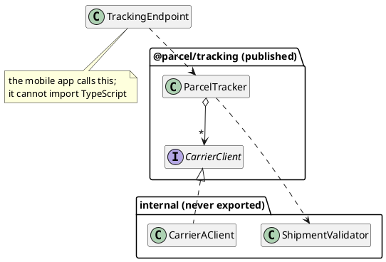

# Designing APIs to Provide Data and Services

The previous chapter left us wanting four things from the carrier API: a small surface, documentation that explains the API correctly, errors we could act on, and changes that did not arrive without warning. This chapter turns the system around. We are now the ones creating, publishing, and evolving the API, and those properties become the things our clients want from us.

The change is not a technical one. Every design decision in [Part 2](../part2/index) could be revised the next morning, because we owned every caller: if a method name was wrong we renamed it, and the compiler listed the places to fix. A published API cannot be revised that way. The clients are people we cannot see, cannot contact, and cannot coordinate with, and they will depend on whatever we ship, including the parts we exposed unintentionally. Two consequences of this situation follow, and this chapter elaborates on both of them.

The first is that _a published API is close to permanent_. Anything a client can reach, a client will eventually depend on, and from that moment removing it breaks working code belonging to somebody who did nothing wrong. The cost of a design mistake is no longer an afternoon of refactoring; it is the correctness of other people's systems.

The second is that _the users of an API are engineers_, which makes it a user interface with the usual obligations. It should be _easy to use_, so that the common task is the obvious one, and _hard to misuse_, so that the wrong call is difficult to write and easy to notice. An API that is technically complete but is easy to use incorrectly is a badly designed API.

## Publishing the Tracker

The running example continues, with the perspective reversed.

> As a platform team, we want to publish parcel tracking in a form other teams can build on, so that every product team does not have to integrate with every carrier separately.

The adapter work from the previous chapter turns out to be more useful than the application we built it for. Two other teams want tracking, so we publish it twice:

- As a **library**, `@parcel/tracking`, which other teams inside the company add to their dependencies and `import`. Their code compiles against ours.
- As a **web service**, an endpoint the mobile app calls over HTTP, because a Swift application cannot import our TypeScript.

These support one core concept with two published surfaces.


<!-- caption="One core with two published faces: a library other teams import, and a service the app calls." -->

<details class="tooltip link-110">
<summary>You Have Designed Contracts Before</summary>

In CPSC 110 you wrote a function's signature and purpose statement before writing its body, and then called that function from elsewhere while its body was still an entry on a wish list. For as long as the body was missing, the signature and purpose were the whole of what anyone could rely on.

That is what an API is, made permanent and given an audience. The difference is not the form of the contract but who reads it and what happens when it changes. In 110 the only client was you, an hour later; here the clients are strangers, for years. What was a note to yourself becomes a promise you cannot take back.

</details>

## What Publishing Costs

Before designing anything, it is worth being precise about what "we cannot change it" means, because the implications of this reach further than might first appear. It is not only the operations we documented. Clients depend on whatever they can observe: the order of results, the exact wording of an error message, the fact that a call happens to be fast, the field we left in a response because removing it seemed unnecessary. None of those were meant as promises but all of them implicitly end up being promises once somebody writes code that would break without them.

<details class="tooltip deep-dive">
<summary>Hyrum's Law</summary>

There is a well-known formulation of this, usually called **Hyrum's law** after the engineer captured it: with a sufficient number of clients, every observable behaviour of a system will be depended on by somebody, regardless of what the contract promises.

It is an empirical observation rather than a rule, and it has a practical meaning for a designer. Publishing an API creates two contracts: the one you _wrote_, and the larger one consisting of everything a client can _detect_. You are responsible for the first and constrained by the second. The gap between them is where surprising breakages come from, and the way to keep the gap narrow is to make less observable in the first place: fewer operations, fewer exposed fields, and no accidental guarantees about ordering or timing that the documentation does not claim.

</details>

This is the strongest argument the textbook has offered for a discipline it has been recommending since [Part 2](../part2/index). Encapsulation, small interfaces, and depending on contracts rather than classes were all justified earlier by the cost of change within a codebase you own. Here the same advice is stronger: everything exposed is permanent, so the only reliable way to keep a design changeable is to expose as little as possible.

## Choosing the Surface

The first design decision is what a client can see at all, and a useful bias is to publish less than feels comfortable. Adding an operation later is easy and has no impact, removing one is a breaking change for existing clients.

For TypeScript libraries, the surface can be declared in one file. Whatever is exported is the contract; everything else is unreachable no matter how many files it spans:

```typescript
// index.ts: the entire public contract of @parcel/tracking
export { ParcelTracker } from "./ParcelTracker";
export type { Shipment, ShipmentStatus } from "./Shipment";
export type { CarrierClient } from "./CarrierClient";
export type { TrackingError } from "./TrackingError";
```

This details four exports, but it is worth noting what is missing. `CarrierAClient` and the validator are how the library does its job, not what it promises, so they are unexported and stay changeable. A client that cannot name `CarrierAClient` cannot come to depend on it, which means we can rewrite it, rename it, or delete it without anyone noticing. But there are two common traps here worth discussing:

_Do not export internal types for convenience._ It is tempting to export a helper because a test needs it or because exporting is easier than arranging the code properly. Every such export is permanent, and a type exported for our convenience becomes a type we must maintain for client's benefit.

_Do not let a dependency's types into the signature._ The previous chapter used Zod to validate carrier responses. If our published signature mentions a Zod type, then Zod's next major version becomes _our_ breaking change, and our clients are forced to upgrade a library they never chose. The fix is to define our own types at the boundary and keep the dependency inside:

```typescript
// exported: a type we own and control
export type Shipment = {
    trackingNumber: string;
    status: ShipmentStatus;
    lastSeenAt: number;
};
```

The schema stays internal, the derived type is redeclared as ours, and the dependency stops at our edge. This is the isolation argument from the previous chapter applied in the other direction: there we kept a provider's decisions out of our codebase, and here we keep them out of our clients'.

The speculative-generality warning from the Open/Closed chapter applies here. An option nobody asked for, added because it might be useful, is still a promise that has to be honoured for as long as the API is used.

## Designing for Use

A published API is used by engineers under time pressure. That makes API usability a core design property. Our goal is always to create a surface that is easy to use correctly and awkward to use incorrectly.

_Names are the documentation everyone reads._ A name is what a client sees in an autocomplete list and in their own code afterwards, and it cannot be changed later without breaking them. `track` and `getShipmentTrackingInformation` describe the same operation, and one of them will be read a thousand times.

_Make the wrong call hard to write._ Consider an operation that takes a carrier and a tracking number:

```typescript
track(carrierId: string, trackingNumber: string): Promise<Shipment>
```

Both parameters are strings, so the two can be swapped without the compiler noticing, and the call `track("9K4T", "carrier-a")` compiles and fails at run time. The type system that has been catching mistakes since [Part 1](../part1/index) is contributing nothing here, because we gave it nothing to work with. An options object closes the hole by making each argument name itself at the callsite:

```typescript
track(request: { carrierId: string; trackingNumber: string }): Promise<Shipment>
```

```typescript
tracker.track({ carrierId: "carrier-a", trackingNumber: "9K4T" });
```

The value-object approach from the implementation freedom chapter further strengthens the API, by giving the two arguments different types so that swapping them stops compiling. Either way the principle is the one worth applying: when a mistake is possible, prefer a design in which the compiler catches it over documentation that warns against it.

_Be consistent across the surface._ Argument order, naming, and error handling should be the same everywhere, because a client learns an API from its first few calls and then generalises. A surface where `findShipment` returns `null` and `findCarrier` throws an exception makes it so every subsequent operation has to be looked up individually because the design is not predictable.

_Decide what absence means, once._ Whether "no such shipment" is `null`, an empty array, or an error is a design choice, and the choice matters less than making it uniformly. State it in the documentation and make it hold across every operation.

## Designing the Failures

Failure is part of the contract, not an afterthought. Clients have to handle errors when things go wrong, and they can only handle what we have told them about. The error handling chapter offered two mechanisms, and both are reasonable options. What matters for a published API is that the choice is made deliberately and applied consistently, and that whichever is chosen carries enough structure for clients to respond to appropriately.

A message alone is not enough structure. If the only thing distinguishing "we do not recognise that tracking number" from "the carrier is not responding" is English prose, a client who wants to retry the second and not the first has no option but to match on the text, and our next wording change or a language localization silently breaks them. A tagged union, from [Part 1](../part1/index)'s modelling chapter, provides a more stable alternative:

```typescript
export type TrackingError =
    | { kind: "malformed-tracking-number"; reason: string }
    | { kind: "unknown-tracking-number" }
    | { kind: "carrier-unavailable"; carrier: string };
```

A client can now branch on `kind`, which we promise, rather than on `message`, which we do not. Each case carries what a client needs to respond: the carrier that failed, so it can be reported or retried, and the reason a number was rejected, so it can be shown to a user. The wording of any human-readable message stays free to change, because nothing depends on it.

<details class="tooltip deep-dive">
<summary>Adding a Failure Is a Breaking Change</summary>

There is an asymmetry here that is easy to miss. Adding an _operation_ to an API is safe, but adding a new _failure case_ to an existing operation usually is not. A client that handles the three cases above has written code that is complete today. Publish a fourth `kind` and that code is silently incomplete: it compiles, because the union widened rather than narrowed, and it falls through its branches at run time on a case it has never seen. The client did nothing wrong and gets no warning.

This does not mean failure cases can never be added. It means adding one deserves the same treatment as any other breaking change: a version bump, an announcement, and documentation that told clients in advance whether the set was closed. An API that says "these are the only errors this operation produces" has made a much stronger promise than one that says "these errors include", and the two should not be confused.

</details>

## Documenting the Contract

The documentation is not just a description of the API, and certainly not a description of its implementation. For a client, it _is_ the API: behaviour that is documented is what clients can rely on, and behaviour that is not is behaviour that may change on them unexpectedly.

That framing confirms what has to be documented. Each operation needs its purpose, its parameters, what it returns, what failures it can produce, and any effect it has beyond returning a value:

```typescript
/**
 * Looks up the current state of one shipment across every configured carrier.
 *
 * Carriers are consulted in the order they were supplied, and the first
 * recognising the tracking number wins. The result reflects the carrier's
 * information at the moment of the call and may be out of date immediately.
 *
 * @param {TrackingRequest} request the carrier and tracking number to look up
 * @returns {Promise<Result<Shipment, TrackingError>>} ok: true with the
 * shipment, or ok: false with one of the documented TrackingError cases
 */
```

Two things in that method documentation are worth mentioning, because they are easy to overlook:

The first is that it documents what a client may _not_ rely on. Saying the result may be out of date immediately is a refusal to promise freshness, which keeps us free to add caching later without breaking anybody. Stating a non-promise is how the gap between the written contract and the observable one gets narrowed deliberately rather than by luck.

The second is that it documents the order carriers are consulted, which is a promise we have chosen to make. That decision has a cost: having documented it, we can no longer parallelise those lookups without a breaking change. Both kinds of statement are design decisions, and the documentation is where they get made.

Beyond the operations, a client needs guidance for getting started. Most people evaluating a library read one example and decide whether to keep going, so a README that answers what this is for, how to install it, and what a typical call looks like is doing more work than any individual signature. For a web service the same role is played by a written specification of the routes. <!-- ; OpenAPI is a commonly-used format, and its details belong in a later course. -->

## Compatible and Breaking Change

A central skill of this chapter is judging, before shipping, whether a change will break an existing client. The broad shape is that widening what you accept and adding to what you return are safe, while narrowing, removing, or renaming are not:

| Change | Effect on clients |
|---|---|
| Add a new operation | Safe |
| Add an optional parameter | Safe |
| Add a field to a returned object | Usually safe |
| Accept an input you previously rejected | Safe |
| Rename an operation, parameter, or field | Breaking |
| Remove anything | Breaking |
| Add a required parameter | Breaking |
| Reject an input you previously accepted | Breaking |
| Change a field's type | Breaking |

The entries in that table are the easy cases, because the compiler or the client's tests will find them. The dangerous changes are the ones that keep every signature identical and alter what the code does:

- Tightening validation, so that input which used to be accepted now fails.
- Changing the meaning of a field while keeping its name and type, such as a `lastSeenAt` that switches from the carrier's local time to UTC.
- Changing the order of results a client had come to rely on.
- Rewording an error message that somebody is matching on.
- Making a slow operation fast enough that a race condition in a client's code starts firing.

None of these will cause a compiler to flag an error. They break behaviour in production, and they are the reason the previous section put such emphasis on documenting what may _not_ be relied upon.

The **robustness principle**, often stated as "be liberal in what you accept, conservative in what you send", captures part of this: accepting more input is a safe direction to evolve, and sending less than you promised is not. It is worth knowing the standard criticism as well, which is that liberal acceptance lets clients develop dependencies on undocumented leniency, so that tightening validation later becomes a breaking change of exactly the quiet kind listed above.

## Versioning and Deprecation

Breaking changes cannot be avoided forever. What a version number does is let a client find out about one before it reaches production.

For libraries the convention is **semantic versioning**, in which a version like `2.4.1` makes three separate promises. The major number changes when something breaks, so a client knows to read the release notes and expect work. The minor number changes when functionality is added compatibly, so upgrading should be uneventful. The patch number changes for compatible fixes. The value of the convention is entirely in publishers following it: a breaking change shipped in a patch release is worse than a breaking change, because it defeats the mechanism clients use to protect themselves.

For web services the version usually appears in the path, as in `/v1/shipments/9K4T`, which allows an incompatible `/v2` to be introduced while `/v1` keeps serving.

Removing something is a process rather than an event, and the steps are the same for both kinds of API. Announce the deprecation and name the replacement. Mark it where a client will see it, which for a library means the tooling:

```typescript
/**
 * Looks up a shipment by tracking number alone.
 *
 * @deprecated Use `track` with a TrackingRequest instead. This operation
 * will be removed in version 3.0.
 */
```

Then leave it in place long enough for clients to move, and only then remove it. Skipping the waiting period turns a manageable migration into an outage. While this might sound like we can just make breaking changes anyways and add a `@deprecated` annotation, note that these tags are mainly used to steer clients to new API and often persist for years, sometimes for decades, before they are finally removed.

The sharpest difference between the two kinds of API is who decides when to upgrade. A library client upgrades when they choose to, so old versions stay in use for years and a deprecation can be generous. A web service client is upgraded when _we_ deploy, whether they are ready or not, which is why services keep old versions running in parallel: it is the only way to give a client the choice that a library client has by default.

## Designing a Web Service Surface

Most of this chapter applies unchanged to a service. A few decisions have no library equivalent.

_Resources and methods._ The previous chapter described the convention from the client's side: resources named by URLs, operations expressed as HTTP methods. Designing it means choosing the nouns. A shipment is a resource, `/shipments/9K4T` names one, and the method says what is being done to it. The idempotency question from the previous chapter is now ours to answer: clients will retry, so an operation that is safe to repeat should be `GET` or `PUT`, and one that is not should be `POST` and should say so.

_Status codes are part of the contract._ A client branches on them before reading the body, so the choice between `404` for an unknown tracking number and `400` for a malformed one is a design decision with consequences for their code. Using `200` for everything and hiding failure in the body defeats a mechanism that every HTTP client already understands.

_Error payloads need a stable shape._ The tagged union above has a direct analogue on the wire:

```json
{
  "error": {
    "code": "carrier_unavailable",
    "message": "Carrier A did not respond within 5 seconds.",
    "carrier": "carrier-a"
  }
}
```

The `code` is for the program and is part of the contract; the `message` is for a human reading a log and is not. Documenting that distinction is what allows the wording to improve later without breaking a client who is branching on the code.

_Anything unbounded needs pagination._ A collection that can grow will eventually be too large to return, and adding pagination afterwards is a breaking change. Deciding at design time is much cheaper than deciding once a client is depending on receiving everything.

_Limits should be visible._ If calls are rate limited, a client can only respect the limit if the service says what it is and when it resets. A limit communicated only as a rejected request teaches a client nothing except to try again.

Authentication is a real part of most published services and a large enough topic to leave to a later course. It is worth noting as a design surface rather than an implementation detail: who may call what is a decision about the contract, and it is made at the same time as everything else in this chapter.

## An API Is a Promise

Publishing changes what a design decision means. Inside a system we own, a decision is provisional and the cost of revising it is our own time. Published, it becomes a promise to people we will never meet, and the cost of revising it is theirs.Two properties follow: 

Because the surface is close to permanent, it should be small: expose the behaviour clients need and keep everything else unreachable, so that the parts we may want to change are parts nobody can see. Because the clients are engineers under time pressure, the surface should be easy to use correctly and difficult to use incorrectly: names that describe, parameters that cannot be swapped by accident, failures that can be branched on, and consistency that lets a client generalise from the first call to the rest.

The rest is honesty about timelines. Documentation records not only what is promised but what is not, so that the freedom to change is stated in advance. Versions announce breakage before it arrives, and deprecation gives clients room to move. None of it prevents change, and none of it is meant to. It makes change something a client can plan for rather than something that happens to them.

This chapter and the previous one have looked at both sides of a boundary between systems. The chapters that follow turn inward, to the boundary between a system and the people maintaining it, starting with the observation that code which works can still be difficult to work on.

<details class="tooltip exercise">
  <summary>Exercise: Publishing a Booking API</summary>

> As a platform team, we want to publish room booking so that other teams can build scheduling tools on it, without each of them integrating with the building system directly.

A first draft of the library's `index.ts` exports everything the team has written:

```typescript
export { BookingService } from "./BookingService";
export { Room, Booking, TimeSlot } from "./types";
export { SqlConnection } from "./db/SqlConnection";
export { validateWithZod } from "./validation";
export { RoomRow, BookingRow } from "./db/rows";
```

Its central operation is:

```typescript
/** Books a room. */
book(roomId: string, userId: string, start: number, minutes: number,
     allowOverlap: boolean, notify: boolean): Booking
```

Work through the following:

1. _Trim the surface._ Decide which of the five exports belong in a published contract and which do not, giving a reason for each. For any you would remove, say what a client could come to depend on if it stayed.
2. _Find the misuse._ `book` can be called incorrectly in at least three ways that still compile. Identify them, then redesign the signature so that each becomes a compile error or is otherwise impossible to write.
3. _Design the failures._ A booking can fail because the room does not exist, because the slot is already taken, or because the request is outside opening hours. Define the error type a client would branch on, and decide whether the operation returns or throws it. Justify the choice with the criteria from the error handling chapter.
4. _Document one operation._ Write the documentation comment for your redesigned `book`, including at least one statement of something a client may _not_ rely on, and explain what that non-promise keeps you free to change.
5. _Judge six changes._ For each, say whether it breaks clients, and if it does, whether a compiler would catch it: adding an optional `title` parameter; renaming `minutes` to `durationMinutes`; rejecting bookings longer than eight hours, which were previously allowed; adding a `createdAt` field to `Booking`; changing `start` from local time to UTC; adding a fourth failure case.
6. _Publish it twice._ The same booking system is also exposed as a web service. Give the URL and method for booking a room, the status code for each failure from question 3, and the JSON shape of an error response. Say which decisions differ from the library version and why.

</details>
