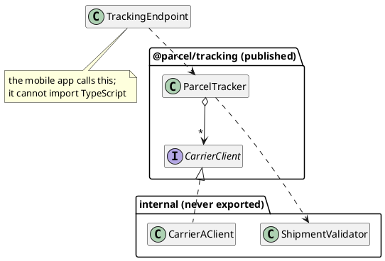

# Designing APIs to Provide Data and Services

As clients of the carrier APIs in the previous chapter, we wanted four things: a small surface, accurate documentation, errors we could act on, and no changes without warning. In this chapter, we are the ones creating, publishing, and evolving the API, and our clients will want the same four things from us.

The difference is not a technical one. Every design decision in [Part 2](../part2/index) could be revised the next day, because we owned every caller. If a method name was wrong, we renamed it, and the compiler listed the places to fix. A published API cannot be revised that way. Its clients are people we cannot see, contact, or coordinate with, and they will depend on whatever we ship, including the parts we exposed by accident. This has two consequences, and this chapter explores both of them.

The first is that _a published API is close to permanent_. Clients will eventually depend on anything they can reach. Once they do, removing it breaks working code that belongs to someone who did nothing wrong. A design mistake then costs more than an afternoon of refactoring, because it breaks other people's systems.

The second is that _the users of an API are engineers_, so an API is a user interface and should meet the same standards. It should be _easy to use_, so that the common task is the obvious one. It should also be _hard to misuse_, so that an incorrect call is difficult to write and easy to notice. An API that is technically complete but easy to use incorrectly is badly designed.

## Publishing the Tracker

The running example continues, but from the provider's side.

> As a platform team, we want to publish parcel tracking in a form other teams can build on, so that every product team does not have to integrate with every carrier separately.

The adapters from the previous chapter turn out to be useful beyond the application we built them for. Two other teams want parcel tracking, so we publish it in two forms:

- As a **library**, `@parcel/tracking`, which other teams in the company add to their dependencies and `import`. Their code compiles against ours.
- As a **web service**, an endpoint the mobile app calls over HTTP, because a Swift application cannot import our TypeScript.

Both forms publish the same core functionality through two different surfaces.


<!-- caption="One core with two published faces: a library other teams import, and a service the app calls." -->

<details class="tooltip link-110">
<summary>You Have Designed Contracts Before</summary>

In CPSC 110, you wrote a function's signature and purpose statement before writing its body. You could then call that function from elsewhere while its body was still an entry on a wish list. Until the body was written, the signature and purpose were all that anyone could rely on.

An API is the same kind of contract, except that it is permanent and has other readers. The form of the contract is the same. What differs is who reads it and what happens when it changes. In CPSC 110, the only client was you, an hour later. For a published API, the clients are strangers who will use it for years.

</details>

Before designing anything, it is important to understand what "we cannot change it" means, because it covers more than it first seems to. It is not limited to the operations we documented. Clients depend on whatever they can observe: the order of results, the exact wording of an error message, the fact that a call happens to be fast, or a field we left in a response because removing it seemed unnecessary. None of these were meant as promises, but each of them becomes one as soon as someone writes code that depends on it.

<details class="tooltip deep-dive">
<summary>Hyrum's Law</summary>

A well-known statement of this idea is **Hyrum's law**, named after Hyrum Wright, the engineer who described it: with enough clients, every observable behaviour of a system will be depended on by somebody, whatever the contract promises.

Hyrum's law is an observation rather than a rule, but it has a practical meaning for a designer. Publishing an API creates two contracts. One is the contract you _wrote_. The other, larger one consists of everything a client can _detect_. You are responsible for the first, and constrained by the second. Surprising breakages come from the gap between them. To keep the gap small, make less of the system observable in the first place: fewer operations, fewer exposed fields, and no accidental guarantees about ordering or timing that the documentation does not make.

</details>

Encapsulation, small interfaces, and depending on contracts rather than classes were all justified in [Part 2](../part2/index) by the cost of change within a codebase you own. For a published API, everything exposed is permanent, so the only reliable way to keep a design changeable is to expose as little as possible.

## Choosing the Surface

The first design decision is what a client can see at all. A useful guideline is to publish less than feels comfortable. Adding an operation later is easy and does not affect existing clients, but removing one is a breaking change.

For a TypeScript library, the surface can be declared in one file. Whatever that file exports is the contract. Everything else is unreachable, however many files it is spread across:

```typescript
// index.ts: the entire public contract of @parcel/tracking
export { ParcelTracker } from "./ParcelTracker";
export { createTracker } from "./createTracker";
export type { Shipment, ShipmentStatus } from "./Shipment";
export type { TrackingRequest } from "./TrackingRequest";
export type { TrackingError } from "./TrackingError";
export type { Result } from "./Result";
export type { CarrierClient } from "./CarrierClient";
```

This file exports eight names. `CarrierAClient` and the validator are part of how the library does its job, not part of what it promises, so they are not exported and remain free to change. A client that cannot name `CarrierAClient` cannot come to depend on it, so we can rewrite, rename, or delete it without affecting anyone. Clients still need working carriers, so `createTracker` returns a `ParcelTracker` that is already configured with every carrier the library supports. `CarrierClient` is exported so that clients can supply their own carriers when they need to, such as the test doubles from the previous chapter. There are two common mistakes to avoid.

_Do not export internal types for convenience._ It is tempting to export a helper because a test needs it, or because exporting it is easier than organising the code properly. Every export is permanent, and a type exported for our convenience becomes a type we must maintain for our clients.

_Do not let a dependency's types into the signature._ The previous chapter used Zod to validate carrier responses. If our published signature mentions a Zod type, then Zod's next major version becomes _our_ breaking change, and our clients are forced to upgrade a library they never chose. The fix is to define our own types at the boundary and keep the dependency internal:

```typescript
// exported: a type we own and control
export type Shipment = {
    trackingNumber: string;
    status: ShipmentStatus;
    lastSeenAt: number;
};
```

The schema stays internal, the type is declared by us rather than derived from the schema, and the dependency stops at our boundary. The previous chapter kept a provider's decisions out of our code. Here, the same isolation keeps them out of our clients' code.

The speculative generality warning from the Open/Closed chapter also applies. An option that nobody asked for, added because it might be useful, is still a promise that has to be kept for as long as the API is used.

A published API is used by engineers under time pressure, so usability is a core design property. The goal is a surface that is easy to use correctly and difficult to use incorrectly.

_Names are the documentation everyone reads._ A client sees a name in an autocomplete list, and then again every time they read their own code. A name also cannot be changed later without breaking clients. `locate` and `getShipmentTrackingInformation` describe the same operation, but the shorter name is easier to read every time it appears.

_Make the wrong call hard to write._ Consider an operation that takes a carrier and a tracking number:

```typescript
locate(carrierId: string, trackingNumber: string): Promise<Result<Shipment, TrackingError>>
```

Both parameters are strings, so they can be swapped without the compiler noticing. The call `locate("9K4T", "carrier-a")` compiles and then fails at run time. The type checker cannot help here, because both parameters have the same type. An options object fixes this by naming each argument at the call site:

```typescript
// exported: the request a client passes to locate
export type TrackingRequest = {
    trackingNumber: string;
    carrierId?: string;   // omit to ask every carrier in turn
};

locate(request: TrackingRequest): Promise<Result<Shipment, TrackingError>>
```

```typescript
tracker.locate({ carrierId: "carrier-a", trackingNumber: "9K4T" });
```

The request also makes `carrierId` optional. A client that does not know the carrier can leave it out, and the tracker then asks each carrier in turn, as `locate` did in the previous chapter.

Value objects from the implementation freedom chapter make the API even safer. If the two arguments have different types, swapping them no longer compiles. Because TypeScript compares types by shape, the two classes must differ in shape for this to work, for example by each having its own `private` field. In either design, the principle is the same: when a mistake is possible, prefer a design in which the compiler catches it over documentation that warns against it.

_Be consistent across the surface._ Argument order, naming, and error handling should be the same everywhere, because clients learn an API from their first few calls and then generalise. If `findShipment` returns `null` but `findCarrier` throws an exception, the design is not predictable, and clients have to look up every operation individually.

_Decide what absence means, once._ Whether "no such shipment" is `null`, an empty array, or an error is a design choice. Any of these can work if it is chosen once, stated in the documentation, and applied to every operation.

## Designing the Failures

Failure is part of the contract. Clients have to handle errors when things go wrong, and they can only handle the errors we have told them about. The error handling chapter described two mechanisms, and both are reasonable options. For a published API, the choice must be made deliberately and applied consistently, and the errors must carry enough structure for clients to respond to them appropriately.

A message alone is not enough structure. Suppose the only difference between "we do not recognise that tracking number" and "the carrier is not responding" is the English text. A client that wants to retry the second error but not the first has to match on the text, and the next time we reword the message or translate it into another language, that client breaks without warning. A tagged union, from [Chapter 2](../part1/02_model-types), is a more stable alternative:

```typescript
export type TrackingError =
    | { kind: "malformed-tracking-number"; reason: string }
    | { kind: "unknown-tracking-number" }
    | { kind: "carrier-unavailable"; carrier: string };
```

A client can now branch on `kind`, which we promise, rather than on the wording of a message, which we do not. Each case carries the information a client needs to respond. The carrier that failed can be reported or retried, and the reason a number was rejected can be shown to a user. The wording of any human-readable message remains free to change, because no client depends on it.

<details class="tooltip deep-dive">
<summary>Adding a Failure Is a Breaking Change</summary>

There is an asymmetry here that is easy to miss. Adding an _operation_ to an API is safe, but adding a new _failure case_ to an existing operation usually is not. A client that handles the three cases above has code that is complete today. If we publish a fourth `kind`, that code becomes incomplete. It still compiles, because nothing requires it to handle every case, and at run time none of its branches match the new case. The client did nothing wrong and received no warning.

Failure cases can still be added, but adding one should be treated like any other breaking change. It needs a version bump, an announcement, and documentation that told clients in advance whether the set of failures was complete. An API that says "these are the only errors this operation produces" makes a much stronger promise than one that says "these errors include", and the two should not be confused.

</details>

## Documenting the Contract

Documentation describes the API, not its implementation. For a client, the documentation _is_ the API. Clients can rely on documented behaviour, and any behaviour that is not documented may change without warning.

This determines what has to be documented. Each operation needs its purpose, its parameters, what it returns, what failures it can produce, and any effects it has beyond returning a value:

```typescript
/**
 * Looks up the current state of one shipment.
 *
 * When the request names a carrier, only that carrier is asked. Otherwise,
 * carriers are consulted in the order they were supplied, and the first
 * recognising the tracking number wins. The result reflects the carrier's
 * information at the moment of the call and may be out of date immediately.
 *
 * @param {TrackingRequest} request the tracking number to look up, and
 * optionally the carrier to ask
 * @returns {Promise<Result<Shipment, TrackingError>>} ok: true with the
 * shipment, or ok: false with one of the documented TrackingError cases
 */
locate(request: TrackingRequest): Promise<Result<Shipment, TrackingError>>
```

This documentation contains two kinds of statement that are easy to overlook.

The first kind states what a client may _not_ rely on. Saying that the result may be out of date immediately is a refusal to promise freshness, which leaves us free to add caching later without breaking anyone. Stating what is not promised is a deliberate way to narrow the gap between the written contract and the observable one.

The second kind is a promise we have chosen to make, such as the order in which carriers are consulted. That promise has a cost. Now that it is documented, we cannot query the carriers in parallel without breaking it. Both kinds of statement are design decisions, and the documentation is where those decisions are made.

Clients also need help getting started. Most people evaluating a library read one example and then decide whether to continue, so a README that explains what the library is for, how to install it, and what a typical call looks like is more important than any individual signature. For a web service, a written specification of the routes plays the same role.

## Breaking Changes

An important skill is judging, before shipping, whether a change will break an existing client. In general, accepting more input and adding to what you return are safe, while narrowing, removing, or renaming are not:

| Change | Effect on clients |
|---|---|
| Add a new operation | Safe |
| Add an optional parameter | Safe |
| Add a field to a returned object | Usually safe |
| Accept an input you previously rejected | Safe |
| Rename an operation, parameter, or field | Breaking |
| Remove anything | Breaking |
| Add a required parameter | Breaking |
| Reject an input you previously accepted | Breaking |
| Change a field's type | Breaking |

Most of the breaking changes in that table alter a signature, so the compiler or the client's tests will find them. The more dangerous changes keep every signature identical and change only what the code does:

- Tightening validation, so that input which used to be accepted now fails.
- Changing the meaning of a field while keeping its name and type, such as a `lastSeenAt` that switches from the carrier's local time to UTC.
- Changing the order of results a client had come to rely on.
- Rewording an error message that somebody is matching on.
- Making a slow operation fast enough that a race condition in a client's code starts firing.

None of these changes cause a compile error, and each can break a client in production, which is why the previous section emphasised documenting what may _not_ be relied on.

The second change in that list seems harmless, so consider it in detail. A client has been reading `lastSeenAt` to show how long a parcel has been sitting in one place. `lastSeenAt` has always been in the carrier's local time, so the client's code adjusts for the offset:

```typescript
// in a client's code, written against version 2.3
const shipment = result.value;
// lastSeenAt is in Carrier A's local time, eight hours behind UTC
const localOffsetMs = 8 * 3600000;
const hoursSinceSeen = (Date.now() - (shipment.lastSeenAt + localOffsetMs)) / 3600000;
if (hoursSinceSeen > 48) {
    flagAsStale(shipment);
}
```

We then fix what we consider a defect in our own code. `lastSeenAt` had been recording the carrier's local time, and it should have been UTC. The field keeps its name and its type, and every signature in the library is identical. The client's code still compiles, still runs, and still produces a number. But the client is still adding the eight-hour offset, so the number is now eight hours too small. A parcel that has been sitting for 48 hours is not flagged as stale until it has been sitting for 56.

None of the usual ways of catching mistakes prevented this failure. The compiler sees no change. Our tests pass, because we updated them in the same commit that changed the behaviour. That is the correct thing to do for a bug fix, but it also hides the problem. The client's tests pass too, because their test data was built using the old convention. Only a written statement of what `lastSeenAt` meant would have marked this fix as a breaking change. A field's type says what values it can hold, and only its documentation says what those values mean.

The **robustness principle**, often stated as "be liberal in what you accept, conservative in what you send", captures part of this. Accepting more input is a safe way to evolve an API, and sending less than you promised is not. The usual criticism of the principle is that accepting too much lets clients come to depend on undocumented leniency. Tightening validation later then becomes a breaking change, of the kind listed above that no compiler catches.

Breaking changes cannot be avoided forever. A version number lets a client find out about a breaking change before it reaches production.

For libraries, the convention is **semantic versioning**, in which a version such as `2.4.1` makes three separate promises. The major number changes when something breaks, so a client knows to read the release notes and expect work. The minor number changes when functionality is added in a compatible way, so upgrading should cause no problems. The patch number changes for compatible fixes. The convention is only useful if publishers follow it. A breaking change released as a patch is worse than one released as a major version, because it defeats the mechanism clients use to protect themselves.

For web services, the version usually appears in the path, as in `/v1/shipments/9K4T`. This allows an incompatible `/v2` to be introduced while `/v1` keeps running.

Removing something from an API takes several steps, and the steps are the same for both kinds of API. First, announce the deprecation and name the replacement. Mark the deprecated operation where a client will see it, which for a library means in their tools:

```typescript
/**
 * Looks up one shipment, given the carrier and the tracking number as
 * separate arguments.
 *
 * @deprecated Use `locate` with a TrackingRequest instead. This form
 * will be removed in version 3.0.
 */
locate(carrierId: string, trackingNumber: string): Promise<Result<Shipment, TrackingError>>
```

As a sequence of releases, replacing the two-argument `locate` looks like this:

1. _2.4.0._ Ship `locate(request)` alongside the old two-argument form, and mark the old one `@deprecated`, with its replacement and the version that will remove it. Nothing has broken, so a minor version bump is correct. Clients see the old operation crossed out in their editor the next time they call it.
2. _2.4.0 through 2.9.x._ Both operations ship. Each set of release notes repeats the deprecation, because the client who most needs to read it is the one who skipped four versions.
3. _3.0.0._ Remove the old two-argument form. The major version number tells clients that work is required before upgrading, and by this point the warning has been in their editor for months.

There is often pressure to shorten the middle step. Leave the old operation in place long enough for clients to move, and only then remove it. Removing it too early turns a manageable migration into an outage. Deprecation also does not make breaking changes cheap. A `@deprecated` tag mainly steers clients towards the new API, and deprecated operations often remain for years, sometimes decades, before they are finally removed.

The biggest difference between the two kinds of API is who decides when to upgrade. A library client upgrades when they choose to, so old versions stay in use for years, and a deprecation period can be long. A web service client is upgraded whenever _we_ deploy, whether they are ready or not. This is why services keep old versions running in parallel. It is the only way to give web service clients the choice that library clients have by default.

## Web Service Surfaces

Most of this chapter applies to web services without change, but a few decisions have no library equivalent.

_Resources and methods._ The previous chapter described this convention from the client's side: resources are named by URLs, and operations are expressed as HTTP methods. Designing a service means choosing the resources. A shipment is a resource, `/shipments/9K4T` names one, and the method says what is being done to it. The idempotency question from the previous chapter is now ours to answer. Clients will retry, so an operation that is safe to repeat should use an idempotent method such as `GET` or `PUT`. An operation that is not safe to repeat should use `POST`, and its documentation should say so.

_Status codes are part of the contract._ Clients check the status code before reading the body, so choosing `404` for an unknown tracking number and `400` for a malformed one is a design decision that affects their code. Returning `200` for everything and reporting failures only in the body ignores a mechanism that every HTTP client already understands.

_Error payloads need a stable shape._ The tagged union above has a direct equivalent in JSON:

```json
{
  "error": {
    "code": "carrier_unavailable",
    "message": "Carrier A did not respond within 5 seconds.",
    "carrier": "carrier-a"
  }
}
```

The `code` is for the client's program, and it is part of the contract. The `message` is for a person reading a log, and it is not. Documenting this distinction lets the wording improve later without breaking clients that branch on the code.

_Anything unbounded needs pagination._ A collection that can grow will eventually be too large to return in one response, and adding pagination later is a breaking change. Deciding at design time is much cheaper than changing the design after clients depend on receiving everything at once.

_Limits should be visible._ If calls are rate limited, a client can only stay within the limit if the service says what the limit is and when it resets. If the only sign of a limit is a rejected request, the client can do nothing except try again.

Authentication is part of most published services, but it is a large topic that is left to a later course. Treat it as part of the API's design rather than an implementation detail. Who may call which operations is a decision about the contract, and it is made at the same time as every other decision in this chapter.

#### An API Is a Promise

Publishing changes what a design decision means. Inside a system we own, a decision is provisional, and revising it costs only our own time. Once the API is published, the decision becomes a promise to people we will never meet, and revising it costs them time. Two properties follow.

Because the surface is close to permanent, it should be small. Expose the behaviour clients need and keep everything else unreachable, so that nobody can see the parts we may want to change. Because the clients are engineers under time pressure, the surface should be easy to use correctly and difficult to use incorrectly. That means descriptive names, parameters that cannot be swapped by accident, failures that clients can branch on, and consistency that lets a client generalise from their first call to the rest.

The remaining practices tell clients about change in advance. Documentation records what is not promised as well as what is, so that the freedom to change is stated up front. Version numbers announce breaking changes before they arrive, and deprecation gives clients time to migrate. Together, they let a client plan for change.

<details class="tooltip exercise">
  <summary>Exercise: Publishing a Booking API</summary>

> As a platform team, we want to publish room booking so that other teams can build scheduling tools on it, without each of them integrating with the building system directly.

A first draft of the library's `index.ts` exports everything the team has written:

```typescript
export { BookingService } from "./BookingService";
export { Room, Booking, TimeSlot } from "./types";
export { SqlConnection } from "./db/SqlConnection";
export { validateWithZod } from "./validation";
export { RoomRow, BookingRow } from "./db/rows";
```

Its central operation is:

```typescript
/** Books a room. */
book(roomId: string, userId: string, start: number, minutes: number,
     allowOverlap: boolean, notify: boolean): Booking
```

Work through the following:

1. _Trim the surface._ Decide which of these exports belong in a published contract and which do not, giving a reason for each. For any you would remove, say what a client could come to depend on if it stayed.
2. _Find the misuse._ `book` can be called incorrectly in at least three ways that still compile. Identify them, then redesign the signature so that each becomes a compile error or is otherwise impossible to write.
3. _Design the failures._ A booking can fail because the room does not exist, because the slot is already taken, or because the request is outside opening hours. Define the error type a client would branch on, and decide whether the operation returns or throws it. Justify your choice with the criteria from the error handling chapter.
4. _Document one operation._ Write the documentation comment for your redesigned `book`, including at least one statement of something a client may _not_ rely on, and explain what that non-promise keeps you free to change.
5. _Judge six changes._ For each change, say whether it breaks clients, and if it does, whether a compiler would catch it: adding an optional `title` parameter; renaming `minutes` to `durationMinutes`; rejecting bookings longer than eight hours, which were previously allowed; adding a `createdAt` field to `Booking`; changing `start` from local time to UTC; adding a fourth failure case.
6. _Publish it twice._ The same booking system is also exposed as a web service. Give the URL and method for booking a room, the status code for each failure from question 3, and the JSON shape of an error response. Say which decisions differ from the library version, and why.

</details>
