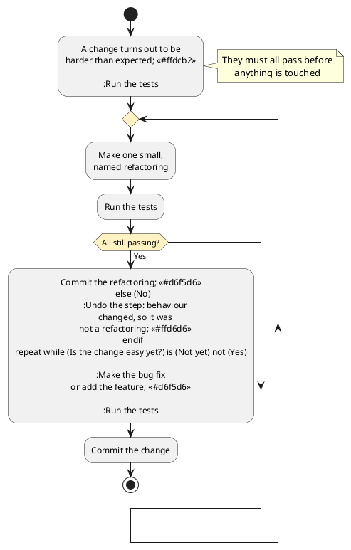

# Code Quality and Refactoring

Every chapter so far has judged code by whether it works. Types rule out malformed programs, tests demonstrate that behaviour matches its contract, and the previous two chapters examined whether/how a published contract serves the people depending on it. All of that is about a program's behaviour, which is what users and clients experience.

This chapter judges code by something users never see: whether it can be worked _on_. A program can pass every test in its suite, honour every contract it publishes, and still cost a team a week to make change that should take an hour. Nothing in the build reports that, and no test will ever fail because of it. The cost appears later, as the price of every subsequent change, paid by whoever is maintaining the system.

The chapter is organised around a single practical claim: _refactoring is most often performed in anticipation of bug-fixing or adding a new feature._ It is not tidying for its own sake, and it is not an activity scheduled for a quiet Friday. It is the step that decreases the total cost of an upcoming change, which is why it sits immediately before the chapters on debugging and on adding features, as it is often an intrinsic activity that is part of both.

## A Tracker That Grew

The running example continues, some months on.

> As the team maintaining the tracker, we want adding a carrier to be a day's work again, so that we can take on the integrations our customers are asking for. The last two took a week each.

The design from the earlier chapters was sound. Each carrier had an adapter, the adapters implemented `CarrierClient`, and the tracker depended on the interface and knew nothing about any particular carrier. Adding a carrier was meant to be a new class and nothing else.

Five carriers later, that is not what happens. Nobody set out to break the design, and no single change did. Each carrier brought a small awkwardness, each awkwardness was handled where it appeared, and the accumulation has pulled the carrier-specific knowledge back out of the adapters and into the middle of the system:

```typescript
// in ParcelTracker: called after every adapter returns
function normaliseStatus(carrierId: string, raw: string): ShipmentStatus {
    if (carrierId === "carrier-a") {
        if (raw === "DEL") {
            return "delivered";
        }
        if (raw === "RTS") {
            return "exception";
        }
        return "in-transit";
    }
    if (carrierId === "carrier-b") {
        if (raw === "Delivered") {
            return "delivered";
        }
        if (raw === "Delivery failed") {
            return "exception";
        }
        return "in-transit";
    }
    // three more carriers, in the same shape
    return "in-transit";
}
```

Every test passes. The tracker is correct, the carriers all work, and no client has complained. What has gone wrong is not behaviour. It is that a function in the middle of the system now knows the status vocabulary of every carrier, so a sixth carrier means editing it, and editing it means re-reading the five that already work.

This is the situation the chapter is about, and the finish line is concrete: refactor until the sixth carrier is a small addition rather than a week's work.

## Two Kinds of Quality

It helps to name the distinction the tracker illustrates.

**External quality** is whether the software does what it should: correct results, honoured contracts, acceptable speed. It is what users notice, and the whole apparatus of Parts 1 and 2 exists to establish it. It can be measured, and a test suite measures it continuously.

**Internal quality** is whether a person can read the code, reason about it, and change it safely. Users never see it. No test reports on it. It has no effect at all until somebody needs to make a change, at which point it determines what that change costs.

The tracker has high external quality and declining internal quality, and the two are independent enough that neither predicts the other. Code can be correct and unreadable, or beautifully organised and wrong.

What makes internal quality worth attending to in Part 3 specifically is who the reader is. In Parts 1 and 2 the reader was usually you, minutes after writing it, holding the whole design in mind. Here the reader is a stranger, or you in six months, which amounts to the same thing. The properties that matter are the ones that survive that gap:

- _Names that describe._ A reader learns a system mostly by reading its names, and a name that misleads costs more than one that merely fails to help.
- _Units small enough to hold in mind._ A function that fits on a screen can be understood as a unit; one that runs for three hundred lines has to be understood in pieces, and the pieces interact.
- _Shallow nesting._ Every level of nesting is another condition the reader has to carry while reading the inside.
- _Comments that explain why._ What the code does is available by reading it. Why it does that, and what would break if it stopped, is often available nowhere else.

<details class="tooltip link-110">
<summary>Why This Did Not Come Up in CPSC 110</summary>

Nothing in CPSC 110 asked you to improve code that already worked, and the reason is worth naming. The design recipe delivered code in a standard shape: the data definition determined the template, the template determined the function's structure, and following the recipe meant the result arrived already organised. There was nothing left to clean up, because the process did the organising.

The recipe also assumed a fixed problem. Real systems change after they are written, and each change arrives without a recipe telling you where it belongs. Code drifts out of shape not because anyone was careless but because the shape that fitted the original problem stops fitting the problem the system has grown into. Refactoring is the step that has no counterpart in 110: putting a design back into a shape that fits what the system now has to do.

</details>

## Reading the Symptoms

A **code smell** is a surface sign of a deeper design problem. The word is deliberately weak: a smell is not a defect, it is not always wrong, and it does not oblige you to change anything. Smells are hints of places in the code that deserve a second look in terms of their design.

The useful thing about the standard catalogue of smells is that you already know many of them. This textbook has spent two parts arguing about design, and the smells are largely the same problems approached from the other direction: not "here is a principle to follow" but "here is what its absence looks like in code you are reading."

| Smell | Where it came up already |
|---|---|
| Large class | The god class, in the decomposition chapter. |
| Duplicated code | Don't repeat yourself, in the extension chapter. |
| Long parameter list | The options object, in the consuming data chapter. |
| Feature envy: a method more interested in another object's data than its own | Tell, Don't Ask, in the coupling chapter. |
| Message chains: `a.b().c().d()` | The Law of Demeter, in the coupling chapter. |
| Shotgun surgery: one change, many files | Scattering, in the coupling chapter. |
| Divergent change: one file, many unrelated reasons to change | Tangling, in the coupling chapter. |
| Primitive obsession: strings and numbers where a type belongs | Value objects, in the implementation freedom chapter. |
| Conditional on a type tag | Replace conditional with polymorphism, in the Open/Closed chapter. |

Two rows in particular exemplify the others. The coupling chapter described separation of concerns as the goal of giving every concern exactly one home, and named the two ways a design fails it: _tangling_, where many concerns share one place, and _scattering_, where one concern is spread across many places.

Read the table again with those two in hand and most smells collapses into them. A large class is tangled. Duplicated code is scattered. Divergent change is what tangling feels like when you arrive to make an edit, and shotgun surgery is what scattering feels like. A conditional on a type tag is every variant's behaviour tangled into a single function. Primitive obsession is a rule with no home of its own, which leaves it scattered across every place that has to enforce it.

The distinction is worth making because the two are cured by opposite moves. Tangling is relieved by _splitting_: extract a function, extract a class, replace a conditional with polymorphism, so that each concern is given somewhere to live. Scattering is relieved by _consolidating_: move a method to the data it works on, introduce a parameter object, replace a primitive with a type, so that something spread thin is gathered into one place. Diagnosing which one you have is therefore not an academic exercise, because the treatments run in opposite directions: splitting something already scattered leaves more fragments to keep in step, and consolidating something already tangled produces a larger tangle.

The `normaliseStatus` function above is the last row of the table, and in these terms it is tangling: five carriers' status vocabularies sharing one function, when each belongs with the adapter that knows the carrier. A conditional branching on a tag is exactly the shape the Open/Closed chapter argued against, and it has reappeared in a system that was originally designed to avoid it. That is worth noticing on its own: a design does not stay correct because it was correct once.

Smells are heuristics, and treating them as rules produces its own damage. A long function that reads top to bottom as a sequence of clearly named steps may be easier to follow than the six small functions it could be split into. The smell raises a question; the answer is sometimes that the code is fine.

## Technical Debt

The other common way to talk about internal quality is as **technical debt**: debt accrues when a shortcut taken today incurs a cost in the future, and that the cost is paid when future changes are more difficult than they might otherwise be. The metaphor is useful when it is taken seriously, including the part where incurring debt is sometimes the right decision. Two distinctions make it usable.

The first is whether the debt was _deliberate_. Shipping a simpler design to meet a date, knowing what has been deferred and why, is a decision. Discovering a year later that a better design existed is not a decision at all; it is what learning looks like. Most debt in a long-lived system is of the second kind, and treating it as a failure of care misreads it.

The second is whether the debt was _prudent_. Deliberate and prudent means the trade was weighed and the reasoning is recorded. Deliberate and reckless means the shortcut was taken without considering what it would cost. Inadvertent and reckless means there was no design to begin with.

<details class="tooltip deep-dive">
<summary>Debt That Is Never Repaid</summary>

The metaphor has a limit worth being aware of, because it can be used to justify anything. Financial debt has a schedule: the payments are known in advance and somebody notices when they stop. Technical debt does not have a schedule. Nothing in the build fails because a design is poor, no report says the interest is rising, and the cost surfaces only as changes taking longer than they should, which is easy to attribute to the changes rather than to the design.

That invisibility is what makes technical debt dangerous. Debt taken deliberately should be recorded somewhere a future maintainer will look: a comment at the site, an entry in the issue tracker, a note in the documentation saying what was deferred and what would need to be true to revisit it. Debt that was never written down is indistinguishable, six months later, from a design somebody intended.

</details>

## What Refactoring Is

**Refactoring** is changing the structure of code without changing its behaviour. The second half of that definition is what makes it a distinct activity rather than a synonym for editing.

Four things are commonly confused, and keeping them apart is most of the discipline:

- _Refactoring_ changes structure and preserves behaviour.
- _Adding a feature_ changes behaviour and should not change structure at the same time.
- _Fixing a bug_ changes behaviour to what it should have been.
- _Rewriting_ discards the structure and the behaviour together, and starts again.

Doing two of these in one change is how refactoring acquired its reputation for risk. When a commit reorganises three files and also alters what the code does, a failing test afterwards gives no information about which half caused it, and reverting means losing both.

### Refactoring Is Pure Risk

It is worth being blunt about the position refactoring puts you in, because it is unlike any other work in this textbook.

Every other change has a benefit that arrives with it. A feature gives users something they did not have. A bug fix restores behaviour that was supposed to exist. Each carries risk, and each has something on the other side of the scale to weigh the risk against.

Refactoring has nothing on that side of the scale. You take working code, change it, and if everything goes to plan the result behaves in exactly the way it behaved before. No user notices. No client notices. Nothing observable improves. What you have done is taken on the full risk of modifying a working system in exchange for a benefit that is entirely deferred: the next change, whenever it comes, will be cheaper. That is a real benefit, and it is the reason the chapter exists, but it does not show up today and it will never show up in a way anyone can point at.

Work with a deferred benefit and an immediate risk has to have its risk actively managed, because there is nothing else to make the trade acceptable. The management is the regression suite from the verification chapter, used in a specific order:

1. _Run the suite first, before touching anything._ Confirm it passes. This step is the one most often skipped and the most costly to skip: if a test was already failing when you started, then a failure afterwards tells you nothing, and you can spend an afternoon hunting for a break you did not cause.
2. _Make the change._
3. _Run the suite again._ It must pass exactly as it did before. Anything that changed is behaviour you altered, which means either the restructuring was wrong or it was not a restructuring.

The whole value of that sequence is the confidence it produces about a change that is otherwise unverifiable. Without a suite, "the behaviour is unchanged" is a belief about code you have just rearranged, held by the person least able to judge it objectively. With one, it is a claim that has been checked, and a mistake surfaces immediately rather than as a defect report weeks later that nobody connects to a cleanup.

This is the strongest practical argument the textbook makes for tests. Without them, restructuring code is not refactoring but editing and hoping. The rest of the discipline, covered later in this chapter, is about keeping each individual application of that sequence small enough that a failure at step 3 has an obvious cause.

<details class="tooltip deep-dive">
<summary>Refactoring Code That Has No Tests</summary>

The advice above has an obvious gap. Code most in need of restructuring is often the code least likely to have a suite, and "write tests first" is unhelpful when the code is hard to test precisely because of the structure you are trying to fix.

The way in is a _characterisation test_: a test that records what the code does now, rather than what it should do. You call the existing code, observe the result, and write that result into the test as the expectation, even when it looks wrong. The point is not to establish correctness. It is to detect change, so that a restructuring which alters behaviour is caught.

If the observed behaviour is in fact a bug, the characterisation test documents it and the bug gets fixed separately, afterwards, as its own change with its own test. Mixing the fix into the restructuring is the error the previous section warned against.

</details>

## A Catalogue of Small Changes

Most refactoring is assembled from a small number of changes, each with a name. The names are standard across the industry, and most of them are recognised by editors and by anyone who has worked on a long-lived codebase.

Using them costs nothing and is worth the small effort of learning them, because a named change communicates far more than a description of the same work in your own words. A commit labelled "extract class" tells a reader three things before they open the diff. It says what shape the change has, so they know roughly what they are about to see. It says what the change is _for_, because each name carries a purpose: extracting a class is a response to one class holding two responsibilities. And, most usefully for a reviewer, it says what should _not_ have changed, which gives them something specific to check the diff against. A reviewer who reads "extract class" and finds an altered comparison operator has found a defect, and would have had no way to notice it in a change described as "cleaned up the tracker".

The names also make a plan expressible. "Extract the status mapping, move it into each adapter, then inline the wrapper" is a sequence somebody can follow, question, or disagree with before any code is written. "Tidy up the carrier code" cannot be reviewed at all, because it does not say what is going to happen. Shared vocabulary is what lets structural work be discussed rather than merely performed.

- _Rename_ something to describe what it is. The best value-to-risk ratio of any refactoring, and the one most often skipped.
- _Extract function_ from a fragment that has a describable job, giving the fragment a name.
- _Extract class_ when a group of fields and the methods that use them form a responsibility of their own.
- _Inline_ a function or variable that no longer earns the indirection.
- _Move method_ to the class that owns the data it operates on, which is the answer to feature envy.
- _Replace a magic number with a named constant_, so the value's meaning is stated once.
- _Introduce a parameter object_ when the same cluster of arguments keeps travelling together.
- _Replace a primitive with a value object_, giving an invariant a home.
- _Replace conditional with polymorphism_, when a branch is choosing between kinds of thing.

Each of these names represents a sequence of steps rather than only an outcome, and the sequence is worth knowing, because it is what keeps the program working while the change is half done. _Extract function_, a refactoring you will commonly use, and it goes like this:

1. Create an empty function and name it for _what_ it does, not for how it does it.
2. Copy the fragment into the new function's body.
3. Figure out what the fragment uses. Every variable it reads becomes a parameter; a variable it writes becomes the return value. If it writes to more than one, stop: the fragment is not ready to be extracted.
4. Replace the original fragment with a call to the new function.
5. Run the tests.

No step in that sequence requires understanding what the fragment computes, which is precisely the point. A refactoring you can perform mechanically is one you can perform on code you do not understand yet, and in most development you will be working on  unfamiliar code rather than familiar code.

The tracker needs the last of these. The knowledge in `normaliseStatus` is carrier-specific, and there is already a class per carrier, so the fix is to put each branch back where its knowledge belongs. The `CarrierClient` interface gains nothing and changes nothing; each adapter stops handing raw status strings outward:

```typescript
class CarrierAClient implements CarrierClient {
    // ... fetching as before ...

    private toStatus(raw: string): ShipmentStatus {
        if (raw === "DEL") {
            return "delivered";
        }
        if (raw === "RTS") {
            return "exception";
        }
        return "in-transit";
    }
}
```

`normaliseStatus` is then deleted, along with the `carrierId` parameter that existed only to feed it. The sixth carrier is now a class implementing an interface, which is what the design promised in the first place, and no existing adapter is touched when it arrives. Put in the vocabulary of the Open/Closed chapter, the refactoring did not invent an extension point; it restored one that had been there all along and had quietly stopped working, which is the most common thing a refactoring does.

Notice what the refactoring did not do. It added no feature, fixed no bug, and changed no behaviour: every shipment that resolved to `delivered` before resolves to `delivered` now, which is what the existing suite confirms. All that changed is where the knowledge lives, and therefore what the next change will cost.

## Working in Small Steps

The reason a refactoring fails is almost never that the intended structure was a bad idea. It is that the restructuring was attempted in one big change, across many files, with the system broken in the middle and no way to tell which part of a large edit introduced a failure.

The discipline that avoids this is mechanical:

1. Make one small change with a name, of the kind listed above.
2. Run the suite.
3. Commit while the tests all pass.
4. Repeat.

Each step leaves the system working. That matters more than it sounds, because it means the work can be interrupted at any point without leaving a mess, a failure implicates only the last small step, and any step can be reverted on its own.

Here is that loop applied to the tracker, one commit per line, with the test suite fully passing at every point:

1. _Extract function._ Add a private `toStatus` to `CarrierAClient`, holding a copy of carrier A's branches from `normaliseStatus`. Nothing calls it yet, so no behaviour can have changed.
2. _Move method._ Have `CarrierAClient` convert its own status before returning, and delete carrier A's branch from `normaliseStatus`.
3. Repeat those two steps for each remaining carrier: four more pairs of commits, each one carrier wide.
4. _Inline._ `normaliseStatus` now has nothing left to decide. Delete it, along with the `carrierId` parameter that existed only to feed it.

That is the plan quoted earlier, "extract the status mapping, move it into each adapter, then inline the wrapper", with the tests run and a commit taken between every line.

Placed in the wider job it belongs to, the loop looks like this:


<!-- caption="Refactoring as preparation: the test-refactor-test loop runs until the change that prompted it becomes easy." -->

Three features of that shape are worth reading off it. The tests are run before any code is touched, so that a later failure means something. They are run again after every individual step, which is what makes the undo path cheap: at most one small change has to be reverted, and you know exactly which. And the loop has an exit condition that comes from outside the refactoring itself, since the point is never a design you find satisfying but the change you originally came to make.

Two habits support this. Keep the diff clean, so that a restructuring commit contains the restructuring and nothing else: no incidental reformatting, no unrelated tidying, nothing that makes a reviewer hunt for the substance. And read your own diff before anyone else does, because the question "would a stranger understand why this changed?" is easier to answer while the reasoning is still fresh.

<details class="tooltip ts-tips">
<summary>Let the Editor Do It</summary>

Editors with TypeScript support perform several of these moves automatically, and the automated version is safer than the manual one because the tool understands the program rather than the text.

Renaming a symbol updates every reference to it across the project and leaves alone anything that merely shares the spelling, which a find-and-replace cannot distinguish. Extracting a function works out which variables the fragment uses, turns them into parameters, and returns what the surrounding code needs. Both are ordinary editor commands rather than anything exotic.

The habit worth forming is to look for the automated version before doing a structural edit by hand. Hand edits are where a missed call site comes from, and a missed call site is how a refactoring changes behaviour.

</details>

## When Not to Refactor

The advice in this chapter is bounded, and the boundaries matter as much as the technique.

_Do not refactor code you have no reason to change._ Working code that nobody touches costs nothing to leave alone, however unpleasant it is to read. Internal quality is worth paying for where change is expected, and paying for it everywhere is paying for change that will never come.

_Do not refactor without a way to detect behaviour change._ Without an effective test suite, or characterisation tests written first, you are not preserving behaviour, you are hoping.

_Do not refactor past the point where the upcoming change became easy._ The finish line is the change you came to make, not a design you find satisfying. Restructuring beyond it is a cost with no request behind it.

_Do not refactor and change behaviour in the same commit._ This is the same rule as before, from the other direction, and it is the one most often broken while a feature is half-written.

## Refactoring as Preparation

Internal quality is invisible until somebody needs to change something, and then it is the only thing that matters. It cannot be measured by the tools that measure correctness, which is why it degrades quietly in systems whose tests all pass.

The way to keep it from degrading is not a scheduled cleanup, and not a standard of tidiness applied uniformly across a codebase. It is to improve the structure at the moment you have a specific reason to: a bug to fix, or a feature to add, in a part of the system that is currently awkward to work in. At that moment you know exactly which quality you need, because the change you are about to make is the thing demanding it, and you have a way to tell when you have enough of it, because the change becomes easy.

That is the sequence worth taking from this chapter, and it is the one the next two chapters assume: make the change easy, then make the easy change. The tracker is now in a state where a sixth carrier is a new class and nothing more.

Both of the changes that refactoring prepares for come next. The following chapter takes up the first of them, when a system that is supposed to work does not, and the report describing the failure gives no indication of where the fault lives.

<details class="tooltip exercise">
  <summary>Exercise: A Report That Grew</summary>

> As a shift supervisor, I want a daily summary of what happened in the warehouse, so that I can see problems without reading the raw logs.

The summary started as a count of orders. Over a year it acquired totals, exceptions, staff hours, and two output formats. Nobody has been careless, and every test passes.

```typescript
function buildSummary(events: Event[], format: string, includeStaff: boolean,
                      includeExceptions: boolean, currency: string): string {
    let out = "";
    let orders = 0;
    let total = 0;
    for (const e of events) {
        if (e.kind === "order") {
            orders = orders + 1;
            total = total + e.amount * 1.05;   // tax
            if (format === "html") {
                out = out + "<li>" + e.id + "</li>";
            } else {
                out = out + e.id + "\n";
            }
        }
        if (e.kind === "exception") {
            if (includeExceptions) {
                if (format === "html") {
                    out = out + "<li class='err'>" + e.id + "</li>";
                } else {
                    out = out + "! " + e.id + "\n";
                }
            }
        }
    }
    // staff hours, in the same shape again
    return out;
}
```

A request has arrived to add a third output format.

Work through the following:

1. _Name the smells._ Identify at least four smells in this function, using the vocabulary from this chapter, and for each say which earlier chapter argued against it.
2. _Establish a safety net._ You have no tests. Describe the characterisation tests you would write first, and say what makes them adequate for this refactoring specifically. What would you do about the `1.05` if you suspected it was wrong?
3. _Sequence the work._ List the individual moves you would make, in order, each named and each small enough to leave the suite passing. State what you would run after each.
4. _Do the central one._ The formats are the reason the change is hard. Restructure so that a third format is an addition rather than an edit, and show the resulting shape.
5. _Judge the boundary._ Which parts of this function would you leave alone, and why? Name one improvement you can see but would not make as part of this task, and say what would have to change for it to become worth doing.
6. _Check the finish line._ After your refactoring, describe what adding the third format now costs, and how you would know whether the restructuring preserved behaviour.

</details>
