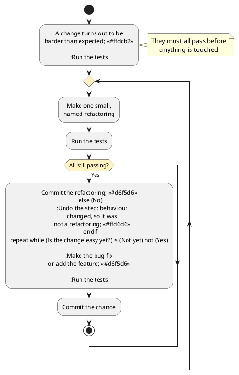

# Code Quality and Refactoring

Every chapter so far has judged code by whether it works. Types rule out malformed programs, tests show that behaviour matches its contract, and the previous two chapters examined whether a published contract serves the people who depend on it. All of these are about a program's behaviour, which is what users and clients experience.

This chapter judges code by something users never see: how easy it is to work _on_. A program can pass every test in its suite and honour every contract it publishes, and still cost a team a week to make a change that should take an hour. The build does not report this problem, and no test will ever fail because of it. The cost appears later, in every subsequent change, and it is paid by whoever maintains the system.

_Refactoring is most often performed to prepare for fixing a bug or adding a new feature._ Its purpose is to reduce the cost of that upcoming change, which is why this chapter comes immediately before the chapters on debugging and on adding features.

#### A Tracker That Grew

The running example continues, some months later.

> As the team maintaining the tracker, we want adding a carrier to be a day's work again, so that we can take on the integrations our customers are asking for. The last two took a week each.

The design from the earlier chapters was sound. Each carrier had an adapter, the adapters implemented `CarrierClient`, and the tracker depended on the interface and knew nothing about any particular carrier. Adding a carrier was supposed to require a new class and nothing else.

Five carriers later, adding a carrier requires much more. Nobody set out to break the design, and no single change broke it. Each carrier introduced a small complication, each complication was handled where it appeared, and together they have moved carrier-specific knowledge out of the adapters and into the middle of the system. The adapters now copy each carrier's own status word into `Shipment.status` with an `as ShipmentStatus` claim, and `ParcelTracker` converts it afterwards:

```typescript
// in ParcelTracker.ts: applied to the status of every shipment an adapter returns
function normaliseStatus(carrierId: string, raw: string): ShipmentStatus {
    if (carrierId === "carrier-a") {
        if (raw === "DEL") {
            return "delivered";
        }
        if (raw === "RTS") {
            return "exception";
        }
        return "in-transit";
    }
    if (carrierId === "carrier-b") {
        if (raw === "Delivered") {
            return "delivered";
        }
        if (raw === "Delivery failed") {
            return "exception";
        }
        return "in-transit";
    }
    // three more carriers, in the same shape
    return "in-transit";
}
```

Every test passes. The tracker is correct, the carriers all work, and no client has complained. The problem is not the behaviour. A function in the middle of the system now knows the status vocabulary of every carrier, so adding a sixth carrier means editing this function, and editing it means re-reading the five branches that already work.

This chapter is about this kind of situation, and the goal is concrete: refactor until adding the sixth carrier is a small addition rather than a week's work.

## Two Kinds of Quality

The tracker illustrates a distinction between two kinds of quality.

**External quality** is whether the software does what it should: correct results, honoured contracts, and acceptable speed. Users notice external quality, and most of Parts 1 and 2 was about establishing it. It can be measured, and a test suite measures it every time it runs.

**Internal quality** is whether a person can read the code, reason about it, and change it safely. Users never see it, and no test reports on it. It has no effect until somebody needs to make a change, and then it determines what that change costs.

The tracker has high external quality and declining internal quality. The two are independent enough that neither predicts the other. Code can be correct and unreadable, or well organised and wrong.

Internal quality matters in Part 3 because of who reads the code. In Parts 1 and 2, the reader was usually you, minutes after writing it, with the whole design in mind. In Part 3, the reader is usually someone who did not write the code, or who wrote it long enough ago to have forgotten the design. The properties that matter are the ones that help that reader:

- _Names that describe._ A reader learns a system mostly by reading its names. A misleading name costs more than an unhelpful one.
- _Units small enough to hold in mind._ A function that fits on one screen can be understood as a whole. A function that runs for three hundred lines has to be understood in pieces, and the pieces interact.
- _Shallow nesting._ Each level of nesting adds another condition the reader has to keep in mind while reading the code inside it.
- _Comments that explain why._ A reader can find out what the code does by reading it. Why the code does it, and what would break if it stopped, is often not recorded anywhere else.

<details class="tooltip link-110">
<summary>Why This Did Not Come Up in CPSC 110</summary>

Nothing in CPSC 110 asked you to improve code that already worked. The design recipe produced code in a standard shape. The data definition determined the template, the template determined the function's structure, and following the recipe meant the result was already organised. There was nothing to clean up, because the recipe did the organising.

The recipe also assumed that the problem did not change. Real systems change after they are written, and no recipe tells you where each change belongs. Code drifts out of shape because the structure that fitted the original problem no longer fits the problem the system now solves, even when nobody has been careless. Refactoring restores a design to a shape that fits what the system now has to do.

</details>

## Technical Debt

Another common way to talk about internal quality is **technical debt**. A shortcut taken today creates a debt, and the debt is repaid later, when future changes are harder than they would otherwise have been. The metaphor is useful when it is taken seriously, including the fact that taking on debt is sometimes the right decision. Two distinctions make the metaphor more useful.

The first is whether the debt was _deliberate_. Shipping a simpler design to meet a deadline, while knowing what has been deferred and why, is a decision. Discovering a year later that a better design existed is different: nobody made a decision, and the team has simply learned more about the problem. Most debt in a long-lived system is of this second, inadvertent kind, and it should not be treated as a sign of carelessness.

The second is whether the debt was _prudent_. Deliberate and prudent debt means the trade-off was considered and the reasoning was recorded. Deliberate and reckless debt means the shortcut was taken without considering its cost. Inadvertent and reckless debt means there was no real design to begin with. Inadvertent and prudent debt is the learning case described above.

<details class="tooltip deep-dive">
<summary>Debt That Is Never Repaid</summary>

The metaphor has a limit, and it can be used to justify almost anything. Financial debt has a schedule: the payments are known in advance, and somebody notices when they stop. Technical debt has no schedule. The build does not fail because a design is poor, and no report says that the interest is rising. The cost appears only as changes taking longer than they should, which is easy to blame on the changes rather than on the design.

This invisibility makes technical debt dangerous. Debt taken on deliberately should be recorded where a future maintainer will look: a comment in the code, an entry in the issue tracker, or a note in the documentation that says what was deferred and when it should be revisited. Six months later, debt that was never written down looks the same as a design somebody intended.

</details>

## Reading the Symptoms

A **code smell** is a visible sign of a possible design problem. The term is deliberately weak. A smell is not a defect, it does not always indicate a problem, and it does not require you to change anything. A smell is a hint that a piece of code deserves a second look at its design.

You already know many of the standard code smells. The first two parts of this textbook were about design, and most smells describe what code looks like when one of those design principles has not been followed.

| Smell | Where it came up already |
|---|---|
| Large class | The god class, in the decomposition chapter. |
| Duplicated code | Don't repeat yourself, in the extension chapter. |
| Long parameter list | The options object, in the consuming data chapter. |
| Feature envy: a method more interested in another object's data than its own | Tell, Don't Ask, in the coupling chapter. |
| Message chains: `a.b().c().d()` | The Law of Demeter, in the coupling chapter. |
| Shotgun surgery: one change, many files | Scattering, in the coupling chapter. |
| Divergent change: one file, many unrelated reasons to change | Tangling, in the coupling chapter. |
| Primitive obsession: strings and numbers where a type belongs | Value objects, in the implementation freedom chapter. |
| Conditional on a type tag | Polymorphism instead of tag switching, in the Open/Closed chapter. |

Two rows in the table explain most of the others. Divergent change is how _tangling_ appears when you arrive to make an edit, and shotgun surgery is how _scattering_ appears. These are the two ways a design can fail separation of concerns, as described in the coupling chapter, and most of the other smells are forms of one or the other. A large class is tangled, and so is a conditional on a type tag, which puts every variant's behaviour into one function. Duplicated code is scattered, and so is primitive obsession, which leaves a rule without a home of its own.

Tangling and scattering are fixed in opposite ways. Tangling is fixed by _splitting_: extracting a function, extracting a class, or replacing a conditional with polymorphism, so that each concern gets its own place. Scattering is fixed by _consolidating_: moving a method to the data it works on, introducing a parameter object, or replacing a primitive with a type, so that something spread across the code is gathered into one place. It is therefore important to diagnose which problem you have. Splitting code that is already scattered leaves more fragments to keep consistent, and consolidating code that is already tangled produces a larger tangle.

The `normaliseStatus` function above is an example of the last row of the table, and in these terms it is tangled. Five carriers' status vocabularies share one function, when each vocabulary belongs in the adapter for its carrier. The Open/Closed chapter argued against conditionals that branch on a tag, and one has reappeared in a system that was designed to avoid them.

Smells are heuristics, and treating them as rules causes its own problems. A long function that reads from top to bottom as a sequence of clearly named steps may be easier to follow than the six small functions it could be split into. A smell raises a question, and sometimes the answer is that the code is fine.

## What Refactoring Is

**Refactoring** is changing the structure of code without changing its behaviour. The second half of that definition is what distinguishes refactoring from editing in general.

Four kinds of change are commonly confused, and keeping them separate is most of the discipline of refactoring:

- _Refactoring_ changes structure and preserves behaviour.
- _Adding a feature_ changes behaviour and should not change structure at the same time.
- _Fixing a bug_ changes behaviour to what it should have been.
- _Rewriting_ discards the structure and the behaviour together, and starts again.

Doing two of these in one change is how refactoring gained its reputation for being risky. If a commit reorganises three files and also changes what the code does, a failing test afterwards does not tell you which half caused it, and reverting the commit loses both.

### Refactoring Is Pure Risk

Refactoring is different from every other kind of work in this textbook.

Every other kind of change has an immediate benefit. A feature gives users something they did not have. A bug fix restores behaviour that was supposed to exist. Each change carries risk, and each has a benefit to weigh against that risk.

Refactoring has no immediate benefit. You take working code and change it, and if everything goes to plan, the result behaves exactly as it did before. No user or client notices, and nothing observable improves. You have taken on the full risk of modifying a working system in exchange for a benefit that only arrives with the next change: the bug fix or feature you are preparing for will be cheaper to make. That benefit is real, and it is the reason this chapter exists, but it does not appear in the refactoring itself, and nobody can point to it directly.

Because the benefit is deferred and the risk is immediate, the risk has to be actively managed. The regression suite from [Chapter 9](../part1/09_validation) manages it, when it is used in a specific order:

1. _Run the suite first, before touching anything._ Confirm that it passes. This step is easy to skip, and skipping it is costly. If a test was already failing when you started, a failure afterwards tells you nothing, and you can spend an afternoon looking for a break you did not cause.
2. _Make the change._
3. _Run the suite again._ It must pass exactly as it did before. If any result changed, you altered the behaviour, which means either the restructuring was wrong or it was not a pure restructuring.

This sequence gives you confidence in a change that would otherwise be impossible to verify. Without a suite, "the behaviour is unchanged" is only a belief, held by the person who has just rearranged the code and who is least able to judge it objectively. With a suite, the claim has been checked, and a mistake appears immediately, rather than weeks later as a defect report that nobody connects to the cleanup.

Without tests, restructuring code is just editing it and hoping nothing breaks. The rest of the discipline, covered later in this chapter, is about keeping each use of the sequence small enough that a failure at step 3 has an obvious cause.

<details class="tooltip deep-dive">
<summary>Refactoring Code That Has No Tests</summary>

The advice above has an obvious gap. The code that most needs restructuring is often the code least likely to have tests. Advice to "write tests first" does not help when the code is hard to test because of the structure you are trying to fix.

The solution is a _characterisation test_: a test that records what the code does now, rather than what it should do. You call the existing code, observe the result, and write that result into the test as the expected value, even when it looks wrong. The goal is to detect changes in behaviour, not to establish correctness, so that a restructuring that alters behaviour is caught.

If the observed behaviour is a bug, the characterisation test documents it. The bug is then fixed separately, after the restructuring, as its own change with its own test. Fixing it as part of the restructuring would mix two kinds of change, which the previous section warned against.

</details>

## Common Refactorings

Most refactoring is made up of a small number of standard changes, each with a name. The names are used across the industry, and several of these changes are built into editors.

The names are worth learning because a named change tells a reader what to expect, including what should _not_ have changed. A reviewer who reads "extract class" and finds an altered comparison operator has found a defect, which they would have had no way to notice in a change described as "cleaned up the tracker". Names also let a plan be discussed before any code is written. "Extract the status mapping, move it into each adapter, then remove what is left" is a sequence that somebody can follow, question, or disagree with. "Tidy up the carrier code" cannot be reviewed, because it does not say what is going to happen.

- _Rename_ something to describe what it is. Renaming carries little risk, especially with editor support, and a better name helps every later reader.
- _Extract function_ from a fragment that has a describable job, giving the fragment a name.
- _Extract class_ when a group of fields and the methods that use them form a responsibility of their own.
- _Inline_ a function or variable whose indirection no longer helps.
- _Remove dead code_ that nothing calls any more.
- _Move method_ to the class that owns the data it operates on. This is the fix for feature envy.
- _Replace a magic number with a named constant_, so the value's meaning is stated once.
- _Introduce a parameter object_ when the same group of arguments is always passed together.
- _Replace a primitive with a value object_, giving an invariant a home.
- _Replace conditional with polymorphism_ when a conditional is choosing between different kinds of thing.

Each of these names describes a sequence of steps, not just an outcome. The sequence matters, because it keeps the program working while the change is half done. You will use _extract function_ often, and its steps are:

1. Create an empty function, and name it for _what_ it does rather than how it does it.
2. Copy the fragment into the new function's body.
3. Work out what the fragment uses. Every variable from the surrounding code that it reads becomes a parameter, and a variable that it writes becomes the return value. If it writes to more than one variable, stop, because the fragment is not ready to be extracted.
4. Replace the original fragment with a call to the new function.
5. Run the tests.

Apart from choosing the name, no step in that sequence requires understanding how the fragment computes its result. A refactoring you can perform mechanically is one you can perform on code you do not yet understand, and most of the code you work on will be code you did not write.

The tracker needs the last refactoring in the list, replace conditional with polymorphism. The knowledge in `normaliseStatus` is specific to each carrier, and there is already one class per carrier, so the fix is to move each branch into the class for its carrier. A refactoring of this size is carried out as a sequence of the smaller ones in the list, and the next section works through that sequence for the tracker.

## Working in Small Steps

When a refactoring fails, the reason is rarely that the intended structure was a bad idea. It usually fails because the restructuring was attempted in one large change across many files, with the system broken partway through and no way to tell which part of the edit caused a failure.

The way to avoid this is a simple, repeated process:

1. Make one small change with a name, of the kind listed above.
2. Run the suite.
3. Commit while the tests all pass.
4. Repeat.

Each step leaves the system working. The work can be interrupted at any point without leaving a mess, a failure can only have been caused by the last small step, and any step can be reverted on its own.

Here is that process applied to the tracker, with one named refactoring per step and the test suite passing at every commit:

1. _Extract function._ Add a private `toStatus` to `CarrierAClient`, holding a copy of carrier A's branches from `normaliseStatus`. Nothing calls it yet, so no behaviour can have changed.
2. _Move method._ Have `CarrierAClient` convert its own status before returning, and have `ParcelTracker` skip `normaliseStatus` for carrier A's shipments. Carrier A's branch is now unused, so delete it. The skip is needed because `normaliseStatus` ends with `return "in-transit"`. Without the skip, every carrier A status would fall through to that line once its branch was gone.
3. Repeat those two steps for each remaining carrier. This takes four more pairs of commits, each covering one carrier.
4. _Remove dead code._ `ParcelTracker` now skips `normaliseStatus` for every carrier, so nothing calls it. Delete it, along with the skip and the `carrierId` argument that existed only to feed it.

This is the plan described earlier, "extract the status mapping, move it into each adapter, then remove what is left", with the tests run and a commit made after every step.

The result is the design the tracker was supposed to have. The `CarrierClient` interface has not changed, but each adapter has stopped passing raw status strings through it with a claim, and converts them itself:

```typescript
class CarrierAClient implements CarrierClient {
    // ... fetching as before ...

    private toStatus(raw: string): ShipmentStatus {
        if (raw === "DEL") {
            return "delivered";
        }
        if (raw === "RTS") {
            return "exception";
        }
        return "in-transit";
    }
}
```

Adding the sixth carrier now means writing a class that implements an interface, which is what the design promised in the first place, and no existing adapter changes. In the vocabulary of the Open/Closed chapter, the refactoring restored an extension point that had always been there but had stopped working.

The refactoring added no feature, fixed no bug, and changed no behaviour. Every shipment that resolved to `delivered` before still resolves to `delivered`, and the existing suite confirms this. The only change is where the knowledge lives, and therefore what the next change will cost.

As part of the larger task it supports, the process looks like this:


<!-- caption="Refactoring as preparation: the test-refactor-test loop runs until the change that prompted it becomes easy." -->

The diagram shows three important features. The tests are run before any code is touched, so that a later failure means something. They are run again after every step, which makes undoing a step cheap: at most one small change has to be reverted, and you know which one. The loop also stops for a reason outside the refactoring itself: the change you originally came to make has become easy.

Two habits support this process. First, keep each diff focused, so that a restructuring commit contains the restructuring and nothing else. Leave out incidental reformatting and unrelated tidying, so that a reviewer does not have to search for the actual change. Second, read your own diff before anyone else does. It is easier to ask "would a stranger understand why this changed?" while your reasoning is still fresh.

<details class="tooltip ts-tips">
<summary>Let the Editor Do It</summary>

Editors with TypeScript support can perform several of these refactorings automatically. The automated version is safer than a manual edit, because the tool works with the structure of the program rather than with its text.

Renaming a symbol updates every reference to it across the project, and leaves alone anything that merely has the same spelling. A find-and-replace cannot make this distinction. Extracting a function works out which variables the fragment uses, turns them into parameters, and returns what the surrounding code needs. Both are standard editor commands.

Look for an automated version before making a structural edit by hand. Hand edits are where missed call sites come from, and a missed call site is one way a refactoring can change behaviour.

</details>

## When Not to Refactor

The advice in this chapter has limits.

_Do not refactor code you have no reason to change._ Leaving working code alone costs nothing, however unpleasant it is to read. Internal quality is worth paying for where change is expected. Paying for it everywhere means paying for changes that will never come.

_Do not refactor without a way to detect behaviour change._ Without an effective test suite, or characterisation tests written first, you are only hoping that the behaviour is preserved.

_Do not refactor past the point where the upcoming change becomes easy._ The goal is the change you came to make, not a design you find satisfying. Restructuring beyond that point has a cost and no request to justify it.

_Do not refactor and change behaviour in the same commit._ This is the same rule as before, and it is easiest to break while a feature is half written.

#### Refactoring as Preparation

Internal quality is invisible until somebody needs to change something, and then it matters a great deal. The tools that measure correctness cannot measure it, which is why it degrades unnoticed in systems whose tests all pass.

Internal quality is best maintained by improving the structure when you have a specific reason to, rather than through scheduled cleanups or a uniform standard of tidiness. The reason is usually a bug to fix or a feature to add, in a part of the system that is currently awkward to work in. At that point, the upcoming change shows you which improvements you need, and you know you have done enough when the change becomes easy.

The main lesson of this chapter is a sequence that the chapter on adding features also relies on. Kent Beck summarised it as "make the change easy, then make the easy change". The tracker is now in a state where adding a sixth carrier means writing a new class and nothing more.

<details class="tooltip exercise">
  <summary>Exercise: A Report That Grew</summary>

> As a shift supervisor, I want a daily summary of what happened in the warehouse, so that I can see problems without reading the raw logs.

The summary started as a count of orders. Over a year, it gained totals, exceptions, staff hours, and two output formats. Nobody has been careless, and every test passes.

```typescript
function buildSummary(events: Event[], format: string, includeStaff: boolean,
                      includeExceptions: boolean, currency: string): string {
    let out = "";
    let orders = 0;
    let total = 0;
    for (const e of events) {
        if (e.kind === "order") {
            orders = orders + 1;
            total = total + e.amount * 1.05;   // tax
            if (format === "html") {
                out = out + "<li>" + e.id + "</li>";
            } else {
                out = out + e.id + "\n";
            }
        }
        if (e.kind === "exception") {
            if (includeExceptions) {
                if (format === "html") {
                    out = out + "<li class='err'>" + e.id + "</li>";
                } else {
                    out = out + "! " + e.id + "\n";
                }
            }
        }
    }
    // staff hours, in the same shape again
    return out;
}
```

A request has arrived to add a third output format.

Work through the following:

1. _Name the smells._ Identify at least four smells in this function, using the vocabulary from this chapter, and for each say which earlier chapter argued against it.
2. _Establish a safety net._ You have no tests. Describe the characterisation tests you would write first, and explain what makes them adequate for this particular refactoring. What would you do about the `1.05` if you suspected it was wrong?
3. _Sequence the work._ List the individual refactorings you would make, in order. Each should be named, and each should be small enough to leave the suite passing. State what you would run after each one.
4. _Do the central one._ The formats are what make the change hard. Restructure the code so that adding a third format is an addition rather than an edit, and show the resulting design.
5. _Judge the boundary._ Which parts of this function would you leave alone, and why? Name one improvement you can see but would not make as part of this task, and say what would have to change for it to become worth making.
6. _Check the finish line._ After your refactoring, describe what adding the third format now involves, and how you would know whether the restructuring preserved behaviour.

</details>
