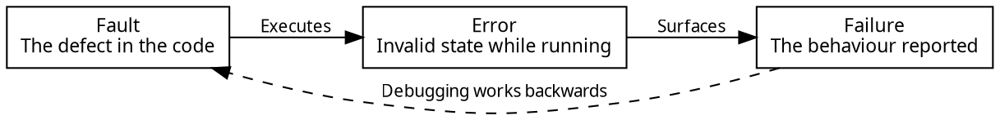

# Debugging and Fault Localization

The previous chapter left the tracker in a state where changes are cheap again. This chapter covers the first of the two kinds of change that refactoring prepares for: fixing behaviour that is supposed to work but does not.

A bug report is a claim that a system is not behaving as expected. It describes what somebody saw, and it almost never says where in the source code the problem comes from. Getting from the report to the source of the problem is a skill called **fault localization**.

Debugging differs from writing code in where you start. When you write a function, you know where you are, and the compiler and the tests tell you when you have made a mistake. When you debug, you start from the end of a chain of consequences and work backwards towards a cause you cannot see. The code may have been correct yesterday, and it may have been written by somebody else. You also rarely have a failing test for a reported bug. If a test had caught the problem, it would already have been fixed.

Debugging is a process more than a talent. It has four steps, each with techniques that can be learned: reproduce the failure, localize the fault, fix it, and validate that the fix worked without introducing new defects. Engineers who debug quickly are usually the ones who follow these steps most systematically.

#### A Parcel That Was Never Delivered

The running example continues.

> A customer reports that the tracker showed one of their parcels as delivered, and it never arrived.

The report describes something seen on a screen. Between that screen and the source of the problem are the display, the tracker, an adapter, and a carrier's web service, and the fault could be in any of them. It could also be in none of them. The parcel may have been delivered to a neighbour, and the software may be reporting exactly what the carrier said.

## Fault, Error, Failure

Three words are often used interchangeably, but it is useful to distinguish them, because debugging moves between them in a particular direction. These meanings are narrower than in the error handling chapter, where _error_ and _failure_ both meant an erroneous outcome.

A **fault** is the defect in the code, such as a wrong comparison, a missing case, or a misplaced assignment. The fault is what you eventually edit.

An **error** is the incorrect state produced when a fault executes, such as a variable holding a value it should not, or an object in a state its invariant forbids. An error exists while the program runs, and it is usually invisible.

A **failure** is the incorrect behaviour that can be seen from outside the program, such as a wrong answer, a crash, or a parcel marked as delivered. It is the only one of the three that a user would report.

The three can be far apart, both in the code and in time. A fault can sit in a codebase for years without executing. When it does execute, it produces an error. Later code might correct the error, or the error might be stored and appear days later, or it might pass through several layers before anyone notices. Debugging follows this chain backwards, from the failure you can see to the fault you can fix, and the longer the chain, the harder the search.


<!-- caption="A fault produces an error, which surfaces as a failure. Debugging travels the chain in the opposite direction." -->

There might also be no fault at all. A report may describe intended behaviour that the user did not expect, or come from a misunderstanding of what the software promises. The problem may also be in configuration or data rather than in code. The first step includes establishing that the failure is real, and deciding who on the technical team should handle it.

## Reproduction

The first and most important task when fixing a bug is to _reproduce_ it. Some bugs can be localized from a user's description, which is often vague, but most cannot. To reproduce a bug is to trigger it reliably in your own environment. A reproduction lets you use tools like the debugger, and lets you write a test that fails while the fault is present and passes once it is fixed. Until a failure can be reproduced, nothing else in this chapter can be applied. You cannot step through it or test a hypothesis about it, and you cannot tell whether a change fixed it or whether the symptom just did not appear that time. A useful reproduction has two properties.

_It should be deterministic._ A failure that appears on one run in five is much harder to fix than one that appears every time, because every later experiment gives an unreliable answer. If the failure does not appear, you learn nothing. Nondeterminism usually has one of a few causes, and each has a standard fix. Time and randomness can be passed in as parameters rather than read from a global source, which is the controllability argument from the encapsulation chapter. Network calls can be replaced with the test doubles from the consuming data chapter. State left over from an earlier test can be removed with the lifecycle hooks from the abstraction chapter. Concurrency is another common and difficult source of nondeterministic failures, but it is mostly beyond the scope of this course.

_It should be minimal._ Start from whatever reproduces the failure and remove things: fewer inputs, fewer steps, fewer parcels, or one carrier instead of five. Stop when removing anything else makes the failure disappear.

Minimising a reproduction is useful even when the original reproduction is already reliable, because minimising is a form of localization. Every element you remove without losing the failure is a part of the system that does not contain the fault. If a reproduction shrinks from a full application run to a single call to one adapter, the search has narrowed from the whole program to a few dozen lines, before you have read any code.

For our report, reproducing the failure requires asking the customer a few questions: which parcel, which carrier, and what the screen showed. The answers give a tracking number, and the minimal reproduction is one call:

```typescript
const carrier = new CarrierCClient("https://api.carrier-c.example");
const found = await carrier.track("Z2200417");
// found.value.status is "delivered"; the parcel is sitting in a depot
```

This reproduction has no user interface, no tracker, and no other carriers. The failure still occurs with all of those removed, which is already useful: the problem is in this adapter, or in what the carrier told it.

<details class="tooltip link-110">
<summary>The Stepper Was a Debugger</summary>

The stepper in CPSC 110 let you watch an expression evaluate one step at a time, showing each intermediate form on the way to a value. It was a teaching tool, but it was also the first debugger you used. When a function produced the wrong answer, stepping showed you the point where the value stopped being what you expected.

The debugger in this chapter does the same job in harder conditions. The stepper could show every step, because ISL programs were small and had no mutable state. A debugger works on a running system with mutable state, many nested calls, and libraries you did not write. It cannot show everything, so you have to choose where to look. The habit the stepper taught still applies: when a value is wrong, find the earliest point at which it is wrong, and look at what happened immediately before.

</details>

## Debugging Tools

Most debugging tools answer one of two questions: what is the state at this point, and how did the program get here?

_The debugger_ answers both. A breakpoint pauses the program at a line and lets you inspect every variable in scope, which is the most direct way to test a hypothesis about state. Stepping moves through the program one line at a time, either over a call or into it, so you can follow a value as it changes. A conditional breakpoint pauses only when an expression is true, which makes it practical to catch the one parcel out of four hundred that goes wrong.

_Print statements_ give a rough answer to the first question. They remain widely used because they are quick and work everywhere, including places a debugger cannot easily reach. They have two limitations. Their output is noisy, and adding them changes the program's timing, which can move or hide a failure that depends on timing.

A bigger problem is what happens to print statements afterwards. It is easy to add a dozen `console.log` calls while narrowing a search, and easy to forget them, because nothing fails when one is left behind. The tests still pass, the build still succeeds, and the only symptom is output nobody asked for. Over time, forgotten print statements fill the program's output with noise, which makes the important messages harder to notice. Every future reader also has to work out whether each one is deliberate or left over from someone's debugging session. Remove them as part of the fix, and prefer the debugger where it is available, because a breakpoint leaves nothing behind.

_Logging_ is the form of printing that stays in production code. A deployed system cannot be paused and stepped through, so the only information available afterwards is whatever the program recorded while it ran. Deciding what to log is therefore a design decision, made long before any bug report arrives.

Two tools from earlier in the textbook also help with debugging. The _type checker_ eliminates whole categories of fault before the program runs, so a fault that survives compilation is already in a narrower category. The _test suite_ helps localize faults: a failing unit test names the unit, which does most of the search for you. This is another argument for the design advice from [Part 2](../part2/index), and it is why a system of small, independently tested units is faster to debug than one that can only be tested end to end.

_Assertions_, from [Chapter 8](../part1/08_errors), are especially useful, because they reduce the distance between a fault and a failure. An assertion turns an error into a failure at the moment the error occurs, before it can spread to an unrelated part of the program. A `Shipment` with an invalid status can be caught where it is created, with a stack trace pointing at that code, instead of being noticed three layers away when something tries to display it.

<details class="tooltip ts-tips">
<summary>Reading a Stack Trace</summary>

A stack trace is the chain of calls that were in progress when an error was thrown, listed with the innermost call first. The top line is where the error was thrown. Each line below it is the call that led to the line above, ending at the program's entry point.

Two habits make stack traces useful. The first is to find the topmost line that refers to code _you_ wrote. Traces often begin with several lines inside a library, and those lines are usually reporting your mistake rather than the library's. The library was given something it could not work with, and the important question is which of your lines passed it in.

The second is to read the trace as a description of _how the program got there_, not only where it stopped. When a function is called from several places, the trace tells you which caller was responsible this time, which the line where it stopped cannot tell you.

</details>

## Localizing the Fault

Once you have a reproduction, the next question is where the fault is. It is tempting to start changing things at this point, but this is usually unproductive. Changing code without a hypothesis produces a different program, but it does not help you understand the program any better. If the failure happens to disappear, you do not know why, so you cannot tell whether the fault is fixed or just hidden.

A more deliberate approach follows the same pattern as a scientific experiment:

1. Form a hypothesis about what is wrong, stated precisely enough that an observation could show it to be false.
2. Predict what you would observe if it were true, and what you would observe if it were not.
3. Make the observation.
4. Keep or discard the hypothesis, and repeat.

Stating the prediction _before_ observing stops you from accepting a result that does not distinguish between explanations. "The adapter is returning the wrong status" is not a useful hypothesis, because almost any observation is consistent with it. "The adapter maps the carrier's `NOT_DELIVERED` to `delivered`" is useful, because it predicts one specific value from one specific call.

Several techniques can narrow the search:

_Follow the dependency graph backwards._ The failing value is a status. It was displayed by the user interface, which got it from the tracker, which got it from an adapter, which derived it from a carrier's response. That chain is the arrows from the coupling chapter followed in reverse, and it lists every place the wrong value could have come from. This is a practical benefit of low coupling. In a loosely coupled system, the chain is short and the search covers one module. In a tightly coupled system, the arrows lead everywhere and the search covers the whole program.

_Start from what changed._ Most faults are recent. If the tracker worked last month and does not work now, the difference is a small set of commits, and reading them is often faster than reasoning about the code.

_Bisect._ When the search space is still large, halve it. The most familiar form is bisecting the input, which is what minimising a reproduction does. The same idea applies to a path through the code, where checking the state at the midpoint tells you which half the value went wrong in. It also applies to a project's history.

<details class="tooltip deep-dive">
<summary>Bisecting History</summary>

When a failure is known to be new, the commit that introduced it can be found without reading any code, by using binary search on the project's history.

Pick a commit where the failure does not occur and one where it does. Check out the commit halfway between them and test it. If the failure occurs, the commit you want is in the earlier half, and if it does not, the commit is in the later half. Repeat with the remaining half. Each round halves the number of candidates, so a thousand commits take about ten tests.

`git bisect` automates the bookkeeping. You mark one commit `good` and one `bad`, and it checks out the midpoints for you until one commit is left. If the failure can be checked by a script, `git bisect` can also run that script at each step.

Bisecting finds the commit where the behaviour changed, which is usually, but not always, where the fault is. A commit can expose a fault that was already present. Some failures are not caused by any commit at all. Our parcel bug is one of these: nothing in our history changed, so bisecting would not find a commit to blame.

</details>

For the parcel, the reproduction has already narrowed the search to one adapter. This adapter converts statuses with a function in the same file as the class, rather than with a private method, so a test can call it directly. The function is not exported from the library's `index.ts`, so it is not part of the published contract. Reading it suggests some guesses about the fault:

```typescript
// in CarrierCClient.ts, alongside the class
export function toStatus(raw: string): ShipmentStatus {
    if (raw.includes("DELIVERED")) {
        return "delivered";
    }
    if (raw.includes("EXCEPTION")) {
        return "exception";
    }
    return "in-transit";
}
```

A guess is not a diagnosis. Two rounds of the process above turn these guesses into one.

_Round one._ The first hypothesis is the cheapest one to check: _the carrier is reporting the parcel as delivered, and we are correctly passing that on._ If this is true, the raw response contains a status that clearly means delivered. If it is false, the response says something else. The observation takes one line, placed before the conversion:

```typescript
const body: unknown = await response.json();
console.log(body);   // { trackingNumber: "Z2200417", status: "NOT_DELIVERED", ... }
```

The prediction fails, so the hypothesis is _discarded_. This is still a useful result. The carrier is not claiming that the parcel arrived, so our own code is producing the wrong answer.

_Round two._ The next hypothesis is about the conversion itself: _`toStatus` maps `"NOT_DELIVERED"` to `"delivered"`, because it tests for a substring rather than for the whole value._ This prediction is precise enough to be wrong, and checking it needs no carrier, no network, and no parcel:

```typescript
expect(toStatus("NOT_DELIVERED")).not.to.equal("delivered");
// fails: toStatus returned "delivered"
```

The hypothesis is correct. `"NOT_DELIVERED".includes("DELIVERED")` is `true`, so the first branch matches. The fault is one line, and a test that runs in a millisecond can now reach it.

Each step narrowed the search considerably. Reproduction removed the user interface, the tracker, and four carriers. Round one ruled out the carrier. Round two ruled out everything except a single function, and turned the bug into a failing test that can strengthen our test suite. Each round was cheap because each hypothesis was precise enough to be checked with one observation.

The fault was not introduced by a recent edit. Nobody changed this code. The carrier started sending a status it had never sent before, and a substring test that had been correct since it was written stopped being correct, without any change in our repository. Faults do not have to be recent to appear, and "we did not change anything" is not evidence that the fault is somewhere else.

## Fixing the Fault

Once the fault is found, the fix can seem obvious, and this is where a second kind of mistake is easy to make. The parcel bug could be fixed like this:

```typescript
if (raw === "NOT_DELIVERED") {
    return "exception";
}
if (raw.includes("DELIVERED")) {
    return "delivered";
}
```

The reported failure goes away and the customer is satisfied, but the fault is still there. `PARTIALLY_DELIVERED` would cause the same failure, and so would any future status from the carrier that contains the same substring. This is a symptomatic fix: it addresses the reported instance rather than the defect that caused it.

Three questions help distinguish a symptomatic fix from a real one.

_What else could this fault cause?_ One fault usually causes several failures, and only one of them has been reported. Asking which other inputs follow the same path finds those failures before a customer does. Here, the answer is any status that contains `DELIVERED`.

_Where is the fault?_ The failure appeared in the display, but the display is not wrong, because it showed what it was given. The fault is in the conversion, and that is where the fix belongs. Fixing a symptom where it was observed, rather than where it was caused, tends to leave the fault in place and add a special case on top of it.

_Why was this fault possible?_ The substring test matched an open-ended set of strings to a fixed set of meanings, which cannot be correct in general, because the carrier can always introduce a status we have never seen. The real fix is to match exactly against the statuses the carrier documents, and to treat anything unrecognised as an error rather than guessing.

Before changing any code, turn the check from round two into a permanent test, which is why it was worth narrowing the reproduction down to a single function. The test states the correct answer, which the round-two check did not:

```typescript
test("a NOT_DELIVERED status is not reported as delivered", () => {
    const converted = toStatus("NOT_DELIVERED");
    expect(converted).to.deep.equal({ ok: true, value: "exception" });
});
```

Run the test and watch it fail _before_ applying the fix. A test that was written after the fix and never seen to fail may not be checking anything. It passes, but an empty test would also pass, and neither tells you anything. Seeing the test fail first shows that it detects the fault.

The fix itself must still handle `EXCEPTION`, which the old code recognised, or it would introduce a regression of its own:

```typescript
export function toStatus(raw: string): Result<ShipmentStatus, string> {
    if (raw === "DELIVERED") {
        return { ok: true, value: "delivered" };
    }
    if (raw === "NOT_DELIVERED") {
        return { ok: true, value: "exception" };
    }
    if (raw === "EXCEPTION") {
        return { ok: true, value: "exception" };
    }
    if (raw === "IN_TRANSIT") {
        return { ok: true, value: "in-transit" };
    }
    return { ok: false, error: "unrecognised carrier status: " + raw };
}
```

This is the same kind of converter as in the consuming data chapter. The original bug was possible because an unvalidated value from outside the program was interpreted by guesswork, which is what the boundary in that chapter exists to prevent. Debugging often ends in a design change, because the reason a fault was possible usually has a design answer.

## Regression

When you fix a bug, you must make sure the fix does not introduce new bugs. A change might seem to affect only the situation where the bug occurs, but in a system with state, a change can affect other parts of the system in unexpected ways. In a system with many users, a fix that breaks existing behaviour is rarely acceptable.

The best way to make sure a change does not cause new problems is regression testing. A test suite is useful for more than checking a new feature. It also checks that all the previously tested behaviour still works.

Once the fix is applied, the new test passes, and it stays in the suite to guard against this fault returning. Run the whole suite as well, not only the new test. The refactoring chapter made the same argument about restructuring, and it is why both chapters depend on [Chapter 9](../part1/09_validation). A test suite turns "I believe this change is safe" into evidence.

## Fixing a Public API

Fixing a bug is harder when the bug is in a published API that other people use, because the fix changes a contract that other people have written code against. Everything from the API design chapter applies.

The difficult case is when clients have built on the buggy behaviour. If our tracker reported `delivered` for a status that meant the opposite, a client may have noticed and worked around it, for example by checking a second field to work out the real status. Fixing our fault breaks their workaround, and their code was working this morning.

This is Hyrum's law in an unwelcome form. Once enough clients depend on a behaviour they can observe, buggy behaviour becomes part of the contract in practice, whatever the documentation says. The question becomes whether fixing it is worth breaking the clients who adapted to it.

There is no single answer, but there are only a few options:

- _Fix the code and treat it as a breaking change_, with a major version, release notes that describe the old and new behaviour, and enough notice for clients to adapt.
- _Fix the code in a new version of the operation_, leaving the old behaviour available for clients who need time, and deprecating it on the schedule from the API design chapter.
- _Fix the documentation and leave the code alone_, when the behaviour is harmless and the cost of changing it is greater than the cost of the confusion. A documented oddity is a smaller problem than an undocumented one. Changing a published API has such a large impact that this option is chosen more often than you might expect.

The severity of a bug can override all of this. A bug that loses data, exposes information, or lets someone do what they should not be able to do is fixed immediately, even if clients depend on it and get no notice, because the alternative is worse. The Falador example below shows this decision being made in real time. Significant functionality was disabled within hours, and the more careful design came later.

<details class="tooltip deep-dive">
<summary>When Are Breaking Bug Fixes Allowed?</summary>

Software design involves trade-offs. A bug fix that disables normal features of the software is usually unacceptable, but there are exceptions. For example, a serious security bug may be patched temporarily with a fix that disables a useful feature completely.

The [Falador Massacre](https://en.wikipedia.org/wiki/RuneScape#Falador_Massacre) was the dramatic name given to the result of a bug in the [MMORPG](https://en.wikipedia.org/wiki/Massively_multiplayer_online_role-playing_game) RuneScape. In RuneScape, player-versus-player (PvP) combat was disabled in _most_ of the game. It was only allowed in special areas, such as "The Wilderness" and some parts of player-owned houses. Cities such as Falador were meant to be safe from PvP combat. A player killed by another player loses most of the items they were carrying.

The bug was that when players were removed from a player-owned house while PvP was enabled for them, PvP stayed enabled. Some players were therefore able to attack other players in areas that were supposed to be safe, which caused a great deal of chaos.

The bug happened in the middle of the night for the game's developers. The developer on call [deployed a simple fix](https://youtu.be/ukbkU_dPKrU?si=A1QEkVbFlnZG5Jn_&t=3560): houses could no longer turn on PvP, and the PvP state no longer had any effect. This disabled significant PvP features in the game, but disabling them cost less than letting the "massacre" continue.

The game code was later updated to [add a notion of "areas" to the game](https://youtu.be/ukbkU_dPKrU?si=l1K9BgG4NC9AYwYT&t=3650). Areas could be checked to ensure that states such as PvP were not enabled where they should not be.

</details>

#### Debugging Is a Process

Each step in this chapter either shortens the chain from fault to failure or searches it systematically. Reproduce the failure, so that it can be triggered on demand and is small enough to reason about. Localize the fault by forming hypotheses and halving the search space. Fix the fault where it is, and ask why it was possible, because the answer often points to a design improvement as well as a correction. Validate the fix with a test that you saw fail first, and with a suite that checks everything else.

Little of this process is new. The properties that make a system quick to debug are the same ones earlier chapters argued for, for other reasons: small units that a failing test can name, low coupling so that the chain of dependencies is short, validated boundaries so that bad data is rejected where it enters rather than misinterpreted three layers later, assertions that make silent errors visible, and a regression suite that can check any fix. None of these were introduced as debugging techniques, but all of them help when something goes wrong.

<details class="tooltip exercise">
  <summary>Exercise: The Overnight Shift Report</summary>

> As a warehouse supervisor, I want the overnight shift report to show the hours my staff worked, so that payroll is correct.

A supervisor reports that one employee's overnight shift was recorded as `-17` hours. Payroll rejected the run, and the problem does not happen for day shifts.

```typescript
/**
 * Computes the length of a shift in hours.
 *
 * @param {number} startHour the hour the shift began, 0 to 23
 * @param {number} endHour the hour the shift ended, 0 to 23
 * @returns {number} the shift length in hours
 */
function shiftLength(startHour: number, endHour: number): number {
    return endHour - startHour;
}
```

Work through the following:

1. _Separate the three._ Identify the fault, the error, and the failure in this report, and say which of them the supervisor observed.
2. _Reproduce it._ Write the smallest call that triggers the failure, and state the property of overnight shifts that makes them different from day shifts. Explain what your minimal reproduction has already ruled out.
3. _Form a hypothesis._ State a hypothesis precise enough to be false, and give the observation that would distinguish it from a competing explanation, such as bad data from the time-clock system.
4. _Fix the fault._ Correct the defect rather than the reported instance. Then describe other failures that the same fault could cause, which nobody has reported yet.
5. _Ask why it was possible._ The documentation says that both parameters are hours from 0 to 23, but nothing enforces this. Describe a design change, using an idea from an earlier chapter, that would have made this fault impossible or caught it at the boundary.
6. _Guard it._ Write the regression test, and say what you would check about that test before trusting the fix. Then decide whether this function belongs in a published API, and if it did, what the compatibility consequences of your fix would be.

</details>
