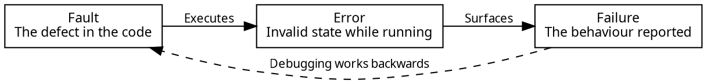

# Debugging and Fault Localization

The previous chapter left the tracker in a state where change is cheap again. This chapter takes up the first of the two changes that refactoring was preparing for: behaviour that is supposed to work and does not.

A bug report is a claim that a system is not behaving as expected. It arrives with a description of what somebody saw, and almost never with any indication of where in the source code the problem originates. Closing the distance between those two things is an explicit skill, called **fault localization**.

That distance between the report and where it manifests in the code is the reason debugging feels different from writing code. When you write a function you know where you are, and the compiler and the tests tell you when you have gone wrong. When you debug, you begin at the far end of a chain of consequences and work backwards towards a cause you cannot see, in code that may have been correct yesterday and may have been written by somebody else. This is also challenging because you rarely have failing tests in advance for a reported bug, if you did, you would have already fixed the problem.

The claim of this chapter is that debugging is a process rather than a talent. It has four steps, each with techniques that can be learned: reproduce the failure, localize the fault, fix it, and validate that the fix worked and didn't introduce any other new defects. Engineers who are quick at debugging are usually not guessing better than everybody else; they are following those steps more systematically.

## A Parcel That Was Never Delivered

The running example continues.

> A customer reports that the tracker showed one of their parcels as delivered, and it never arrived.

The report describes something seen on a screen. Between that screen and whatever is wrong there is a display, the tracker, an adapter, and a carrier's web service, and the fault could be in any of them. It could also be in none of them: the parcel may have been delivered to a neighbour, and the software may be reporting exactly what the carrier said.

## Fault, Error, Failure

Three words get used interchangeably in conversation but are worth differentiating, because debugging moves between them in a particular direction.

A **fault** is the defect in the code: a wrong comparison, a missing case, a misplaced assignment. It is what you eventually edit.

An **error** is the incorrect state produced when a fault executes: a variable holding a value it should not, an object in a condition its invariant forbids. It exists while the program runs and is usually invisible.

A **failure** is the externally visible mis-behaviour: the wrong answer, the crash, the parcel marked delivered. It is the only one of the three that a user would report.

The three are separated by distance in both code and time. A fault can sit in a codebase for years without executing. When it executes it produces an error, which may be corrected by later code, or stored and surfaced days afterwards, or propagated through several layers before anyone notices. Debugging runs this chain backwards, from the end you can see to the end you can fix, and the length of that chain is what makes the job hard.


<!-- caption="A fault produces an error, which surfaces as a failure. Debugging travels the chain in the opposite direction." -->

Consider also the possibility that there is no fault at all. A report may describe intended behaviour that the user did not expect, a misunderstanding of what the software promises, or a problem in configuration or data rather than in code. Establishing that the failure is real, and who it should be assigned to in the technical team, is part of the first step.

## Reproduction

The most important first task of fixing bugs is to _reproduce_ the bug. While some bugs can be localized based on a user's (often vague) description, most cannot. Creating conditions in which the bug can be _reproduced_, that is, triggered reliably in your own environment, is key, because this then allows you to use tools like the debugger, and to write a test that fails while the fault is present and passes once the fault is fixed. Until a failure can be reproduced, nothing else in this chapter is actionable. You cannot step through it, cannot test a hypothesis about it, and cannot tell whether a change fixed it or the symptom happened not to appear that time. Two properties make a reproduction useful:

_It should be deterministic._ A failure that appears on one run in five is far more difficult to fix than one that appears every time, because every experiment afterwards gives an unreliable answer: the failure not appearing tells you nothing. Where the nondeterminism comes from is usually one of a short list, and each has a standard response. Time and randomness can be supplied as parameters rather than read from a global source, which is the controllability argument from the encapsulation chapter. Network calls can be replaced with the test doubles from the consuming chapter. State left over from an earlier test can be removed with the per-test setup from the abstraction chapter. Concurrency is a difficult source of non-deterministic failures, and is mostly beyond the scope of this course.

_It should be minimal._ Start from whatever reproduces the failure and remove things: fewer inputs, fewer steps, fewer parcels, one carrier instead of five. Stop when nothing further can be removed without the failure disappearing.

Minimising is worth doing even when the original reproduction is already reliable. Minimising is not tidying, it is localization. Every element you remove without losing the failure is a part of the system the fault is not in, so a reproduction that shrinks from a full application run to a single call against one adapter has narrowed the search from the whole program to a few dozen lines, before any code has been read.

For our report, the reproduction takes a few questions to the customer: which parcel, which carrier, and what the screen showed. The answers give a tracking number, and the minimal reproduction is one call:

```typescript
const carrier = new CarrierBClient("https://api.carrier-b.example");
const found = await carrier.track("Z2200417");
// found.value.status is "delivered"; the parcel is sitting in a depot
```

No user interface, no tracker, no other carriers. The failure survives all of that being removed, which is already a substantial result: whatever is wrong is in this adapter or in what the carrier told it.

<details class="tooltip link-110">
<summary>The Stepper Was a Debugger</summary>

CPSC 110's stepper let you watch an expression evaluate one reduction at a time, seeing each intermediate form on the way to a value. It was a teaching tool, and it was also the first debugger you used: when a function produced the wrong answer, stepping showed you the point where the value stopped being what you expected.

The debugger in this chapter does the same job under harder conditions. The stepper could show every step because ISL programs were small and had no state; a debugger works on a running system with mutable state, several hundred stack frames, and libraries you did not write, so it cannot show everything and you have to choose where to look. The skill that carries over is the habit the stepper taught: when a value is wrong, find the earliest point at which it is wrong, and look at what happened immediately before.

</details>

## Localizing the Fault

With a reproduction in hand, the question becomes where the fault is. The temptation at this point is to start changing things, but this hasty approach is often unproductive. Changing code without a hypothesis produces a program that is different, but not one that is better understood. And if the failure happens to disappear, you have no account of why, so you cannot tell whether the fault is fixed or merely hidden.

The alternative is deliberate and echoes a traditional scientific experimental design:

1. Form a hypothesis about what is wrong, stated precisely enough to be false.
2. Predict what you would observe if it were true, and what you would observe if it were not.
3. Make the observation.
4. Keep or discard the hypothesis, and repeat.

The value of stating the prediction _before_ observing is that it stops you accepting a result that does not distinguish between explanations. "The adapter is returning the wrong status" is not yet a hypothesis worth testing, because almost any observation is consistent with it. "The adapter maps the carrier's `NOT_DELIVERED` to `delivered`" is, because it predicts one specific value from one specific call.

Several techniques can be used to narrow the search enough:

_Follow the dependency graph backwards._ The failing value is a status, displayed by the UI, produced by the tracker, obtained from an adapter, derived from a carrier's response. That chain is the arrows from the coupling chapter, read in reverse, and it is the list of places the wrong value could have come from. This is the practical benefit of low coupling: in a loosely coupled system the chain is short and the search space is a module, and in a tangled one the arrows lead everywhere and the search space is the program.

_Start from what changed._ Most faults are recent. If the tracker worked last month and does not now, the difference is a small set of commits, and reading them is often faster than reasoning about the code.

_Bisect._ When the search space is still large, halve it. The most familiar form is over the input, which is what minimising a reproduction does. The same idea applies to a path through the code, by checking the state at its midpoint to learn which half the value went wrong in, and to a project's history.

<details class="tooltip deep-dive">
<summary>Bisecting History</summary>

When a failure is known to be new, the commit that introduced it can be found without reading any code, by binary search over the project's history.

Pick a commit where the failure does not occur and one where it does. Check out the commit halfway between them and test: if it fails, the change you want is in the earlier half, and if it passes, it is in the later half. Repeat on whichever half remains. Each round halves the number of candidates, so a thousand commits take about ten tests.

`git bisect` automates the bookkeeping. You mark one commit `good` and one `bad`, and it checks out midpoints for you, narrowing until one commit is left. It can even run the test itself at each step, if the failure can be checked by a script.

What this finds is the commit where the behaviour changed, which is usually but not always where the fault is. A commit can expose a fault that was already present, and our parcel bug is exactly that case: nothing in our history introduced it.

</details>

Applied to the parcel, the reproduction has already narrowed things to one adapter. Reading its status mapping gives a hypothesis immediately:

```typescript
private toStatus(raw: string): ShipmentStatus {
    if (raw.includes("DELIVERED")) {
        return "delivered";
    }
    if (raw.includes("EXCEPTION")) {
        return "exception";
    }
    return "in-transit";
}
```

Reading the code suggests some guesses about the problem, but a guess is not a diagnosis. Running the loop above turns those guesses into a diagnosis in two rounds.

_Round one._ The first hypothesis is one that you can get for free: _the carrier is reporting the parcel as delivered, and we are faithfully passing that on._ If it holds, the raw response says something that plainly means delivered; if it does not hold, the response says something else. The observation is one line, placed before the conversion:

```typescript
const raw = await response.json();
console.log(raw.status);   // "NOT_DELIVERED"
```

The prediction fails, so the hypothesis can be _discarded_. That is a result rather than a waste of time: the carrier is not claiming the parcel arrived, so the wrong answer is being constructed within our own code.

_Round two._ The suspicion now falls on the conversion itself: _`toStatus` maps `"NOT_DELIVERED"` to `"delivered"`, because it tests for a substring rather than for the whole value._ The prediction is precise enough to be wrong, and it needs no carrier, no network, and no parcel to check:

```typescript
// with toStatus reachable from the test
checkExpect(() => toStatus("NOT_DELIVERED"), "in-transit");
// fails: "delivered"
```

The hypothesis is correct. `"NOT_DELIVERED".includes("DELIVERED")` is `true`, the first branch wins, and the fault is one line, reachable now by a test that runs in a millisecond.

Notice how far the search narrowed at each step. Reproduction removed the interface, the tracker, and four carriers. Round one removed the carrier itself. Round two removed everything but a single function, and turned the bug into a failing test we can use to strengthen our test suite. Each round was cheap because each prediction was one observation away, which is what "stated precisely enough to be false" enables.

Notice where the fault came from. Nobody edited this code. The carrier introduced a status it had never sent before, and a substring test that had been correct for two years stopped being correct without anything in our repository changing. Faults do not have to be recent to surface, and "we did not change anything" is not evidence that the fault is elsewhere.

## Tools

Debugging tools mostly answer one of two questions: what is the state at this point, and how did control get here.

_The debugger_ answers both. A breakpoint pauses the program at a line and lets you inspect every variable in scope, which is the direct way to test a hypothesis about state. Stepping moves one line at a time, either over a call or into it, so you can follow a value as it is transformed. A conditional breakpoint pauses only when an expression is true, which is what makes it practical to catch the one parcel out of four hundred that goes wrong.

_Print statements_ answer the first question crudely, and they remain widely used because they are quick and they work everywhere, including places a debugger cannot easily reach. They have two limits: the output is noisy, and adding them changes the program's timing, which can move or hide a failure that depends on it.

The larger problem is what happens to them afterwards. A `console.log` added to catch one value is chatty by nature, and it is easy to add a dozen while narrowing a search. They are then trivial to forget, because nothing fails when one is left behind: the tests still pass, the build is still green, and the only symptom is output nobody asked for. Left in, they accumulate into a codebase that prints a steady stream of noise, in which the messages that matter are the hardest to notice, and every future reader has to work out whether a given line is deliberate or a fossil from somebody's debugging session years ago. Treat removing them as part of the fix rather than as tidying to be done later, and prefer the debugger where it is available, since a breakpoint leaves nothing behind.

_Logging_ is the version of that which survives into production. A deployed system cannot be paused and stepped through, so the information available afterwards is whatever the program recorded while it ran. That makes what to log a design decision rather than a debugging one, made long before the report arrives.

Two tools already in the textbook do more debugging work than their names suggest. The _type checker_ eliminates whole categories of fault before the program runs, so a fault that survives compilation is already in a narrower class. The _test suite_ localizes by construction: a failing unit test names the unit, which is most of the search finished. This is a debugging argument for the design advice from [Part 2](../part2/index), and it is why a system of small, independently tested units is faster to debug than one that can only be exercised end to end.

_Assertions_, from the checking invariants chapter, deserve particular mention here, because they attack the distance between fault and failure directly. An assertion turns an error into a failure at the moment the error occurs, rather than allowing it to propagate to somewhere unrelated. A `Shipment` whose status is invalid can be caught where it is constructed, with a stack trace pointing at the construction, instead of being noticed three layers away when something tries to display it.

<details class="tooltip ts-tips">
<summary>Reading a Stack Trace</summary>

A stack trace is the chain of calls that were in progress when an error was thrown, listed innermost first. The top line is where the throw happened; each line below is the call that led to it, ending at the program's entry point.

Two habits make traces useful. The first is to find the topmost frame in code _you_ wrote. Traces frequently begin with several frames inside a library, and those frames are usually reporting your mistake rather than theirs: the library was handed something it could not work with, and the interesting question is which of your lines handed it over.

The second is to read the trace as a description of _how control arrived_, not only where it stopped. When a function is called from several places, the trace tells you which caller was responsible on this occasion, which a breakpoint alone will not.

</details>

## Fixing the Fault, Not the Symptom

Once the fault is found, the fix looks obvious, and that is where a second kind of mistake is available. Our parcel could be fixed like this:

```typescript
if (raw === "NOT_DELIVERED") {
    return "exception";
}
if (raw.includes("DELIVERED")) {
    return "delivered";
}
```

The reported failure goes away, the customer is satisfied, and the fault is still there. `PARTIALLY_DELIVERED` will do it again, and so will the next status the carrier invents containing that substring. This is a symptomatic fix: it addresses the instance that was reported rather than the defect that produced it.

Three questions separate the two.

_What else could this fault produce?_ One fault usually causes several failures, only one of which was reported. Asking what other inputs take the same path finds them before a customer does, and the answer here is any status containing `DELIVERED` as a substring.

_At what level does the fault live?_ The failure appeared in the display, and the display is not wrong: it showed what it was given. The fault is in the conversion, and that is where the fix belongs. Correcting a symptom at the level where it was observed, rather than where it was caused, tends to leave the fault in place and add a special case on top of it.

_Why was this fault possible?_ The substring test was matching an open set of strings against a fixed set of meanings, which cannot be correct in general, because the carrier is free to invent a status we have never seen. The real fix is exact matching against the statuses we know, with anything unrecognised treated as an error rather than guessed at:

```typescript
private toStatus(raw: string): Result<ShipmentStatus, string> {
    if (raw === "DELIVERED") {
        return { ok: true, value: "delivered" };
    }
    if (raw === "NOT_DELIVERED") {
        return { ok: true, value: "exception" };
    }
    if (raw === "IN_TRANSIT") {
        return { ok: true, value: "in-transit" };
    }
    return { ok: false, error: "unrecognised carrier status: " + raw };
}
```

That is the converter from the consuming chapter, and the connection is worth making explicit. The original bug was possible because an unvalidated value from outside the program was interpreted by guesswork, which is precisely what the boundary in that chapter exists to prevent. Debugging a fault often ends in a design change, because the question of why the fault was possible usually has a design answer.

The last question to ask before moving on is what test would have caught this earlier, which leads directly into the next step.

## Regression

When fixing a bug, you must ensure that your fix does not engender new bugs. You may think a change will only impact the scenario in which the bug happens, but in a stateful system, it is very possible your change may unexpectedly affect some other part of the system. A bug "fix" that breaks existing behaviour is rarely acceptable in a software system with many users.

<details class="tooltip deep-dive">
<summary>When Are Breaking Bug Fixes Allowed?</summary>

Software design is a practice of tradeoffs. Usually, a bug fix that stops some regular functional paths of software is unacceptable. But, there are exceptions. A serious security bug, for instance, may be temporarily patched with a bug fix that disables a useful behaviour altogether.

The [Falador Massacre](https://en.wikipedia.org/wiki/RuneScape#Falador_Massacre) was the rather dramatically named result of a bug in the [MMORPG](https://en.wikipedia.org/wiki/Massively_multiplayer_online_role-playing_game) RuneScape. RuneScape was an online game in which player-versus-player combat was disabled in _most_ of the game. Only special zones, including "The Wilderness", and in some parts of player-owned housing, allowed player-versus-player (PvP) combat. Cities such as Falador were meant to be safe from this combat. When a player is killed by another player, the killed player loses all the items they had on them.

In short, the bug was that, when players were kicked out of a player-owned house while in a PvP-enabled state, this PvP-enabled state remained. Thus, some players were able to attack players in what were supposed to be safe zones. This caused a significant amount of chaos.

As the bug happened in the middle of the night for the game developers, the developer on-call that night [deployed a simple fix](https://youtu.be/ukbkU_dPKrU?si=A1QEkVbFlnZG5Jn_&t=3560): no longer allowing the house to set the PvP-allowed state, and preventing that PvP-allowed state from, well, allowing PvP. This disabled significant PvP features in the game, but the cost of disabling these features was less than the cost of letting the "massacre" go on unchecked.

The game code was later updated to [add a notion of "areas" to the game](https://youtu.be/ukbkU_dPKrU?si=l1K9BgG4NC9AYwYT&t=3650), which could be cross-checked to ensure that variables (such as the PvP-enabled state) are not enabled in areas where they should not be. 
</details>

The best way to ensure that your change does not cause new problems is through regression testing. Test suites are useful not just to implement your new feature, but also to ensure that all the previous behaviours you tested are maintained.

The minimal reproduction from the first step is the test to add, which is why it was worth making it small and automatable. Written as a test, it becomes a permanent guard against this fault returning:

```typescript
test("a NOT_DELIVERED status is not reported as delivered", () => {
    const converted = toStatus("NOT_DELIVERED");
    expect(converted).to.deep.equal({ ok: true, value: "exception" });
});
```

The order of operations matters. Add the test and watch it fail _before_ applying the fix. A test written after the fix and never seen to fail is a test that may be checking nothing at all: it passes, but so would an empty test, and neither tells you anything. Seeing it fail first is what establishes that it detects the fault.

Then run the whole suite, not only the new test. This is the same argument the refactoring chapter made about restructuring, and it is the reason both chapters depend on [Chapter 9](../part1/09_validation): a suite is what converts "I believe this change is safe" into evidence.

## Bug-Fixing in a Public API

A real challenge emerges when a bug is revealed in a public API, which you have users of. The fix is no longer only a correction; it is a change to a contract that other people have written code against, and everything from the API design chapter applies to it.

The uncomfortable case is that clients may have built on the buggy behaviour. If our tracker reported `delivered` for a status that meant the opposite, a client may have noticed and compensated, checking a second field to work out what the status truly was. Correcting our fault breaks their compensation, and their code was working this morning.

This is Hyrum's law arriving in an unwelcome form: once enough clients depend on observable behaviour, buggy behaviour becomes a de facto contract regardless of what the documentation says. The question stops being "is this a bug?" and becomes "is fixing it worth breaking the people who adapted to it?"

There is no single answer, but the options are limited and worth knowing:

- _Fix the code and treat it as a breaking change_, with a major version, release notes that describe the old behaviour and the new one, and enough notice for clients to adapt.
- _Fix the code behind a new version of the operation_, leaving the old behaviour available for clients who need time, and deprecating it on the schedule from the API design chapter.
- _Fix the documentation and leave the code alone_, when the behaviour is harmless and the cost of changing it exceeds the cost of the confusion. A documented oddity is a smaller problem than an undocumented one. Changing APIs are often so impactful this choice is much more prevalent than you might expect.

Severity overrides the calculus. A bug that loses data, exposes information, or lets someone do what they should not be able to do gets fixed immediately, and clients who depended on it are given no notice, because the alternative is worse. The Falador example above is that decision being made in real time: significant functionality was disabled within hours, and the more careful design came later.

## Debugging Is a Process

The chain from a fault to a failure is what makes debugging hard, and every step in this chapter is a way of shortening it or searching it systematically. Reproduce, so that the failure is available on demand and small enough to reason about. Localize by hypothesis and by halving, rather than by changing code and hoping. Fix the fault at the level it lives, and ask why it was possible, because the answer is often a design improvement rather than only a correction. Validate with a test that was seen to fail first, and with a suite that guards everything else.

Notably, little of the debugging process is new to you at this point. The properties that make a system quick to debug are the ones earlier chapters argued for on entirely different grounds: small units that a failing test can name, low coupling so the chain of arrows is short, validated boundaries so bad data is rejected where it enters rather than interpreted three layers later, assertions that turn silent errors into loud ones, and a regression suite that makes any fix checkable. None of those were introduced as debugging techniques. All of them are, on the day something goes wrong.

Debugging restores behaviour that was supposed to exist. The final chapter takes up the other reason to change working code, which is behaviour that was never there at all.

<details class="tooltip exercise">
  <summary>Exercise: The Overnight Shift Report</summary>

> As a warehouse supervisor, I want the overnight shift report to show the hours my staff worked, so that payroll is correct.

A supervisor reports that one employee's overnight shift was recorded as `-7` hours. Payroll rejected the run, and the problem does not occur for day shifts.

```typescript
/**
 * Computes the length of a shift in hours.
 *
 * @param {number} startHour the hour the shift began, 0 to 23
 * @param {number} endHour the hour the shift ended, 0 to 23
 * @returns {number} the shift length in hours
 */
function shiftLength(startHour: number, endHour: number): number {
    return endHour - startHour;
}
```

Work through the following:

1. _Separate the three._ Identify the fault, the error, and the failure in this report, and say which of them the supervisor observed.
2. _Reproduce it._ Write the smallest call that triggers the failure, and state the property of overnight shifts that makes them different from day shifts. Explain what your minimal reproduction has already ruled out.
3. _Form a hypothesis._ State a hypothesis precise enough to be false, and give the observation that would distinguish it from a competing explanation, such as bad data from the time-clock system.
4. _Fix the fault._ Correct the defect rather than the reported instance. Then say what other failures the same fault could produce that nobody has reported yet.
5. _Ask why it was possible._ The signature documents that both parameters are hours from 0 to 23, and nothing enforces it. Describe a design change that would have made this fault impossible or caught it at the boundary, using an idea from an earlier chapter.
6. _Guard it._ Write the regression test, and say what you would check about that test before trusting the fix. Then decide whether this function belongs in a published API, and if it did, what the compatibility consequences of your fix would be.

</details>
