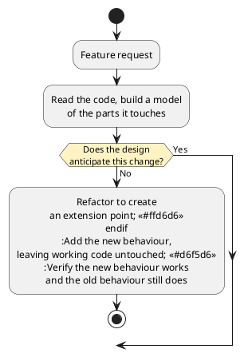

# Adding New Features

The previous chapter dealt with behaviour that was supposed to exist but did not, or that existed but was incorrect. This chapter deals with behaviour that does not exist yet. Requests for new behaviour keep arriving for as long as people use a system, and that is a sign of success.

This chapter brings together everything in Part 3. A request arrives for a system you did not write, or wrote so long ago that it seems new to you. Most of the work is reasoning about the system: building a model of it, working out where and how the design can accommodate the change, making the change without damaging the system in some unexpected way, and knowing when you are finished.

_How much a feature costs depends much less on the feature than on whether the design anticipated it._ Two requests of similar size, for the same system, can differ in effort by a factor of ten, and the difference is decided before either request arrives.

#### Two Requests

The tracker has been in production for a year, and two requests arrive in the same week.

> As a shopper, I want parcels from a sixth carrier to appear alongside the others, so that I still have one place to look.

> As a shopper, I want to be told when a parcel is delayed, so that I can act before it becomes a problem.

As requirements, these look similar. Each is one sentence, each is clearly worth doing, and a plan that estimated both at a couple of days would seem reasonable in a meeting. In practice, one of them will take a couple of hours, and the other will take much longer. The difference has nothing to do with notifications being harder than carriers.

## Feature Requests

A request states a need. It is neither a specification nor a design, and treating it as either is the first way this work goes wrong.

People who make requests usually cannot judge what they will cost, and the reason is structural rather than a failure of communication. Software has no physical form that shows its structure. If someone asks to move a wall in a building, everyone in the room understands that this is a bigger request than moving a desk, because the difference is visible. Code gives no such cue. As text, every line looks equally easy to edit, and nothing on the page distinguishes a line that forty other places depend on from a line that nothing calls. A request that cuts across the structure of a design looks exactly like one that follows it.

Software can be changed in ways a building cannot, and that is its main advantage. But being able to edit any line is not the same as being able to change any behaviour cheaply, and the difference is invisible from outside the code. Fred Brooks, whose distinction between essential and incidental complexity appeared in the [introduction](../why-this-course), counted both of these properties among the _essential_ difficulties of building software. He called them _changeability_, because software is always under pressure to change, and _invisibility_, because its structure cannot be seen. Better tools will not remove either one, because both come from software having no physical form. That is what makes any line easy to edit, and it is also what hides the cost of a change.

In practice, part of receiving a request is making its cost visible to the person who asked, as early as possible. They cannot get this information any other way: this request fits what the system was built to accommodate, and that one does not.

"Tell me when a parcel is delayed" raises many unanswered questions. What counts as delayed: later than the carrier's estimate, no movement for two days, or an explicit exception status? How should the shopper be told: email, push notification, or a badge in the app? How often should they be told if the parcel stays delayed for a week? Should they be told about every parcel, or only the ones they have asked to watch? None of these are implementation details. Each is a decision about what the feature _is_. If the requester does not make these decisions, a developer will end up guessing at them while writing the code.

Every chapter of this textbook has opened with a user story, which states a role, a goal, and a benefit. Turning a request into something buildable means writing a story like those, and adding acceptance criteria that are concrete enough to tell you when you are done. The questions to resolve before writing any code are the ones whose answers change the design:

- Who is this for, and what will they do differently once they have it?
- What does success look like, stated as something observable?
- What is explicitly _not_ included?

The last question is easy to skip, but without an answer the feature has no stated boundary, and a feature with no stated boundary grows while it is being built, because every related improvement looks small from inside the work.

"This should not be built here" is also a legitimate answer. A request that would add a payment provider to a parcel tracker, or that duplicates something another team already publishes, is better answered with a conversation than with code.

## Reading Unfamiliar Code

Assume you did not write the system. It is the normal case, and the one to practise. The goal is narrower than it might seem: you need a model of the parts the change touches, not an understanding of the whole program. On a system of any size, waiting until you understand everything means never starting.

The following approaches are listed roughly in order of how much they return for the time spent:

_Follow one real path from start to finish._ Pick one operation a user performs, start at the entry point, and trace it through to where it produces a result. One complete path teaches you more about how a system is organised than an hour of reading files in whatever order the editor lists them.

_Read the tests._ A test suite is an executable description of what the code promises, written by somebody who had to be specific. Tests also show the intended way to construct objects and use the system, which is often easier to learn from than the implementation.

_Read the types and the data first._ The shapes of the data constrain what the logic can do. A `Shipment` with three fields tells you a lot about what the tracker can and cannot report before you read a single function.

_Follow the dependency graph, not the file listing._ The arrows from the coupling chapter show what depends on what, and that is the structure to learn.

_Run it in the debugger._ Watching one path execute with real values corrects a mental model faster than reading, as the previous chapter argued.

Here is the first approach applied to the tracker. The screen calls `tracker.locate({ trackingNumber: "Z2200417" })`. The request names no carrier, so `locate` asks each `CarrierClient` in its list in turn. Each of those is an adapter for one carrier's web service, so `CarrierCClient.track` builds a URL, calls `fetch`, and converts the response, mapping the carrier's own status words to the `ShipmentStatus` values the rest of the system uses. The adapter returns a `Result<Shipment, string>`. `locate` returns a successful result as it is, and turns failures into the `TrackingError` cases documented in the API design chapter.

After four files, there is already enough to work with. A carrier is named in exactly two places: its adapter, and the list of carriers passed to the `ParcelTracker` constructor. A raw status is converted to a `ShipmentStatus` in one place for each carrier, inside its adapter. A shipment first exists as a value this system understands when an adapter returns it, which is the earliest point where anything about it could be noticed. The first request will only need the first of these facts. The second request needs the third.

Two habits help. First, trust tests that run over comments that do not, because a comment can be years out of date but a passing test cannot. Second, when you notice the code disagreeing with its documentation, write the disagreement down. It is either a defect or a place where the documentation misled you, and both matter to the next reader.

<details class="tooltip link-110">
<summary>The Wish List, Again</summary>

CPSC 110 gave you a technique for working on something you cannot finish yet. When a function needed a helper that did not exist, you wrote the helper's signature and purpose on a wish list, called it as though it were finished, and continued with the function you had set out to write.

Reading an unfamiliar system needs a similar discipline. You will often encounter things you do not understand, and investigating each one immediately turns a two-hour orientation into a two-day one that ends nowhere near the change you came to make. Keep a list instead. Note what the thing appears to do, note that you have not checked it, and continue along the path you were following. Most entries turn out not to matter for this change, and you can investigate the few that do once you know why you need them.

</details>

## Extension Points

Once you have a model of the relevant parts, the design question is where the change belongs. The most useful way to ask that question is: _where did the existing design anticipate a change of this kind?_

Such a place is an _extension point_, the term the Open/Closed chapter used for a place where behaviour can be varied by adding code rather than editing existing code. That chapter looked at extension points from the point of view of the person creating one, who chooses an axis of change and decides whether the indirection is justified. This chapter looks at them from the point of view of someone who has inherited a design and needs to know what changes it will accept. Extension points are also called _seams_, which is the term used in much of the industry literature.

The last two parts of the textbook have built several kinds of extension point, and they are easy to recognise:

- An interface with more than one implementation. New behaviour is added as a new implementation.
- An abstract class with subclasses, where the base class defines a sequence of steps and leaves some of them for subclasses to fill in.
- A collaborator passed in through a constructor rather than created internally, which can be replaced with a different one.
- A _composition root_, the one place where concrete classes are chosen and connected, from the consuming data chapter. This is where a new choice is registered.

All four rely on separation of concerns, from the coupling chapter. An extension point exists wherever a concern has been given its own place behind a contract, such as delivery over a channel, retrieval from a carrier, or formatting a message. A concern with its own boundary can be replaced through that boundary. A concern tangled into a class that does three other things cannot be changed without changing the other three.

When a request fits an extension point, the work is small. The sixth carrier is such a request. The refactoring chapter restored `CarrierClient` as a real contract, with each adapter handling its own carrier's vocabulary, so the change is one new class:

```typescript
class CarrierFClient implements CarrierClient {
    private readonly baseUrl: string;

    constructor(baseUrl: string) {
        this.baseUrl = baseUrl;
    }

    async track(trackingNumber: string): Promise<Result<Shipment, string>> {
        // this carrier's URL scheme, its JSON, its status vocabulary
    }
}
```

and one line where the system is assembled:

```typescript
const tracker = new ParcelTracker([
    new CarrierAClient("https://api.carrier-a.example"),
    // ... four more ...
    new CarrierFClient("https://api.carrier-f.example")
]);
```

As a diff, the change is one new file, one line added where the list of carriers is assembled, and one new test file. Nothing else changes. `ParcelTracker` does not change, no existing adapter changes, and no existing test changes, so no existing behaviour can regress. The Open/Closed Principle promised this benefit several chapters ago. The system grew by addition alone, and the only new tests are the ones for the new carrier.

The work that made this change cheap was done earlier, when somebody defined `CarrierClient` instead of calling carriers directly, and when the refactoring chapter moved the status vocabulary back out of the middle of the system.

## No Extension Point

The notification request has no such extension point, and this is the usual case. No design anticipates everything, and a design that tried would be unusable.

### Forcing the Change In

The tracker has no concept of a shipment being _watched_ over time, no point at which "something happened to this parcel" is treated as an event, and no place from which a message could be sent. One obvious way to force the feature in is:

```typescript
class ParcelTracker {
    async locate(request: TrackingRequest, notifier?: Notifier): Promise<Result<Shipment, TrackingError>> {
        // ... find the shipment as before ...
        if (notifier !== undefined) {
            if (found.ok === true && found.value.status === "exception") {
                notifier.send("Your parcel is delayed");
            }
        }
        return found;
    }
}
```

This works, but it contains three separate mistakes, each of which an earlier chapter warned against.

First, it gives `locate` a side effect. Calling `locate` used to change nothing, so it could be called as often as needed. Now any caller that passes a `Notifier` sends a message every time it looks up a delayed parcel. If the screen that refreshes every thirty seconds passes one, the shopper is told about the same delay every thirty seconds.

Second, it passes a parameter through code that does not need it. Any code that wants notifications has to get a `Notifier` to every place that calls `locate`, so code between the screen and the tracker has to carry a `Notifier` it never uses. This is how the scattering from the coupling chapter is created, one parameter at a time.

Third, it puts the delay rule in the wrong place. What counts as delayed is a policy, and it now lives inside the tracker's lookup method, where the next policy question will be added beside it as another conditional.

<details class="tooltip deep-dive">
<summary>Commands and Queries</summary>

The first of those problems has a name. **Command-query separation** is the guideline that a method should either return a value or change something, but not both. A _query_ answers a question and changes nothing. A _command_ changes something and returns nothing.

Keeping them apart makes queries safe. A query can be called twice, called from a test, called in a loop, or not called at all, and none of those choices has any visible effect. Once a method both answers a question and changes something, every caller has to know that calling it has an effect, and it can no longer be called freely.

`locate` was a query. The change above made it a command that also returns an answer, and the resulting problems are the usual ones. A caller that refreshes the display now sends notifications, and a test that exercises lookups now has to consider notifications too. When a feature seems to require a query to start changing things, that change usually belongs somewhere else.

</details>

### Refactoring First

The alternative is the sequence the refactoring chapter recommended: make the change easy, then make the easy change. That means two pieces of work in a deliberate order, and the first one adds no feature at all.

_First, create the extension point._ The tracker needs a place where it announces each shipment it observes, and anything interested in those observations needs a contract to implement. This is the observer design from the coupling chapter, used here so that the tracker does not need to know what anyone does with the information:

```typescript
/**
 * Notified whenever the current state of a shipment has been retrieved.
 */
interface ShipmentObserver {
    /**
     * Called after a shipment has been successfully looked up.
     *
     * @param {Shipment} shipment the state the carrier reported
     */
    shipmentObserved(shipment: Shipment): void;
}
```

```typescript
class ParcelTracker {
    private readonly carriers: CarrierClient[];
    private readonly observers: ShipmentObserver[];

    constructor(carriers: CarrierClient[], observers: ShipmentObserver[] = []) {
        this.carriers = carriers;
        this.observers = observers;
    }

    async locate(request: TrackingRequest): Promise<Result<Shipment, TrackingError>> {
        // ... find the shipment exactly as before ...
        if (found.ok === true) {
            for (const observer of this.observers) {
                observer.shipmentObserved(found.value);
            }
        }
        return found;
    }
}
```

With no observers supplied, the loop runs zero times, and the system behaves exactly as it did before. The existing suite confirms this by passing unchanged, which is the evidence that this commit was a refactoring. For every current caller, `locate` is still a query.

_Then, make the easy change._ The feature is now a class that implements the contract. It holds whatever state the delay rule needs, and it sends messages using the notification channel from [Part 2](../part2/index):

```typescript
class DelayNotifier implements ShipmentObserver {
    private readonly channel: Notifier;
    private readonly lastSeen: Map<string, ShipmentStatus>;

    constructor(channel: Notifier) {
        this.channel = channel;
        this.lastSeen = new Map<string, ShipmentStatus>();
    }

    public shipmentObserved(shipment: Shipment): void {
        const previous = this.lastSeen.get(shipment.trackingNumber);
        this.lastSeen.set(shipment.trackingNumber, shipment.status);

        if (previous === "exception") {
            return; // already told them
        }
        if (shipment.status === "exception") {
            this.channel.send("Your parcel " + shipment.trackingNumber + " is delayed.");
        }
    }
}
```

The only other change is one line at the composition root, where the `DelayNotifier` is passed in alongside the carriers.

Compare this result with the version that was forced in. `locate` no longer decides whether to send anything. It announces what it observed, and a repeated lookup of a delayed parcel does not produce repeated messages, because `DelayNotifier` remembers what it has already reported. No caller carries a `Notifier` it does not use. The delay policy lives in one class named for it, so changing what counts as delayed means editing that class and nothing else. The tracker knows nothing about notifications, so the next observer, such as an analytics recorder or an audit log, is another new class and requires no other changes.

As a diff, the notification feature is larger than the new carrier was. The new carrier changed no existing file. This feature adds a new contract and edits `ParcelTracker` to announce observations through it, although no existing caller or test has to change, because the new constructor parameter has a default value. That structural work changes no behaviour, so it goes in its own commit, separate from the commit that adds `DelayNotifier`. As the refactoring chapter argued, two commits that each make one kind of change can be reviewed, and if necessary reverted, one at a time.

<details class="tooltip deep-dive">
<summary>When the Refactoring Is Too Large</summary>

The advice to refactor first assumes that the refactoring is in proportion to the feature. Sometimes it is not. For example, creating the extension point a feature needs might take three weeks, while the feature is only worth two days.

This situation requires a decision, and the decision should be made deliberately rather than discovered halfway through the work. The options are to build the feature awkwardly and record the debt, to schedule the restructuring as its own piece of work with the feature waiting for it, or to decline the feature until something else makes the restructuring worthwhile.

Whichever option you choose, make the choice visible. Taking the awkward route knowingly, with the reason written down where the next person will find it, is ordinary engineering. Taking it because nobody considered the alternative is how a system ends up in the state described at the start of the refactoring chapter.

</details>

## Making the Change

Both routes follow the same overall process:


<!-- caption="Adding a feature. The design either anticipated the change or it must first be made to." -->

Before changing anything, find out who else is affected. Other callers, other teams, and anything published all limit what you can do. If the change affects a published API, apply the compatibility analysis from the API design chapter before writing any code.

Then break the work into steps that each leave the system working and tested, as the refactoring chapter did for structural change. Do the uncertain parts early, while there is still time to change approach. If the delay rule turns out to need data the carriers do not provide, it is much better to discover that on the first afternoon than the last.

## When a Feature Is Done

A feature is not done just because the code you wrote works, and features are often shipped half-finished because of this misunderstanding. A feature is done when:

- The new behaviour has tests, including tests for its failure cases. What happens when the notification channel is unavailable is part of the feature.
- The whole regression suite passes. The suite is the evidence that a change added something without breaking anything, which completes the argument from [Chapter 9](../part1/09_validation).
- Documentation and contracts are updated. If a class gained state, its invariant is stated. If a published surface changed, its documentation changed with it.
- No new code smells were introduced, by the standards of the refactoring chapter.
- Most importantly in the long run, _the next feature is not harder because of this one_.

The last criterion distinguishes a feature that was added cleanly from one that was forced in. The tracker now has an observer extension point it did not have before, so the next request of this kind will be cheap. If the notification had been forced in as a parameter and a conditional, the system would have been slightly worse afterwards, and the next request slightly more expensive. Repeated over many features, this is how a codebase becomes one that nobody wants to work in.

#### What This Was All For

This is the last chapter of the textbook, so it ends by looking back at what the course has covered.

[Part 1](../part1/index) was about making programs correct: modelling information as types, stating contracts, maintaining invariants, and validating behaviour with tests. [Part 2](../part2/index) was about abstraction: bundling state with the operations that protect it, decomposing systems into cohesive classes, hiding what varies, and depending on contracts rather than implementations. Part 3 was about evolution: managing dependencies, working across boundaries you do not control, and changing systems that already exist.

Most of this material makes a single argument. Invariants, cohesion, encapsulation, interfaces, polymorphism, low coupling, validated boundaries, small published surfaces, and regression suites were each introduced for their own reasons, but all of them affect how easily a design can change. A class that protects its invariant can be modified without checking the whole program. A small contract is a promise you can keep while the implementation changes. A test suite makes any change checkable. Several of these ideas also help a program be correct, but together they determine what the program will cost to change.

That is why this chapter comes last. Adding a feature to a system you did not write requires you to read unfamiliar code, judge a design that is not your own, decide whether it will accept the change, restructure it if it will not, and check that your changes did not break anything that was working before. These tasks are closely connected, and together they make up most of professional software work.

The [introduction](../why-this-course) to this textbook argued that the skill of software construction still matters, whoever or whatever writes the code, because someone has to decide what to build, judge whether it is correct, and keep it changeable. If this course has done its job, you can now read code you did not write, state precisely what it should do, and change it with confidence. Later courses build on this for larger systems, more people, and longer timescales. The judgement required of you stays the same, and only the scale changes.

<details class="tooltip exercise">
  <summary>Exercise: A Feature for the Library System</summary>

You have inherited a library lending system. It tracks members, holdings, and loans, and it works.

```typescript
interface OverdueRule {
    isOverdue(loan: Loan, now: number): boolean;
}

class LendingDesk {
    private readonly loans: LoanStore;
    private readonly rule: OverdueRule;

    constructor(loans: LoanStore, rule: OverdueRule) { /* ... */ }

    checkOut(memberId: string, holdingId: string, now: number): Result<Loan, string> { /* ... */ }
    renew(loanId: string, now: number): Result<Loan, string> { /* ... */ }
    overdueLoans(now: number): Loan[] { /* ... */ }
}
```

Two requests arrive.

> As a librarian, I want short-loan items to become overdue after two days instead of three weeks, so that high-demand books circulate faster.

> As a member, I want to be told when an item I have reserved becomes available, so that I do not have to keep checking.

Work through the following:

1. _Sharpen the requests._ For each, write the questions you would need answered before building it, and say which answers would change the design rather than only the implementation. Give an acceptance criterion for each that is concrete enough to test.
2. _Predict the cost._ Before designing anything, say which request you expect to be cheap and which you expect to be expensive. Justify your answer using the code above rather than the wording of the requests.
3. _Use the extension point._ One request fits an extension point this design already has. Identify it, and describe the change in terms of which files are created and which existing files are edited.
4. _Find the missing extension point._ The other request has no extension point. Write the version that forces it in, then name at least three specific problems with it, drawing on this chapter and earlier ones.
5. _Create the extension point, then use it._ Describe the two commits: the structural one that adds no feature, and the behavioural one that adds it. Say exactly what evidence would show that the first commit changed no behaviour.
6. _Judge completion._ List what would have to be true for you to call the second request done. Then answer the long-term question: is the next feature of this kind cheaper or more expensive than it was before you started?

</details>
