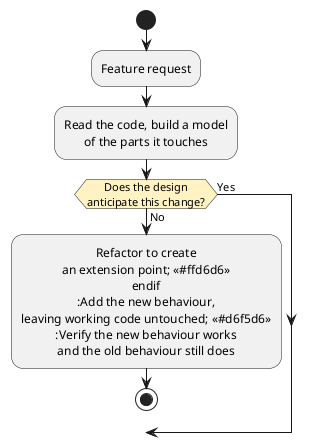

# Adding New Features

The previous chapter dealt with behaviour that was supposed to exist and did not (or existed, but incorrectly). This chapter deals with behaviours that do not yet exist.

Requests for them never stop arriving, and that is a property of successful software rather than a nuisance within it. A system that people use is a system whose users keep discovering things it should also do, and whose surroundings keep moving underneath it: the services it calls change, the platforms it runs on are deprecated, the rules governing its data are rewritten. Absorbing all of that is the ordinary condition of a working system. A system that has stopped changing is not a finished one, it is one that nobody depends on any more, and the absence of new requests is a symptom rather than an achievement. The ability to keep absorbing change is therefore not a refinement to be added once the important work is done; over a long enough life it _is_ the important work.

This is the culmination of what Part 3 has been about. A request arrives for a system you did not write, or wrote long enough ago that it might as well be new to you. Most of the work is not typing. It is reasoning about the system to build a model of it, working out where and how the design can accommodate the change, making the change without degrading the system in some unexpected way, and knowing when you are finished.

This chapter is mostly about a single observation: _how much a feature costs depends far less on the feature than on whether the design anticipated it_. Two requests of similar size, against the same system, can differ in the effort required to complete them by a factor of ten, and the difference is decided before either request arrives.

## Two Requests

The tracker has been in production for a year, and two requests land in the same week.

> As a shopper, I want parcels from a sixth carrier to appear alongside the others, so that I still have one place to look.

> As a shopper, I want to be told when a parcel is delayed, so that I can act before it becomes a problem.

Read as requirements, these are comparable. Each is one sentence, each is clearly worth doing, and a plan estimating both at a couple of days would look reasonable in a meeting. In reality, completing one of them will take a couple of hours. The other will not, and the reason has nothing to do with notifications being intrinsically harder than carriers.

## What a Feature Request Contains

A request states a need. It is not a specification, and it is not a design, and treating it as either is the first way this work goes wrong.

It is worth understanding why requests so reliably misjudge their own cost, because the reason is structural rather than a failure of communication. Software has no physical form that advertises its shape. Ask to move a wall in a building and everyone in the room understands that this is a larger request than moving a desk, because the difference is visible to anyone standing there. Code offers no such cue. Read as text, every line looks equally editable, and nothing on the page distinguishes the one that forty other places depend on from the one that nothing calls. A request that cuts directly across the grain of a design is indistinguishable, in the asking, from one that follows it.

Software's malleability is not an illusion, which is exactly what makes this difficult. It can be changed in ways a building cannot, and that is the medium's central advantage. But being able to edit any line is not the same as being able to change any behaviour cheaply, and the gap between those two things is invisible from outside the code. This is why changeability is an _essential_ difficulty of building software rather than an incidental one: it is not a problem better tools will remove, because the thing that makes software valuable is the same thing that hides what a change will cost.

The practical consequence is that part of receiving a request is making that cost visible, early, to the person who asked. Not as a refusal, and not as a complaint about the existing design, but as information they cannot obtain any other way: this request follows what the system was built to accommodate, and that one does not.

"Tell me when a parcel is delayed" just brings up a whole lot of unanswered questions. What counts as delayed: later than the carrier's estimate, or no movement for two days, or an explicit exception status? Told how: email, push notification, a badge in the app? Told how often, if the parcel stays delayed for a week? Told about every parcel, or only ones the shopper has asked to watch? None of these are implementation details. Each is a decision about what the feature _is_, and each will be decided by somebody. The only question is whether that somebody is the requester, or a developer guessing at midnight.

Turning a request into something buildable is the user-story work from [Part 1](../part1/index): a role, a goal, a benefit, and acceptance criteria concrete enough to tell you when you are done. The questions worth resolving before any code is written are the ones whose answers change the design:

- Who is this for, and what will they do differently once they have it?
- What does success look like, stated as something observable?
- What is explicitly _not_ included?

That last question is the one most often skipped but in practice is the most useful. A feature with no stated boundary expands while it is being built, because every adjacent improvement looks small from inside the work.

Notably, "this should not be built here" is a legitimate answer. A request that would drag a payment provider into a parcel tracker, or that duplicates something another team already publishes, is better answered with a conversation than with code.

## Reading Unfamiliar Code

Assume you did not write the system. This is the normal case and the one worth practising, and the goal is narrower than it first appears: you need a model of the parts the change touches, not an understanding of the whole program. Waiting for complete understanding on a system of any size means never starting.

A few approaches, roughly in order of how much they return for the time spent:

_Follow one real path end to end._ Pick a single operation a user performs, start at the entry point, and trace it through to where it produces a result. One complete path teaches more about how a system is organised than an hour of reading files in whatever order the editor lists them.

_Read the tests._ A test suite is an executable description of what the code promises, written by somebody who had to be specific. Tests also show the intended way to construct objects and drive the system, which is often faster to learn from than the implementation.

_Read the types and the data first._ The shapes constrain what the logic can be doing. A `Shipment` with three fields tells you a good deal about what the tracker can and cannot report before you read a single function.

_Follow the dependency graph, not the file listing._ The arrows from the coupling chapter say what depends on what, and that is the structure worth learning. Alphabetical order is not a structure.

_Run it in the debugger._ Watching one path execute, with real values, corrects a mental model faster than reading, which is the same argument the previous chapter made.

The first of those is worth simulating. The screen calls `ParcelTracker.locate("Z2200417")`. `locate` names no carrier: it holds a list of `CarrierClient` and asks each in turn. Each of those is an adapter over one carrier's web service, so `CarrierBClient.track` builds a URL, calls `fetch`, and converts the reply, mapping that carrier's own status words into the `ShipmentStatus` the rest of the system uses. What comes back out is a `Result<Shipment, string>`, which `locate` returns unchanged.

Just looking at four files and we already have insight. A carrier is named in exactly two places, its adapter and the list `locate` is handed. A raw status becomes a `ShipmentStatus` in exactly one, inside each adapter. And a shipment first exists as a value this system understands at the adapter boundary, which is the earliest point where anything could be noticed about it. The first request will turn out to need only the first of those facts; the second needs the third.

Cultivating two habits in this space can make this process more deterministic. Trust tests that run over comments that do not, since a comment can be years out of date and a passing test cannot. And when you notice the code disagreeing with its documentation, write the disagreement down: it is either a defect, or a place the documentation misled you, and both matter to whoever reads next (which can be you, in another six months).

<details class="tooltip link-110">
<summary>The Wish List, Again</summary>

CPSC 110 gave you a technique for working on something you cannot finish yet. When a function needed a helper that did not exist, you wrote the helper's signature and purpose onto a wish list, called it as though it were finished, and carried on with the function you had set out to write.

Reading an unfamiliar system needs the same discipline in reverse. You will constantly encounter things you do not understand, and chasing each one immediately turns a two-hour orientation into a two-day one that ends nowhere near the change you came to make. Keep a list instead: note what the thing appears to do, note that you have not verified it, and continue on the path you were following. Most entries turn out not to matter for this change, and the few that do can be investigated when you know why you need them.

</details>

## Finding the Extension Point

With a model of the relevant parts, the design question is where the change belongs, and the useful form of that question is: _where did the existing design anticipate a change of this kind?_

Such a place is an _extension point_, the term the Open/Closed chapter used for a boundary where behaviour can be varied by adding code rather than editing what is already there. That chapter approached them from the side of the person building one, choosing an axis of change and deciding whether the indirection was justified. Here we approach them from the other side, as somebody who has inherited a design and needs to know what it will accept. You will also hear them called _seams_, which is the term used in much of the industry literature.

The textbook has been building them for two parts, and they are recognisable on sight:

- An interface with more than one implementation. New behaviour is a new implementation.
- An abstract class with subclasses, where the base defines a sequence and leaves steps open.
- A collaborator supplied through a constructor rather than constructed internally, which can be replaced with a different one.
- A composition root where concrete classes are chosen, which is where a new choice gets registered.

Underneath all four is the idea the coupling chapter named. An extension point exists exactly where a concern was given a home of its own behind a contract: delivery over a channel, retrieval from a carrier, formatting of a message. Separating a concern is what creates the possibility of varying it later, because a concern with its own boundary can be replaced through that boundary, and one tangled into a class that also does three other things cannot be touched without touching the other three. This is why the two chapters describe the same property from opposite ends. Separation of concerns is a claim about how a design is organised today; an extension point is what that organisation is worth when a request arrives tomorrow.

When a request lands on an extension point, the work is small. The sixth carrier is such a request. The refactoring chapter left `CarrierClient` as a genuine contract again, with each adapter owning its own carrier's vocabulary, so the change is one new class:

```typescript
class CarrierFClient implements CarrierClient {
    private readonly baseUrl: string;

    constructor(baseUrl: string) {
        this.baseUrl = baseUrl;
    }

    async track(trackingNumber: string): Promise<Result<Shipment, string>> {
        // this carrier's URL scheme, its JSON, its status vocabulary
    }
}
```

and one line where the system is assembled:

```typescript
const tracker = new ParcelTracker([
    new CarrierAClient("https://api.carrier-a.example"),
    // ... four more ...
    new CarrierFClient("https://api.carrier-f.example")
]);
```

Counted as a diff, that is one new file, one line added where the list of clients is assembled, and one new test file. Nothing else is touched: `ParcelTracker` does not change, no existing adapter changes, and no existing test changes, which means no existing behaviour can regress. This is the Open/Closed Principle collecting on a promise made several chapters ago: the system grew by addition rather than by disturbance, and the new tests are only the ones for the new carrier.

It is worth being clear about when that property was created. Not this week. It was created when somebody defined `CarrierClient` instead of calling carriers directly, and preserved when the refactoring chapter moved the status vocabulary back out of the middle of the system. Today's cheap change was paid for earlier.

## When There Is No Extension Point

The notification request has no such landing place, and this is the ordinary case rather than the exception. No design anticipates everything, and a system that tried would be unusable.

The tracker has no notion of a shipment being _watched_ over time, no point at which "something happened to this parcel" is an event, and nowhere that a message could be sent from. There is one obvious way to force it in:

```typescript
class ParcelTracker {
    async locate(trackingNumber: string, notifier?: Notifier): Promise<Result<Shipment, string>> {
        // ... find the shipment as before ...
        if (notifier !== undefined) {
            if (found.value.status === "exception") {
                notifier.send("Your parcel is delayed");
            }
        }
        return found;
    }
}
```

It works. It is also three separate mistakes, each recognisable from an earlier chapter.

It gives `locate` a side effect. The method was a question, and asking a question twice gave the same answer and changed nothing; now asking it sends mail. Every existing caller has acquired behaviour nobody asked for, including the screen that refreshes every thirty seconds and the tests that call it in a loop.

It threads a parameter through code that does not want it. Anything that calls `locate` now has to hold a `Notifier` in order to pass one along, whether or not it cares, which is how the scattering from the coupling chapter is created one parameter at a time.

And it puts the delay rule in the wrong place. What counts as delayed is a policy, and it now lives inside the tracker's lookup method, where the next policy question will be added beside it as another conditional.

<details class="tooltip deep-dive">
<summary>Commands and Queries</summary>

The first of those problems has a name worth knowing. **Command-query separation** is the guideline that a method should either return a value or change something, and not both: a _query_ answers a question and leaves the world alone, and a _command_ changes the world and returns nothing.

The value of keeping them apart is that queries become safe. A query can be called twice, called from a test, called from a loop, or not called at all, and none of that is observable. Once a method both answers and acts, every caller has to know that calling it does something, and the freedom to ask casually is gone.

`locate` was a query. The change above made it a command that also answers, and the resulting hazards are the standard ones: a caller that refreshes the display now sends notifications, and a test that exercises lookups now has to think about mail. When a feature seems to require a query to start acting, that is usually a signal that the acting belongs somewhere else.

</details>

The alternative is the sequence the refactoring chapter argued for: make the change easy, then make the easy change. That means two pieces of work in a deliberate order, with the first one adding no feature at all.

_First, create the extension point._ The tracker needs a point where an observation of a shipment is announced, and parties interested in observations need a contract to implement. This is the observer arrangement from the coupling chapter, used here to keep the tracker ignorant of what anyone does with its news:

```typescript
/**
 * Notified whenever the current state of a shipment has been retrieved.
 */
interface ShipmentObserver {
    /**
     * Called after a shipment has been successfully looked up.
     *
     * @param {Shipment} shipment the state the carrier reported
     */
    shipmentObserved(shipment: Shipment): void;
}
```

```typescript
class ParcelTracker {
    private readonly carriers: CarrierClient[];
    private readonly observers: ShipmentObserver[];

    constructor(carriers: CarrierClient[], observers: ShipmentObserver[] = []) {
        this.carriers = carriers;
        this.observers = observers;
    }

    async locate(trackingNumber: string): Promise<Result<Shipment, string>> {
        // ... find the shipment exactly as before ...
        if (found.ok === true) {
            for (const observer of this.observers) {
                observer.shipmentObserved(found.value);
            }
        }
        return found;
    }
}
```

This commit adds no feature. With no observers supplied, the loop runs zero times and the system behaves exactly as it did, which is what the existing suite confirms: it passes unchanged, and it passed unchanged is the evidence that this was a refactoring. `locate` is still a query as far as any current caller is concerned.

_Then, make the easy change._ The feature is now a class that implements the contract, holding whatever state the delay rule needs and using the notification channel from [Part 2](../part2/index) to send:

```typescript
class DelayNotifier implements ShipmentObserver {
    private readonly channel: Notifier;
    private readonly lastSeen: Map<string, ShipmentStatus>;

    constructor(channel: Notifier) {
        this.channel = channel;
        this.lastSeen = new Map<string, ShipmentStatus>();
    }

    public shipmentObserved(shipment: Shipment): void {
        const previous = this.lastSeen.get(shipment.trackingNumber);
        this.lastSeen.set(shipment.trackingNumber, shipment.status);

        if (previous === "exception") {
            return; // already told them
        }
        if (shipment.status === "exception") {
            this.channel.send("Your parcel " + shipment.trackingNumber + " is delayed.");
        }
    }
}
```

and one more line at the composition root, where it is handed in alongside the carriers.

Compare the result with the version that was forced in. `locate` is a query again. No caller carries a `Notifier` it does not use. The delay policy lives in one class named for it, so changing what counts as delayed means editing that class and nothing else. And the tracker knows nothing about notifications, which means the next observer, an analytics recorder or an audit log, is another new class and no further change.

The reason to split this into two commits rather than one is worth stating plainly. The first changes structure and no behaviour; the second changes behaviour and no structure. Reviewed separately, each is easy to judge. Combined into one commit, a reviewer cannot tell which lines are the feature and which are the rearrangement, and if something breaks, reverting means losing both.

<details class="tooltip deep-dive">
<summary>When the Refactoring Is Too Large</summary>

The advice to refactor first assumes the refactoring is proportionate. Sometimes it is not: the extension point a feature needs would take three weeks to create, and the feature is worth two days.

That situation is a decision, not a technicality, and it needs to be made deliberately rather than discovered halfway through. The options are to build the feature awkwardly and record the debt, to do the restructuring as its own piece of scheduled work with the feature waiting behind it, or to decline the feature until something else makes the restructuring worthwhile.

What matters is that the choice is visible. Taking the awkward route knowingly, with the reason written down where the next person will find it, is ordinary engineering. Taking it because nobody looked at the alternative is how a system arrives at the state the refactoring chapter opened with.

</details>

Both requests can now be counted. The sixth carrier is one new file, one line of wiring, and one new test file, with no existing file edited. The notification is two pieces of work: an extension point that adds a contract, an announcement in `ParcelTracker`, and changes to the tests that construct it.

## Planning and Making the Change

Both routes to the change now converge, and the shape of the whole job is visible:


<!-- caption: "Adding a feature. The design either anticipated the change or it must first be made to." -->

With the approach settled, the work is broken into steps, and the property that makes a plan good is that every step leaves the system working and tested. That is what allows the work to be interrupted, reviewed, or abandoned partway without leaving a mess, and it is the same discipline the refactoring chapter applied to structural change.

Two ordering heuristics help. Put the uncertain parts early, while there is still time to change approach: if the delay rule turns out to need data the carriers do not provide, that is far better discovered on the first afternoon than the last. And decide what you will test, and how you will know it works, before writing the code rather than after.

Before touching anything, establish who else is affected. Other callers, other teams, and anything published are all constraints on what you may do. If the change touches a published API, the compatibility analysis from the API design chapter applies before any code is written, because discovering that a signature change is breaking after it is written is discovering it too late.

While making the change, the habits are the ones the last two chapters established. Small commits with a passing suite at each one. Tests written first where doing so clarifies what the feature should do. A clean diff, with no incidental reformatting to hide the substance in. And documentation updated as part of the change, because a feature nobody can discover is not finished.

## Knowing When A Feature Is Done

"Done" is not "the code I wrote works", and the difference is worth being explicit about, since it is where features get shipped half-finished.

- The new behaviour has tests, including its failure cases. What happens when the channel is unavailable is part of the feature, not an afterthought.
- The whole regression suite passes, which is the verification chapter's argument arriving in its final form: the evidence that a change added something without removing anything.
- Documentation and contracts are updated. If a class gained state, its invariant is stated. If a published surface changed, its documentation changed with it.
- No new smells were introduced, by the standards of the refactoring chapter.
- And the test that matters most in the long run: _the next feature is not harder because of this one_.

That last criterion is the one that separates a feature that was added from a feature that was inserted. The tracker now has an observer extension point it did not have, so the next request of this kind is cheap. Had the notification been forced in as a parameter and a conditional, the system would have been slightly worse afterwards, and the following request slightly more expensive, which is the process by which a codebase becomes the one nobody wants to work in.

## What This Was All For

This is the end of the textbook, and it is worth revisiting what we've actually been learning here this term.

[Part 1](../part1/index) was about making programs correct: modelling information as types, stating contracts, maintaining invariants, and verifying behaviour with tests. [Part 2](../part2/index) was about abstraction: bundling state with the operations that protect it, decomposing systems into cohesive classes, hiding what varies, and depending on contracts rather than implementations. Part 3 has been about evolution: managing dependencies, working across boundaries you do not control, and the everyday practice of changing systems that already exist.

Read from here, most of that turns out to have been making a single argument. Invariants, cohesion, encapsulation, interfaces, polymorphism, low coupling, validated boundaries, small published surfaces, and a regression suite were each introduced for their own reasons, but every one of them was ultimately about the resistance of a design to change. A class that protects its invariant is a class you can modify without auditing the program. A small contract is a promise you can keep while the implementation moves. A test suite is what makes any change checkable. None of them make a program more correct today. But all of them taken together directly impact what it costs to correct a weak design tomorrow.

That is why this chapter is last, and why it touches upon everything we have discussed at once. Adding a feature to a system you did not write asks you to read unfamiliar code, judge a design that was not your own, decide whether it will accept the change, restructure it if it will not, and verify your changes did not break anything that was working before. Those are not five separate skills. They are one skill, and it is the one professional software work mostly consists of.

The introduction to this textbook claimed that the skill of software construction still matters because someone has to decide what to build, judge whether it is correct, and keep it changeable, whoever or whatever writes the code. If this course has done its job, you can now read code you did not write, state precisely what it should do, and change it with confidence. The courses that follow build outward from that, to larger systems, more people, and longer timescales. The judgement required of you is the same; only the scale changes.

<details class="tooltip exercise">
  <summary>Exercise: A Feature for the Library System</summary>

You have inherited a library lending system. It tracks members, holdings, and loans, and it works.

```typescript
interface OverdueRule {
    isOverdue(loan: Loan, now: number): boolean;
}

class LendingDesk {
    private readonly loans: LoanStore;
    private readonly rule: OverdueRule;

    constructor(loans: LoanStore, rule: OverdueRule) { /* ... */ }

    checkOut(memberId: string, holdingId: string, now: number): Result<Loan, string> { /* ... */ }
    renew(loanId: string, now: number): Result<Loan, string> { /* ... */ }
    overdueLoans(now: number): Loan[] { /* ... */ }
}
```

Two requests arrive.

> As a librarian, I want short-loan items to become overdue after two days instead of three weeks, so that high-demand books circulate faster.

> As a member, I want to be told when an item I have reserved becomes available, so that I do not have to keep checking.

Work through the following:

1. _Sharpen the requests._ For each, write the questions you would need answered before building it, and say which answers would change the design rather than only the implementation. Give an acceptance criterion for each that is concrete enough to test.
2. _Predict the cost._ Before designing anything, say which request you expect to be cheap and which expensive, and justify it from the code above rather than from the wording of the requests.
3. _Use the extension point._ One request lands on an extension point this design already has. Identify it, and describe the change in terms of which files are created and which existing files are edited.
4. _Find the missing extension point._ The other request has none. Write the version that forces it in, then name at least three specific problems with it, drawing on this chapter and earlier ones.
5. _Create the extension point, then use it._ Describe the two commits: the structural one that adds no feature, and the behavioural one that adds it. Say precisely what evidence would tell you the first commit changed no behaviour.
6. _Judge completion._ List what would have to be true for you to call the second request done, and then answer the long-run question: is the next feature of this kind cheaper or more expensive than it was before you started?

</details>
