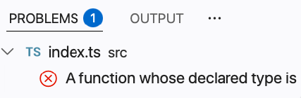
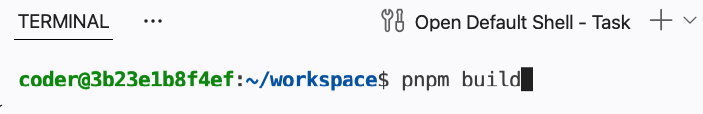
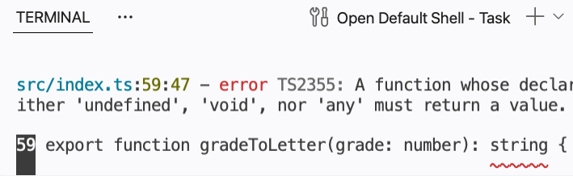
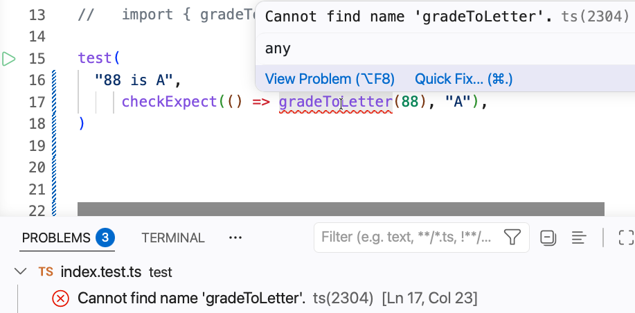
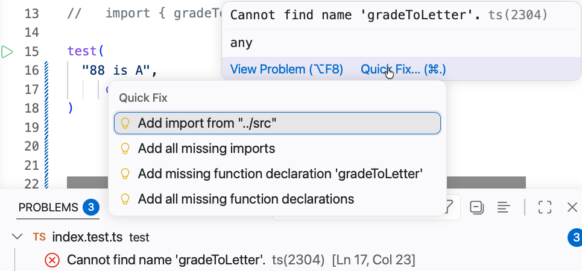
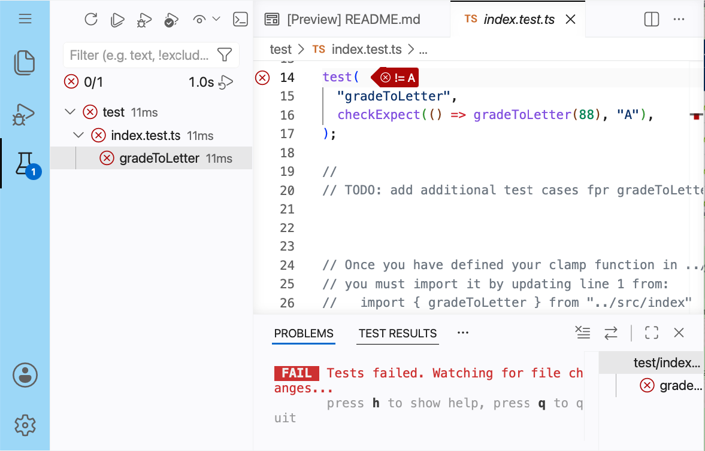
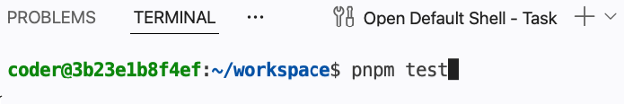
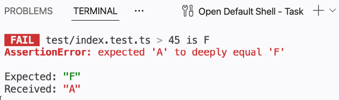
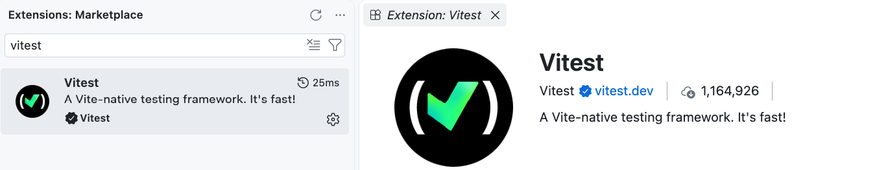
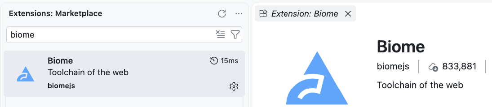

# Working Visual Studio Code (VSCode)

This document will help you get started with your VSCode environment.

In CPSC 210 we will interact with projects in two main ways: either through a browser-based version of VSCode (all lecture activities, midterms, and final exams, along with several labs), or through a standalone Integrated Development Environment (the project and a few labs). You can use any standalone IDE you like, such as VSCode, WebStorm, or IntelliJ.

Since VSCode will be used extensively, we will focus on that in this document; if you elect to use a different IDE, please adapt the instructions accordingly. If you have never used VSCode before, the official [introduction videos](https://code.visualstudio.com/docs/getstarted/introvideos) and [user interface overview](https://code.visualstudio.com/docs/getstarted/userinterface) are good places to start; this document focuses on the parts you will need for this course.

## Where Files Live

The **Explorer** (the top icon on the left-hand bar, or `Ctrl/Cmd+Shift+E`) shows the files in your workspace.


Every activity, midterm, and lab uses the same layout:

- `README.md`: The task list for what you are supposed to do. Read it first, and keep it open while you work.
- `src/`: The code you implement. The functions you must write are described in the JSDoc comment directly above each one.
- `test/`: Your tests. Most source files in `src/` have a matching test file here.
- `package.json`, `tsconfig.json`, `biome.json`, `vitest.config.ts`: Configuration files, sitting alongside `README.md` at the top of the workspace. Leave these alone; the grader supplies its own copies, so any change you make to them is discarded.

Your work is graded from `src/` and `test/`. Anything you write elsewhere in the workspace is ignored when you Save & Grade.

The browser workspace saves your files automatically a moment after you stop typing, but check before you click Save & Grade: an unsaved file shows a white dot instead of an `x` on its editor tab. `Ctrl/Cmd+S` saves the current file.

To open a file quickly without using the Explorer, press `Ctrl/Cmd+P` and start typing its name.

## Identifying Static Problems

Static problems are found without running your code, and come in two kinds: compilation errors and lint errors. Both correspond to the **static view** of a program described in the textbook, and both appear in the same places in VSCode.

### Compilation Errors

These are the problems the TypeScript compiler finds: a misspelled name, a missing `export`, a function called with the wrong kind of value, or a `return` of the wrong type. Two places show them:

- **In the editor.** Problem code is underlined in red, and the file name in the Explorer turns red with a count beside it. Hover over an underline to read the message.

  

- **In the Problems View** (`Ctrl/Cmd+Shift+M`, or the "Problems" tab in the panel along the bottom). This lists every problem in the workspace in one place. Click an entry to jump to the line. The VSCode documentation describes this in more detail under [Errors & warnings](https://code.visualstudio.com/docs/editing/editingevolved#_errors-warnings).

  

The same errors appear if you open the **Terminal View** (`` Ctrl/Cmd+` `` or the "Terminal" tab in the bottom panel; see [Terminal Basics](https://code.visualstudio.com/docs/terminal/basics) for more) and run:

```bash
pnpm build
```




The grader runs this too, and stops there if your code does not compile. An empty Problems View is the first thing to check before you Save & Grade.

Some activities deliberately start with compilation errors. When a file ships with a `never` type that you must replace, the errors are the assignment pointing at what to do, and they disappear once you have done it.

To fix a compilation error, go to the code that caused it and change it. Double-click the entry in the Problems View to get there, or use the file and line number from the terminal output.

Some errors also offer a quick fix, which the VSCode documentation calls a [Code Action](https://code.visualstudio.com/docs/editing/editingevolved#_code-action). Quick fixes are not offered for every error and do not always do what you want, but they are often the fastest route. Here is an error that offers one:




In this case the first two options fix the code and the last two do not. Read the options before choosing one; with practice you will recognise which kind of fix applies.

### Lint Errors

The Problems View also shows **lint** warnings from Biome, the linter and formatter this course uses. These are about style rather than correctness (indentation, unused imports, and the like), though they often point at problems that are hard to debug later. Most teams run a linter to keep their code consistent.

Most lint warnings can be fixed for you by running:

```bash
pnpm lint:fix
```

To see them in the terminal without fixing anything, run `pnpm lint` instead.

Lint warnings can also be fixed one at a time where they occur: click the underlined code, then the lightbulb that appears (or press `Ctrl/Cmd+.`) to see the quick fixes Biome offers. Never choose a quick fix that suppresses or ignores a rule. The grader scans for those suppressions and stops when it finds one.

## Identifying Dynamic Problems

Dynamic problems only appear when the code runs: a function that compiles but returns the wrong answer. The type checker cannot see these. Your tests can, and they correspond to the **dynamic view** of a program.

Tests run from the **Testing View** (the beaker icon on the left-hand bar). It lists every test file and every test inside it. The official [Testing](https://code.visualstudio.com/docs/debugtest/testing) documentation covers this view in depth.


- The **Run Tests** button at the top of the Testing View runs everything.

  

- A green check means a test passed. A red `x` means it failed; click it to see what the test expected and what your function actually returned.
- When a test file is open in the editor, each `test(...)` has a small green play arrow in the gutter to its left. Click it to run only that test. A red icon there means the last run of that test failed.

When a test fails, three places report it: the Testing View marks it in the left panel, the editor annotates the failing line, and the Test Results tab at the bottom prints what the test expected and what it got. Any of them will tell you why the test did not pass.



You can also use the Terminal View at the bottom of VSCode to invoke the tests and get feedback about what is passing or failing:

```bash
pnpm test
```




A few things to keep in mind:

- Tests that have not been written yet cannot fail. If the Testing View shows only passing tests, ask which cases you have not covered yet.
- A test should fail against a stub before you implement the function. If it passes anyway, the test is not checking what you think it is.
- Test files that do not compile do not run at all. If the Testing View looks empty or out of date, check the Problems View first.

## Installing VSCode

The lecture activities, midterms, and final exams run entirely in the browser workspace, which has everything set up. The project and a few of the labs are done on your own computer, so those need a standalone IDE. The steps below are for VSCode. Details vary by operating system, but the shape is the same.

1. _Git_: The project and several of the labs are distributed as Git repositories, so you need Git both to get a copy and to hand your work in. How you install it depends on your operating system:

   - _macOS_: run `git --version` in a terminal. If Git is not there, macOS offers to install the Command Line Tools for you. Accept, and let it finish.
   - _Windows_: download the installer from [git-scm.com](https://git-scm.com/downloads) and accept the defaults.
   - _Linux_: install it with your package manager, for example `sudo apt install git`.

   Check that it worked:

   ```bash
   git --version
   ```

   Then tell Git who you are. This is a one-time setup per computer, and every commit you make records it:

   ```bash
   git config --global user.name "Your Name"
   git config --global user.email "you@example.com"
   ```

2. _VSCode_: Download it from [code.visualstudio.com](https://code.visualstudio.com/) and install it as you would any application.
3. _Node_: Download the LTS/Krypton (v24) version from [nodejs.org](https://nodejs.org/). This installs `node` and `npm`.
4. _pnpm_: Once Node is installed, open a terminal and run:

   ```bash
   npm install -g pnpm
   ```

5. _VSCode Extensions_: Open the Extensions View in VSCode (the blocks icon on the left-hand bar). Extensions add language and tool support to VSCode, and the next two steps install the two this course relies on. The [Extension Marketplace](https://code.visualstudio.com/docs/configure/extensions/extension-marketplace) page explains how to find, install, and manage extensions. NOTE: you cannot install extensions in our VSCode web instance, only in your own standalone IDE. The web instance already has both of the extensions below.

   

6. _The Vitest extension_: In the Extensions View, search for "Vitest" and install the one published by Vitest. Without it the Testing View cannot find your tests.

   

7. _The Biome extension_: In the Extensions View, search for "Biome" and install the one published by biomejs. It is what puts lint warnings in the editor and the Problems View; without it, only compilation errors appear there, and you would have to run `pnpm lint` to see lint problems.

   

Once these steps are complete you are ready to open a project. If you cloned a repository, that clone is the folder you want. Choose **File > Open Folder** and pick the folder that contains the project's `package.json`. The first time you open a project, run `pnpm install` in the Terminal View to download its dependencies. After that, `pnpm build`, `pnpm test`, and `pnpm lint:fix` work exactly as they do in the browser workspace, and the Problems View and Testing View behave the same way.

Any repository we provision for you in this course will include the configuration files (`package.json`, `tsconfig.json`, `biome.json`, and `vitest.config.ts`) so those commands work out of the box. If you are working on your own personal project you will need to create them for yourself.

If you use a different IDE, you will still need Node.js and pnpm, and the `pnpm` commands above work from any terminal. The Problems View and Testing View have equivalents in WebStorm and IntelliJ, but their names and locations differ; consult that IDE's documentation.
